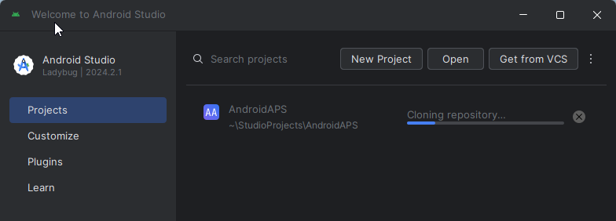
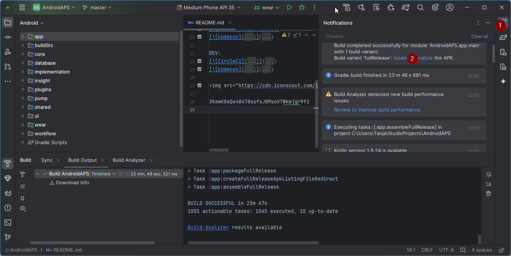

# 建置AAPS

## 自行建置，而不是下載

**由於醫療設備的相關規範，AAPS應用程式（apk檔案）無法下載。 你可以合法地建置應用程式供自己使用，但不得將副本提供給他人！**

詳情請參閱[FAQ頁面](../Getting-Started/FAQ.md)。

(建置APK推薦的電腦規格)=

## 建置AAPS所需的電腦和軟體規格

- Please use the **[Android Studio version called at least Hedgehog (2023.1.1) or one more recent like Iguana, Jellyfish, Koala or Ladybug](https://developer.android.com/studio/)** to build the apk. Older versions of Android Studio need to be updated first!
- [Windows 32位系統](troubleshooting_androidstudio-unable-to-start-daemon-process) 不受Android Studio支援。 請記住，**64位CPU和64位作業系統是必備條件。** 如果你的系統不符合此條件，你需要更換受影響的硬體或軟體，或更換整個系統。

<table class="tg">
<tbody>
  <tr>
    <th class="tg-baqh">OS (Only 64 bit)</th>
    <td class="tg-baqh">Windows 8 or higher</td>
    <td class="tg-baqh">Mac OS 10.14 or higher</td>
    <td class="tg-baqh">Any Linux supports Gnome, KDE, or Unity DE;&nbsp;&nbsp;GNU C Library 2.31 or later</td>
  </tr>
  <tr>
    <th class="tg-baqh"><p align="center">CPU (Only 64 bit)</th>
    <td class="tg-baqh">x86_64 CPU architecture; 2nd generation Intel Core or newer, or AMD CPU with support for a <br><a href="https://developer.android.com/studio/run/emulator-acceleration#vm-windows" target="_blank" rel="noopener noreferrer"><span style="text-decoration:var(--devsite-link-text-decoration,none)">Windows Hypervisor</span></a></td>
    <td class="tg-baqh">ARM-based chips, or 2nd generation Intel Core or newer with support for <br><a href="https://developer.android.com/studio/run/emulator-acceleration#vm-mac" target="_blank" rel="noopener noreferrer"><span style="text-decoration:var(--devsite-link-text-decoration,none)">Hypervisor.Framework</span></a></td>
    <td class="tg-baqh">x86_64 CPU architecture; 2nd generation Intel Core or newer, or AMD processor with support for AMD Virtualization (AMD-V) and SSSE3</td>
  </tr>
  <tr>
    <th class="tg-baqh"><p align="center">RAM</th>
    <td class="tg-baqh" colspan="3"><p align="center">8GB or more</td>
  </tr>
  <tr>
    <th class="tg-baqh"><p align="center">Disk</th>
    <td class="tg-baqh" colspan="3"><p align="center">At least 30GB free space. SSD is recommended.</td>
  </tr>
  <tr>
    <th class="tg-baqh"><p align="center">Resolution</th>
    <td class="tg-baqh" colspan="3"><p align="center">1280 x 800 Minimum <br></td>
  </tr>
  <tr>
    <th class="tg-baqh"><p align="center">Internet</th>
    <td class="tg-baqh" colspan="3"><p align="center">Broadband</td>
  </tr>
</tbody>
</table>

**強烈建議（非必須）使用SSD（固態硬碟）而非HDD（硬碟），因為這將減少建置AAPS apk檔案時所需的時間。** 你仍然可以在建置 **AAPS** apk檔案時使用HDD。 如果這樣做，建置過程可能需要很長時間才能完成，但一旦開始，你可以讓他無需監控地執行。

## 建置過程中的幫助與支援

如果你在建置 **AAPS** 應用程式的過程中遇到困難，請先參閱專門的[**故障排除Android Studio**](../Installing-AndroidAPS/troubleshooting_androidstudio) 部分。

If you think something in the building instructions is wrong, missing or confusing, or you are still struggling, please reach out to other **AAPS** users group on [Facebook](https://www.facebook.com/groups/AndroidAPSUsers) or [Discord](https://discord.gg/4fQUWHZ4Mw). 如果你想自行更改一些內容（例如更新螢幕截圖_等），請提交[拉取請求（PR）](../make-a-PR.md)。

## 建置AAPS應用程式的逐步指南

```{admonition} WARNING
:class: warning
如果你之前建置過 AAPS，則不需要再次執行以下所有步驟。
請直接跳至 [更新指南](../Installing-AndroidAPS/Update-to-new-version)!
```

建置 **AAPS** apk檔案的整體步驟如下：

4.1 [安裝Git](Install-Git)

4.2 [安裝Android Studio](Building-APK-install-android-studio)

4.3 [下載AAPS程式碼](Building-APK-download-AAPS-code)

4.4. [在Android Studio偏好設定中設置Git路徑](Building-APK-set-git-path-in-preferences)

4.5. [建置AAPS“簽章”apk](Building-APK-generate-signed-apk)

在本指南中，你將看到建置 **AAPS** apk檔案的_示例_螢幕截圖。 由於 **Android Studio**——我們用來建置 **AAPS** apk 的軟體——會定期更新，這些截圖可能與你的安裝不完全相同，但他們仍應該可以參照進行。

由於 **Android Studio** 可在Windows、Mac OS X和Linux平台上運作，這些平台之間的步驟可能也會有些許差異。

(安裝Git)=

### 安裝Git（如果你還沒有安裝）

```{admonition} Why Git? 
:class: dropdown

Git 被稱為「_版本控制系統_」（VCS）。
Git 是一個允許你追蹤代碼變更和與他人合作的程式。你將使用 Git 從 GitHub 網站將 **AAPS** 原始碼的副本複製到你本地計算機。然後，你將在你的計算機上使用 Git 來建置 **AAPS** 應用程式 (apk)。
```

#### 安裝Git的步驟

1. 檢查你是否已安裝 **Git**。 你可以透過在Windows的搜索欄中輸入“git”來檢查——如果看到 **“Git bash”** 或其他形式的Git，則已安裝，你可以直接進入[安裝Android Studio](Building-APK-install-android-studio)：


2. If you don’t have Git installed, download and install the latest version for your system from the "Download" section on [**here**](https://git-scm.com/downloads). 任何最新的Git版本都應該可以使用，請根據你的系統選擇正確的版本，無論是Mac、Windows還是Linux。

**給Mac用戶的提示：** Git網頁還將指導你安裝名為“homebrew”的附加程式，以輔助安裝。 如果你透過homebrew安裝Git，則無需更改任何偏好設定。

(Make_a_note_of_Git_path)=

- 在安裝過程中，當要求你“選擇安裝位置”時，請記下Git的安裝位置（即“**安裝路徑**”），你需要在下一步中檢查他。 安裝路徑可能類似於“C:\Program Files\Git\cmd\git.exe”

- 在進行Git安裝的幾個步驟時，只需接受所有的預設選項。

- 安裝完成後，如果你忘記記錄Git的安裝位置，可以透過以下方式找到他：在PC的搜索欄中輸入“git”，右鍵點擊“Git bash”，選擇“打開檔案位置”，將滑鼠懸停在“Git bash”圖示上，這將顯示安裝位置。

- 在進行下一步之前，重新啟動你的電腦。

(Building-APK-install-android-studio)=

### 安裝Android Studio

- **在以下步驟中，你必須始終保持線上狀態，因為Android Studio會下載多個更新。**

```{admonition} What is Android Studio?
:class: dropdown
Android Studio 是一個在你的計算機上運行的程式。他允許你從互聯網下載原始碼（使用 Git）並建立智慧型手機（和智慧手錶）應用程式。通過在你的 PC 上建置新的或更新的應用程式，你不會「破壞」可能在智慧型手機上運行的當前循環版本的 **AAPS**，這些是完全獨立的過程。
```

安裝Android Studio時最重要的一點是 **耐心！** 安裝和設置期間，Android Studio會下載大量內容，這需要時間。

Any version of Android Studio like version Hedgehog or any newer is suitable. With version Ladybug, you might need to do one extra step, but it's doable!

```{admonition} Different UI
:class: warning
Import note: Android Studio changed its UI during the last releases. This guide will show you the steps with the *new UI* in "Ladybug". If you still use the older UI, you might want to change Android Studio to the new UI first following [these instructions](NewUI).
```

Download the [current version of Android Studio](https://developer.android.com/studio) or an older version from the [**Archives**](https://developer.android.com/studio/archive) and accept the download agreements.


Once the download is finished, start the downloaded application to install it on your computer.
You might need to accept/confirm some warnings about downloaded apps from Windows!

Install Android Studio by clicking "Next", as shown in the following screenshots. You do **not** need to change any settings!


Now click on "Install":


Once it's completed, press "Next"


In the last step, click on "Finished" to start Android Studio for the first time.


You will be asked if you want to help improve Android Studio. Choose the option to your liking, it won't make any difference for the following steps.


The welcome screen greets you to the installation of Android Studio. Press "Next".


Select "Standard" as installation type.


Verify the settings by clicking "Next" again.


Now you need to accept the license agreements. You have two sections (1 + 3) on the left side which you have to select one after the other and each select "Accept" (2 + 4) on the right side.

Then the "Finish" (5) button can be clicked.


Some Android packages will now be downloaded and installed. Be patient and wait.

When it's finished, you will find the following screen where you can select "Finish" again.


You will now see the Welcome screen of Android Studio.


(Building-APK-download-AAPS-code)=

### 下載AAPS程式碼

```{admonition} Why can it take a long time to download the AAPS code?
:class: dropdown

The first time **AAPS** is downloaded, Android Studio will connect over the internet to the Github website to download the source code for **AAPS**. This should take about 1 minute. 

Android Studio will then use **Gradle** (a development tool for Android apps) to identify other components needed to build these items on your computer. 
```

在Android Studio歡迎頁面上，檢查左側是否突出顯示了“**專案**”（1）。

然後點擊右側的“**從VCS獲取**”（2）：


我們現在將告訴Android Studio從哪裡獲取程式碼：


- “倉庫URL”應該在左側（1）預設選擇。

- “Git”應作為版本控制預設選擇（2）。

- 現在複製這個URL：
  ```
  https://github.com/nightscout/AndroidAPS.git
  ```
  然後將其粘貼到URL文本框中（3）。

- Check the (default) directory for saving the cloned code exists on your computer and doesn't already exists (4). You can change it to some directoy, but please remember where you stored it!

- 現在點擊“複製”按鈕（5）。

```{admonition} INFORMATION
:class: information
請注意目錄。他是存儲原始碼的位置！
```

你現在將看到一個螢幕，告訴你倉庫正在被複製：



At some point, Android Studio will close and start again. You may be asked whether you want to trust the project. 點擊“信任專案”：


僅限Windows用戶：如果你的防火牆要求許可，請授予存取權限：


倉庫成功複製後，Android Studio將打開複製的專案。

(NewUI)=

```{admonition} New UI
:class: information
Android Studio changed its UI recently. New installations of Android Studio use the new UI by default!

Only if your Android Studio looks different, you might need to switch to the new UI:
Click on the hamburger menu on the top left, then select **Settings** (or **Preferences** on Apple computers).
In **Appearance & Behaviour**, go to **New UI** and tick **Enable new UI**. Then restart Android Studio to start using it.

If you don't find the option **New UI** don't worry: you are already using it!
```

When Android Studio opened, wait patiently (this may take a few minutes), and particularly, **do not** update the project as suggested in the pop-up.

Android Studio will start a "Gradle project sync" automatically, which will take a couple of minutes to finish. You can see it (still) running:


```{admonition} NEVER UPDATE GRADLE!
:class: warning

Android Studio 可能會建議更新 gradle 系統。**絕對不要更新 gradle!** 這將導致困難。
```

Only on windows computers: You might get a notification about windows defender running: Click on **Automatically** and confirm, it will make the build run faster!


You can leave the gradle sync running and follow the next steps already.

(Building-APK-set-git-path-in-preferences)=

### Set Git path in Android Studio preferences

現在我們將告訴Android Studio在哪裡找到你之前[安裝的](Install-Git) Git。

- 僅限Windows用戶：請確保在[安裝Git](Install-Git)後重新啟動電腦。 If not, restart now and re-open Android Studio

In the top left corner of **Android Studio**, open the hamburger menu and navigate to **File** > **Settings** (on Windows) or **Android Studio** > **Preferences** (on Mac).
This opens the following window, click to expand the dropdown called **Version Control** (1) and select **Git**


Check if **Android Studio** can automatically locate the correct **Path to Git executable** automatically by clicking the button "Test" (1):


如果自動設置成功，你當前版本的 **Git** 將顯示在路徑旁邊。


If you find that **git.exe** is not found automatically, or that clicking "Test" results in an error (1), you can either

- manually enter the path which you saved [earlier](Make_a_note_of_Git_path), or
- click on the folder icon (1) and manually navigating to the directory where **git.exe** was installed [earlier](Make_a_note_of_Git_path)
- Verify your settings with the **Test** button!

  

(Building-APK-generate-signed-apk)=

### 建置AAPS“簽章”APK

```{admonition} Why does the AAPS app need to be "signed"?
:class: dropdown

Android requires each app to be _signed_, to ensure that it can only be updated later from the same trusted source that released the original app. For more information on this topic, follow [this link](https://developer.android.com/studio/publish/app-signing.html#generate-key). 

For our purposes, this just means that we generate a signing or "keystore" file and use it when we build the **AAPS** app.
```

**Important: Make sure the gradle sync is finished successfully before proceeding!**

Click the hamburger menu on the top left to open the menu bar.
Select **Build** (1), then select **Generate Signed App Bundle / APK** (2)


選擇“APK”而不是“Android App Bundle”，然後點擊“下一步”：


在下一個螢幕上，確保“模組”設置為“AAPS.app”（1）。

(Building-APK-wearapk)=

```{admonition} INFORMATION!
:class: information
If you want to create the apk for your watch, you now need to select AAPS.wear!
```


點擊“建立新...” (2) 開始建立你的密鑰庫。

```{admonition} INFORMATION!
:class: information
You will only need to create the keystore once.
If you have build AAPS before, do NOT create a new keystore but select your existing one and enter its passwords!
```

**_注意：_** 密鑰庫是一個用於存儲應用程式簽章訊息的檔案。 他是加密的，並且訊息透過密碼進行保護。


- Click the "folder" symbol (1) to select a path on your computer for your key store.

  Do **not** use the directory where you stored your sourcecode but some directory that you would also transfer to a new computer.

```{admonition} WARNING!
:class: warning
確保記下你的密鑰庫存儲的位置。在你建置下一個 AndroidAPS 更新時，你將需要他！
```

- Now choose a simple password (and make a note of it), enter it in the password box (2), and confirm it (2).

  密鑰庫和密鑰的密碼不必過於複雜。 如果將來遺失密碼，請參閱[密鑰庫遺失的故障排除](troubleshooting_androidstudio-lost-keystore)。

- 密鑰的預設別名（3）為“key0”，保持不變。

- 你現在需要為你的密鑰設置密碼。 為了簡單起見，你可以使用與上面密鑰庫相同的密碼。 Enter a password (4) and confirm it.

```{admonition} WARNING!
:class: warning
請記下這些密碼！在你建立下一個 AAPS 更新時，會需要他們！
```

- The validity is 25 years by default, leave it as it is.

- Enter your first and last name (5). No other information needs to be added but you are free to do (6-7).

- 點擊“確定”（8）繼續：

On the **Generate signed App Bundle or APK** page, the path to your keystore will now be displayed. Now re-enter the Key Store password (1) and Key password (2), and tick the box (3) to remember passwords, so you don't have to enter them again next time you build the apk (i.e. when updating to a new AAPS version). 點擊“下一步”（4）：


On the next screen, select build variant "fullRelease" (2) and click "Create" (3). You should remember the directory displayed at (1), as later you will find your built apk file there!


Android Studio現在將開始建置 **AAPS** 的apk。 It will show "Gradle Build running" (2) at the bottom right. The process takes some time, depending on your computer and internet connection, so **be patient!** If you want to watch the progress of the build, click on the small hammer "build" (1) at the bottom of Android Studio:


現在你可以查看建置進度：


Android Studio在建置完成後將顯示“BUILD SUCCESSFUL”的訊息。 你可能會看到一個彈出通知，你可以點擊選擇“查找”。 If you miss this, click on the notification icon (1) and then on **locate** (2) at the very bottom of the screen to bring up the Notifications:



_If the build was not successful, refer to the [Android Studio Troubleshooting section](../Installing-AndroidAPS/troubleshooting_androidstudio)._

在通知欄中，點擊藍色連結“定位”：


Your file manager will open and show you the build apk file that you have just built.


恭喜！ Now you have built the **AAPS** apk file, you will be transferring this file to your smartphone in the next section of the docs.

Move to the next stage of [Transferring and Installing **AAPS**](Transferring-and-installing-AAPS.md).
