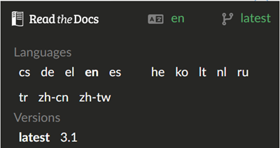

(Releasenotes-release-notes)=
# 版本更新說明

請遵循[更新手冊](UpdateToNewVersion)中的指示。 你還可以在更新手冊頁面找到關於常見更新問題的問題排除部分。

當有新版本可用時，你將收到以下資訊：


之後，你有 60 天的時間進行更新。 如果你在這 60 天內沒有更新，AAPS 將會降級到 LGS 模式（低血糖暫停，請參閱[詞彙表](../UsefulLinks/Glossary.md)），如[目標 6](#objectives-objective6)中所述。

如果你在新版本發布後 90 天內未更新，AAPS 將切換到開放循環模式。


請暸解，這一變更不是為了打擾你，而是出於安全原因。 AAPS 的新版本不僅提供了新功能，還包括重要的安全修復。 因此，必須儘快讓每個用戶更新到最新版本。 不幸的是，我們仍然收到來自非常舊版本的錯誤報告，所以這是為了提升每個用戶以及整個 DIY 社群的安全性。 感謝你的暸解。

```{admonition} First version of AAPS
:class: note

首個測試版本早在 2015 年就已經開始。 2016 年發布了第一個正式版本。

目前無法提供這些版本的時間順序紀錄，但由於這個問題被多次詢問，我們將在此紀錄。

```


(maintenance-android-version-aaps-version)=

## Android 版本與 AAPS 版本

如果你的手機使用的是 Android 9 以下的版本，你將無法使用 AAPS v3 及以上版本，因為這些版本至少需要 Android 9。

為了允許使用舊版 Android 的用戶繼續使用舊版 AAPS，我們發佈了一些僅更改版本驗證的版本。 這些版本不包含其他改進。

### Android 11 及以上

- 使用最新的 AAPS 版本
- 從 <https://github.com/nightscout/AndroidAPS> 下載 AAPS 程式碼

### Android 9,10

- 使用 AAPS 版本 **3.2.0.4**
- 從 <https://github.com/nightscout/AndroidAPS> 下載 3.2.0.4 分支程式碼

### Android 8

- 使用 AAPS 版本**2.8.2.1**
- 從 <https://github.com/nightscout/AndroidAPS> 下載 2.8.2.1 分支程式碼

### Android 7

- 使用 AAPS 版本**2.6.2**
- 從 <https://github.com/nightscout/AndroidAPS> 下載 2.6.2 分支程式碼

## WearOS 版本

- AAPS 需要至少 WearOS API 等級 28（Android 9）

```{tip}
WearOS 5, API 等級 34 (Android 14) 有[限制](#BuildingAapsWearOs-WearOS5)。
```

(版本3300)=
## 版本 3.3.0.0

3.3版即將推出 使用螢幕右下角的版本切換，查看最新內容。



(version3200)=
## 3.2.0.0 版本獻給 @Philoul

發布日期：2023-10-23

### 重要提示

- 需要 NS 15 版本
- 在使用 NS v3 外掛時，透過 NS UI 輸入的治療（+ 按鈕）和使用 v1 API 的其他應用程式不會發送到 AAPS。 這將在未來的 NS 版本中修復。 在 NS 完全內部切換到 v3 之前，請始終在 AAPS 和 AAPSClient 中使用相同的客戶端（v1 或 v3）。 對於 AAPS 和 AAPSClient 本身也是如此。
- v3 外掛中的 Websockets 與 v1 外掛的工作方式相似。 停用 websockets 後，AAPS 會定期下載 NS 的資料，這應該會降低電量消耗，因為 NS 不會長時間保持連線。 但另一方面，這意味著資料交換會有延遲。 在您使用之前，請先閱讀[這裡](#Important-comments-on-using-v3-versus-v1-API-for-Nightscout-with-AAPS)的開發團隊重要意見！
- 如果你使用 xdrip 作為 CGM 資料來源，則需要在更新後重新選擇他，因為內部已進行了更改。
- Tidepool 可作為 NS 的替代品，以透過第一個目標。
- 如果你選擇發送到 xDrip+，則必須配置 xDrip 同步外掛。 為了從 AAPS 接收血糖資料，必須將 “xDrip+ Sync Follower” 選為資料來源。
- 如果你希望切換到 ComboV2 驅動，必須卸載 Ruffy 並重新與 AAPS 配對幫浦。
- 要使用 DynISF 外掛，你必須開始目標 11（所有先前目標必須處於完成狀態才能開始第 11 個目標）。


### 變更

- EOPatch2 / GlucomenDay 幫浦驅動 @jungsomyeonggithub @MilosKozak
- ComboV2 幫浦驅動（不需要 Ruffy）@dv1
- Medtrum Nano 驅動 @jbr7rr
- 韓國 DanaI 支援 @MilosKozak
- Glunovo CGM 支援 @christinadamianou
- G7 支援 @MilosKozak @rICTx-T1D @khskekec
- NSClient v3 外掛 @MilosKozak
- Tidepool 支援 @MilosKozak
- 平滑外掛 @MilosKozak, @justmara, 指數平滑 @nichi (Tsunami), 平均平滑 @jbr7rr
- DynamicISF 外掛 @Chris Wilson, @tim2000s
- Garmin 手錶錶面及心率支援 @buessow
- 新標誌 @thiagomsoares
- 新錶面 @Philoul
- 修復了 3.1 版本的許多問題
- 允許在更多地方添加筆記 @Sergey Zorchenko
- UI 修復 @MilosKozak @osodebailar @Andries-Smit @yodax @Philoul @dv1 @paravoid
- 新的 SMS 指令 LOOP LGS/CLOSED @pzadroga
- WearOS 翻譯 @Andries-Smit
- xDrip 通訊移至獨立模組 @MilosKozak
- 內部變更：更新的庫版本，rx3 遷移，新模組結構 @MilosKozak
- Diaconn 驅動修復 @miyeongkim
- 更多資料庫維護選項 @MilosKozak
- AAPSClient 提供主要手機是否已接入電源的訊息 @MilosKozak
- BolusWizard 的更改。 如果 CGM 不可用，則忽略百分比（即使用 100%）
- 遷移到 kts 建置系統 @MilosKozak
- 改進的 CI 集成 @MilosKozak @buessow
- 測試清理 @ryanhaining @MilosKozak
- 新增 110,000 行代碼，修改 240,000 行代碼，修改 6,884 個文件

(使用 v3 與 v1 API 進行 Nightscout 和 AAPS 資料交換的重要說明)=
### 使用 v3 與 v1 API 進行 Nightscout 和 AAPS 資料交換的重要說明

v1 是用於在 NS 網站和 NS 伺服器之間交換資料的舊協議。 他有許多限制
- v1 僅發送 2 天的資料
- 每次重新連線時，v1 都會發送所有 2 天的資料
- 使用 websockets 是必須的 = 持續連線，更多的電量消耗
- 在頻繁中斷連線時，NS 連線會暫停 15 分鐘，以防止高資料使用量

v3 是新的協議。 更加安全和高效
- 使用令牌可以更好地定義查看權限
- 協議在 AAPS 和 NS 兩端都更高效
- 他可以從 NS 讀取長達 3 個月的資料
- 你可以選擇是否在每個設備上使用 websockets（使用意味著更快的更新，不使用意味著更低的電量消耗，但更新速度較慢，即數分鐘）
- NSClient 在中斷連線時不會暫停

限制
- NS 15 必須與 AAPS 3.2 一起使用
- v3 不會看到由 v1 協議完成的更新（可能會在未來的 NS 版本中解決）
- 反過來，因為追蹤變更的方法效率低下，v1 能看到由 v3 完成的變更
- 請記住，NS 目前仍在內部使用 v1，因此如果你使用 v3，則無法透過 NS 網頁 UI 輸入資料。 如果你想遠端輸入資料，必須使用 AAPSClient 的 SMS 功能

推薦設置
- 基於以上所有原因，你應選擇一種方法並在所有設備上使用他（記住，撰寫本文時，所有其他上傳器都在使用 v1）。 如果你決定使用 v3，請在 AAPS 和所有 AAPSClients 中選擇 v3
- v3 更具效率，因此是首選
- 使用或不使用 v3 中的 websockets 取決於你的偏好
- 強烈建議讓 AAPS 收集所有資料，然後將其作為單一上傳器上傳到 NS。 所有其他設備/應用程式應僅從 NS 讀取資料。 這樣可以防止衝突和同步錯誤。 這對於使用 Dexcom Share 連線器等將血糖資料上傳到 NS 也適用。

## 版本 3.1.0

發布日期：2022-07-19

(Releasenotes-important-hints-3-1-0)=
### 重要提示

- 更新後，請卸載 Wear 應用並安裝新版本
- Omnipod 使用者：在更換 Pod 時更新！！！

### 變更

- 修復了 3.0 版本中的問題
- 修復應用程式凍結問題 @MilosKozak
- 修復 DASH 驅動 @avereha
- 修復 Dana 驅動 @MilosKozak
- 巨大的 UI 改進、清理和統一，遷移到 Material Design、樣式、白色主題、新圖示。 @Andries-Smit @MilosKozak @osodebailar @Philoul
- 小工具 @MilosKozak
- Aidex CGM 支援 @andyrozman @markvader（僅 Pumpcontrol）
- 查看[Wear OS 小工具](#WearOsSmartwatch-wear-os-tiles)，翻譯 @Andries-Smit
- Wear 代碼重構。 不再向後相容 @MilosKozak
- a11y 改進 @Andries-Smit
- 新保護選項 PIN @Andries-Smit
- 允許從選單調整圖表比例 @MilosKozak
- 更多統計資料可用 @MilosKozak
- MDI 外掛已被 VirtualPump 取代
- 新的自動化操作：StopProcessing（遵循規則）

## 版本 3.0.0

發布日期：2022-01-31

(Releasenotes-important-hints-3-0-0)=
### 重要提示

- **最低 Android 版本現在為 9.0。**
- **資料未遷移到新資料庫。** 請勿抱怨，這是非常大的變更，因此無法遷移。 因此，更新後 IOB、COB、治療等資料將被清除。 您必須建立新的[設定檔切換](../DailyLifeWithAaps/ProfileSwitch-ProfilePercentage.md)並從零 IOB 和 COB 開始。 請謹慎規劃更新！！！ 最好在無活動胰島素和碳水化合物的情況下進行更新。
- 請使用相同版本的 AAPS 和 NSClient

**請確保在更新至 3.0 後檢查並調整設置，如 [此處](../Maintenance/Update3_0.md) 所述。**

### 準備步驟

**更新前至少兩天：**

- 在 Nightscout 中停用 Dexcom 橋
- 如果你使用 G5/G6 並使用 xDrip 作為收集器，你必須將 xDrip 更新至 2022 年 1 月 14 日之後的夜間版本
- 如果你使用 G5/G6，建議切換到 BYODA 作為收集器，以利用回溯平滑功能（你仍然可以將 xDrip 用於其他目的，xDrip 可以從 BYODA 接收資料）

### 變更

- 更改了 100k 行代碼，新增了 105k 行代碼

- [Omnipod DASH 支援](../CompatiblePumps/OmnipodDASH.md) @AdrianLxM @avereha @bartsopers @vanelsberg

- [Dana-i 支援](../CompatiblePumps/DanaRS-Insulin-Pump.md) @MilosKozak

- [DiaconnG8 支援](../CompatiblePumps/DiaconnG8.md)

- Glunovo 支援

- 內部資料庫升級到 Room @MilosKozak @Tebbe @AdrianLxm @Philoul @andyrozman

- 大量代碼重寫為 Kotlin @MilosKozak

- 為幫浦驅動新增內部介面

- NSClient 重寫以獲得更好的同步和更詳細的自訂功能 @MilosKozak

  - 不允許從 NS 刪除紀錄（僅能透過 NSClient 使其無效）
  - 不允許從 NS 修改紀錄
  - 無需工程模式即可使用同步設置（適用於父母）
  - 可以重新同步資料

- 設定檔切換行為變更。 現在區分設定檔切換 *（使用者想要的變更）* 和設定檔變更 *（當幫浦執行變更時）* @MilosKozak @Tebbe

- 你可以在建立設定檔切換時啟動臨時目標 @MilosKozak

- NS 設定檔已消失，僅可使用本地設定檔。 本機設定可以[同步到 NS](#Update3_0-nightscout-profile-cannot-be-pushed). @MilosKozak。

- 忘記了[主密碼重置程序](#Update3_0-reset-master-password) @MilosKozak

- 使用者操作追蹤 @Philoul

- 新自動化 TempTargetValue 觸發器 @Philoul

- 新自動化 Careportal 動作 @Philoul

- 在碳水化合物對話框中添加注射提醒 @Philoul

- 注射精靈改進

- UI 改進 @MilosKozak

- 新的使用者按鈕自動化 @MilosKozak

- 新的自動化佈局 @MilosKozak

- 歷史瀏覽器已更新並修復 @MilosKozak

- 已移除目標 9 @MilosKozak

- 修復了與不穩定 CGM 資料相關的錯誤 @MilosKozak

- DanaR 和 DanaRS 通訊改進 @MilosKozak

- CircleCI 集成 @MilosKozak

- 文件位置變更：

  - /AAPS/extra（工程模式）
  - /AAPS/logs /AAPS/exports
  - /AAPS/preferences

## 版本 2.8.2

發布日期：2021-01-23

- 請參閱[版本 2.8.1.1 的重要提示](#version-2811)。

### 變更

- 穩定性改進
- 更多針對 Android 8+ 的調整
- 改進的圖示
- 手錶改進
- NSClient 修復
- 注射建議器現在與 Pumpcontrol 和 NSClient 一起工作

## 版本 2.8.1.1

發布日期：2021-01-12

(重要提示 2.8.1.1)=
### 重要提示

- 已為所有 2.8.1 使用者強制開啟選項 **NS_UPLOAD_ONLY**。
- 如果你使用 NSClient 輸入 TT、碳水化合物或設定檔切換，你必須在 AAPS 中將其關閉，但 **僅在你的同步運作良好時**（例如，你沒有看到不需要的資料變更，如 TT、TBR 的自我修改等）。
- 注意：如果你有其他應用程式處理治療（例如 xDrip 廣播/上傳/同步...），請勿這樣做。
- 只能在啟用工程模式時關閉 NS_UPLOAD_ONLY。

### 重大變更

- RileyLink、Omnipod 和 MDT 幫浦改進和修復
- 強制 NS_UPLOAD_ONLY
- SMB 和 Dexcom 應用的修復
- 手錶錶面修復
- 崩潰報告改進
- Gradle 回退以允許直接安裝手錶錶面
- 自動化修復
- RS 驅動改進
- 修復了各種崩潰
- UI 修復和改進
- 新增翻譯

(Releasenotes-version-2-8-0)=
## 版本 2.8.0

發布日期：2021-01-01

### 重要提示

- **最低 Android 版本現在為 8.0。** 對於較舊的 Android 版本，你仍然可以使用舊倉庫中的 2.6.1.4 版本。
- [目標已更改。](#objectives-objective3)**請完成尚未完成的目標後再更新。**
- 儲存庫位置仍在 <https://github.com/nightscout/AndroidAPS> 。 如果您不熟悉 git，更新的最簡單方法是刪除包含 AAPS 的目錄，然後執行[新複製](../SettingUpAaps/BuildingAaps.md)。
- 請使用 [Android Studio 4.1.1](https://developer.android.com/studio/) 或更新版本來建置 apk。

### 主要新功能

- [Omnipod Eros 支援](../CompatiblePumps/OmnipodEros.md) @bartsopers @andyrozman @ktomy @samspycher @TeleRiddler @vanelsberg @eurenda，特別感謝 @ps2 @itsmojo 以及所有參與 Omnipod Loop 驅動程序的人，還有 @jlucasvt 來自 GetRileyLink.org
- [注射顧問](#Preferences-quick-wizard) 和 [用餐提醒](#AapsScreens-section-j) @MilosKozak
- 新錶盤 @rICTx-T1D
- Dana RS 連線改進 @MilosKozak
- 移除了 Dexcom 原生應用中 SMB 的「未變更 CGM 值」行為
- 新增[低解析度外觀](#Preferences-skin)
- 新增["孕婦" 患者類型](#Open-APS-features-overview-of-hard-coded-limits) @Brian Quinion
- 新的 NSClient 平板佈局 @MilosKozak
- NSClient 直接從主 AAPS 傳輸胰島素、敏感度和顯示設置 @MilosKozak
- [偏好設定篩選](../SettingUpAaps/Preferences.md) @Brian Quinion
- 新幫浦圖示 @Rig22 @teleriddler @osodebailar
- 新增[胰島素類型 Lyumjev](#Config-Builder-lyumjev)
- 設定嚮導改進 @MilosKozak
- 安全性改進 @dlvoy
- 各種改進和修復 @AdrianLxM @Philoul @swissalpine @MilosKozak @Brian Quinion

(Releasenotes-version-2-7-0)=
## 版本 2.7.0

發布日期：2020-09-24

**請確保在更新至 2.7 後檢查並調整設置，如 [此處](../Maintenance/Update2_7.md) 所述。**

你至少需要開始 [目標 11（在後續版本中為目標 10）](#objectives-objective10) 才能繼續使用 [自動化功能](../DailyLifeWithAaps/Automations.md)（所有之前的目標必須完成，否則無法開始目標 11）。 例如，如果您尚未完成 [目標 3](#objectives-objective3) 的考試，則在開始 [目標 11](#objectives-objective11) 之前，您必須先完成考試。 這不會影響你已完成的其他目標。 你將保留所有已完成的目標！

### 主要新功能

- 內部使用依賴注入，更新庫，代碼重寫為 Kotlin @MilosKozak @AdrianLxM
- 使用模組用於 Dana 幫浦 @MilosKozak
- [新佈局，佈局選擇](../DailyLifeWithAaps/AapsScreens.md) @MilosKozak
- 新[狀態燈佈局](#Preferences-status-lights) @MilosKozak
- [多重圖表支援](#AapsScreens-activate-optional-information) @MilosKozak
- [設定檔助手](../SettingUpAaps/YourAapsProfile.md) @MilosKozak
- 動態目標調整的[視覺化](#AapsScreens-visualization-of-dynamic-target-adjustment) @Tornado-Tim
- 新[偏好設定佈局](../SettingUpAaps/Preferences.md) @MilosKozak
- SMB 算法更新 @Tornado-Tim
- [低血糖暫停模式](#Preferences-aps-mode) @Tornado-Tim
- [需碳水提醒](#key-aaps-features-minimal-carbs-required-for-suggestion) @twain47 @Tornado-Tim
- 移除了 Careportal（移至操作） @MilosKozak
- [新加密備份格式](ExportImportSettings.md) @dlvoy
- [新 SMS TOTP 驗證](../RemoteFeatures/SMSCommands.md) @dlvoy
- [新 SMS 幫浦連接、中斷連線](#SMSCommands-commands) 指令 @Lexsus
- 更好地支援 Dana 幫浦上的小基礎率 @Mackwe
- 小型 Insight 修復 @TebbeUbben @MilosKozak
- ["預設語系" 選項](#Preferences-general) @MilosKozak
- 矢量圖示 @Philoul
- [為 MDT 幫浦設定中性溫度](#MedtronicPump-configuration-of-the-pump) @Tornado-Tim
- 歷史瀏覽器改進 @MilosKozak
- 移除了 OpenAPS MA 算法 @Tornado-Tim
- 移除了 Oref0 敏感度 @Tornado-Tim
- [生物識別或密碼保護](#Preferences-protection) 用於設定、注射 @MilosKozak
- [新自動化觸發](../DailyLifeWithAaps/Automations.md) @PoweRGbg
- [Open Humans 上傳器](../SupportingAaps/OpenHumans.md) @TebbeUbben @AdrianLxM
- 新文件 @Achim

(Releasenotes-version-2-6-1-4)=
## 版本 2.6.1.4

發布日期：2020-05-04

請使用 [Android Studio 3.6.1](https://developer.android.com/studio/) 或更新版本來建置 apk。

### 主要新功能

- Insight：停用針對韌體版本 3 的注射震動 - 第二次嘗試
- 除此之外，與 2.6.1.3 相同。 更新是可選的。

## 版本 2.6.1.3

發布日期：2020-05-03

請使用 [Android Studio 3.6.1](https://developer.android.com/studio/) 或更新版本來建置 apk。

### 主要新功能

- Insight：停用針對韌體版本 3 的注射震動
- 除此之外，與 2.6.1.2 相同。 更新是可選的。

## 版本 2.6.1.2

發布日期：2020-04-19

請使用 [Android Studio 3.6.1](https://developer.android.com/studio/) 或更新版本來建置 apk。

### 主要新功能

- 修復 Insight 服務崩潰
- 除此之外，與 2.6.1.1 相同。 如果你未受到此錯誤的影響，則不需要升級。

## 版本 2.6.1.1

發布日期：2020-04-06

請使用 [Android Studio 3.6.1](https://developer.android.com/studio/) 或更新版本來建置 apk。

### 主要新功能

- 解決了使用 Combo 幫浦時 SMS CARBS 指令的問題
- 除此之外，與 2.6.1 相同。 如果你未受到此錯誤的影響，則不需要升級。

## 版本 2.6.1

發布日期：2020-03-21

請使用 [Android Studio 3.6.1](https://developer.android.com/studio/) 或更新版本來建置 apk。

### 主要新功能

- 允許在 NSClient 設置中僅輸入 `https://`
- 修正 [BGI](../UsefulLinks/Glossary.md) 在手錶上顯示的錯誤
- 修復小型 UI 錯誤
- 修復 Insight 崩潰
- 修復 Combo 幫浦的未來碳水化合物問題
- 修正 LocalProfile -> NS 同步
- Insight 警報改進
- 改進了從幫浦歷史中偵測注射的功能
- 修復 NSClient 連線設置（Wi-Fi、充電）
- 修復向 xDrip 發送校準的問題

(Releasenotes-version-2-6-0)=
## 版本 2.6.0

發布日期：2020-02-29

請使用 [Android Studio 3.6.1](https://developer.android.com/studio/) 或更新版本來建置 apk。

### 主要新功能

- 小設計更改（首頁...）

- 移除 Careportal 標籤/選單

- 新增 Local Profile 外掛

  - 本地設定檔可以包含多個配置
  - 設定檔可以被複製和編輯
  - 能夠將設定檔上傳到 NS
  - 舊的設定檔切換可以複製到新的本地設定檔中（應用時間移動和百分比）
  - 目標的垂直號碼選擇器

- 移除了 SimpleProfile

- [延長注射](#Extended-Carbs-extended-bolus-and-switch-to-open-loop-dana-and-insight-pump-only) 功能 - 將停用關閉循環

- MDT 外掛：修復了重複項目錯誤

- 單位不再在設定檔中指定，而是全域設置

- 將新設置添加到啟動嚮導中

- 不同的 UI 和內部改進

- [Wear OS 複雜功能](../WearOS/WearOsSmartwatch.md)

- 新增 [簡訊指令](../RemoteFeatures/SMSCommands.md) BOLUS-MEAL, SMS, CARBS, TARGET, HELP

- 修復語系支援

- 目標: [允許返回](#CompletingTheObjectives-go-back-in-objectives), 時間抓取對話框

- 自動化: [允許排序](#Automations-the-order-of-the-automations-in-the-list-matters)

- 自動化：修復了在停用循環時自動化仍在運作的錯誤

- Combo 新狀態行

- GlucoseStatus 改進

- 修復 TempTarget 的 NS 同步問題

- 新增統計活動

- 允許在開環模式中進行延長注射

- 支援 Android 10 鬧鐘

- 大量新翻譯

## 版本 2.5.1

發布日期：2019-10-31

請注意 [重要說明](#Releasenotes-version-2-5-0) 和 [限制](#Releasenotes-is-this-update-for-me-currently-is-not-supported)，適用於[版本 2.5.0](#Releasenotes-version-2-5-0)。 修復了網絡狀態接收器中的錯誤，該錯誤會導致許多崩潰（雖然不會很嚴重，但會浪費很多能量來重新計算）。 新版本控制，允許進行小更新而不會觸發更新通知。

(Releasenotes-version-2-5-0)=
## 版本 2.5.0

發布日期：2019-10-26

(Releasenotes-important-notes-2-5-0)=

### 重要提示

- 請使用 [Android Studio 3.5.1 版本](https://developer.android.com/studio/) 或更新的版本來 [編譯 apk](../SettingUpAaps/BuildingAaps.md) 或 [更新](UpdateToNewVersion).
- 如果您使用 xDrip，必須設置 [識別接收器](#xdrip-identify-receiver).
- 如果你使用帶有修補版的 Dexcom G6 應用，你將需要 [2.4 資料夾](https://github.com/dexcomapp/dexcomapp/tree/master/2.4)中的版本。
- Glimp 支援版本 4.15.57 及更新版本。

(Releasenotes-is-this-update-for-me-currently-is-not-supported)=
### 這次更新適合我嗎？ 目前不支援

- Android 5 及更低版本
- Poctech
- 600SeriesUploader
- 從 2.3 目錄中修補版的 Dexcom

### 主要新功能

- targetSDK 內部更改為 28（Android 9），支援 Jetpack
- 支援 RxJava2、Okhttp3、Retrofit
- 舊版[美敦力幫浦](../CompatiblePumps/MedtronicPump.md) 支援 (需要 RileyLink)
- 新增 [自動化外掛](../DailyLifeWithAaps/Automations.md)
- 允許從注射嚮導計算中 [僅注射部分](#Preferences-advanced-settings-overview)
- 呈現胰島素活動
- 根據 Autosens 結果調整 IOB 預測
- 新的修補版 Dexcom apks 支援（[2.4 資料夾](https://github.com/dexcomapp/dexcomapp/tree/master/2.4)）
- 簽章驗證器
- 允許 OpenAPS 使用者繞過目標
- 新的 [目標](../SettingUpAaps/CompletingTheObjectives.md) - 測驗、應用處理 （如果你在早期版本中至少開始了「開放循環」目標，測驗是可選的。）
- 修復了 Dana\* 驅動中的錯誤，該錯誤會報告錯誤的時間差
- 修正 [簡訊溝通器](../RemoteFeatures/SMSCommands.md) 中的錯誤

## 版本 2.3

發布日期：2019-04-25

### 主要新功能

- Insight 的重要安全修復（如果你使用 Insight，這真的很重要！）
- 修復歷史瀏覽器
- 修復 delta 計算
- 語系更新
- 檢查 GIT 並在 Gradle 升級時發出警告
- 更多自動測試
- 修復 AlarmSound 服務中的潛在崩潰問題（感謝 @lee-b！）
- 修復血糖資料廣播（現在獨立於 SMS 權限運作！）
- 新增版本檢查器

## 版本 2.2.2

發布日期：2019-04-07

### 主要新功能

- Autosens 修復：停用 TT 時提升/降低目標
- 新增翻譯
- Insight 驅動修復
- SMS 外掛修復

## 版本 2.2

發布日期：2019-03-29

### 主要新功能

- [DST 修復](#time-adjustment-daylight-savings-time-dst)
- Wear 更新
- [簡訊外掛](../RemoteFeatures/SMSCommands.md) 更新
- 目標中返回。
- 如果手機磁碟已滿則停止循環

## 版本 2.1

發布日期：2019-03-03

### 主要新功能

- [Accu-Chek Insight](../CompatiblePumps/Accu-Chek-Insight-Pump.md) 支援 (由 Tebbe Ubben 和 JamOrHam 提供)
- 主螢幕上的狀態燈（Nico Schmitz）
- 夏令時幫助器（Roumen Georgiev）
- 修復來自 NS 的設定檔名稱處理問題（Johannes Mockenhaupt）
- 修復 UI 阻塞（Johannes Mockenhaupt）
- 支援更新的 G5 應用（Tebbe Ubben 和 Milos Kozak）
- G6、Poctech、Tomato、Eversense血糖資料來源支援（Tebbe Ubben 和 Milos Kozak）
- 修復偏好設置中停用 SMB 的問題（Johannes Mockenhaupt）

### 其他事項

- 如果你使用非預設的 `smbmaxminutes` 值，則必須再次設置此值

## 版本 2.0

發布日期：2018-11-03

### 主要新功能

- oref1/SMB 支援（[oref1 文件](https://openaps.readthedocs.io/en/latest/docs/Customize-Iterate/oref1.html)）務必閱讀文件，以了解對 SMB 的預期，了解其行為方式、可以實現的功能以及如何使用，以便平穩運作。
- [_Accu-Chek Combo](../CompatiblePumps/Accu-Chek-Combo-Pump.md) 幫浦支援
- 設定嚮導：引導你完成 AAPS 的設定過程

(Releasenotes-settings-to-adjust-when-switching-from-ama-to-smb)=
### 切換從 AMA 到 SMB 時需要調整的設置

- 必須啟動目標 10 才能啟用 SMB（SMB 標籤通常顯示適用的限制）

- maxIOB 現在包括所有的 IOB，而不僅僅是增加的基礎率。 也就是說，如果為一頓飯注射了 8 U 胰島素，而 maxIOB 是 7 U，那麼在 IOB 下降到 7 U 以下之前，不會再有 SMB 被執行。

- min_5m_carbimpact 的預設值從 AMA 的 3 改為 8。 如果你是從 AMA 升級到 SMB，則需要手動更改此設置。

- 建置 AAPS 2.0 apk 時注意事項：目前版本的 Android Gradle 外掛不支援按需配置！ 如果你的建置因「按需配置」的錯誤而失敗，你可以進行以下操作：

  - 透過點擊「文件」>「設置」（在 Mac 上是「Android Studio」>「偏好設定」）打開偏好設定窗口。
  - 在左側窗格中，點擊「建置、執行、部署」>「編譯器」。
  - 取消選中「按需配置」復選框。
  - 點擊「應用」或「確定」。

(Releasenotes-overview-tab)=
### 概述標籤

- 頂部功能區可用於暫停/停用循環、查看/調整設定檔，並開始/停止臨時目標（TT）。 TT 使用偏好設置中設置的預設值。 新的 Hypo TT 選項是一個高溫 TT，用於防止循環過度積極地糾正急救碳水化合物。
- 治療按鈕：舊的治療按鈕仍可用，但預設情況下被隱藏。 按鈕的可見性現在可以配置。 新增胰島素按鈕，新增碳水化合物按鈕（包括[eCarbs/延長碳水化合物](../DailyLifeWithAaps/ExtendedCarbs.md)）
- [彩色預測線](#aaps-screens-prediction-lines)
- 選項可在胰島素/碳水化合物/計算機/注射+填充對話框中顯示筆記字段，這些字段會上傳到 NS
- 更新的注射/填充對話框允許進行注射，並建立護理入口項目以紀錄站點更換和藥筒更換

### 手錶

- 單獨的建置變體已被移除，現在包含在常規完整建置中。 要從手錶使用注射控制，請在手機上啟用此設置
- 嚮導現在只詢問碳水化合物（以及手錶設置中啟用的百分比）。 可以在手機設置中配置計算中包含的參數
- 確認和訊息對話框現在也適用於 Wear 2.0
- 新增 eCarbs 選單項目

### 新外掛

- PocTech 應用作為血糖資料來源
- Dexcom 修補版應用作為血糖資料來源
- oref1 敏感性外掛

### 其他事項

- 應用現在使用抽屜顯示所有外掛；在組態建置工具中選擇為可見的外掛將顯示為頂部的標籤（收藏夾）
- 組態建置工具和目標標籤的全面檢查，新增描述
- 新應用圖示
- 大量改進和錯誤修復
- 當幫浦長時間無法使用時（例如幫浦電池耗盡）以及血糖讀取遺失時，本地獨立於 Nightscout 的警報（請參閱設定中的 *本地警報*）
- 選項允許保持螢幕開啟
- 選項允許將通知顯示為 Android 通知
- 支援使用 Dexcom 修補版應用或 xDrip G5 原生模式作為血糖資料來源進行進階過濾（允許始終啟用 SMB 並在飯後 6 小時內啟用）。
