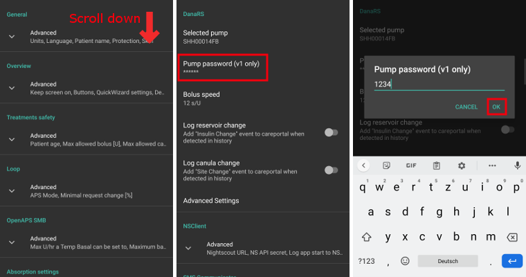

# 從 AAPS 2.6 升級後需要進行的必要檢查

- 當切換到 AAPS 2.7 時，程式碼進行了顯著更改。
- 因此，在更新後，請務必進行一些更改或檢查設置。
- Please see [release notes](ReleaseNotes.md#version-270) for details on new and extended features.

## 檢查血糖資料來源

- 更新後檢查血糖資料來源是否正確。
- Especially when using [xDrip+](../CompatibleCgms/xDrip.md) it might happen, that BG source is changed to Dexcom app (patched).
- Open [Config builder](../SettingUpAaps/ConfigBuilder.md#bg-source) (hamburger menu on top left side of home screen)
- 向下滾動至「血糖資料來源」。
- 如果需要，請選擇正確的血糖資料來源。

## 完成考試

- AAPS 2.7 contains new objective 11 (in later versions renumbered to objective 10!) for [automation](../DailyLifeWithAaps/Automations.md).
- You have to finish exam ([objective 3 and 4](../SettingUpAaps/CompletingTheObjectives.md#objective-3-prove-your-knowledge)) in order to complete [objective 11](../SettingUpAaps/CompletingTheObjectives.md#objective-11-enabling-additional-features-for-daytime-use-such-as-dynamic-senstivity-plugin-dynisf).
- If for example you did not finish the exam in [objective 3](../SettingUpAaps/CompletingTheObjectives.md#objective-3-prove-your-knowledge) yet, you will have to complete the exam before you can start [objective 11](../SettingUpAaps/CompletingTheObjectives.md#objective-11-enabling-additional-features-for-daytime-use-such-as-dynamic-senstivity-plugin-dynisf).
- 這不會影響你已完成的其他目標。 你將保留所有已完成的目標！

## 設置主密碼

- Necessary to be able to [export settings](ExportImportSettings.md) as they are encrypted as of version 2.7.
- 打開「偏好設定」（主螢幕右上角的三點選單）
- 點擊「一般」下方的三角形
- 點擊「主密碼」
- 輸入密碼，確認密碼並點擊「確定」。

## 匯出設定

- AAPS 2.7 使用了新的加密備份格式。
- You must [export your settings](ExportImportSettings.md) after updating to version 2.7.
- 來自以前版本的設定檔只能在 AAPS 2.7 中匯入。 匯出將以新格式進行。
- 確保將匯出的設定不僅存儲在你的手機上，還應至少存儲在一個安全的地方（你的電腦、雲端存儲等）。
- 如果你使用與先前版本相同的密鑰庫來建置 AAPS 2.7 apk，則可以安裝新版本而無需刪除舊版本。
- 所有設定以及已完成的目標將保持與之前版本相同。
- In case you have lost your keystore build version 2.7 with new keystore and import settings from previous version as described in the [troubleshooting section](../GettingHelp/TroubleshootingAndroidStudio#lost-keystore).

## 自動敏感度調整（提示 - 無需操作）

- 自動敏感度調整已更改為動態切換模型，這模擬了參考設計。
- 自動敏感度現在會在 24 小時和 8 小時窗口之間切換來計算敏感度。 他會選擇較敏感的那個時間窗口。
- 如果用戶曾經使用過 oref1，他們可能會注意到系統對變化的反應可能不如預期動態，這是由於 24 小時或 8 小時敏感度的不同。

## 為 Dana RS 設置幫浦密碼（如果使用 Dana RS）

- Pump password for [Dana RS](../CompatiblePumps/DanaRS-Insulin-Pump.md) was not checked in previous versions.
- 打開「偏好設定」（螢幕右上角的三點選單）
- 向下滾動並點擊「Dana RS」旁的小三角形。
- 點擊「幫浦密碼（僅限 v1）」
- Enter pump password ([Default password](../CompatiblePumps/DanaRS-Insulin-Pump.md#default-password) is different depending on firmware version) and click OK.

To change password on Dana RS follow instructions on [DanaRS page](../CompatiblePumps/DanaRS-Insulin-Pump.md#change-password-on-pump).
