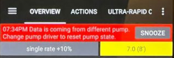

# 更新至 AAPS 3.0 後的必要檢查

* **最低 Android 版本現在為 9.0。**
* **資料不會遷移至新資料庫。**

  請不要抱怨，這是非常重大的變更，無法避免。 因此，更新後 IOB、COB、治療等資料將被清除。 你必須建立新的[設定檔切換](../DailyLifeWithAaps/ProfileSwitch-ProfilePercentage.md)並從零 IOB 和 COB 開始。

  請謹慎規劃更新！！！ 最好在無活動胰島素和碳水化合物的情況下進行更新。

* 請參閱 [發行說明](../Maintenance/ReleaseNotes.md) 以獲取有關新功能和變更的詳細資訊。

## 檢查自動化設置

* 引入了新限制。 請檢查你的自動化設置，特別是你的條件是否仍然有效。
* 如果某個條件缺失，你需要重新添加。
* 紅色自動化包含無效的操作，請編輯他們並重置為有效值。

  示例：將設定檔更改為 140% 之前是允許的，但現在限制為 130%。

## 檢查你的 nsclient 設定並設置同步複雜性

* nsclient 外掛的實作已完全改變。
* 進入 nsclient 標籤，並在右側選單中打開設定。 現在提供了一個新的偏好 "同步"。
* 你現在可以詳細選擇應與你的 Nightscout 網站同步的項目。

(Update3_0-nightscout-profile-cannot-be-pushed)=
## Nightscout 檔案無法推送
* Nightscout 檔案已消失，安息吧！
* 要將目前的 Nightscout 檔案複製到本地檔案，請前往治療頁面（現在可從右側選單打開）。
* 搜索 100% 的個人檔案切換，然後按下複製。
* 會新增一個從目前日期起生效的新本地檔案。
* 要從 NS 端更新檔案，請使用 "Clone"（紀錄!!，不是檔案）並儲存更改。 您應該看到「設定檔有效日期從：」設置為當前日期。

(Update3_0-reset-master-password)=
## 重置主密碼
* 如果你忘記了主密碼，現在可以進行重置。
* 您需要在手機的檔案系統中的 `/AAPS/extra` 目錄中添加一個名為 `PasswordReset` 的檔案。
* 重新啟動 AAPS。
* 新密碼將是你正在使用的幫浦的序列號。
* 對於 Dash：序列號始終為 4241。
* 對於 EROS，他也顯示在 POD 標籤下，稱為 "序列號"。

## 血糖下方的警告信號

從 Android 3.0 開始，你可能會在主螢幕上的血糖數字下方看到警告信號。

  

  

詳細資訊請參見 [AAPS螢幕頁面](#aaps-screens-bg-warning-sign)

(update30-failure-message-data-from-different-pump)=
## 錯誤訊息：來自不同幫浦的資料

   

要解決此問題，請前往 [設定建構器](#Config-Builder-pump)。 將幫浦更改為虛擬幫浦，然後再切換回你的實際幫浦。 這將重置幫浦狀態。
