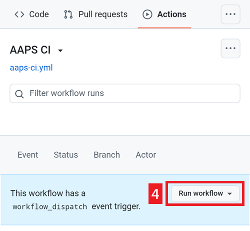

# 使用瀏覽器更新

## 自行建置，而不是下載

**AAPS** 無法下載，因為這涉及醫療設備的法規。 自行建置應用程式以供個人使用是合法的，但你不得將副本提供給他人！ 詳細資訊請參閱 [FAQ 頁面](../UsefulLinks/FAQ.md)。

```{note}
如果你想第一次使用瀏覽器升級 **AAPS** : 請將你的備份金鑰檔案複製到你的 Google 雲端硬碟。 然後請遵循 [瀏覽器版本 **AAPS** 程序](../SettingUpAaps/BrowserBuild.md) 而不是本指南。 與其建立新的金鑰庫，更好的方法，是選擇你電腦中現有的。
這個操作僅在第一次時才需要，之後的升級可以遵循這個指南。
```

## 更新 AAPS 新版本的總覽

```{contents} Steps for updating to a new version of AAPS
:depth: 1
:local: true
```

如果您遇到問題，請參見單獨的[問題排除Android Studio](../GettingHelp/TroubleshootingAndroidStudio)頁面。

### 匯出你的設定

從您手機上現有的 **AAPS** 版本匯出您的設定。 你可能不需要這樣做，但防患於未然更好。

如果您忘記如何做，請參見[匯出與匯入設定](ExportImportSettings.md)頁面。

(Update-to-new-version-update-your-repo)=
### 更新你的 GitHub 儲存庫

```{admonition} WARNING
:class: warning
從 AAPS 版本 3.3.2.1 起，瀏覽器建置已釋出。
```

[登入 GitHub](https://github.com/login)。

1. 選擇儲存庫。
2. 向下滾動並選擇你自己的 AndroidAPS 儲存庫。


3. 確保你使用的是自己複製的 AndroidAPS 版本（從 nightscout/AndroidAPS 分支出來的）
4. 點擊同步分支以更新它（提交的數量可能與圖片不同）


5. 點擊更新分支


注意：如果你不小心修改了自己複製的 AndroidAPS，將會看到此畫面。 放棄所有更改（提交）以便恢復到官方版本。


你現在已經將自己的複製版本與 AndroidAPS 的最新發布同步（更新）了。 做得很好。


### 執行工作流程，以建置簽名的 APK

1. 在你的 GitHub 複製版 AndroidAPS 中，選擇操作。
2. 擴展所有工作流程。
3. 選擇 AAPS-CI


4. 向下滾動並點擊運行工作流程。



5. 選擇你想要部署的分支（主分支）、[版本](variant)（fullRelease）並點擊運行工作流程。


6. 你將會看到工作流程運行成功請求的訊息。 重新整理你的瀏覽器頁面，你將能夠監控建置進度。 當操作完成時，AAPS CI 的行動將顯示綠色勾選標記。 你已成功建置 AndroidAPS 的更新版本。 This means that the Master and Wear apk is now directly saved into your Google Drive (as per below). AAPSClient apk can be downloaded from Github > nightscout > AndroidAPS [here](https://github.com/nightscout/AndroidAPS/releases)


### 安裝 AAPS APK

1. 打開你的 Google 雲端硬碟
2. 瀏覽到 AAPS，選擇新版本資料夾，你會找到手機版和 Android Wear 版本。


繼續 [這裡](#Update-to-new-version-check-aaps-version-on-phone)

## 問題排除

如果發生任何錯誤，不要慌張。

先深呼吸！

然後如果你的問題已經有文檔，請參閱 [問題排除](#aaps-ci-preparation)！

如果你需要進一步幫助，請聯繫其他**AAPS**使用者，透過[Facebook](https://www.facebook.com/groups/AndroidAPSUsers)或[Discord](https://discord.gg/4fQUWHZ4Mw)。
