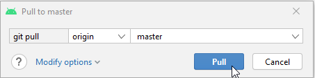

# Update with a computer

## 自行建置，而不是下載

**AAPS** is not available to download, due to regulations concerning medical devices. 自行建置應用程式以供個人使用是合法的，但你不得將副本提供給他人！ 詳細資訊請參閱 [FAQ 頁面](../UsefulLinks/FAQ.md)。

```{note}
如果你想在新電腦上建立 **AAPS**：請將你的備份金鑰存檔複製到新電腦上。 然後按照 [初始建置 **AAPS** 程序](../SettingUpAaps/BuildingAaps.md) 的步驟，而不是這個指導。 唯一的不同之處在於，你可以選擇你在新電腦上複製的金鑰存檔，而不必建立新的金鑰存檔。
```

## Overview for updating to a new version of AAPS with a computer

```{contents} Steps for updating to a new version of AAPS
:depth: 1
:local: true
```

In case you experience problems, see separate page for [troubleshooting Android Studio](../GettingHelp/TroubleshootingAndroidStudio).

### Export your settings

從您手機上現有的 **AAPS** 版本匯出您的設定。 你可能不需要這樣做，但防患於未然更好。

如果您忘記如何做，請參見[匯出與匯入設定](ExportImportSettings.md)頁面。

### Check your Android Studio version

The minimal version required is described in the [Building Instructions](#Building-APK-recommended-specification-of-computer-for-building-apk-file). If your version is older, please [update Android Studio first](#Building-APK-install-android-studio)!

(Update-to-new-version-update-your-local-copy)=
### Update your local copy

```{admonition} WARNING
:class: warning
If you update from versions prior to 2.8.x, please follow the instructions to do a [New clone](../SettingUpAaps/BuildingAaps.md), as this guide will not work for you!
```

* 使用 Android Studio 開啟你現有的 AAPS 項目。 你可能需要選擇你的項目。 (雙擊) 點擊 AAPS 項目。

  

* 在 Android Studio 的選單列中，選擇 Git -> 取回

   

* 你將在右下角看到 Fetch 成功的訊息。

   

* 在選單列中，現在選擇 Git -> 拉取

   

* 保持所有選項不變（origin/master），然後選擇 Pull

   

* 等待下載過程進行，你會在底部欄看到進度資訊。 完成後，你將看到成功訊息。

  ```{note}
  更新的檔案可能會有所不同！ 這並不代表指示
  ```

   

* Gradle 同步將運行以下載一些相依套件。 等待他完成。

  

### 檢查 JVM 版本

This check is particularly indicated if you have already built a previous version of **AAPS** on the same computer.

Check in the [Building Instructions](#Building-APK-recommended-specification-of-computer-for-building-apk-file) the required version for JVM, matching the **AAPS** version you are now building. 然後按照在 [不相容的 Gradle JVM](#incompatible-gradle-jvm) 中描述的步驟，以確保你當前使用的是正確的版本。

Update-to-new-version-build-the-signed-apk)=
### 建置簽章 APK

你的原始碼現在是當前已發佈的版本，並且所有前置條件已經檢查過。 現在是時候按照[建立簽署的 APK 部分](#Building-APK-generate-signed-apk)中的說明來建立簽署的 APK。

(Update-to-new-version-transfer-and-install)=

### 轉移並安裝 APK
你需要將 apk 傳送到手機以便你安裝他。

```{note}
如果你使用相同的現有金鑰庫在 Android Studio 中完成了構建，那麼你不需要刪除手機上的現有應用。 當你安裝 apk 時，按照提示安裝更新。
對於其他情況，例如在 Android Studio 中為你的簽章 apk 建立新密鑰庫，你將需要刪除舊應用程式後再安裝 apk。 **確保匯出你的設定！**
```

請參閱有關[傳送和安裝 AAPS](../SettingUpAaps/TransferringAndInstallingAaps.md)的說明。

Continue [here](#Update-to-new-version-check-aaps-version-on-phone).

## 問題排除

如果發生任何錯誤，不要慌張。

先深呼吸！

然後查看專門頁面[問題排除 Android Studio](../GettingHelp/TroubleshootingAndroidStudio)，看看你的問題是否已經紀錄在案！

If you need further help, please reach out to other **AAPS** users on [Facebook](https://www.facebook.com/groups/AndroidAPSUsers) or [Discord](https://discord.gg/4fQUWHZ4Mw).