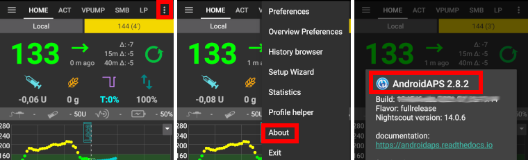

# 更新至新版本或分支

## 自行建置，而不是下載

**AAPS** 無法下載，因為這涉及醫療設備的法規。 自行建置應用程式以供個人使用是合法的，但你不得將副本提供給他人！ 詳細資訊請參閱 [FAQ 頁面](../UsefulLinks/FAQ.md)。

## 重要提示

* 請在有新版本發布後儘快更新到最新版本的 **AAPS**。
* 當有新版本發布時，你將在 **AAPS** 應用中收到關於新版本的訊息橫幅。
* 新版本也會在發布時於 Facebook 上公佈。
* 發布後，請詳細閱讀[發布說明](ReleaseNotes.md)，如有任何疑問，請在Facebook或Discord社群中澄清後再進行更新。
* 你需要使用**[Hedgehog (2023.1.1) 或 Iguana (2023.2.1)](https://developer.android.com/studio/)** 版本的 Android Studio。 如果你的版本較舊，請先更新 Android Studio！ 

## 更新到新版本 AAPS 的概述

1. [匯出您的設定](ExportImportSettings.md)自您手機上的現有**AAPS**版本。 你可能不需要這樣做，但防患於未然更好。
2. [更新本地副本](#2-update-your-local-copy)的AAPS源代碼（Git->Fetch和Git->Pull）
3. [建置簽章 APK](#3-build-the-signed-apk)
4. [將構建的apk轉移](#4-transfer-the-apk)到您的手機並安裝
5. [檢查AAPS中的版本](#6-check-aaps-version-on-phone)
6. Depending on your [BG source](../Getting-Started/CompatiblesCgms.md) make sure to [identify receiver](#xdrip-identify-receiver) in xDrip or use the ['Build your own Dexcom App'](#DexcomG6-if-using-g6-with-build-your-own-dexcom-app).

如果您遇到問題，請參見單獨的[問題排除Android Studio](../GettingHelp/TroubleshootingAndroidStudio)頁面。

## 1. 匯出你的設定

如果您忘記如何做，請參見[匯出與匯入設定](ExportImportSettings.md)頁面。

(Update-to-new-version-update-your-local-copy)=

## 2. 更新本地副本

    {admonition} 警告
    :class: warning
    如果你是從早於 2.8.x 的版本更新，請遵循指示進行 [新複製](../Installing-AndroidAPS/building-AAPS)，因為此指南不適用於你！

* 使用 Android Studio 開啟你現有的 AAPS 項目。 你可能需要選擇你的項目。 (雙擊) 點擊 AAPS 項目。
    
    

* 在 Android Studio 的選單欄中，選擇 Git -> Fetch
    
    

* 你將在右下角看到 Fetch 成功的訊息。
    
    

* 在選單欄中，現在選擇 Git -> Pull
    
    

* 保持所有選項不變（origin/master），然後選擇 Pull
    
    

* 等待下載過程進行，你會在底部欄看到進度資訊。 完成後，你將看到成功訊息。 注意：更新的文件可能有所不同！ 這並不代表指示
    
    

* Gradle Sync 將運作幾秒鐘以下載一些依賴項。 等待他完成。
    
    

(Update-to-new-version-build-the-signed-apk)=

## 3. 建置簽章 APK

你的原始碼現在是目前發布的版本。 It's time to build the signed apk from it as described in the [build signed apk section](#Building-APK-generate-signed-apk).

## 4. 傳送 APK

你需要將 apk 傳送到手機以便你安裝他。

請參閱 [傳送 APK 至智慧型手機](../SettingUpAaps/TransferringAndInstallingAaps.md) 的說明

## 5. 安裝 APK

在你的手機上，你需要允許安裝來自未知來源的應用程式。 可以在網路上找到如何執行此操作的說明（例如，[此處](https://www.expressvpn.com/de/support/vpn-setup/enable-apk-installs-android/)或[此處](https://www.androidcentral.com/unknown-sources)）。 注意：如果你使用相同的現有密鑰庫完成了 Android Studio 的建置，則無需刪除手機上的現有應用程式。 當你安裝 apk 時，按照提示安裝更新。 對於其他情況，例如在 Android Studio 中為你的簽章 apk 建立新密鑰庫，你將需要刪除舊應用程式後再安裝 apk。

(Update-to-new-version-check-aaps-version-on-phone)=

## 6. 檢查手機上的 AAPS 版本

安裝新 apk 後，你可以點擊右上角的三點選單，然後選擇 "關於"，以檢查手機上的 AAPS 版本。 你應該能看到目前版本。

## 問題排除

如果發生任何錯誤，不要慌張。

先深呼吸！

然後查看專門頁面[問題排除 Android Studio](../GettingHelp/TroubleshootingAndroidStudio)，看看你的問題是否已經紀錄在案！

如果你需要進一步幫助，請聯繫其他**AAPS**使用者，透過[Facebook](https://www.facebook.com/groups/AndroidAPSUsers)或[Discord](https://discord.gg/4fQUWHZ4Mw)。