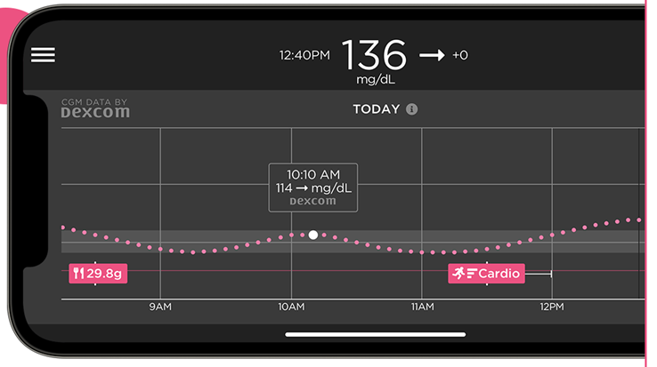

# 追蹤 AAPS（無需與 AAPS 系統互動）

In addition to the range of possibilities available for remotely controlling _and_ following **AAPS** which are described at [remote control](../RemoteFeatures/RemoteControl.md), there are several additional apps and devices which the community has developed, to simply follow numbers (glucose levels and other information), without interacting with **AAPS**.

A good overview of the extensive options available for following **AAPS** is at [Nightscout follower](https://nightscout.github.io/nightscout/downloaders/#) webpage.

```{contents} Table of contents
:depth: 1
:local: true
```

以下將詳細說明與 **AAPS** 組合使用的最常見策略。

## Smartphone apps

```{contents} These are some of the main “follower” apps used by **AAPS** users. All of these apps are “free”: 
:depth: 1
:local: true
```

### Dexcom Follow ([Android](https://play.google.com/store/apps/details?id=com.dexcom.follow.region2.mgdl) and [iOS](https://apps.apple.com/fr/app/dexcom-follow-mg-dl-dxcm2/id1032203080))


* Dexcom Follow is compatible with a wide range of handsets (both Android and iPhone). 即使你未使用官方的 Dexcom 應用程式接收傳感器資料，也可以使用 Dexcom Follow。

* Many caregivers are familiar with Dexcom Follow, preferring its clear interface over something more complicated.

* Dexcom Follow is very good for teachers/grandparents and people who know very little about diabetes and sugar levels. It has customisable alerts (BG level, what sound to play etc.). 如果傳感器仍在穩定中且產生多次假低血糖警報，則可以完全關閉警報，這非常實用。

#### 設置 Dexcom Follow：操作指南

如果你使用的是非官方的 Dexcom 應用程式 BYODA 來接收傳感器資料，你可能可以從 BYODA 應用程式內向追蹤者發送邀請。 你應該也可以從 xDrip+ 中發送 Dexcom Follow 的邀請（設置 - 雲上傳 - Dexcom 分享伺服器上傳，請參閱這裡的指示：

https://xdrip.readthedocs.io/en/latest/use/cloud/?h=#dexcom-share-server-upload

你無法再透過這些第三方應用程式向 Dexcom 追蹤者發送邀請郵件。 在 xDrip+ 中，邀請請求只會顯示訊息“未發送邀請”。

你必須安裝官方的 Dexcom 應用程式，發送邀請，然後卸載官方應用程式。

步驟如下：

1)  在_任何_智慧型手機（Android/iPhone）上安裝官方的“Dexcom”應用程式，如果方便的話，也可以安裝在追蹤者的手機上。 2)  使用你的 Dexcom 用戶名和密碼登錄，這與你用於 Dexcom Clarity 的登錄訊息相同，如果你已經是 Dexcom/Clarity 的客戶。 如果你沒有 Dexcom 登錄，這時可以選擇建立新帳號。   
3) 滑動瀏覽介紹選單。 4)  對於傳感器代碼，選擇“無代碼”。 5)  在發射器序號下，選擇“手動輸入”，並輸入任何有效的發射器代碼（如果你知道一個過期的發射器代碼，請使用他，這樣就不會干擾目前發射器的運作，他們遵循特定的數字和字母組合格式：“NLNNNL”，並且只使用特定的組合，因此使用你已知有效的代碼會更容易）。 6)  應用程式嘗試查找發射器和傳感器，你將能夠邀請追蹤者：選擇應用程式左上角的小三個點，然後新增追蹤者。 如果你的其中一個追蹤者更換了手機，需要重新發送邀請，也可以在此處刪除他們並重新發送新的邀請郵件，供他們在新設備上使用。 7)  在追蹤者的手機上，透過 App Store（iPhone）或 Play 商店（Android）下載並安裝 Dexcom Follow。 設置 Dexcom Follow 應用程式，系統會提示你打開電子郵件以找到成為跟追蹤的邀請。    
)  現在你可以刪除官方的 Dexcom G6 應用程式。

For Dexcom Follow, the sensor data is then exported from the **AAPS** phone either directly from BYODA, or from xDrip+, depending on which app you are using.


### [Nightguard](https://apps.apple.com/fr/app/nightguard/id1116430352) (iOS)


優點（用戶報告）：

* Available in the [app store](https://apps.apple.com/us/app/nightguard/id1116430352), simple, user-friendly interface.

* Swipe button or shake phone to snooze alarms at different intervals ranging from 5 min to 24 hours

* Customize alarms (high, low alerts, missed readings when no data for 15-45 minutes).

* Fast rise/drop over 2-5 consecutive readings (you choose). 還可以選擇兩個單獨讀取值之間的差值。

* Smart snooze so doesn't alert if levels are moving in right direction

* There is a Care tab which appears to enable you to set a new temp target for a certain duration, delete the temp target or enter carbs.

缺點（用戶報告）

* Only available for iOS

* The TT shows as 5 mmol regardless of which TT level is set

* Never shows Temp Basal rate even though it shows TB

### [Nightwatch](https://play.google.com/store/apps/details?id=se.cornixit.nightwatch) (Android)


* Nightwatch markets itself as a Nightscout client and monitors the user’s Nightscout glucose levels on either Android phone or tablet.

* The app can be downloaded from [Google play](https://play.google.com/store/apps/details?id=se.cornixit.nightwatch) and displays BG data in real time.

* The user can be alerted with customised noisy low and high alarms set.

* BG data can be viewed in either mmol/L or mg/dL.

* It requires Android 5.0 and up.

* It has a dark Ul, large readings and buttons, designed for usage at night.

### [xDrip+](https://xdrip.readthedocs.io/en/latest/) (Android)

你可以將 xDrip+ 作為追蹤者應用程式使用。

#### 與 Nightscout 一起使用

將 xDrip+ 設置為 Nightscout 的追蹤者。 你將接收血糖和治療訊息，但不會接收基礎速率資料。


#### 無 Nightscout - xDrip+ 作為血糖資料源

If your **AAPS** data source is xDrip+ (or if xDrip+ can also receive BG from another app like BYODA, Juggluco, ...) you can use it from the master phone to share data with xDrip+ followers, displaying BG, treatments and basal rates.


#### 無 Nightscout - xDrip+ 作為血糖輔助應用程式

If your **AAPS** data source is not xDrip+ but you can display BG data from the Companion App data source, you can use it from the master phone to share data with xDrip+ followers, displaying BG, treatments and basal rates.


### xDrip4iOS/Shuggah (iOS)


xDripSwift 是從最初的 xDrip 應用程式移植到 iOS 並發展成"xDrip for iOS"，稱為**xDrip4iOS**。

版本 **xDrip4iOS**可在 Apple Store 上以**Shuggah**的名稱獲得。

```{admonition} Further detail about how to attempt to obtain the original **xDrip4iOS** app
:class: dropdown
 [xDrip4iOS Facebook 群組](https://www.facebook.com/groups/853994615056838/announcements) 是 xDrip4iOS 和 Shuggah 的主要社群支援。 **xDrip4iOS** 可以連接許多不同的 CGM 系統和傳輸器，並顯示血糖值、圖表和統計資訊，還可以提供警報。 他還可以上傳到 Nightscout，或作為 [Nightscout 的追蹤應用程式](https://xdrip4ios.readthedocs.io/en/latest/connect/follower/)。 然而，實際上要在你的手機上獲取 **xDrip4iOS** 應用程式是很困難的。 

"我怎麼能在我的 iPhone 上獲得 **xDrip4iOS**？"
有兩個選擇：

1. 如果你擁有 Mac 和 Apple 開發者帳號（每年 99 歐元/美元），你可以按照以下說明建置自己的 xDrip4iOS：

https://xdrip4ios.readthedocs.io/en/latest/install/build/

如果你願意，你可以成為一個 "發佈者"，並與多達 100 其他人分享一個個人測試飛行 xDrip4iOS，來幫助他們：
https://xdrip4ios.readthedocs.io/.../personal_testflight/

2. 你加入 [xDrip4iOS Facebook 群組](https://www.facebook.com/groups/853994615056838/announcements) 並監控帖子……等著有人在群組中提供邀請進入他們的個人測試飛行發佈。 **你不應該要求應用程式的邀請**（請閱讀團體規則）。 

因此，更簡單的解決方案是下載 **Shuggah** 應用程式。 
```

#### [Shuggah](https://apps.apple.com/sa/app/shuggah/id1586789452)

應用程式：


“什麼是 Shuggah？” 一群烏克蘭開發者複製了 GitHub 上公開分享的 xDrip4iOS 項目代碼，並在 Apple Store 上以商業帳戶發佈該應用程式（該應用程式是免費的，他們的初衷是好的）。 該應用程式必須稍作修改以添加隱私聲明和免責聲明才能透過審核，但其餘部分應與 xDrip4iOS 相同。 Shuggah 發佈版不是由 xDrip4iOS 開發者管理的，因此不能保證他的功能與 xDrip4iOS 相同，也不能保證他會與 xDrip4iOS 同時更新，或者 Apple 不會在某個時間點將其從 App Store 中移除。

xDrip4iOS Facebook 群組支援 xDrip4iOS、Shuggah 以及相應的 Apple Watch 應用程式。

### [Sugarmate](https://apps.apple.com/fr/app/sugarmate/id1111093108) (iOS)





[Sugarmate](https://sugarmate.io/)可從 App Store 下載到 iPhone 上。 Sugarmate is compatible with:
* Apple iPhone (Requires software version 13.0 or later)
* Apple iPad (Requires software version 13.0 or later)
* Google Android (Save web app to your homescreen)

據 Sugarmate 用戶報告，他可以在美國與 Apple CarPlay 一起使用，當駕駛時顯示血糖讀取值。 目前尚未確定這在美國以外的國家是否可行。 如果你知道更多有關此功能的資訊，請透過提交 pull-request（鏈接）將詳細資料添加到文件中，這過程快速且簡單。


### [Spike](https://spike-app.com/) (iOS)


Spike 可用作主要接收器或追蹤者應用程式，提供血糖、警報、IOB 等功能。 該網站和應用程式已不再開發。 詳細資訊請參閱 [這裡](https://spike-app.com/#features2)。 支援可以在 [Facebook](https://www.facebook.com/groups/1973791946274873) 和 [Gitter](https://gitter.im/SpikeiOS/Lobby) 上找到。

要安裝 Spike，請參閱 [這裡](https://spike-app.com/#installation)

## Smartwatches for **Monitoring of AAPS** (full profile data, or glucose-only) where **AAPS** is running on a phone.

允許與 **AAPS** 進行互動的智慧型手錶選項已在文件的 ["遠端控制"](../RemoteFeatures/RemoteControl.md) 部分中描述。

還有各種經濟實惠的智慧型手錶可供顯示資料使用。 如果你使用 Nightscout，那麼這裡有關所有選項的一個不錯的概述 [這裡](https://nightscout.github.io/nightscout/wearable/#)

在這裡我們總結了一些 **AAPS** 用戶流行的僅追蹤手錶選項：

### a)  **小米和 Amazfit 手錶**

[Artem](https://github.com/bigdigital) 為各種智慧型手錶型號建立了一個 xDrip+ 集成應用程式 WatchDrip+，主要針對小米（如 Mi band）和 Amazfit 品牌：


You can read more about them, including how to set up at his website [here](https://bigdigital.home.blog/). 這些手錶的優點是他們體積小且價格相對實惠（小米 Mi Band 5 的建議零售價為新台幣895元）。 他們是兒童和手腕較小的人們一個不錯的選擇。

### b) Pebble 手錶


Pebble watches ([now discontinued](https://en.wikipedia.org/wiki/Pebble_(watch))) were on general sale from 2013 to 2016, and may still be available second-hand. Fitbit 接管了 Pebble 的資產。 Pebble 用戶可以使用 Urchin 表盤查看 Nightscout 資料。 顯示的資料選項包括 IOB、目前的臨時基礎速率和預測值。 如果使用開放循環，你可以使用 IFTTT 建立一個應用程式，如果收到來自**AAPS**的通知，則發送 SMS 或 pushover 通知。

### c) [Bluejay GTS 手錶](https://bluejay.website/shop/product/bluejay-gts-26)


這是一款獨特的技術產品，可以 **直接**從 Dexcom G6 發射器接收血糖資料。 很多人不知道 Dexcom G6 發射器實際上會在兩個獨立的通道上廣播目前的血糖資料，一個是手機通道，另一個是幫浦通道。 The Bluejay GTS watch runs a modified version of xDrip+ software, and can be set to receive glucose data on either channel, so if **AAPS **  is using the phone channel, then the Bluejay GTS watch can use the pump channel.

Bluejay GTS 手錶體積小、防水且價格相對實惠（目前售價為 115 英鎊），可從英國國際運送。 其主要優點是他目前是唯一完全獨立於手機和循環系統的手錶。 So, for example, if you disconnect the pump and the **AAPS** phone at the beach or flume park, and are out of range of the **AAPS** phone, you can still get readings from the Dexcom G6 directly to the Bluejay watch.

Reported disadvantages are that it doesn’t always pick up a reading every 5 min, and the battery is not replaceable. The Bluejay GTS watch runs a modified version of xDrip+ software, and it currently doesn’t work with other Dexcom versions (G7) or Libre sensors.

### d) Apple 手錶

查看 [你的手錶上的 Nightscout](https://nightscout.github.io/nightscout/wearable/#)：

選項包括 Nightguard、Sugarmate、Gluco-Tracker 和 Loop Follow。


## Devices for following AAPS

```{contents} Devices include:
:depth: 1
:local: true
```

### M5 stack


M5Stack 是一個小盒子，可以用來進行多種程式開發，Martin 的項目 [M5Stack NightscoutMon](https://github.com/mlukasek/M5_NightscoutMon/wiki) 顯示傳感器血糖值和趨勢、IOB 和 COB。 他是一個塑膠盒，配備了彩色顯示屏、micro SD 卡槽、3 個按鈕、揚聲器和內置電池。 It is a great blood sugar monitor and is relatively easy to set up if you have a Nightscout account. Users typically run it on their home Wi-Fi, but some users report using it as a display when motorbiking, by running it off a phone Wi-Fi hotspot.

### Sugarpixel

SugarPixel 是一個連線 Dexcom 應用程式或 Nightscout 應用程式的次級血糖顯示警報系統，用於持續血糖監測。 該設備顯示實時的血糖讀取值。 這款 CGM 硬體顯示器具備隨機音調生成的音檔警報（聲音非常大）、針對聽力受損者的振動警報、自定義顯示選項以及原生多用戶追蹤功能。


* SugarPixel has multiple display options in mg/dL and mmol/L to suit the user’s needs with colour-coded glucose values.
* The standard face displays BG, Trend Arrow, and Delta. Delta 是與上一次讀取值的變化值（正或負）。
* SugarPixel can be customised for use in low brightness with the BG and Time face to see the user’s BG reading and current time on the user’s nightstand.
* SugarPixel’s xolour face utilises the entire display to show a single colour representing the BG value. 這使得用戶可以在戶外的後院、露台或游泳池旁，透過窗戶從遠處看到血糖讀取值。
* The Big BG face is useful for nightstand users who wear glasses or contact lenses.


### PC (TeamViewer)
一些用戶發現像[TeamViewer](https://www.teamviewer.com/)這樣的完整遠端桌面工具對於進行進階的遠端問題排除非常有幫助。