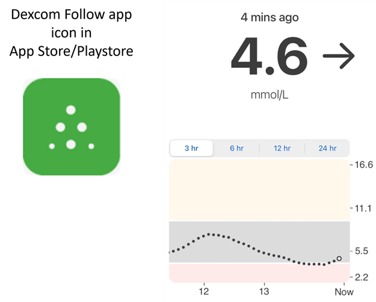

# 追蹤 AAPS（無需與 AAPS 系統互動）

除了可用於遠端控制_及_追蹤**AAPS**的各種可能性外，社群還開發了幾個其他應用和裝置，可以簡單地追蹤數據（血糖水平和其他資訊），而無需與**AAPS**進行互動。

對於追蹤 **AAPS** 提供的廣泛選項，一個很好的總覽可以在 [Nightscout 追蹤者](https://nightscout.github.io/nightscout/downloaders/#) 網頁上找到。

```{contents} Table of contents
:depth: 1
:local: true
```

以下將詳細說明與 **AAPS** 組合使用的最常見策略。

## 智慧型手機應用程式

```{contents} These are some of the main “follower” apps used by **AAPS** users. All of these apps are “free”: 
:depth: 1
:local: true
```

### Dexcom Follow（[Android](https://play.google.com/store/apps/details?id=com.dexcom.follow.region2.mgdl)及[iOS](https://apps.apple.com/fr/app/dexcom-follow-mg-dl-dxcm2/id1032203080)）



* Dexcom Follow相容於多種手機（包括Android和iPhone）。 即使你未使用官方的 Dexcom 應用程式接收傳感器資料，也可以使用 Dexcom Follow。

* 許多看護熟悉Dexcom Follow，更喜歡其清晰的界面而非更複雜的應用。

* Dexcom Follow對教師/祖父母以及對糖尿病和血糖水平知之甚少的人非常有用。 它具有可自定義的警報（BG水平、播放聲音等）。 如果傳感器仍在穩定中且產生多次假低血糖警報，則可以完全關閉警報，這非常實用。

#### 設置 Dexcom Follow：操作指南

如果你使用非官方的 Dexcom 應用程式 BYODA 來接收感測器資料，你或許仍能直接在 BYODA 應用程式中發送追蹤者邀請。

你無法再透過第三方應用程式寄送邀請電子郵件給 Dexcom 的追蹤者。 在 xDrip+ 中，邀請請求只會顯示訊息“未發送邀請”。

你必須安裝官方的 Dexcom 應用程式，發送邀請，然後卸載官方應用程式。

步驟如下：

1)  在_任何_智慧型手機（Android/iPhone）上安裝官方的“Dexcom”應用程式，如果方便的話，也可以安裝在追蹤者的手機上。 2)  使用你的 Dexcom 用戶名和密碼登錄，這與你用於 Dexcom Clarity 的登錄訊息相同，如果你已經是 Dexcom/Clarity 的客戶。 如果你沒有 Dexcom 登錄，這時可以選擇建立新帳號。   
3) 滑動瀏覽介紹選單。 4)  對於傳感器代碼，選擇“無代碼”。 5)  在發射器序號下，選擇“手動輸入”，並輸入任何有效的發射器代碼（如果你知道一個過期的發射器代碼，請使用他，這樣就不會干擾目前發射器的運作，他們遵循特定的數字和字母組合格式：“NLNNNL”，並且只使用特定的組合，因此使用你已知有效的代碼會更容易）。 6)  應用程式嘗試查找發射器和傳感器，你將能夠邀請追蹤者：選擇應用程式左上角的小三個點，然後新增追蹤者。 如果你的其中一個追蹤者更換了手機，需要重新發送邀請，也可以在此處刪除他們並重新發送新的邀請郵件，供他們在新設備上使用。 7)  在追蹤者的手機上，透過 App Store（iPhone）或 Play 商店（Android）下載並安裝 Dexcom Follow。 設置 Dexcom Follow 應用程式，系統會提示你打開電子郵件以找到成為跟追蹤的邀請。    
)  現在你可以刪除官方的 Dexcom G6 應用程式。

對於Dexcom Follow，傳感器資料然後從**AAPS**手機中直接從BYODA或xDrip+匯出，具體取決於你使用的應用。


### [Nightguard](https://apps.apple.com/fr/app/nightguard/id1116430352)（iOS）


優點（用戶報告）：

* 可在[應用商店](https://apps.apple.com/us/app/nightguard/id1116430352)上獲得，介面簡單易用。

* 滑動按鈕或搖動手機可在不同間隔（從 5 分鐘到 24 小時）中將鬧鐘延後。

* 自定義鬧鐘（高、低警報，當 15-45 分鐘內無資料時，顯示遺漏讀數）。

* 在 2-5 次連續讀數中快速上升/下降（由你選擇）。 還可以選擇兩個單獨讀取值之間的差值。

* 智慧延遲，當數值朝正確方向移動時，不會發出警報。

* 有一個照護標籤，可以讓你設定特定時間內的新臨時目標，刪除臨時目標或輸入碳水化合物。

缺點（用戶報告）

* 只適用於 iOS

* 無論設置的 TT 數值如何，TT 始終顯示為 5 mmol

* 從不顯示臨時基礎速率，儘管顯示了 TB

### [Nightwatch](https://play.google.com/store/apps/details?id=se.cornixit.nightwatch)（Android）


* Nightwatch 自我介紹為 Nightscout 客戶端，並監測用戶的 Nightscout 血糖值，無論在 Android 手機或平板上。

* 此應用可從[Google Play](https://play.google.com/store/apps/details?id=se.cornixit.nightwatch)下載，並實時顯示 BG 資料。

* 用戶可以收到自定義的干擾高低警報。

* BG 資料可以以 mmol/L 或 mg/dL 形式查看。

* 需要 Android 5.0 及以上版本。

* 它有深色界面、大字體和按鈕，設計用於夜間使用。

### xDrip+ (Android)

你可以將 xDrip+ 作為追蹤者應用程式使用。

#### 與 Nightscout 一起使用

將 xDrip+ 設置為 Nightscout 的追蹤者。 你將接收血糖和治療訊息，但不會接收基礎速率資料。


#### 無 Nightscout - xDrip+ 作為血糖資料源

如果你的**AAPS** 資料來源是 xDrip+（或如果 xDrip+ 也能從其他應用（如 BYODA、Juggluco 等）接收 BG），則可以用主手機與 xDrip+ 追蹤者分享資料，顯示 BG、治療和基礎率。


#### 無 Nightscout - xDrip+ 作為血糖輔助應用程式

如果你的**AAPS** 資料來源不是 xDrip+，但可以顯示來自 夥伴應用程式(Companion App) 資料來源的血糖糖資料，則可以用主手機與 xDrip+ 追蹤者分享資料，顯示 BG、治療和基礎率。


### xDrip4iOS (iOS)


xDripSwift 是從最初的 xDrip 應用程式移植到 iOS 並發展成"xDrip for iOS"，稱為**xDrip4iOS**。

```{admonition} Further detail about how to attempt to obtain the original **xDrip4iOS** app
:class: dropdown
 [xDrip4iOS Facebook 群組](https://www.facebook.com/groups/853994615056838/announcements) 是 xDrip4iOS 和 Shuggah 的主要社群支援。 **xDrip4iOS** 可以連接許多不同的 CGM 系統和傳輸器，並顯示血糖值、圖表和統計資訊，還可以提供警報。 他還可以上傳到 Nightscout，或作為 [Nightscout 的追蹤應用程式](https://xdrip4ios.readthedocs.io/en/latest/connect/follower/)。 

"我怎麼能在我的 iPhone 上獲得 **xDrip4iOS**？"
有兩個選擇：

1. 如果你擁有 Mac 並且有 Apple 開發者帳號（每年 99 歐元/美元），你可以按照<a href="https://xdrip4ios.readthedocs.io/en/latest/install/build/">這些指引</a>自行建置 xDrip4iOS。

如果你願意，你可以成為「發布者」，並且<a href="https://xdrip4ios.readthedocs.io/en/latest/install/personal_testflight/">分享個人 TestFlight 版 xDrip4iOS</a>給最多 100 位使用者，幫助他們。

2. <source>你可以加入 <a href="https://www.facebook.com/groups/853994615056838/announcements">xDrip4iOS Facebook 群組</a>，並閱讀置頂貼文，以獲取最新的應用程式下載方式。</source> **你不應該要求應用程式的邀請**（請閱讀團體規則）。
```


什麼是 **Shuggah**？ 一些烏克蘭開發者複製了 xDrip4iOS 的專案程式碼（該程式碼已在 GitHub 上公開分享），並透過商業帳號將其發布到 App Store。 Shuggah 的發布完全不受 xDrip4iOS 開發者管理。

[xDrip4iOS Facebook 群組](https://www.facebook.com/groups/853994615056838/announcements) 支援 xDrip4iOS 及相應的 Apple Watch 應用程式。

### [Sugarmate](https://apps.apple.com/fr/app/sugarmate/id1111093108)（iOS）


[Sugarmate](https://sugarmate.io/)可從 App Store 下載到 iPhone 上。 Sugarmate 與以下設備相容：
* Apple iPhone（需要軟體版本 13.0 或更高）
* Apple iPad（需要軟體版本 13.0 或更高）
* Google Android（將網頁應用儲存到主畫面）

據 Sugarmate 用戶報告，他可以在美國與 Apple CarPlay 一起使用，當駕駛時顯示血糖讀取值。 目前尚未確定這在美國以外的國家是否可行。 如果你知道更多有關此功能的資訊，請透過提交 pull-request（鏈接）將詳細資料添加到文件中，這過程快速且簡單。


### [Spike](https://spike-app.com/)（iOS）


Spike 可用作主要接收器或追蹤者應用程式，提供血糖、警報、IOB 等功能。

該網站和應用程式已不再開發。 支援可以在 [Facebook](https://www.facebook.com/groups/1973791946274873) 和 [Gitter](https://gitter.im/SpikeiOS/Lobby) 上找到。

## 智慧型手錶用於**監控 AAPS**（完整設定檔資料或僅限血糖），其中**AAPS**在手機上運行。

請參閱 [這裡](../Getting-Started/Watches.md).


## 追蹤 AAPS 的設備

```{contents} Devices include:
:depth: 1
:local: true
```

### M5 stack


M5Stack 是一個小盒子，可以用來進行多種程式開發，Martin 的項目 [M5Stack NightscoutMon](https://github.com/mlukasek/M5_NightscoutMon/wiki) 顯示傳感器血糖值和趨勢、IOB 和 COB。 他是一個塑膠盒，配備了彩色顯示屏、micro SD 卡槽、3 個按鈕、揚聲器和內置電池。 它是一款優秀的血糖監測器，如果你有 Nightscout 帳號，設置相對簡單。 用戶通常在家中的 Wi-Fi 下運行它，但有些用戶報告在摩托車駕駛時通過手機 Wi-Fi 熱點使用它作為顯示器。

### Sugarpixel

SugarPixel 是一個連線 Dexcom 應用程式或 Nightscout 應用程式的次級血糖顯示警報系統，用於持續血糖監測。 該設備顯示實時的血糖讀取值。 這款 CGM 硬體顯示器具備隨機音調生成的音檔警報（聲音非常大）、針對聽力受損者的振動警報、自定義顯示選項以及原生多用戶追蹤功能。


* SugarPixel 提供多種顯示選項，以 mg/dL 和 mmol/L 形式滿足用戶需求，並使用顏色標示血糖值。
* 標準錶盤顯示 BG、趨勢箭頭和增量。 Delta 是與上一次讀取值的變化值（正或負）。
* SugarPixel 可以自定義為低亮度使用，讓 BG 和時間錶盤同時顯示用戶的 BG 讀取值和當前時間放在用戶的床頭櫃上。
* SugarPixel 的 xolour 錶盤利用整個顯示屏顯示代表 BG 值的單一顏色。 這使得用戶可以在戶外的後院、露台或游泳池旁，透過窗戶從遠處看到血糖讀取值。
* 大 BG 錶盤對於戴眼鏡或隱形眼鏡的床頭櫃用戶來說特別有用。

### Nightscout 錶鐘在 Ulanzi TC001 上

**Nightscout 錶鐘** 是一個開源軟體，運行於**Ulanzi TC001** 裝置上。 它可以連接到 Dexcom 伺服器或 Nightscout，並實時顯示血糖讀數。


* 這個錶鐘支援 mmol/L 和 mg/dL 單位，並包含可聽到的警報。
* 提供多種顯示方式，詳見[Github nightscout-clock](https://github.com/ktomy/nightscout-clock?tab=readme-ov-file#more-information-for-people-who-needs-it) 以獲取總覽。
* 設定和配置裝置只需幾個簡單步驟。 一旦設置完成，只需供電和 Wi-Fi 即可運行。
* Ulanzi TC001 裝置的購買價格顯著低於 SugarPixel。
* 軟體及安裝說明可以在[Github nightscout-clock](https://github.com/ktomy/nightscout-clock?tab=readme-ov-file)上找到。
* 它由 Artiom Kenibasov 開發和維護，並在[Facebook AAPS 使用者群組](https://www.facebook.com/groups/cgminthecloud/posts/8776932509094594/)上提供支援。

### PC（TeamViewer）
一些用戶發現像[TeamViewer](https://www.teamviewer.com/)這樣的完整遠端桌面工具對於進行進階的遠端問題排除非常有幫助。
