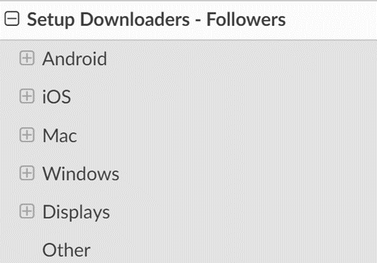
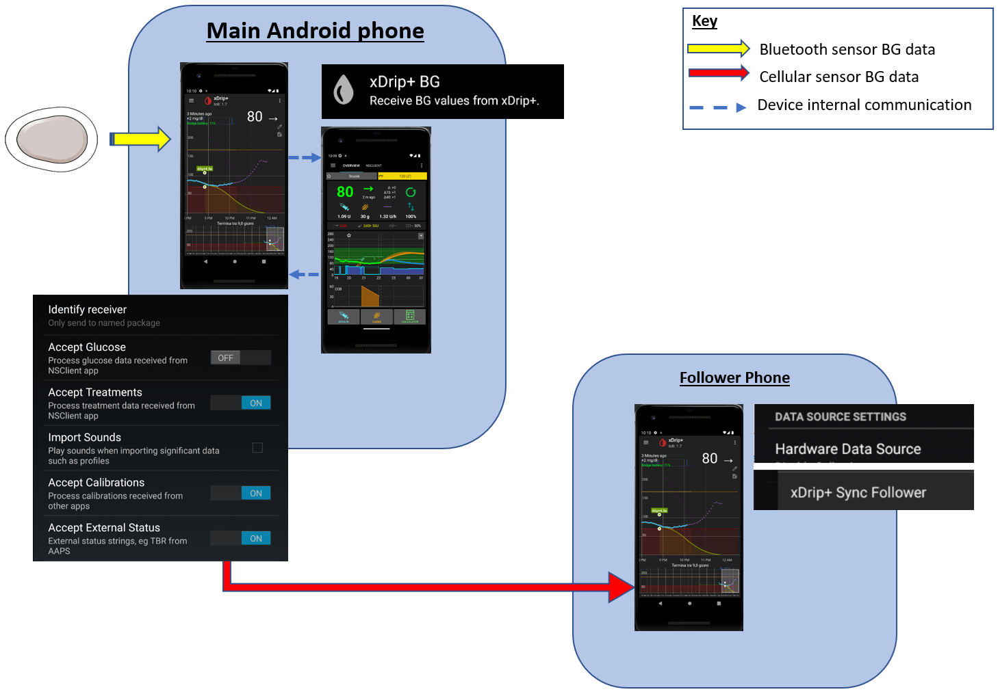
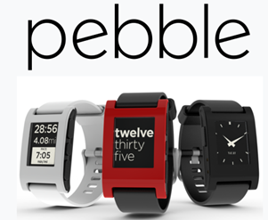
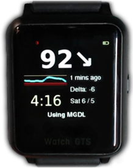

# 追蹤 AAPS（無需與 AAPS 系統互動）

除了可用於遠端控制_和_跟踪**AAPS**的各種可能性，這些功能在[遠端控制](../RemoteFeatures/RemoteControl.md)中描述，社群還開發了一些額外的應用程式和設備，僅用於跟踪資料 (血糖數值和其他訊息)，而無需與 AAPS 互動。

對於如何追蹤**AAPS**，一個非常好的概述可以在[Nightscout follower](https://nightscout.github.io/nightscout/downloaders/#)網頁中找到；如果你展開左側選單：



以下將詳細說明與 **AAPS** 組合使用的最常見策略。

## 1) 智慧型手機應用程式

以下是一些**AAPS**用戶使用的主要 “追蹤者” 應用程式。 所有這些應用程式都是“免費”的：

A)  Dexcom Follow（Android/iOS）

B)  Nightguard（iOS）

C)  Nightwatch（Android）

D)  xDrip+（Android）

E)  xDrip4iOS（iOS）

F)  Sugarmate（iOS）

G)  Spike（iOS）


### A) Dexcom Follow（Android 和 iOS）


●  Dexcom Follow 適用於多種手持設備（包括 Android 和 iPhone）。 即使你未使用官方的 Dexcom 應用程式接收傳感器資料，也可以使用 Dexcom Follow。

●  許多照護者熟悉 Dexcom Follow，因為他簡單明瞭的界面相較於其他複雜的應用更受青睞。

●  Dexcom Follow 非常適合教師/祖父母以及對糖尿病和血糖數值知識不多的人使用。 他具有可自訂的警報（血糖數值，播放的聲音等）。 如果傳感器仍在穩定中且產生多次假低血糖警報，則可以完全關閉警報，這非常實用。

#### 設置 Dexcom Follow：操作指南

如果你使用的是非官方的 Dexcom 應用程式 BYODA 來接收傳感器資料，你可能可以從 BYODA 應用程式內向追蹤者發送邀請。 你應該也可以從 xDrip+ 中發送 Dexcom Follow 的邀請（設置 - 雲上傳 - Dexcom 分享伺服器上傳，請參閱這裡的指示：

https://xdrip.readthedocs.io/en/latest/use/cloud/?h=#dexcom-share-server-upload

你無法再透過這些第三方應用程式向 Dexcom 追蹤者發送邀請郵件。 在 xDrip+ 中，邀請請求只會顯示訊息“未發送邀請”。

你必須安裝官方的 Dexcom 應用程式，發送邀請，然後卸載官方應用程式。

步驟如下：

1)  在_任何_智慧型手機（Android/iPhone）上安裝官方的“Dexcom”應用程式，如果方便的話，也可以安裝在追蹤者的手機上。 2)  使用你的 Dexcom 用戶名和密碼登錄，這與你用於 Dexcom Clarity 的登錄訊息相同，如果你已經是 Dexcom/Clarity 的客戶。 如果你沒有 Dexcom 登錄，這時可以選擇建立新帳號。   
3) 滑動瀏覽介紹選單。 4)  對於傳感器代碼，選擇“無代碼”。 5)  在發射器序號下，選擇“手動輸入”，並輸入任何有效的發射器代碼（如果你知道一個過期的發射器代碼，請使用他，這樣就不會干擾目前發射器的運作，他們遵循特定的數字和字母組合格式：“NLNNNL”，並且只使用特定的組合，因此使用你已知有效的代碼會更容易）。 6)  應用程式嘗試查找發射器和傳感器，你將能夠邀請追蹤者：選擇應用程式左上角的小三個點，然後新增追蹤者。 如果你的其中一個追蹤者更換了手機，需要重新發送邀請，也可以在此處刪除他們並重新發送新的邀請郵件，供他們在新設備上使用。 7)  在追蹤者的手機上，透過 App Store（iPhone）或 Play 商店（Android）下載並安裝 Dexcom Follow。 設置 Dexcom Follow 應用程式，系統會提示你打開電子郵件以找到成為跟追蹤的邀請。    
)  現在你可以刪除官方的 Dexcom G6 應用程式。

對於 Dexcom Follow，傳感器資料會根據你使用的應用程式，從 AAPS 手機直接透過 BYODA 或 xDrip+ 匯出。


### B) Nightguard（iOS）


優點（用戶報告）：

●  可在[app store](https://apps.apple.com/us/app/nightguard/id1116430352)中獲得，簡單且使用者友好的界面。

●  滑動按鈕或搖動手機以延後不同間隔的警報，範圍從5分鐘到24小時。

●  自訂警報（高、低警報，當無資料15-45分鐘時的警報）。

●  快速上升/下降超過2-5次連續讀取值（你可以選擇）。 還可以選擇兩個單獨讀取值之間的差值。

●  智慧延後功能，不會在資料朝正確方向變動時發出警報。

●  還有一個“照護”標籤，允許你設定一個臨時目標持續一段時間、刪除臨時目標或輸入碳水化合物數量。

缺點（用戶報告）

●   只適用於 iOS

●   無論設置的 TT 數值如何，TT 始終顯示為 5 mmol

●   從不顯示臨時基礎速率，儘管顯示了 TB

### C) Nightwatch（Android）


●   Nightwatch 自稱為 Nightscout 客戶端，可在 Android 手機或平板電腦上監控用戶的 Nightscout 血糖數值。

●   該應用程式可從[Google play](https://play.google.com/store/apps/details?id=se.cornixit.nightwatch)下載，並以實時方式顯示血糖資料。

●   用戶可以透過自訂的高低噪音警報進行提醒。

●   血糖資料可以用 mmol/L 或 mg/dL 顯示。

●   需要 Android 5.0 及更高版本。

●   他有一個黑色界面，大字體顯示和大按鈕，專為夜間使用設計。

### D) xDrip+（Android）

你可以將 xDrip+ 作為追蹤者應用程式使用。

#### 與 Nightscout 一起使用

將 xDrip+ 設置為 Nightscout 的追蹤者。 你將接收血糖和治療訊息，但不會接收基礎速率資料。


#### 無 Nightscout - xDrip+ 作為血糖資料源

如果你的 AAPS 資料源是 xDrip+（或如果 xDrip+ 也可以從其他應用程式接收血糖資料，如 BYODA、Juggluco 等），你可以從主手機分享資料給 xDrip+ 追蹤者，顯示血糖、治療和基礎速率資訊。



#### 無 Nightscout - xDrip+ 作為血糖輔助應用程式

如果你的 AAPS 資料源不是 xDrip+，但可以顯示來自輔助應用程式資料源的血糖資料，你可以從主手機分享資料給 xDrip+ 追蹤者，顯示血糖、治療和基礎速率資訊。


### E) xDrip4iOS/Shuggah（iOS）


xDripSwift 是從最初的 xDrip 應用程式移植到 iOS 並發展成"xDrip for iOS"，稱為**xDrip4iOS**。

版本 **xDrip4iOS**可在 Apple Store 上以**Shuggah**的名稱獲得。

```{admonition} Further detail about how to attempt to obtain the original **xDrip4iOS** app
:class: dropdown
 [xDrip4iOS Facebook 群組](https://www.facebook.com/groups/853994615056838/announcements) 是 xDrip4iOS 和 Shuggah 的主要社群支援。 **xDrip4iOS** 可以連接許多不同的 CGM 系統和傳輸器，並顯示血糖值、圖表和統計資訊，還可以提供警報。 他還可以上傳到 Nightscout，或作為 [Nightscout 的追蹤應用程式](https://xdrip4ios.readthedocs.io/en/latest/connect/follower/)。 然而，實際上要在你的手機上獲取 **xDrip4iOS** 應用程式是很困難的。 

"我怎麼能在我的 iPhone 上獲得 **xDrip4iOS**？"
有兩個選擇：

1. 如果你擁有 Mac 和 Apple 開發者帳號（每年 99 歐元/美元），你可以按照以下說明建置自己的 xDrip4iOS：

https://xdrip4ios.readthedocs.io/en/latest/install/build/

如果你願意，你可以成為一個 "發佈者"，並與多達 100 其他人分享一個個人測試飛行 xDrip4iOS，來幫助他們：
https://xdrip4ios.readthedocs.io/.../personal_testflight/

2. 你加入 [xDrip4iOS Facebook 群組](https://www.facebook.com/groups/853994615056838/announcements) 並監控帖子……等著有人在群組中提供邀請進入他們的個人測試飛行發佈。 **你不應該要求應用程式的邀請**（請閱讀團體規則）。 

因此，更簡單的解決方案是下載 **Shuggah** 應用程式。 
```

#### [Shuggah](https://apps.apple.com/sa/app/shuggah/id1586789452)

應用程式：


“什麼是 Shuggah？” 一群烏克蘭開發者複製了 GitHub 上公開分享的 xDrip4iOS 項目代碼，並在 Apple Store 上以商業帳戶發佈該應用程式（該應用程式是免費的，他們的初衷是好的）。 該應用程式必須稍作修改以添加隱私聲明和免責聲明才能透過審核，但其餘部分應與 xDrip4iOS 相同。 Shuggah 發佈版不是由 xDrip4iOS 開發者管理的，因此不能保證他的功能與 xDrip4iOS 相同，也不能保證他會與 xDrip4iOS 同時更新，或者 Apple 不會在某個時間點將其從 App Store 中移除。

xDrip4iOS Facebook 群組支援 xDrip4iOS、Shuggah 以及相應的 Apple Watch 應用程式。

### F) Sugarmate（iOS）


[Sugarmate](https://sugarmate.io/)可從 App Store 下載到 iPhone 上。 Sugarmate 相容於：●   Apple iPhone（需要 13.0 或更高版本的軟體）●   Apple iPad（需要 13.0 或更高版本的軟體）●   Google Android（將網頁應用程式儲存到主螢幕）

據 Sugarmate 用戶報告，他可以在美國與 Apple CarPlay 一起使用，當駕駛時顯示血糖讀取值。 目前尚未確定這在美國以外的國家是否可行。 如果你知道更多有關此功能的資訊，請透過提交 pull-request（鏈接）將詳細資料添加到文件中，這過程快速且簡單。


### G)  [Spike](https://spike-app.com/) (iOS)


Spike 可用作主要接收器或追蹤者應用程式，提供血糖、警報、IOB 等功能。 該網站和應用程式已不再開發。 詳細資訊請參閱 [這裡](https://spike-app.com/#features2)。 支援可以在 [Facebook](https://www.facebook.com/groups/1973791946274873) 和 [Gitter](https://gitter.im/SpikeiOS/Lobby) 上找到。

要安裝 Spike，請參閱 [這裡](https://spike-app.com/#installation)

## 2) 用於 **監控 AAPS** 的智慧型手錶（完整的個人資料資料或僅顯示血糖）當 **AAPS** 在手機上運作時。

允許與 **AAPS** 進行互動的智慧型手錶選項已在文件的 ["遠端控制"](../RemoteFeatures/RemoteControl.md) 部分中描述。

還有各種經濟實惠的智慧型手錶可供顯示資料使用。 如果你使用 Nightscout，那麼這裡有關所有選項的一個不錯的概述 [這裡](https://nightscout.github.io/nightscout/wearable/#)

在這裡我們總結了一些 **AAPS** 用戶流行的僅追蹤手錶選項：

### a)  **小米和 Amazfit 手錶**

[Artem](https://github.com/bigdigital) 為各種智慧型手錶型號建立了一個 xDrip+ 集成應用程式 WatchDrip+，主要針對小米（如 Mi band）和 Amazfit 品牌：


你可以在他的網站上閱讀更多有關他們的資訊，包括如何設置 [這裡](https://bigdigital.home.blog/)。 這些手錶的優點是他們體積小且價格相對實惠（小米 Mi Band 5 的建議零售價為新台幣895元）。 他們是兒童和手腕較小的人們一個不錯的選擇。

### b) Pebble 手錶




Pebble 手錶（[現已停產](https://en.wikipedia.org/wiki/Pebble_(watch))）於 2013 年至 2016 年間在市場上銷售，仍可二手購買。 Fitbit 接管了 Pebble 的資產。 Pebble 用戶可以使用 Urchin 表盤查看 Nightscout 資料。 顯示的資料選項包括 IOB、目前的臨時基礎速率和預測值。 如果使用開放循環，你可以使用 IFTTT 建立一個應用程式，如果收到來自**AAPS**的通知，則發送 SMS 或 pushover 通知。

### c) [Bluejay GTS 手錶](https://bluejay.website/shop/product/bluejay-gts-26)





這是一款獨特的技術產品，可以 **直接**從 Dexcom G6 發射器接收血糖資料。 很多人不知道 Dexcom G6 發射器實際上會在兩個獨立的通道上廣播目前的血糖資料，一個是手機通道，另一個是幫浦通道。 Bluejay GTS 手錶運作的是經過修改的 Xdrip+ 軟體，並且可以設置為在任一通道上接收血糖資料，因此如果 **AAPS** 使用手機通道，那麼 Bluejay GTS 手錶可以使用幫浦通道。

Bluejay GTS 手錶體積小、防水且價格相對實惠（目前售價為 115 英鎊），可從英國國際運送。 其主要優點是他目前是唯一完全獨立於手機和循環系統的手錶。 例如，如果你在海灘或水上樂園時中斷幫浦和 **AAPS**手機的連線，並且超出了 AAPS 手機的範圍，你仍然可以從 Dexcom G6 直接獲取 Bluejay 手錶的讀取值。

報告的缺點是他並不總是每 5 分鐘獲取一次讀取值，並且電池不可更換。 Bluejay GTS 手錶運作的是經過修改的 Xdrip+ 軟體，目前不支援其他 Dexcom 版本（如 G7）或 Libre 傳感器。

### d) Apple 手錶

查看 [你的手錶上的 Nightscout](https://nightscout.github.io/nightscout/wearable/#)：

選項包括 Nightguard、Sugarmate、Gluco-Tracker 和 Loop Follow。


## 3) 追蹤 AAPS 的設備

設備包括：A)  M5 stack/M5 stickC

B)  Sugarpixel

C)  PC（Teamviewer）


### A) M5 stack


M5Stack 是一個小盒子，可以用來進行多種程式開發，Martin 的項目 [M5Stack NightscoutMon](https://github.com/mlukasek/M5_NightscoutMon/wiki) 顯示傳感器血糖值和趨勢、IOB 和 COB。 他是一個塑膠盒，配備了彩色顯示屏、micro SD 卡槽、3 個按鈕、揚聲器和內置電池。 他是一個很棒的血糖監測器，並且如果你擁有 Nightscout 帳戶，設置相對容易。 用戶通常將其運作在他們的家庭 wifi 上，但有些用戶報告說，他們透過手機 wifi 熱點在騎摩托車時使用他作為顯示器。

### B) Sugarpixel

SugarPixel 是一個連線 Dexcom 應用程式或 Nightscout 應用程式的次級血糖顯示警報系統，用於持續血糖監測。 該設備顯示實時的血糖讀取值。 這款 CGM 硬體顯示器具備隨機音調生成的音檔警報（聲音非常大）、針對聽力受損者的振動警報、自定義顯示選項以及原生多用戶追蹤功能。


●   SugarPixel 具有多種顯示選項，支援 mg/dL 和 mmol/L，以滿足用戶的需求，並且帶有顏色標識的血糖值。 ●   標準顯示面板顯示血糖讀取值、趨勢箭頭和 Delta 值。 Delta 是與上一次讀取值的變化值（正或負）。 ●   SugarPixel 可以自定義為低亮度模式，顯示血糖和時間面板，方便用戶在床邊桌上查看目前血糖讀取值和時間。 ●   SugarPixel 的彩色面板利用整個顯示屏來展示單一顏色，代表目前的血糖值。 這使得用戶可以在戶外的後院、露台或游泳池旁，透過窗戶從遠處看到血糖讀取值。 ●   大血糖面板非常適合床邊使用，特別是佩戴眼鏡或隱形眼鏡的用戶。


### C) 電腦（TeamViewer）
一些用戶發現像[TeamViewer](https://www.teamviewer.com/)這樣的完整遠端桌面工具對於進行進階的遠端問題排除非常有幫助。


 


