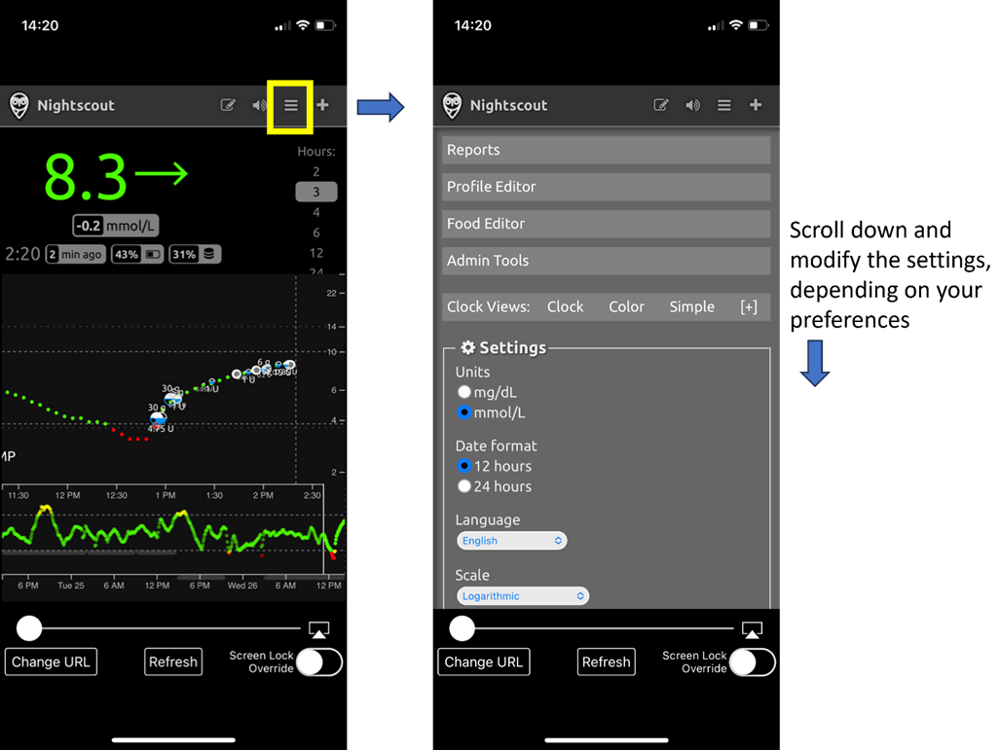
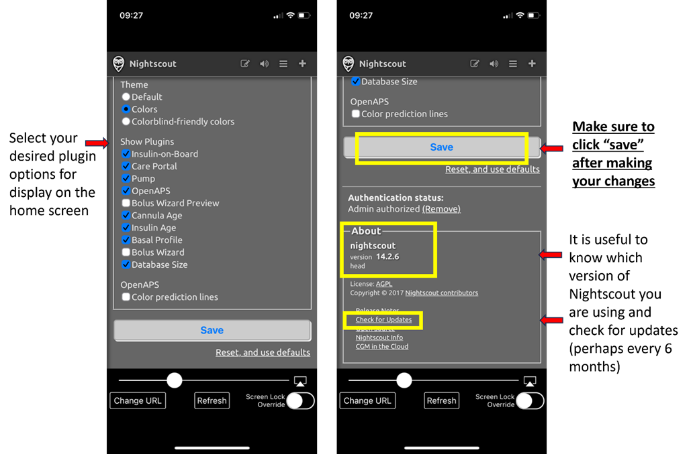
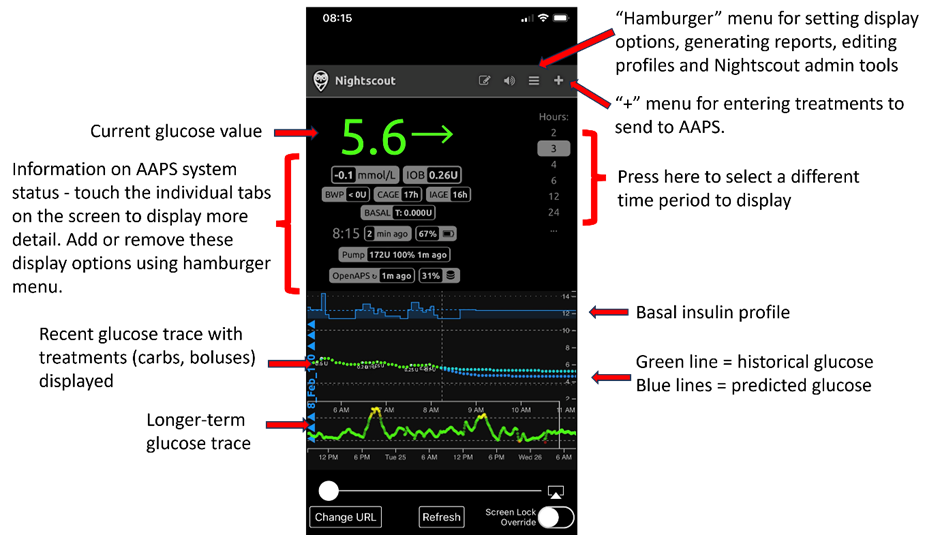
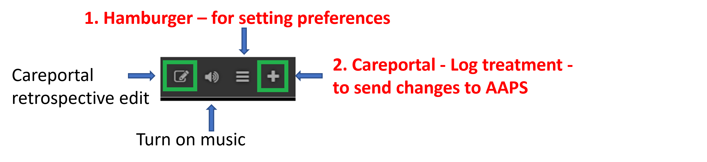
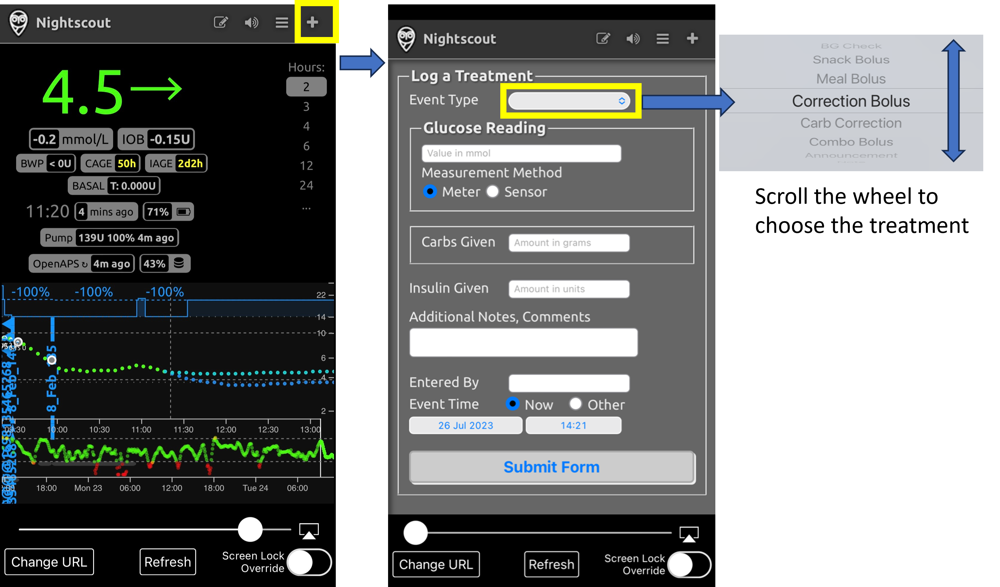
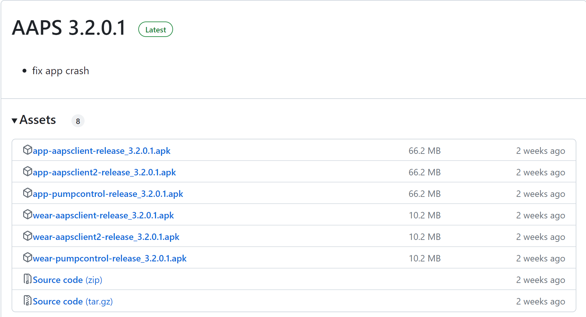

# 遠端控制 AAPS
有四種非常有效的工具可以遠端管理 **AAPS**：

1) [簡訊指令](RemoteControl_SMS-Commands) (關注者的手機可以是 Android 或 iOS)， 2) [AAPSClient](RemoteControl_aapsclient) (關注者的手機是 Android) 3) [Nightscout](RemoteControl_nightscout) (Android、iOS 或其他計算機/設備)。  
4) [智慧型手錶](RemoteControl_smartwatches) (Android)

前三個主要適合於照護者/父母，但智慧型手錶對照護者/父母**和**糖尿病患者本身都非常有用。

(RemoteControl_SMS-Commands)=

## 1) SMS 指令

請參見專門的 [SMS 命令](../RemoteFeatures/SMSCommands.md) 頁面。

(RemoteControl_aapsclient)=
## 2) AAPSClient

_請注意，**NSClient** 已被 **AAPSClient** 取代，適用於 AAPS 3.2 及更高版本，請查閱版本發佈說明以了解更多資訊。_

對於 AAPS 3.2 以下版本，如果你有照護者/父母的 Android 手機，你可以直接下載並安裝 [**AAPSClient**](https://github.com/nightscout/AndroidAPS/releases/) apk。 **AAPSClient** 的外觀與 **AAPS** 本身非常相似，提供了照護者可以遠端執行 **AAPS** 指令的標籤頁：

這裡有兩個可以[下載](https://github.com/nightscout/AndroidAPS/releases/)的 apk 版本，分別是 **AAPSClient** 和 **AAPSClient2**，他們有著細微但重要的差異，詳見下方說明。

**AAPSClient** 可以安裝在一部或多部追蹤者手機上（例如父母一的追蹤者手機和父母二的追蹤者手機），以便兩位照護者都能夠獲得權限並遠端控制患者的 **AAPS** 手機。

如果某位照護者需要第二個副本來遠端控制另一位患者，且該患者有 Nightscout 帳號，他們應該安裝 **AAPSClient2** 以外加 **AAPSClient**。 **AAPSClient2** 允許單一照護者在同一台追蹤者手機上安裝 **AAPSClient** apk 兩次，以便同時遠端控制兩位不同的患者。

要下載 **AAPSClient**，請前往 [此處](https://github.com/nightscout/AndroidAPS/releases/)，然後點擊資產**“app-AAPSClient-release_x.x.x.x”**（他可能比下面的截圖顯示版本更新）：

然後前往電腦上的 _下載_ 資料夾。 在 Windows 上，-下載- 將顯示右邊的選單欄：

下載完成後，點擊 _顯示於資料夾中_ 來定位該檔案。

現在，**AAPSClient** apk 可以透過以下方式進行安裝：

透過 USB 傳輸線傳輸到追蹤者手機；或拖放至 Google 雲端硬碟資料夾，然後透過點擊“app-AAPSClient-release”檔案將其安裝到追蹤者手機。

### 同步設置 - AAPSClient 和 AAPS 配置（適用於 3.2.0.0 版本以上）

當追蹤者手機上安裝了 __AAPSClient__ apk，用戶必須確保在 "組態建置工具" 中的“偏好設定”已正確設置並與 __AAPS__ 的 Nightscout 15 對齊（請參閱發佈說明 [此處](../Maintenance/UpdateToNewVersion)）。 以下範例提供了使用 Nightscout 15 的 NSClient 和 NSClientV3 的同步指南，但 __AAPS__ 也有其他選項（例如 xDrip+）。

在“組態建置工具”的“同步設置”中，用戶可以選擇 __AAPS__ 和追蹤者手機的同步選項：

- 選項 1：NSClient（也稱為‘v1’） - 將用戶的資料與 Nightscout 同步；或

- 選項 2：NSClientV3（也稱為‘v3’） - 將用戶的資料與 Nightscout 通過 v3 API 同步。

用戶必須確保 __AAPS__ 和 AAPS Client 手機都透過執行 v1 或 v3 的選項同步：

選項 1：兩部手機均使用 v1：

- 輸入你的 Nightscout 網址

- 輸入你的 API 密碼

選項 2：兩部手機均使用 v3：

- 在 NSClientV3 標籤下輸入你的 Nightscout 網址

- 在“Config Build”標籤下輸入你的 NS 查看權杖。 請遵循[此處](https://nightscout.github.io/nightscout/security/#create-a-token)的說明

如果選擇 Websockets（可選），請確保 __AAPS__ 和 __AAPSClient__ 的手機上均已啟用或停用此功能。 啟用 Websockets 於 __AAPS__ 而未於 __AAPSClient__ 啟用（反之亦然），將會導致 __AAPS__ 無法正常運作。 啟用 Websockets 將加快與 Nightscout 的同步速度，但可能會導致手機耗電量增加。

用戶應確保 __AAPSClient__ 和 __AAPS__ 均在“NSClient”標籤下顯示“已連線”，並且當在 __AAPSClient__ 中選擇後，“設定檔切換”或“臨時目標”可以在 __AAPS__ 中正確啟動。

用戶還應確保在 __AAPSClient__ 和 __AAPS__ 中的“治療”中紀錄碳水化合物，否則這可能表明用戶的設置存在問題。

### 問題排除“NS 查看權杖”配置問題

具體的“NS 查看權杖”配置可能會根據你的 Nightscout 提供商是否為付費託管網站而有所不同。

如果你在使用付費託管的 Nightscout 網站時，發現 **AAPS** v3 無法接受“NS 查看權杖”，建議你首先與 Nightscout 提供商聯繫，以解決“NS 查看權杖”問題。 否則，請聯繫 **AAPS** 小組，但在此之前，請務必仔細檢查是否正確遵循了說明 [此處](https://nightscout.github.io/nightscout/security/#create-a-token)。

### AAPSClient 的功能包括：

| 標籤 / 漢堡選單  | 功能                                                                                                                                     |
| ---------- | -------------------------------------------------------------------------------------------------------------------------------------- |
| **功能** 標籤  | - 設定檔切換  - 臨時目標 - 血糖檢查 - CGM 傳感器植入 - 備註 - 運動 - 公告 - 問題 - 歷史瀏覽器 |
| **食物** 標籤  |                                                                                                                                        |
| **治療** 標籤  | - 檢查已交付的治療，包括注射和輸入的碳水化合物                                                                                                               |
| **維護** 標籤  | - 匯出和匯入設定                                                                                                                              |
| **設定檔** 標籤 | - 建立新設定檔 - 設定檔切換                                                                                                              |

**AAPSClient** 允許照護者透過行動網絡或網際網路，遠端進行許多 **AAPS** 中允許的調整（不包括胰島素注射）。 **AAPSClient** 的主要優點是照護者/父母能夠以快速、便捷的方式遠端控制 **AAPS**。 __AAPSClient__ _可能_ 比輸入 SMS 指令快得多，尤其是當執行需要身份驗證的指令時。 透過 **AAPSClient** 輸入的指令將上傳到 Nightscout。

只有當你的同步運作良好時，才建議使用 **AAPSClient** 進行遠端控制（_即_ 不會出現不必要的資料更改，如自動修改臨時目標、臨時基礎率等），詳見[版本 2.8.1.1 發佈說明](#important-hints-2-8-1-1)了解更多細節。

### AAPSClient 與智慧型手錶的選項

智慧型手錶可以是一個非常有用的工具，幫助管理兒童的 **AAPS**。 有幾種不同的配置方式可供選擇。 如果**AAPSClient** 安裝在父母的手機上，則可以下載並安裝[**AAPSClient WearOS** 應用程式](https://github.com/nightscout/AndroidAPS/releases/)在與父母手機連線的相容智慧型手錶上。 這將顯示目前的血糖值、循環狀態，並允許輸入碳水化合物、設定臨時目標和更換設定檔。 無法從 WearOS 應用程式進行注射。 你可以在[這裡](#4-smartwatches)閱讀更多關於智慧型手錶的資訊。

(RemoteControl_nightscout)=
## 3) Nightscout

Nightscout 不僅是雲端中的伺服器，還有一個專用的 **Nightscout** 應用程式，可以直接從 iPhone 的 App Store 下載。 如果你有 Android 追蹤者手機，並沒有專用的 Nightscout 應用程式，建議使用 [**AAPSClient**](#2-aapsclient)，或者如果你只想要追蹤而不發送治療資料，你可以從 Play 商店下載並安裝 [Nightwatch](https://play.google.com/store/apps/details?id=se.cornixit.nightwatch) 應用程式。

當你在 iPhone 上安裝了 **Nightscout** 應用程式，打開應用並按照設置提示進行操作，輸入你的 Nightscout 地址（見下方左側）。 此地址的格式可能取決於你的 Nightscout 是如何託管的。 (_例如_ http://youraddresshere.herokuapp.com)。 然後輸入你的 Nightscout API 密碼（見下方右側）。 如果未提示你輸入 API 密碼，請點擊應用程式頂部的鎖形圖示輸入密碼：

更多設置資訊可直接從 [Nightscout](https://nightscout.github.io/nightscout/discover/) 獲得

當您第一次登入時，顯示非常簡單。 透過選擇右上角的「漢堡選單」並向下捲動來自訂顯示選項：

向下滾動到“設置”。 你可能會想將 血糖 顯示的“比例”設置為“線性”，因為預設值是對數比例，並在“渲染基礎率”下選擇“預設”以顯示幫浦的基礎率。

選擇您想要的選項。 如果您使用其他應用程式來發出警報，請取消勾選警報。

繼續向下滾動直到找到“顯示外掛”。

你需要確保已勾選“照護入口”，還可以選擇其他有用的指標（最常用的包括：IOB、照護入口、幫浦、套管時間、胰島素時間、基礎率設定和 OpenAPS）。

重要的是，你現在需要點擊底部的“儲存”，以使這些更改生效。

按下“儲存”後，應用程式將返回你的 Nightscout 主畫面，顯示如下：

1. 目前血糖值
2. 有關 AAPS 系統狀態的資訊 - 輕觸螢幕上的各個標籤以顯示更多詳細資訊。 使用漢堡選單增加或移除這些顯示選項。
3. 顯示最近的血糖趨勢以及處理（碳水化合物、注射）
4. 長期的血糖趨勢
5. 設定顯示選項、產生報告、編輯設定檔和 Nightscout 管理工具的「漢堡選單」
6. 「**+**」選單用於輸入要發送到 AAPS 的處理。
7. 選擇不同的時間範圍來顯示
8. 基礎胰島素設定檔
9. 綠線 = 歷史血糖 藍線 = 預測血糖

更詳細地查看 Nightscout 應用程式左上角的選單：

1. Careportal 回溯編輯
2. 開啟/關閉警報
3. 漢堡選單 - 用於設定偏好設定
4. Careportal - 紀錄處理 - 將變更發送至 AAPS

此畫面上的灰色標籤包含大量關於 **AAPS** 系統狀態的資訊（點擊標籤可顯示更多資訊）：

1. 5分鐘血糖趨勢
2. 注射嚮導預覽
3. 按一下基礎來查看您目前的設定檔和基礎資訊
4. 自上次 AAPS 讀取 CGM 的時間
5. **幫浦**: 胰島素、電池百分比及上次 AAPS 何時與其連線
6. 上次 AAPS 重新整理 - 如果這超過 5 分鐘，則可能 AAPS 手機與幫浦/CGM 之間有連線問題
7. 按一下 IOB 查看基礎與注射胰島素的劑量
8. 儲存槽中的胰島素時間
9. 針頭的使用時間
10. AAPS 手機的電池狀態
11. 您的資料庫大小。 如果它變得過於滿載（僅限 DIY Nightscout - 托管服務會忽略這一點），您可能會開始遇到連線問題。 您可以通過管理工具選單（透過漢堡選單）刪除資料以減少資料庫大小。

按下頁面底部的「重新整理」以關閉彈出視窗。

### 透過 Nightscout 應用程式向 AAPS 發送治療資料

要設置從 **Nightscout** 應用程式向 **AAPS** 發送治療資料，請在主要 AAPS 手機中進入 **AAPSClient** 標籤。 打開右側的省略號選單，然後打開 AAPSClient 偏好設定 - 同步，並在此選單中選擇相關選項。 將其設置為接收不同的指令（例如臨時目標等）並同步設定檔。 如果似乎沒有同步，請返回 AAPSClient 標籤並選擇“完全同步”，等待幾分鐘。

你在 iPhone 上的 Nightscout 應用程式擁有與你在電腦上使用的 Nightscout 相同的功能。 他允許你向 **AAPS** 發送許多指令，但不允許你發送胰島素注射指令。

### 取消負胰島素以避免重複低血糖

儘管你無法實際注射胰島素，但你可以透過 Nightscout 宣佈胰島素作為“修正注射”，儘管他實際上並未注射。 由於 AAPS 會考慮到這個假設的胰島素注射，因此宣佈胰島素實際上可以使 AAPS _不那麼積極_，這在取消負胰島素和防止低血糖時非常有用，特別是當你的設定檔過於強烈（例如，由於之前的運動）。 你可能會希望親自查看這些設置，並在 **AAPS** 手機附近進行檢查，以防你的 **Nightscout** 設置有所不同。

一些最有用的 **Nightscout** 指令在下表中描述。

#### Nightscout 指令表

| 最常使用的治療                      | 功能，指令有用的例子                                                                                    |
| ---------------------------- | --------------------------------------------------------------------------------------------- |
| **修正注射**                     | 允許您發出**<u>不注射</u>**胰島素的聲明。 對於取消負面胰島素以防止低血糖非常有用， 例如在夜間，如果設定檔過於強烈。            |
| **碳水化合物修正**                  | 現在宣告碳水化合物                                                                                     |
| **臨時目標** **取消臨時目標** | 允許設置和取消臨時目標。 請注意，取消不一定有效， 在此情況下，您可以設置一個新的臨時目標（2 分鐘）， 然後會自動恢復至正常目標。 |
| **設定檔切換**                    | 允許您檢查目前正在運行的設定檔， 並切換到另一個設定檔，可以是永久性， 或者定義的時間長度（分鐘）。                          |

| 不常用的指令                                                                                           | 功能，指令有用的例子                                                   |
| ------------------------------------------------------------------------------------------------ | ------------------------------------------------------------ |
| **血糖檢查**                                                                                         | 將血糖檢查傳送至 AAPS。                                               |
| **點心注射** **餐前注射** **組合注射**                                                     | 可以在過去60分鐘至未來60分鐘內發出碳水化合物（加上蛋白質和脂肪） 結合注射允許同時發出胰島素聲明。 |
| **宣告** **備註** **問題** **運動** **離線開啟 APS** **DAD 警報** | 新增這些資訊備註（DAD = 糖尿病守護犬警報）。                                    |
| **幫浦位置更換** **電池更換** **胰島素藥囊更換**                                                | 宣告這些幫浦變更。                                                    |
| **CGM 傳感器啟動** **CGM 傳感器插入** **CGM 傳感器停止**                                      | 宣告這些 CGM 變更。                                                 |
| **臨時基礎開始** **臨時基礎結束**                                                                   | 在開放式循環中最為有用。                                                 |

閱讀更多關於 **Nightscout** 的選項[此處](https://nightscout.github.io/)

### 獲取 Nightscout 應用程式最佳使用效果的小提示

1). 如果你被困在某個頁面上，並希望再次查看主畫面，只需點擊“重新整理”（底部中間），這將帶你返回 **Nightscout** 主頁，顯示 血糖 圖表。

要查看手機上目前運作的設定檔，請按圖表上方的各個圖示。 按下“基礎率”可以查看更多資訊（目前的碳水化合物比率、敏感性和時區等），“OpenAPS”顯示有關設定檔和目前目標的資訊。 你還可以監控手機電池百分比和幫浦電池百分比。 BWP 提供關於算法在考慮 IOB 和 COB 情況下預測未來結果的資訊。

#### 選單中的其他圖示：鉛筆（編輯）圖示是什麼意思？

你可以（技術上）使用編輯鉛筆來移動或刪除過去 48 小時內的注射或修正治療。

更多相關資訊請參閱 [這裡](https://nightscout.github.io/nightscout/discover/#edit-mode-edit)

雖然這可能對刪除已宣佈（但未實際注射）的碳水化合物有幫助，但在實際操作中，這在 **AAPS** 中並不運作良好，因此我們建議直接透過 **AAPS** 應用程式進行此類更改。

(遠端控制智慧型手錶)=
## 4) 智慧型手錶

### 選項 1) 從 Wear OS 手錶控制 AAPS

一旦您[在您的手錶上設置**AAPS**](../WearOS/BuildingAapsWearOS.md)，有關智慧型手錶錶盤及其功能的詳細資訊可以在[智慧型手錶上操作 AAPS](../WearOS/WearOsSmartwatch.md)中找到。

簡要概述，以下功能可以從智慧型手錶觸發：

* 設置一個臨時目標

* 使用注射計算器（計算變數可在手機設定中定義）

* 管理 eCarbs

* 進行注射（胰島素 + 碳水化合物）

* 檢查手錶設定

* 狀態

* 檢查幫浦狀態

* 檢查循環狀態

* 檢查並更改個人設定、CPP（生理時鐘百分比設定 = 時間變動 + 百分比）

* 顯示 TDD（每日總劑量 = 每日注射 + 基礎劑量）

* 遠端注射，照顧者與 T1D 兒童位於不同地點（這在 **AAPS** 手錶和 **AAPS** 手機互相連線時是可能的）

#### 從照顧者到手錶的通訊使用其他應用程式（如 WhatsApp）

可以在手錶上新增額外的應用程式，如 WhatsApp，用於照顧者與孩子之間的訊息交流（例如）。 重要的是，手機上只應關聯一個 Google 帳戶，否則手錶無法同步這些資料。 你需要年滿 13 歲才能擁有 Samsung 帳戶，並且此帳戶需要使用與 Android 手機相同的電子郵件地址設置。

一段解釋如何在 Galaxy 4 手錶上設定 WhatsApp 進行訊息的影片（您無法獲得 WhatsApp 的完整功能）見 [這裡](https://gorilla-fitnesswatches.com/how-to-get-whatsapp-on-galaxy-watch-4/)

在 **AAPS** 手機和手錶的 **Galaxy wearable** 應用中進行調整，讓 WhatsApp 訊息以輕微震動的方式宣告，並且 WhatsApp 訊息可以顯示在現有的錶盤上。

### 選項 2) 在手錶上運作 **AAPS**，以遠端控制手機上的 **AAPS**

類似於使用追蹤者手機搭配 AAPSClient、Nightscout 或 SMS 指令（鏈接到相應部分），智慧型手錶可以用來遠端控制 **AAPS**，並提供完整的設定檔資料。 與使用追蹤者手機的主要區別是，智慧型手錶與 **AAPS** 手機的連線是透過藍牙進行的，並且不需要驗證碼。 此外，如果智慧型手錶與藍牙連線的 **AAPS** 手機也連接至 Wi-Fi/行動網路，那麼手錶也會與 **AAPS** 手機互動，提供更長的通訊範圍。 這包括在不同位置遠端注射胰島素，例如照護者透過 **AAPS** 手錶為 T1D 孩子（持有 **AAPS** 手機）進行注射，這在孩子上學時特別有用。

因此，遠端控制智慧型手錶在以下情況中特別有用：

a) 當 **AAPSClient**/Nightscout/**SMS** 指令無法使用時；或

b) 使用者希望避免輸入驗證碼（追蹤者手機需要在輸入資料、選擇 TT 或輸入碳水化合物時使用驗證碼）。

智慧型手錶需要運作 **Android wear** 軟體（最好是 10 或更新版本）才能控制 **AAPS**。 請檢查手錶的技術規格，並查看 [手機頁面](../Getting-Started/Phones.md)。 如果不確定，請在 **AAPS** 的 Facebook/Discord 群組中搜尋或詢問。

以下是設置流行型號 Samsung Galaxy Watch 4（40 毫米）的具體操作指南。 Garmin 手錶也是一個受歡迎的選擇，請參閱[這裡](https://apps.garmin.com/en-US/apps/a2eebcac-d18a-4227-a143-cd333cf89b55?fbclid=IwAR0k3w3oes-OHgFdPO-cGCuTSIpqFJejHG-klBTm_rmyEJo6gdArw8Nl4Zc#0)。 如果你有設置其他智慧型手錶的經驗，並且認為這對其他用戶有幫助，請[編輯文件](../SupportingAaps/HowToEditTheDocs.md)，將你的發現分享給更廣泛的 **AAPS** 社群。

### 選項 3) 在手錶上運作 AAPSClient 以遠端控制手機上的 **AAPS**

手錶軟體 **AAPSClient** Wear apk 可以直接從[Github](https://github.com/nightscout/AndroidAPS/releases/)下載。

要下載軟體，請點擊所需的應用程式（在此截圖中，**wear-aapsclient-release_3.2.0.1** 或 **wear-aapsclient2-release_3.2.0.1** 均可使用，這兩個版本中有一個是為了提供給第二位照護者的手錶）。

然後點擊“另存為”，並將文件儲存到電腦上的方便位置：

您可以以與**AAPS** Wear 應用相同的方式，將**AAPSClient**穿戴 apk 傳輸到手機並側載到手錶上，如[將 Wear 應用傳輸到您的 AAPS 手機](#remote-control-transferring-the-aaps-wear-app-onto-your-aaps-phone)中詳細說明。  

