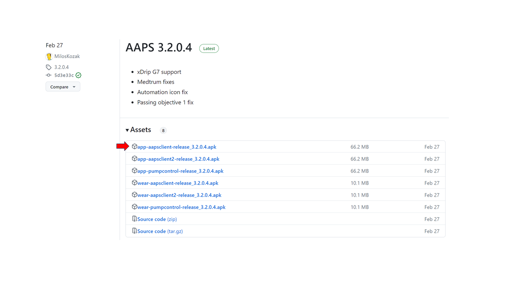
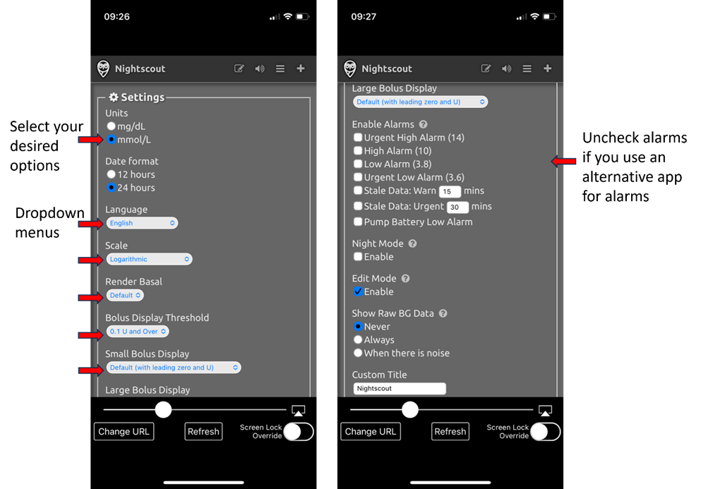
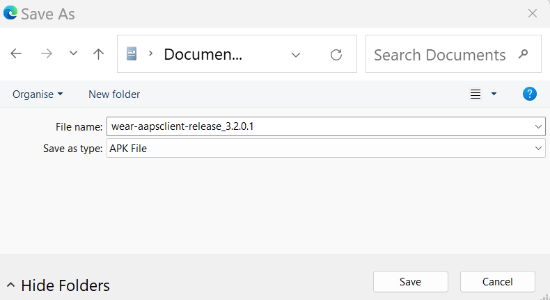

# 遠端控制 AAPS
有四種非常有效的工具可以遠端管理 **AAPS**：

1) [SMS commands](RemoteControl_SMS-Commands) (follower phone can be either Android or iOS), 2) [AAPSClient](RemoteControl_aapsclient) (follower phone is Android) 3) [Nightscout](RemoteControl_nightscout) (Android, iOS or other computer/device).  
4) [Smartwatches](RemoteControl_smartwatches) (Android)

The first three are mostly appropriate for caregivers/parents, but smartwatches are very useful for caregivers/parents **and** for adults with diabetes themselves.

(RemoteControl_SMS-Commands)=

## 1) SMS 指令

請參見專門的 [SMS 命令](../RemoteFeatures/SMSCommands.md) 頁面。

(RemoteControl_aapsclient)=
## 2) AAPSClient

_請注意，**NSClient** 已被 **AAPSClient** 取代，適用於 AAPS 3.2 及更高版本，請查閱版本發佈說明以了解更多資訊。_

對於 AAPS 3.2 以下版本，如果你有照護者/父母的 Android 手機，你可以直接下載並安裝 [**AAPSClient**](https://github.com/nightscout/AndroidAPS/releases/) apk。 **AAPSClient** 的外觀與 **AAPS** 本身非常相似，提供了照護者可以遠端執行 **AAPS** 指令的標籤頁：

這裡有兩個可以[下載](https://github.com/nightscout/AndroidAPS/releases/)的 apk 版本，分別是 **AAPSClient** 和 **AAPSClient2**，他們有著細微但重要的差異，詳見下方說明。

**AAPSClient** 可以安裝在一部或多部追蹤者手機上（例如父母一的追蹤者手機和父母二的追蹤者手機），以便兩位照護者都能夠獲得權限並遠端控制患者的 **AAPS** 手機。

如果某位照護者需要第二個副本來遠端控制另一位患者，且該患者有 Nightscout 帳號，他們應該安裝 **AAPSClient2** 以外加 **AAPSClient**。 **AAPSClient2** 允許單一照護者在同一台追蹤者手機上安裝 **AAPSClient** apk 兩次，以便同時遠端控制兩位不同的患者。

要下載 **AAPSClient**，請前往 [此處](https://github.com/nightscout/AndroidAPS/releases/)，然後點擊資產**“app-AAPSClient-release_x.x.x.x”**（他可能比下面的截圖顯示版本更新）：

然後前往電腦上的 _下載_ 資料夾。 在 Windows 上，-下載- 將顯示右邊的選單欄：

下載完成後，點擊 _顯示於資料夾中_ 來定位該檔案。

現在，**AAPSClient** apk 可以透過以下方式進行安裝：

透過 USB 傳輸線傳輸到追蹤者手機；或拖放至 Google 雲端硬碟資料夾，然後透過點擊“app-AAPSClient-release”檔案將其安裝到追蹤者手機。

### 同步設置 - AAPSClient 和 AAPS 配置（適用於 3.2.0.0 版本以上）

當追蹤者手機上安裝了 __AAPSClient__ apk，用戶必須確保在 "組態建置工具" 中的“偏好設定”已正確設置並與 __AAPS__ 的 Nightscout 15 對齊（請參閱發佈說明 [此處](../Maintenance/UpdateToNewVersion)）。 以下範例提供了使用 Nightscout 15 的 NSClient 和 NSClientV3 的同步指南，但 __AAPS__ 也有其他選項（例如 xDrip+）。

在“組態建置工具”的“同步設置”中，用戶可以選擇 __AAPS__ 和追蹤者手機的同步選項：

- Option 1: NSClient (also known as ‘v1’) - which synchronizes the user’s data with Nightscout; or

- Option 2: NSClientV3 (also referred to as ‘v3’).- which synchronizes the user’s data with Nightscout using v3 API.

用戶必須確保 __AAPS__ 和 AAPS Client 手機都透過執行 v1 或 v3 的選項同步：

選項 1：兩部手機均使用 v1：

- 輸入你的 Nightscout 網址

- 輸入你的 API 密碼

選項 2：兩部手機均使用 v3：

- 在 NSClientV3 標籤下輸入你的 Nightscout 網址

- 在“Config Build”標籤下輸入你的 NS 查看權杖。 請遵循[此處](https://nightscout.github.io/nightscout/security/#create-a-token)的說明

如果選擇 Websockets（可選），請確保 __AAPS__ 和 __AAPSClient__ 的手機上均已啟用或停用此功能。 啟用 Websockets 於 __AAPS__ 而未於 __AAPSClient__ 啟用（反之亦然），將會導致 __AAPS__ 無法正常運作。 啟用 Websockets 將加快與 Nightscout 的同步速度，但可能會導致手機耗電量增加。

用戶應確保 __AAPSClient__ 和 __AAPS__ 均在“NSClient”標籤下顯示“已連線”，並且當在 __AAPSClient__ 中選擇後，“設定檔切換”或“臨時目標”可以在 __AAPS__ 中正確啟動。

用戶還應確保在 __AAPSClient__ 和 __AAPS__ 中的“治療”中紀錄碳水化合物，否則這可能表明用戶的設置存在問題。

### 問題排除“NS 查看權杖”配置問題

具體的“NS 查看權杖”配置可能會根據你的 Nightscout 提供商是否為付費託管網站而有所不同。

如果你在使用付費託管的 Nightscout 網站時，發現 **AAPS** v3 無法接受“NS 查看權杖”，建議你首先與 Nightscout 提供商聯繫，以解決“NS 查看權杖”問題。 否則，請聯繫 **AAPS** 小組，但在此之前，請務必仔細檢查是否正確遵循了說明 [此處](https://nightscout.github.io/nightscout/security/#create-a-token)。

### AAPSClient 的功能包括：

| Tab / Hamburger     | Features                                                                                                                                                                                              |
| ------------------- | ----------------------------------------------------------------------------------------------------------------------------------------------------------------------------------------------------- |
| **Action** Tab      | - Profile Switch  - Temp Target - BG Check - CGM Sensor Insert - Note - Exercise - Announcement - Question? - History Browser |
| **Food** Tab        |                                                                                                                                                                                                       |
| **Treatments** Tab  | - Check Treatments delivered including bolus and carbs entered                                                                                                                                        |
| **Maintenance** Tab | - Export and Import Settings                                                                                                                                                                          |
| **Profile** Tab     | - Creating new profile - Profile switch                                                                                                                                                      |

**AAPSClient** 允許照護者透過移動網絡或網際網路，遠端進行許多 **AAPS** 中允許的調整（不包括胰島素注射）。 **AAPSClient** 的主要優點是照護者/父母能夠以快速、便捷的方式遠端控制 **AAPS**。 __AAPSClient__ _可能_ 比輸入 SMS 指令快得多，尤其是當執行需要身份驗證的指令時。 透過 **AAPSClient** 輸入的指令將上傳到 Nightscout。

只有當你的同步運作良好時，才建議使用 **AAPSClient** 進行遠端控制（_即_ 不會出現不必要的資料更改，如自動修改臨時目標、臨時基礎率等），詳見[版本 2.8.1.1 發佈說明](#important-hints-2-8-1-1)了解更多細節。

### AAPSClient 與智慧型手錶的選項

智慧型手錶可以是一個非常有用的工具，幫助管理兒童的 **AAPS**。 有幾種不同的配置方式可供選擇。 如果**AAPSClient** 安裝在父母的手機上，則可以下載並安裝[**AAPSClient WearOS** 應用程式](https://github.com/nightscout/AndroidAPS/releases/)在與父母手機連線的相容智慧型手錶上。 這將顯示目前的血糖值、循環狀態，並允許輸入碳水化合物、設定臨時目標和更換設定檔。 無法從 WearOS 應用程式進行注射。 你可以在[這裡](#4-smartwatches)閱讀更多關於智慧型手錶的資訊。

(RemoteControl_nightscout)=
## 3) Nightscout

Nightscout 不僅是雲端中的伺服器，還有一個專用的 **Nightscout** 應用程式，可以直接從 iPhone 的 App Store 下載。 如果你有 Android 追蹤者手機，並沒有專用的 Nightscout 應用程式，建議使用 [**AAPSClient**](#2-aapsclient)，或者如果你只想要追蹤而不發送治療資料，你可以從 Play 商店下載並安裝 [Nightwatch](https://play.google.com/store/apps/details?id=se.cornixit.nightwatch) 應用程式。

當你在 iPhone 上安裝了 **Nightscout** 應用程式，打開應用並按照設置提示進行操作，輸入你的 Nightscout 地址（見下方左側）。 此地址的格式可能取決於你的 Nightscout 是如何託管的。 (_例如_ http://youraddresshere.herokuapp.com)。 然後輸入你的 Nightscout API 密碼（見下方右側）。 如果未提示你輸入 API 密碼，請點擊應用程式頂部的鎖形圖示輸入密碼：

更多設置資訊可直接從 [Nightscout](https://nightscout.github.io/nightscout/discover/) 獲得

當你首次登入時，將會顯示一個非常簡單的介面（見下方左側）。 透過點擊右上角的“漢堡”選單並向下滾動來自定義顯示選項：

向下滾動到“設置”。 你可能會想將 血糖 顯示的“比例”設置為“線性”，因為預設值是對數比例，並在“渲染基礎率”下選擇“預設”以顯示幫浦的基礎率。 繼續向下滾動直到找到“顯示外掛”。 你需要確保已勾選“照護入口”，還可以選擇其他有用的指標（最常用的包括：IOB、照護入口、幫浦、套管時間、胰島素時間、基礎率設定和 OpenAPS）。

重要的是，你現在需要點擊底部的“儲存”，以使這些更改生效。

按下“儲存”後，應用程式將返回你的 Nightscout 主畫面，顯示如下：

更詳細地查看 Nightscout 應用程式左上角的選單：

此畫面上的灰色標籤包含大量關於 **AAPS** 系統狀態的資訊（點擊標籤可顯示更多資訊）：

### 透過 Nightscout 應用程式向 AAPS 發送治療資料

要設置從 **Nightscout** 應用程式向 **AAPS** 發送治療資料，請在主要 AAPS 手機中進入 **AAPSClient** 標籤。 打開右側的省略號選單，然後打開 AAPSClient 偏好設定 - 同步，並在此選單中選擇相關選項。 將其設置為接收不同的指令（例如臨時目標等）並同步設定檔。 如果似乎沒有同步，請返回 AAPSClient 標籤並選擇“完全同步”，等待幾分鐘。

你在 iPhone 上的 Nightscout 應用程式擁有與你在電腦上使用的 Nightscout 相同的功能。 他允許你向 **AAPS** 發送許多指令，但不允許你發送胰島素注射指令。

### 取消負胰島素以避免重複低血糖

儘管你無法實際注射胰島素，但你可以透過 Nightscout 宣佈胰島素作為“修正注射”，儘管他實際上並未注射。 由於 AAPS 會考慮到這個假設的胰島素注射，因此宣佈胰島素實際上可以使 AAPS _不那麼激進_，這在取消負胰島素和防止低血糖時非常有用，特別是當你的設定檔過於強烈（例如，由於之前的運動）。 你可能會希望親自查看這些設置，並在 **AAPS** 手機附近進行檢查，以防你的 **Nightscout** 設置有所不同。

一些最有用的 **Nightscout** 指令在下表中描述。

#### Nightscout 指令表

| Most commonly used treatments                             | Function, example of when command is useful                                                                                                                                                                                    |
| --------------------------------------------------------- | ------------------------------------------------------------------------------------------------------------------------------------------------------------------------------------------------------------------------------ |
| **Correction bolus**                                      | Allows you to announce **but <u>not</u> bolus** insulin. Very useful for cancelling negative insulin to prevent a hypo, for example in the middle of the night, if the profile has been too strong.                            |
| **Carb correction**                                       | Announce carbs now                                                                                                                                                                                                             |
| **Temporary Target** **Temporary Target cancel** | Allows temp targets to be set and cancelled. Note that cancelling does not always work, in this instance you can set a new target for a short time period (2 min) which will then revert back to the normal target afterwards. |
| **設定檔切換**                                                 | Allows you to check the current profile which is running, and switch to another profile, either permanently, or for a defined length of time (mins).                                                                           |

| Less widely used commands                                                                                                           | Function, example of when command is useful                                                                                                           |
| ----------------------------------------------------------------------------------------------------------------------------------- | ----------------------------------------------------------------------------------------------------------------------------------------------------- |
| **BG check**                                                                                                                        | Send a BG check to AAPS.                                                                                                                              |
| **Snack bolus** **Meal bolus** **Combo bolus**                                                                    | Can announce carbs (plus proteins and fat) from 60 min in the past to 60 min in the future. Combo bolus allows insulin announcement at the same time. |
| **Announcement** **Note** **Question** **Exercise** **Open APS offline** **DAD alert** | Add these info notes (DAD = diabetic dog alert).                                                                                                      |
| **Pump site change** **Battery change** **Insulin cartridge change**                                              | Announces these pump changes.                                                                                                                         |
| **CGM sensor start** **CGM sensor insert** **CGM sensor stop**                                                    | Announces these CGM changes.                                                                                                                          |
| **Temp basal start** **Temp basal end**                                                                                    | Most useful in open looping.                                                                                                                          |

閱讀更多關於 **Nightscout** 的選項[此處](https://nightscout.github.io/)

### 獲取 Nightscout 應用程式最佳使用效果的小提示

1). 如果你被困在某個頁面上，並希望再次查看主畫面，只需點擊“重新整理”（底部中間），這將帶你返回 **Nightscout** 主頁，顯示 血糖 圖表。

要查看手機上目前運作的設定檔，請按圖表上方的各個圖示。 按下“基礎率”可以查看更多資訊（目前的碳水化合物比率、敏感性和時區等），“OpenAPS”顯示有關設定檔和目前目標的資訊。 你還可以監控手機電池百分比和幫浦電池百分比。 BWP 提供關於算法在考慮 IOB 和 COB 情況下預測未來結果的資訊。

#### 選單中的其他圖示：鉛筆（編輯）圖示是什麼意思？

你可以（技術上）使用編輯鉛筆來移動或刪除過去 48 小時內的注射或修正治療。

更多相關資訊請參閱 [這裡](https://nightscout.github.io/nightscout/discover/#edit-mode-edit)

雖然這可能對刪除已宣佈（但未實際注射）的碳水化合物有幫助，但在實際操作中，這在 **AAPS** 中並不運作良好，因此我們建議直接透過 **AAPS** 應用程式進行此類更改。

(RemoteControl_smartwatches)=
## 4) 智慧型手錶

### Option 1) Controlling AAPS from a Wear OS Watch

Once you have setup **AAPS** on your watch, extensive details about the smartwatch faces and their functions can be found in [Operation of Wear AAPS on a Smartwatch](../WearOS/WearOsSmartwatch.md).

簡要概述，以下功能可以從智慧型手錶觸發：

* 設置一個臨時目標

* 使用注射計算器（計算變數可在手機設定中定義）

* 管理 eCarbs

* 進行注射（胰島素 + 碳水化合物）

* 檢查手錶設定

* 狀態

* 檢查幫浦狀態

* 檢查循環狀態

* 檢查並更改個人設定、CPP（生理時鐘百分比設定 = 時間變動 + 百分比）

* 顯示 TDD（每日總劑量 = 每日注射 + 基礎劑量）

* Remote bolus where the caregiver and T1D child are in different locations (this is possible for the **AAPS** watch and **AAPS** phone providing both devices are connected to the network)

#### Communication from caregivers to the watch using other apps (like WhatsApp)

It is possible to add additional apps to the watch, like WhatsApp, for messaging (for example) between caregivers and kids. 重要的是，手機上只應關聯一個 Google 帳戶，否則手錶無法同步這些資料。 你需要年滿 13 歲才能擁有 Samsung 帳戶，並且此帳戶需要使用與 Android 手機相同的電子郵件地址設置。

A video explaining getting WhatsApp setup for messaging on the Galaxy 4 watch (you can’t get full functionality of WhatsApp) is shown [here](https://gorilla-fitnesswatches.com/how-to-get-whatsapp-on-galaxy-watch-4/)

Making adjustments in both the **Galaxy wearable** app on the **AAPS** phone and the watch makes it possible for WhatsApp messages to announce with a slight vibration, and also for the WhatsApp message to display over the existing watchface.

### 選項 2) 在手錶上運作 **AAPS**，以遠端控制手機上的 **AAPS**

類似於使用追蹤者手機搭配 AAPSClient、Nightscout 或 SMS 指令（鏈接到相應部分），智慧型手錶可以用來遠端控制 **AAPS**，並提供完整的設定檔資料。 與使用追蹤者手機的主要區別是，智慧型手錶與 **AAPS** 手機的連線是透過藍牙進行的，並且不需要驗證碼。 As a side-note, if both smartwatch and **AAPS** phone linked by bluetooth are also on a Wi-Fi/Cellular data network, the watch will also interact with the **AAPS** phone, giving a longer range of communication. 這包括在不同位置遠端注射胰島素，例如照護者透過 **AAPS** 手錶為 T1D 孩子（持有 **AAPS** 手機）進行注射，這在孩子上學時特別有用。

因此，遠端控制智慧型手錶在以下情況中特別有用：

a) 當 **AAPSClient**/Nightscout/**SMS** 指令無法使用時；或

b) 使用者希望避免輸入驗證碼（追蹤者手機需要在輸入資料、選擇 TT 或輸入碳水化合物時使用驗證碼）。

智慧型手錶需要運作 **Android wear** 軟體（最好是 10 或更新版本）才能控制 **AAPS**。 請檢查手錶的技術規格，並查看 [手機頁面](../Getting-Started/Phones.md)。 如果不確定，請在 **AAPS** 的 Facebook/Discord 群組中搜尋或詢問。

以下是設置流行型號 Samsung Galaxy Watch 4（40 毫米）的具體操作指南。 Garmin 手錶也是一個受歡迎的選擇，請參閱[這裡](https://apps.garmin.com/en-US/apps/a2eebcac-d18a-4227-a143-cd333cf89b55?fbclid=IwAR0k3w3oes-OHgFdPO-cGCuTSIpqFJejHG-klBTm_rmyEJo6gdArw8Nl4Zc#0)。 如果你有設置其他智慧型手錶的經驗，並且認為這對其他用戶有幫助，請[編輯文件](../SupportingAaps/HowToEditTheDocs.md)，將你的發現分享給更廣泛的 **AAPS** 社群。

### 選項 3) 在手錶上運作 AAPSClient 以遠端控制手機上的 **AAPS**

手錶軟體 **AAPSClient** Wear apk 可以直接從[Github](https://github.com/nightscout/AndroidAPS/releases/)下載。

要下載軟體，請點擊所需的應用程式（在此截圖中，**wear-aapsclient-release_3.2.0.1** 或 **wear-aapsclient2-release_3.2.0.1** 均可使用，這兩個版本中有一個是為了提供給第二位照護者的手錶）。

然後點擊“另存為”，並將文件儲存到電腦上的方便位置：

您可以以與**AAPS** Wear 應用相同的方式，將**AAPSClient**穿戴 apk 傳輸到手機並側載到手錶上，如[將 Wear 應用傳輸到您的 AAPS 手機](#remote-control-transferring-the-aaps-wear-app-onto-your-aaps-phone)中詳細說明。  

