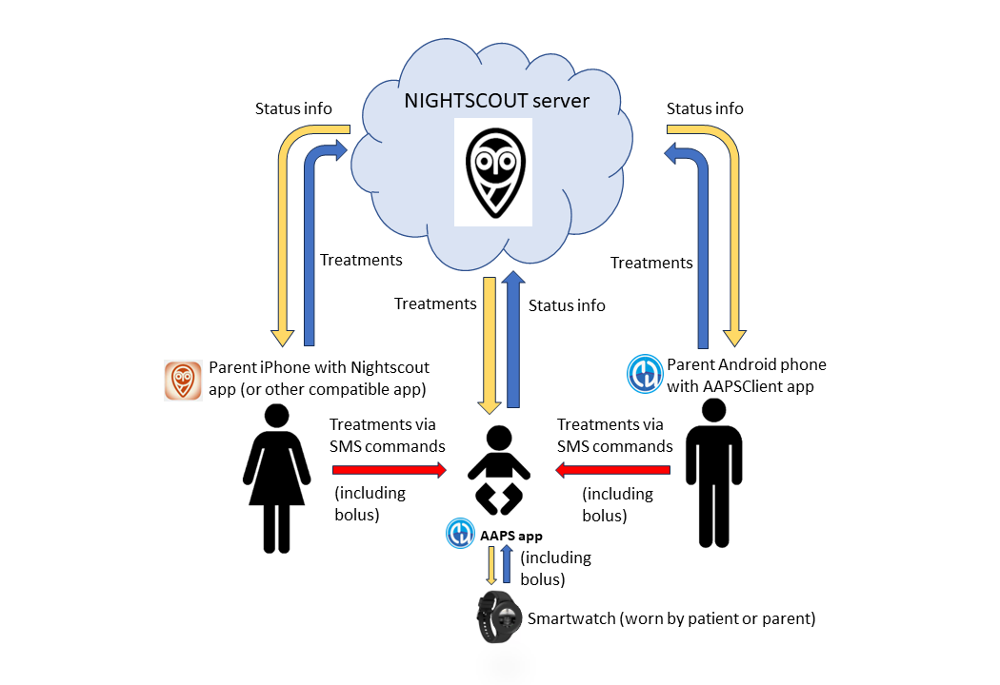
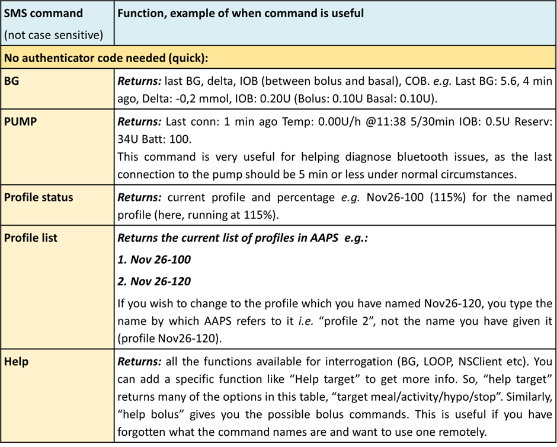
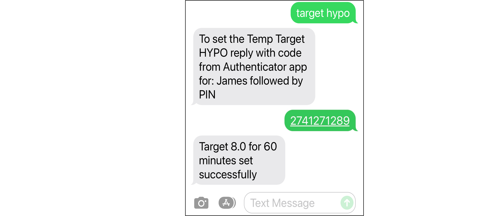
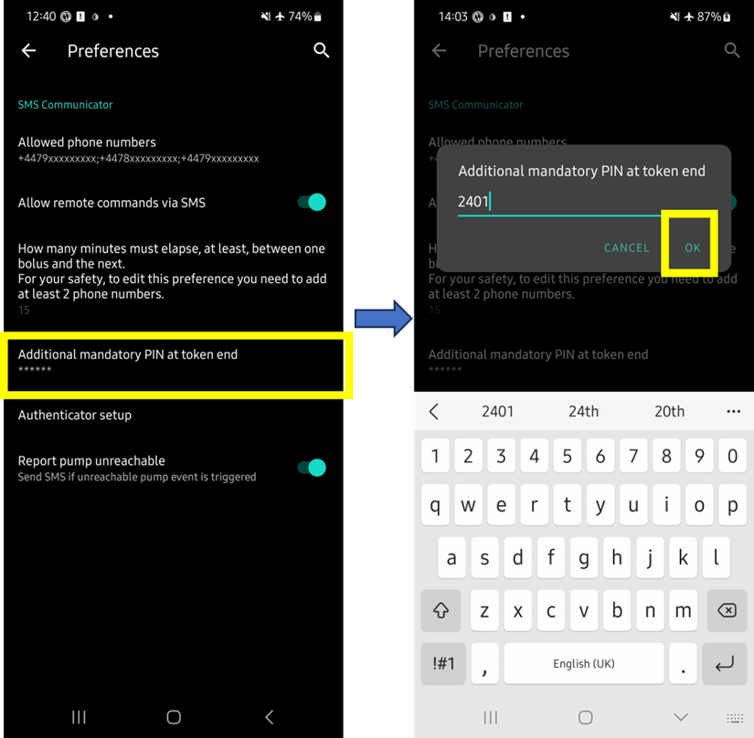
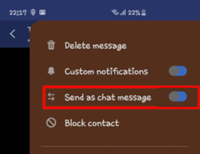
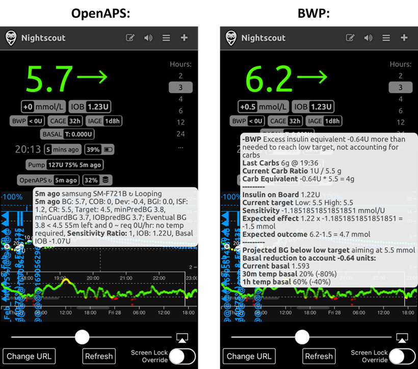
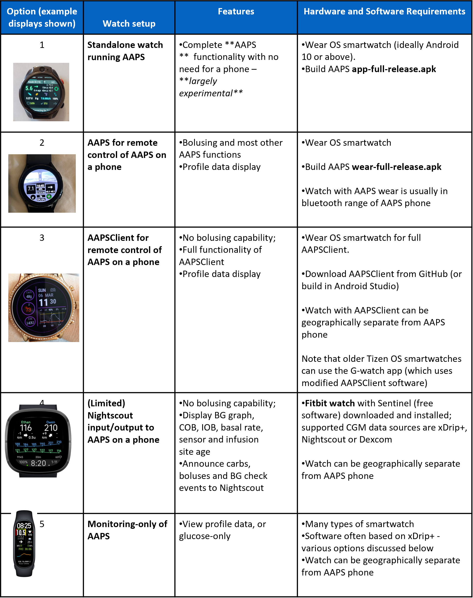
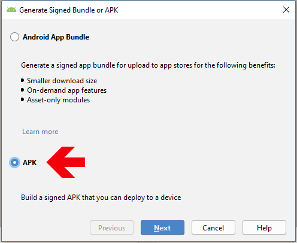

# 遠端控制 AAPS
有四種非常有效的工具可以遠端管理 **AAPS**：

1) [SMS commands](#1-sms-commands) (follower phone can be either Android or iOS), 2) [AAPSClient](#2-aapsclient) (follower phone is Android) 3) [Nightscout](#3-nightscout) (Android, iOS or other computer/device).  
4) [Smartwatches](#4-smartwatches) (Android)

前三個工具主要適合照顧者/父母使用，但智慧型手錶對於照顧者/父母以及糖尿病患者自己都非常有用。



#### 為兒童設置 AAPS 遠端控制的考量

1.  請考慮如何讓孩子的手機保持在幫浦和 CGM 的有效範圍內。 對於年齡較小，還無法對手機負責的兒童來說，這可能是一個挑戰。 確保你選擇的 AAPS 手機具有良好的藍牙連線範圍，並找到讓孩子舒適攜帶幫浦和手機的方法——如果他們年齡/體型夠大，可以隨身攜帶手機——例如，[SPI Belt](https://spibelt.com/collections/kids-belts) 可能會有所幫助。
2.  在開始遠端治療和監控之前，請花時間與孩子一起設置並測試指令。 許多父母選擇在學校假期或週末進行這些測試。
3.  確保其他照顧者/老師了解你孩子的治療計畫，並確定遠端控制如何與現有計畫協作或增強其效果。
4.  許多父母發現，與兒童看護人員保持單獨的聯繫方式是有幫助的，例如準備一個便宜的小型教師“追蹤”手機。
5.  不同年齡兒童學校護理計畫的示例可以在 **AAPS** Facebook 頁面的["文件區"](https://www.facebook.com/groups/AndroidAPSUsers/files/)找到。
6.  當遠端控制無法工作時，你的應急計劃是什麼（_例如_網絡問題或藍牙連線丟失）？  始終考慮當你突然無法發送新指令時，**AAPS** 會發生什麼情況。 **AAPS** 會使用目前設定覆蓋幫浦的基礎率、ISF 和 ICR。 如果切換到更強的胰島素設定，請只使用臨時設定切換（_例如_設置特定的持續時間），以防止遠端連線中斷。 當時間到期時，幫浦將恢復到原始設定。

## 1) SMS 指令

```{admonition} Documentation
:class: note

This section may contain outdated content. Please also see the page [SMS Commands](../RemoteFeatures/SMSCommands.md).

```

你可以透過一項稱為 **SMS 指令** 的功能，使用文字訊息（SMS）遠端控制 **AAPS**。 _任何_ 類型的手機（iPhone/Android）都可以傳送 SMS 指令到 **AAPS**。

**SMS 指令非常有用於：**
1. 日常遠端控制

2. 如果你想遠端注射胰島素

3. 在網路訊號不佳的地區，文字訊息能夠傳送，而資料/網路訊號有限。 這在前往偏遠地區（例如露營、滑雪）時非常有用。

4. 如果你的其他遠端控制方法（Nightscout/AAPSClient）暫時無法使用

### SMS 指令的安全性
如果你啟用 **SMS 通訊** 功能，請考慮設定為傳送遠端指令的手機可能會被竊取，或者被他人使用。 請務必用至少 PIN 碼鎖定你的手機。 強密碼和/或生物辨識鎖定是非常推薦的，並且確保這個密碼與 APK 主密碼（修改 **AAPS** 設定所需的密碼）不同。 必須啟用第二個手機號碼才能使 SMS 指令生效，即使你只有一位主要的照護者/追蹤者。 如果主要照護者/父母的手機遭到侵入，你可以使用第二個號碼暫時停用 SMS 通訊（使用指令**“SMS stop”**）。 Versions of **AAPS** 2.7 and newer also use an [Authenticator app](#authentication-or-not)).

### 不同類型的 SMS 指令
下表列出了所有可能的 **SMS 指令**。 給出了一些_範例值_來幫助暸解。 這些指令的值範圍與 AAPS 應用程式中允許的值相同（目標、百分比設定等）。 下表根據可能的使用頻率列出了指令，前兩個表格應該包含了你在完整循環中需要的大部分 SMS 指令。

### SMS 指令表




(authentication-or-not)=
### 是否需要驗證？

你可能注意到，上述表格中的某些 SMS 指令會立即回應，而某些 SMS 指令則需要透過額外應用程式的安全碼和 PIN 進行 **驗證**（請參閱以下鏈接以獲取更多詳細資訊）。 簡單查詢如「**bg**」（請求目前血糖更新）打字快速，不需要驗證，並且返回以下所示的 **AAPS** 狀態資訊：


某些需要更高安全性的指令需要輸入安全碼，例如：



### 如何設定 SMS 指令

整個流程如下：

**1)    下載驗證器（照護者的手機）**

**2)    檢查手機設置（AAPS 手機）**

**3)    日期和時間同步（照護者和 AAPS 手機）**

**4)    AAPS 設定（AAPS 手機）**

**5)    測試 SMS 指令是否正常工作（照護者和 AAPS 手機）**

### 讓我們開始吧！

1) **下載驗證器：** 在照護者的手機上，從 App Store 或 Google Play 下載並安裝以下驗證器之一：

[**Authy**](https://authy.com/download/)

[**Google 驗證器 - Android / iOS**](https://play.google.com/store/apps/details?id=com.google.android.apps.authenticator2&pli=1)

[**LastPass 身份驗證器**](https://www.lastpass.com/solutions/authentication)

[**FreeOTP 身份驗證器**](https://freeotp.github.io/)

這些驗證器應用程式會生成一個時間限制的、一次性 6 位數密碼，類似於行動銀行或購物。 你也可以使用其他支援 RFC 6238 TOTP 權杖的驗證器應用程式。 Microsoft 驗證器無法使用。

2) **檢查手機設定：** 在 **AAPS** 手機設定中，前往應用程式 > AndroidAPS > 權限 > SMS > 允許 SMS


3) **日期和時間同步：** 檢查 **AAPS** 手機和照護者手機的日期和時間是否同步。 具體操作取決於你的手機型號，你可能需要嘗試不同的設定。

範例（以 Samsung S23 手機為例）：設置 > 通用管理 > 日期和時間 > 自動日期和時間

某些選項可能會被灰階化，這是因為手機設置為兒童帳戶，並需要透過家庭帳戶管理員啟用。 在照護者/父母的 iPhone 上，這個日期和時間設置稱為「自動設置」。 如果你不確定手機是否同步，別擔心，你可以先設置 SMS 指令，然後如果發現問題再進行問題排除（如果需要，可以請求幫助）。

4) **AAPS 設定：**

i) 現在已經檢查了手機設定，在 **AAPS** 應用程式中，使用左側的漢堡選單導航到組態建置工具：


ii) 勾選選項啟用「SMS 通訊」，然後點擊「齒輪」圖示進入 SMS 通訊的偏好設置頁面：


_注意 - 作為進入組態建置工具的替代路徑，你還可以使用 AAPS 螢幕頂部的「SMS 通訊」標籤，然後右擊該頁面的自定義右側漢堡選單，進入 SMS 通訊偏好設定頁面。_

iii) 在偏好設定頁面上，啟用「允許透過 SMS 遠端指令」：


iv) 輸入照護者的電話號碼。 包含國際區號，並且排除電話號碼的第一個「0」，如以下範例所示：

英國電話號碼：+447976304596

美國電話號碼：+11234567890

法國電話號碼：+33612344567

_等。_

請注意，依據你所在的位置，電話號碼前的「+」號可能需要或不需要。 為了確定這一點，你可以傳送範例簡訊，以顯示在 SMS 通訊標籤中的接收格式。

如果需要輸入多個電話號碼，請使用分號分隔，且號碼之間**不能有空格**（這一點至關重要！）。 選擇「確定」：


v) 選擇一個 PIN 碼，你（及任何其他照護者）將會在傳送 SMS 指令時，於驗證碼結尾使用此 PIN 碼。

PIN 碼要求如下：

• 3 到 6 位數字

• 不能全部為相同的數字（例如：1111 或 1224）

• 不能是連續數字（例如：1234）



vi) 在偏好設定頁面中，選擇「驗證器設置」

● 按照螢幕上的逐步說明操作。

● 在照護者的手機上打開已安裝的驗證器應用程式，設定一個新的連線，並

● 當提示時，使用照護者的手機掃描 **AAPS** 提供的 QR 碼。

● 測試從照護者手機的驗證器應用程式生成的一次性密碼，並在後面加上你的 PIN 碼：

範例：

驗證器應用程式生成的驗證碼為 457051

你的必須 PIN 碼為 2401

驗證碼：4570512401

如果輸入正確，紅色字體「WRONG PIN」將自動變為綠色「OK」。 此過程已完成，輸入驗證碼後無需按「OK」按鈕：


你現在已成功設定 SMS 指令。

### SMS 指令的初步操作

1)  為了確認你已經正確設定，從照護者的手機傳送一則包含「bg」的簡訊到 AAPS 手機進行連線測試。 你應該會收到如下的回應：


2)  現在嘗試傳送一個需要驗證器的 SMS 指令。 要這麼做，從照護者的手機傳送所需指令到 **AAPS** 手機 （_例如_「target hypo」）。 照護者的手機將收到一則簡訊，提示你輸入來自驗證器應用程式的 **六位數驗證碼**，隨後是只有照護者/追蹤者知道的額外秘密 **PIN 碼**（假設 PIN 碼為 4 位數，共計 10 位數字）。

下方範例展示了傳送「target hypo」指令以設定低血糖臨時目標的過程：

●   在此範例中，你的 PIN 碼為 1289

●   你的驗證器應用程式生成的驗證碼為 274127

●   當提示時，傳送簡訊 2741271289

指令必須以英文傳送。 回應則會顯示為你的本地語言。 當你首次嘗試傳送 SMS 指令時，最好在 AAPS 手機附近，以觀察運作情況：


照護者的手機將收到來自 **AAPS** 的簡訊，確認遠端 SMS 指令是否成功執行。 指令可能無法成功的幾個原因如下：

●   SMS 指令設置不完整或不正確

●   你傳送了格式不正確的指令（例如：「disconnect pump 45」應為「pump disconnect 45」）

●   你使用了不正確或過期的驗證碼（目前驗證碼即將過期時，等待幾秒產生新的驗證碼通常是個好主意）

●   驗證碼和 PIN 碼正確，但 SMS 傳送或接收的延遲，導致 AAPS 判定驗證碼已過期

●   AAPS 手機超出與幫浦的連線範圍/聯繫

●   系統正忙於執行注射操作

如果你的指令成功，你將收到一則確認回覆。 如果出現問題，你將收到錯誤訊息。

常見錯誤的範例如下所示：


### SMS 指令的額外安全注意事項

預設的兩次注射指令之間的最短延遲時間為 15 分鐘。 為了安全起見，你必須添加至少兩個授權電話號碼才能將此延遲時間縮短。 如果你嘗試在前一次注射後 15 分鐘內再次遠端注射，你將收到「無法遠端注射。請稍後再試」的回覆。 嘗試稍後再試

如果你想移除照護者手機發送 SMS 指令的能力，請使用 AAPS 中的緊急按鈕「重置驗證器」（參見上方偏好設定截圖的連結）或發送 SMS 指令「SMS stop」。 重置驗證器將使所有照護者的手機無效。 你需要重新設定他們。

### 透過 SMS 指令進行餐時注射

遠端注射胰島素 _只能_ 透過 **SMS 指令** 完成，無法透過 NightScout 或 AAPSClient 執行。 然而，碳水化合物可以透過這三種方法中的任何一種報告。 無法在一條 SMS 訊息中同時發送碳水化合物和胰島素指令。 這些指令必須分開發送，具體如下：

1) 發送胰島素注射指令（_例如_ 「bolus 2」將指令注射 2 單位的胰島素），透過 SMS 指令相當於在 **AAPS** 中使用「注射」圖示。 2) 發送碳水化合物指令（_例如_「carbs 20」將報告 20 克的碳水化合物）。 這相當於在 **AAPS** 中使用「碳水化合物」標籤。

為了避免低血糖，最好保守起見，注射 **少於** 按照你的碳水比率所需的胰島素，因為你沒有考慮目前的血糖水平或血糖趨勢。

**發送這些指令的順序很重要**。 如果你透過任何方式報告大量碳水化合物，並啟用了 SMB（超小注射），**AAPS** 可能會立即透過部分胰島素注射作出回應。 因此，如果你在報告碳水化合物後嘗試發送胰島素注射指令，你可能會遇到延遲並顯示「注射進行中」的訊息，你需要檢查已經執行的 SMB 注射。 或者，如果你沒有意識到正在進行 SMB 注射，並且你後續的注射也成功，則可能會為這頓飯過多注射胰島素。 因此，如果遠端控制餐時注射，請務必在報告碳水化合物 _之前_ 發送胰島素注射指令。 如果你願意，你可以結合使用 Nightscout 或 AAPSClient 與 SMS 指令。 碳水化合物可以透過 Nightscout 報告，且不需要驗證（請參閱下方的說明部分），因此速度比 SMS 指令更快。

### SMS 指令的問題排除與常見問題解答

#### Q: SMS 指令有哪些限制？

1) **你無法設置_臨時_的個人檔案切換**（例如，設置「運動檔案」60 分鐘），但你可以永久切換至「運動檔案」。 臨時檔案切換可以透過 Nightscout 或 AAPSClient 進行設置。

2) **你無法取消自動化或設置自定義目標**，但可以使用替代方案：假設你的常規檔案目標為 5.5。 你在 AAPS 中設置了自動化，每天下午 2:30 至 3:30 間將目標設為 7.0，以便學校的運動課程使用，並且自動化條件是「不存在臨時目標」。 本週，你臨時得知運動課被取消，取而代之的是披薩聚會，但你的孩子已經帶著 AAPS 手機在學校。 如果自動化設置了 7.0 的高臨時目標並且你取消了他（在 AAPS 手機上或遠端），自動化條件仍然成立，**AAPS** 將在一分鐘後再次設置高目標。

**如果你可以查看 AAPS 手機**，你可以取消或修改自動化，或者，如果你不想這樣做，你可以在動作標籤中設置一個新的 5.6 的臨時目標 60 分鐘，或按下目標標籤來設置。 這樣可以防止自動化設置 7.0 的高目標。

**如果你無法查看 AAPS 手機**，可以使用 SMS 指令作為大致解決方案：例如，使用指令「target meal」設置 45 分鐘的 5.0 目標（其他預設目標為 8.0 用於運動或低血糖，見表）。 然而，使用 SMS 指令無法指定 _特定_ 的目標值（例如 60 分鐘的 5.6），這需要使用 **AAPSClient** 或 Nightscout。

#### Q: 如果我改變了剛發送的指令怎麼辦？

**AAPS** 只會執行最近發送的指令。 因此，如果你輸入「bolus 1.5」，然後未經驗證就發送了新指令「bolus 1」，他將忽略先前的 1.5 指令。 **AAPS** 會始終向照護者手機發送回覆，確認 SMS 指令內容，然後提示你輸入驗證碼，並在執行後發送回覆。

#### Q: 為什麼我沒有收到 SMS 指令的回覆？

可能是以下原因之一：

1) 訊息未到達手機（網絡問題）。 2) **AAPS** 還在處理請求（_例如_ 注射，根據注射速率，可能需要一些時間來執行）。 3) 當收到指令時，AAPS 手機與幫浦之間的藍牙連線不良，導致指令失敗（這通常會在 AAPS 手機上觸發警報）。

#### Q: 我該如何停止已經通過驗證的指令？

不可以。 但是，你可以透過在 **AAPS** 手機的注射彈出窗口中快速取消來停止 SMS 發送的注射。 除了注射和碳水化合物報告外，許多 SMS 指令可以輕鬆撤銷，或透過某些操作來減輕錯誤的影響。

例如，對於注射和碳水化合物報告中的錯誤，你仍然可以採取行動。 例如，如果你宣佈了 20g 的碳水化合物，但你的孩子只吃了 10g，而你（或在場的照護者）無法直接在 **AAPS** 手機中刪除這個治療，你可以設置一個較高的臨時目標，或設置一個較低的個人設定，讓 **AAPS** 減少其侵略性。

#### 問。 為什麼我收到同一條訊息的多封 SMS 簡訊？

如果你重複收到相同的訊息（例如個人設定切換），你可能無意間與其他應用程式建立了循環狀態。 例如可能是 xDrip+。 如果是這樣，請確保 xDrip+（或任何其他應用程式）沒有將治療資料上傳到 NightScout。

#### 問。 我剛設置了 SMS 指令，現在收到太多的簡訊。 我可以減少頻率或停止這些簡訊嗎？

使用 SMS 指令可能會讓 AAPS 手機自動發送許多訊息到照護者的手機。 例如，如果你在 **AAPS** 中設置了自動化，你也會收到“幫浦中的基礎率設定已更新”這類訊息。 如果預計要發送大量簡訊，你最好在 AAPS 手機計畫中（以及每位照護者手機中）使用不限量的簡訊配額，並停用所有手機上的簡訊通知、警報或振動功能。 使用 SMS 指令時，無法避免接收到這些更新。 因此，你可能需要另一種與孩子直接溝通的方式（如果他們年齡夠大），而不是使用 SMS。 常見的 **AAPS** 照護者會使用的替代通訊應用程式包括 Whatsapp、Lime、Telegram 和 Facebook Messenger。

#### 問。 為什麼我的 Samsung 手機上的 SMS 指令無法運作？

曾經有報告指出，Samsung Galaxy S10 手機在更新後，SMS 指令停止運作。 這個問題可以透過停用“以聊天訊息發送”來解決。




#### 問。 如何解決 Android 訊息應用程式的問題？

如果你在使用 Android 訊息應用程式發送或接收 SMS 指令時遇到問題，請停用照護者和被照護者手機上的端到端加密功能：

●   開啟訊息應用程式中的特定 SMS 對話

●   選擇右上角的選項省略號

●   選擇“詳細資料”

●   啟用“只發送 SMS 和 MMS 訊息”

(aapsclient)=
## 2) AAPSClient

_請注意，**NSClient** 已被 **AAPSClient** 取代，適用於 AAPS 3.2 及更高版本，請查閱版本發佈說明以了解更多資訊。_

對於 AAPS 3.2 以下版本，如果你有照護者/父母的 Android 手機，你可以直接下載並安裝 [**AAPSClient**](https://github.com/nightscout/AndroidAPS/releases/) apk。 **AAPSClient** 的外觀與 **AAPS** 本身非常相似，提供了照護者可以遠端執行 **AAPS** 指令的標籤頁：


這裡有兩個可以[下載](https://github.com/nightscout/AndroidAPS/releases/)的 apk 版本，分別是 **AAPSClient** 和 **AAPSClient2**，他們有著細微但重要的差異，詳見下方說明。

**AAPSClient** 可以安裝在一部或多部追蹤者手機上（例如父母一的追蹤者手機和父母二的追蹤者手機），以便兩位照護者都能夠獲得權限並遠端控制患者的 **AAPS** 手機。

如果某位照護者需要第二個副本來遠端控制另一位患者，且該患者有 Nightscout 帳號，他們應該安裝 **AAPSClient2** 以外加 **AAPSClient**。 **AAPSClient2** 允許單一照護者在同一台追蹤者手機上安裝 **AAPSClient** apk 兩次，以便同時遠端控制兩位不同的患者。

要下載 **AAPSClient**，請前往 [此處](https://github.com/nightscout/AndroidAPS/releases/)，然後點擊資產**“app-AAPSClient-release_x.x.x.x”**（他可能比下面的截圖顯示版本更新）：


然後前往電腦上的 _下載_ 資料夾。 在 Windows 上，-下載- 將顯示右邊的選單欄：


下載完成後，點擊 _顯示於資料夾中_ 來定位該檔案。

現在，**AAPSClient** apk 可以透過以下方式進行安裝：

透過 USB 傳輸線傳輸到追蹤者手機；或拖放至 Google 雲端硬碟資料夾，然後透過點擊“app-AAPSClient-release”檔案將其安裝到追蹤者手機。

### 同步設置 - AAPSClient 和 AAPS 配置（適用於 3.2.0.0 版本以上）

Once __AAPSClient__ apk is installed on the follower phone, the user must ensure their ‘Preferences’ in Config Builder are correctly set up and aligned with __AAPS__ for Nightscout 15 (see Release Notes [here](../Maintenance/UpdateToNewVersion)). 以下範例提供了使用 Nightscout 15 的 NSClient 和 NSClientV3 的同步指南，但 __AAPS__ 也有其他選項（例如 xDrip+）。

在“Config Builder”的“同步設置”中，用戶可以選擇 __AAPS__ 和追蹤者手機的同步選項：

- 選項 1：NSClient（也稱為“v1”）- 同步用戶的資料與 Nightscout；或

- 選項 2：NSClientV3（也稱為“v3”）- 透過 v3 API 同步用戶的資料與 Nightscout。


用戶必須確保 __AAPS__ 和 AAPS Client 手機都透過執行 v1 或 v3 的選項同步：

選項 1：兩部手機均使用 v1：

- 輸入你的 Nightscout 網址

- 輸入你的 API 密碼

選項 2：兩部手機均使用 v3：

- 在 NSClientV3 標籤下輸入你的 Nightscout 網址

- 在“Config Build”標籤下輸入你的 NS 查看權杖。 請遵循[此處](https://nightscout.github.io/nightscout/security/#create-a-token)的說明

如果選擇 Websockets（可選），請確保 __AAPS__ 和 __AAPSClient__ 的手機上均已啟用或停用此功能。 啟用 Websockets 於 __AAPS__ 而未於 __AAPSClient__ 啟用（反之亦然），將會導致 __AAPS__ 無法正常運作。 啟用 Websockets 將加快與 Nightscout 的同步速度，但可能會導致手機耗電量增加。


用戶應確保 __AAPSClient__ 和 __AAPS__ 均在“NSClient”標籤下顯示“已連線”，並且當在 __AAPSClient__ 中選擇後，“個人設定切換”或“臨時目標”可以在 __AAPS__ 中正確啟動。

用戶還應確保在 __AAPSClient__ 和 __AAPS__ 中的“治療”中記錄碳水化合物，否則這可能表明用戶的設置存在問題。

### 問題排除“NS 查看權杖”配置問題

具體的“NS 查看權杖”配置可能會根據你的 Nightscout 提供商是否為付費託管網站而有所不同。

如果你在使用付費託管的 Nightscout 網站時，發現 **AAPS** v3 無法接受“NS 查看權杖”，建議你首先與 Nightscout 提供商聯繫，以解決“NS 查看權杖”問題。 否則，請聯繫 **AAPS** 小組，但在此之前，請務必仔細檢查是否正確遵循了說明 [此處](https://nightscout.github.io/nightscout/security/#create-a-token)。

### AAPSClient 的功能包括：


**AAPSClient** 允許照護者透過移動網絡或互聯網，遠端進行許多 **AAPS** 中允許的調整（不包括胰島素注射）。 **AAPSClient** 的主要優點是照護者/父母能夠以快速、便捷的方式遠端控制 **AAPS**。 __AAPSClient__ _可能_ 比輸入 SMS 指令快得多，尤其是當執行需要身份驗證的指令時。 透過 **AAPSClient** 輸入的指令將上傳到 Nightscout。

Remote control through **AAPSClient** is only recommended if your synchronization is working well (_i.e._ you don’t see unwanted data changes like self-modification of TT, TBR etc) see [release notes for Version 2.8.1.1](../Maintenance/ReleaseNotes#version-2811) for further details.

### AAPSClient 與智慧型手錶的選項

智慧型手錶可以是一個非常有用的工具，幫助管理兒童的 **AAPS**。 有幾種不同的配置方式可供選擇。 如果**AAPSClient** 安裝在父母的手機上，則可以下載並安裝[**AAPSClient WearOS** 應用程式](https://github.com/nightscout/AndroidAPS/releases/)在與父母手機連線的相容智慧型手錶上。 這將顯示目前的血糖值、循環狀態，並允許輸入碳水化合物、設定臨時目標和更換設定檔。 無法從 WearOS 應用程式進行注射。 You can read more about Smartwatches [here](#4-smartwatches).

(nightscout)=
## 3) Nightscout

Nightscout 不僅是雲端中的伺服器，還有一個專用的 **Nightscout** 應用程式，可以直接從 iPhone 的 App Store 下載。 If you have an Android follower phone, there is not a dedicated Nightscout app and it is better to use [**AAPSClient**](#2-aapsclient), or, if you only want to follow, and not send treatments you can download and install the [Nightwatch](https://play.google.com/store/apps/details?id=se.cornixit.nightwatch) app from the Playstore.

當你在 iPhone 上安裝了 **Nightscout** 應用程式，打開應用並按照設置提示進行操作，輸入你的 Nightscout 地址（見下方左側）。 此地址的格式可能取決於你的 Nightscout 是如何託管的。 (_例如_ http://youraddresshere.herokuapp.com)。 然後輸入你的 Nightscout API 密碼（見下方右側）。 如果未提示你輸入 API 密碼，請點擊應用程式頂部的鎖形圖示輸入密碼：


更多設置資訊可直接從 [Nightscout](https://nightscout.github.io/nightscout/discover/) 獲得

當你首次登入時，將會顯示一個非常簡單的介面（見下方左側）。 透過點擊右上角的“漢堡”選單並向下滾動來自定義顯示選項：


向下滾動到“設置”。 你可能會想將 血糖 顯示的“比例”設置為“線性”，因為預設值是對數比例，並在“渲染基礎率”下選擇“預設”以顯示幫浦的基礎率。 繼續向下滾動直到找到“顯示外掛”。 你需要確保已勾選“照護入口”，還可以選擇其他有用的指標（最常用的包括：IOB、照護入口、幫浦、套管時間、胰島素時間、基礎率設定和 OpenAPS）。


重要的是，你現在需要點擊底部的“儲存”，以使這些更改生效。

按下“儲存”後，應用程式將返回你的 Nightscout 主畫面，顯示如下：


更詳細地查看 Nightscout 應用程式左上角的選單：


此畫面上的灰色標籤包含大量關於 **AAPS** 系統狀態的資訊（點擊標籤可顯示更多資訊）：




### 透過 Nightscout 應用程式向 AAPS 發送治療資料

要設置從 **Nightscout** 應用程式向 **AAPS** 發送治療資料，請在主要 AAPS 手機中進入 **AAPSClient** 標籤。 打開右側的省略號選單，然後打開 AAPSClient 偏好設定 - 同步，並在此選單中選擇相關選項。 將其設置為接收不同的指令（例如臨時目標等）並同步個人設定。 如果似乎沒有同步，請返回 AAPSClient 標籤並選擇“完全同步”，等待幾分鐘。

你在 iPhone 上的 Nightscout 應用程式擁有與你在電腦上使用的 Nightscout 相同的功能。 他允許你向 **AAPS** 發送許多指令，但不允許你發送胰島素注射指令。

### 取消負胰島素以避免重複低血糖

儘管你無法實際注射胰島素，但你可以透過 Nightscout 宣佈胰島素作為“修正注射”，儘管他實際上並未注射。 由於 AAPS 會考慮到這個假設的胰島素注射，因此宣佈胰島素實際上可以使 AAPS _不那麼激進_，這在取消負胰島素和防止低血糖時非常有用，特別是當你的個人設定過於強烈（例如，由於之前的運動）。 你可能會希望親自查看這些設置，並在 **AAPS** 手機附近進行檢查，以防你的 **Nightscout** 設置有所不同。


一些最有用的 **Nightscout** 指令在下表中描述。

#### Nightscout 指令表


閱讀更多關於 **Nightscout** 的選項[此處](https://nightscout.github.io/)

### 獲取 Nightscout 應用程式最佳使用效果的小提示

1). 如果你被困在某個頁面上，並希望再次查看主畫面，只需點擊“重新整理”（底部中間），這將帶你返回 **Nightscout** 主頁，顯示 血糖 圖表。

要查看手機上目前運作的個人設定，請按圖表上方的各個圖示。 按下“基礎率”可以查看更多資訊（目前的碳水化合物比率、敏感性和時區等），“OpenAPS”顯示有關個人設定和目前目標的資訊。 你還可以監控手機電池百分比和幫浦電池百分比。 BWP 提供關於算法在考慮 IOB 和 COB 情況下預測未來結果的資訊。

#### 選單中的其他圖示：鉛筆（編輯）圖示是什麼意思？

你可以（技術上）使用編輯鉛筆來移動或刪除過去 48 小時內的注射或修正治療。

更多相關資訊請參閱 [這裡](https://nightscout.github.io/nightscout/discover/#edit-mode-edit)

雖然這可能對刪除已宣佈（但未實際注射）的碳水化合物有幫助，但在實際操作中，這在 **AAPS** 中並不運作良好，因此我們建議直接透過 **AAPS** 應用程式進行此類更改。

(smartwatches)=
## 4) 智慧型手錶

智慧型手錶越來越多地與 **AAPS** 結合使用，_無論是_ 對於患有糖尿病的成年人還是兒童的照護者/父母。

### 使用智慧型手錶搭配 **AAPS** 的一般優勢


根據不同的型號，智慧型手錶可以以多種不同的方式與 **AAPS** 結合使用。 他們可以用來完全或部分控制 **AAPS**，或者只是遠端查看血糖值、胰島素剩餘量（IOB）及其他參數。

在很多情況下，將智慧型手錶與 **AAPS** 整合非常有用，包括開車或騎車時，以及進行運動時。 有些人覺得在會議、聚會、餐桌等場合查看手錶比查看手機更加低調。 從安全的角度來看，當移動時，智慧型手錶還能提供幫助，使用戶可以將 **AAPS** 手機存放在看不見的地方（例如包內），但仍可以透過智慧型手錶進行遠端控制。

### 父母/照護者使用 **AAPS** 的具體優勢

對於孩子來說，如果他們的 **AAPS** 手機在附近，照護者可以使用智慧型手錶進行監控或修改，而無需使用 **AAPS** 手機。 例如，當 **AAPS** 手機藏在幫浦腰帶中時，這會很有用。

A smartwatch can be used either _in addition_ to, or as an _alternative_ to the PHONE-based options for remote control or [following only](../RemoteFeatures/FollowingOnly.md).

此外，不同於父母/照護者的追蹤者手機（依賴於移動網絡或 Wi-Fi 連線），藍牙連線的智慧型手錶在偏遠地區（如洞穴、船上或半山腰）也能發揮作用。 如果兩個設備（**AAPS** 手機和智慧型手錶）都連線到相同的 Wi-Fi 網絡，他們也可以使用 Wi-Fi。

### 不同類型的智慧型手錶與 AAPS 的互動方式

許多 **AAPS** 用戶可使用的智慧型手錶選項詳見 [Nightscout 與智慧型手錶](https://nightscout.github.io/nightscout/wearable/#)，強烈建議你先閱讀這些頁面，以便更好地了解所有可能性。

目前有五種主要方式可將智慧型手錶與 **AAPS** 結合使用。 這些方式在下表中顯示： 





請注意，此表格編製於 2023 年，並非詳盡無遺，且不斷有新選項添加進來。

### 在購買智慧型手錶之前……

你購買的智慧型手錶具體型號取決於你所需的功能。 目前有兩份歷史性電子表格記錄了相容的[智慧型手機](https://docs.google.com/spreadsheets/d/1zO-Vf3wv0jji5Gflk6pe48oi348ApF5RvMcI6NG5TnY/edit#gid=2097219952)和[智慧型手機和手錶](https://docs.google.com/spreadsheets/d/1gZAsN6f0gv6tkgy9EBsYl0BQNhna0RDqA9QGycAqCQc/edit#gid=698881435)，但由於選項繁多，建議透過 Discord 和 Facebook 群組進行詢問，這些表格將不再更新。

受歡迎的手錶品牌包括三星 Galaxy、Garmin、Fossil、米動手環和 Fitbit。 上表中概述的不同選項將在下方詳細解釋，幫助你決定哪款智慧型手錶適合你的需求。

如果你打算將智慧型手錶與**AAPS** 手機結合使用並遠端操作**AAPS**，你還需要考慮這兩個設備是否相容，尤其是如果你的手機較舊或比較特殊。

一般來說，如果你只想要追蹤血糖資料而不與**AAPS** 進行互動，有更多價格實惠且簡單的手錶可供選擇。

選擇智慧型手錶的最佳方式是搜尋 Discord 或 Facebook**AAPS** 群組中的“手錶”相關帖子。 閱讀其他人的經驗分享，如果舊帖子中未解答你的問題，請發布具體問題。

#### 智慧型手錶選項 1 - 3：什麼是 _Wear OS_？

前三個智慧型手錶選項要求智慧型手錶安裝 **Wear OS**。

**Wear OS** 是運作在部分現代 Android 智慧型手錶上的作業系統。 在 [2018年](https://en.wikipedia.org/wiki/Wear_OS)，Google 將 _Android Wear 1.x_ 更名為 **Wear OS**，版本為 2.x。 因此，如果某款設備標示為“_Android Wear_”而不是 **Wear OS**，這可能表示該設備運作的是較舊版本。 如果智慧型手錶的描述僅指示與 Android 和 iOS 相容，則並不意味著他運作的是 **Wear OS**。 他可能運作的是其他供應商專用的作業系統，這些系統不與 **AAPS** 相容。 要支援安裝和使用任何版本的 **AAPS** 或 **AAPSClient**，智慧型手錶必須運作 **Wear OS**，且最好是 Android 10 或更新版本。 作為指引，截至 2023 年 10 月，**Wear OS** 的最新版本是基於 Android 13 的 4.0 版本。

如果你在 **Wear OS** 手錶上安裝了 **AAPS** wear.apk，你可以選擇一系列不同的自訂 **AAPS** 手錶錶盤。 或者，你可以使用標準的智慧型手機錶盤，並在錶盤上包含稱為“小工具”的小方塊，顯示你的 **AAPS** 資訊。 小工具是在錶盤上顯示的任何額外於時間的功能。 像這樣的小工具需要 Wear OS 2.0 或更新版本才能正常運作。


#### 我的智慧型手錶在遠端控制 AAPS 時可能是什麼樣子？

在手錶上安裝 **AAPS** 後，你將自動可以從這些專用的 **AAPS** 錶盤中選擇你偏好的錶盤。 在大多數手錶上，你只需長按主畫面，直到畫面縮小，然後向右滑動選擇另一個螢幕：


#### 如何在日常操作中使用 Wear OS 手錶？

Further details about the watchfaces, and day-to-day use, including how to make (and share) your own customised watchface, can be found in the section [Operation of Wear AAPS on a Smartwatch](../UsefulLinks/WearOsSmartwatch.md).

### 選項 1) 運作 **AAPS** 的獨立手錶

這聽起來像是一個很有吸引力的選項，對嗎？ 然而，目前只有少數愛好者正在嘗試在獨立手錶上運作 **AAPS**。 能夠與 **AAPS** 和你的 CGM 應用程式一起良好運作的獨立手錶界面目前數量有限。 受歡迎的型號包括 LEMFO LEM 14、15 和 16。 你需要在手錶上載入 **AAPS** 的“完整” apk（通常安裝在智慧型手機上的 apk），而不是 **AAPS** 的“wear” apk。

雖然目前沒有明確的規範告訴你哪款手錶適合獨立使用 **AAPS**，但以下參數會有所幫助：

1)  Android 10 或更新版本。 2)  能夠將錶盤從“方形”模式移除，以使文本更大、更易讀。 3)  非常好的電池續航能力。 4)  良好的藍牙範圍。

大多數在獨立手錶上運作 **AAPS** 的挫折來自於與小螢幕的互動，並且目前 **AAPS** 完整應用程式的界面並非為手錶設計。 由於螢幕大小受限，你可能會更願意使用觸控筆來編輯 **AAPS** 設定，並且某些 **AAPS** 按鈕可能無法在手錶螢幕上顯示。

額外的挑戰包括很難獲得足夠的電池續航能力，並且擁有足夠電池容量的手錶通常體積龐大且厚重。 用戶報告了操作系統和節能設置的問題、在手錶上啟動傳感器的困難、藍牙範圍差（無法與傳感器和幫浦保持穩定連線），以及不確定的防水性能。 下圖中展示了一些例子（圖片來源：Janvier Doyon）。


如果你有興趣設置獨立手錶，請閱讀 **AAPS** Facebook 群組中的帖子和評論（好的搜尋詞是“standalone”和“Lemfo”）以及 Discord 獲取更多資訊。

### 選項 2) 在手錶上運作 **AAPS**，以遠端控制手機上的 **AAPS**

類似於使用追蹤者手機搭配 AAPSClient、Nightscout 或 SMS 指令（鏈接到相應部分），智慧型手錶可以用來遠端控制 **AAPS**，並提供完整的個人設定資料。 與使用追蹤者手機的主要區別是，智慧型手錶與 **AAPS** 手機的連線是透過藍牙進行的，並且不需要驗證碼。 順帶一提，使用者報告說，如果智慧型手錶和 **AAPS** 手機透過藍牙連線，並且同時連線到 Wi-Fi 網絡，那麼手錶還可以透過 Wi-Fi 與 **AAPS** 手機互動，提供更長距離的通訊範圍。 這包括在不同位置遠端注射胰島素，例如照護者透過 **AAPS** 手錶為 T1D 孩子（持有 **AAPS** 手機）進行注射，這在孩子上學時特別有用。

因此，遠端控制智慧型手錶在以下情況中特別有用：

a) 當 **AAPSClient**/Nightscout/**SMS** 指令無法使用時；或

b) 使用者希望避免輸入驗證碼（追蹤者手機需要在輸入資料、選擇 TT 或輸入碳水化合物時使用驗證碼）。

智慧型手錶需要運作 **Android wear** 軟體（最好是 10 或更新版本）才能控制 **AAPS**。 Please check the technical specifications of the watch, and check the [spreadsheet of compatible watches](https://docs.google.com/spreadsheets/d/1gZAsN6f0gv6tkgy9EBsYl0BQNhna0RDqA9QGycAqCQc/edit?usp=sharing). 如果不確定，請在 **AAPS** 的 Facebook/Discord 群組中搜尋或詢問。

以下是設置流行型號 Samsung Galaxy Watch 4（40 毫米）的具體操作指南。 Garmin 手錶也是一個受歡迎的選擇，請參閱[這裡](https://apps.garmin.com/en-US/apps/a2eebcac-d18a-4227-a143-cd333cf89b55?fbclid=IwAR0k3w3oes-OHgFdPO-cGCuTSIpqFJejHG-klBTm_rmyEJo6gdArw8Nl4Zc#0)。 If you have experience of setting up a different smartwatch which you think would be useful to others, please add it into these pages [edit the documentation](../SupportingAaps/HowToEditTheDocs.md) to share your findings with the wider **AAPS** community.

#### AAPS Wear apk

適用於智慧型手錶的 **AAPS** Wear OS 應用程式（“Wear OS apk”）已從 Android 手機的“完整” **AAPS** 版本中分離出來。 因此，你需要生成第二個安裝檔案或 apk，將 **AAPS** wear 安裝到手錶上（這是透過從手機側載到手錶上完成的）。 強烈建議在第一次建置手機的完整 **AAPS** apk 後立即生成 **AAPS** Wear apk 檔案。 這不僅在你[首次建置 **AAPS**] 時非常快捷，而且還可以避免在設置手錶與手機的通訊時出現潛在的相容性問題。 如果手錶上的 **AAPS** Wear apk 與手機上的 **AAPS** apk 是在不同版本的 Android Studio 中建置的，或如果距離最初的 **AAPS** 建置已經過了幾個月，則可能不相容。

如果你已經在手機上使用 **AAPS**，但當時沒有同時建置手機和手錶的 **AAPS** apk，為了確保成功，最好同時重新建置這兩個 apk 檔案。 如果你已經安裝了 Android Studio，則可能需要卸載並重新安裝 Android Studio，並按照以下步驟同時建置 **AAPS** 手機和手錶 apk，使用相同的**密鑰庫檔案**。

#### 如何卸載 Android Studio

確保你的密鑰庫檔案已安全存儲在電腦上的其他位置，遠離 Android Studio 資料夾。

完全卸載 Android Studio 需要執行幾個步驟。 如果你使用的是 Windows 機器，這裡有一個[不錯的指南](https://www.geeksforgeeks.org/how-to-completely-uninstall-android-studio-on-windows/)。 在這些指示的最後一步，你還需要手動刪除“StudioProjects”資料夾。

現在重新安裝最新版本的 Android Studio。

#### 建置 **AAPS** Wear apk
簡單來說，Wear apk 的建置過程與手機 apk 的“完整”建置過程非常相似，不同之處在於你需要在 Android Studio 中的下拉選單中選擇“**AndroidAPS.wear**”，並選擇建置變體“**fullRelease**”。 這將生成 **AAPS** Wear apk 檔案。  如果你願意，你也可以從下拉選單中選擇建置 **“pumpcontrolRelease”**，這將只允許你遠端控制幫浦，但不包括循環功能。

以下指南假設你已重新安裝最新版本的 Android Studio（此場景使用的是 Giraffe 2022.3.1）。


要回到這裡：


繼續按照說明進行操作。

按照不同畫面的提示，直到出現一個下拉選單，提供建置 AAPS 完整 apk 的選項。 在此時，從下拉選單中選擇“Wear”而不是“AndroidAPS.apk”，因為你正在為智慧型手錶建置 apk。


下一步，前往功能區中的“建置”選項


前往建置 > 生成已簽章的包/ APK


選擇 > APK：




在模塊中選擇：AndroidAPSwear


輸入預設位置的密鑰庫檔案。 你的密鑰庫路徑取決於你將密鑰庫存放的位置。 在此場景中，密鑰庫路徑位於：C:\Program Files\Android\Android Studio\jbr\bin


下一個畫面應顯示如下：


然後選擇“fullRelease”。

請耐心等待 - 建置 **AAPS** Wear apk 大約需要 10-20 分鐘，具體取決於你的網路連線速度。

### Troubleshooting

在建置 3.2 版完整 **AAPS** 應用程式（實際上是任何已簽章的應用程式）過程中，Android Studio 會在同一個資料夾中生成一個 .json 檔案。 This then causes errors with [uncommitted changes](../GettingHelp/TroubleshootingAndroidStudio#uncommitted-changes) when you try to build the next signed app, like the **AAPS** wear app. 解決此問題的最快方法是導航到建置完整 AAPS 應用程式的資料夾，你的資料夾可能類似於：

C:\Users\Your Name\StudioProjects\AndroidAPS\app\aapsclient\release。

將不需要的 .json 檔案刪除或移出該資料夾。 然後再次嘗試建置 **AAPS** wear 應用程式。 If that doesn't work, the more detailed [troubleshooting guide](../GettingHelp/TroubleshootingAndroidStudio) will help you to identify the specific file causing the issue, which could also be your keystore file.


#### 如何設置 Samsung Galaxy 4 智慧型手錶與 **AAPS** 搭配使用

本節假設你對智慧型手錶完全陌生，將向你介紹一款流行手錶（**Galaxy Watch 4**）的基本操作，隨後是逐步設置 **AAPS** 在手錶上運作的指南。

_本指南假設你正在設置運作 Wear OS 3 或更低版本的 Samsung Galaxy 手錶。_ 如果你正在設置運作 Wear OS 4/OneUI 5 或更高版本的手錶，你將需要使用新的 ADB 配對過程，這在 Samsung 手機軟體中有解釋，並將在適當時更新到這裡。 這裡有關於 [Galaxy Watch 5](https://www.youtube.com/watch?v=Y5upzOIxwTU) 和 [Galaxy Watch 6](https://www.youtube.com/watch?v=D6bq20KzPW0) 的基本設置指南

##### 智慧型手錶的基本熟悉指南

根據上方影片進行手錶的基本設置後，前往手機上的 Play 商店並下載以下應用程式：“Galaxy Wearable”、“Samsung”和“Easy Fire tools”或“Wear Installer 2”。

有許多第三方 YouTube 視頻可幫助你熟悉新手錶，例如：

https://www.youtube.com/watch?v=tSVkqWNmO2c

“Galaxy Wearable”應用程式內也有一個使用手冊部分。 在手機上打開 Galaxy Wearable，搜尋手錶，嘗試將手錶與手機配對。 根據你的版本，這可能會提示你從 Play 商店安裝第三個應用程式“Galaxy Watch 4 外掛”（下載需要一些時間）。 在手機上安裝此應用程式，然後再次在 Galaxy Wearable 應用程式中嘗試將手錶與手機配對。 透過一系列選單並勾選各種偏好設定。

##### 設置 Samsung 帳號

你需要確保用來設置 Samsung 帳號的電子郵件帳戶的出生日期顯示用戶年齡 13 歲以上，否則 Samsung 的許可權批准將非常困難。 如果你已為 13 歲以下的孩子建立了 Gmail 帳號並使用該電子郵件地址，你無法簡單地將其更改為成人帳戶。 解決此問題的一種方法是將目前的出生日期修改為使目前年齡為 12 歲零 363 天。 第二天，該帳戶將被轉換為成人帳戶，然後你可以繼續設置 Samsung 帳戶。

##### 將 **AAPS** Wear 應用程式傳輸到 **AAPS** 手機

從 Android Studio 將 Wear.apk 載入到你的手機，可以透過以下方式進行：

a) 使用 USB 傳輸線將 **AAPS** wear apk 檔案放入手機，然後將其“側載”到手錶上。 透過 USB 將 Wear.apk 傳輸到手機的下載資料夾；或

b) 從 Android Studio 將 Wear.apk 剪切並粘貼到你的 Gdrive 中。


你可以使用 Wear Installer 2 或 Easy Fire tools 將 AAPS 側載到手錶上。 這裡我們推薦使用 Wear Installer 2，因為視頻中的說明和過程非常清晰且解釋得很好。

##### 使用 Wear Installer 2 將 **AAPS** Wear 從手機側載到手錶上

 

Wear Installer 2 由 [Malcolm Bryant](https://www.youtube.com/@Freepoc) 開發，你可以從 Google Play 將其下載到手機上，並用來將 AAPS wear 應用程式側載到手錶上。 該應用程式包含一個便捷的“如何側載”[視頻](https://youtu.be/abgN4jQqHb0?si=5L7WUeYMSd_8IdPV)。

該視頻提供了所有必要的細節（最好在單獨的設備上打開視頻，以便在設置手機時觀看）。

如視頻中所述，完成後，請關閉手錶上的 ADB 調試，以避免消耗智慧型手錶的電池。

或者，你可以：

```{admonition} Use Easy Fire tools to side-load the **AAPS** wear on the watch
:class: dropdown

1)   Download _Easy Fire Tools_ from playstore onto phone 


2)  Make yourself a developer in the watch (once set up and connected to phone): 

Go to settings >about watch (bottom option) >- software info > software version. 

快速點擊“軟體版本”，直到出現通知，告知手錶現在處於“開發者模式”。 返回設置選單頂部，向下滾動，並在“關於手錶”下方看到“開發者選項”。 

在“開發者選項”中，打開“ADB 調試”和“無線調試”。 後者將顯示手錶的 IP 地址，其最後兩位數字每次與新手機配對時都會改變。 他會像是：**167.177.0.20.** 5555（忽略最後4位數）。 請注意，每次將 AAPS 切換到新手機時，這個地址的最後兩位數字（這裡為“20”）將發生變化。  


STEP 3)     Enter IP address _e.g._ **167.177.0.20** into Easy Fire tools on the phone (go into the left hamburger, settings and enter the IP address). 然後點擊右上角的插頭圖示。  


STEP 4) Follow the instructions [here](https://wearablestouse.com/blog/2022/01/04/install-apps-apk-samsung-galaxy-watch-4/?utm_content=cmp-true) to side-load (i.e. transfer)  Wear.apk onto the smartwatch using Easy Fire tools

Click side "plug-in" socket in the app, in order to upload Wear OS.apk onto the smartwatch: 


 Next step > accept the authorisation request on the smartwatch


```


##### 設置 **AAPS** 手機與手錶的連線

最後一步是配置手機上的 **AAPS** 與智慧型手錶上的 **AAPS** Wear 互動。 為此，在 Config Builder 中啟用 Wear 外掛：

● 打開手機上的 **AAPS** 應用程式

● 選擇 > 左側漢堡選單中的 Config Builder

● 在常規部分勾選 Wear 選項


要更改 **AAPS** 手錶錶盤，請按下手錶的主畫面，他將進入“自訂”模式。 然後向右滑動，直到看到所有 **AAPS** 錶盤。

如果 **AAPS** Wear.apk 已成功側載到智慧型手錶上，他將顯示如下：


#### 排查 **AAPS** 手錶與 **AAPS** 手機通訊的故障
1.  如果 EasyFire tools 無法連線，或者你收到“授權失敗”訊息 > 請檢查 IP 地址是否正確輸入。
2.  檢查智慧型手錶是否已連線到網際網路（而不僅僅是透過藍牙與手機連線）。
3.  檢查 **AAPS** 手機和智慧型手錶是否已在 Samsung 應用程式中配對或連線。
4.  也可能需要對手機和智慧型手錶進行硬重啟（即關閉並重新啟動手機）。
5.  假設你已經成功下載 Wear.apk 到手機，但未收到任何血糖資料，_請檢查_ 你是否已將正確的 **AAPS** apk 版本側載到手錶上。 如果你的 AAPS wear.apk 版本列為以下任何一個：a) “wear-AAPSClient-release”；b) “wear-full-release.aab”；或c) 標題中出現“debug”一詞，那麼你在建置過程中選擇了錯誤的 Wear OS apk 版本。
6.  檢查路由器是否未將設備相互隔離。

更多問題排除提示請參閱[這裡](https://freepoc.org/wear-installer-help-page/#:~:text=If%20you%20are%20having%20problems,your%20phone%20and%20your%20watch.)

### 從 Wear 手錶控制 AAPS

Once you have setup **AAPS** on your watch, extensive details about the smartwatch faces and their functions can be found in [Operation of Wear AAPS on a Smartwatch](../UsefulLinks/WearOsSmartwatch.md).

簡要概述，以下功能可以從智慧型手錶觸發：

● 設置臨時目標

● 使用注射計算機（計算變數可以在手機設置中定義）

● 管理 eCarbs

● 管理一次注射（胰島素 + 碳水化合物）

● 手錶設置

● 狀態

● 檢查幫浦狀態

● 檢查循環狀態

● 檢查和更改個人設定檔，CPP（日夜節律百分比個人設定檔 = 時間偏移 + 百分比）

● 顯示 TDD（每日總劑量 = 每日注射 + 基礎）

● 當照護者和 1 型糖尿病（T1D）孩子處於不同位置時進行遠端注射（這適用於 **AAPS** 手錶和 **AAPS** 手機，只要兩台設備均連線到 Wi-Fi 網絡）

#### 照護者使用其他應用程式（如 Whatsapp）與手錶通訊

可以在手錶上添加其他應用程式，例如 Whatsapp，用於照護者和孩子之間的訊息交流（例如）。 重要的是，手機上只應關聯一個 Google 帳戶，否則手錶無法同步這些資料。 你需要年滿 13 歲才能擁有 Samsung 帳戶，並且此帳戶需要使用與 Android 手機相同的電子郵件地址設置。

這裡有一段視頻，解釋了如何在 Galaxy 4 手錶上設置 Whatsapp 訊息功能（你無法獲得 Whatsapp 的全部功能），請參閱[這裡](https://gorilla-fitnesswatches.com/how-to-get-whatsapp-on-galaxy-watch-4/)

在 **Galaxy wearable** 應用程式中的手機和手錶上進行調整後，可以使 Whatsapp 訊息透過輕微振動通知，並且 Whatsapp 訊息會顯示在現有錶盤上方。

#### Sony 智慧型手錶設置問題排除

Although it was discontinued a few years ago, if you are using a Sony Smartwatch SW 3 please see here for a troubleshooting guide: [Troubleshooting Sony Smartwatch SW 3](../UsefulLinks/SonySW3.md)


### 選項 3) 在手錶上運作 AAPSClient 以遠端控制手機上的 **AAPS**

手錶軟體 **AAPSClient** Wear apk 可以直接從[Github](https://github.com/nightscout/AndroidAPS/releases/)下載。

要下載軟體，請點擊所需的應用程式（在此截圖中，**wear-aapsclient-release_3.2.0.1** 或 **wear-aapsclient2-release_3.2.0.1** 均可使用，這兩個版本中有一個是為了提供給第二位照護者的手錶）。


然後點擊“另存為”，並將文件儲存到電腦上的方便位置：


The **AAPSClient** wear apk can be transferred to your phone and side-loaded onto the watch in the same way as the **AAPS** Wear app, as detailed in [Transferring the Wear app onto your AAPS phone](#transferring-the-aaps-wear-app-onto-your-aaps-phone)

### 選項 4) FitBit 手錶的有限 Nightscout（和其他選項）


**"Sentinel"** 是一款由[Ryan Chen](http://ryanwchen.com/sentinel.html) 為其家人開發並免費提供給 FitBit 智慧型手錶的錶盤：Sense1/2, Versa 2/3/4。 他與 FitBit Luxe 不相容，因為他只是健身追蹤器。 Sentinel 可以從[FitBit 移動應用程式](https://gallery.fitbit.com/details/5f75448f-413d-4ece-a53d-b969c6afea7c)下載。

他允許使用 Dexcom Share、Nightscout 或兩者結合作為資料來源，來監控一個、兩個或三個人的血糖數值。

如果與本地網頁伺服器模式一起使用，你還可以使用 xDrip+ 或 SpikeApp。 用戶可以設置自定義警報，並透過 Nightscout 的 careportal 功能提交事件，直接從手錶追蹤胰島素剩餘量（IOB）、碳水化合物剩餘量（COB），輸入餐食資訊（碳水化合物計數和注射量），以及血糖檢查數值。

所有這些都將顯示在 Nightscout 的時間軸圖表中，並作為更新值顯示在 IOB 和 COB 欄位中。 社群支援可以在專門的[Facebook 群組 Sentinel](https://www.facebook.com/groups/3185325128159614)中找到。

FitBit 手錶還有一些僅限於監控的選項。 這包括[Glance](https://glancewatchface.com/)。 這些額外選項在[Nightscout 網頁](https://nightscout.github.io/nightscout/wearable/#fitbit)中有描述。

### 選項 5) 監控 **AAPS**（完整個人設定資料，或僅限血糖資料）當 **AAPS** 在手機上運作時。

These options are described in more detail in the ["following only"](../RemoteFeatures/FollowingOnly.md) section of the documentation.

通常，市場上有許多價格實惠的智慧型手錶可以提供僅限血糖資料顯示的功能。 如果你正在使用 Nightscout，那麼所有選項的概述可以在[Nightscout 頁面](https://nightscout.github.io/nightscout/wearable/#)中找到。


