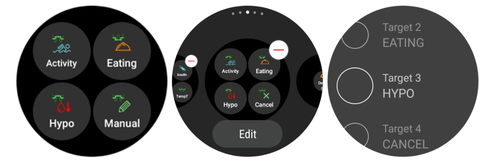

# 透過 Wear OS 智慧型手錶操作 AAPS

(Watchfaces-aaps-watchfaces)=

## AAPS 手錶外觀

```{warning}
AAPS 錶盤適用於 API 等級 28 至 33 的 Wear OS 智慧型手錶。
Wear OS 5 的更改限制了錶盤：僅可使用複雜功能。
```

AAPS Wear APK 的基礎版本中包含多種手錶外觀供選擇。 這些手錶外觀包括平均變化量、IOB、目前的臨時基礎速率和基礎設定檔，以及 CGM 資料圖。

手錶外觀上一些可用的操作：

* 雙擊血糖以進入 AAPS 選單
* 雙擊血糖圖表可更改圖表的時間尺度

## 設定

在[組態建置工具](../SettingUpAaps/ConfigBuilder.md)中啟用 Wear 模組。

使用 Wear 偏好設定定義在透過手錶計算注射時應考慮的變數（例如 15 分鐘趨勢、COB...）。

如果你想要透過手錶進行注射等操作。 那麼在「Wear 設置」中需要啟用「從手錶進行控制」。


透過 Wear 標籤或選單（螢幕左上角的選單圖示，如果標籤未顯示）你可以

* 重新發送所有資料。 如果手錶在一段時間內未連接，可能會有所幫助，並且你想將資訊推送至手錶。
* 直接從手機上打開手錶的設置。

確保手錶上未封鎖來自 AAPS 的通知。 確認操作（例如注射、臨時目標）會透過通知進行，你需要滑動並勾選。

## J - 活性胰島素（來自注射 | 來自基礎速率）

進入 AAPS 主選單

* 雙擊你的血糖值
* 在手錶應用程式選單中選擇 AAPS 圖示
* 點擊 AAPS 複雜功能（如果已配置選單）

## 設置（在 Wear 手錶上）

要進入手錶外觀設置，進入 AAPS 主選單，上滑並選擇「設置」。

實心星星表示啟用狀態（**開**），空心星星圖示表示該設置已停用（**關**）：


### AAPS 配套參數

* **注射時震動**（預設`開`）：
* **動作單位**（預設`mg/dl`）：如果**開**，動作單位為`mg/dl`，如果**關**，單位為`mmol/l`。 設定 TT 時使用。

(Watchfaces-watchface-settings)=

### 手錶外觀設置

* **顯示日期**（預設`關`）：注意，並非所有手錶外觀都支援日期顯示
* **顯示 IOB**（預設`開`）：是否顯示 IOB 值（詳細值設置在 AAPS wear 參數中）
* **顯示 COB**（預設`開`）：是否顯示 COB 值
* **顯示 Delta**（預設`開`）：是否顯示過去 5 分鐘的血糖變化
* **顯示平均 Delta**（預設`開`）：是否顯示過去 15 分鐘的血糖平均變化
* **顯示手機電池**（預設`開`）：手機電池百分比。 低於 30% 時顯示為紅色。
* **顯示 Rig 電池**（預設`關`）：Rig 電池是手機電池、幫浦電池和傳感器電池的綜合結果（通常顯示最低的值）。
* **顯示基礎速率**（預設`開`）：是否顯示目前的基礎速率（以 U/h 顯示，或如果是臨時基礎速率則以 % 顯示）
* **顯示循環狀態**（預設`開`）：顯示自上次循環運作以來的分鐘數（如果超過 15 分鐘，數值周圍的箭頭變為紅色）。
* **顯示 血糖**（預設`開`）：是否顯示最近的血糖值
* **顯示方向箭頭**（預設`開`）：是否顯示血糖趨勢箭頭
* **顯示經過時間**（預設`開`）：顯示自上次讀取以來的分鐘數。
* **深色背景**（預設`開`）：你可以將黑色背景切換為白色背景（除了 Cockpit 和 Steampunk 手錶外觀）
* **高亮基礎速率**（預設`關`）：提高基礎速率和臨時基礎速率的可見性
* **匹配分隔線**（預設`關`）：對於 AAPS、AAPSv2 和 AAPS（大）手錶外觀，顯示分隔線的對比背景（**關**）或匹配分隔線與背景顏色（**開**）。
* **圖表時間範圍**（預設`3 小時`）：你可以在子選單中選擇圖表的最大時間範圍，從 1 小時到 5 小時。

### 用戶界面設置

* **輸入設計**：使用此參數，你可以選擇「+」和「-」按鈕的位置訊息，當你為 AAPS 輸入指令（TT、胰島素、碳水化合物...）時使用。


### 特定手錶外觀參數

#### Steampunk 手錶外觀

* **Delta 精度**（預設`中等`）


#### Circle WF

* **大字體**（預設`關`）：增加字體大小以提高可見性
* **環狀歷史**（預設`關`）：以灰色環在小時的綠色環內圖形顯示血糖歷史紀錄
* **輕環狀歷史**（預設`開`）：以更深的灰色顯示較不顯眼的環狀歷史
* **動畫效果**（預設`開`）：如果啟用，且手錶支援並非處於省電低解析度模式時，手錶外觀的圓形會有動畫效果。

### 指令設置

* **主選單嚮導**（預設`開`）：允許在主選單中使用嚮導介面從手錶輸入碳水化合物並設置注射量
* **主選單注射前充填**（預設`關`）：允許從手錶進行注射前充填/填充操作
* **單一目標**（預設`開`）：
  
  * `開`：你設置一個單一的 TT 值
  * `關`：你設置低目標和高目標的 TT 值

* **嚮導百分比**（預設`關`）：允許從嚮導進行注射校正（在確認通知前以百分比輸入值）

(Watchfaces-complications)=

## 複雜功能

*複雜功能* 是傳統製錶術中的術語，描述的是手錶主錶盤的附加功能 - 例如另一個小窗或副表盤（顯示日期、星期、月相等）。 Wear OS 2.0 將此隱喻引入，允許自訂資料提供者（例如天氣、通知、健身計數器等）新增到支援複雜功能的任何手錶外觀中。

AAPS Wear OS 應用程式自 build `2.6` 開始支援複雜功能，並允許支援複雜功能的第三方手錶外觀配置顯示與 AAPS 相關的資料（如血糖值與趨勢、IOB、COB 等）。

複雜功能也可作為 AAPS 功能的 **快捷方式**。 點擊他們可以打開與 AAPS 相關的選單和對話框（具體取決於複雜功能類型和配置）。


### 複雜功能類型

AAPS Wear OS 應用程式僅提供根據預定義格式的原始資料。 第三方手錶外觀決定如何及在哪裡呈現複雜功能，包括其佈局、邊框、顏色和字體。 在眾多 Wear OS 複雜功能類型中，AAPS 使用以下類型：

* `短文本` - 包含兩行文本，每行 7 個字元，有時稱為值和標籤。 通常呈現在一個圓圈或小 POD 中 - 一行在另一行下方或並排顯示。 這是一個空間非常有限的複雜功能。 AAPS 試圖移除不必要的字符以適應：透過四捨五入數值、去除值中的前導和尾隨零等方式。
* `長文本` - 包含兩行文本，每行大約 20 個字元。 通常呈現在一個矩形或長 POD 中 - 一行在另一行下方顯示。 用於顯示更多詳情和文本狀態。
* `範圍值` - 用於顯示預定範圍內的值，例如百分比。 他包含圖示和標籤，通常以圓形進度表盤呈現。
* `大圖像` - 自訂背景圖像，可用作手錶外觀的背景（如果手錶外觀支援）。

### 複雜功能設置

要將複雜功能添加到手錶外觀，請長按並點擊下方的齒輪圖示進行配置。 根據具體手錶外觀的配置方式 - 可以點擊佔位符或進入複雜功能設置選單。 AAPS 複雜功能歸類在 AAPS 選單項目下。

在配置手錶外觀上的複雜功能時，Wear OS 會顯示並篩選適合放置在選定複雜功能位置的列表。 如果列表中找不到特定的複雜功能，可能是由於該類型不適用於該位置。

### AAPS 提供的複雜功能

AAPS 提供以下複雜功能：


* **基礎速率、COB 和 IOB**（`短文本`，打開*選單*）：顯示第一行的*基礎速率*，第二行顯示*活性碳水化合物化合物*和*活性胰島素*。
* **血糖**（`短文本`，打開*選單*）：顯示第一行的*血糖*值和*趨勢箭頭*，第二行顯示*測量時間*和*血糖變化量*。
* **COB 和 IOB**（`短文本`，打開*選單*）：顯示第一行的*活性碳水化合物化合物*，第二行顯示*活性胰島素*。
* **COB 詳細訊息**（`短文本`，打開*嚮導*）：顯示第一行的目前活動*活性碳水化合物化合物*，第二行顯示計劃中的（未來的，eCarbs）碳水化合物。
* **COB 圖示**（`短文本`，打開*嚮導*）：顯示帶有靜態圖示的*活性碳水化合物化合物*值。
* **完整狀態**（`長文本`，打開*選單*）：顯示所有資料：第一行顯示*血糖*值和*趨勢箭頭*、*血糖變化量*及*測量時間*。 第二行顯示*活性碳水化合物化合物*、*活性胰島素*和*基礎速率*。
* **完整狀態（反轉）**（`長文本`，打開*選單*）：與標準的*完整狀態*顯示相同資料，但行順序相反。 可用於忽略`長文本`中一行的手錶外觀。
* **IOB 詳細訊息**（`短文本`，打開*注射*）：顯示第一行的總*活性胰島素*，第二行顯示*注射*和*基礎速率*部分的 IOB。
* **IOB 圖示**（`短文本`，打開*注射*）：顯示帶有靜態圖示的*活性胰島素*值。
* **上傳裝置/手機電池**（`範圍值`，打開*狀態*）：顯示 AAPS 手機（上傳裝置）報告的電池百分比。 顯示為百分比儀表盤，並顯示反應報告值的電池圖示。 他可能不會即時更新，但會在其他重要的 AAPS 資料更改時更新（通常是每次~5 分鐘新的*血糖*測量時）。

此外，還有三種`大圖像`類型的複雜功能：**深色桌布**、**灰色桌布**和**淺色桌布**，顯示靜態 AAPS 桌布。

### 與複雜功能相關的設置

* **複雜功能點擊操作** （預設`預設`）：決定當用戶點擊複雜功能時打開的對話框： 
  * *預設*：與複雜功能類型相關的動作*（見上方列表）*
  * *選單*：AAPS 主選單
  * *嚮導*：注射嚮導 - 注射計算機
  * *注射*：直接輸入注射值
  * *eCarb*：eCarb 配置對話框
  * *狀態*：狀態子選單
  * *無*：停用 AAPS 複雜功能的點擊操作
* **複雜功能中的 Unicode**（預設`開`）：當`開`時，複雜功能將使用 Unicode 字符來顯示圖示，如`Δ`（變化量）、`⁞`（垂直點分隔符）或`⎍`（基礎速率圖示）。 他們的渲染取決於字體，這可能非常特定於手錶外觀。 如果自訂手錶外觀使用的字體不支援這些圖示，則可以將此選項設置為`關`，以避免圖形故障。

(WearOsSmartwatch-wear-os-tiles)=

## Wear OS Tiles(資訊方塊)

Wear OS Tiles 提供用戶快速查看資訊和操作的便捷方式。 這些 Tiles 僅在運作 Wear OS 版本 2.0 及更高版本的 Android 智慧型手錶上可用。

Tiles 允許你快速查看 AAPS 應用程式中的操作，而無需透過手錶外觀選單。 Tiles 是可選的，並且可以由用戶自行添加和配置。

Tiles 與任何手錶外觀「並存」使用。 這些Tiles會在所有錶面的旁邊。 啟用後，透過從手錶外觀向左滑動即可查看 Tiles。

請注意：這些Tiles並不顯示 AAPS 手機應用程式的實際狀態，他們僅會發出請求，該請求必須在手錶上確認後才會生效。

## 如何添加 Tiles

在使用 Tiles 之前，你必須在 Android APS 的「Wear OS」設置中打開「從手錶控制」。


根據你的 Wear OS 版本、品牌和智慧型手機，有兩種啟用 Tiles 的方式：

1. 在你的手錶上，從你的錶盤開始； 
  * 向右滑到左，直到你看到“+ 添加小工具” 
  * 選擇其中一個小工具。
2. 在手機上打開手錶原廠的應用程式。 
  * 對於三星，打開“Galaxy Wearable”，或對於其他品牌，打開“Wear OS”
  * 點擊「Tiles」部分，然後點擊「+ 添加」按鈕
  * 通過選擇來找到你喜歡的 AAPS 小工具來添加。 
  * 小工具的順序可以通過拖放來改變

你可以透過長按 Tile 並點擊「編輯」或「齒輪圖示」按鈕來自訂 Tiles 的內容。

### APS（操作）Tile

操作 Tile 可以包含 1 到 4 個用戶自訂的操作按鈕。 要進行配置，長按 Tile，這將顯示配置選項。 類似的操作也可以透過標準的手錶選單進行。

操作 Tile 支援的操作可以向 AAPS 手機應用程式發出請求：

* **計算**；根據碳水化合物輸入和可選的百分比[1]進行注射計算
* **胰島素**；透過輸入胰島素單位請求注射
* **治療**；請求注射並添加碳水化合物
* **碳水化合物**；添加（延長的）碳水化合物
* **臨時目標**；設置自訂臨時目標和持續時間


[1] 透過 Wear OS 選單，將「計算機百分比」選項設置為「開」，以便在注射計算機中顯示百分比輸入。 預設百分比是根據手機設定在「首頁總覽」部分的 [「傳送這部分的注射嚮導結果 %」](#Preferences-deliver-this-part-of-bolus-wizard-result) 當使用者未提供百分比時，將使用手機的預設值。 透過手機應用程式的「偏好設定」-「嚮導設置」配置注射計算機的其他參數。

### AAPS（臨時目標）Tile

臨時目標 Tile 可以根據 AAPS 手機預設請求臨時目標。 通過手機應用程式設定配置預設時間和目標，前往"偏好設定"、"首頁總覽"，["預設臨時目標"](#Preferences-default-temp-targets)，並為每個預設設置持續時間和目標。 透過 Tile 設置配置在 Tile 上可見的操作。 長按 Tile 以顯示配置選項並選擇 1 到 4 個選項：

* **運動**；適用於運動
* **低血糖**；在低血糖治療期間提高目標
* **即將進餐**；降低目標以增加活性胰島素
* **手動**；設置自訂臨時目標和持續時間
* **取消**；停止目前的臨時目標



### AAPS(快速嚮導)Tile

快速嚮導圖磚可以容納1到4個快速嚮導動作按鈕，這些按鈕由手機應用程式[2]定義。 請參閱 [快速嚮導](#Preferences-quick-wizard)。 你可以設定標準餐點（碳水化合物及注射計算方式）依據一天中的時間顯示在圖磚上。 非常適合用於一天中最常食用的餐點/點心。 你可以指定快速嚮導按鈕是否會顯示在手機、手錶或兩者。 請注意，手機一次只能顯示一個快速嚮導按鈕。 快速嚮導設置還可以指定注射的自訂胰島素百分比。 自訂百分比可讓你變化，例如點心 120%、緩慢吸收的早餐 80% 和低血糖處理用糖點心 0%


[2] Wear OS 將圖磚更新頻率限制為每30秒一次。 當你發現手機上的變更未反應在圖磚上時，請考慮：等待30秒，使用 AAPS 的 Wear OS 區段中的“重新發送所有資料”按鈕，或刪除並重新添加圖磚。 要更改快速嚮導按鈕的順序，將項目向上或向下拖動。

## 永遠開啟

對於 Android Wear OS 智慧型手錶來說，長時間的電池續航力是一個挑戰。 有些智慧型手錶最多可以持續使用30小時再充電。 螢幕在不使用時應關閉以達到最佳節電效果。 大多數手錶支援“永遠開啟”螢幕顯示。

自 AAPS 版本3開始，我們可以在永遠開啟模式下使用“簡化 UI”。 此 UI 只包含血糖值、方向和時間。 此 UI 已經過電力優化，更新頻率較低，顯示較少的資訊，並減少點亮的像素數，以節省 OLED 螢幕上的電量。

簡化 UI 模式適用於以下錶盤：AAPS、AAPS V2、Home Big、Digital Style、Steampunk 和 Cockpit。 簡化 UI 是可選的，並透過錶盤設定進行配置。 （長按錶盤並點擊“編輯”或齒輪圖示）選擇配置“簡化 UI”並將其設為“永遠開啟”或“永遠開啟且充電中”。

### 夜間模式

在充電期間，若能在夜間保持螢幕“永遠開啟”並顯示你的血糖值會非常有用。 然而，標準錶盤過於明亮，資訊太多，而且在困倦的狀態下很難閱讀細節。 因此，我們在配置中新增了一個選項，讓錶盤在充電期間可以簡化 UI。

簡化 UI 模式適用於以下錶盤：AAPS、AAPS V2、Home Big、Digital Style、Steampunk 和 Cockpit。 簡化 UI 是可選的，並透過錶盤設定進行配置。 （長按錶盤並點擊“編輯”或齒輪圖示）選擇配置“簡化 UI”並將其設為“充電期間”或“永遠開啟且充電中”

Android 開發者選項允許你的手錶在充電期間保持喚醒狀態。 若要啟用開發者選項，請參閱[官方文件](https://developer.android.com/training/wearables/get-started/debugging)。 在開發者選項中，將“充電時保持喚醒”設置為“開啟”。

注意：並非所有螢幕都能很好地處理永遠開啟功能。 這可能會導致螢幕燒灼，特別是在較舊的 OLED 螢幕上。 手錶通常會調暗螢幕以防止燒灼；請查閱你的使用手冊、製造商或網路上的建議。


## 延後警報捷徑

可以建立一個捷徑來暫停 AAPS 的警報/鬧鐘。 透過手錶靜音更方便且比拿手機快。 注意：你仍然需要檢查手機上的警報訊息並相應處理，但可以稍後再檢查。 如果你的手錶有兩個按鈕，你可以將其中一個按鍵分配給`AAPS 延後警報`程式。

要在 Samsung Watch 4 上綁定按鈕，請前往`設定 > 進階功能 > 自訂按鈕 > 雙擊 > AAPS 延後警報`

### 暫停 xDrip

當你使用 xDrip 並將其安裝在手錶上時，'AAPS 延後警報' 捷徑也會暫停任何 xDrip 警報。

## 效能與電池壽命提示

Wear OS 手錶是非常耗電且又受限的裝置。 手錶機殼的尺寸限制了內置電池的容量。 即使硬體和軟體方面都有了最新的進展，Wear OS 手錶仍然需要每天充電。

如果電池續航時間短於一天（從黃昏到黎明），以下是一些排除問題的建議：

主要耗電區域包括：

* 螢幕顯示（對 LED 為背光，對 OLED 為全亮模式）
* 螢幕顯示
* 透過藍牙的無線通訊

由於我們不能在通訊效能上妥協（我們需要最新的資料）並且希望顯示最新的資料，因此大多數的優化可以在*顯示時間*區域中進行：

* 預設錶盤通常比從商店下載的自訂錶盤優化得更好。
* 最好使用在非活動/調暗模式下顯示較少資料的錶盤。
* 在使用其他小工具時要注意，像是第三方天氣小工具或其他從外部來源利用資料的小工具。
* 先從較簡單的錶盤開始。 一次添加一個小工具並觀察他們對電池壽命的影響。
* 嘗試為AAPS手錶面使用**深色**主題，以及[**匹配分隔符**](#watchface-settings)。 在 OLED 裝置上，這將限制點亮的像素數量並減少燒灼風險。
* 檢查 AAPS 預設錶盤與其他帶有 AAPS 小工具的錶盤在你的手錶上哪個效能更好。
* 在幾天內觀察不同的活動模式。 大多數手錶會因為抬腕查看、移動及其他使用相關的觸發事件而啟動螢幕顯示。
* 檢查影響效能的全局系統設定：通知、背光/活動顯示逾時、GPS 啟動時。
* 檢查[測試過的手機和手錶清單](#Phones-list-of-tested-phones)和[詢問社群](../GettingHelp/WhereCanIGetHelp.md)獲取其他使用者的經驗和報告的電池壽命。
* **我們無法保證錶盤或小工具上顯示的資料是最新的**。 最終，Wear OS 決定何時更新錶盤或小工具。 即使 AAPS 應用程式請求更新，系統也可能為了節省電池而延後或忽略更新。 當手錶電量不足時有疑慮時，請務必使用手機上的 AAPS 應用程式進行雙重檢查。

(Watchfaces-troubleshooting-the-wear-app)=

## 問題排除 Wear 應用程式：

* 有時候重新同步應用程式到手錶上是有幫助的，因為他本身的同步速度可能有點慢：Android Wear > 齒輪圖示 > 手錶名稱 > 重新同步應用程式。
* 在開發者選項中啟用 ADB 偵錯（手錶上），透過 USB 連線手錶，並在 Android Studio 中啟動 Wear 應用程式。
* 如果小工具不更新資料，首先檢查 AAPS 錶盤是否正常運作。

## 額外的 AAPS 自訂錶盤也可以使用

你可以在此下載由其他用戶建立的自訂錶盤 Zip 檔：

## 自己製作錶盤

如果您想建立自己的手錶面，請遵循[這裡的指導](../ExchangeSiteCustomWatchfaces/CustomWatchfaceReference.md)。

建立自訂錶盤後，你可以與其他人分享自己的**AAPS**自訂錶盤，將 zip 檔上傳至“ExchangeSiteCustomWatchfaces”資料夾，並透過 Pull Request 上傳到 Github。 在合併 Pull Request 時，文件團隊會提取 CustomWatchface.png 檔案，並在檔名前加上 Zip 檔案名稱作為前綴。