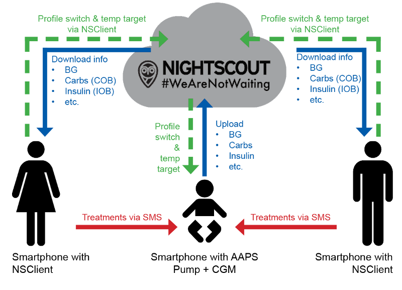

# 遠端監控

__AAPS__ 提供多項功能，用於遠端監控第一型糖尿病兒童，並且也支援遠端指令，可將操作指示遠端傳送至 __AAPS__。 同樣地，__AAPSClient__ 也可用於遠端監控，追蹤你伴侶或朋友的 __AAPS__。

## 功能

- 孩子的幫浦由孩子的手機透過 __AAPS__ 控制。
- 照護者可以在其 Android 智慧型手機上使用 **AAPSClient apk** 進行遠端追蹤，查看所有相關資料，例如血糖值、活性碳水化合物（COB）、活性胰島素（IOB）等。 在 __AAPS__ 中變更的設定會與 __AAPSClient__ 同步，反之亦然。
- 若已設定 xDrip 配套模式，照護者可在其 Android 智慧型手機上使用 **xDrip+ 追蹤者模式應用程式** 接收警報。
- 使用 [簡訊指令](../RemoteFeatures/SMSCommands.md) 遠端控制 __AAPS__，會以兩步驟驗證來保護安全。
- 僅當你的同步運作良好時，才建議透過 __AAPSClient__ 進行遠端控制（也就是不會出現不希望的資料變動，如自動修改臨時目標、臨時基礎率等）。更多詳情請參閱 [版本 2.8.1.1 的發行說明](#important-hints-2-8-1-1)。 然而，若使用者使用最新版本的 __AAPS__ 與 __AAPSClient，並搭配 NSClientv3/Nightscout15，發生同步問題的機率會較低。

## 遠端監控的工具和應用程式

- 網頁瀏覽器中的 [Nightscout](https://nightscout.github.io/)（主要用於資料顯示）
- __AAPSClient__ apk 是 __AAPS__ 的精簡版，能用於追蹤他人、進行 __設定檔切換__、設定 __臨時目標__，以及輸入碳水。 你可以下載兩個應用程式：[AAPSClient 及 AAPSClient2](https://github.com/nightscout/AndroidAPS/releases/)。 若照護者希望在同一支手機上安裝該 apk 兩次以追蹤兩位不同的人（例如兩位第一型糖尿病兒童，各自擁有自己的 Nightscout 帳號），則應使用 AAPSClient。
- 如果你使用的是原版 Dexcom 應用程式，你可以使用 Dexcom 追蹤應用程式（僅顯示血糖值）。
- [xDrip+](../CompatibleCgms/xDrip.md) 在追蹤模式（主要是血糖值和**警報**）
- 在 iOS 上使用 [Sugarmate](https://sugarmate.io/) 或 [Spike](https://spike-app.com/)（主要顯示血糖值和 **警報**）。
- 一些使用者發現 [TeamViewer](https://www.teamviewer.com/) 這樣的全遠端存取工具對於進行高階遠端問題排除非常有幫助。

## 智慧型手錶選項

智慧型手錶在協助以 __AAPS__ 管理第一型糖尿病孩童時，非常有幫助。 有幾種不同的選項可供選擇：

- 選項 1 - 若照護者的手機已安裝 __AAPSClient__，即可在與照護者手機連線的相容智慧型手錶上安裝 [AAPSClient WearOS 應用程式](https://github.com/nightscout/AndroidAPS/releases/)。 這將顯示目前的血糖、循環狀態，並允許輸入碳水、設定臨時目標與變更設定檔。 無法從 WearOS 應用程式進行注射。
- 選項 2 - 或者，可以建置並將 [AAPS WearOS 應用程式](../WearOS/WearOsSmartwatch.md) 安裝到相容的智慧型手錶上；該手錶連線到孩子的手機，但由家長佩戴。 這包括上述所有功能，並具有注射胰島素的能力。 如此一來，照護者無需將孩子隨身攜帶的手機取下，就能為其注射胰島素。

## 需考慮的事項

- 請考量主端與追蹤端之間可能的時間差，這來自上傳與下載所需時間，以及 __AAPS__ 主手機僅會在循環執行後才上傳的事實。
- 當遠端控制無法工作時，你的應急計劃是什麼（_例如_網絡問題或藍牙連線丟失）？  始終考慮當你突然無法發送新指令時，**AAPS** 會發生什麼情況。 **AAPS** 會使用目前設定覆蓋幫浦的基礎率、ISF 和 ICR。 如果切換到更強的胰島素設定，請只使用臨時設定切換（_例如_設置特定的持續時間），以防止遠端連線中斷。 當時間到期時，幫浦將恢復到原始設定。
