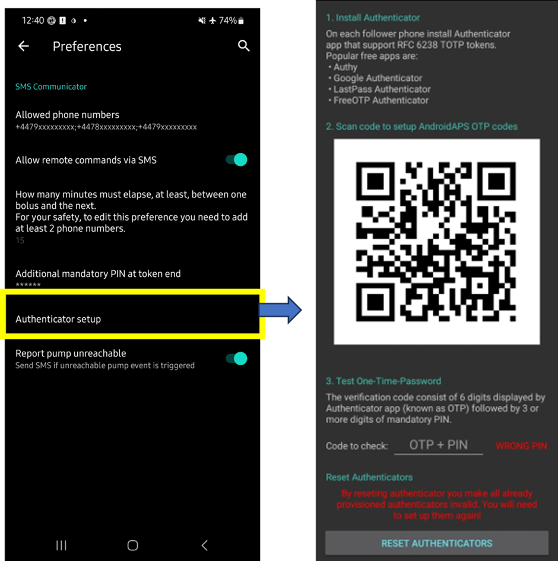
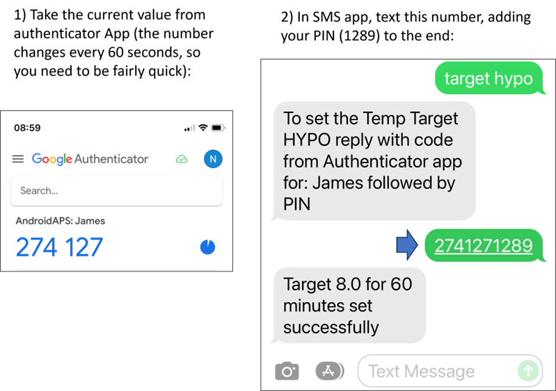

# SMS(簡訊) 指令

```{contents} Table of contents
:depth: 2
```

大部分臨時目標的調整，可透過具備網路連線的 Android 手機上的 [**AAPSClient** 應用程式](../RemoteFeatures/RemoteMonitoring.md) 來完成。 然而，透過 **AAPSClient** 無法進行注射，但你可以使用 SMS 指令。 如果你使用 iPhone 作為追蹤設備，因此無法使用 **AAPSClient** 應用程式，還有額外的 SMS 指令可用。

**SMS 指令非常有用於：**
1. 日常遠端控制

2. 如果你想遠端注射胰島素

3. 在網路訊號不佳的地區，文字訊息能夠傳送，而資料/網路訊號有限。 這在前往偏遠地區（例如露營、滑雪）時非常有用。

4. 如果你的其他遠端控制方法（Nightscout/AAPSClient）暫時無法使用

## 安全第一

如果你啟用 **SMS 通訊** 功能，請考慮設定為傳送遠端指令的手機可能會被竊取，或者被他人使用。 請務必用至少 PIN 碼鎖定你的手機。 強烈建議使用強密碼和/或生物識別鎖，並確保這與你的 APK 主密碼不同(即匯出 **AAPS** 設定所需的密碼)。

此外，建議允許使用 [第二個手機號碼](#SMSCommands-authorized-phone-numbers) 來發送 SMS 指令。 這樣，你可以使用第二個號碼來 [停用](#SMSCommands-other) SMS 通訊功能，以防主要遠端手機遭到入侵。

預設的兩次注射指令之間的最短延遲時間為 15 分鐘。 為了安全起見，你必須添加至少兩個授權電話號碼才能將此延遲時間縮短。 如果你嘗試在前一次注射後 15 分鐘內再次遠端注射，你將收到「無法遠端注射。請稍後再試」的回覆。 嘗試稍後再試

如果你傳送的遠端指令（如注射或更改設定檔）已執行，AAPS 也會透過簡訊通知你。 建議將其設置為至少傳送到兩個不同的手機號碼，以防其中一部接收手機被盜。

**如果你透過 SMS 指令進行注射，必須單獨輸入碳水化合物 (第二條 SMS, AAPSClient, Nightscout...)！** 如果不這樣做，IOB 將顯示正確但 COB 過低，可能導致未進行修正注射，因為 **AAPS** 假設你有過多的活性胰島素。

對於敏感指令，必須使用帶有基於時間的一次性密碼的身份驗證器應用程式來增加安全性。

如果你希望移除照護者手機發送 SMS 指令的能力，請在 **AAPS** 中使用緊急按鈕“[重置身份驗證器](#sms-commands-authenticator-setup)”，或發送 SMS 指令“[SMS 停止](#SMSCommands-other)”。 重置驗證器將使所有照護者的手機無效。 你需要重新設定他們。

## 設定 SMS 指令

```{contents} The overall process is as follows
:depth: 1
:local: true
```

### 身份驗證器設置

使用雙因素身份驗證來提高安全性。

在照護者手機上，下載(從 App Store 或 Google Play)並安裝一個身份驗證器應用程式。 常見的免費應用程式有：
  - [Authy](https://authy.com/download/)
  - Google 身份驗證器 - [Android](https://play.google.com/store/apps/details?id=com.google.android.apps.authenticator2) / [iOS](https://apps.apple.com/de/app/google-authenticator/id388497605)
  - [LastPass 身份驗證器](https://lastpass.com/auth/)
  - [FreeOTP 身份驗證器](https://freeotp.github.io/)

這些驗證器應用程式會生成一個時間限制的、一次性 6 位數密碼，類似於行動銀行或購物。 你也可以使用其他支援 RFC 6238 TOTP 權杖的驗證器應用程式。 Microsoft 驗證器無法使用。

### 檢查手機設定

在你的手機上，前往**應用程式 > AAPS > 權限**。 確保**簡訊** 和 **電話**已被允許。


### 日期與時間同步

兩部手機上的時間必須同步。 最佳做法是從網路自動設置。 時間差可能會導致身份驗證問題。

在 **AAPS** 手機和照護者手機上，檢查日期和時間是否已同步。 具體的操作方法取決於你的裝置，你可能需要嘗試不同的設定。

範例（針對 Samsung S23）： **設定 > 一般管理 > 日期和時間**：確保勾選了 **自動日期和時間**。

某些選項可能會被灰階化，這是因為手機設置為兒童帳戶，並需要透過家庭帳戶管理員啟用。 在照護者/父母的 iPhone 上，這個日期和時間設置稱為「自動設置」。 如果你不確定手機是否已同步，請不要擔心，你可以先設置簡訊指令，若發現問題可以再進行問題排除（如有需要請尋求幫助）。

### AAPS 設置

確認手機設定無誤後，在 **AAPS** 應用程式內，使用 [組態建置工具](../SettingUpAaps/ConfigBuilder.md) 啟用 **簡訊通訊模組**。

前往簡訊通訊的偏好設定。

啟用「允許透過 SMS 遠端指令」：


(SMSCommands-authorized-phone-numbers)=
#### 允許的電話號碼

輸入照護者的手機號碼。 包含國際區號，並且排除電話號碼的第一個「0」，如以下範例所示：
* 英國電話號碼：+447976304596
* 美國電話號碼：+11234567890
* 法國電話號碼：+33612344567
* _等。_

請注意，依據你所在的位置，電話號碼前的「+」號可能需要或不需要。 為了確定這一點，你可以傳送範例簡訊，以顯示在 SMS 通訊標籤中的接收格式。

如果你有多個手機號碼需要添加，請用分號分隔，並且**號碼之間不得有空格**（這點非常重要！）。 選擇「確定」：


#### 注射指令間的分鐘數

- 你可以定義透過 SMS 發送的兩次注射之間的最小間隔時間。
- 出於安全考慮，你必須添加至少兩個授權手機號碼來編輯此數值。

#### 令牌末尾的額外必需PIN碼

基於安全理由，回覆代碼必須接著一組 PIN。 選擇一組只有你（以及其他照護者）會在簡訊指令發送時使用的 PIN，作為驗證碼結尾。

PIN 碼要求如下：

* 3到6位數字
* 不得與相同的數字組合（_例如_ 1111 或 1224）相同
* 不得為連續數字（_例如_ 1234）


(sms-commands-authenticator-setup)=
#### 身份驗證器設置

* 遵循螢幕上的逐步說明。
* 在 _照護者的手機_ 上打開你安裝的驗證器應用程式，建立新的連線，並且
* 使用照護者手機掃描 **AAPS** 提供的 QR Code，當被要求時。
* 測試來自照護者手機的驗證器應用程式的一次性密碼，然後輸入你的 PIN：

範例：
* 驗證器應用程式生成的驗證碼為 457051
* 你的必須 PIN 碼為 2401
* 驗證碼：4570512401

如果輸入正確，紅色字體「WRONG PIN」將自動變為綠色「OK」。 **你無法按下任何按鈕！** 此過程已完成，輸入代碼後不需要再按「好」按鈕：



你現在已成功設定 SMS 指令。

如果你想刪除已配置的驗證器，請使用按钮“驗證器設置 > 重設驗證器”。 （透過重置身份驗證器，你將使所有已註冊的身份驗證器無效。 你需要重新配置它們。）

## 簡訊指令使用

### SMS 指令的初步操作

1) 要檢查你是否正確設置了一切，請從照護者手機以 SMS 簡訊輸入 “bg” 測試連線到 **AAPS** 手機。 你應該會收到如下的回應：


如果你沒有收到任何回應，請檢查下方的 [問題排除](#SMSCommands-troubleshooting) 區段。

2) 現在試試需要驗證器的簡訊指令，例如 “target hypo”。 照護者的手機會收到一條回覆簡訊，提示你輸入來自驗證器應用程式的**六位數驗證碼**，接著輸入 **只有照護者/跟隨者所知的額外秘碼 PIN**（總共十個數字的字串，假設你的 PIN 只有 4 位數）。

當你第一次嘗試發送 SMS 指令時，建議你在 **AAPS** 手機的面前進行，以查看其運作方式：



照護者的手機將收到來自 **AAPS** 的簡訊，以確認遠端簡訊指令是否已成功執行。

如果你的指令成功，你將收到一則確認回覆。 如果出現問題，你將收到錯誤訊息。 請參見下方的[問題排除](#SMSCommands-troubleshooting)以獲得常見錯誤。

**提示**：如果你將發送大量 SMS，則建議你手機方案中具有無限簡訊功能（對於每個使用的手機）。

### 透過 SMS 指令進行餐時注射

遠端注射胰島素 _只能_ 透過 **SMS 指令** 完成，無法透過 NightScout 或 AAPSClient 執行。 然而，碳水化合物可以透過這三種方法中的任何一種報告。 無法在一條 SMS 訊息中同時發送碳水化合物和胰島素指令。 這些指令必須分開發送，具體如下：

1) 發送胰島素注射指令（_例如_ 「bolus 2」將指令注射 2 單位的胰島素），透過 SMS 指令相當於在 **AAPS** 中使用「注射」圖示。 2) 發送碳水化合物指令（_例如_「carbs 20」將報告 20 克的碳水化合物）。 這相當於在 **AAPS** 中使用「碳水化合物」標籤。

為了避免低血糖，最好保守起見，注射 **少於** 按照你的碳水比率所需的胰島素，因為你沒有考慮目前的血糖數值或血糖趨勢。

**發送這些指令的順序很重要**。 如果你透過任何方式報告大量碳水化合物，並啟用了 SMB（超小注射），**AAPS** 可能會立即透過部分胰島素注射作出回應。 因此，如果你在報告碳水化合物後嘗試發送胰島素注射指令，你可能會遇到延遲並顯示「注射進行中」的訊息，你需要檢查已經執行的 SMB 注射。 或者，如果你沒有意識到正在進行 SMB 注射，並且你後續的注射也成功，則可能會為這頓飯過多注射胰島素。 因此，如果遠端控制餐時注射，請務必在報告碳水化合物 _之前_ 發送胰島素注射指令。 如果你願意，你可以將 Nightscout 與**AAPSClient**結合使用簡訊指令。 碳水化合物可從 Nightscout 傳送而無需任何驗證（請參見下方指示小節），因此比簡訊指令更迅速。

(SMSCommands-commands)=
## 指令

```{contents} List of command groups
:depth: 1
:local: true
```

指令必須以英文發送，回覆將使用你當地的語系，如果該回覆字符串已經[翻譯](#translations-translate-strings-for-AAPS-app)。 指令不區分大小寫，可以使用小寫或大寫字母。


下方的**簡訊指令表**顯示所有可能的簡訊指令。 給出了一些_範例值_來幫助暸解。 這些指令具有取自**AAPS**應用程式本身的相同可用值範圍（目標、百分比設定等）。

(authentication-or-not)=
### 是否需要驗證？

某些簡訊指令會立即回應，而某些指令則需要透過驗證器應用進行強驗證。 類似 “**BG**” 的簡單查詢（請求獲取當前血糖更新）非常快速，只需輸入，不需要驗證，並返回下方顯示的**AAPS**狀態信息：


某些需要更高安全性的指令需要輸入安全碼，例如：


下方表格中的*Auth*欄位指示每個命令是否需要此類強驗證。

### CGM 資料

| 指令         | 驗證 | 功能 & *回應*                                                                                    |
| ---------- | -- | -------------------------------------------------------------------------------------------- |
| BG         | 否  | 返回：最後血糖、變化、IOB（注射和基礎）、COB<br/>*最後血糖：5.6 4分前，變化：-0.2 mmol，IOB：0.20U（注射：0.10U 基礎：0.10U）* |
| CAL 5.6/90 | 是  | 將 CGM 確認值設為 5.6/90<br/>(使用適合你血糖單位的值)<br/>僅在**AAPS**設定正確的情況下工作。<br/>*已發送標定* |

### 幫浦

| 指令                   | 驗證 | 功能 & *回應*                                                                      |
| -------------------- | -- | ------------------------------------------------------------------------------ |
| 幫浦                   | 否  | 最後連線：1 分鐘前<br/>暫時：0.00U/h @11:38 5/30分鐘<br/>IOB：0.5U 遺留：34U 電池：100 |
| PUMP DISCONNECT *30* | 是  | 在 *30* 分鐘內中斷幫浦                                                                 |
| PUMP CONNECT         | 是  | 幫浦已重新連線                                                                        |

### 基礎率

| 指令                | 驗證 | 功能 & *回應*              |
| ----------------- | -- | ---------------------- |
| BASAL 0.3         | 是  | 開始基礎注射 0.3U/h 持續 30 分鐘 |
| BASAL 0.3 20      | 是  | 開始基礎注射 0.3U/h 持續 20 分鐘 |
| BASAL 30%         | 是  | 開始基礎注射 30% 持續 30 分鐘    |
| BASAL 30% 50      | 是  | 開始基礎注射 30% 持續 50 分鐘    |
| BASAL STOP/CANCEL | 是  | 停止臨時基礎注射               |


### 循環

| 指令                | 驗證 | 功能 & *回應*                                                                                                     |
| ----------------- | -- | ------------------------------------------------------------------------------------------------------------- |
| LOOP STATUS       | 否  | 反應依賴於實際狀態：<br/> - *當循環關閉時，循環已停用*或 LGS<br/> - *當循環開啟或閉合時，循環已啟用*<br/> - *暫停 (10 分鐘)*當循環被中斷或暫停 |
| LOOP STOP/DISABLE | 是  | 幫浦將恢復到預設的基礎注射速率。<br/>*循環已被停用*                                                                           |
| LOOP START/ENABLE | 是  | *循環已啟用*                                                                                                       |
| LOOP SUSPEND 20   | 是  | *循環暫停 20 分鐘*                                                                                                  |
| LOOP RESUME       | 是  | *循環已恢復*                                                                                                       |
| LOOP CLOSED       | 是  | *當前循環模式：閉合循環*                                                                                                 |
| LOOP LGS          | 是  | *當前循環模式：低血糖暫停*                                                                                                |

### 注射

在最後一次注射指令或遠端指令後 15 分鐘內（此值僅在添加兩個手機號碼時可編輯）不允許進行遠端注射！ 在此情況下，回應為 *遠端注射無法使用。 稍後再試。* 此回應也會在幫浦當前正在進行注射時發送。

| 指令                   | 驗證 | 功能 & *回應*                                                                          |
| -------------------- | -- | ---------------------------------------------------------------------------------- |
| BOLUS 1.2            | 是  |                                                                                    |
| BOLUS 0.60 MEAL      | 是  | 輸送指定的 0.60U 注射<br/>**並** 設定 [即將用餐臨時目標](#TempTargets-eating-soon-temp-target) |
| CARBS 5              | 是  | 輸入 5g，無需注射                                                                         |
| CARBS 5 17:35/5:35PM | 是  | 在 17:35 輸入 5g。<br/>可接受的時間格式依賴於<br/>手機上的時間設定 (12 小時/24 小時)。             |
| EXTENDED 2 120       | 是  | 開始延長注射 2U，持續 120 分鐘。<br/>僅限於 [相容的幫浦](#screens-action-tab)。                   |
| EXTENDED STOP/CANCEL | 是  | 停止延長注射                                                                             |

### 設定檔

| 指令             | 驗證 | 功能 & *回應*                                                               |
| -------------- | -- | ----------------------------------------------------------------------- |
| PROFILE STATUS | 否  | 當前個人設定與百分比                                                              |
| PROFILE LIST   | 否  | 當前 **AAPS** 中的個人設定列表，例如：<br/>1. 個人設定1<br/> 2. 個人設定2         |
| PROFILE 1      | 是  | 切換到列表中的個人設定 1。<br/>使用由 **個人設定列表** 返回的數字，<br/>而不是你儲存的個人設定名稱。 |
| PROFILE 2 30   | 是  | 切換到個人設定2 30%                                                            |

### Temporary Targets

| 指令                        | 驗證 | 功能 & *回應*        |
| ------------------------- | -- | ---------------- |
| TARGET MEAL/ACTIVITY/HYPO | 是  | 設置臨時目標 餐點/活動/低血糖 |
| TARGET STOP/CANCEL        | 是  | 取消臨時目標           |


(SMSCommands-other)=
### 其他

| 指令                 | 驗證 | 功能 & *回應*                                                                                       |
| ------------------ | -- | ----------------------------------------------------------------------------------------------- |
| TREATMENTS REFRESH | 否  | 從 NS 重新整理治療                                                                                     |
| NSCLIENT RESTART   | 否  | 如果你注意到與 Nightscout 或 **AAPSClient** 的通訊問題，這將很有幫助。                                               |
| SMS DISABLE/STOP   | 否  | 要停用 SMS 遠端服務，請回覆代碼 Any。<br/>請注意，你可以直接從 **AAPS** 主智慧型手機重新啟用該服務。                            |
| HELP               | 否  | 返回所有可查詢的功能：<br/>BG、循環、治療等。<br/>發送進一步的 ***協助 ***功能****** 命令以列出<br/>此區域內所有可用選項。 |
| HELP BOLUS         |    | *注射 1.2<br/>注射 1.2 餐前*                                                                    |

(SMSCommands-troubleshooting)=
## 疑難排解與常見問題

```{contents} List of questions and issues
:depth: 1
:local: true
```

### 我們 _不能_ 使用 SMS 命令做什麼？

1)  **你無法設置 _臨時_ 個人設定開關**（例如，設置「運動個人設定」持續 60 分鐘），雖然你可以永久切換至「運動個人設定」。 臨時檔案切換可以透過 Nightscout 或 AAPSClient 進行設置。

2)  **你無法取消自動化** 或 **設置用戶自定義目標**，但有些近似解決方案： 比如，假設正常的個人設定目標是 5.5。 你在 AAPS 中設置了自動化，每天下午 2:30 至 3:30 間將目標設為 7.0，以便學校的運動課程使用，並且自動化條件是「不存在臨時目標」。 這周，你收到通知說運動課程取消，改為比薩餅聚餐，但你的孩子已經在學校，身上帶著 **AAPS** 手機。 如果自動化開始的高臨時目標為 7.0，而你取消它（在 **AAPS** 手機或遠端），則自動化的條件依然滿足，而 **AAPS** 將立即在一分鐘後重新設置高目標。

**如果你可以查看 AAPS 手機**，你可以取消或修改自動化，或者，如果你不想這樣做，你可以在動作標籤中設置一個新的 5.6 的臨時目標 60 分鐘，或按下目標標籤來設置。 這樣可以防止自動化設置 7.0 的高目標。

**如果你無法查看 AAPS 手機**，可以使用 SMS 指令作為大致解決方案：例如，使用指令「target meal」設置 45 分鐘的 5.0 目標（其他預設目標為 8.0 用於運動或低血糖，見表）。 然而，使用 SMS 指令無法指定 _特定_ 的目標值（例如 60 分鐘的 5.6），這需要使用 **AAPSClient** 或 Nightscout。

### 如果我改變對我剛發送的命令的想法，會發生什麼？

**AAPS** 只會執行最近發送的指令。 因此，如果你輸入「bolus 1.5」，然後未經驗證就發送了新指令「bolus 1」，他將忽略先前的 1.5 指令。 **AAPS** 會始終向照護者手機發送回覆，確認 SMS 指令內容，然後提示你輸入驗證碼，並在執行後發送回覆。

### 為什麼我沒有收到 SMS 命令的回覆？

可能是以下原因之一：

1) 訊息未到達手機（網絡問題）。 2) **AAPS** 還在處理請求（_例如_ 注射，根據注射速率，可能需要一些時間來執行）。 3)  當命令接收時， **AAPS** 手機與幫浦的藍牙連接不佳，命令執行失敗（這通常會在 **AAPS** 手機上產生警報）。

### 短信命令完全沒有回覆

在看護者手機和/或 **AAPS** 手機上，請嘗試停用以下選項：
* **作為聊天訊息發送** 
* 如果使用 Android 訊息應用程序或 Google 訊息應用程序，請停用 RCS 訊息：
  - 打開 Messages 中的特定 SMS 對話
  - 選擇右上角的選項省略號
  - 選擇「詳細訊息」
  - 啟用「僅發送 SMS 和 MMS 訊息」 

### 執行命令時出錯

指令可能無法成功的幾個原因如下：

* SMS 指令設置不完整或不正確
* 你發送了一個格式不正確的命令（例如“中斷連線幫浦 45”而不是“幫浦中斷連線 45”）
* 你使用了不正確或過期的驗證碼（通常建議等幾秒鐘以獲取新碼，如果當前碼即將過期）
* 代碼+PIN 是正確的，但 SMS 發送/接收的延遲導致 **AAPS** 計算出驗證碼已過期
* **AAPS** 手機與幫浦超出範圍/無法聯繫
* 系統正忙於執行注射操作

常見錯誤的範例如下所示：


### 一旦命令經過驗證，我該如何停止該命令？

不可以。 但是，你可以透過在 **AAPS** 手機的注射彈出窗口中快速取消來停止 SMS 發送的注射。 除了注射和碳水化合物報告外，許多 SMS 指令可以輕鬆撤銷，或透過某些操作來減輕錯誤的影響。

例如，對於注射和碳水化合物報告中的錯誤，你仍然可以採取行動。 例如，如果你宣佈了 20g 的碳水化合物，但你的孩子只吃了 10g，而你（或在場的照護者）無法直接在 **AAPS** 手機中刪除這個治療，你可以設置一個較高的臨時目標，或設置一個較低的設定檔，讓 **AAPS** 較不積極。

### 多條簡訊

如果你重複收到相同的訊息（例如設定檔切換），你可能無意間與其他應用程式建立了循環狀態。 例如可能是 xDrip+。 如果是這樣，請確保 xDrip+（或任何其他應用程式）沒有將治療資料上傳到 NightScout。

如果其他應用程式安裝在多部手機上，請確保在所有手機上停用上傳功能。

### 我收到的 SMS 命令過多。 我可以減少頻率或停止這些簡訊嗎？

使用 SMS 命令可能會產生大量來自 **AAPS** 手機發送到看護者手機的自動訊息。 例如，如果你在 **AAPS** 中設置了自動化，你也會收到“幫浦中的基礎率設定已更新”這類訊息。 如果要發送大量 SMS，擁有不限次數的 SMS 配額可能會很有用，並且對所有手機停用 SMS 通知、警報或震動。 使用 SMS 指令時，無法避免接收到這些更新。 因此，你可能需要另一種與孩子直接溝通的方式（如果他們年齡夠大），而不是使用 SMS。 常見的 **AAPS** 照護者會使用的替代通訊應用程式包括 Whatsapp、Lime、Telegram 和 Facebook Messenger。