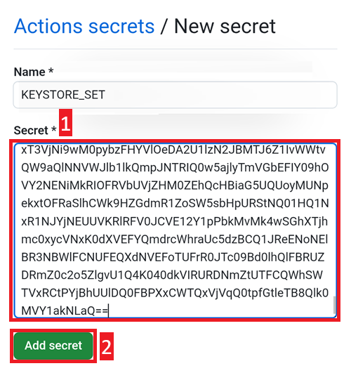

- - -
orphan: true
- - -

### 打開 aaps-ci-preparation.html 檔案

使用 File Manager+ 打開您上面下載的檔案 `aaps-ci-preparation-html`。

選擇下載。

並搜尋這個檔案，點擊它以打開，選擇使用 Chrome 打開，然後點擊僅一次。

將會這樣打開。

選擇生成 JKS。 下方的欄位將填入字元。

保持此頁面開啟。

### 在 GitHub 中建立一個新的「secret」

返回您的 GitHub 瀏覽器頁面：您自己的 AndroidAPS 複製版。

1. 右上角，點擊 `...` 按鈕
2. 在列表中選擇設定

向下捲動到安全性並選擇「secrets and variables」。

現在選擇動作

向下捲動到儲存庫「secret」並點擊「New repository secret」

您將看到此對話框（如果不顯示，請向下捲動）。

保持此頁籤頁如這樣開啟。

切換到 File Explorer Plus 頁籤。

點擊上方的複製按鈕。

切換回 GitHub 頁籤。

在名稱欄位中，貼上您剛才複製的文字。 在文字框上長按以顯示「貼上」選單。

切換到 File Explorer Plus 頁籤。

點擊第二個複製按鈕。

切換回 GitHub 頁籤。

1. 在「secret」」欄位中，貼上您剛才複製的文字。 在文字框上長按以顯示「貼上」選單。

2. 點擊「Add secret」。

檢查欄位是否已經添加，向下捲動來確認。

