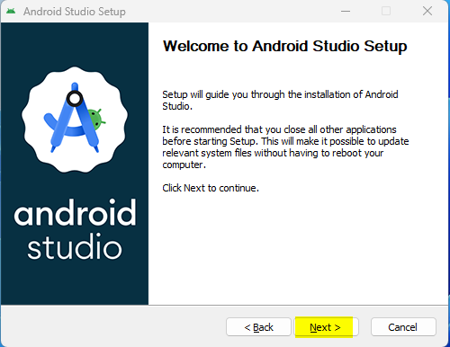
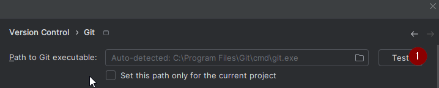

# 建置AAPS

## 自行建置，而不是下載

**由於醫療設備的相關規範，AAPS應用程式（apk檔案）無法下載。 你可以合法地建置應用程式供自己使用，但不得將副本提供給他人！**

請參閱[常見問題頁面](../UsefulLinks/FAQ.md)以獲得詳細資訊。

(建置APK推薦的電腦規格)=

## 建置AAPS所需的電腦和軟體規格

- 請使用\*\*[至少為 Hedgehog (2023.1.1) 或更近期版本如 Iguana、Jellyfish、Koala 或 Ladybug 的 Android Studio 版本](https://developer.android.com/studio/)\*\*來建立 apk。 舊版本的Android Studio需要先更新！
- 不支援[Windows 32位系統](../GettingHelp/TroubleshootingAndroidStudio#unable-to-start-daemon-process)。 請記住，**64位CPU和64位作業系統是必備條件。** 如果你的系統不符合此條件，你需要更換硬體或軟體，或更換整個系統。

<table class="tg">
<tbody>
  <tr>
    <th class="tg-baqh">作業系統（僅限64位）</th>
    <td class="tg-baqh">Windows 8或更高版本</td>
    <td class="tg-baqh">Mac OS 10.14或更高版本</td>
    <td class="tg-baqh">任何支援Gnome、KDE或Unity DE的Linux;&nbsp;&nbsp;GNU C Library 2.31或更新版本</td>
  </tr>
  <tr>
    <th class="tg-baqh"><p align="center">CPU（僅限64位）</th>
    <td class="tg-baqh">x86_64 CPU架構；第二代Intel Core或更新版本，或支援<a href="https://developer.android.com/studio/run/emulator-acceleration#vm-windows" target="_blank" rel="noopener noreferrer"><span style="text-decoration:var(--devsite-link-text-decoration,none)">Windows Hypervisor</span></a>的AMD CPU</td>
    <td class="tg-baqh">ARM架構晶片，或支援<a href="https://developer.android.com/studio/run/emulator-acceleration#vm-mac" target="_blank" rel="noopener noreferrer"><span style="text-decoration:var(--devsite-link-text-decoration,none)">Hypervisor.Framework</span></a>的第二代Intel Core或更新版本</td>
    <td class="tg-baqh">x86_64 CPU架構；第二代Intel Core或更新版本，或支援AMD虛擬化（AMD-V）和SSSE3的AMD處理器</td>
  </tr>
  <tr>
    <th class="tg-baqh"><p align="center">記憶體</th>
    <td class="tg-baqh" colspan="3"><p align="center">8GB或更多</td>
  </tr>
  <tr>
    <th class="tg-baqh"><p align="center">硬碟</th>
    <td class="tg-baqh" colspan="3"><p align="center">至少30GB的可用空間。 建議使用SSD。</td>
  </tr>
  <tr>
    <th class="tg-baqh"><p align="center">解析度</th>
    <td class="tg-baqh" colspan="3"><p align="center">1280 x 800 最低要求<br></td>
  </tr>
  <tr>
    <th class="tg-baqh"><p align="center">網際網路</th>
    <td class="tg-baqh" colspan="3"><p align="center">寬頻</td>
  </tr>
</tbody>
</table>

**強烈建議（非必須）使用SSD（固態硬碟）而非HDD（硬碟），因為這將減少建置AAPS apk檔案時所需的時間。** 你仍然可以在建置 **AAPS** apk檔案時使用HDD。 如果這樣做，建置過程可能需要很長時間才能完成，但開始後，你可以讓他無需監控地執行。

## 建置過程中的幫助與支援

如果您在構建 **AAPS** 應用的過程中遇到困難，請參閱專門的[**Android Studio 故障排除**](../GettingHelp/TroubleshootingAndroidStudio)部分，請首先參考該部分。

如果您認為建構指示中的某些內容是錯誤的、缺失的或令人困惑的，或者您仍然遇到困難，請聯繫其他**AAPS**使用者群組，在 [Facebook](https://www.facebook.com/groups/AndroidAPSUsers) 或 [Discord](https://discord.gg/4fQUWHZ4Mw)。 如果您想自己更改某些內容（更新螢幕截圖等），請提交[拉取請求（PR）](../SupportingAaps/HowToEditTheDocs.md)。

## 建置AAPS應用程式的逐步指南

```{admonition} WARNING
:class: warning
如果您之前已經構建過AAPS，那麼您不需要再次執行以下所有步驟。
請直接跳至[更新指南](../Maintenance/UpdateToNewVersion.md)!
```

建置 **AAPS** apk檔案的整體步驟如下：

4.1 [安裝 Git](#install-git-if-you-dont-have-it)

4.2 [安裝 Android Studio](#install-android-studio)

4.3 [下載 AAPS 代碼](#download-the-aaps-code)

4.4. [在 Android Studio 偏好設定中設置 Git 路徑](#set-git-path-in-android-studio-preferences)

4.5. [建置 AAPS "簽名" apk](#build-the-aaps-signed-apk)

在本指南中，你將看到建置 **AAPS** apk檔案的_示例_螢幕截圖。 由於 **Android Studio**——我們用來建置 **AAPS** apk 的軟體——會定期更新，這些截圖可能與你的安裝不完全相同，但他們仍應該可以參照進行。

由於 **Android Studio** 可在Windows、Mac OS X和Linux平台上運作，這些平台之間的步驟可能也會有些許差異。

(Install-Git)=

### 安裝Git（如果你還沒有安裝）

```{admonition} Why Git? 
:class: dropdown

Git 被稱為「_版本控制系統_」（VCS）。
Git 是一個允許你追蹤代碼變更和與他人合作的程式。你將使用 Git 從 GitHub 網站將 **AAPS** 原始碼的副本複製到你本地計算機。然後，你將在你的計算機上使用 Git 來建置 **AAPS** 應用程式 (apk)。
```

#### 安裝Git的步驟

1. 檢查你是否已安裝 **Git**。 您可以通過在 Windows 搜尋列中輸入“git”來完成此操作—如果您看到\*\*“Git bash”\*\*或其他形式的 Git，則它已安裝，您可以直接進入[安裝 Android Studio](#install-android-studio)：


2. 如果您尚未安裝 Git，請從 [**這裡**](https://git-scm.com/downloads) 下載並安裝適用於您系統的最新版本。 任何最新的Git版本都應該可以使用，請根據你的系統選擇正確的版本，無論是Mac、Windows還是Linux。

**給Mac用戶的提示：** Git網頁還將指導你安裝名為“homebrew”的附加程式，以輔助安裝。 如果你透過homebrew安裝Git，則無需更改任何偏好設定。

(Make_a_note_of_Git_path)=

- 在安裝過程中，當要求你“選擇安裝位置”時，請記下Git的安裝位置（即“**安裝路徑**”），你需要在下一步中檢查他。 安裝路徑可能類似於“C:\Program Files\Git\cmd\git.exe”

- 在進行Git安裝的幾個步驟時，只需接受所有的預設選項。

- 安裝完成後，如果你忘記記錄Git的安裝位置，可以透過以下方式找到他：在PC的搜索欄中輸入“git”，右鍵點擊“Git bash”，選擇“打開檔案位置”，將滑鼠懸停在“Git bash”圖示上，這將顯示安裝位置。

- 在進行下一步之前，重新啟動你的電腦。

(Building-APK-install-android-studio)=

### 安裝Android Studio

- **在以下步驟中，你必須始終保持線上狀態，因為Android Studio會下載多個更新。**

```{admonition} What is Android Studio?
:class: dropdown
Android Studio 是一個在你的計算機上運行的程式。他允許你從互聯網下載原始碼（使用 Git）並建立智慧型手機（和智慧手錶）應用程式。通過在你的 PC 上建置新的或更新的應用程式，你不會「破壞」可能在智慧型手機上運行的目前循環版本的 **AAPS**，這些是完全獨立的過程。
```

安裝Android Studio時最重要的一點是 **耐心！** 安裝和設置期間，Android Studio會下載大量內容，這需要時間。

任何版本的 Android Studio，如 Hedgehog 或任何更新的版本都是合適的。 使用 Ladybug 版本時，您可能需要多執行一步，但這是可以完成的！

```{admonition} Different UI
:class: warning
導入注意事項：Android Studio 在最近的版本中改變了其用戶介面。此指南將向您展示在「Ladybug」中的*新用戶介面*的步驟。如果您仍在使用舊的用戶介面，您可能想要先按照[這些指示](NewUI)將 Android Studio 更改為新的用戶介面。
```

下載[目前版本的 Android Studio](https://developer.android.com/studio)或從[**舊版存檔**](https://developer.android.com/studio/archive)下載一個舊版本，並接受下載協議。


下載完成後，啟動下載的應用程序以在您的計算機上安裝它。
您可能需要接受/確認一些有關從 Windows 下載的應用程序的警告！

透過點擊「下一步」來安裝 Android Studio，如以下屏幕截圖所示。 您**不需要**更改任何設定！




現在點擊「安裝」：


完成後，點擊「下一步」


在最後一步，點擊「完成」來首次啟動 Android Studio。


系統將詢問您是否希望幫助改善 Android Studio。 根據自己的喜好選擇選項，這不會影響接下來的步驟。


歡迎畫面歡迎您安裝 Android Studio。 按「下一步」。


選擇「標準」作為安裝類型。


通過再次點擊「下一步」來確認設定。


現在您需要接受許可協議。 左側有兩個區域（1 + 3），您需要逐一選擇並在右側各選擇「接受」（2 + 4）。

然後可以點擊「完成」(5) 按鈕。


某些 Android 套件現在將被下載和安裝。 請耐心等待。

當這一切完成後，您將看到以下畫面，可以再次選擇「完成」。


您現在將看到 Android Studio 的歡迎畫面。


(Building-APK-download-AAPS-code)=

### 下載AAPS程式碼

```{admonition} Why can it take a long time to download the AAPS code?
:class: dropdown

第一次下載**AAPS**時，Android Studio 將通過互聯網連接到 Github 網站下載**AAPS**的原始代碼。這大約需要 1 分鐘。

然後 Android Studio 將使用**Gradle**（一種用於 Android 應用的開發工具）來識別在您的計算機上構建這些項目所需的其他組件。
```

在Android Studio歡迎頁面上，檢查左側是否突出顯示了“**專案**”（1）。

然後點擊右側的“**從VCS獲取**”（2）：


我們現在將告訴Android Studio從哪裡獲取程式碼：


- “倉庫URL”應該在左側（1）預設選擇。

- “Git”應作為版本控制預設選擇（2）。

- 現在複製這個URL：
  ```
  https://github.com/nightscout/AndroidAPS.git
  ```
  然後將其粘貼到URL文本框中（3）。

- 檢查保存複製代碼的（預設）目錄在您的計算機上存在，並且該目錄尚未存在（4）。 You can change it to some directory, but please remember where you stored it!

- 現在點擊“複製”按鈕（5）。

```{admonition} INFORMATION
:class: information
請注意目錄。他是存儲原始碼的位置！
```

你現在將看到一個螢幕，告訴你倉庫正在被複製：


在某個時候，Android Studio 將關閉並重新啟動。 系統可能會詢問您是否希望信任該專案。 點擊“信任專案”：


僅限Windows用戶：如果你的防火牆要求許可，請授予存取權限：


倉庫成功複製後，Android Studio將打開複製的專案。

(NewUI)=

```{admonition} New UI
:class: information
Android Studio 最近更改了其介面。新的 Android Studio 安裝預設使用新的介面！

如果您的 Android Studio 看起來不同，您可能需要切換到新的介面：
點擊左上角的漢堡選單，然後選擇 **設定**（或在蘋果電腦上選擇 **偏好設定**）。
在 **外觀與行為** 中，前往 **新介面** 並勾選 **啟用新介面**。然後重新啟動 Android Studio 以開始使用它。

如果您找不到 **新介面** 的選項，不用擔心：您已經在使用它！
```

當 Android Studio 開啟時，耐心等待（這可能需要幾分鐘），特別是 **不要** 按照彈出通知更新專案。

Android Studio 將自動開始進行 "Gradle 專案同步"，這將需要幾分鐘才能完成。 您可以看到它（仍然）在運行：


```{admonition} NEVER UPDATE GRADLE!
:class: warning

Android Studio 可能會建議更新 gradle 系統。**請絕對不要更新 gradle!** 因為這將會導致一些問題發生。
```

僅限於 Windows 電腦：您可能會收到關於 Windows 防火牆運行的通知：點擊 **自動** 並確認，這將使建置速度更快！


您可以讓 Gradle 同步運行，同時已經可以追隨下一步。

(Building-APK-set-git-path-in-preferences)=

### 在 Android Studio 偏好設定中設置 Git 路徑

現在我們將告訴 Android Studio 尋找 Git 之處，您[早先](#install-git-if-you-dont-have-it)已安裝它。

- 僅限 Windows 使用者：確保您在[安裝 Git](#install-git-if-you-dont-have-it)後已重新啟動計算機。 如果尚未重開電腦，請現在重啟並重新打開 Android Studio

在 **Android Studio** 的左上角，打開漢堡選單，然後導航至 **檔案** > **設定**（在 Windows 上）或 **Android Studio** > **偏好設定**（在 Mac 上）。
這將打開以下視窗，點擊展開名為 **版本控制** 的下拉選單（1），並選擇 **Git**


檢查 **Android Studio** 是否能自動找到正確的 **Git 執行檔路徑**，方法是點擊 "測試" 按鈕（1）：



如果自動設置成功，你目前版本的 **Git** 將顯示在路徑旁邊。


如果您發現 **git.exe** 無法自動找到，或者點擊 "測試" 出現錯誤（1），您可以

- 手動輸入您[早先](#steps-for-installing-git)儲存的路徑，或
- 點擊資料夾圖示 (1) 並手動導航到**git.exe**安裝的目錄[早先](#steps-for-installing-git)
- 使用 **測試** 按鈕驗證您的設定！

  

(Building-APK-generate-signed-apk)=

### 建置AAPS“簽章”APK

```{admonition} Why does the AAPS app need to be "signed"?
:class: dropdown

Android 要求每個應用程式都必須 _簽名_，以確保其只能從同一信任來源後續更新。欲了解更多資訊，請遵循 [此連結](https://developer.android.com/studio/publish/app-signing.html#generate-key)。 

就我們的目的而言，這只是意味著我們生成一個簽名或 "金鑰庫" 檔案，並在建置 **AAPS** 應用程式時使用它。
```

**重要：務必確保 Gradle 同步成功完成後再繼續！**

點擊左上角的漢堡選單以打開選單欄。
選擇 **建構**（1），然後選擇 **生成簽名的應用包或 APK**（2）


選擇“APK”而不是“Android App Bundle”，然後點擊“下一步”：


在下一個螢幕上，確保“模組”設置為“AAPS.app”（1）。

(Building-APK-wearapk)=

```{admonition} INFORMATION!
:class: information
如果您想為您的手錶建立 APK，您現在需要選擇 AAPS.wear！
```


點擊“建立新...” (2) 開始建立你的密鑰庫。

```{admonition} INFORMATION!
:class: information
您只需生成金鑰庫一次。
如果您之前建構過 AAPS，請不要建立新的金鑰庫，而是選擇您已有的並輸入其密碼！
```

**_注意：_** 密鑰庫是一個用於存儲應用程式簽章訊息的檔案。 他是加密的，並且訊息透過密碼進行保護。


- 點擊 "文件夾" 符號（1）以選擇您電腦上金鑰庫的路徑。

  請 **不要** 使用您存放原始碼的目錄，而是選擇一個您也能傳輸到另一台電腦的目錄。

```{admonition} WARNING!
:class: warning
確保記下你的密鑰庫存儲的位置。在你建置下一個 AndroidAPS 更新時，你將需要他！
```

- 現在選擇一個簡單的密碼（並記下來），在密碼框中輸入它（2），並確認（2）。

  密鑰庫和密鑰的密碼不必過於複雜。 如果您在未來遺失密碼，請參見[遺失金鑰存儲的故障排除](../GettingHelp/TroubleshootingAndroidStudio#lost-keystore)。

- 密鑰的預設別名（3）為“key0”，保持不變。

- 你現在需要為你的密鑰設置密碼。 為了簡單起見，你可以使用與上面密鑰庫相同的密碼。 輸入一個密碼（4）並確認之。

```{admonition} WARNING!
:class: warning
請記下這些密碼！在你建立下一個 AAPS 更新時，會需要他們！
```

- 預設有效期為 25 年，可以保持原樣。

- 輸入您的名字和姓氏（5）。 不需要添加其他任何資訊，但您可以自由地補充（6-7）。

- 點擊“確定”（8）繼續：

在 **生成簽名的應用包或 APK** 頁面上，現在將顯示您的金鑰庫路徑。 現在重新輸入金鑰庫密碼（1）和密鑰密碼（2），並勾選方框（3）以記住密碼，這樣您在下次建構 APK 時（即升級到新的 AAPS 版本時）就不需要再次輸入。 點擊“下一步”（4）：


在下一個螢幕上，選擇建構變體 "fullRelease"（2），然後點擊 "建立"（3）。 您應該記住在（1）顯示的目錄，因為稍後您會在那裡找到生成的 APK 檔案！


Android Studio現在將開始建置 **AAPS** 的apk。 它會在右下角顯示 "Gradle 建構正在運行"（2）。 這個過程需要一些時間，取決於您的電腦和網路連接，所以 **請耐心等候！** 如果您想觀看建構進度，請點擊 Android Studio 底部的小鐵鎚 "建構"（1）：


現在你可以查看建置進度：


Android Studio在建置完成後將顯示“BUILD SUCCESSFUL”的訊息。 你可能會看到一個彈出通知，你可以點擊選擇“查找”。 如果您錯過了這一點，請點擊通知圖示（1），然後在螢幕最底部點擊 **定位**（2）以顯示通知：


_如果建置不成功，請參考[Android Studio 故障排除部分](../GettingHelp/TroubleshootingAndroidStudio)。_

在通知欄中，點擊藍色連結“定位”：


您的檔案管理器將開啟並顯示您剛才建置的 apk 檔案。


恭喜！ 現在您已經建置完成 **AAPS** 的 apk 檔案，接下來您將把這個檔案轉移到您的智慧型手機。

進入[傳輸和安裝 **AAPS**](../SettingUpAaps/TransferringAndInstallingAaps.md)的下一階段。
