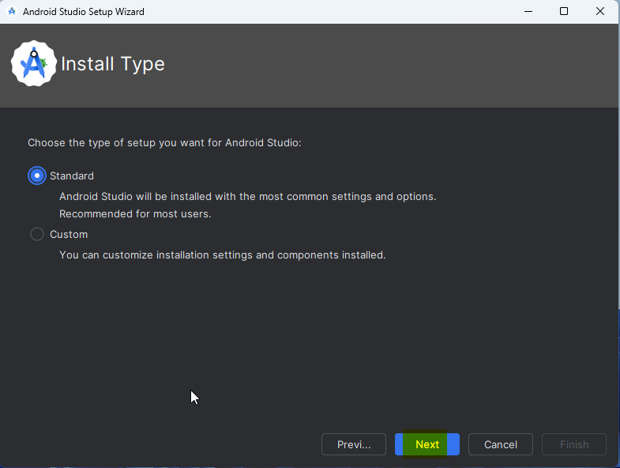
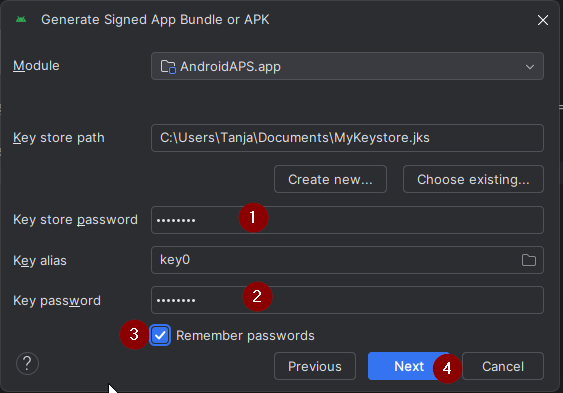
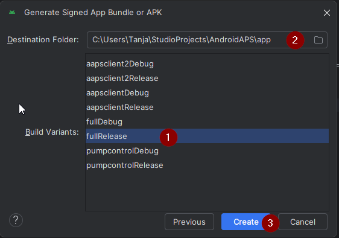
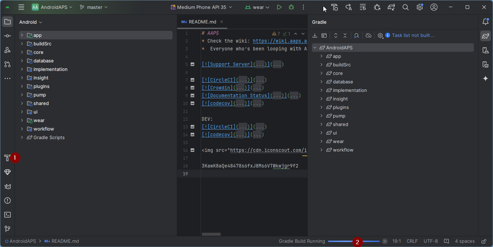

# 建置AAPS

## 自行建置，而不是下載

**The AAPS app (an apk file) is not available for download, due to regulations around medical devices. 自行建置應用程式以供個人使用是合法的，但你不得將副本提供給他人！**

詳細資訊請參閱 [FAQ 頁面](../UsefulLinks/FAQ.md)。


(建置APK推薦的電腦規格)=
## 建置AAPS所需的電腦和軟體規格

* Please use the **[Android Studio version called at least Hedgehog (2023.1.1) or one more recent like Iguana, Jellyfish, Koala or Ladybug](https://developer.android.com/studio/)** to build the apk. 舊版本的Android Studio需要先更新！
* [Windows 32-bit systems](../GettingHelp/TroubleshootingAndroidStudio#unable-to-start-daemon-process) are not supported by Android Studio. Please keep in mind that both **64 bit CPU and 64 bit OS are mandatory condition.** If your system DOES NOT meet this condition, you have to change affected hardware or software or the whole system.

<table class="tg">
<tbody>
  <tr>
    <th class="tg-baqh">作業系統（僅限64位）</th>
    <td class="tg-baqh">Windows 8或更高版本</td>
    <td class="tg-baqh">Mac OS 10.14或更高版本</td>
    <td class="tg-baqh">任何支援Gnome、KDE或Unity DE的Linux;&nbsp;&nbsp;GNU C Library 2.31或更新版本</td>
  </tr>
  <tr>
    <th class="tg-baqh"><p align="center">CPU（僅限64位）</th>
    <td class="tg-baqh">x86_64 CPU架構；第二代Intel Core或更新版本，或支援<a href="https://developer.android.com/studio/run/emulator-acceleration#vm-windows" target="_blank" rel="noopener noreferrer"><span style="text-decoration:var(--devsite-link-text-decoration,none)">Windows Hypervisor</span></a>的AMD CPU</td>
    <td class="tg-baqh">ARM架構晶片，或支援<a href="https://developer.android.com/studio/run/emulator-acceleration#vm-mac" target="_blank" rel="noopener noreferrer"><span style="text-decoration:var(--devsite-link-text-decoration,none)">Hypervisor.Framework</span></a>的第二代Intel Core或更新版本</td>
    <td class="tg-baqh">x86_64 CPU架構；第二代Intel Core或更新版本，或支援AMD虛擬化（AMD-V）和SSSE3的AMD處理器</td>
  </tr>
  <tr>
    <th class="tg-baqh"><p align="center">記憶體</th>
    <td class="tg-baqh" colspan="3"><p align="center">8GB或更多</td>
  </tr>
  <tr>
    <th class="tg-baqh"><p align="center">硬碟</th>
    <td class="tg-baqh" colspan="3"><p align="center">至少30GB的可用空間。 建議使用SSD。</td>
  </tr>
  <tr>
    <th class="tg-baqh"><p align="center">解析度</th>
    <td class="tg-baqh" colspan="3"><p align="center">1280 x 800 Minimum <br></td>
  </tr>
  <tr>
    <th class="tg-baqh"><p align="center">網際網路</th>
    <td class="tg-baqh" colspan="3"><p align="center">寬頻</td>
  </tr>
</tbody>
</table>

**It is strongly recommended (not mandatory) to use SSD (Solid State Disk) instead of HDD (Hard Disk Drive) because it will take less time when you are building the AAPS apk file.**  You can still use a HDD when you are building the **AAPS** apk file. 如果這樣做，建置過程可能需要很長時間才能完成，但開始後，你可以讓他無需監控地執行。

## 建置過程中的幫助與支援

If you run into difficulties in the process of building the **AAPS** app, there is a dedicated [**troubleshooting Android Studio**](../GettingHelp/TroubleshootingAndroidStudio) section, please consult that first.


If you think something in the building instructions is wrong, missing or confusing, or you are still struggling, please reach out to other **AAPS** users group on [Facebook](https://www.facebook.com/groups/AndroidAPSUsers) or [Discord](https://discord.gg/4fQUWHZ4Mw). If you want to change something yourself (updating screenshots _etc_), please submit a [pull request (PR)](../SupportingAaps/HowToEditTheDocs.md).

## 建置AAPS應用程式的逐步指南

```{admonition} WARNING
:class: warning
If you have built AAPS before, you don't need to take all the following steps again.
Please jump directly to the [update guide](../Maintenance/UpdateToNewVersion.md)!
```

The overall steps for building the **AAPS** apk file are as follows:

4.1 [Install Git](#install-git-if-you-dont-have-it)

4.2 [Install Android Studio](#install-android-studio)

4.3 [Download AAPS code](#download-the-aaps-code)

4.4. [Set Git path in Android Studio preferences](#set-git-path-in-android-studio-preferences)

4.5. [Build AAPS "signed" apk](#build-the-aaps-signed-apk)


In this guide you will find _example_ screenshots of building of **AAPS** apk file. Because  **Android Studio** - the software which we use to build the **AAPS** apk - is regularly updated, these screenshots may not be identical to your installation, but they should still be possible to follow.

Since **Android Studio** runs on Windows, Mac OS X and Linux platforms, there might be also be minor differences in the steps for the different  platforms.

(Install-Git)=
### 安裝Git（如果你還沒有安裝）

```{admonition} Why Git? 
:class: dropdown

Git is known as a “_Versioning Control System_” (VCS).\
Git is a program that allows you to track changes in code and to collaborate with others. You will use Git to make a copy of the **AAPS** source code from the GitHub website to your local computer. Then, you will use Git on your computer to build the **AAPS** application (apk). 
```

#### 安裝Git的步驟

1.  Check that you don’t already have **Git** installed. You can do this by typing “git” in the Windows search bar – if you see **“Git bash”** or some other form of Git, it is already installed and you can go straight to [installing Android Studio](#install-android-studio):


2. If you don’t have Git installed, download and install the latest version for your system from the "Download" section on [**here**](https://git-scm.com/downloads). 任何最新的Git版本都應該可以使用，請根據你的系統選擇正確的版本，無論是Mac、Windows還是Linux。

**Note for Mac users:** the Git webpage will also guide you to install an additional program called "homebrew" to aid the installation. 如果你透過homebrew安裝Git，則無需更改任何偏好設定。

(Make_a_note_of_Git_path)=

* During the installation, when you are asked to "select destination location" make a note of _where_ Git is being installed (the "**installation path**") you will need to check it in the next step. 安裝路徑可能類似於“C:\Program Files\Git\cmd\git.exe”

*  在進行Git安裝的幾個步驟時，只需接受所有的預設選項。

*  安裝完成後，如果你忘記紀錄Git的安裝位置，可以透過以下方式找到他：在PC的搜索欄中輸入“git”，右鍵點擊“Git bash”，選擇“打開檔案位置”，將滑鼠懸停在“Git bash”圖示上，這將顯示安裝位置。

* 在進行下一步之前，重新啟動你的電腦。

(Building-APK-install-android-studio)=
### 安裝Android Studio

- **You have to be online all of the time during the following steps, as Android Studio downloads several updates**

```{admonition} What is Android Studio?
:class: dropdown
Android Studio is a program which runs on your computer. It allows you to download source code from the internet (using Git) and build smartphone (and smartwatch) apps. You cannot "break" a current, looping version of **AAPS** which you might have running on a smartphone by building a new or updated app on your PC with Android Studio, these are totally separate processes. 
```

One of the most important things when installing Android Studio is **be patient!** During installation and setup, Android Studio is downloading a lot of stuff which will take time.

任何版本的 Android Studio，如 Hedgehog 或任何更新的版本都是合適的。 使用 Ladybug 版本時，您可能需要多執行一步，但這是可以完成的！

```{admonition} Different UI
:class: warning
Import note: Android Studio changed its UI during the last releases. This guide will show you the steps with the *new UI* in "Ladybug". If you still use the older UI, you might want to change Android Studio to the new UI first following [these instructions](NewUI).
```

Download the [current version of Android Studio](https://developer.android.com/studio) or an older version from the [**Archives**](https://developer.android.com/studio/archive) and accept the download agreements.


下載完成後，啟動下載的應用程序以在您的計算機上安裝它。 您可能需要接受/確認一些有關從 Windows 下載的應用程序的警告！

透過點擊「下一步」來安裝 Android Studio，如以下屏幕截圖所示。 You do **not** need to change any settings!


現在點擊「安裝」：


完成後，點擊「下一步」


在最後一步，點擊「完成」來首次啟動 Android Studio。


系統將詢問您是否希望幫助改善 Android Studio。 根據自己的喜好選擇選項，這不會影響接下來的步驟。


歡迎畫面歡迎您安裝 Android Studio。 按「下一步」。


選擇「標準」作為安裝類型。



通過再次點擊「下一步」來確認設定。


現在您需要接受許可協議。 左側有兩個區域（1 + 3），您需要逐一選擇並在右側各選擇「接受」（2 + 4）。

然後可以點擊「完成」(5) 按鈕。


某些 Android 套件現在將被下載和安裝。 請耐心等待。

當這一切完成後，您將看到以下畫面，可以再次選擇「完成」。


您現在將看到 Android Studio 的歡迎畫面。


(Building-APK-download-AAPS-code)=
### 下載AAPS程式碼

```{admonition} Why can it take a long time to download the AAPS code?
:class: dropdown

The first time **AAPS** is downloaded, Android Studio will connect over the internet to the Github website to download the source code for **AAPS**. This should take about 1 minute. 

Android Studio will then use **Gradle** (a development tool for Android apps) to identify other components needed to build these items on your computer. 
```

On the Android Studio Welcome screen, check that "**Projects**" (1) is highlighted on the left.

Then click "**Get from VCS**" (2) on the right:


我們現在將告訴Android Studio從哪裡獲取程式碼：


* “倉庫URL”應該在左側（1）預設選擇。
* “Git”應作為版本控制預設選擇（2）。
* 現在複製這個URL：
    ```
    https://github.com/nightscout/AndroidAPS.git
    ```
    然後將其粘貼到URL文本框中（3）。

* 檢查保存複製代碼的（預設）目錄在您的計算機上存在，並且該目錄尚未存在（4）。 您可以將其更改為某個目錄，但請記得您放置的位置!
* 現在點擊“複製”按鈕（5）。

```{admonition} INFORMATION
:class: information
Make a note of the directory. It is where your sourcecode is stored!
```

你現在將看到一個螢幕，告訴你倉庫正在被複製：


在某個時候，Android Studio 將關閉並重新啟動。 系統可能會詢問您是否希望信任該專案。 點擊“信任專案”：

  


僅限Windows用戶：如果你的防火牆要求許可，請授予存取權限：

 

倉庫成功複製後，Android Studio將打開複製的專案。

(NewUI)=
```{admonition} New UI
:class: information
Android Studio changed its UI recently. New installations of Android Studio use the new UI by default!

Only if your Android Studio looks different, you might need to switch to the new UI:
Click on the hamburger menu on the top left, then select **Settings** (or **Preferences** on Apple computers).
In **Appearance & Behaviour**, go to **New UI** and tick **Enable new UI**. Then restart Android Studio to start using it.

If you don't find the option **New UI** don't worry: you are already using it!
```


When Android Studio opened, wait patiently (this may take a few minutes), and particularly, **do not** update the project as suggested in the pop-up.

Android Studio 將自動開始進行 "Gradle 專案同步"，這將需要幾分鐘才能完成。 您可以看到它（仍然）在運行：


```{admonition} NEVER UPDATE GRADLE!
:class: warning

Android Studio might recommend updating the gradle system. **Never update gradle!** This will lead to difficulties.
```

Only on windows computers: You might get a notification about windows defender running: Click on **Automatically** and confirm, it will make the build run faster!


您可以讓 Gradle 同步運行，同時已經可以追蹤下一步。

(Building-APK-set-git-path-in-preferences)=
### 在 Android Studio 偏好設定中設置 Git 路徑

Now we will tell Android studio where to find Git, which you installed [earlier](#install-git-if-you-dont-have-it).

* Windows users only: Make sure you have restarted your computer after [installing Git](#install-git-if-you-dont-have-it). 如果尚未重開電腦，請現在重啟並重新打開 Android Studio

In the top left corner of **Android Studio**, open the hamburger menu and navigate to **File** > **Settings** (on Windows) or **Android Studio** > **Preferences** (on Mac). This opens the following window, click to expand the dropdown called **Version Control** (1) and select **Git**


Check if **Android Studio** can automatically locate the correct **Path to Git executable** automatically by clicking the button "Test" (1):


If the automatic setting is successful, your current version of **Git** will be displayed next to the path.

   


If you find that **git.exe** is not found automatically, or that clicking "Test" results in an error (1), you can either
* manually enter the path which you saved [earlier](#steps-for-installing-git), or
* click on the folder icon (1) and manually navigating to the directory where **git.exe** was installed [earlier](#steps-for-installing-git)
* Verify your settings with the **Test** button!

  

(Building-APK-generate-signed-apk)=
### 建置AAPS“簽章”APK

```{admonition} Why does the AAPS app need to be "signed"?
:class: dropdown

Android requires each app to be _signed_, to ensure that it can only be updated later from the same trusted source that released the original app. For more information on this topic, follow [this link](https://developer.android.com/studio/publish/app-signing.html#generate-key). 

For our purposes, this just means that we generate a signing or "keystore" file and use it when we build the **AAPS** app.
```


**Important: Make sure the gradle sync is finished successfully before proceeding!**


點擊左上角的漢堡選單以打開選單欄。 Select **Build** (1), then select **Generate Signed App Bundle / APK** (2)


選擇“APK”而不是“Android App Bundle”，然後點擊“下一步”：


在下一個螢幕上，確保“模組”設置為“AAPS.app”（1）。

(Building-APK-wearapk)=
```{admonition} INFORMATION!
:class: information
如果您想為您的手錶建立 APK，您現在需要選擇 AAPS.wear！
```


點擊“建立新...” (2) 開始建立你的密鑰庫。

```{admonition} INFORMATION!
:class: information
You will only need to create the keystore once.
If you have build AAPS before, do NOT create a new keystore but select your existing one and enter its passwords!
```

**_Note:_** The key store is a file in which the information for signing the app is stored. 他是加密的，並且訊息透過密碼進行保護。


* 點擊 "文件夾" 符號（1）以選擇您電腦上金鑰庫的路徑。

  Do **not** use the directory where you stored your sourcecode but some directory that you would also transfer to a new computer.

```{admonition} WARNING!
:class: warning
Make sure to note down for yourself where your keystore is stored. You will need it when you build the next AndroidAPS update!
```

* 現在選擇一個簡單的密碼（並記下來），在密碼框中輸入它（2），並確認（2）。

  密鑰庫和密鑰的密碼不必過於複雜。 If you lose your password in the future, see [troubleshooting for lost key store](../GettingHelp/TroubleshootingAndroidStudio#lost-keystore).

* 密鑰的預設別名（3）為“key0”，保持不變。

* 你現在需要為你的密鑰設置密碼。 為了簡單起見，你可以使用與上面密鑰庫相同的密碼。 輸入一個密碼（4）並確認之。

```{admonition} WARNING!
:class: warning
Note down these passwords! You will need them when you build the next AAPS update!
```

* 預設有效期為 25 年，可以保持原樣。

* 輸入您的名字和姓氏（5）。 不需要添加其他任何資訊，但您可以自由地補充（6-7）。

* 點擊“確定”（8）繼續：


On the **Generate signed App Bundle or APK** page, the path to your keystore will now be displayed. 現在重新輸入金鑰庫密碼（1）和密鑰密碼（2），並勾選方框（3）以記住密碼，這樣您在下次建構 APK 時（即升級到新的 AAPS 版本時）就不需要再次輸入。 點擊“下一步”（4）：




在下一個螢幕上，選擇建構變體 "fullRelease"（2），然後點擊 "建立"（3）。 您應該記住在（1）顯示的目錄，因為稍後您會在那裡找到生成的 APK 檔案！

   

Android Studio will now build the **AAPS** apk. 它會在右下角顯示 "Gradle 建構正在運行"（2）。 The process takes some time, depending on your computer and internet connection, so **be patient!** If you want to watch the progress of the build, click on the small hammer "build" (1) at the bottom of Android Studio:



現在你可以查看建置進度：


Android Studio在建置完成後將顯示“BUILD SUCCESSFUL”的訊息。 你可能會看到一個彈出通知，你可以點擊選擇“查找”。 If you miss this, click on the notification icon (1) and then on **locate** (2) at the very bottom of the screen to bring up the Notifications:


_If the build was not successful, refer to the [Android Studio Troubleshooting section](../GettingHelp/TroubleshootingAndroidStudio)._

在通知欄中，點擊藍色連結“定位”：

 Your file manager will open and show you the build apk file that you have just built.

   

恭喜！ Now you have built the **AAPS** apk file, you will be transferring this file to your smartphone in the next section of the docs.

Move to the next stage of [Transferring and Installing **AAPS**](../SettingUpAaps/TransferringAndInstallingAaps.md).


