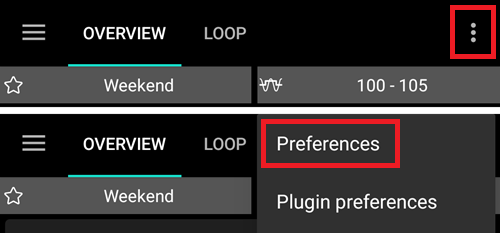

# 更改你的 AAPS 設定

完成**[設置嚮導](../SettingUpAaps/SetupWizard.md)**後，如果你只想更改 AAPS 的部分設定，就不需要再次執行整個嚮導。

有三種方式來更改 AAPS 的設定。 至於你選擇哪種方式，這只是個人偏好或方便性的問題，因為每種方式都將導向相同的設定選項。

如下所示：

1. 組態建置工具，
1. 右側的三個點選單，選擇「偏好設定」或
1. 右側的三個點選單，選擇「外掛偏好設定」。

在這裡我們解釋哪個選項對每種情況最方便：

## 組態建置工具

如果你想**啟用外掛**及其在頂層選單中的**可見性**，則需使用**組態建置工具**。 一旦啟用，**外掛**將始終運行，你可以決定是否要在上方選單中顯示它們。 停用的外掛無法變為可見。

你可以使用每個啟用外掛旁邊的齒輪來進入設定。

有關組態建置工具的文檔可在[這裡](../SettingUpAaps/ConfigBuilder.md)獲得。

## 偏好設定

可通過**AAPS**任意標籤的右上方 _三個點_選單進入**偏好設定**對話框。 這樣可以在同一位置更改**所有啟用外掛的設定**。

如果你不確定在哪裡尋找設定選項，這是一個不錯的方式，但如果你確定只想更改某一特定外掛的設定，那麼過程可能有點繁瑣。

偏好設定的文檔可在[這裡](../SettingUpAaps/Preferences.md)獲得。

## 外掛偏好設定

透過 **AAPS** 的主畫面右上方 _三個點_選單可以進入**外掛偏好設定**對話框。 這使得能夠更改**當前螢幕上的外掛設定**。

例如，如果你知道想要更改 BYODA 的設定，這是個不錯的方式。 然後，你可以在**AAPS**的上方選單中選擇「BYODA」標籤，並在 BYODA 頁面上，右上方選擇 _三個點_選單，然後選擇「外掛偏好設定」項目。 你將直接進入BYODA外掛的偏好設定對話框。

這是通往一般偏好設定對話框的「捷徑」，偏好設定的文檔可在[這裡](../SettingUpAaps/Preferences.md)查看。
