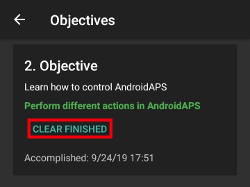

# 完成目標

**AAPS**有一系列需要完成的**目標**，以幫助用戶從基本的開放循環過渡到混合關閉循環和完整的**AAPS**功能。 完成**目標**旨在確保你：

* 在你的**AAPS**設置中正確配置了一切；
* 了解**AAPS**的基本功能；並且
* 對你的系統能做什麼有基本了解，以幫助在使用**AAPS**時建立信心。

當**AAPS**第一次安裝時，必須完成每一個目標才能進入下一個目標。 隨著進展，每個**目標**將逐漸解鎖新功能。

**目標 1 到 8**將指導你從在智慧型手機上配置**AAPS**到“基本”混合關閉循環。 這將需要大約 6 週的時間來完成。 你可以在使用虛擬幫浦的情況下繼續進行到**目標 5**（在此期間使用其他胰島素給藥方法）。 **目標 9 到 11**主要在測試更進階的**AAPS**功能，這是為了更好地控制你的糖尿病，完成的時間可達 3 個月，可能更長。 有關估計時間分解的進一步詳情可在這裡獲得：[設置所有內容需要多長時間？](#preparing-how-long-will-it-take)

在進行**目標**的過程中，如果需要，你還可以刪除進度並[返回早期的目標](#go-back-in-objectives)。

## 備份你的設定

```{admonition} Note
:class: note

建議在完成每個 **目標** 後匯出你的 **AAPS** 設定！
```

強烈建議你在完成每個目標後[匯出你的設定](../Maintenance/ExportImportSettings.md)，以避免在**AAPS**中遺失任何進度。 此匯出過程將創建一個**設定檔案**（.json），應在一個或多個安全的地方備份（例如 Google 雲端硬碟、硬碟、電子郵件附件_等_）。 這確保在**AAPS**中的任何進度都得到保存。 如果你的手機遺失或意外刪除進度，則可以通過匯入最近的設定檔案將 json 檔案重新載入到**AAPS**。 如果因任何原因需要新的**AAPS**智慧型手機（升級/遺失/損壞的手機_等_），也需要有備份的**設定檔案**。

此**設定**檔案將保存你在**目標**中的進度，以及你所有的**AAPS**設定，如**最大注射量**_等_。

如果你在未備份設定的情況下發生任何事情導致你的**AAPS**智慧型手機出現故障，則需要從頭開始重新開始**目標**。 通過**目標**的進展需要時間，因此因為丟失手機而不得不重新完成它們的情況最好避免。

(objectives-objective1)=
## 目標 1：設置可視化和監控，分析基礎率和比例

**目標 1**要求用戶在**AAPS**中設置基本技術配置。 在完成此步驟之前無法取得進展。

- 在 [組態建置工具 > 血糖來源](#Config-Builder-bg-source) 中選擇正確的 CGM/FGM。 詳情請見[BG來源](../Getting-Started/CompatiblesCgms.md)。
- 在 [組態建置工具 > 幫浦](../SettingUpAaps/ConfigBuilder.md) 中選擇正確的幫浦，以確保你的幫浦能夠與 **AAPS** 通訊。 如果你使用的幫浦模型沒有**AAPS**的循環驅動程式，或如果你想在使用其他胰島素給藥系統的同時完成早期**目標**，則選擇**虛擬幫浦**。 詳情請見[胰島素幫浦](../Getting-Started/CompatiblePumps.md)。
- 如果使用 Nightscout：
  - 請遵循[Nightscout](../SettingUpAaps/Nightscout.md)頁面中的說明，以確保**Nightscout**能接收和顯示**AAPS**資料。
  - 請注意，**NSClient**中的 URL 必須**_沒有_ "/api/v1/"**在末尾 - 請見[偏好設定 > NSClient](#Preferences-nsclient)。
- 如果使用 Tidepool：
  - 請遵循[Tidepool](../SettingUpAaps/Tidepool.md)頁面中的說明，以確保**Tidepool**能接收和顯示**AAPS**資料。

注意 - *你可能需要等待下一個傳感器的血糖讀數到達，才能讓**AAPS**辨識它。*

(objectives-objective2)=
## 目標 2：學習如何控制 AAPS

**目標 2**要求執行幾個“任務”，如下圖所示 點擊橙色文本"尚未完成"以進入待辦事項。 將提供鏈接以指導你，若你對某個操作不熟悉。


完成**目標 2**的任務為：
- 將你的**設定檔**設為90%，持續10分鐘。
  - _提示_：在首頁總覽螢幕上長按你的設定檔名稱。 更多資訊請參閱[設定檔切換與設定檔百分比](../DailyLifeWithAaps/ProfileSwitch-ProfilePercentage.md)。
  - _注意_：**AAPS**不接受低於0.05U/hr的基礎率。 如果你的**設定檔**包含0.06U/hr或更低的基礎率，你需要創建一個臨時**設定檔**，其基礎率要更高，然後才能完成此任務。 完成此任務後，切換回你的正常**設定檔**。
- 透過[中斷連線幫浦](#AapsScreens-section-c-bg-loop-status)，模擬「洗澡」情境，持續1小時，並在**AAPS**中操作。
  - _提示_：按一下首頁總覽螢幕上的循環圖示以打開循環對話框。
- 通過重新連接你的幫浦結束「洗澡」。
  - _提示_：按一下「已中斷連線」圖示以打開循環對話框。
- 設置一個自訂的[**臨時目標**](../DailyLifeWithAaps/TempTargets.md)，持續10分鐘。
  - _提示_：按一下首頁總覽螢幕上的目標條以顯示臨時目標對話框。
- 在[**組態建置工具**](../SettingUpAaps/ConfigBuilder.md)中啟用**動作**外掛，使其顯示在頂部可滾動的選單欄上。
  - _提示_：前往**組態建置工具**並向下滾動到一般選項。
- 顯示**循環**外掛的內容。
- [調整血糖圖表的比例](#aaps-screens-main-graph)，以便檢視更大或更小的時間範圍：切換過去6小時、12小時、18小時和24小時的資料。
  - _提示_：長按圖表或使用右上角的箭頭。
- 檢查 AAPS 主密碼已設置且已知曉
  - 提示：請參閱 [偏好設定 > 保護](#Preferences-protection)。


(objectives-objective3)=
## 目標 3：證明你的知識

**目標 3**要求使用者通過一個多選考試，該考試旨在測試你的**AAPS**知識。

有些使用者覺得**目標 3**是最難完成的目標。 請閱讀**AAPS**文件以了解題目。 如果你在研究**AAPS**文件後仍然感到困惑，請在[Facebook](https://www.facebook.com/groups/AndroidAPSUsers)或[Discord](https://discord.gg/4fQUWHZ4Mw)群組中搜尋「目標 3」（因為你的問題很可能已經被提問並得到回覆）。 這些群組可以提供友善的提示，或指引你查閱**AAPS**文件的相關部分。

同時：
- 為減少在開放循環中要求你做出的通知/決策數量（臨時基礎率），請在你的**設定檔**中設置一個寬廣的目標範圍_例如_90 - 150 mg/dl或5.0 - 8.5 mmol/l。
- 你可能想在晚上設置更寬的上限，或者甚至停用開環模式。

要繼續進行**目標 3**，請點擊橙色文字「**尚未完成**」以進入相關問題。 請仔細閱讀每個問題並選擇你的答案。

每個問題可能有多個正確答案！ 如果選擇了不正確的答案，該問題將被鎖定 1 小時，你才能再次回去回答問題。 當你再次嘗試回答時，請注意答案的順序可能已經改變，這是為了確保你仔細閱讀並真正暸解每個答案的正確性（或錯誤性）。

```{admonition}  __What happens if new question(s) are added to an Objective when I update to a newer version of AAPS?__
:class: 注意
不時會為**AAPS**添加新功能，這可能會要求在**目標**中添加新問題，特別是**目標 3**。 因此，任何添加到**目標 3**的新問題將標記為「未完成」，因為**AAPS**會要求你採取行動。 不要擔心，因為每個**目標**都是獨立的，你不會**失去現有的AAPS功能**，只要其他**目標**保持完成狀態即可。
```

## 目標 4：開始使用開環

**目標 4**的目的在於認識**AAPS**多久會評估使用者的基礎率與葡萄糖水平，並建議臨時基礎率的調整。 作為這個**目標**的一部分，你將首次啟用開放循環，並接受提出的20個臨時基礎率變更，若需要，手動在你的幫浦上應用這些變更。 你還將觀察到[**臨時目標**](../DailyLifeWithAaps/TempTargets.md)的影響。 如果你還不熟悉在**AAPS**中設置臨時基礎率的變更，請參考[**動作**標籤](#screens-action-tab)。

完成此目標的最短時間為：**7天**。 這是一個強制的等待時間。 即使所有基礎率變更都已應用，也無法繼續到下一個**目標**。

- 從[選單中的偏好設定 > OpenAPS](#Preferences-aps-mode)或按住**首頁總覽**螢幕左上角的循環圖示來選擇開放循環。
- 在 7 天內手動執行至少 20 次臨時基礎率建議；將他們輸入到你的（實體）幫浦中，並在 AAPS 中確認你已接受他們。 確保這些基礎率調整顯示在**AAPS**和**Nightscout**中。
- 在必要時使用[**臨時目標**](../DailyLifeWithAaps/TempTargets.md)。 在治療低血糖後，使用預定的「低血糖臨時目標」以防止系統過度修正回升。
- 如果你此時仍處於 [簡單模式](#preferences-simple-mode)，現在可能是關閉它的好時機。

為減少在開放循環中所提出的基礎率變更數，你仍可以使用[**目標 3**](#objective-3-prove-your-knowledge)中所述的技巧。 另外，你可以更改推薦的基礎率變更的最小百分比。 數值越高，你會收到的變更通知就越少。


```{admonition} Note
:class: 注意

你不需要執行每一個系統建議！
```
(objectives-objective5)=
## 目標 5：暸解你的開環，包括其臨時基礎率建議

作為**目標 5**的一部分，你將開始了解臨時基礎率建議是如何得出的。 這包括[基礎邏輯的確定](https://openaps.readthedocs.io/en/latest/docs/While%20You%20Wait%20For%20Gear/Understand-determine-basal.html)，通過觀察[在**AAPS 總覽**](#aaps-screens-prediction-lines)（或Nightscout）中的預測線來分析影響，並檢查顯示在**OpenAPS**標籤上的詳細計算。

完成此目標的預計時間為：**7天**。

這**目標**要求你確定並設置你的「最大U/h的臨時基礎率」（max-basal）值，如[OpenAPS特徵](#Open-APS-features-max-u-h-a-temp-basal-can-be-set-to)所述。 該值可以在**偏好設定 > OpenAPS**中設置。 如果你仍在使用虛擬幫浦，請確保在**AAPS**和你的胰島素幫浦中均設置此安全設置。

你可能希望將你的[**設定檔**血糖目標](#profile-glucose-targets)設置得比平時高，直到你對**AAPS**的計算和設置熟悉為止。 你可能希望實驗一下將你的**BG目標**在**設定檔**中調整到更緊密的範圍（例如，寬度為1或更低的mmol/l [20 mg/dl或更低]），觀察其後的行為。


```{admonition} If you have been using a virtual pump, change to a real insulin pump now!
:class: 注意

如果你在使用虛擬幫浦進行開放循環，**請在此停止**。 只有在你更改為使用提供胰島素的「真實」幫浦後，才能在此<strong x-id="1">目標</strong>的結尾按下確認。

```


(objectives-objective6)=
## 目標 6：使用低血糖暫停功能開始閉環


```{admonition}  Closed loop will not correct high **BG** values in **Objective 6** as it is limited to **Low Glucose Suspend** only!
:class: Note
你仍然需要自行修正高血糖值（手動透過幫浦或注射筆進行修正）！
```

作為**目標 6**的一部分，你將關閉循環並啟動其**低血糖暫停**（LGS）模式，當[最大IOB](#Open-APS-features-maximum-total-iob-openaps-cant-go-over)設定為零時。 你必須在LGS模式下持續5天來完成這個**目標**。 你應該利用這段時間檢查你的**設定檔**設定是否準確，並且LGS事件不會過於頻繁地被觸發。

完成這個目標的最短時間為**5天**。 這是一個強制的等待時間。 在時間結束之前，你無法進入下一個**目標**。

在你以**LGS**模式關閉循環之前，確保你的當前**設定檔**（基礎、ISF、IC）已被充分測試，這是至關重要的。 不正確的**設定檔**可能會使你陷入低血糖情況，需要手動處理。 準確的**設定檔**將有助於在5天期間減少低血糖處理的需求。

**如果你仍然觀察到頻繁或嚴重的低血糖事件，請考慮微調你的DIA、基礎、ISF和碳水比例。** 請參閱[Facebook](https://www.facebook.com/groups/AndroidAPSUsers)或[Discord](https://discord.gg/4fQUWHZ4Mw)群組，該群組中有許多相關討論。


在**目標 6**期間，**AAPS**將最大IOB設定重置為零。 **此覆蓋設定將在進入目標 7 時結束。**

這意味著當你在**目標 6**時，如果傳感器的血糖水平下降，**AAPS**將為你減少基礎胰島素的供應。 但是，如果傳感器的血糖水平上升，**AAPS**將僅在**基礎IOB**因之前的**LGS**而為負時，才會將基礎速率提高到超過你的**設定檔**值。 否則，**AAPS**不會將基礎提升到超過你當前的個人設定，即使血糖水平上升。 這樣的警告是為了避免低血糖，因為你正在學習使用**AAPS**。

**因此，你必須用手動的胰島素注射來處理高血糖值。**

- If your IOB is negative (see screenshot below) a temporary basal rate (TBR) > 100% can be triggered in **Objective 6**.


- 將你的目標範圍設置得比平常略高，以增加安全緩衝。
- 通過長按 OVERVIEW 螢幕右上角的 Loop 圖示並選擇 Loop - LGS 模式圖示來啟用“低血糖暫停”模式。
- 檢視啟動的臨時基礎率，觀察 「首頁總覽」螢幕上的藍綠色基礎文本或 「首頁總覽」圖表中的藍綠色基礎呈現。
- 在處理低血糖後，你可能會暫時經歷血糖反彈，但無法提高基礎率來應對反彈。

## 目標 7：調整閉環模式，將 maxIOB 提高至 0 以上並逐步降低血糖目標

要完成**目標 7**，你必須關閉循環並提升你的[最大IOB](#Open-APS-features-maximum-total-iob-openaps-cant-go-over)。 **最大IOB**在**目標 6**中已自動設為零。 現在這個設定將被恢復。 **AAPS**將開始使用你所定義的最大IOB值來調整高血糖值。

完成這個目標的最短時間為**1天**。 這是一個強制的等待時間。 在這段時間內，無法進入下一個**目標**。

- 要選擇**閉合循環**，可以從[偏好設定 > OpenAPS](../SettingUpAaps/Preferences.md)中選擇，或通過長按**總覽**螢幕右上角的循環圖示來操作。 保持在**閉合循環**中至少持續1天。

- 慢慢提高“**最大總 IOB OpenAPS 不能超過**” （在 OpenAPS 中稱為 'max-iob'）的值，直到你找到最適合自己的設置。

此設定的預設建議為“**平均餐前注射 + 3x每日最大基礎**”，其中“每日最大基礎”是一天中任何時間段的最大每小時值。


這個建議應被視為起點。 如果你使用這個規則，但在血糖數值上升時發現 AAPS 投放過多胰島素，你可能需要：
* 降低“**最大總 IOB OpenAPS 不能超過**”的值；
* 檢查你的**設定檔**，每次僅更改一項設定。

或者，如果你非常胰島素抗性，則需要格外小心地提高**最大IOB**值。

一旦對多少**最大IOB**適合你的循環模式感到自信，則可以將**血糖目標**降低到所需水平。

(objectives-objective8)=
## 目標 8：如有需要，調整基礎率和比例，然後啟用 Autosens

作為此**目標**的一部分，你將重新檢視你的**個人設定**的表現，並使用[自動敏感度調整](#Open-APS-features-autosens)功能來作為錯誤設定的指標。

完成此目標的最短時間為**7天**。 這是一個強制的等待時間。 在這段時間內，無法進入下一個**目標**。

在7天內啟用[自動敏感度調整](../DailyLifeWithAaps/KeyAapsFeatures.md)，並關注[**總覽**圖表中的白線](#AapsScreens-section-g-additional-graphs)，以顯示你的胰島素敏感度因運動或荷爾蒙等因素而上升或下降。 注意查看OpenAPS報告標籤，其中顯示**AAPS**根據需要調整敏感度、基礎和目標。

現在是檢視你對[敏感度檢測](../SettingUpAaps/ConfigBuilder.md#sensitivity-detection)設定的好時機。 你可以在主畫面上的[附加圖形](../DailyLifeWithAaps/AapsScreens.md#section-g---additional-graphs)中查看你的敏感度。

此外，你可以使用[自動調整](https://openaps.readthedocs.io/en/latest/docs/Customize-Iterate/autotune.html)來檢查你的基礎是否準確，或進行傳統的基礎測試。

(objectives-objective9)=
## 目標 9：啟用白天使用的其他 oref1 功能，例如超微量注射 (SMB)

在**目標 9**中，你將處理並使用**“超微量注射（SMB）”**作為核心功能之一。 在完成必讀材料後，你將對 SMB 的概念有良好的了解，知道這些如何運作，以及為什麼在給予 SMB 後基礎率會暫時設為零（零暫停）。

完成此目標的最短時間為**28天**。 這是一個強制的等待時間。 在這段時間內你無法進入下一個目標。

- 本文件中的[SMB部分](#Open-APS-features-super-micro-bolus-smb)和[openAPS文件中的oref1覆蓋](https://openaps.readthedocs.io/en/latest/docs/Customize-Iterate/oref1.html)是理解**SMB**及**無基礎胰島素輸送**的必讀內容。
- 一旦完成，你可以[提升最大IOB](#Open-APS-features-maximum-total-iob-openaps-cant-go-over)以更有效地使用**SMB**。 最大IOB現在包含所有**IOB**，而不僅僅是累積的基礎。 此門檻值暫停**SMB**，直到IOB降至此值以下（_例如_，**最大IOB**設為7U，而為了覆蓋一餐注射8U：在IOB降到7U以下之前，SMBs將被暫停，並不會發放）。 建議的初始設定為將**maxIOB**設為**平均餐後追加劑量 + 3 倍的每日最高基礎速率**，其中「每日最高基礎速率」指一天中任意時段的每小時最大值。 請參考[目標 7](#objective-7-tuning-the-closed-loop-raising-maxiob-above-0-and-gradually-lowering-bg-targets)。
- 評估你的碳水化合物吸收率，並考慮如果覺得速度太慢或太快，改變[偏好設定 > 吸收設定 > min_5m_carbimpact](#Preferences-min_5m_carbimpact)中的“min_5m_carbimpact”參數。

(objectives-objective10)=
## 目標 10：自動化

**自動化**會在**目標 10**開始時可用。

完成此目標的最短時間為**28天**。 這是一個強制的等待時間。 在這段時間內你無法進入下一個目標。

首先閱讀文件頁面[自動化](../DailyLifeWithAaps/Automations.md)。

設置最基本的自動化規則；例如在幾分鐘內觸發一個 Android 通知：
- 選擇通知頁籤
- 從右上角的 3 點選單中，選擇新增規則
- 給任務命名為 "我的第一個自動化通知"
- "編輯" "條件"
  - 點擊 "+" 圖示來新增第一個觸發條件
  - 選擇“時間”及“確定”，將創建一個預設項目在今天的時刻：分鐘。
  - 點擊分鐘部分來編輯時間，使其在幾分鐘內觸發。 然後點擊 OK 關閉
  - 點擊 "OK" 關閉觸發條件畫面
- "新增" 一個 "動作"
  - 選擇 "通知"，按 "OK"
  - 點擊“通知”以編輯消息，輸入類似“我的第一個自動化”的內容
- 等到時間觸發通知（根據你的手機，可能會有幾分鐘的延遲）

接下來，你可以嘗試設置更有用的**自動化**。 文件頁面提供了一些範例，你也可以在[Facebook](https://www.facebook.com/groups/AndroidAPSUsers)群組中搜尋“自動化”截圖。 在[Discord](https://discord.gg/4fQUWHZ4Mw)社群中也有一個專屬頻道。

例如，如果你每天早上在上學/上班前的同一時間吃相同的早餐，你可以建立一個**自動化**，比如“早餐前目標”，以在早餐前30分鐘將**臨時目標**設置為稍微降低的值。 在這種情況下，你的條件可能會包括 "定期時間"，選擇一週中的特定日子（星期一、星期二、星期三、星期四、星期五）和特定時間（上午 06:30）。 該行動將包含“開始臨時目標”，搭配一個低於平常目標值的設定，並持續 30 分鐘。

(CompletingTheObjectives-go-back-in-objectives)=
## 返回目標

如果你希望回到**任務**中，出於任何原因，你可以通過點擊“清除已完成”來實現。


