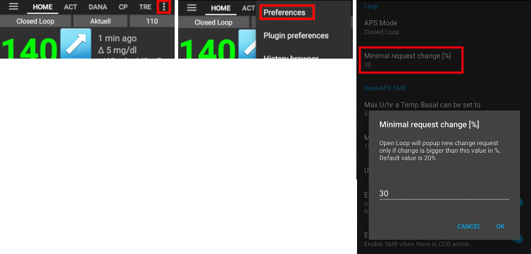
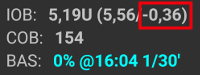

# 完成目標

**AAPS** has a series of **Objectives** required to be completed to help the user progress from basic open looping to hybrid closed looping and full **AAPS** functionality. Completing the **Objectives** aims to ensure you have:

- Configured everything correctly in your **AAPS** setup;
- Learned about the essential features of **AAPS**; and
- A basic understanding of what your system can do, in order to help instill confidence when using **AAPS**.

When **AAPS** is installed for the first time, each objective must be completed before moving on to the next one. New features will gradually be unlocked as progress is made through each **Objective**.

**Objectives 1 to 8** will guide you from configuring **AAPS** on your smartphone to “basic” hybrid closed looping. This will take about 6 weeks to complete. You can proceed up to **Objective 5** using a virtual pump (and using some other method of insulin delivery in the meantime). **Objectives 9 to 11** are designed to test more advanced **AAPS** features with the aim of better control of your diabetes, and will take up to 3 months to complete, possibly longer. Further details on an estimated breakdown of time can be obtained here: [How long will it take?](../Getting-Started/PreparingForAaps.md#how-long-will-it-take-to-set-everything-up)

As well as progressing through the **Objectives**, if required, you can also remove your progress and [go back to an earlier objective](#go-back-in-objectives).

### Backup your settings

```{admonition} Note
:class: note

Exporting your **AAPS** settings is recommended after completing each **Objective**!
```

It is strongly recommended that you [export your settings](../Maintenance/ExportImportSettings.md) after completing each objective to avoid losing any progress made in **AAPS**. This exporting process creates a **settings file** (.json) which should be backed-up in one or more safe places (e.g. Google Drive, hard disk, email attachment _etc._). This ensures that any progress made in **AAPS** is saved. If your phone is lost or if you accidentally delete your progress, the json file can be re-loaded to **AAPS** by importing a recent settings file. Having a backup **settings file** is also required if a new **AAPS** smartphone is required for any reason (upgrading/lost/broken phone _etc._)

The **settings** file will save not only your progress through the **Objectives**, but also all your **AAPS** settings such as **max bolus** _etc._

The **Objectives** will need to be restarted from the beginning should you fail to have a backup of your settings and anything happens to your **AAPS** smartphone. Progressing through the **Objectives** takes time, and having to re-complete them again because for example you lost your smartphone, is a situation to be best avoided.

## Objective 1: Setting up visualization and monitoring, analyzing basals and ratios

**Objective 1** requires the user to set up their basic technical setup in **AAPS**. No progress can be made until this step has been completed.

- Select the correct CGM/FGM in [Config Builder](../SettingUpAaps/ConfigBuilder.md#bg-source). 有關更多信息，請參見[BG 來源](../Getting-Started/CompatiblesCgms.md)。
- Select the correct Pump in [Config Builder](../SettingUpAaps/ConfigBuilder.md) to ensure your pump can communicate with **AAPS**. Select **virtual pump** if you are using a pump model with no **AAPS** driver for looping, or if you want to work through the early **Objectives** while using another system for insulin delivery. 有關更多信息，請參見[胰島素幫浦](../Getting-Started/CompatiblePumps.md)。
- If using Nightscout:
  - Follow instructions in [Nightscout](../SettingUpAaps/Nightscout.md) page to ensure **Nightscout** can receive and display **AAPS** data.
  - Note that URL in **NSClient** must be **_without_ "/api/v1/"** at the end - see [Preferences > NSClient](../SettingUpAaps/Preferences.md#NSClient).
- If using Tidepool:
  - Follow instructions in [Tidepool](../SettingUpAaps/Tidepool.md) page to ensure **Tidepool** can receive and display **AAPS** data.

請注意 - _你可能需要等待下一次感測器的血糖讀取值到來，**AAPS** 才能識別他。_

## 目標 2：學習如何控制 AAPS

**Objective 2** requires several ‘tasks’ to be actioned as shown in the screenshot below
Click on the orange text "Not completed yet" to access the to-dos.
將提供鏈接以指導你，若你對某個操作不熟悉。


完成 **目標 2** 的任務：

- Set your **Profile** to 90% for a duration of 10 min.
  - _Hint_: Long press your Profile name on the OVERVIEW screen. More information in [Profile switch & Profile Percentage](../DailyLifeWithAaps/ProfileSwitch-ProfilePercentage.md).
  - _Note_: **AAPS** does not accept basal rates below 0.05U/hr. If your **Profile** includes rates 0.06U/hr or lower you will need to create a temporary **Profile** with higher basal rates before completing this task. Switch back to your normal **Profile** after completing this task.
- Simulate "taking a shower" by [disconnecting your pump](../DailyLifeWithAaps/AapsScreens.md#section-c---bg--loop-status) in **AAPS** for a duration of 1h.
  - _Hint_: press the loop icon on the OVERVIEW screen to open the Loop dialogue.
- End "taking a shower" by reconnecting your pump.
  - _Hint_: press the "disconnected"-icon to open the loop dialog.
- Set a custom [**Temporary Target**](../DailyLifeWithAaps/TempTargets.md) with a duration of 10 min.
  - _Hint_: press the target bar on the OVERVIEW screen to bring up the temporary target dialog.
- Activate the **Actions** plugin in [**Config Builder**](../SettingUpAaps/ConfigBuilder.md) to make it appear on the top scrollable menu bar.
  - _Hint_: Go to **Config Builder** and scroll down to General.
- Display the **Loop** plugin's content.
- [Scale the BG-Chart](../DailyLifeWithAaps/AapsScreens.md#section-f---main-graph) to be able to look at larger or smaller time frames: toggling between 6h, 12h, 18h 24h of past data.
  - _Hint_: Long press on the chart or use the arrow at the top right.

## 目標 3：證明你的知識

**Objective 3** requires the user to pass a multiple-choice exam which is designed to test your **AAPS** knowledge.

某些使用者發現 **目標 3** 是最難完成的目標。 Please read the **AAPS** documents in conjunction with the questions. If you are genuinely stuck after researching the **AAPS** documents, please search the [Facebook](https://www.facebook.com/groups/AndroidAPSUsers) or [Discord](https://discord.gg/4fQUWHZ4Mw) group for "Objective 3" (because it is likely that your question has been asked before - and answered by the group). 這些群組可以提供友善的提示，或引導你閱讀 **AAPS** 文件的相關部分。

In the meantime :

- To reduce the number of notifications / decisions you are asked to make (temporary basal rates) while in Open Loop, set a wide target range in your **Profile** _e.g._ 90 - 150 mg/dl or 5.0 - 8.5 mmol/l.
- 你可能想在晚上設置更寬的上限，或者甚至停用開環模式。

要進行 **目標 3**，點擊橘色文字“**尚未完成**”來查看相關問題。 請仔細閱讀每個問題並選擇你的答案。

每個問題可能有多個正確答案！ If an incorrect answer is selected, the question will be time-locked for 1 hour before you can go back and answer the question again. 當你再次嘗試回答時，請注意答案的順序可能已經改變，這是為了確保你仔細閱讀並真正暸解每個答案的正確性（或錯誤性）。

```{admonition} __What happens if new question(s) are added to an Objective when I update to a newer version of AAPS?__
:class: Note
From time to time, new features are added to **AAPS** which may require a new question to be added to the **Objectives**, particularly **Objective 3**. As a result, any new question added to **Objective 3** will be marked as “incomplete” because **AAPS** will require you to action this. Do not worry, as each **Objective** is independent, you will **not lose the existing functionality of AAPS**, providing the other **Objectives** remain completed.
```

## 目標 4：開始使用開環

The purpose of **Objective 4** is to recognise how often **AAPS** will evaluate the user's basal rate against glucose levels, and recommend temporary basal rate adjustments. As part of this **Objective**, you will activate open looping for the first time, and will accept 20 proposed temporary basal rate changes, and if required, apply these manually on your pump. You will also observe the impact of [**Temporary Targets**](../DailyLifeWithAaps/TempTargets.md). If you are not familiar with setting a temporary basal rate change in **AAPS** yet, please refer to the [**Actions** tab](../DailyLifeWithAaps/AapsScreens.md#action-tab).

The minimal time to complete this objective: **7 days**. 這是一個強制的等待時間。 It is not possible to proceed to the next **Objective**, even if all basal rate changes were enacted already.

- Select Open Loop either from the [Preferences > OpenAPS](../SettingUpAaps/Preferences.md#aps-mode) menu or by pressing and holding the Loop icon on the top left of the **Overview** screen.
- 在 7 天內手動執行至少 20 次臨時基礎率建議；將他們輸入到你的（實體）幫浦中，並在 AAPS 中確認你已接受他們。 Ensure these basal rate adjustments show up in **AAPS** and **Nightscout**.
- Use [**Temp Targets**](../DailyLifeWithAaps/TempTargets.md) when necessary. After treating a hypo, use the predefined "hypo temp target" to prevent the system from overcorrecting upon the bounce back.

To reduce the number of proposed basal rate changes while in Open Loop, you can still use the tips described in [**Objective 3**](#objective-3-prove-your-knowledge).
Additionally, you can change the minimum percentage for recommended basal rate changes. The higher the value, the fewer change notifications you will receive.



```{admonition} Note
:class: Note

You don't need to action each and every system recommendation!
```

## 目標 5：暸解你的開環，包括其臨時基礎率建議

在 **目標 5** 中，你將開始了解如何得出臨時基礎率的建議。 This includes the [determination of basal logic](https://openaps.readthedocs.io/en/latest/docs/While%20You%20Wait%20For%20Gear/Understand-determine-basal.html), analyzing the impact by observing [prediction lines in **AAPS Overview**](../DailyLifeWithAaps/AapsScreens.md#prediction-lines) (or Nightscout) and looking at detailed calculations shown on your **OpenAPS** tab.

完成此目標的預估時間：**7 天**。

This **Objective** requires you to determine and set your “Max U/h a temp basal can be set to” (max-basal) value as described in [OpenAPS-features](../DailyLifeWithAaps/KeyAapsFeatures.md#max-uh-a-temp-basal-can-be-set-to-openaps-max-basal). This value can be set in [Preferences > OpenAPS](../SettingUpAaps/Preferences.md#max-uh-a-temp-basal-can-be-set-to).
If you are still using a virtual pump, make sure this safety setting is set in both **AAPS** and your insulin pump.

You might wish to set your BG target higher than usual until you are comfortable with **AAPS**' calculations and settings.

The targets can be defined within those boundaries :

|         | Profile _low_ [target](../SettingUpAaps/YourAapsProfile.md#glucose-targets) | Profile _high_ target  | [Temporary target](../DailyLifeWithAaps/TempTargets.md) |
| ------- | --------------------------------------------------------------------------- | ---------------------- | ------------------------------------------------------- |
| Minimum | 4 mmol/l or 72 mg/dL                                                        | 5 mmol/l or 90 mg/dL   | 4 mmol/l or 72 mg/dL                                    |
| Maximum | 10 mmol/l or 180 mg/dL                                                      | 15 mmol/l or 225 mg/dL | 15 mmol/l or 225 mg/dL                                  |

Your **BG target** is a core value and all of **AAPS** calculations are based on it. 他不同於目標範圍，目標範圍是你通常希望血糖值保持在內的範圍。 如果你的目標範圍過寬（例如 3 mmol/l [50 mg/dl] 或更寬），你會發現 **AAPS** 幾乎不會採取行動。 This is because **BG** level is predicted to be somewhere in that wide range, and thus temporary basal rate changes are rarely suggested.

You may wish to experiment with adjusting your **BG target** in your **Profile** being in a tighter range (say, 1 or less mmol/l [20 mg/dl or less] wide) and observe the resulting behavior.


```{admonition} If you have been using a virtual pump, change to a real insulin pump now!
:class: note

If you are open looping with a virtual pump **stop here**. Only click verify at the end of this **Objective** once you have changed to using a "real" pump which delivers insulin.

```


## 目標 6：使用低血糖暫停功能開始閉環


```{admonition} Closed loop will not correct high **BG** values in **Objective 6** as it is limited to **Low Glucose Suspend** only!
:class: Note
你仍然需要自行修正高血糖值（手動透過幫浦或注射筆進行修正）！
```

As part of **Objective 6** you will close the loop and activate its **Low Glucose Suspend** (LGS) mode while [max IOB](../DailyLifeWithAaps/KeyAapsFeatures.md#maximum-total-iob-openaps-cant-go-over-openaps-max-iob) is set to zero. You have to remain in LGS mode for 5 days to complete this **objective**. You should use this time to check if your **Profile** settings are accurate and LGS events are not triggered too often.

Minimal time to complete this objective: **5 days**. 這是一個強制的等待時間。 You cannot proceed to the next **Objective** before this time is up.

It is crucial that your current **Profile** (basal, ISF, IC) have been well tested before you close your loop in **LGS** mode. Incorrect **Profile** settings might force you into hypo situations which have to be treated manually. An accurate **Profile** will help reduce the need for low glucose treatments during the 5 days period.

**If you still observe frequent or severe low glucose episodes consider refining your DIA, basal, ISF and carb ratios.** Please refer to the [Facebook](https://www.facebook.com/groups/AndroidAPSUsers) or [Discord](https://discord.gg/4fQUWHZ4Mw) group which has much discussion on this.

During **Objective 6**, **AAPS** will override the maxIOB setting to zero. **This override will end when moving to Objective 7.**

This means that when you are on **Objective 6**, if sensor glucose levels are dropping, **AAPS** will reduce your basal insulin delivery for you. But, if sensor glucose levels are rising, **AAPS** will  increase the basal rate above your **Profile** value only if **basal IOB** is negative as a result of  a previous **LGS**. 否則，**AAPS** 不會將基礎率提高到超過你目前個人資料的數值，即使血糖水平正在上升。 這個謹慎設置是為了避免在學習使用 **AAPS** 時出現低血糖情況。

**因此，在這個階段，你需要手動處理高血糖的胰島素注射修正。**

- If your basal IOB is negative (see screenshot below) a temporary basal rate (TBR) > 100% can be triggered in **Objective 6**.



- 將你的目標範圍設置得比平常略高，以增加安全緩衝。
- Enable 'Low Glucose Suspend' mode by pressing and holding the Loop icon in the top right corner of the OVERVIEW screen and selecting the Loop - LGS mode icon.
- 檢視啟動的臨時基礎率，觀察 「首頁總覽」螢幕上的藍綠色基礎文本或 「首頁總覽」圖表中的藍綠色基礎呈現。
- 在處理低血糖後，你可能會暫時經歷血糖反彈，但無法提高基礎率來應對反彈。

## 目標 7：調整閉環模式，將 maxIOB 提高至 0 以上並逐步降低血糖目標

要完成**目標 7**，您必須關閉循環並提高您的[maxIOB](../DailyLifeWithAaps/KeyAapsFeatures.md#maximum-total-iob-openaps-cant-go-over-openaps-max-iob)。 **maxIOB** was zeroed out automatically in **Objective 6**. 現在這個設定將被恢復。 **AAPS** 將開始使用你設定的 maxIOB 值來修正高血糖值。

Minimal time to complete this objective: **1 day**. 這是一個強制的等待時間。 It is not possible to proceed to the next **Objective** until this period of time has expired.

- Select **Closed Loop** either from [Preferences > OpenAPS](../SettingUpAaps/Preferences.md) or by pressing and holding the Loop icon in the top right corner of the **Overview** screen. Stay in **Closed Loop** over a period of 1 day.

- Slowly raise your 'Maximum total IOB OpenAPS can’t go over' (in OpenAPS called 'max-iob') above 0, until you find the settings that work best for you.

The default recommendation for this setting is “**average meal bolus + 3x max daily basal**”, where “max daily basal” is the maximum hourly value in any time segment of the day.


這個建議應被視為起點。 If you use this rule but are experiencing AAPS delivering too much insulin as glucose levels rise, you may need to :

- lower the "Maximum total IOB OpenAPS can’t go over" value;
- review your **Profile** settings, only making one adjustment at a time.

Alternatively, if you are very insulin resistant, raise the **maxIOB** value very cautiously.

Once confident on how much **maxIOB** suits your looping patterns, lower your **BG targets** to your desired level.

## Objective 8: Adjust basals and ratios if needed, and then enable Autosens

As part of this **objective**, you will revisit your **Profile**'s performance and will use [Autosens](../DailyLifeWithAaps/KeyAapsFeatures.md#autosens) functionality as an indicator for wrong settings.

Minimal time to complete this objective: **7 days**. 這是一個強制的等待時間。 It is not possible to proceed to the next **Objective** until this period of time has expired.

Enable [Autosens](../DailyLifeWithAaps/KeyAapsFeatures.md) over a period of 7 days and watch [**Overview**'s graph white line](../DailyLifeWithAaps/AapsScreens.md#section-g---additional-graphs) showing your insulin sensitivity rising or falling due to exercise or hormones etc. Keep an eye on the OpenAPS report tab which shows **AAPS** adjusting the sensitivity, basals and targets accordingly.

Additionally, you can use [Autotune](https://openaps.readthedocs.io/en/latest/docs/Customize-Iterate/autotune.html) as a one off to check your basals remain accurate or do a traditional basal test.

## 目標 9：啟用白天使用的其他 oref1 功能，例如超微量注射 (SMB)

In **Objective 9**, you will tackle and use **"Super Micro Bolus (SMB)"** as one core functionality. After working through the mandatory readings you will have a good understanding of what SMBs are, how these work, and why basal is set to zero temporarily after SMBs are given (zero-temping).

Minimal time to complete this objective: **28 days**. 這是一個強制的等待時間。 You can’t proceed to the next Objective before this time is up.

- The [SMB section in this documentation](../DailyLifeWithAaps/KeyAapsFeatures.md#super-micro-bolus-smb) and [oref1 coverage in the openAPS docs](https://openaps.readthedocs.io/en/latest/docs/Customize-Iterate/oref1.html) are must-reads to understand **SMB** and the concept of **zero-temping**.
- Once done, you can [raise maxIOB](../DailyLifeWithAaps/KeyAapsFeatures.md#maximum-total-iob-openaps-cant-go-over-openaps-max-iob) to get **SMBs** working more effectively. maxIOB now includes all **IOB**, not just accumulated basal. This threshold pauses **SMBs** until IOB drops below this value (_e.g._ **maxIOB** is set to 7U and a bolus of 8U is given to cover a meal: SMBs will be paused and not given unless **IOB** drops below 7U).
  A good start is setting **maxIOB** = **average meal bolus + 3x max daily basal** where "max daily basal" is the maximum hourly value in any time segment of the day. See [objective 7](#objective-7-tuning-the-closed-loop-raising-maxiob-above-0-and-gradually-lowering-bg-targets) as reference.
- Evaluate your carb absorption rate and consider changing the “min_5m_carbimpact”-parameter in [Preferences > Absorption settings > min_5m_carbimpact](../SettingUpAaps/Preferences.md#min_5m_carbimpact) if you find it too slow or too fast.

## 目標 10：自動化

**Automations** become available when **Objective 10** is started.

Minimal time to complete this objective: **28 days**. 這是一個強制的等待時間。 You can’t proceed to the next Objective before this time is up.

Read the documentation page [Automation](../DailyLifeWithAaps/Automations.md) first.

Set-up the most basic automation rule; for example trigger an Android notification in a few minutes:

- 選擇通知頁籤
- 從右上角的 3 點選單中，選擇新增規則
- 給任務命名為 "我的第一個自動化通知"
- "編輯" "條件"
  - 點擊 "+" 圖示來新增第一個觸發條件
  - 選擇 "時間" 並按 "OK"，他將建立一個預設的條目，時間為今天的某時某分
  - 點擊分鐘部分來編輯時間，使其在幾分鐘內觸發。 然後點擊 OK 關閉
  - 點擊 "OK" 關閉觸發條件畫面
- "新增" 一個 "動作"
  - 選擇 "通知"，按 "OK"
  - click "Notification" to edit the message, enter something like "My first automation"
- Wait until the time triggers the notification (note that depending on your phone, it can be a few minutes late)

You can then experiment with setting up a more useful **Automation**.
The documentation page gives a few examples, and you can search for "Automation" screenshots on the [Facebook](https://www.facebook.com/groups/AndroidAPSUsers) group. There is also a dedicated channel in the [Discord](https://discord.gg/4fQUWHZ4Mw) community.

For example, if you eat the same thing for breakfast at the same time every morning before school/work, you can create an **Automation** such as "before-breakfast-target" to set a slightly lower **Temporary Target** 30 minutes before having breakfast. 在這種情況下，你的條件可能會包括 "定期時間"，選擇一週中的特定日子（星期一、星期二、星期三、星期四、星期五）和特定時間（上午 06:30）。 The action will consist of "Start temp target" with a lower than usual target value and a 30 minutes duration.

## Objective 11: Enabling additional features for daytime use, such as Dynamic Sensitivity plugin (DynISF).

Minimal time to complete this **Objective**: **28 days**. 這是一個強制的等待時間。 It is not possible to proceed to the next **Objective** until this period of time has expired.

- Ensure that **SMB** is functioning properly
- Read the documentation concerning **Dynamic ISF** [here](../DailyLifeWithAaps/DynamicISF.md)
- Search the [Facebook](https://www.facebook.com/groups/AndroidAPSUsers) and [Discord](https://discord.gg/4fQUWHZ4Mw) groups for discussions around **Dynamic ISF** and read about other users' experiences and recommendations.
- 啟用 **DynamicISF 外掛**，並確定適合你身體需求的校正值。 出於安全考量，建議初始值設置為低於 100%。

### 返回目標

If you wish to go back in the **Objectives** for whatever reason you can do so by clicking at "clear finished".


