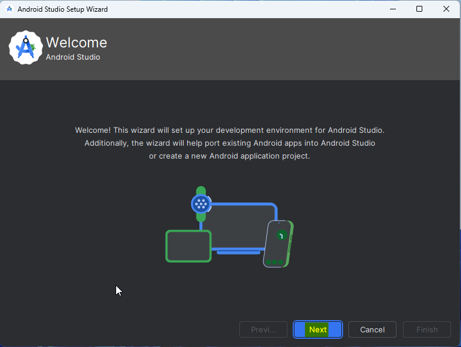
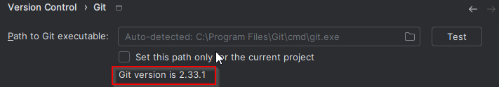
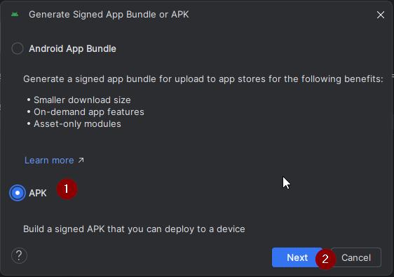
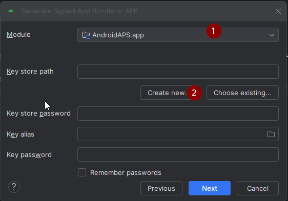

# 電腦建立

這是傳統的方法來建立您的 AAPS 應用程式。

您可以使用 [瀏覽器建立](./BrowserBuild.md) 方法在沒有電腦的情況下建立應用程式。

## 自行建置，而不是下載

**AAPS 應用程式（apk檔案）因醫療設備相關法規而無法下載。 自行建置應用程式以供個人使用是合法的，但你不得將副本提供給他人！**

詳細資訊請參閱 [FAQ 頁面](../UsefulLinks/FAQ.md)。

---

(Building-APK-recommended-specification-of-computer-for-building-apk-file)=
## 建置AAPS所需的電腦和軟體規格

* 可能需要特定版本的 **[Android Studio](https://developer.android.com/studio/)** 來建立 apk。 見下表：

| AAPS版本                  | 首選<br/>Android Studio<br/>版本 | 替代<br/>Android Studio<br/>版本 | Gradle | JVM |
| ----------------------- | ---------------------------------------- | ---------------------------------------- | ------ |:--- |
| 2.6.2                   | 3.6.1                                    |                                          | 5.6.4  | 11  |
| 2.8.2.1                 | 4.1.1                                    |                                          | 6.1.1  | 13  |
| [3.1.0.3](#version3100) | 2020.3.1                                 | 最高支援到 Narwhal                            | 7.3.3  | 17  |
| [3.2.0.4](#version3204) | Hedgehog（2023.1.1）                       | 最高支援到 Narwhal                            | 8.2    | 17  |
| [3.3.1.3](#version3300) | Ladybug功能更新（2024.2.2）                    | 最高支援到 Narwhal                            | 8.10   | 21  |
| [3.3.2](#version3300)   | Meerkat (2024.3.1)                       | Narwhal                                  | 8.11.1 | 21  |
| [3.3.2.1](#version3321) | Narwhal (2025.1.2)                       |                                          | 8.13   | 21  |

"首選版本"已打包與適當的JVM版本。 首選版本也是你可以用來建立**AAPS**的最小版本。 你**無法**在比"首選"版本更舊的版本上建立。 如果使用不同的版本，你可能會遇到與JVM版本相關的問題。 請參閱 [Android Studio 問題排除](#troubleshooting_androidstudio-uncommitted-changes) 頁面以協助解決這些問題。 如果你當前的 Android Studio 版本未在表格中列出，你必須先更新它。

Gradle版本與源代碼相連結，下載/更新源代碼時，你將始終獲得正確的Gradle版本。 此處僅供參考，你不必採取行動。

* [Windows 32位系統](#troubleshooting_androidstudio-unable-to-start-daemon-process)不支援Android Studio。 請記住**64位中央處理器和64位作業系統是必要條件。** 如果你的系統不符合此條件，你必須更換受影響的硬體或軟體，或整個系統。

<table class="tg">
<tbody>
  <tr>
    <th class="tg-baqh">作業系統（僅限64位）</th>
    <td class="tg-baqh">Windows 8或更高版本</td>
    <td class="tg-baqh">Mac OS 10.14或更高版本</td>
    <td class="tg-baqh">任何支援Gnome、KDE或Unity DE的Linux;&nbsp;&nbsp;GNU C Library 2.31或更新版本</td>
  </tr>
  <tr>
    <th class="tg-baqh"><p align="center">CPU（僅限64位）</th>
    <td class="tg-baqh">x86_64 CPU架構；第二代Intel Core或更新版本，或支援<a href="https://developer.android.com/studio/run/emulator-acceleration#vm-windows" target="_blank" rel="noopener noreferrer"><span style="text-decoration:var(--devsite-link-text-decoration,none)">Windows Hypervisor</span></a>的AMD CPU</td>
    <td class="tg-baqh">ARM架構晶片，或支援<a href="https://developer.android.com/studio/run/emulator-acceleration#vm-mac" target="_blank" rel="noopener noreferrer"><span style="text-decoration:var(--devsite-link-text-decoration,none)">Hypervisor.Framework</span></a>的第二代Intel Core或更新版本</td>
    <td class="tg-baqh">x86_64 CPU架構；第二代Intel Core或更新版本，或支援AMD虛擬化（AMD-V）和SSSE3的AMD處理器</td>
  </tr>
  <tr>
    <th class="tg-baqh"><p align="center">記憶體</th>
    <td class="tg-baqh" colspan="3"><p align="center">16GB 或更多</td>
  </tr>
  <tr>
    <th class="tg-baqh"><p align="center">硬碟</th>
    <td class="tg-baqh" colspan="3"><p align="center">至少30GB的可用空間。 建議使用SSD。</td>
  </tr>
  <tr>
    <th class="tg-baqh"><p align="center">解析度</th>
    <td class="tg-baqh" colspan="3"><p align="center">1280 x 800 最小<br></td>
  </tr>
  <tr>
    <th class="tg-baqh"><p align="center">網際網路</th>
    <td class="tg-baqh" colspan="3"><p align="center">寬頻</td>
  </tr>
</tbody>
</table>

**強烈建議（不是強制）使用SSD（固態硬碟）而非HDD（硬碟）因為在建置AAPS apk文件時將需要更少時間。** 在建置**AAPS** apk文件時仍可以使用HDD。 如果這樣做，建置過程可能需要很長時間才能完成，但開始後，你可以讓他無需監控地執行。

## 建置過程中的幫助與支援

如果在建置**AAPS**應用的過程中遇到困難，請參考專門的[**Android Studio問題排除**](../GettingHelp/TroubleshootingAndroidStudio)部分。

如果你認為建置說明中的內容有錯誤、缺失或令人困惑，或仍然感到困難，請與其他**AAPS**用戶群聯繫，群組可在[Facebook](https://www.facebook.com/groups/AndroidAPSUsers)或[Discord](https://discord.gg/4fQUWHZ4Mw)上找到。 如果你想自行更改某些內容（更新螢幕截圖_等_），請提交[拉取請求（PR）](../SupportingAaps/HowToEditTheDocs.md)。

## 建置AAPS應用程式的逐步指南

```{admonition} WARNING
:class: warning
如果你之前已經建立過AAPS，則不需要再次執行後續所有步驟。
請直接跳轉到[更新指南](../Maintenance/UpdateToNewVersion.md)!
```

```{contents} The overall steps for building the **AAPS** apk file
:depth: 1
:local: true
```

在本指南中，你將找到建置**AAPS** apk文件的_範例_螢幕截圖。 由於**Android Studio** - 我們用來建立**AAPS** apk的軟體 - 定期更新，這些螢幕截圖可能與你的安裝不完全相同，但仍然應該可以遵循。

由於**Android Studio**可以在Windows、Mac OS X和Linux平台上運行，因此不同平台的步驟可能會略有不同。

(install-git-if-you-dont-have-it)=
### 安裝Git

```{admonition} Why Git? 
:class: dropdown

Git被稱為“_版本控制系統_”（VCS）。
Git是一個可以讓你追蹤程式碼變更並與他人協作的程式。 你將使用Git從GitHub網站將**AAPS**的原始碼複製到你的本地電腦。 然後，你將在你的電腦上使用Git來建立**AAPS**應用程式（apk）。 
```

(BuildingAaps-steps-for-installing-git)=
#### 安裝Git的步驟

1.  檢查你是否已經安裝**Git**。 你可以在Windows搜尋欄中輸入“git”來檢查—如果你看到**“Git bash”**或其他形式的Git，那麼它已經安裝，並且你可以直接前往[安裝Android Studio](#install-android-studio)：


2. 如果你沒有安裝Git，請從[**這裡**](https://git-scm.com/downloads)的“下載”部分下載並安裝最新版本。 任何最新的Git版本都應該可以使用，請根據你的系統選擇正確的版本，無論是Mac、Windows還是Linux。

**Mac使用者注意：**Git網頁會指導你安裝名為"homebrew"的附加程式來協助安裝。 如果你透過homebrew安裝Git，則無需更改任何偏好設定。

(Make_a_note_of_Git_path)=

* 在安裝過程中，當系統要求你“選擇目的地位置”時，請注意_Git_正在被安裝的**安裝路徑**，你將在下一個步驟需要檢查它。 安裝路徑可能類似於“C:\Program Files\Git\cmd\git.exe”

*  在進行Git安裝的幾個步驟時，只需接受所有的預設選項。

*  安裝完成後，如果你忘記紀錄Git的安裝位置，可以透過以下方式找到他：在PC的搜索欄中輸入“git”，右鍵點擊“Git bash”，選擇“打開檔案位置”，將滑鼠懸停在“Git bash”圖示上，這將顯示安裝位置。

* 在進行下一步之前，重新啟動你的電腦。

(Building-APK-install-android-studio)=
### 安裝Android Studio

- **在接下來的步驟中，你必須始終保持聯網，因為Android Studio會下載多個更新。**

```{admonition} What is Android Studio?
:class: dropdown
Android Studio是一個在你的電腦上運行的程式。 它允許你從網際網路（使用Git）下載原始碼並建立智慧型手機（和智慧型手錶）應用程式。 你不能通過在電腦上的Android Studio建立新或更新的應用程式來“破壞”你可能在智慧型手機上運行的當前循環版本的**AAPS**，這些都是完全獨立的過程。 
```

安裝Android Studio時最重要的事情之一是**請耐心等候！**在安裝和設置過程中，Android Studio正在下載大量內容，這將需要時間。

```{admonition} Different UI
:class: warning
匯入注意：在最近的更新中，Android Studio改變了其使用者介面。 本指南將向你展示在“Ladybug”中的*新介面*的步驟。 如果你仍在使用舊的介面，你可能需要先根據[這些指示](NewUI)將Android Studio切換到新的介面。
```

Android Studio 版本非常重要。 請參閱 [上面的指示](#Building-APK-recommended-specification-of-computer-for-building-apk-file) 以選擇適合的 Android Studio 版本。

下載[當前版本的Android Studio](https://developer.android.com/studio)或從[**檔案庫**](https://developer.android.com/studio/archive)下載較舊版本，並接受下載協議。


下載完成後，啟動下載的應用程序以在你的計算機上安裝它。 你可能需要接受/確認一些有關從 Windows 下載的應用程序的警告！

透過點擊「下一步」來安裝 Android Studio，如以下屏幕截圖所示。 你**不**需要更改任何設定！


如果您希望節省硬碟空間，可以取消勾選 Android 虛擬設備：這不適用於建立 **AAPS**。


現在點擊「安裝」：


完成後，點擊「下一步」


在最後一步，點擊「完成」來首次啟動 Android Studio。


系統將詢問你是否希望幫助改善 Android Studio。 根據自己的喜好選擇選項，這不會影響接下來的步驟。


歡迎畫面歡迎你安裝 Android Studio。 按「下一步」。



選擇「標準」作為安裝類型。


通過再次點擊「下一步」來確認設定。


現在你需要接受許可協議。 左側有兩個區域（1 + 3），你需要逐一選擇並在右側各選擇「接受」（2 + 4）。

然後可以點擊「完成」(5) 按鈕。


某些 Android 套件現在將被下載和安裝。 請耐心等待。

當這一切完成後，你將看到以下畫面，可以再次選擇「完成」。


你現在將看到 Android Studio 的歡迎畫面。


(Building-APK-download-AAPS-code)=
### 下載AAPS程式碼

```{admonition} Why can it take a long time to download the AAPS code?
:class: dropdown

第一次下載**AAPS**時，Android Studio將透過網際網路連接到Github網站以下載**AAPS**的原始碼。 這應該會花大約1分鐘的時間。 

然後，Android Studio將使用**Gradle**（一種開發Android應用的工具）來識別在你的電腦上構建這些項目所需的其他元件。 
```

在Android Studio的歡迎畫面上，檢查左側的“**專案**” (1)是否高亮顯示。

點一下右側的"**Clone Repository**" (2)


我們現在將告訴Android Studio從哪裡獲取程式碼：


* “倉庫URL”應該在左側（1）預設選擇。
* “Git”應作為版本控制預設選擇（2）。
* 現在複製這個URL：
    ```
    https://github.com/nightscout/AndroidAPS.git
    ```
    然後將其粘貼到URL文本框中（3）。

* 檢查用於儲存複製程式碼的（預設）目錄是否已經存在於您的電腦上 (4)。 你可以將其更改為某個目錄，但請記得你放置的位置!
* 現在點擊“複製”按鈕（5）。

```{admonition} INFORMATION
:class: information
請記下該目錄。 它是你的原始碼儲存的位置！
```

你現在將看到一個螢幕，告訴你倉庫正在被複製：


在某個時候，Android Studio 將關閉並重新啟動。 系統可能會詢問你是否希望信任該專案。 點擊“信任專案”：

  


僅限Windows用戶：如果你的防火牆要求許可，請授予存取權限：

 

倉庫成功複製後，Android Studio將打開複製的專案。

(NewUI)=
```{admonition} New UI
:class: information
Android Studio最近改變了其UI。 新的Android Studio安裝預設使用新介面！

只有當你的Android Studio外觀不同時，你才可能需要切換到新介面：
點擊左上角的漢堡選單，然後選擇**設定**（或Apple電腦上的**偏好設定**）。
在**外觀與行為**中，前往**新介面**並勾選**啟用新介面**。 然後重新啟動 Android Studio 開始使用它。

如果你沒有找到選項 **新界面**，別擔心：你已經在使用它了！
```


當 Android Studio 開啟時，請耐心等待（這可能需要幾分鐘），尤其是，**請不要**按照彈出視窗中的建議更新專案。

Android Studio 將自動開始進行 "Gradle 專案同步"，這將需要幾分鐘才能完成。 你可以看到它（仍然）在運行：


```{admonition} NEVER UPDATE GRADLE!
:class: warning

Android Studio 可能會建議更新 gradle 系統。 **切勿更新 gradle！** 這會導致困難。
```

僅限於 Windows 電腦：你可能會收到通知發出 Windows 防護程式正在運行：點擊 **自動** 並確認，這將使建置速度更快！


你可以讓 Gradle 同步運行，同時已經可以追蹤下一步。

(Building-APK-set-git-path-in-preferences)=
### 在 Android Studio 偏好設定中設置 Git 路徑

現在我們要告訴 Android Studio 在哪裡找到你之前安裝的 Git，[稍早](#install-git-if-you-dont-have-it)提到過。

* 僅限於 Windows 使用者：在 [安裝 Git](#install-git-if-you-dont-have-it) 後，請確保重新啟動你的電腦。 如果尚未重開電腦，請現在重啟並重新打開 Android Studio

在**Android Studio** 的左上角，打開漢堡選單並導航到**檔案** > **設定**（在 Windows 上）或**Android Studio** > **偏好設定**（在 Mac 上）。 這將打開以下窗口，點擊展開名為**版本控制**（1）的下拉選單，然後選擇**Git**


檢查**Android Studio** 是否能夠自動找到正確的**Git 可執行檔的路徑**，透過點擊 "測試" 按鈕（1）：


如果自動設置成功，你的當前**Git** 版本將顯示在路徑旁邊。

   


如果你發現**git.exe** 無法自動找到，或者點擊 "測試" 出現錯誤（1），你可以選擇
* 手動輸入你之前[儲存的路徑](#BuildingAaps-steps-for-installing-git)，或
* 點擊資料夾圖示（1），手動導航至**git.exe** 安裝的目錄[上面](#BuildingAaps-steps-for-installing-git)
* 用**測試**按鈕驗證你的設定！

  

(Building-APK-generate-signed-apk)=
### 建置AAPS“簽章”APK

```{admonition} Why does the AAPS app need to be "signed"?
:class: dropdown

Android 要求每個應用程式必須被 _簽署_，以確保它只能從同一位信任來源後續更新。 有關此主題的更多資訊，請遵循 [此連結](https://developer.android.com/studio/publish/app-signing.html#generate-key)。 

對我們的用途而言，這意味著我們生成一個簽名或 "金鑰庫" 檔案，並在建置 **AAPS** 應用程式時使用它。
```


**重要：在進行下一步之前，請確保 gradle 同步已成功完成！**


點擊左上角的漢堡選單以打開選單欄。 選擇**建置**（1），然後選擇**生成簽署的應用包 / APK**（2）


選擇“APK”而不是“Android App Bundle”，然後點擊“下一步”：



在下一個螢幕上，確保“模組”設置為“AAPS.app”（1）。

(Building-APK-wearapk)=
```{admonition} INFORMATION!
:class: information
如果你想為你的手錶建立 APK，你現在需要選擇 AAPS.wear！
```


點擊“建立新...” (2) 開始建立你的密鑰庫。

```{admonition} INFORMATION!
:class: information
你只需創建一次金鑰庫。
如果你之前已經建置過 AAPS，請勿創建新的金鑰庫，而是選擇現有的金鑰庫並輸入其密碼！
```

**_注意：_**金鑰庫是存儲應用程式簽名資訊的檔案。 他是加密的，並且訊息透過密碼進行保護。


* 點擊 "文件夾" 符號（1）以選擇你電腦上金鑰庫的路徑。

  請**不要**使用你儲存原始碼的目錄，而使用一些你也會轉移到新電腦的目錄。

```{admonition} WARNING!
:class: warning
請務必記下一個金鑰庫的位置。 當你建置下一個 AndroidAPS 更新時，將需要它！
```

* 現在選擇一個簡單的密碼（並記下來），在密碼框中輸入它（2），並確認（2）。

  密鑰庫和密鑰的密碼不必過於複雜。 如果將來遺失密碼，請參見[解決遺失金鑰庫的問題](#troubleshooting_androidstudio-lost-keystore).

* 密鑰的預設別名（3）為“key0”，保持不變。

* 你現在需要為你的密鑰設置密碼。 為了簡單起見，你可以使用與上面密鑰庫相同的密碼。 輸入一個密碼（4）並確認之。

```{admonition} WARNING!
:class: warning
請記下這些密碼！ 當你建置下一個 AAPS 更新時，將需要這些密碼！
```

* 預設有效期為 25 年，可以保持原樣。

* 輸入你的名字和姓氏（5）。 不需要添加其他任何資訊，但你可以自由地補充（6-7）。

* 點擊“確定”（8）繼續：


在**生成簽署的應用包或 APK**頁面上，現在將顯示金鑰庫的路徑。 現在重新輸入金鑰庫密碼（1）和密鑰密碼（2），並勾選方框（3）以記住密碼，這樣你在下次建構 APK 時（即升級到新的 AAPS 版本時）就不需要再次輸入。 點擊“下一步”（4）：


在下一個螢幕上，選擇建構變體 "fullRelease"（2），然後點擊 "建立"（3）。 你應該記住在（1）顯示的目錄，因為稍後你會在那裡找到生成的 APK 檔案！

   

Android Studio 現在將建置**AAPS**的 APK。 它會在右下角顯示 "Gradle 建構正在運行"（2）。 這個過程需要一些時間，根據你的電腦和網路連線，請**耐心等待！** 如果你想查看建置進度，請點擊在 Android Studio 底部的小錘子 "建置"（1）：


現在你可以查看建置進度：


Android Studio在建置完成後將顯示“BUILD SUCCESSFUL”的訊息。 你可能會看到一個彈出通知，你可以點擊選擇“查找”。 如果你錯過了這個訊息，請點擊通知圖示（1），然後在螢幕底部點擊**定位**（2）以顯示通知：


**_如果建置不成功，請參考[Android Studio 問題排除部分](../GettingHelp/TroubleshootingAndroidStudio)。_**

在通知欄中，點擊藍色連結“定位”：

 你的檔案管理器將開啟並顯示你剛剛建置的 apk 檔案。

   

恭喜！ 現在你已經建置了**AAPS** apk 檔案，接下來你將把此檔案傳送到你的智慧型手機。

```{tip}
如果你認為未來可能想使用 Android Wear 智慧型手錶，現在正是建立 AAPS Wear apk 的最佳時機，以確保它與你的 AAPS apk 同步。
```

移動到[傳送和安裝**AAPS**](../SettingUpAaps/TransferringAndInstallingAaps.md)的下一個階段。


