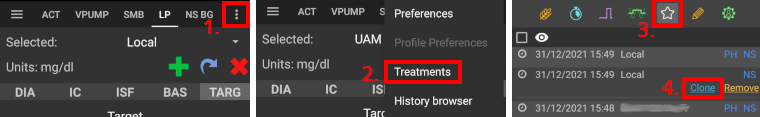
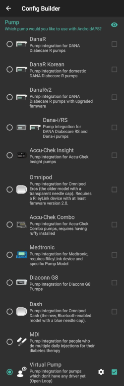

# 組態建置工具

根據你的設定，你可以透過螢幕頂部的標籤或選單開「啟組態建置工具」。

組態建置工具（Conf）是你用來啟用或停用模組功能的標籤。 左側的框（A）允許你選擇要使用哪一個，右側的框（C）允許你將這些顯示為 AAPS 中的標籤（E）。 如果右側的框未啟用，你可以透過螢幕左上方的選單（D）進入該功能。

如果模組內有額外的設定可用，你可以點擊齒輪（B），這會將你帶到偏好設定中的特定設置。

**首次配置：**從 AAPS 2.0 開始，設定嚮導會引導你完成 AAPS 的配置過程。 按下螢幕右上角的三點選單（F），並選擇「設定嚮導」來使用他。

(Config-Builder-tab-or-hamburger-menu)=

## 標籤或選單

透過眼睛圖示下方的選框，你可以決定如何開啟相應的程式區段。

(Config-Builder-profile)=

## 設定檔

* 選擇你要使用的基礎率設定檔。 請參閱[設定檔](../DailyLifeWithAaps/ProfileSwitch-ProfilePercentage.md)頁面以獲取更多設定資訊。
* 從 AAPS 3.0 開始，僅提供本地設定檔。

然而，可以將 Nightscout 設定檔同步至本地設定檔。 不過，為此重要的是要在 Nightscout 編輯器中複製由多個設定檔組成的完整資料庫記錄。 請參閱下方的說明。 如果要對更廣泛的設定檔進行重大更改，這可能會很有幫助，例如從試算表手動複製資料。

(Config-Builder-local-profile)=

### 本地設定檔(Local profile)

本地設定檔使用手動輸入到手機中的基礎率設定檔。 選擇他，AAPS 中將會顯示一個新標籤，必要時你可以更改從幫浦讀取的設定檔資料。 下次切換設定檔時，這些資料將寫入幫浦中的設定檔 1。 建議使用這個設定檔，因為他不依賴於網際網路連線。

您的當地設定檔是[匯出設定](../Maintenance/ExportImportSettings.md)的一部分。 因此，確保有一個安全的備份。

按鈕：

* 綠色加號：新增
* 紅色 X：刪除
* 藍色箭頭：複製

如果你對設定檔進行任何更改，請確保你正在編輯正確的設定。 在設定檔標籤中，不一定會顯示目前正在使用的設定檔——例如，如果你使用主畫面的設定檔標籤進行切換，該設定檔可能與設定檔標籤中顯示的不同，因為兩者之間沒有連線。

#### 複製設定檔切換

你可以輕鬆從設定檔切換中建立新的本地設定檔。 在此情況下，時間偏移和百分比將應用於新本地設定檔。

1. 點擊右上角的三點選單。
2. 選擇「治療」。
3. 按下星號圖示以進入設定檔切換頁面。
4. 選擇所需的設定檔切換並按「複製」。
5. 你可以在本地設定檔（LP）標籤中或透過選單編輯新的本地設定檔。

(Config-Builder-upload-local-profiles-to-nightscout)=

#### 上傳本地設定檔到 Nightscout

本地設定檔也可以上傳到 Nightscout。 設定可以在[NSClient 偏好設定](../SettingUpAaps/Preferences.md#nsclient)中找到。

#### 在 Nightscout 設定檔編輯器中變更設定檔

您可以將 Nightscout 設定檔編輯器中的變更同步到本地設定檔。 設定可以在[NSClient 偏好設定](../SettingUpAaps/Preferences.md#nsclient)中找到。

有必要複製整個目前活動的 Nightscout 資料庫記錄，而不僅僅是藍色箭頭的設定檔！ 新的資料庫記錄將攜帶目前日期，並可以透過「本地設定檔」標籤啟用。

### 設定檔助手

設定檔助手提供兩個功能：

1. 為孩子們找到合適的設定檔
2. 比較兩個設定檔或設定檔切換，以便複製新的設定檔

詳細資訊在單獨的[設定檔協助頁](../SettingUpAaps/ProfileHelper.md)中解釋。

(Config-Builder-insulin)=

## 胰島素

* 選擇你正在使用的胰島素曲線類型。
* 選項 'Rapid-Acting Oref'、'Ultra-Rapid Oref'、'Lyumjev' 和 'Free-Peak Oref' 都具有指數形狀。 更多資訊請參閱[OpenAPS 文件](https://openaps.readthedocs.io/en/latest/docs/While%20You%20Wait%20For%20Gear/understanding-insulin-on-board-calculations.html#understanding-the-new-iob-curves-based-on-exponential-activity-curves)。 
* 曲線將根據 DIA 和峰值時間而有所不同。
    
    * 紫色線顯示**注射後隨時間衰減**的剩餘胰島素量。
    * 藍色線顯示**胰島素的活性**。

### DIA

* DIA 對每個人來說並不相同。 這就是為什麼你需要自行測試。 
* 但他必須至少是 5 小時。
* 對於許多使用超快速胰島素如 Fiasp 的人來說，實際上在 3-4 小時後已經沒有顯著效果了，即使此時理論上仍有 0.0xx 單位的胰島素存在。 例如，在運動期間，這些殘餘量可能仍然是顯著的。 因此，AAPS 使用最少 5 小時作為 DIA。
* 您可以在[這個](../DailyLifeWithAaps/AapsScreens.md#insulin-profile)頁面的胰島素設定檔部分中閱讀更多相關資訊。

### 胰島素類型差異

* 對於 'Rapid-Acting'、'Ultra-Rapid' 和 'Lyumjev'，DIA 是唯一可以自行調整的變數，峰值時間是固定的。 
* Free-Peak 允許你同時調整 DIA 和峰值時間，這僅應由了解這些設置效果的高級使用者使用。 
* 該[胰島素曲線圖](../DailyLifeWithAaps/AapsScreens.md#insulin-profile)幫助您理解不同的曲線。
* 你可以透過啟用勾選框將其顯示為標籤，否則他將在選單中。

#### Rapid-Acting Oref

* 推薦用於 Humalog、Novolog 和 Novorapid
* DIA = 至少 5.0 小時
* 峰值 峰值 = 注射後 75 分鐘（固定，不可調整）

#### Ultra-Rapid Oref

* 推薦用於 FIASP
* DIA = 至少 5.0 小時
* 峰值 峰值 = 注射後 55 分鐘（固定，不可調整）

(Config-Builder-lyumjev)=

#### Lyumjev

* Lyumjev 的特殊胰島素設定檔
* DIA = 至少 5.0 小時
* 峰值 峰值 = 注射後 45 分鐘（固定，不可調整）

#### Free Peak Oref

* 使用 "自由峰值 Oref" 設定檔，你可以單獨輸入峰值時間。 要這麼做，點擊齒輪圖示以進入高級設定。
* 如果設定檔中未指定更高值，則 DIA 自動設置為 5 小時。
* 如果使用無背景支援的胰島素或不同胰島素的混合物，建議使用此效果設定檔。

(Config-Builder-bg-source)=

## 血糖來源

選擇你正在使用的血糖來源——詳情請參閱[血糖來源](../Getting-Started/CompatiblesCgms.md)頁面。

* [建置你自己的 Dexcom 應用程式（BYODA）](https://docs.google.com/forms/d/e/1FAIpQLScD76G0Y-BlL4tZljaFkjlwuqhT83QlFM5v6ZEfO7gCU98iJQ/viewform?fbzx=2196386787609383750&fbclid=IwAR2aL8Cps1s6W8apUVK-gOqgGpA-McMPJj9Y8emf_P0-_gAsmJs6QwAY-o0)。
* [xDrip+](https://xdrip-plus-updates.appspot.com/stable/xdrip-plus-latest.apk)
* [MM640g](https://github.com/pazaan/600SeriesAndroidUploader/releases)
* [Glimp](https://play.google.com/store/apps/details?id=it.ct.glicemia&hl=de) - 只支援版本 4.15.57 及更新的版本
* [Poctech](https://www.poctechcorp.com/en/contents/268/5682.html)
* [MiaoMiao 裝置的 Tomato 應用程式](http://tomato.cool/)
* [Glunovo 應用程式](https://infinovo.com/) 用於 Glunovo CGM 系統
* NSClient 血糖來源 - 不建議使用，因為在此情況下閉環依賴行動網路/ Wi-Fi 覆蓋範圍。 僅在與你的 NS 網站有連線時才能接收 CGM 資料。 最好使用其他 CGM 資料來源的本地廣播。
* 隨機血糖：生成隨機血糖資料（僅限演示模式）

(Config-Builder-pump)=

## 幫浦

選擇你正在使用的幫浦。

* [Dana R](../CompatiblePumps/DanaR-Insulin-Pump.md)
* Dana R Korean（適用於國內 DanaR 幫浦）
* Dana Rv2（升級了非官方韌體的 DanaR 幫浦）
* [Dana-i/RS](../CompatiblePumps/DanaRS-Insulin-Pump.md)
    
    * 對於 Dana 幫浦，必要時請使用**進階設定**來啟用藍牙監控。 如果無法連線幫浦，他會關閉藍牙一秒鐘。 這可能對於某些藍牙系統卡住的手機可能會有幫助。
    * [Dana RS 幫浦的密碼](../CompatiblePumps/DanaRS-Insulin-Pump.md)必須正確輸入。 在之前的版本中未檢查密碼。

* [Accu Chek Insight](../CompatiblePumps/Accu-Chek-Insight-Pump.md)

* [Accu Chek Combo](../CompatiblePumps/Accu-Chek-Combo-Pump.md)（需要 ruffy 安裝）
* [Omnipod Eros](../CompatiblePumps/OmnipodEros.md)
* [Omnipod DASH](../CompatiblePumps/OmnipodDASH.md)
* [Medtronic](../CompatiblePumps/MedtronicPump.md)
* [Diaconn G8](../CompatiblePumps/DiaconnG8.md)
* MDI（接收 AAPS 對你多次每日注射治療的建議）
* 虛擬幫浦（對於尚無驅動程式的幫浦開放循環——僅 AAPS 建議）

## 敏感性偵測

選擇你正在使用的敏感性偵測類型。 欲了解不同設計的更多詳細資訊，請[在這裡閱讀](../DailyLifeWithAaps/SensitivityDetectionAndCob.md)。 此功能會即時分析歷史資料，並在你對胰島素的反應比平常更敏感（或相反，更具抗性）時進行調整。 更多關於敏感性演算法的詳細資訊請參閱[OpenAPS 文件](https://openaps.readthedocs.io/en/latest/docs/Customize-Iterate/autosens.html)。

你可以在主畫面上選擇 SEN 並觀看白線來查看你的敏感性狀況。 請注意，您需要在[目標 8](../SettingUpAaps/CompletingTheObjectives.md#objective-8-adjust-basals-and-ratios-if-needed-and-then-enable-autosens)中，以便讓敏感度檢測/[自動敏感](../DailyLifeWithAaps/KeyAapsFeatures.md#autosens)自動調整所提供的胰島素量。 在達到該目標之前，Autosens 的百分比/圖表中的線僅供參考。

(Config-Builder-absorption-settings)=

### 吸收設定

如果你使用 Oref1 與 SMB，必須將**min_5m_carbimpact** 改為 8。 該值僅在 CGM 讀取值中斷時使用，或在身體活動「消耗」掉了所有會使 AAPS 衰減 COB 的血糖上升時使用。 在無法根據你的血糖反應動態計算[碳水化合物吸收](../DailyLifeWithAaps/CobCalculation.md)的時候，他會對你的碳水化合物應用預設的衰減。 基本上，這是一個安全保護機制。

(Config-Builder-aps)=

## APS

選擇用於治療調整的 APS 演算法。 你可以在 OpenAPS (OAPS) 標籤中查看選定演算法的活動詳情。

* OpenAPS AMA（進階餐前輔助，2017 年的演算法狀態）簡單來說，他的好處是在你自己進行餐前注射後，如果你可靠地輸入碳水化合物，系統可以更快地提高臨時基礎率。
* [OpenAPS SMB](../DailyLifeWithAaps/KeyAapsFeatures.md)（超微量注射，最新算法，適用於進階使用者） 請注意，您需要在[目標 9](../SettingUpAaps/CompletingTheObjectives.md#objective-9-enabling-additional-oref1-features-for-daytime-use-such-as-super-micro-bolus-smb)中才能使用 OpenAPS SMB，且 min_5m_carbimpact 必須在設定建構器 > 敏感度檢測 > 敏感度 Oref1 設定中設為 8。

## 循環

* 在開放循環、閉合循環和低血糖暫停 (LGS) 之間切換。

(Config-Builder-open-loop)=

### 開放循環

* AAPS 會持續評估所有可用資料（IOB、COB、血糖等），並在必要時提供治療建議來調整你的治療。 
* 這些建議不會自動執行（如同閉合循環），你必須手動將其輸入幫浦，或如果你使用的是相容幫浦（如 Dana R/RS 或 Accu Chek Combo），可以按下按鈕執行建議。 
* 這個選項是給那些想了解 AAPS 運作方式或正在使用不支援的幫浦的人。

(Config-Builder-closed-loop)=

### 閉合循環

* AAPS 會持續評估所有可用資料（IOB、COB、血糖等），並在必要時自動調整治療（即無需你進一步干預），以達到設定的目標範圍或值（注射、臨時基礎率、胰島素關閉以避免低血糖等）。 
* 閉合循環在多個安全限制範圍內工作，你可以個別設定這些限制。
* 閉環只有在您位於 [目標 6](../SettingUpAaps/CompletingTheObjectives.md#objective-6-starting-to-close-the-loop-with-low-glucose-suspend) 或更高且使用支援的幫浦時才有可能。
* 請注意：在閉合循環模式下，建議使用單一目標而非目標範圍（即 5.5 mmol 或 100 mg/dl，而非 5.0 - 7.0 mmol 或 90 - 125 mg/dl）。

### 低血糖暫停 (LGS)

* maxIOB 設為 0
* 這意味著如果血糖下降，他可以為你減少基礎率。
* 但如果血糖上升，則不會自動進行修正。 你的基礎率將保持與所選設定檔相同。
* 只有當來自先前的低血糖暫停的基礎 IOB 為負時，才會額外注射胰島素來降低血糖。

### 最小請求變更

* 使用開放循環時，當 AAPS 建議調整基礎率時，你會收到通知。 
* 為了減少通知次數，你可以使用更寬的血糖目標範圍，或增加最小請求率的百分比。
* 這定義了觸發通知所需的相對變更。

## 目標（學習計畫）

AAPS 有一個學習計畫（目標），您需要逐步完成。 這將引導你安全地設置閉合循環系統。 他保證你已正確設置所有內容，並了解系統的具體操作。 這是你可以信任系統的唯一方式。

您應該定期[匯出您的設定](../Maintenance/ExportImportSettings.md)（包括目標的進度）。 如果稍後需要更換手機（新購、螢幕損壞等），你可以簡單地匯入這些設置。

請參閱[目標](../SettingUpAaps/CompletingTheObjectives.md)頁面以獲取更多資訊。

## 治療

如果你查看「治療」（Treat）標籤，你可以看到已上傳到 Nightscout 的治療記錄。 如果您希望編輯或刪除一個條目（例如，您攝取的碳水化合物少於預期），請選擇「移除」，然後透過 [主螢幕上的碳水化合物按鈕](../DailyLifeWithAaps/AapsScreens.md#bolus--carbs) 輸入新值（如有必要可以更改時間）。

## 一般問題

### 首頁總覽

顯示您的循環當前狀態和大部分常用操作的按鈕（詳細資訊請參見[首頁屏幕](../DailyLifeWithAaps/AapsScreens.md)部分）。 你可以透過點擊齒輪圖示查看設置。

#### 保持螢幕常亮

選項「保持螢幕常亮」將強制 Android 隨時保持螢幕亮起。 這對於演示等場合很有用。 但他會消耗大量電池電量。 因此，建議將智慧型手機連線到充電線。

#### 按鈕

定義顯示在主畫面上的按鈕。

* 治療
* 計算機
* 胰島素
* 碳水化合物
* CGM（打開 xDrip+）
* 校正

此外，你可以為胰島素和碳水化合物增量設置快捷方式，並決定是否應在治療對話框中顯示備註欄位。

#### 快速嚮導設定(QuickWizard settings)

為某個標準餐點（碳水化合物和注射計算方法）建立一個按鈕，該按鈕將顯示在主畫面上。 適用於經常食用的標準餐點。 如果為不同餐點指定了不同的時間，你將根據一天中的時間，始終在主畫面上看到合適的標準餐點按鈕。

注意：如果在指定的時間範圍外，或者如果你已經有足夠的 IOB 來覆蓋 QuickWizard 按鈕中定義的碳水化合物，按鈕將不可見。

#### 預設臨時目標

選擇預設的臨時目標（持續時間和目標）。 預設值為：

* 即將用餐：目標 72 mg/dl / 4.0 mmol/l，持續 45 分鐘
* 運動：目標 140 mg/dl / 7.8 mmol/l，持續 90 分鐘
* 低血糖：目標 125 mg/dl / 6.9 mmol/l，持續 45 分鐘

#### 填充/啟動標準胰島素量

根據你的導管長度選擇填充/啟動對話框中的三個按鈕的預設量。

#### 視覺化範圍

選擇 AAPS 首頁總覽和智慧型手錶上血糖圖表的高低標記。 這僅限於視覺化顯示，並非血糖的目標範圍。 範例：70 - 180 mg/dl 或 3.9 - 10 mmol/l

#### 縮短標籤標題

選擇 AAPS 中的選項卡標題是長的（例如 ACTIONS, LOCAL PROFILE, AUTOMATION）還是短的（例如 ACT, LP, AUTO）。

#### 在治療對話框中顯示備註欄位

選擇是否要在輸入治療時顯示備註欄位。

#### 狀態燈

選擇是否要在首頁總覽中顯示[狀態燈](../SettingUpAaps/Preferences.md#status-lights)，顯示導管時間、胰島素時間、傳感器時間、電池時間、儲液罐液位或電池電量。 當達到警告等級時，狀態燈的顏色會變為黃色。 關鍵時間將顯示為紅色。

#### 進階設定

**交付此部分注射嚮導結果：**使用 SMB 時，許多人不會進行 100% 的餐前注射，而只注射一部分（例如 75%），其餘部分由 SMB 和 UAM（無人值守餐點偵測）處理。 在這個設定中，您可以為注射嚮導計算的百分比選擇一個預設值。 如果此設置為 75%，而你需要注射 10 單位，注射嚮導將建議餐前注射 7.5 單位。

**在嚮導中啟用超級注射功能**（與*超微量注射*不同！）：請謹慎使用，在瞭解其真正作用之前不要啟用。 基本上，接下來兩個小時的基礎率將加到注射中，並啟用兩小時的0基礎率。 **AAPS 的循環功能將停用——請小心使用！** 如果您使用 SMB，根據您在[“限制 SMB 的最大基礎分鐘數”](../DailyLifeWithAaps/KeyAapsFeatures.md#max-minutes-of-basal-to-limit-smb-to)的設定，AAPS 循環功能將被停用；如果您不使用 SMB，則循環功能將在兩小時內被停用。詳細的超注射資訊可以在[這裡](https://www.diabetesnet.com/diabetes-technology/blue-skying/super-bolus)找到。

(Config-Builder-actions)=

### 操作

* 一些按鈕可快速查看常見功能。
* 請參閱[AAPS 截圖](../DailyLifeWithAaps/AapsScreens.md#action-tab)以獲取詳細資訊。

### 自動化

用戶自定義自動化任務（「如果-那麼-否則」）。 請[在此查閱](../DailyLifeWithAaps/Automations.md)。

(Config-Builder-sms-communicator)=

### SMS(簡訊) 通訊器

允許遠端照護者透過 SMS 控制一些 AAPS 功能，詳細的設定資訊請參見[SMS 指令](../RemoteFeatures/SMSCommands.md)。

### 食物

顯示 Nightscout 食物資料庫中定義的食物預設值，更多設定資訊請參閱[Nightscout 讀我](https://github.com/nightscout/cgm-remote-monitor#food-custom-foods)。

注意：條目無法在 AAPS 計算機中使用。 （僅供檢視）

(Config-Builder-wear)=

### Wear

使用您的 Android Wear 手錶監控和控制 AAPS（請參見[錶盤頁面](../UsefulLinks/WearOsSmartwatch.md)）。 使用設置（齒輪圖示）來定義在透過手錶進行注射時應考慮哪些變數（例如 15 分鐘趨勢，COB...）。

如果你想要透過手錶進行注射等操作。 那麼在「Wear 設置」中需要啟用「從手錶進行控制」。

透過 Wear 標籤或選單（螢幕左上角的選單圖示，如果標籤未顯示）你可以

* 重新發送所有資料。 如果手錶長時間未連線，你可能希望將訊息推送到手錶。
* 直接從手機上打開手錶的設置。

### xDrip 狀態列（手錶）

在您的 xDrip+ 錶盤上顯示循環資訊（如果您不使用 AAPS/[AAPSv2 錶盤](../UsefulLinks/WearOsSmartwatch.md)）。

### NSClient

* 設定 AAPS 資料與 Nightscout 的同步。
* 可透過點擊齒輪圖示打開[偏好設定](../SettingUpAaps/Preferences.md#nsclient)。

### 維護

電子郵件和要發送的日誌數量。 通常無需變更。

### 組態建置工具

使用組態建置工具標籤取代選單圖示。