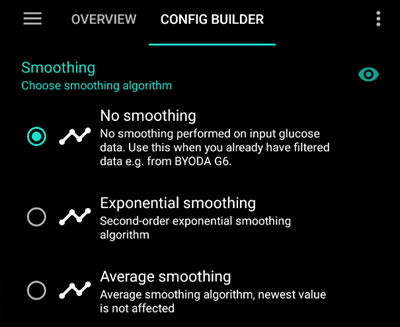

# 組態建置工具

根據你的設定，你可以透過**AAPS**螢幕頂部的選項卡或漢堡選單來開啟組態建置工具。


強調**組態建置工具**是用來開啟和關閉模組功能的選項卡。 在下面的圖片中，左側的方框 (A) 允許你選擇你想要啟動的模組，右側的方框 (C) 允許你將其作為**AAPS**中的一個選項卡 (E) 查看。 如果右側的方框未被啟動，你可以使用螢幕左上方的漢堡選單 (D) 來進入該功能。 請參閱下面的[選項卡或漢堡選單](#tab-or-hamburger-menu)。

當模組內有額外設定可用時，你可以點擊齒輪圖示 (B)，這將帶你進入偏好設定中的具體設定。


(Config-Builder-tab-or-hamburger-menu)=

## 標籤或選單

透過眼睛圖示下方的選框，你可以決定如何開啟相應的程式區段。


```{contents}
:backlinks: entry
:depth: 2
```

(ConfigBuilder_Profile)=

## 設定檔

此模組無法停用，因為它是**AAPS**的核心部分。

請參閱[你的 AAPS 個人設定](../SettingUpAaps/YourAapsProfile.md)以基本了解你的**個人設定**中包含的內容。

(Config-Builder-insulin)=

## 胰島素


Select the type of insulin you are using.

More information to understand the Insulin Profile as shown in **AAPS** [here](#AapsScreens-insulin-profile).

### 胰島素類型差異

* The options 'Rapid-Acting Oref', Ultra-Rapid Oref', 'Lyumjev' and 'Free-Peak Oref' all have an exponential shape.
* For 'Rapid-Acting', 'Ultra-Rapid' and 'Lyumjev' the DIA is the only variable you can adjust by yourself, the time to peak is fixed. 
* Free-Peak allows you to adjust both the DIA and the time to peak, and must only be used by advanced users who know the effects of these settings. 
* The [insulin curve graph](#AapsScreens-insulin-profile) helps you to understand the different curves.

#### Rapid-Acting Oref


* recommended for Humalog, Novolog and Novorapid
* DIA = 至少 5.0 小時
* 峰值 peak = 75 minutes after injection (fixed, not adjustable)

#### Ultra-Rapid Oref


* recommended for FIASP
* DIA = 至少 5.0 小時
* 峰值 peak = 55 minutes after injection (fixed, not adjustable)

(Config-Builder-lyumjev)=

#### Lyumjev


* special insulin profile for Lyumjev
* DIA = 至少 5.0 小時
* 峰值 peak = 45 minutes after injection (fixed, not adjustable)

#### Free Peak Oref


* With the "Free Peak 0ref" profile you can individually enter the peak time. To do so click to cogwheel to enter advanced settings.
* The DIA is automatically set to 5 hours if it is not specified higher in the profile.
* This effect profile is recommended if an unbacked insulin or a mixture of different insulins is used.

(Config-Builder-bg-source)=

## 血糖來源

Select the blood glucose source you are using. See [BG Source](../Getting-Started/CompatiblesCgms.md) page for more setup information.


* [xDrip+](../CompatibleCgms/xDrip.md)
* [NSClient BG](../CompatibleCgms/CgmNightscoutUpload.md) - only if you know what you are doing, see [BG Source](../Getting-Started/CompatiblesCgms.md).
* [MM640g](../CompatibleCgms/MM640g.md)
* [Glimp](#libre1-using-glimp) - only version 4.15.57 and newer are supported
* [Build Your Own Dexcom App (BYODA)](#DexcomG6-if-using-g6-with-build-your-own-dexcom-app).
* [Poctech](../CompatibleCgms/PocTech.md)
* [Tomato App](#libre1-using-tomato) for MiaoMiao device
* [Glunovo App](https://infinovo.com/) for Glunovo CGM system
* Random BG: Generates random BG data (Demo mode only)

## 平滑



See [Smoothing blood glucose data](../CompatibleCgms/SmoothingBloodGlucoseData.md).

(Config-Builder-pump)=

## 幫浦

Select the pump you are using. See [Compatible pumps](../Getting-Started/CompatiblePumps.md) page for more setup information.


* [Dana R](../CompatiblePumps/DanaR-Insulin-Pump.md)
* Dana R Korean (for domestic DanaR pump)
* Dana Rv2 (DanaR pump with unofficial firmware upgrade)
* [Dana-i/RS](../CompatiblePumps/DanaRS-Insulin-Pump.md)
* [Accu Chek Insight](../CompatiblePumps/Accu-Chek-Insight-Pump.md)
* Accu Chek Combo 
  * [Driver using Ruffy](../CompatiblePumps/Accu-Chek-Combo-Pump.md) (requires ruffy installation)
  * [Driver with no additional requirement](../CompatiblePumps/Accu-Chek-Combo-Pump-v2.md), added in [AAPS v.3.2](#version3200)
* Omnipod for [Omnipod Eros](../CompatiblePumps/OmnipodEros.md)
* Dash for [Omnipod DASH](../CompatiblePumps/OmnipodDASH.md)
* [Medtronic](../CompatiblePumps/MedtronicPump.md)
* [Diaconn G8](../CompatiblePumps/DiaconnG8.md)
* [EOPatch2](../CompatiblePumps/EOPatch2.md)
* [Medtrum](../CompatiblePumps/MedtrumNano.md)
* Virtual pump: open loop - **AAPS** suggestions only 
  * as you make you first steps with **AAPS**, during the first [objectives](../SettingUpAaps/CompletingTheObjectives.md)
  * for pump which doesn't have any driver yet

## 敏感性偵測

Select the type of sensitivity detection. For more details of different designs please [read on here](../DailyLifeWithAaps/SensitivityDetectionAndCob.md). This will analyze historical data on the go and make adjustments if it recognizes that you are reacting more sensitively (or conversely, more resistant) to insulin than usual. More details about the Sensitivity algorithm can be read in the [OpenAPS docs](https://openaps.readthedocs.io/en/latest/docs/Customize-Iterate/autosens.html).

You can view your sensitivity on the homescreen in an [additional graph](#AapsScreens-section-g-additional-graphs). You can view your sensitivity on the homescreen by selecting SEN and watching the white line. Note, you need to be in [Objective 8](#objectives-objective8) in order to let Sensitivity Detection/[Autosens](#Open-APS-features-autosens) automatically adjust the amount of insulin delivered. Before reaching that objective, the Autosens percentage / the line in your graph is displayed for information only.

### 吸收設定

If you use Oref1 with **SMB** you must change **min_5m_carbimpact** to 8. The value is only used during gaps in **CGM** readings or when physical activity "uses up" all the blood glucose rise that would otherwise cause **AAPS** to decay COB. At times when [carb absorption](../DailyLifeWithAaps/CobCalculation.md) can't be dynamically worked out based on your blood's reactions it inserts a default decay to your carbs. Basically, it is a failsafe.

(Config-Builder-aps)=

## APS

Select the desired APS algorithm for therapy adjustments. You can view the active detail of the chosen algorithm in the OpenAPS(OAPS) tab.

* OpenAPS AMA 
  * Advanced Meal Assist: older algorithm not recommended anymore.
  * In simple terms, the benefits are after you give yourself a meal bolus, the system can high-temp more quickly IF you enter carbs reliably.
* [OpenAPS SMB](#Open-APS-features-super-micro-bolus-smb) 
  * Super Micro Bolus: most recent algorithm recommended for all users.
  * In contrast to AMA, SMB does not use temporary basal rates to control glucose levels, but mainly small **Super Micro Boluses**.
  * Note : It is recommended to use this algorithm from the beginning, even though you will not actually get SMBs delivered until [Objective 9](#objectives-objective9).

If switching from AMA to SMB algorithm, *min_5m_carbimpact* must be changed manually to **8** (default value for SMB) in [Preferences > Sensitivity detection > Sensitivity Oref1 settings](../SettingUpAaps/Preferences.md).

## 循環

This module should not be disabled as it is a core part of **AAPS**.

## 約束條件

### 目標

**AAPS** has a learning program (a series of objectives) that you have to fulfill step by step. This should guide you safely through setting up a closed loop system. It guarantees that you have set everything up correctly and understand what the system does exactly. This is the only way you can trust the system.

See [Objectives](../SettingUpAaps/CompletingTheObjectives.md) page for more information.

## 同步選項

In this section, you can choose if/where you want **AAPS** to send your data to.

### NSClient 或 NSClientV3

Can be used as a [reporting server](../SettingUpAaps/SettingUpTheReportingServer.md) and/or for [remote monitoring](../RemoteFeatures/RemoteMonitoring.md), [remote control](../RemoteFeatures/RemoteControl.md).

See [Synchronization with the reporting server](#SetupWizard-synchronization-with-the-reporting-server-and-more) to help you choose between NSClient (v1) and NSClientV3.

### Tidepool

Can be used as a [reporting server](../SettingUpAaps/SettingUpTheReportingServer.md).

See [Tidepool](../SettingUpAaps/Tidepool.md).

### xDrip

Used to **send** data such as treatments to xDrip+.

### Open Humans

See [Open Humans](../SupportingAaps/OpenHumans.md).

### Wear

Monitor and control **AAPS** using your Android WearOS watch (see [page Watchfaces](../WearOS/WearOsSmartwatch.md)).

### 三星 Tizen

Broadcast data to Samsung's G-Watch Wear App (Tizen OS).

### Garmin

Connection to Garmin device (Fenix, Edge...)

## 治療

If you view the Treatments (Treat) tab, you can see the treatments that have been uploaded to nightscout. Should you wish to edit or delete an entry (e.g. you ate less carbs than you expected) then select 'Remove' and enter the new value (change the time if necessary) through the [carbs button on the home screen](#screens-bolus-carbs).

## 一般問題

### 首頁總覽

This is the [main screen](#AapsScreens-the-homescreen) of **AAPS** and can not be disabled.

#### 在治療對話框中顯示備註欄位

Choose if you want to have a notes field when entering treatments or not.

#### 狀態燈

Choose if you want to have [status lights](#Preferences-status-lights) on overview for cannula age, insulin age, sensor age, battery age, reservoir level or battery level. When warning level is reached, the color of the status light will switch to yellow. Critical age will show up in red.

#### 進階設定

**Deliver this part of bolus wizard result**: When using SMB, many people do not meal-bolus 100% of needed insulin, but only a part of it (e.g. 75 %) and let the SMB with UAM (unattended meal detection) do the rest. In this setting, you can choose a default value for the percentage the bolus wizard should calculate with. If this setting is 75 % and you had to bolus 10u, the bolus wizard will propose a meal bolus of only 7.5 units.

**Enable super bolus functionality in wizard** (It is different from *super micro bolus*!): Use with caution and do not enable until you learn what it really does. Basically, the basal for the next two hours is added to the bolus and a two hour zero-temp activated. **AAPS looping functions will be disabled - so use with care! If you use SMB AAPS looping functions will be disabled according to your settings in ["Max minutes of basal to limit SMB to"](#Open-APS-features-max-minutes-of-basal-to-limit-smb-to), if you do not use SMB looping functions will be disabled for two hours.** Details on super bolus can be found [here](https://www.diabetesnet.com/diabetes-technology/blue-skying/super-bolus).

(Config-Builder-actions)=

### 操作

A tab offering multiple buttons to take [actions](#screens-action-tab) in **AAPS**.

### 自動化

A tab for managing your [Automations](../DailyLifeWithAaps/Automations.md), starting at [Objective 10](#objectives-objective10).

(Config-Builder-sms-communicator)=

### SMS(簡訊) 通訊器

Allows remote caregivers to control some **AAPS** features via SMS, see [SMS Commands](../RemoteFeatures/SMSCommands.md) for more setup information.

### 食物

Displays the food presets defined in the Nightscout food database, see [Nightscout Readme](https://github.com/nightscout/cgm-remote-monitor#food-custom-foods) for more setup information.

Note: Entries cannot be used in the **AAPS** calculator. (View only)

(Config-Builder-wear)=

### Wear

Monitor and control AAPS using your Android Wear watch (see [page Watchfaces](../WearOS/WearOsSmartwatch.md)). Use settings (cog wheel) to define which variables should be considered when calculating bolus given though your watch (i.e. 15min trend, COB...).

If you want to bolus etc. from the watch then within "Wear settings" you need to enable "Controls from Watch".


Through Wear tab or hamburger menu (top left of screen, if tab is not displayed) you can

* Resend all data. Might be helpful if watch was not connected for some time and you want to push the information to the watch.
* Open settings on your watch directly from your phone.

### 維護

Access this tab to export / import settings.

### 組態建置工具

This current tab.