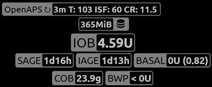

# Nightscout

(Nightscout-security-considerations)=

## 安全性考量

除了報告功能外，Nightscout 還可以用來控制 AAPS。 例如，你可以設定臨時目標或添加未來的碳水化合物。 這些資訊將由 AAPS 接收，並會據此作出相應的操作。 因此，值得考慮如何保護你的 Nightscout 網站安全。

如果使用 Nightscout 作為你的 AAPS 資料來源，請極為謹慎。

### Nightscout 設置

你可以使用 [身份驗證角色](https://nightscout.github.io/nightscout/security) 來拒絕公眾查看你的 Nightscout 網站：請確保僅與具有`readable` 權限的使用者共享 URL，絕不要與擁有`admin` 權限的使用者共享。

Nightscout 的 `API_SECRET` 是你網站的主要密碼：切勿公開分享他。

(Nightscout-aaps-settings)=

### AAPS 設置

你可以設置 AAPS 接收 Nightscout 指令（例如配置更改、治療等），或完全停用此功能。

* 查看 NSClient 或 NSClientV3 外掛設定，透過以下路徑 1) 主視圖 -> 組態建置工具 -> 同步 -> NSClient 齒輪圖示 2) NSCLIENT 標籤 -> 三點選單 -> 外掛偏好設定
* 啟用所有資料上傳到 Nightscout（3），這是標準方法，除非你的血糖資料來源是 Nightscout。  
  如果你的 AAPS 血糖資料來源是 Nightscout，則**不要**啟用上傳血糖資料到 Nightscout (3)。
* 除非 Nightscout 是你的血糖資料來源，否則請不要啟用接收/回填資料 (4)。

#### 不要從 Nightscout 同步

停用這些選項可確保 AAPS 不會使用來自 Nightscout 的任何更改。

#### 接受來自 Nightscout 的變更

啟用這些選項允許你透過 Nightscout 遠端更改 AAPS 設定，例如設定檔修改和切換、臨時目標以及添加碳水化合物，這些將被 AAPS 考慮在內。  
請注意，胰島素治療僅用於計算，例如“僅紀錄，不進行注射”。

### 進一步的安全設置

保持你的手機最新，如[安全第一](#preparing-safety-first)所述。

(Nightscout-manual-nightscout-setup)=

## 手動 Nightscout 設置

假設你已經有一個 Nightscout 網站，如果還沒有，請查看 [Nightscout](http://nightscout.github.io/nightscout/new_user/) 頁面以獲取完整的設置說明，下列指示則是你需要添加到 Nightscout 網站的設置。 你的 Nightscout 網站需要至少是 15 版才能支援 AAPS 3.2，因此請確認你正在運作[最新版本](https://nightscout.github.io/update/update/#updating-your-site-to-the-latest-version)，否則你將在 AAPS 應用程序中收到錯誤訊息。

* [編輯你的變數](https://nightscout.github.io/nightscout/setup_variables/#nightscout-configuration)

* 添加或編輯變數如下：
  
  * `ENABLE` = `careportal boluscalc food bwp cage sage iage iob cob basal dbsize pushover pump openaps`
  * `DEVICESTATUS_ADVANCED` = `true`
  * `SHOW_FORECAST` = `openaps`
  * `PUMP_FIELDS` = `reservoir battery clock`
  * 可以設置各種警報來[監控幫浦](https://github.com/nightscout/cgm-remote-monitor#pump-pump-monitoring)，特別建議設置電池百分比的警報： 
    * `PUMP_WARN_BATT_P` = `51`
    * `PUMP_URGENT_BATT_P` = `26` 

* 儲存這些修改。 你的 Nightscout 網站現在應允許顯示這些 pills。 你可以在`SHOW_PLUGINS`中強制顯示這些 pills。
  
  * `SHOW_PLUGINS` = `careportal boluscalc food bwp cage sage iage iob cob basal dbsize pushover pump openaps`
  
  

## Nightscout 作為付費 SaaS（軟體即服務）

使用供應商的網站界面設置變數。 如有需要，請聯繫供應商的支援服務。