# 偏好設定

- **打開偏好設定**，點擊主畫面右上角的三點選單。

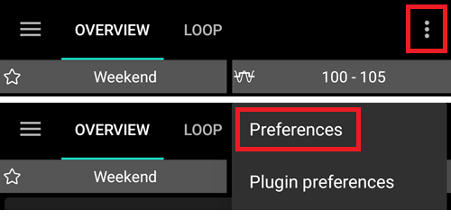

- 你可以直接跳至某個頁籤（例如幫浦頁籤）的偏好設定，方法是打開該頁籤並點擊外掛偏好設定。

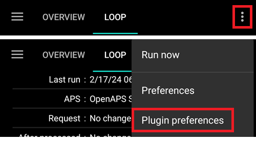

- **子選單**可透過點擊子選單標題下方的三角形來展開。

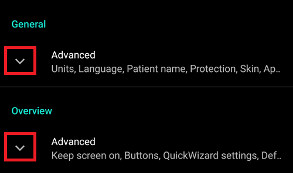

- 在偏好設定畫面頂部使用**篩選**功能，你可以快速查看特定偏好設定。 只需開始輸入你要查找的文本的一部分。

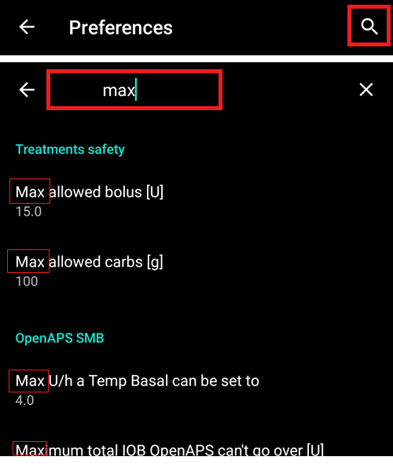

```{contents}
:backlinks: entry
:depth: 2
```

(Preferences-general)=
## 一般問題


**單位**

- 根據你的偏好設定單位為 mmol/l 或 mg/dl。

**語系**

- 新增選項可使用手機的預設語系（推薦）。

- 如果你希望**AAPS**使用不同於標準手機語言的語言，你可以從廣泛的選擇中選擇。

- 如果你使用不同的語言，有時可能會看到語言混合的情況。 這是由於 Android 的問題，覆蓋預設的 Android 語言有時不起作用。
- 在[簡易模式](#preferences-simple-mode)中隱藏的設置。

(preferences-simple-mode)= **簡易模式**

在首次安裝**AAPS**時，將預設啟用**簡易模式**。 在**簡易模式**中，大量設定將被隱藏，偏好設定將被預定義的數值取代。 [首頁上的額外圖表](#AapsScreens-section-g-additional-graphs)也為你預定義。 一旦你熟悉**AAPS**的用戶介面和設定，應該關閉簡易模式。

**患者名稱**

- 如果你需要區分多個設置（例如家中有兩個 T1D 小孩），可以使用此功能。
- 在 [雙錶面](../WearOS/WearOsSmartwatch.md) 中顯示。

(Preferences-skin)=
### 外觀

在[簡易模式](#preferences-simple-mode)中隱藏的設置。

你可以從四種類型的外觀中選擇：

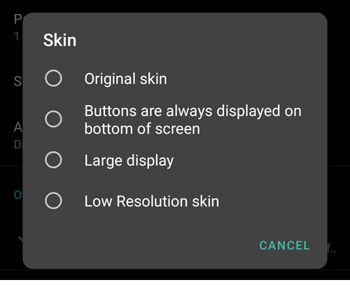

“低解析度外觀”帶有較短的標籤和省略年齡/等級，以在非常低解析度的螢幕上提供更多可用空間。

其他外觀之間的差異取決於手機的顯示方向：

#### 直向顯示

- **原始外觀**與**按鈕始終顯示在螢幕底部**相同
- **大型顯示**在所有圖表中高度增加，與其他介面相比較

#### 橫向顯示

- 使用**原始外觀**與**大顯示**時，你需要向下捲動才能看到螢幕底部的按鈕

- **大型顯示**在所有圖表中高度增加，與其他介面相比較


(Preferences-protection)=
## 保護

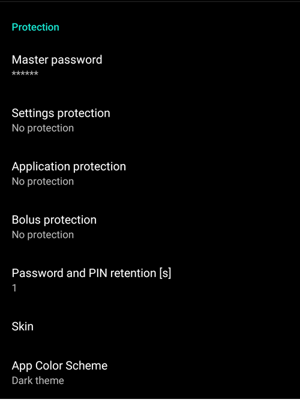

(Preferences-master-password)=
### 主密碼

出於安全要求，通常必須能夠[匯出設定](../Maintenance/ExportImportSettings.md)，因為從版本 2.7 開始它們是加密的。

**生物識別保護可能在 OnePlus 手機上無法運作。 這是部分 OnePlus 手機的已知問題。**


### 設定保護

- 用密碼或手機的生物識別身份驗證來保護你的設定（例如：[小孩正在使用**AAPS**](../RemoteFeatures/RemoteMonitoring.md)）。 如果你啟用此功能，每次你想要進入任何偏好設置相關視圖時，系統都會提示你進行身份驗證。

- 如果你希望使用主密碼僅用於保護[匯出設定](../Maintenance/ExportImportSettings.md)，則應使用自定義密碼，並為編輯偏好設置使用不同的密碼。

- 如果你使用自定密碼，請點擊「設定密碼」來設置密碼，如上文[所述](#Preferences-master-password)。

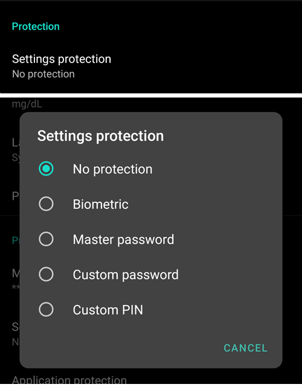

### 應用程式保護

如果應用程式受到保護，則必須輸入密碼或使用手機的生物識別身份驗證才能打開**AAPS**。

**AAPS**如果輸入錯誤密碼將立即關閉，但如果先前成功打開，將仍會在背景運行。

### 注射保護

- 如果**AAPS**被小孩使用，則注射保護可能會很有用，並且你可通過[SMS 進行注射](../RemoteFeatures/SMSCommands.md)。

- 在下圖示例中，你會看到生物辨識保護提示。 如果生物識別身份驗證無法運作，請在白色提示的上方點擊空白處並輸入主密碼。

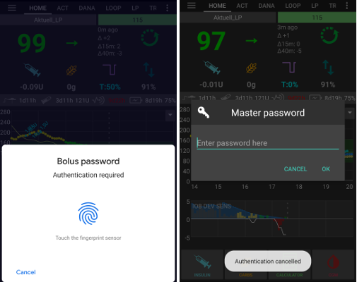

### 密碼和 PIN 保留

定義在你成功輸入密碼後，偏好設置或注射功能保持解鎖的時間（以秒為單位）。

## 首頁總覽

在**總覽**區域中，你可以定義首頁的偏好設定。

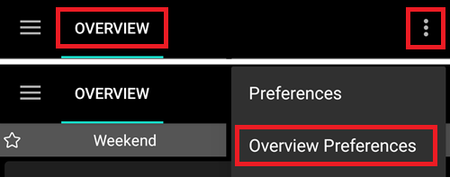

### 保持螢幕常亮

選項「保持螢幕常亮」將強制 Android 隨時保持螢幕亮起。 這對於演示等場合很有用。 但他會消耗大量電池電量。 因此，建議將智慧型手機連線到充電線。

(偏好設定-按鈕)=
### 按鈕

- 定義哪些按鈕在主螢幕底部可顯示。
- 在[簡易模式](#preferences-simple-mode)中隱藏的設置。


- **增量**選項允許你定義碳水化合物和胰島素對話框中三個按鈕的數量，方便輸入。


(Preferences-quick-wizard)=
### 快速嚮導

為某些標準餐點或小吃建立自訂按鈕，這些按鈕將顯示在首頁。 適用於經常食用的標準餐點。

對於每個按鈕，你定義碳水化合物和注射的計算方式。 然後，你定義該按鈕在首頁顯示的時間範圍 - 每個時段僅一個按鈕。 如果超出指定的時間範圍，或者如果你有足夠的IOB來覆蓋快速嚮導按鈕中定義的碳水化合物，則該按鈕不會顯示。 如果為不同餐點指定了不同的時間，你將根據一天中的時間，始終在主畫面上看到合適的標準餐點按鈕。


如果你點擊快速嚮導按鈕**AAPS**將根據你目前的比率計算並建議對應的注射量（考慮血糖值或設定的胰島素用量）。

該建議需要確認後才會注射胰島素。

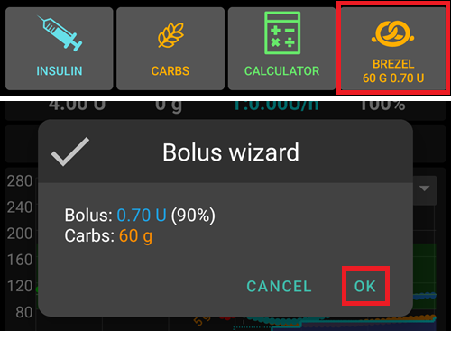

同一時間只能顯示一個快速嚮導按鈕。 如果你想執行不同的選項：長按當前顯示的快速嚮導按鈕。 這將帶你到所有快速嚮導選項的列表。 要執行某個選項，請長按它。 在執行之前，你必須確認。

(Preferences-default-temp-targets)=
### 預設臨時目標

在[簡易模式](#preferences-simple-mode)中隱藏的設置。

[臨時目標（TT）](../DailyLifeWithAaps/TempTargets.md)允許你在特定時間範圍內更改你的血糖目標。 設置預設TT時，你可以輕鬆更改活動、即將用餐等的目標。

在此，你可以為每個預設的TT更改目標和持續時間。 預設值為：

* 即將用餐：目標72 mg/dL / 4.0 mmol/l，持續時間45分鐘
* 活動：目標140 mg/dL / 7.8 mmol/l，持續時間90分鐘
* 低血糖：目標125 mg/dL / 6.9 mmol/l，持續時間45分鐘

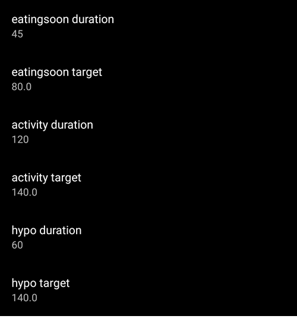

了解如何在這裡[啟用臨時目標](#TempTargets-where-can-i-select-a-temp-target)。

### 填充/啟動標準胰島素量

在[簡易模式](#preferences-simple-mode)中隱藏的設置。

如果你想透過**AAPS**填充管路或引導導管，你可以透過[**手動操作**標籤](#screens-action-tab)執行此操作。

可以在此對話框中定義預設值。 根據你的導管長度選擇填充/啟動對話框中的三個按鈕的預設量。

(Preferences-range-for-visualization)=
### 可視化範圍

選擇**AAPS**總覽和智慧型手錶上血糖圖表的高低標記。 這僅限於視覺化顯示，並非血糖的目標範圍。 範例：70 - 180 mg/dl 或 3.9 - 10 mmol/l


### 縮短標籤標題

在[簡易模式](#preferences-simple-mode)中隱藏的設置。

方便在螢幕上顯示更多的標籤名稱。

例如，“OpenAPS AMA”標籤變為“OAPS”，“OBJECTIVES”變為“OBJ”等。

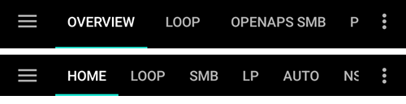

(Preferences-show-notes-field-in-treatments-dialogs)=
### 在治療對話框中顯示備註欄

在[簡易模式](#preferences-simple-mode)中隱藏的設置。

給你一個在治療（追加注射嚮導、碳水化合物、胰島素等）中添加簡短文字備註的選項。


(Preferences-status-lights)=
### 狀態燈

在[簡易模式](#preferences-simple-mode)中隱藏的設置。

狀態指示燈為以下情況提供視覺警告：:

- 傳感器使用時間
- 某些智慧讀取器的傳感器電池電量（詳情請參見[截圖頁面](#screens-sensor-level-battery)）。
- 胰島素的使用時間（儲液罐使用的天數）
- 儲液罐的剩餘容量（單位）
- 針頭的使用時間
- 幫浦電池壽命
- 幫浦電池電量（百分比）

如果超出警告門檻值，數值將顯示為黃色。 如果超出危急門檻值，數值將顯示為紅色。

最後一個選項允許你從Nightscout匯入那些設定（如果在那裡定義）。 詳情請參考[Nightscout文件](https://nightscout.github.io/nightscout/setup_variables/#age-pills)。

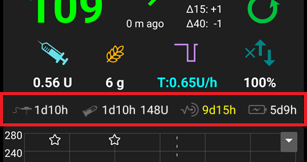

(Preferences-deliver-this-part-of-bolus-wizard-result)=
### 傳送一部分的注射嚮導結果

設置使用注射嚮導時計算的注射的[預設百分比](#AapsScreens-section-j)。

預設值為 100%：無需修正。 即便在這裡設置不同的值，你每次使用注射嚮導時仍然可以更改。 如果此設定為75%，而你必須注射10U，則注射嚮導將提出僅7.5單位的餐前注射。

使用[SMB](#objectives-objective9)時，許多人不會注射所需胰島素的100%，而只會注射部分（例如75%），並讓SMB以UAM（不在場用餐偵測）處理餘下的部分。 在這裡使用低於100%的值可能會有用：
* 對於消化緩慢的人來說：一次傳送所有的注射劑量可能會引起低血糖，因為胰島素的作用速度比消化快。
* 以便給**AAPS**留出更多空間自行處理**血糖上升**。 在這兩種情況下，**AAPS**將在需要時透過SMB來補償缺失的注射部分。

### 啟用的注射顧問

在[簡易模式](#preferences-simple-mode)中隱藏的設置。


啟用後，當你在高血糖狀態使用注射嚮導時，你將獲得警告，提示你是否想要預先注射，並在你的**BG**回到正常範圍時再進食。

### 啟用的注射提醒

在[簡易模式](#preferences-simple-mode)中隱藏的設置。

%待辦事項

(Preferences-advanced-settings-overview)=
### 進階設置（首頁總覽）


#### 超級注射

在[簡易模式](#preferences-simple-mode)中隱藏的設置。

選擇在注射嚮導中啟用超級注射的選項。

[超級注射](https://www.diabetesnet.com/diabetes-technology/blue-skying/super-bolus/)是一種「借用」接下來兩小時的基礎率部分胰島素來防止血糖尖峰的概念。 這與*超微量注射*不同！

使用時需謹慎，直到你了解它實際上的作用再啟用。 基本上，接下來兩個小時的基礎率將加到注射中，並啟用兩小時的0基礎率。 **AAPS 的循環功能將停用——請小心使用！** 如果你使用SMB**AAPS**的迴路功能將根據你在["最大基礎數分鐘限制SMB"](#Open-APS-features-max-minutes-of-basal-to-limit-smb-to)設定來禁用，如果不使用SMB則會禁用兩個小時。**有關超注射的詳細內容請參見[這裡](https://www.diabetesnet.com/diabetes-technology/blue-skying/super-bolus)。

## 治療安全

(preferences-patient-type)=
### 病人類型

- 安全限制是根據你在此設置中選擇的年齡設定的。
- 如果你開始觸及這些嚴格的限制（如最大注射量），那麼是時候提升一步了。
- 選擇高於實際年齡是一個不好的主意，因為這可能會因在胰島素對話框中輸入錯誤的數值（例如，跳過小數點）而導致過量。
- 如果你想知道這些硬編碼的安全限制的實際數字，請滾動到你在[這個頁面](../DailyLifeWithAaps/KeyAapsFeatures.md)上使用的算法功能。

### 允許的最大注射量

- 定義**AAPS**一次允許輸送的最大胰島素注射量（以胰島素單位計算）。
- 此設置作為安全限制，防止因意外輸入或用戶錯誤而導致大量注射。
- 建議將此設置為合理的數量，大致對應於你可能在一餐或校正劑量中需要的最大注射胰島素量。
- 這個限制也適用於注射計算機的結果。

### 允許的最大碳水化合物量

- 定義**AAPS**注射計算器允許劑量的最大碳水化合物量（以克計算）。
- 此設置作為安全限制，防止因意外輸入或用戶錯誤而導致大量注射。
- 建議將此設置為合理的數量，大致對應於你可能在一餐中需要的最大碳水化合物量。

## 循環

(Preferences-aps-mode)=
### APS模式
在開放循環、閉合循環和低血糖暫停 (LGS) 之間切換。


(Preferences-pen-loop)=
#### 開放循環
**AAPS**持續評估所有可用資料（IOB、COB、BG...）並在必要時提供治療建議（臨時基礎率），告訴你如何調整治療。

這些建議不會自動執行（如封閉迴路）。 建議必須由使用者手動輸入到幫浦中（如果使用虛擬幫浦）或透過按鈕輸入，如果**AAPS**連接到真實幫浦。

此選項是用於了解**AAPS**的運作方式或如果你使用不支援的幫浦。 無論你在這裡做出什麼選擇，直到**[目標5](#objectives-objective5)**結束之前，你都將處於開放迴路中。

(preferences-closed-loop)=
#### 閉合循環

**AAPS** 持續評估所有可用的資料（IOB、COB、血糖……）並在必要時自動調整治療（_即_ 無需你進一步干預）以達到設定的 [目標範圍或數值](#profile-glucose-targets) （注射給藥、臨時基礎率、停用胰島素以避免低血糖等）。

閉環系統在多個安全限制內運行，可以個別設置。

閉環系統僅在你達到 **[目標 6](#objectives-objective6)** 或更高時，並使用支援的幫浦時才能使用。

#### 低血糖暫停 (LGS)

在此模式中，[maxIOB](#Open-APS-features-maximum-total-iob-openaps-cant-go-over) 設定為零。

這意味著如果血糖下降，**AAPS** 可以為你減少基礎胰島素。 但是，如果血糖上升，則不會進行自動校正。 你的基礎率將保持在你當前**設定檔**中定義的值。 Only if IOB is negative (from a previous Low Glucose Suspend) additional insulin will be given to lower **BG**.

(Preferences-minimal-request-change)=
### 最小請求變更

使用 **開放環路** 時，你將在每次**AAPS** 建議調整基礎率時收到通知。 為了減少通知數量，你可以使用[更寬的血糖目標範圍](#profile-glucose-targets) 或增加最小請求率的百分比。 這定義了觸發通知所需的相對變更。

## 進階餐前注射助手（AMA）或超微量注射（SMB）

根據你在[組態建置工具 > APS](../SettingUpAaps/ConfigBuilder.md)中的設定，你可以選擇兩種算法：

- [進階餐前注射助手（OpenAPS AMA）](#Open-APS-features-advanced-meal-assist-ama) - 2017年的算法狀態
- [超微量注射（OpenAPS SMB)](#Open-APS-features-super-micro-bolus-smb) - 最推薦給初學者的最新算法

自[**AAPS**版本 3.3](#version3300)起，[動態 ISF](../DailyLifeWithAaps/DynamicISF.md)功能已移至 OpenAPS 微量注射的一部分。

### OpenAPS AMA

所有針對OpenAPS AMA的設置都在[關鍵AAPS功能 > 進階餐點輔助(AMA)](#Open-APS-features-advanced-meal-assist-ama)中詳細描述。

(Preferences-openaps-smb-settings)=
### OpenAPS SMB

所有針對OpenAPS SMB的設置都在[關鍵AAPS功能 > 超微量注射(SMB)](#Open-APS-features-super-micro-bolus-smb)中詳細描述。

## 吸收設定

(Preferences-min_5m_carbimpact)=
### min_5m_carbimpact

在[簡易模式](#preferences-simple-mode)中隱藏的設置。

該演算法使用BGI（血糖影響）來確定[碳水化合物的吸收](../DailyLifeWithAaps/CobCalculation.md)時間。

在無法根據你血液反應動態計算碳水化合物吸收的時候，**AAPS** 會為你的碳水化合物插入一個預設衰減值。 基本上，這是一個安全保護機制。 此值僅在**CGM** 讀數出現間隙或當身體活動“消耗掉”所有本來會引起**AAPS**衰減COB的血糖上升時使用。

簡單來說：演算法「知道」在目前胰島素劑量等影響下，你的血糖應該如何變化。 每當預期行為與實際行為有正向偏差時，部分碳水化合物會被吸收/衰減。 大的變化＝許多碳水化合物等。

min_5m_carbimpact 定義了每 5 分鐘的預設碳水化合物吸收影響。 更多詳情請參閱 [OpenAPS 文件](https://openaps.readthedocs.io/en/latest/docs/While%20You%20Wait%20For%20Gear/preferences-and-safety-settings.html?highlight=carbimpact#min-5m-carbimpact)。

AMA 的標準值為 5，SMB 的標準值為 8。

主畫面的 COB 圖表會在使用 min_5m_carbimpact 時顯示一個橙色圓圈。


### 餐點最大吸收時間

如果你經常進食高脂肪或高蛋白質餐點，你需要增加餐點吸收時間。

### 進階設定 - autosens 比例

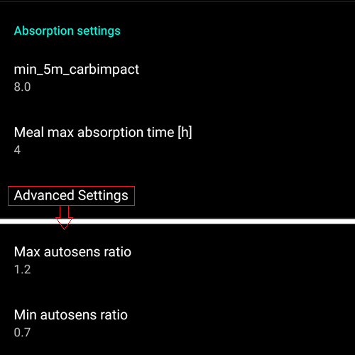

- 定義最小和最大[autosens](#Open-APS-features-autosens) 比例。
- 通常標準值（最大 1.2 和最小 0.7）不應更改。

## 幫浦

### 藍牙監控

如有必要，啟用藍牙監控（例如對於Dana幫浦）。 如果無法連線幫浦，他會關閉藍牙一秒鐘。 這可能對於某些藍牙系統卡住的手機可能會有幫助。

## 幫浦設定

此處的選項將根據你在[組態建置工具 > 幫浦](#Config-Builder-pump)中選擇的幫浦驅動程式而有所不同。  根據[幫浦相關說明](../Getting-Started/CompatiblePumps.md)配對並設置你的幫浦。

## Tidepool

詳細資訊請參閱專門的[Tidepool](../SettingUpAaps/Tidepool.md)頁面。

(Preferences-nsclient)=
## NSClient

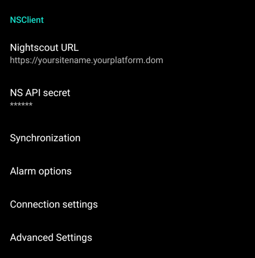

原始通訊協議，可用於舊版 Nightscout。

- 設置你的*Nightscout URL*（即 <https://yoursitename.yourplaform.dom>）。
- **確保網址末尾沒有 /api/v1/。**
- *[API 密鑰](https://nightscout.github.io/nightscout/setup_variables/#api-secret-nightscout-password)*（Nightscout 變數中紀錄的一個 12 字符的密碼）。
- 這使得資料能在Nightscout網站與**AAPS**之間讀取和寫入。
- 如果你在目標 1 中遇到困難，請再次檢查是否有拼寫錯誤。

## NSClientV3


[AAPS 3.2 引入的新協議](#Important-comments-on-using-v3-versus-v1-API-for-Nightscout-with-AAPS)。更安全且更高效。

```{admonition} V3 data uploaders
:class: warning

當使用 NSClientV3 時，所有上傳器必須使用 API V3。 由於大多數目前尚未相容，這意味著**你必須讓**AAPS**上傳所有資料**（BG、治療……）到Nightscout，並且如果其他上傳工具不符合V3標準，則必須禁用它們。
```

- 設置你的*Nightscout URL*（即 <https://yoursitename.yourplaform.dom>）。
- **確保網址末尾沒有 /api/v1/。**
- 在Nightscout中，建立一個*[管理員令牌](https://nightscout.github.io/nightscout/security/#create-a-token)*（需要[Nightscout 15](https://nightscout.github.io/update/update/)才能使用V3 API），並將其輸入**NS存取令牌**（不是你的API密鑰！）。
- 這使得資料能在Nightscout網站與**AAPS**之間讀取和寫入。
- 如果你在目標 1 中遇到困難，請再次檢查是否有拼寫錯誤。
- 保持啟用與 websockets 的連線（推薦）。

### 同步選項

同步選擇將取決於你希望如何使用**AAPS**。

你可以選擇[上傳和下載至 Nightscout 的資料](#Nightscout-aaps-settings)。

### 警報選項


- 警報選項允許你選擇透過應用程式使用哪些 Nightscout 警報。 **AAPS** 將在觸發Nightscout警報時發出警告。
- 要使警報發出聲音，你需要在[Nightscout 變數](https://nightscout.github.io/nightscout/setup_variables/#alarms)中設置緊急高、高、低和緊急低的警報值。
- 這些警報僅在你與 Nightscout 有連線時工作，且主要針對家長/照護者。
- 如果你在手機上有**CGM**來源（即xDrip+或BYODA），則應使用這些警報，而不是Nightscout警報。
- 從Nightscout創建的通知[公告](https://nightscout.github.io/nightscout/discover/#announcement)將在**AAPS**的通知欄中回顯Nightscout公告。
- 當在一定時間內未從 Nightscout 收到資料時，你可以更改過時資料和緊急過時資料警報的門檻值。

### 連線設定


- 連線設定定義了何時啟用與 Nightscout 的連線。
- 將 Nightscout 上傳限制為僅在 Wi-Fi 下進行，甚至僅限於特定的 Wi-Fi SSID。
- 如果你只想使用特定的Wi-Fi網路，可以輸入其Wi-Fi SSID。
- 多個 SSID 可以用分號分隔。
- 若要刪除所有 SSID，請在該欄位中輸入空格。

(Preferences-advanced-settings-nsclient)=
### 進階設定（NSClient）

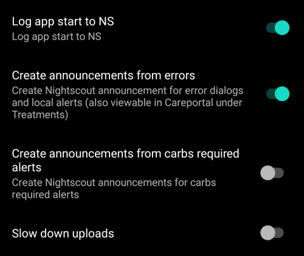

進階設定中的選項都非常直觀易懂。

## SMS(簡訊) 通訊器

詳細資訊請參閱專門的[簡訊命令](../RemoteFeatures/SMSCommands.md)頁面。

## 自動化

選擇要使用的定位服務：

- 使用被動位置：**AAPS**僅在其他應用要求時才會獲取位置
- 使用網路定位：你的 Wi-Fi 位置。
- 使用 GPS 定位（注意！ 可能會導致電池過度消耗！）

## 本地警報


設定應該是簡單明瞭的。

(preferences-maintenance-settings)=
## 維護設置


**電子郵件收件人**：日誌的標準收件人是<logs@aaps.app>。

**資料選擇**

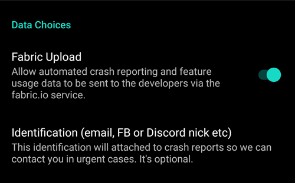

你可以通過向開發者發送崩潰報告來幫助進一步開發**AAPS**。

**自動設定匯出**<br/>啟用此功能後，你允許**AAPS**自動執行設定匯出，而無需用戶介入。 為此，主密碼 安全地存儲在你的手機中（僅限於下次手動匯出時）。 存儲的密碼將在最多 4 週內有效。 4 週後，你將收到通知，提示密碼即將過期。 在為期 1 週的寬限期內，可以透過 從維護選單手動匯出設定來刷新密碼。

在寬限期過期的 1 週後，存儲的密碼將過期，任何自動化設定匯出將中止，同時通知用戶，要求 重新輸入密碼。  [(**自動化設定匯出**)](../DailyLifeWithAaps/Automations.md#automating-preference-settings-export)將被記錄在 AAPS 的「照護入口」和「用戶輸入」列表下的治療項目中。

啟用此選項後，請確保執行一次手動設定匯出，屆時系統會要求你輸入密碼，以便**AAPS**能夠儲存它。

(preferences-maintenance-logdirectory)= 維護設定還包括**AAPS** 目錄，該目錄可以直接在維護選單中找到。 此設定允許用戶選擇電話上的一個目錄，**AAPS**將在該目錄中儲存偏好設定、日誌及其他檔案。


## Open Humans

你可以透過捐贈你的資料來協助研究項目，幫助社群！ 詳細資訊請參閱[Open Humans 頁面](../SupportingAaps/OpenHumans.md)。

在偏好設定中，你可以定義何時上傳資料
- 僅在連接到Wi-Fi時
- 僅在充電時
