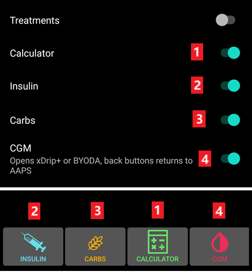
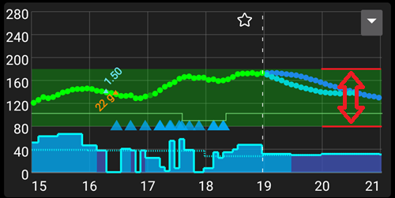

# 偏好設定

- **Open preferences** by clicking the three-dot menu on the top right side of the home screen.


- You can jump directly to preferences for a certain tab (i.e. pump tab) by opening this tab and clicking Plugin preferences.


- **Sub-menus** can be opened by clicking the triangle below the sub-menu title.


- With the **filter** on top of the preferences screen you can quickly access certain preferences. Just start typing part of the text you are looking for.


```{contents}
:backlinks: entry
:depth: 2
```

(Preferences-general)=
## 一般問題


**Units**

- Set units to mmol/l or mg/dl depending on your preferences.

**Language**

- New option to use phone's default language (recommended).

- In case you want **AAPS** in a different language than your standard phone language, you can choose from a broad variety.

- If you use different languages, you might sometimes see a language mix. This is due to an android issue where overriding the default android language sometimes doesn't work.

**Patient name**

- Can be used if you have to differentiate between multiple setups (i.e. two T1D kids in your family).

(Preferences-protection)=
### 保護


(Preferences-master-password)=
#### 主密碼

Mandatory to be able to [export settings](../Maintenance/ExportImportSettings.md) as they are encrypted from version 2.7.

**Biometric protection may not work on OnePlus phones. This is a known issue of OnePlus on some phones.**


#### 設定保護

- Protect your settings with a password or phone's biometric authentication (i.e. [child is using **AAPS**](../RemoteFeatures/RemoteMonitoring.md)). If you enable this feature, you will be prompted for authentication each time you want to access any Preferences related view.

- Custom password should be used if you want to use master password just for securing [exported settings](../Maintenance/ExportImportSettings.md), and use a different one for editing the preferences.

- 如果你使用自定密碼，請點擊「設定密碼」來設置密碼，如上文[所述](#Preferences-master-password)。


#### 應用程式保護

If the app is protected, you must enter the password or use the phone's biometric authentication to open **AAPS**.

**AAPS** will shut down immediately if a wrong password is entered - but will still run in background if it was previously opened successfully.

#### 注射保護

- Bolus protection might be useful if **AAPS** is used by a small child and you [bolus via SMS](../RemoteFeatures/SMSCommands.md).

- 在下圖示例中，你會看到生物辨識保護提示。 If biometric authentication does not work, click in the space above the white prompt and enter thr master password.


#### Password and PIN retention

Define how long (in seconds), the preferences or bolus functionalities remain unlocked after you successfully enter the password.

(Preferences-skin)=
#### 外觀
你可以從四種類型的外觀中選擇：


'Low resolution skin' comes with shorter labels and age/level removed to have more available space on a very low resolution screen.

Difference between the other skins depends on the phone's display orientation:

##### 直向顯示

- **原始外觀**與**按鈕始終顯示在螢幕底部**相同
- **Large Display** has an increased height for all graphs compared to other skins

##### 橫向顯示

- 使用**原始外觀**與**大顯示**時，你需要向下捲動才能看到螢幕底部的按鈕

- **Large Display** has an increased height for all graphs compared to other skins


## 首頁總覽

In the **Overview** section, you can define the preferences for the home screen.


### 保持螢幕常亮

Option 'Keep screen on' will force Android to keep the screen on at all times. This is useful for presentations etc. But it consumes a lot of battery power. Therefore, it is recommended to connect the smartphone to a charger cable.

(Preferences-buttons)=
### 按鈕

- Define which buttons are visible on the bottom of your home screen.



- The **Increment** options allow you to define the amount for the three buttons in the carb and insulin dialogues, for easy entry.


(Preferences-quick-wizard)=
### 快速嚮導

Create customized buttons for certain standard meals or snacks which will be displayed on the home screen. Useful for standard meals frequently eaten.

For each button, you define the carbs and calculation method for the bolus. Then, you define during which time period the button will be visible on your home screen - just one button per period. The button will not be visible if outside the specified time range or if you have enough IOB to cover the carbs defined in the QuickWizard button. If different times are specified for the different meals you will always have the appropriate standard meal button on the home screen, depending on the time of day.


If you click the quick wizard button **AAPS** will calculate and propose a bolus for those carbs based on your current ratios (considering blood glucose value or insulin on board if set up).

該建議需要確認後才會注射胰島素。


(Preferences-default-temp-targets)=
### 預設臨時目標

[Temporary targets (TT)](../DailyLifeWithAaps/TempTargets.md) allow you to change your blood glucose target for a certain time period. When setting a default TT, you can easily change your target for activity, eating soon etc.

Here you can change the target and the duration for each predefined TT. Preset values are:

* Eating soon: target 72 mg/dL / 4.0 mmol/l, duration 45 min
* Activity: target 140 mg/dL / 7.8 mmol/l, duration 90 min
* Hypo: target 125 mg/dL / 6.9 mmol/l, duration 45 min


Learn how to [activate Temp Targets here](#TempTargets-where-can-i-select-a-temp-target).

### 填充/啟動標準胰島素量

If you want to fill the tube or prime cannula through **AAPS** you can do this through the [**Actions** tab](#screens-action-tab).

可以在此對話框中定義預設值。 Choose the default amounts of the three buttons in fill/prime dialogue, depending on the length of your catheter.

(Preferences-range-for-visualization)=
### 可視化範圍

Choose the high and low marks for the BG-graph on **AAPS** overview and smartwatch. It is only the visualization, not the target range for your BG. Example: 70 - 180 mg/dl or 3.9 - 10 mmol/l



### 縮短標籤標題

Useful to see more tab titles on screen.

例如，“OpenAPS AMA”標籤變為“OAPS”，“OBJECTIVES”變為“OBJ”等。


(Preferences-show-notes-field-in-treatments-dialogs)=
### 在治療對話框中顯示備註欄

給你一個在治療（追加注射嚮導、碳水化合物、胰島素等）中添加簡短文字備註的選項。


(Preferences-status-lights)=
### 狀態燈

Status lights give a visual warning for:

- 傳感器使用時間
- 某些智慧讀取器的傳感器電池電量（詳情請參見[截圖頁面](#screens-sensor-level-battery)）。
- 胰島素的使用時間（儲液罐使用的天數）
- 儲液罐的剩餘容量（單位）
- 針頭的使用時間
- 幫浦電池壽命
- 幫浦電池電量（百分比）

If the warning threshold is exceeded, values will be shown in yellow. If the critical threshold is exceeded, values will be shown in red.

The last option allows you to import those settings from Nightscout if defined there. See [Nightscout documentation](https://nightscout.github.io/nightscout/setup_variables/#age-pills) for more information.


(Preferences-deliver-this-part-of-bolus-wizard-result)=
### 傳送一部分的注射嚮導結果

設置使用注射嚮導時計算的注射的[預設百分比](#AapsScreens-section-j)。

預設值為 100%：無需修正。 即便在這裡設置不同的值，您每次使用注射嚮導時仍然可以更改。 If this setting is 75 % and you had to bolus 10U, the bolus wizard will propose a meal bolus of only 7.5 units.

When using [SMB](#objectives-objective9), many people do not meal-bolus 100% of needed insulin, but only a part of it (e.g. 75 %) and let the SMB with UAM (Unattended Meal Detection) do the rest. Using a value lower than 100% here can be useful:
* 對於消化緩慢的人來說：一次傳送所有的注射劑量可能會引起低血糖，因為胰島素的作用速度比消化快。
* to leave more room to **AAPS** to deal by itself with **BG rise**. In both cases, **AAPS** will compensate for the missing part of the bolus with SMBs, if/when deemed adequate.

### Enabled bolus advisor


When enabled, when you use the bolus wizard as you are in hyperglycemia, you will get a warning, prompting you if you wish to pe-bolus and eat later, when your **BG** gets back in range.

### Enabled bolus reminder

% todo

(Preferences-advanced-settings-overview)=
### 進階設置（首頁總覽）


#### 超級追加注射

選擇在注射嚮導中啟用超級注射的選項。

[超級注射](https://www.diabetesnet.com/diabetes-technology/blue-skying/super-bolus/)是一種「借用」接下來兩小時的基礎率部分胰島素來防止血糖尖峰的概念。 It is different from *super micro bolus*!

Use with caution and do not enable it until you learn what it really does. 基本上，接下來兩個小時的基礎率將加到注射中，並啟用兩小時的0基礎率。 **AAPS looping functions will be disabled - so use with care! If you use SMB **AAPS** looping functions will be disabled according to your settings in ["Max minutes of basal to limit SMB to"](#Open-APS-features-max-minutes-of-basal-to-limit-smb-to), if you do not use SMB looping functions will be disabled for two hours.** Details on super bolus can be found [here](https://www.diabetesnet.com/diabetes-technology/blue-skying/super-bolus).

## 治療安全

(preferences-patient-type)=
### 病人類型

- 安全限制是根據你在此設置中選擇的年齡設定的。
- 如果你開始觸及這些嚴格的限制（如最大注射量），那麼是時候提升一步了。
- It's a bad idea to select higher than real age because it can lead to overdosing by entering the wrong value in the insulin dialog (by skipping the decimal dot, for example).
- 如果你想知道這些硬編碼的安全限制的實際數字，請滾動到你在[這個頁面](../DailyLifeWithAaps/KeyAapsFeatures.md)上使用的算法功能。

### Max allowed bolus

- Defines the maximum amount of bolus insulin, in insulin units, that **AAPS** is allowed to deliver at once.
- 此設置作為安全限制，防止因意外輸入或用戶錯誤而導致大量注射。
- 建議將此設置為合理的數量，大致對應於你可能在一餐或校正劑量中需要的最大注射胰島素量。
- 這個限制也適用於注射計算機的結果。

### Max allowed carbs

- Defines the maximum amount of carbs, in grams, that **AAPS** bolus calculator is allowed to dose for.
- 此設置作為安全限制，防止因意外輸入或用戶錯誤而導致大量注射。
- 建議將此設置為合理的數量，大致對應於你可能在一餐中需要的最大碳水化合物量。

## 循環

(Preferences-aps-mode)=
### APS模式
Switch between Open Loop, Closed Loop and Low Glucose Suspend (LGS).


(Preferences-pen-loop)=
#### Open Loop
**AAPS** continuously evaluates all available data (IOB, COB, BG...) and makes treatment suggestions (temporary basal rates) on how to adjust your therapy if necessary.

The suggestions will not be executed automatically (as in closed loop). The suggestions have to be enacted by the user manually into the pump (if using virtual pump) or by using a button if **AAPS** is connected to a real pump.

This option is for getting to know how **AAPS** works or if you are using an unsupported pump. You will be in Open Loop, no matter what choice you make here, until the end of **[Objective 5](#objectives-objective5)**.

(preferences-closed-loop)=
#### Closed Loop

**AAPS** continuously evaluates all available data (IOB, COB, BG...) and automatically adjusts the treatment if necessary (_i.e._ without further intervention by you) to reach the set [target range or value](#profile-glucose-targets) (bolus delivery, temporary basal rate, insulin switch-off to avoid hypo etc.).

The Closed Loop works within numerous safety limits, which can be set individually.

Closed Loop is only possible if you are in **[Objective 6](#objectives-objective6)** or higher and use a supported pump.

#### Low Glucose Suspend (LGS)

In this mode, [maxIOB](#Open-APS-features-maximum-total-iob-openaps-cant-go-over) is set to zero.

This means that if blood glucose is dropping, **AAPS** can reduce the basal for you. But if blood glucose is rising, no automatic correction will be made. Your basal rates will remain the same as defined in your current **Profile**. Only if basal IOB is negative (from a previous Low Glucose Suspend) additional insulin will be given to lower **BG**.

(Preferences-minimal-request-change)=
### Minimal request change

When using **Open loop**, you will receive notifications every time **AAPS** recommends adjusting the basal rate. To reduce the number of notifications you can either use a [wider bg target range](#profile-glucose-targets) or increase the percentage of the minimal request rate. 這定義了觸發通知所需的相對變更。

## 進階餐前注射助手（AMA）或超微量注射（SMB）

Depending on your settings in [config builder](../SettingUpAaps/ConfigBuilder.md) you can choose between three algorithms:

- [進階餐前注射助手（OpenAPS AMA）](#Open-APS-features-advanced-meal-assist-ama) - 2017年的算法狀態
- [超微量注射（OpenAPS SMB)](#Open-APS-features-super-micro-bolus-smb) - 最推薦給初學者的最新算法
- [Dynamic ISF](../DailyLifeWithAaps/DynamicISF.md) - released in 2024, available starting at **[Objective 11](#objectives-objective11)**

### OpenAPS AMA

All the settings for OpenAPS AMA are described in the dedicated section in [Key AAPS Features > Advanced Meal Assist (AMA)](#Open-APS-features-advanced-meal-assist-ama).

(Preferences-openaps-smb-settings)=
### OpenAPS SMB

All the settings for OpenAPS SMB are described in the dedicated section in [Key AAPS Features > Super Micro Bolus (SMB)](#Open-APS-features-super-micro-bolus-smb).

### Dynamic ISF

All the settings for Dynamic ISF are described in the dedicated section in [Dynamic ISF](../DailyLifeWithAaps/DynamicISF.md).

## 吸收設定

(Preferences-min_5m_carbimpact)=
### min_5m_carbimpact

The algorithm uses BGI (blood glucose impact) to determine when [carbs are absorbed](../DailyLifeWithAaps/CobCalculation.md).

At times when carb absorption can’t be dynamically worked out based on your blood's reactions, **AAPS** inserts a default decay to your carbs. 基本上，這是一個安全保護機制。 This value is only used during gaps in **CGM** readings or when physical activity “uses up” all the blood glucose rise that would otherwise cause **AAPS** to decay COB.

簡單來說：演算法「知道」在目前胰島素劑量等影響下，你的血糖應該如何變化。 每當預期行為與實際行為有正向偏差時，部分碳水化合物會被吸收/衰減。 大的變化＝許多碳水化合物等。

min_5m_carbimpact 定義了每 5 分鐘的預設碳水化合物吸收影響。 更多詳情請參閱 [OpenAPS 文件](https://openaps.readthedocs.io/en/latest/docs/While%20You%20Wait%20For%20Gear/preferences-and-safety-settings.html?highlight=carbimpact#min-5m-carbimpact)。

AMA 的標準值為 5，SMB 的標準值為 8。

主畫面的 COB 圖表會在使用 min_5m_carbimpact 時顯示一個橙色圓圈。


### Meal max absorption time

如果你經常進食高脂肪或高蛋白質餐點，你需要增加餐點吸收時間。

### 進階設定 - autosens 比例


- 定義最小和最大[autosens](#Open-APS-features-autosens) 比例。
- 通常標準值（最大 1.2 和最小 0.7）不應更改。

## 幫浦

### 藍牙監控

Activate BT watchdog if necessary (e.g. for Dana pumps). It switches off bluetooth for one second if no connection to the pump is possible. This may help on some phones where the bluetooth stack freezes.

## 幫浦設定

此處的選項會根據你在[組態建置工具](#Config-Builder-pump)中選擇的幫浦驅動程式而有所不同。  Pair and set your pump up according to the [pump related instructions](../Getting-Started/CompatiblePumps.md).

## Tidepool

More information on the dedicated [Tidepool](../SettingUpAaps/Tidepool.md) page.

(Preferences-nsclient)=
## NSClient


原始通訊協議，可用於舊版 Nightscout。

- 設置你的*Nightscout URL*（即 <https://yoursitename.yourplaform.dom>）。
- **確保網址末尾沒有 /api/v1/。**
- *[API 密鑰](https://nightscout.github.io/nightscout/setup_variables/#api-secret-nightscout-password)*（Nightscout 變數中紀錄的一個 12 字符的密碼）。
- This enables data to be read and written between both the Nightscout website and **AAPS**.
- 如果你在目標 1 中遇到困難，請再次檢查是否有拼寫錯誤。

## NSClientV3


[AAPS 3.2 引入的新協議](#Important-comments-on-using-v3-versus-v1-API-for-Nightscout-with-AAPS)。更安全且更高效。

```{admonition} V3 data uploaders
:class: warning

當使用 NSClientV3 時，所有上傳器必須使用 API V3。 Since most are not compatible yet, this means **you must let **AAPS** upload all data** (BG, treatments, ...) to Nightscout and disable all other uploaders if they're not V3 compliant.
```

- 設置你的*Nightscout URL*（即 <https://yoursitename.yourplaform.dom>）。
- **確保網址末尾沒有 /api/v1/。**
- In Nightscout, create an *[Admin token](https://nightscout.github.io/nightscout/security/#create-a-token)* (requires [Nightscout 15](https://nightscout.github.io/update/update/) to use the V3 API) and enter it in the **NS access token** (not your API Secret!).
- This enables data to be read and written between both the Nightscout website and **AAPS**.
- 如果你在目標 1 中遇到困難，請再次檢查是否有拼寫錯誤。
- 保持啟用與 websockets 的連線（推薦）。

### 同步選項

Synchronization choices will depend on the way you will want to use **AAPS**.

你可以選擇[上傳和下載至 Nightscout 的資料](#Nightscout-aaps-settings)。

### 警報選項


- 警報選項允許你選擇透過應用程式使用哪些 Nightscout 警報。 **AAPS** will alarm when a Nightscout alarm triggers.
- 要使警報發出聲音，你需要在[Nightscout 變數](https://nightscout.github.io/nightscout/setup_variables/#alarms)中設置緊急高、高、低和緊急低的警報值。
- 這些警報僅在你與 Nightscout 有連線時工作，且主要針對家長/照護者。
- If you have the **CGM** source on your phone (i.e. xDrip+ or BYODA) then use those alarms instead of Nightscout Alarms.
- Create notifications from Nightscout [announcements](https://nightscout.github.io/nightscout/discover/#announcement) will echo Nightscout announcements in the **AAPS** notifications bar.
- 當在一定時間內未從 Nightscout 收到資料時，你可以更改過時資料和緊急過時資料警報的門檻值。

### 連線設定


- 連線設定定義了何時啟用與 Nightscout 的連線。
- 將 Nightscout 上傳限制為僅在 Wi-Fi 下進行，甚至僅限於特定的 Wi-Fi SSID。
- If you want to use only a specific Wi-Fi network you can enter its Wi-Fi SSID.
- 多個 SSID 可以用分號分隔。
- 若要刪除所有 SSID，請在該欄位中輸入空格。

(偏好設定-進階-設定-nsclient)=
### 進階設定（NSClient）


進階設定中的選項都非常直觀易懂。

## SMS(簡訊) 通訊器

More information on the dedicated [SMS Commands](../RemoteFeatures/SMSCommands.md) page.

## 自動化

選擇要使用的定位服務：

- Use passive location: **AAPS** only takes locations if other apps are requesting it
- 使用網路定位：你的 Wi-Fi 位置。
- 使用 GPS 定位（注意！ 可能會導致電池過度消耗！）

## 本地警報


設定應該是簡單明瞭的。

## 資料選項


You can help develop **AAPS** further by sending crash reports to the developers.

## 維護設置


日誌的標準收件人是 <logs@aaps.app>。

## Open Humans

你可以透過捐贈你的資料來協助研究項目，幫助社群！ 詳細資訊請參閱[Open Humans 頁面](../SupportingAaps/OpenHumans.md)。

In Preferences, you can define when data shall be uploaded
- only if connected to Wi-Fi
- 僅在充電時