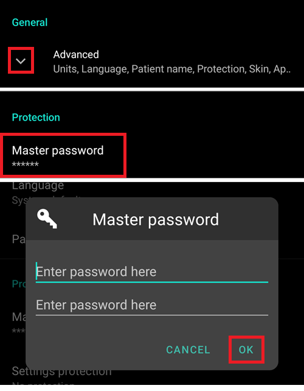
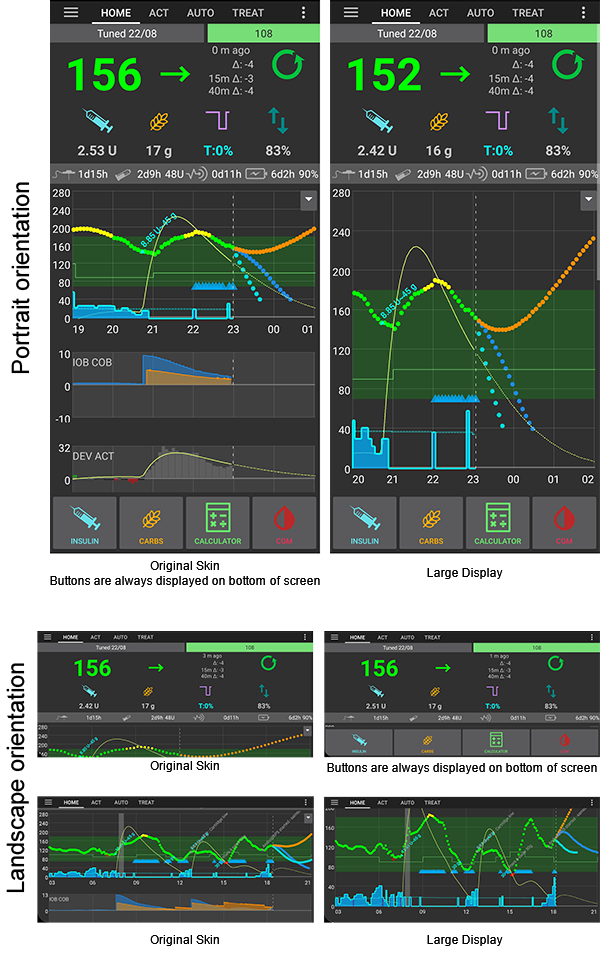
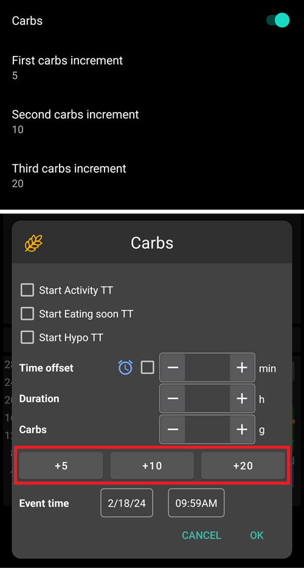
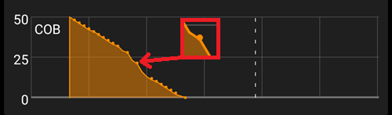

# 偏好設定

- **打開偏好設定**，點擊主畫面右上角的三點選單。

  

- 你可以直接跳至某個頁籤（例如幫浦頁籤）的偏好設定，方法是打開該頁籤並點擊外掛偏好設定。

  

- **子選單**可透過點擊子選單標題下方的三角形來展開。

  

- 在偏好設定畫面頂部使用**篩選**功能，你可以快速查看特定偏好設定。 只需開始輸入你要查找的文本的一部分。

  

```{contents}
:backlinks: entry
:depth: 2
```

(Preferences-general)=
## 一般問題


**單位**

- 根據你的偏好設定單位為 mmol/l 或 mg/dl。

**語系**

- 新增選項可使用手機的預設語系（推薦）。

- 如果你希望 AAPS 使用不同於手機的標準語系，可以選擇多種語系。

- 如果你使用多種語系，有時可能會看到語系混合的情況。 這是由於 Android 系統的問題，無法覆蓋 Android 預設語系。


**患者名稱**

- 如果你需要區分多個設置（例如家中有兩個 T1D 小孩），可以使用此功能。

(Preferences-protection)=
### 保護

(Preferences-master-password)=


#### 主密碼

- 從版本 2.7 開始，必須使用主密碼才能[匯出設定](../Maintenance/ExportImportSettings.md)，因為這些資料將加密。 **OnePlus 手機可能無法使用生物辨識保護。 這是部分 OnePlus 手機的已知問題。**

- 打開偏好設定（三點選單位於主畫面右上角）

- 點擊「一般」下方的三角形

- 點擊「主密碼」

- 輸入密碼，確認密碼並點擊「確定」。

  

#### 設定保護

- 使用密碼或手機的生物識別認證來保護您的設定（例如 [孩子正在使用 AAPS](../RemoteFeatures/RemoteMonitoring.md)）。

- 如果您希望僅為保護[匯出的設定](../Maintenance/ExportImportSettings.md)使用主密碼，則應使用自定義密碼。

- 如果你使用自定密碼，請點擊「設定密碼」來設置密碼，如上文[所述](#master-password)。

  

#### 應用程式保護

- 如果應用程式受到保護，你必須輸入密碼或使用手機的生物辨識驗證才能打開 AAPS。
- 若輸入錯誤密碼，應用程式將立即關閉，但如果先前已成功打開，則仍會在背景中運作。

#### 注射保護

- 如果 AAPS 被小孩使用，並且您[透過簡訊注射](../RemoteFeatures/SMSCommands.md)，則注射保護可能會很有用。

- 在下圖示例中，你會看到生物辨識保護提示。 如果生物辨識驗證無法運作，請點擊白色提示上方的空白處並輸入主密碼。

  

(Preferences-skin)=
#### 外觀

- 你可以從四種類型的外觀中選擇：

  

- 「低解析度外觀」具有較短的標籤，並且移除了年齡/等級，以在非常低解析度螢幕上提供更多可用空間。

- 其他外觀的差異取決於手機螢幕的方向。

##### 直向顯示

- **原始外觀**與**按鈕始終顯示在螢幕底部**相同
- **大顯示**的所有圖表大小均較其他外觀增大

##### 橫向顯示

- 使用**原始外觀**與**大顯示**時，你需要向下捲動才能看到螢幕底部的按鈕

- **顯示(大)**的所有圖表大小均較其他外觀增大

  

(Preferences-overview)=
## 首頁總覽

- 在首頁總覽部分中，你可以定義主畫面的偏好設定。

  

### 保持螢幕常亮

- 在進行展示時非常實用。
- 此功能將消耗大量電量，因此建議將手機插上充電器。

(Preferences-buttons)=
### 按鈕

- 定義哪些按鈕在主螢幕底部可顯示。

  

- 使用遞增數字，你可以定義三個按鈕在碳水化合物和胰島素對話框中的數量，以便於輸入。

  

  

(Preferences-quick-wizard)=
### 快速嚮導

- 如果你經常吃零食或餐前注射，你可以使用快速嚮導按鈕輕鬆輸入碳水化合物的數量並設置計算基礎。

- 在設置中，你可以定義按鈕在哪個時段會顯示在你的主螢幕上——每個時段僅顯示一個按鈕。

  

- 如果你點擊快速嚮導按鈕，AAPS會根據你目前的比例（考慮血糖值或體內已注射的胰島素，如果設置了）計算並推薦一個追加注射量。

- 該建議需要確認後才會注射胰島素。

  

(Preferences-default-temp-targets)=
### 預設臨時目標

- [臨時目標 (TT)](../DailyLifeWithAaps/TempTargets.md) 允許您在特定時間段內定義血糖目標的變更。

- 透過設置預設的TT，你可以輕鬆更改活動、即將用餐等目標。

  

- 在主螢幕右上角長按你的目標，或使用底部橙色“碳水化合物”按鈕中的快捷方式。

  

###

### 填充/啟動標準胰島素量

- 如果您想通過 AAPS 填充管路或啟動導管，您可以通過[行動選單](../DailyLifeWithAaps/AapsScreens.md#action-tab)來進行。
- 可以在此對話框中定義預設值。

(Preferences-range-for-visualization)=
### 可視化範圍

- 定義主螢幕上的圖表中應顯示的目標範圍，並填充綠色背景。

  

### 縮短標籤標題

- 在螢幕上查看更多標籤標題。

- 例如，“OpenAPS AMA”標籤變為“OAPS”，“OBJECTIVES”變為“OBJ”等。

  

### 在治療對話框中顯示備註欄

- 給你一個在治療（追加注射嚮導、碳水化合物、胰島素等）中添加簡短文字備註的選項。

  

(Preferences-status-lights)=
### 狀態燈

- 狀態指示燈為以下情況提供視覺警告：

  - 傳感器使用時間
  - 某些智慧讀取器的傳感器電池電量（詳情請參見[截圖頁面](../DailyLifeWithAaps/AapsScreens.md#sensor-level-battery)）。
  - 胰島素的使用時間（儲液罐使用的天數）
  - 儲液罐的剩餘容量（單位）
  - 針頭的使用時間
  - 幫浦電池壽命
  - 幫浦電池電量（百分比）

- 如果超過警告門檻值，數值將顯示為黃色。

- 如果超過危急門檻值警告，數值將顯示為紅色。

- 在AAPS 2.7版本之前，狀態燈設置必須在Nightscout設置中進行。

  

### 傳送一部分的注射嚮導結果

設置使用注射嚮導時計算的注射的[預設百分比](../DailyLifeWithAaps/AapsScreens.md#section-j)。

預設值為 100%：無需修正。 即便在這裡設置不同的值，您每次使用注射嚮導時仍然可以更改。

當使用[微量注射](../SettingUpAaps/CompletingTheObjectives.md#objective-9-enabling-additional-oref1-features-for-daytime-use-such-as-super-micro-bolus-smb)時，在這裡使用低於 100%的值可能會有幫助：
* 對於消化緩慢的人來說：一次傳送所有的注射劑量可能會引起低血糖，因為胰島素的作用速度比消化快。
* 為了留更多空間讓**AAPS**自行處理**血糖上升**。 在兩種情況下，**AAPS**將透過微量注射來補償缺失的注射部分，如果/當被認為合適時。

### 進階設置（首頁總覽）


(Preferences-superbolus)=
#### 超級追加注射

- 選擇在注射嚮導中啟用超級注射的選項。
- [超級注射](https://www.diabetesnet.com/diabetes-technology/blue-skying/super-bolus/)是一種「借用」接下來兩小時的基礎率部分胰島素來防止血糖尖峰的概念。

## 治療安全

### 病人類型

- 安全限制是根據你在此設置中選擇的年齡設定的。
- 如果你開始觸及這些嚴格的限制（如最大注射量），那麼是時候提升一步了。
- 選擇高於實際年齡是不好的主意，因為這可能會導致輸入胰島素對話框中錯誤的值（例如跳過小數點），從而導致過量注射。
- 如果你想知道這些硬編碼的安全限制的實際數字，請滾動到你在[這個頁面](../DailyLifeWithAaps/KeyAapsFeatures.md)上使用的算法功能。

### 允許的最大注射量 \[U\]

- 定義AAPS允許一次輸送的最大注射胰島素量。
- 此設置作為安全限制，防止因意外輸入或用戶錯誤而導致大量注射。
- 建議將此設置為合理的數量，大致對應於你可能在一餐或校正劑量中需要的最大注射胰島素量。
- 這個限制也適用於注射計算機的結果。

### 允許的最大碳水化合物量 \[g\]

- 定義AAPS注射計算機允許的最大碳水化合物量。
- 此設置作為安全限制，防止因意外輸入或用戶錯誤而導致大量注射。
- 建議將此設置為合理的數量，大致對應於你可能在一餐中需要的最大碳水化合物量。

## 循環

(Preferences-aps-mode)=
### APS模式

- 在開環和閉環以及低血糖暫停（LGS）之間切換
- **開環**意味著根據你的資料給出臨時基礎率（TBR）建議，並作為通知顯示。 經手動確認後，注射指令將傳輸到幫浦。 只有在使用虛擬幫浦時，才需要手動輸入。
- **閉環**意味著TBR建議會自動發送到你的幫浦，無需你的確認或輸入。
- **低血糖暫停**類似於閉環，但會將maxIOB設置覆蓋為零。 這意味著如果血糖下降，他可以減少基礎率，但如果血糖上升，則僅在基礎IOB為負數時（如來自之前的低血糖暫停）才會增加基礎率。

(Preferences-minimal-request-change)=
### 最小請求變更 \[%\]

- 使用開放循環時，當 AAPS 建議調整基礎率時，你會收到通知。
- 為減少通知數量，你可以使用更寬的血糖目標範圍或增加最小請求率的百分比。
- 這定義了觸發通知所需的相對變更。

(Preferences-advanced-meal-assist-ama-or-super-micro-bolus-smb)=
## 進階餐前注射助手（AMA）或超微量注射（SMB）

根據你的設置在[組態建置工具](../SettingUpAaps/ConfigBuilder.md)中，你可以在兩種算法之間進行選擇：

- [進階餐前注射助手（OpenAPS AMA）](../DailyLifeWithAaps/KeyAapsFeatures.md#advanced-meal-assist-ama) - 2017年的算法狀態
- [超微量注射（OpenAPS SMB)](../DailyLifeWithAaps/KeyAapsFeatures.md#super-micro-bolus-smb) - 最推薦給初學者的最新算法

### OpenAPS AMA設置

- 如果你可靠地輸入碳水化合物，則系統允許在注射餐後更快速地高溫調整。
- 有關設置和自動感應的更多細節，請參閱[OpenAPS 文件](https://openaps.readthedocs.io/en/latest/docs/Customize-Iterate/autosens.html)。

(偏好設定-max-u-h-a-temp-basal-可以設置為)=
#### 臨時基礎率（Temp Basal）最大可設置的U/h

- 作為安全限制存在，防止AAPS給予危險高的基礎率。
- 該值以每小時單位（U/h）測量。
- 建議將此設為合理的數值。 一個好的建議是取你的**最高基礎率**，並**將其乘以4**。
- 例如，如果你的最高基礎率為0.5 U/h，你可以將其乘以4得到2 U/h的值。
- 另見[詳細功能描述](../DailyLifeWithAaps/KeyAapsFeatures.md#max-uh-a-temp-basal-can-be-set-to-openaps-max-basal)。

#### OpenAPS可以輸送的最大基礎IOB \[U\]

- 允許在你的身體中累積的額外基礎胰島素（以單位計），超出你的正常基礎配置。
- 當達到此數值後，AAPS 會暫停提供額外的基礎胰島素，直到你的基礎胰島素剩餘量（IOB）再次下降到這個範圍內。
- 此值**不考慮注射IOB**，僅考慮基礎。
- 此值是根據你的正常基礎率獨立計算和監控的。 僅考慮超出正常率的額外基礎胰島素。

當你開始循環時，**建議將最大基礎IOB設為0**一段時間，同時你在適應系統。 這可以防止AAPS給予任何額外的基礎胰島素。 在此期間，AAPS仍然可以限制或關閉你的基礎胰島素以幫助防止低血糖。 這是一個重要的步驟：

- 有一段時間可安全地習慣AAPS系統並監控其運作。
- 抓住機會完美你的基礎配置和胰島素敏感性因子（ISF）。
- 了解AAPS如何限制你的基礎胰島素以防止低血糖。

當你感到舒適時，你可以透過提高最大基礎IOB值允許系統開始給予你額外的基礎胰島素。 建議的指導原則是取你設定檔中的**最高基礎速率**，並**將其乘以 3**。 例如，若你設定中的最高基礎速率為 0.5 U/h，你可以將此數值乘以 3，得到 1.5 U/h。

- 你可以從保守的數值開始，然後隨著時間慢慢增加。
- 這些僅是指導原則；每個人的身體狀況不同。 你可能會發現所需的劑量比這裡推薦的多或少，但一定要從保守的劑量開始，並慢慢調整。

**注意：作為一項安全功能，最大基礎胰島素持續劑量（Max Basal IOB）被嚴格限制為 7U。**

#### 自動敏感度調整 (Autosens)

- [Autosens](../DailyLifeWithAaps/KeyAapsFeatures.md#autosens) 會根據血糖偏差（正/負/中性）進行調整。
- 他會根據這些偏差計算出你對胰島素的敏感度或抗性，並根據偏差調整基礎速率和胰島素敏感指數（ISF）。
- 如果你選擇「Autosens 調整目標」，演算法也會修改你的血糖目標。

#### 進階設定（OpenAPS AMA）

- 通常你無需更改此對話框中的設定！
- 如果你仍然想要更改，請務必閱讀[OpenAPS 文件](https://openaps.readthedocs.io/en/latest/docs/While%20You%20Wait%20For%20Gear/preferences-and-safety-settings.html#)，並了解你在做什麼。

(Preferences-openaps-smb-settings)=
### OpenAPS SMB 設定

- 與 AMA 相比，[SMB](../DailyLifeWithAaps/KeyAapsFeatures.md#super-micro-bolus-smb) 不使用臨時基礎速率來控制血糖，而是主要使用小型超級微量注射。

- 你必須開始使用[目標 9](../SettingUpAaps/CompletingTheObjectives.md#objective-9-enabling-additional-oref1-features-for-daytime-use-such-as-super-micro-bolus-smb)來使用 SMB。

- 前三個設定在[上方](#max-uh-a-temp-basal-can-be-set-to)進行了解釋。

- 不同啟用選項的詳細資訊在[OpenAPS 功能部分](../DailyLifeWithAaps/KeyAapsFeatures.md#enable-smb)中描述。

- *SMB 的發放頻率（以分鐘為單位）*受限於預設每 4 分鐘發放一次。 此數值防止系統過於頻繁發放 SMB（例如當設定臨時目標時）。 除非你確切知道後果，否則不應更改此設定。

- 如果啟用了「敏感性提高目標」或「抗性降低目標」，[Autosens](../DailyLifeWithAaps/KeyAapsFeatures.md#autosens) 會根據你的血糖偏差修改血糖目標。

- 如果目標被修改，會在主畫面以綠色背景顯示。

  

(Preferences-carb-required-notification)=
#### 碳水化合物需求通知

- 此功能僅在選擇 SMB 演算法時可用。

- 當系統偵測到需要碳水化合物時，會建議食用額外的碳水化合物。

- 在此情況下，你會收到一個可以延後 5、15 或 30 分鐘的通知。

- 此外，主畫面的 COB 部分也會顯示所需的碳水化合物量。

- 可定義一個門檻值——觸發通知所需的最小碳水化合物量。

- 如果有需要，碳水化合物需求通知可以推送到 Nightscout，屆時會顯示並廣播公告。

  

#### 進階設定（OpenAPS SMB）

- 通常你無需更改此對話框中的設定！
- 如果你仍然想要更改，請務必閱讀[OpenAPS 文件](https://openaps.readthedocs.io/en/latest/docs/While%20You%20Wait%20For%20Gear/preferences-and-safety-settings.html#)，並了解你在做什麼。

## 吸收設定


### min_5m_carbimpact

- 演算法使用血糖影響（BGI）來判斷碳水化合物何時被吸收。

- 這個數值只會在兩種情況下使用：一是 CGM 沒有讀到血糖資料時，二是運動消耗了所有本來會讓血糖上升的能量，這樣 AAPS 就不會減少 COB。

- 當無法動態計算碳水化合物吸收時，演算法會插入預設的碳水化合物衰減值。 基本上，這是一個安全保護機制。

- 簡單來說：演算法「知道」在目前胰島素劑量等影響下，你的血糖應該如何變化。

- 每當預期行為與實際行為有正向偏差時，部分碳水化合物會被吸收/衰減。 大的變化＝許多碳水化合物等。

- min_5m_carbimpact 定義了每 5 分鐘的預設碳水化合物吸收影響。 更多詳情請參閱 [OpenAPS 文件](https://openaps.readthedocs.io/en/latest/docs/While%20You%20Wait%20For%20Gear/preferences-and-safety-settings.html?highlight=carbimpact#min-5m-carbimpact)。

- AMA 的標準值為 5，SMB 的標準值為 8。

- 主畫面的 COB 圖表會在使用 min_5m_carbimpact 時顯示一個橙色圓圈。

  

### 最大餐點吸收時間

- 如果你經常進食高脂肪或高蛋白質餐點，你需要增加餐點吸收時間。

### 進階設定 - autosens 比例

- 定義最小和最大[autosens](../DailyLifeWithAaps/KeyAapsFeatures.md#autosens) 比例。
- 通常標準值（最大 1.2 和最小 0.7）不應更改。

## 幫浦設定

此處的選項會根據你在[組態建置工具](../SettingUpAaps/ConfigBuilder.md#pump)中選擇的幫浦驅動程式而有所不同。  根據幫浦相關的指示來配對並設定你的幫浦：

- [DanaR 胰島素幫浦](../CompatiblePumps/DanaR-Insulin-Pump.md)
- [DanaRS 胰島素幫浦](../CompatiblePumps/DanaRS-Insulin-Pump.md)
- [Accu Chek Combo 幫浦](../CompatiblePumps/Accu-Chek-Combo-Pump.md)
- [Accu Chek Insight 幫浦](../CompatiblePumps/Accu-Chek-Insight-Pump.md)
- [Medtronic 幫浦](../CompatiblePumps/MedtronicPump.md)

如果使用 AAPS 進行開環模式，請確保你已在組態建置工具中選擇虛擬幫浦。

(Preferences-nsclient)=
## NSClient


原始通訊協議，可用於舊版 Nightscout。

- 設置你的*Nightscout URL*（即 <https://yoursitename.yourplaform.dom>）。
  - **確保網址末尾沒有 /api/v1/。**
- *[API 密鑰](https://nightscout.github.io/nightscout/setup_variables/#api-secret-nightscout-password)*（Nightscout 變數中紀錄的一個 12 字符的密碼）。
- 這使資料能夠在 Nightscout 網站和 AAPS 之間讀取和寫入。
- 如果你在目標 1 中遇到困難，請再次檢查是否有拼寫錯誤。

## NSClientV3


[AAPS 3.2 引入的新協議](../Maintenance/ReleaseNotes.md#important-comments-on-using-v3-versus-v1-api-for-nightscout-with-aaps)。更安全且更高效。

```{admonition} V3 data uploaders
:class: warning

當使用 NSClientV3 時，所有上傳器必須使用 API V3。 由於大多數尚不相容，這意味著 **你必須讓 AAPS 上傳所有資料**（BG、治療等）到 Nightscout，並停用所有不符 V3 的其他上傳器。
```

- 設置你的*Nightscout URL*（即 <https://yoursitename.yourplaform.dom>）。
  - **確保網址末尾沒有 /api/v1/。**
- 在 Nightscout 中，建立一個*[管理者憑證](https://nightscout.github.io/nightscout/security/#create-a-token)*（需要 [Nightscout 15](https://nightscout.github.io/update/update/) 才能使用 V3 API），並將其輸入**NS 查看憑證**（不是你的 API 密鑰！）。
- 這使資料能夠在 Nightscout 網站和 AAPS 之間讀取和寫入。
- 如果你在目標 1 中遇到困難，請再次檢查是否有拼寫錯誤。
- 保持啟用與 websockets 的連線（推薦）。

### 同步選項

同步選項將取決於你希望如何使用 AAPS。

你可以選擇[上傳和下載至 Nightscout 的資料](../SettingUpAaps/Nightscout.md#aaps-settings)。

### 警報選項


- 警報選項允許你選擇透過應用程式使用哪些 Nightscout 警報。 當 Nightscout 警報觸發時，AAPS 會發出警報。
  - 要使警報發出聲音，你需要在[Nightscout 變數](https://nightscout.github.io/nightscout/setup_variables/#alarms)中設置緊急高、高、低和緊急低的警報值。
  - 這些警報僅在你與 Nightscout 有連線時工作，且主要針對家長/照護者。
  - 如果你的 CGM 資料來自手機（如 xDrip+ 或 BYODA），請使用這些警報，而非 Nightscout 警報。
- 從 Nightscout 公告中建立通知[公告](https://nightscout.github.io/nightscout/discover/#announcement)，將在 AAPS 通知欄中回顯 Nightscout 公告。
- 當在一定時間內未從 Nightscout 收到資料時，你可以更改過時資料和緊急過時資料警報的門檻值。

### 連線設定


- 連線設定定義了何時啟用與 Nightscout 的連線。
- 將 Nightscout 上傳限制為僅在 Wi-Fi 下進行，甚至僅限於特定的 Wi-Fi SSID。
- 如果你只希望使用特定的 Wi-Fi 網路，可以輸入其 Wi-Fi SSID。
- 多個 SSID 可以用分號分隔。
- 若要刪除所有 SSID，請在該欄位中輸入空格。

(偏好設定-進階-設定-nsclient)=
### 進階設定（NSClient）


進階設定中的選項都非常直觀易懂。

## SMS(簡訊) 通訊器

- 僅當在[組態建置工具](../SettingUpAaps/ConfigBuilder.md#sms-communicator)中選擇 SMS 通訊器時才會顯示選項。
- 此設定允許透過傳簡訊指令來遠端控制應用程式，如暫停循環或進行注射。
- 更多資訊在[SMS 指令](../RemoteFeatures/SMSCommands.md)中描述。
- 透過使用身份驗證應用程式和憑證末端的額外 PIN 獲得額外的安全保障。

## 自動化

選擇要使用的定位服務：

- 使用被動定位：AAPS 僅在其他應用請求時獲取位置。
- 使用網路定位：你的 Wi-Fi 位置。
- 使用 GPS 定位（注意！ 可能會導致電池過度消耗！）

## 本地警報


- 設定應該是簡單明瞭的。

## 資料選項


- 你可以透過將崩潰報告發送給開發人員來幫助進一步開發 AAPS。

## 維護設置


- 日誌的標準收件人是 <logs@aaps.app>。

## Open Humans

- 你可以透過捐贈你的資料來協助研究項目，幫助社群！ 詳細資訊請參閱[Open Humans 頁面](../SupportingAaps/OpenHumans.md)。

- 在偏好設定中，你可以定義何時上傳資料

  - 僅在連線到 WiFi 時
  - 僅在充電時
