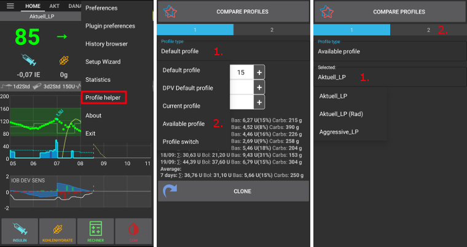

# 設定檔助手

設定檔助手提供兩個功能：

1. 為孩子們找到合適的設定檔
2. 比較兩個設定檔或設定檔切換，以便複製新的設定檔

## 兒童設定檔（適用於18歲以下）

**重要說明：**

**設定檔助手主要在幫助你為孩子找到初始設定檔。 儘管該助手基於兩家不同醫院的資料集，但在使用新設定檔前，請務必與你的醫療團隊討論。**

設定檔助手提供來自兩家不同醫院的資料集，幫助你為 18 歲以下的孩子找到初始設定檔。

1. 從螢幕右上角的三點選單中選擇「設定檔助手」。
2. 根據輸入的孩子年齡及總胰島素劑量（TDD）**或**體重，調整預設設定檔（基於醫院資料集）。
3. 點擊右側標有 2 的灰色條更換畫面。
4. 長按「目前設定檔」，然後選擇「DPV 預設設定檔」。

5. 根據輸入的孩子年齡、基礎速率百分比及總胰島素劑量（TDD）**或**體重，調整「DPV 預設設定檔」（基於另一家醫院資料集）。
6. 按下螢幕頂部的「比較設定檔」按鈕。
7. 會顯示兩個調整後的設定檔的比較結果。

當你對設定檔調整感到滿意時，可以按照以下描述[複製設定檔](#clone-profile)。

## 比較兩個設定檔

你還可以使用設定檔助手來比較兩個不同的設定檔或設定檔切換（之前在[設定檔切換](../DailyLifeWithAaps/ProfileSwitch-ProfilePercentage.md)中使用的一個設定檔的百分比）。

1. 從螢幕右上角的三點選單中選擇「設定檔助手」。
2. 長按「預設設定檔」，然後從列表中選擇「可用設定檔」或「設定檔切換」。
3. 長按設定檔/設定檔切換名稱（上圖中為「Aktuell_LP」），並從列表中選擇一個設定檔/設定檔切換。
4. 點擊右側標有 2 的灰色條更換畫面。

5. 預設情況下，「目前設定檔」將作為比較候選項目。
6. 如果你想要選擇不同的設定檔/設定檔切換，請長按「目前設定檔」，然後選擇「可用設定檔」或「設定檔切換」。
7. 長按設定檔/設定檔切換名稱（上圖中為「Aktuell_LP」），並從列表中選擇一個設定檔/設定檔切換。
8. 按下螢幕頂部的「比較設定檔」按鈕。
9. 會顯示兩個調整後的設定檔的比較結果。

(profilehelper-clone-profile)=
## 複製設定檔

您可以直接從設定檔助手複製一個設定檔/設定檔切換。

1. 按照上述說明選擇所需的設定檔/設定檔切換。
2. 如果你正在使用「預設設定檔」或「DPV 預設設定檔」（基於兒童醫院的資料集），請確保你輸入了正確的年齡、基礎速率百分比及總胰島素劑量/體重設定。
3. 按下螢幕底部的「複製」按鈕。
4. 按「確定」確認。
5. 在本地設定檔頁籤中啟用新設定檔。
