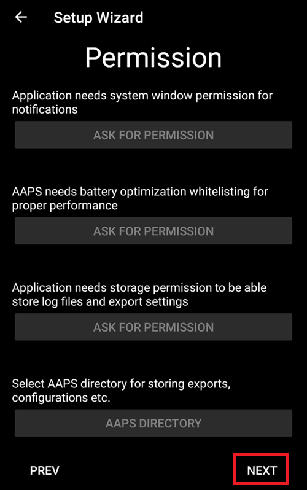
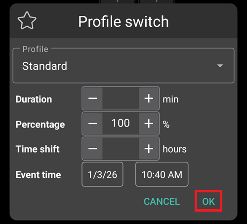
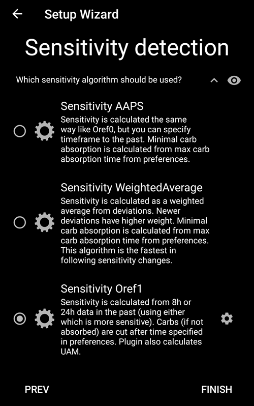

# AAPS設定嚮導

當你首次啟動**AAPS**時，系統會引導你使用「**設定嚮導**」，以便快速設置應用程式的所有基本配置。 **設定嚮導**會引導你，以避免遺忘某些關鍵內容。 例如，**權限設定**對於正確設置**AAPS** 是非常重要的。

不過，在首次使用**設定嚮導**時，並不一定需要完全配置所有內容，你可以輕鬆地退出嚮導，稍後再返回。 在**設定嚮導**之後，有三條路徑可供選擇以進一步優化/變更配置。 這些路徑將在下一部分進行解釋。 因此，如果你在設定嚮導中跳過了一些選項，沒關係，你可以輕鬆地稍後配置他們。

在使用**設定嚮導**期間及其後，你可能不會注意到**AAPS**中有任何顯著可見的變化。 要啟用你的**AAPS**循環，你必須遵循**目標**以啟用每一項功能。 你會在設定嚮導結束時開始**目標 1**。 你是**AAPS**的主導者，而不是相反。

```{admonition} Preview Objectives
:class: note
如果你想知道目標的結構，請閱讀[完成目標](../SettingUpAaps/CompletingTheObjectives.md)，然後先返回這裡運行設定嚮導。

```

從以往經驗中，我們知道新用戶經常會給自己施加壓力，希望儘快設置**AAPS**，這可能會導致挫折，因為這是個龐大的學習曲線。

因此，請花時間配置你的循環，運行良好的**AAPS**循環帶來的好處是巨大的。

```{admonition} Ask for Help
:class: note
如果文件中有錯誤或你對如何解釋某些內容有更好的想法，你可以按照[與其他用戶聯繫](../GettingHelp/WhereCanIGetHelp.md)的說明向社區尋求幫助。
```
## 歡迎訊息

這只是歡迎訊息，你可以透過點擊“下一步”按鈕跳過：


## 許可協議

在最終用戶授權協議中，有關於使用**AAPS**的法律事宜的重要訊息。 請仔細閱讀。

如果你不理解或無法同意最終用戶授權協議，請根本不要使用**AAPS**！

如果你暸解並同意，請點擊“我暸解並同意”按鈕並繼續設定嚮導：


## 必要的權限

**AAPS** 需要一些權限才能正常運行。

接下來的畫面會詢問幾個你必須同意的問題，才能讓 **AAPS** 正常運作。 嚮導本身會解釋為何需要相關設置。

在此畫面中，我們提供更多背景訊息，將更技術性的內容轉換為常用語系，或解釋其原因。 請繼續往下閱讀以查看每一項權限請求。


### Notifications

如果應用程式希望向你發送通知，Android需要特殊的許可。

雖然停用通知很方便_例如_來自社群媒體應用程式的通知，但你必須允許**AAPS**向你發送通知。

請點擊第一個「請求權限」按鈕：


選擇“AAPS”應用程式：


透過向右滑動滑塊來啟用“允許在其他應用程式上顯示”：


如果已啟用，滑塊應該看起來是這樣的：


### 電池優化

由於電池效能仍相當有限，智慧型手機的電量消耗需要特別留意。 因此，你的智慧型手機上的 Android 作業系統會對允許應用程式在背景執行並耗用 CPU 時間（也就是電量）採取較嚴格的限制。

然而，**AAPS** 需要定期運行，_例如_每幾分鐘接收血糖讀值，然後根據你的規範應用算法來決定如何處理你的血糖水平。 因此，必須讓Android允許一些權限。

你可以透過確認設置來完成這一操作。

點擊第二個「請求權限」按鈕。


請選擇“允許”：


### 儲存權限

**AAPS** 需要將訊息記錄到你的智慧型手機的永久儲存中。 永久儲存意味著即使重啟智慧型手機後，他仍然可用。 其他訊息則會遺失，因為他們沒有儲存到永久儲存中。

請點擊第一個「請求權限」按鈕：


點擊“允許”：


點擊「AAPS 目錄」。 這將開啟你手機上的檔案系統，讓你選擇希望 AAPS 儲存資訊的地方。


預設目錄是 **AAPS**，但你可以使用任何慣用的目錄。 如有必要，創建目錄，進入該目錄，並選擇「使用此資料夾」：


確認你希望授予 **AAPS** 存取所選目錄的權限：


點擊“下一步”按鈕：



### 位置

Android 將藍牙通訊的使用與定位服務的權限綁定在一起。 你可能在其他應用程式中也見過這一點。 因此，要存取藍牙時通常需要定位權限。

**AAPS** 會使用藍牙與你的 CGM 與胰島素幫浦通訊（前提是它們由 **AAPS** 直接控制，而不是透過 **AAPS** 所使用的其他 App）。 具體細節可能因設置而異。

請點擊第一個「請求權限」按鈕：


這很重要。 否則**AAPS**將完全無法正常運作。

點擊“使用應用程式時”：


點擊第二個「請求權限」按鈕：


選擇「始終允許」。


點擊“下一步”按鈕：


## 主密碼

由於**AAPS**的配置包含一些敏感資料（_例如_進入你的 Nightscout 伺服器的 API_KEY），因此這些資料會通過你在此設置的密碼進行加密。

第二句非常重要，請**不要遺失你的主密碼**。 請將其記下來_例如：_在 Google 雲端硬碟上。 Google雲端硬碟是一個不錯的地方，因為他由Google為你進行備份。 你的智慧型手機或電腦可能會崩潰，並且你可能沒有實際副本。 如果你忘記了主密碼，將很難在稍後找回你的個人設定和在**目標**上的進度。

填寫密碼兩次後，請點擊“下一步”按鈕：


## 單位 (mg/dL <-> mmol/L)

請選擇你的血糖數值單位為 mg/dL 或 mmol/L，然後點擊「下一步」按鈕：


## 顯示設置

 在這裡，你可以選擇傳感器顯示的血糖範圍，這將顯示在你設置的範圍內的“範圍內”數值。 你可以暫時保留預設值，稍後再進行編輯。

你選擇的值只會影響圖表的圖形展示，其他方面不會受到影響。

你的血糖目標_例如：_在你的個人設定中單獨配置。

你的TIR（範圍內時間）分析範圍在你的報告伺服器中單獨配置。

請按下“下一步”按鈕：


(SetupWizard-synchronization-with-the-reporting-server-and-more)=
## 與報告伺服器同步及更多設置

在這裡，你可以配置資料上傳到你的報告伺服器。

你也可以在這裡進行其他配置，但首次運作我們只會專注於報告伺服器。

如果你目前無法設置，請暫時跳過。 你可以稍後再進行配置。

如果你在左側勾選此項目，則可以在右側勾選可見性（眼睛）框，這將使此外掛置於**AAPS**主螢幕的上方選單中。 如果你在此處配置報告伺服器，請務必選擇顯示可見性。

在此示例中，我們選擇Nightscout作為報告伺服器，並將進行配置。

```{admonition}  **NSClient** version
:class: 注意

點擊 [這裡](#version3200) 查看 **AAPS** 3.2.0.0 的發布說明，其中解釋了第一選項 **NSClient**（這是「v1」，雖然未明確標記）和第二選項 **NSClient v3** 之間的差異。
```
對於Tidepool來說，這更簡單，因為你只需要你的個人登錄訊息。

選擇後，請按下你選擇項目旁邊的齒輪按鈕：


在這裡，你可以配置Nightscout報告伺服器。

請點擊“Nightscout URL”：


輸入你的Nightscout URL，這是你的個人Nightscout伺服器。 這只是你自己設置的URL，或者是從你的Nightscout服務提供商那裡獲得的。

請點擊“確定”按鈕：


輸入你的 Nightscout 存取權杖。 這是你配置的Nightscout伺服器的存取權杖。 沒有這個權杖，無法存取。

如果你目前沒有此文件，請查看**AAPS** 的文件以設置報告伺服器。

填入「Nightscout 存取權杖」並點選「確定」後，請再點擊「同步」按鈕：


若你已在前述設定嚮導步驟中完成 Nightscout 設定，請勾選「上傳資料到 NS」。

如果你在 Nightscout 上已存儲個人設定並希望將其下載到**AAPS**，請啟用「接收個人設定」：


返回上一個螢幕並選擇“警報選項”：


現在先不要啟用這些開關。 我們僅僅是走到螢幕前，讓你熟悉將來可能配置的選項。 目前還不需要設置他們。

返回上一個螢幕並選擇“連線設置”。

在這裡，你可以配置如何將資料傳輸到報告伺服器。

照顧者必須啟用「使用手機網路連線」，否則提供依賴者/孩子的智慧型手機無法在 WiFi 範圍外上傳資料_例如：_在上學的路上。

其他 **AAPS** 使用者可以禁用透過行動數據傳輸，以節省數據或電池。

如果不確定，建議保持所有選項啟用。

返回上一個螢幕並選擇“進階設置”。


如果你希望在報告伺服器中獲取應用程式啟動的相關訊息，請啟用“紀錄應用啟動到NS”。 這有助於你遠端了解應用程式是否已重新啟動，特別是作為照護者時。

查看**AAPS**當前是否正確配置可能會很有趣，但稍後通常不太重要能否在 Nightscout 中看到**AAPS**的啟動或停止。

啟用“從錯誤中建立公告”和“從需要碳水化合物警報中建立公告”。

保持“減慢上傳”為停用狀態。 只有在不尋常的情況下你才會使用它，例如當需要將大量信息傳輸到 Nightscout 伺服器時，而 Nightscout 伺服器處理這些數據的速度很慢。

返回兩次，回到外掛列表，然後選擇 "下一步" 以進入下一個螢幕：


## 患者名稱

在這裡你可以在**AAPS**中設置你的姓名。

這可以是任何名字。 他只是用來區分不同用戶。

為了簡單起見，只需輸入名字和姓氏。

按“下一步”進入下一個螢幕。


## 病人類型

在這裡你選擇你的「患者類型」，這點很重要，因為**AAPS**軟體根據患者的年齡有不同的限制。 這對安全至關重要。

在這裡你也配置**每餐最高允許注射量**。 也就是說，你在典型餐點中需要的最大注射量。 這是一個安全功能，用於幫助避免在餐前注射時發生意外的過量注射。

第二個限制與此類似，但涉及你預期的最大碳水化合物攝入量。

設置這些值後，請按“下一步”進入下一個螢幕：


## 使用的胰島素

選擇在幫浦中使用的胰島素類型。

胰島素名稱應該很好暸解。

```{admonition} Don't use the "Free-Peak Oref" unless you know what you are doing
:class: 危險
對於進階使用者或醫學研究，提供使用「自由高峰參數」定義胰島素作用的個性化設定的可能性。 除非你是一位專家，否則請不要使用它，通常預設值對每品牌胰島素運作良好。
```

按“下一步”進入下一個螢幕：


## 血糖來源

選擇你使用的血糖來源。 請閱讀你的[血糖資料來源](../Getting-Started/CompatiblesCgms.md)的文件。

由於有多個選項可用，因此我們不會在此詳細解釋所有選項的配置。 此處的範例我們使用 xDrip+：


在頂層選單右側勾選核取方塊以啟用顯示。

選擇後，按“下一步”進入下一個螢幕：


點擊齒輪按鈕以進入設定。

啟用“上傳血糖資料到NS”和“紀錄傳感器變更到NS”。

返回並按 "下一步" 以進入下一個螢幕：


(setup-wizard-profile)=
## 設定檔

現在我們進入設定嚮導中的一個非常重要的部分。

在嘗試在下一個畫面中輸入你的設定檔詳細資訊之前，請閱讀關於[設定檔](../SettingUpAaps/YourAapsProfile.md)的文件。

```{admonition} Working profile required - no exceptions here !
:class: danger
準確的設定檔對於控制**AAPS**的安全操作是必要的。

您必須與醫生討論並確定您的配置檔案，並透過成功的基礎率、ISF 和 IC 測試證明其有效！

如果一個機器人有錯誤的輸入，它將不斷失敗。 **AAPS** 只能使用所提供的訊息。 如果你的個人設定過強，則可能會面臨低血糖風險；如果過弱，則可能會面臨高血糖風險。 
```

按“下一步”進入下一個螢幕。 輸入一個“設定檔案名稱”：


長期來看，如果有需要，你可以擁有多個設定檔案。 這裡我們只建立一個。

```{admonition} Profile only for tutorial - not for your usage
:class: 資訊
這裡的實例個人設定僅顯示如何輸入資料。

它並不打算是一個準確的或非常優化的個人設定，因為每個人的需求差異很大。

不要用它進行實際循環！
```

請輸入你的[胰島素作用時間 (DIA)](#your-aaps-profile-duration-of-insulin-action)，以小時為單位。 然後按“IC”：


請輸入你的[胰島素與碳水化合物比例 (IC)](#your-aaps-profile-insulin-to-carbs-ratio)值：


按“ISF”。 請輸入你的[胰島素敏感度係數 (ISF)](#your-aaps-profile-insulin-sensitivity-factor)值：


按“基礎速率”。 請輸入你的[基礎胰島素值](#your-aaps-profile-basal-rates)：


按“TARG”。 輸入你的血糖目標值。

對於開放循環，此目標範圍可以更寬，否則**AAPS**會持續通知你更改臨時基礎率或其他設定，這可能會很累人。

稍後，對於閉環循環，你通常只會有一個上限和下限值。 這樣可以使**AAPS**更容易達到目標，並為你提供更好的整體糖尿病控制。

輸入/確認目標值：


點擊“儲存”來儲存設定檔案：


保存後，將顯示一個新按鈕「啟用設定檔」。

```{admonition} Several defined but only one active profile
:class: information
你可以定義多個設定檔案，但任何時刻只能啟用一個設定檔案。
```

按下“啟用設定檔案”：


設定檔案切換對話框出現。 在這種情況下，讓他保持預設。

```{admonition} Several defined but only one active profile
:class: information
你稍後將學習如何使用此通用對話框來處理疾病或運動等情況，在這些情況下，你需要更改適合情況的設定檔案。
```


按下“確定”：





設定檔案切換的確認對話框出現。

你可以按“確定”確認他。 按“下一步”進入下一個螢幕：


你的設定檔案現在已設置：


## 胰島素幫浦


現在你要選擇你的胰島素幫浦。

你會看到一個重要的警告對話框。 請閱讀並按“確定”。

如果你已經在之前的步驟中設置了設定檔案，並且知道如何連線幫浦，現在可以隨時連線他。

否則，請離開設置嚮導，使用左上角的箭頭，讓**AAPS**首先向你顯示一些血糖值。 你可以隨時返回或使用直接配置選項（不使用嚮導）。

請閱讀你[胰島素幫浦](../Getting-Started/CompatiblePumps.md)的文件。

按“下一步”進入下一個螢幕。


在此例中，我們選擇“虛擬幫浦”。

按“下一步”進入下一個螢幕：


## APS 演算法

選擇OpenAPS SMB演算法作為你的APS演算法。 儘管名稱如此，算法的 SMB 功能在你熟悉 AAPS 並已完成第一個目標之前是禁用的。 無論如何，OpenAPS SMB 相較於 OpenAPS AMA 更新且通常效果更好。

在初期，你的設定檔案通常不如經驗豐富後好，所以這個功能在初期被停用。 因為一開始系統設定的精準度通常不如使用一段時間後那麼高，因此該功能在初期會預設關閉。

```{admonition} Only use the older algorithm **OpenAPS AMA** if you know what you are doing
:class: 資訊
OpenAPS AMA 是最基本的算法，不支援微量注射來修正高值。 在某些情況下，使用此算法可能更好，但這不是推薦的做法。
```

按齒輪查看詳細資訊：


僅閱讀文本，此處不進行任何更改。

由於**目標**所施加的限制，你目前無法使用「關閉循環」或「SMB 功能」。

返回並按 "下一步" 以進入下一個螢幕：


## 敏感度偵測

讓「敏感度 Oref1」成為所選敏感度外掛的標準。

按“下一步”進入下一個螢幕：



## 開始目標1

你現在進入目標。 獲取更進階**AAPS**功能的資格。

我們從目標1開始，即使此刻我們的設置尚未完全準備好成功完成此目標。

但這是開始。

按下綠色的“開始”按鈕以開始目標1：


你會看到你已經取得了一些進展，但還有其他區域需要完成。

按“完成”進入下一個螢幕。


你即將進入**AAPS**的主螢幕。

在此你可以找到**AAPS**中設定個人設定的資訊消息。

這是在我們切換到新設定檔案時完成的。

你可以點擊“延後”，他會消失。


如果你在任何時候不小心離開設置嚮導，你可以簡單地重新啟動嚮導，或手動更改[AAPS 循環的配置](../SettingUpAaps/ChangeAapsConfiguration.md)。

如果你的**AAPS**循環現在已完全設置，請繼續下一部分[「完成目標」](../SettingUpAaps/CompletingTheObjectives.md)。