# AAPS設定嚮導

When you first start **AAPS** you are guided by the "**Setup Wizard**", to quickly setup all the basic configurations of your app in one go. **Setup Wizard** guides you, in order to avoid forgetting something crucial. For example, the **permission settings** are fundamental for setting up **AAPS** correctly.

However, it's not mandatory to get everything completely configured in the first run of using the **Setup Wizard** and you can easily exit the Wizard and come back to it later. There are three routes available after the **Setup Wizard** to further optimise/change the configuration. 這些路徑將在下一部分進行解釋。 因此，如果你在設定嚮導中跳過了一些選項，沒關係，你可以輕鬆地稍後配置他們。

During, and directly after using the **Setup Wizard** you may not notice any significant observable changes in **AAPS**. To enable your **AAPS** loop, you have to follow the **Objectives** to enable feature after feature. You will start **Objective 1** at the end of the Setup Wizard. You are the master of **AAPS**, not the other way around.

```{admonition} Preview Objectives
:class: note
If you are keen to know the structure of the objectives, please read [Completing the objectives](../SettingUpAaps/CompletingTheObjectives.md) but then come back here to run the Setup Wizard first.

```

From previous experience, we are aware that new starters often put themselves under pressure to setup **AAPS** as fast as possible, which can lead to frustration as it is a big learning curve.

So, please take your time in configuring your loop, the benefits of a well-running **AAPS** loop are huge.

```{admonition} Ask for Help
:class: note
如果文件中有錯誤或您對如何解釋某些內容有更好的想法，您可以按照[與其他用戶聯繫](../GettingHelp/WhereCanIGetHelp.md)的說明向社區尋求幫助。
```
## AAPS設定嚮導逐步指南
### 歡迎訊息

這只是歡迎訊息，你可以透過點擊“下一步”按鈕跳過：


### 許可協議

In the end user license agreement there is important information about the legal aspects of using **AAPS**. 請仔細閱讀。

If you don't understand, or can't agree to the end user license agreement please don't use **AAPS** at all!

如果你暸解並同意，請點擊“我暸解並同意”按鈕並繼續設定嚮導：


### 必要的權限

**AAPS** needs some requirements to operate correctly.

In the following screens you are asked several questions you have to agree to, to get **AAPS** working. 嚮導本身會解釋為何需要相關設置。

在此畫面中，我們提供更多背景訊息，將更技術性的內容轉換為常用語系，或解釋其原因。

請點擊“下一步”按鈕：


智慧型手機的電池消耗仍然是需要考慮的因素，因為電池性能仍然相當有限。 因此，智慧型手機上的Android操作系統在允許應用程式運作和消耗CPU時間（因此消耗電池電量）方面有嚴格的限制。

However, **AAPS** needs to run regularly, _e.g._ to receive the glucose readings every few minutes and then apply the algorithm to decide how to deal with your glucose levels, based on your specifications. 因此，必須讓Android允許一些權限。

你可以透過確認設置來完成這一操作。

請點擊“請求許可”按鈕：


請選擇“允許”：


如果應用程式希望向你發送通知，Android需要特殊的許可。

While it is a good feature to disable notifications _e.g._ from  social media apps, it is essential that you allow **AAPS** to send you notifications.

請點擊“請求許可”按鈕：


選擇“AAPS”應用程式：


透過向右滑動滑塊來啟用“允許在其他應用程式上顯示”：


如果已啟用，滑塊應該看起來是這樣的：


Android將藍牙通訊的使用與位置服務的使用權限相關聯。 你可能在其他應用程式中也見過這一點。 如果你想查看藍牙，通常需要位置權限。

**AAPS** uses bluetooth to communicate with your CGM and insulin pump if they are directly controlled by **AAPS** and not another app which is used by **AAPS**. 具體細節可能因設置而異。

請點擊“請求許可”按鈕：

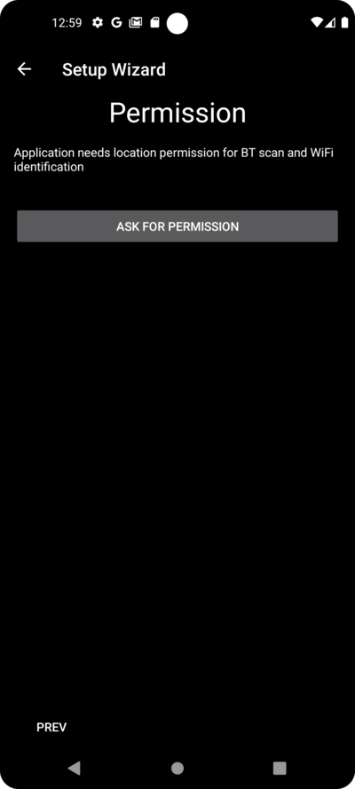

這很重要。 Otherwise **AAPS** can not work properly at all.

點擊“使用應用程式時”：


點擊“下一步”按鈕：


**AAPS** needs to log information to the permanent storage of your smartphone. 永久儲存意味著即使重啟智慧型手機後，他仍然可用。 其他訊息則會遺失，因為他們沒有儲存到永久儲存中。

請點擊“請求許可”按鈕：

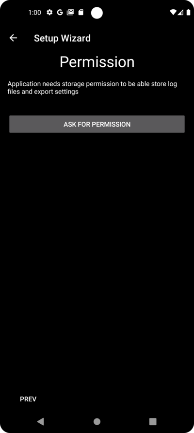

點擊“允許”：


你將被告知需要重新啟動智慧型手機以使更改生效。

Please **don't stop the Setup Wizard now**. 你可以在完成設定嚮導後再進行。

點擊“確定”然後點擊“下一步”按鈕：


### 主密碼

As the configuration of **AAPS** contains some sensitive data (_e.g._ API_KEY for accessing your Nightscout server) it is encrypted by a password you can set here.

The second sentence is very important, please **DO NOT LOSE YOUR MASTER PASSWORD**. Please make a note of it _e.g._ on Google Drive. Google雲端硬碟是一個不錯的地方，因為他由Google為你進行備份。 你的智慧型手機或電腦可能會崩潰，並且你可能沒有實際副本。 If you forget your Master Password, it can be difficult to recover your profile configuration and progress through the **Objectives** at a later date.

填寫密碼兩次後，請點擊“下一步”按鈕：


### Fabric上傳

在這裡，你可以設置自動崩潰和使用報告服務的使用。

這不是強制性的，但使用他是一種良好的做法。

他幫助開發人員更好地了解你如何使用應用程式，並告知他們發生了哪些崩潰。

他們將獲得：

1. 應用程式崩潰的資訊，否則他們無法知道，因為他們自己的設置中一切運作正常，並且
1. 發送的資料（崩潰訊息）中包含崩潰發生的情況以及使用了何種配置的相關訊息。

因此，這有助於開發人員改進應用程式。

請透過向右滑動滑塊來啟用“Fabric上傳”：


此外，你可以標識自己，以便在開發人員希望就問題或緊急關注事項聯繫你時能夠找到你：


填寫你的“聯絡訊息”後，點擊“確定”按鈕。 聯絡訊息可以是你在Facebook、Discord等平台上的身份訊息…… 只需提供你認為能透過最佳方式聯繫你的訊息：

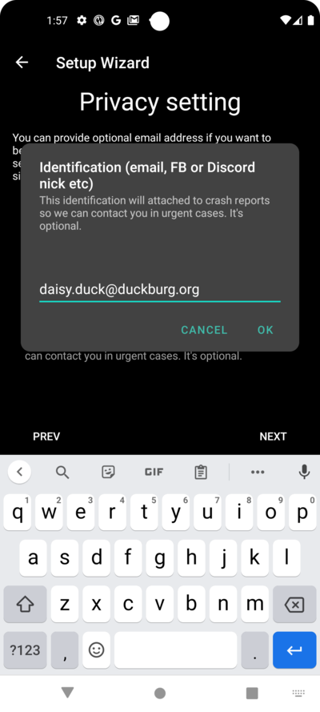

點擊“下一步”按鈕：


### Units (mg/dL <-> mmol/L)

請選擇你的血糖值是以 mg/dl 還是 mmol/L 為單位，然後點擊“下一步”按鈕：


### 顯示設置

 在這裡，你可以選擇傳感器顯示的血糖範圍，這將顯示在你設置的範圍內的“範圍內”數值。 你可以暫時保留預設值，稍後再進行編輯。

你選擇的值只會影響圖表的圖形展示，其他方面不會受到影響。

Your glucose target _e.g._ is configured separately in your profile.

你的TIR（範圍內時間）分析範圍在你的報告伺服器中單獨配置。

請按下“下一步”按鈕：


### 與報告伺服器同步及更多設置

在這裡，你可以配置資料上傳到你的報告伺服器。

你也可以在這裡進行其他配置，但首次運作我們只會專注於報告伺服器。

如果你目前無法設置，請暫時跳過。 你可以稍後再進行配置。

If you select an item here on the left tick box, on the right you can then ticking the visibility (eye) box, which will place this plugin in the upper menu on the **AAPS** home screen. 如果你在此處配置報告伺服器，請務必選擇顯示可見性。

在此示例中，我們選擇Nightscout作為報告伺服器，並將進行配置。

```{admonition}  Make sure to choose the correct **NSClient** version for your needs! 
:class: Note
Click [here](./Releasenotes.md) for the release notes of **AAPS** 3.2.0.0 which explain the differences between the top option **NSClient** (this is "v1", although it is not explicitly labelled) and the second option, **NSClient v3**. 

Nightscout users should choose **NSClient v3**, unless you want to monitor or send remote treatments (_e.g._ as a parent or caregiver using **AAPS** for a child) through Nightscout, in which case, choose the first option "**NSClient**" until further notice. 
```

對於Tidepool來說，這更簡單，因為你只需要你的個人登錄訊息。

選擇後，請按下你選擇項目旁邊的齒輪按鈕：


在這裡，你可以配置Nightscout報告伺服器。

請點擊“Nightscout URL”：


輸入你的Nightscout URL，這是你的個人Nightscout伺服器。 這只是你自己設置的URL，或者是從你的Nightscout服務提供商那裡獲得的。

請點擊“確定”按鈕：


輸入你的Nightscout存取權杖。 這是你配置的Nightscout伺服器的存取權杖。 沒有這個權杖，無法存取。

If you don't have it at the moment please check the documentation for setting up the reporting server in the **AAPS** documentation.

After filling in the "**NS access token**" and clicking "OK", please click on the "Synchronization" button:


如果你在設定嚮導的前幾步中已經配置了Nightscout，請選擇“上傳資料到NS”。

If you have stored profiles on Nightscout and want to download them to **AAPS**, enable "Receive profile store":


返回上一個螢幕並選擇“警報選項”：


現在先不要啟用這些開關。 我們只是介紹一下可能在未來配置的選項，讓你熟悉這些設定。 目前還不需要設置他們。

返回上一個螢幕並選擇“連線設置”。

在這裡，你可以配置如何將資料傳輸到報告伺服器。

Caregivers must enable "use cellular connection" as otherwise the smartphone which serves the dependant/child can not upload data outside of WiFi range _e.g._ on the way to school.

Other **AAPS** users can disable the tranfer via cellular connection if they want to save data or battery.

如果不確定，建議保持所有選項啟用。

返回上一個螢幕並選擇“進階設置”。


如果你希望在報告伺服器中獲取應用程式啟動的相關訊息，請啟用“紀錄應用啟動到NS”。 這有助於你遠端了解應用程式是否已重新啟動，特別是作為照護者時。

It might be interesting to see if **AAPS** is correctly configured now, but later it is usually not that important to be able to see **AAPS** stopping or starting in Nightscout.

啟用“從錯誤中建立公告”和“從需要碳水化合物警報中建立公告”。

保持“減慢上傳”為停用狀態。 你只會在特殊情況下使用他，例如當需要將大量資料傳輸到Nightscout伺服器時，而Nightscout伺服器處理資料速度較慢。

返回兩次，回到外掛列表，然後選擇 "下一步" 以進入下一個螢幕：


### 患者名稱

Here you can setup your name in **AAPS**.

這可以是任何名字。 他只是用來區分不同用戶。

為了簡單起見，只需輸入名字和姓氏。

按“下一步”進入下一個螢幕。

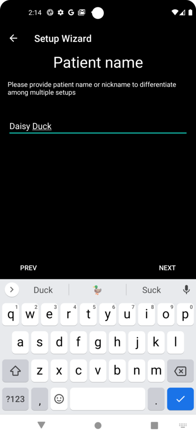

### 病人類型

Here you select your "Patient type" which is important, as the **AAPS** software has different limits, depending on the age of the patient. 這對安全至關重要。

Here is where you also configure the **maximum allowed bolus** for a meal. 也就是說，你在典型餐點中需要的最大注射量。 這是一個安全功能，用於幫助避免在餐前注射時發生意外的過量注射。

第二個限制與此類似，但涉及你預期的最大碳水化合物攝入量。

設置這些值後，請按“下一步”進入下一個螢幕：

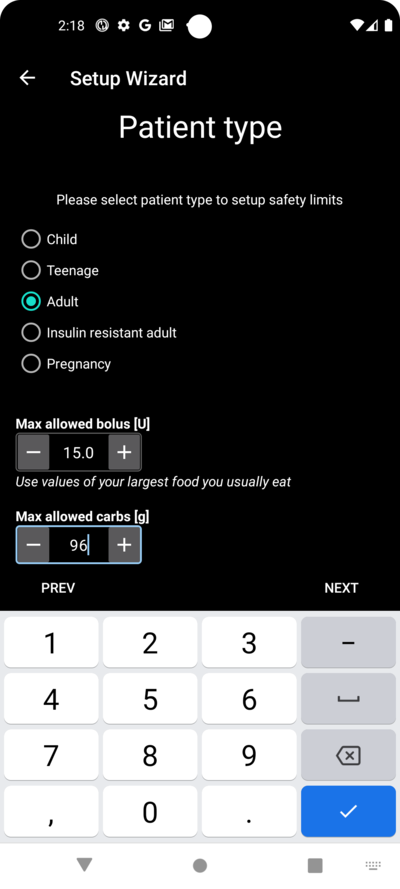

### 使用的胰島素

選擇在幫浦中使用的胰島素類型。

胰島素名稱應該很好暸解。

```{admonition} Don't use the "Free-Peak Oref" unless you know what you are doing
:class: danger
For advanced users or medical studies there is the possibility to define with "Free-Peak Oref" a customised profile of how insulin acts. Please don't use it unless you are an expert, usually the pre-defined values work well for each branded insulin.
```

按“下一步”進入下一個螢幕：


### 血糖來源

選擇你使用的血糖來源。 Please read the documentation for your [BG source](../Getting-Started/CompatiblesCgms.md).

由於有多個選項可用，因此我們不會在此詳細解釋所有選項的配置。 在這裡我們使用Dexcom G6與BYODA應用程式的示例：


如果你使用Dexcom G6與BYODA，請在頂層選單中點擊右側的勾選框來啟用可見性。

選擇後，按“下一步”進入下一個螢幕：

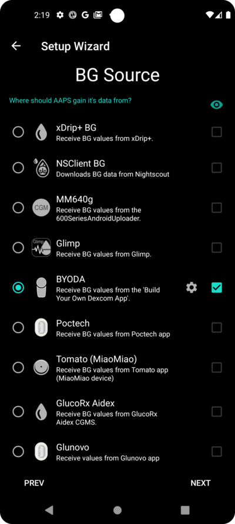


如果你正在使用 Dexcom G6 與 BYODA，點擊齒輪按鈕來讀取 BYODA 的設定。

啟用“上傳血糖資料到NS”和“紀錄傳感器變更到NS”。

返回並按 "下一步" 以進入下一個螢幕：


### 設定檔

現在我們進入設定嚮導中的一個非常重要的部分。

請在嘗試輸入以下畫面的設定檔案詳細資訊之前閱讀設定檔案的文件。

```{admonition} Working profile required - no exceptions here !
:class: danger
An accurate profile is necessary to control the safe action of **AAPS**

It's required that you have determined and discussed your profile with your doctor, and that it has been proven to work by successful basal rate, ISF and IC testing!

If a robot has an incorrect input it will fail - consistently. **AAPS** can only work with the information it is given. If your profile is too strong, you risk hypoglycemia, and if it is too weak, you risk hyperglycemia. 
```

按“下一步”進入下一個螢幕。 輸入一個“設定檔案名稱”：


長期來看，如果有需要，你可以擁有多個設定檔案。 這裡我們只建立一個。

```{admonition} Profile only for tutorial - not for your usage
:class: information
The example profile here is only to show you how to enter data.

It is not intended to be an accurate profile or something very well optimised, because each person's needs are so different.

Don't use it for actually looping!
```

輸入你的胰島素作用時間（DIA），單位為小時。 然後按“IC”：


輸入你的IC值：


按“ISF”。 輸入你的ISF值：

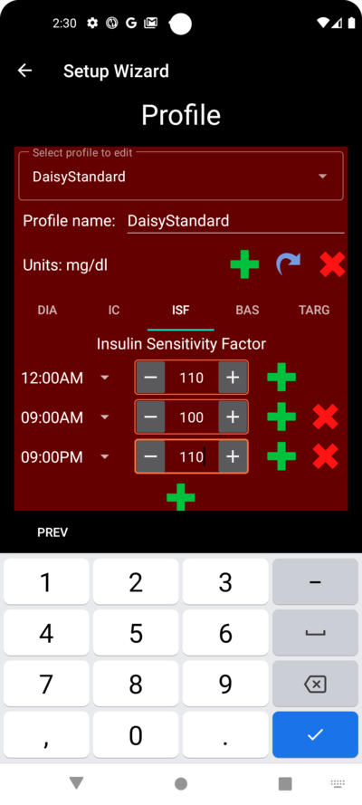


按“基礎速率”。 輸入你的基礎值：


按“TARG”。 輸入你的血糖目標值。

For open looping this target can be a wider range, as otherwise **AAPS** notifies you permanently to change the temporary basal rate or another setting, which can be exhausting.

稍後，對於閉環循環，你通常只會有一個上限和下限值。 That makes it easier for **AAPS** to hit the target and give you better overall diabetes control.

輸入/確認目標值：


點擊“儲存”來儲存設定檔案：

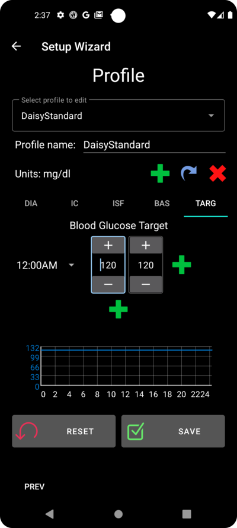


儲存後將出現一個新按鈕“啟用設定檔案”。

```{admonition} Several defined but only one active profile
:class: information
你可以定義多個設定檔案，但任何時刻只能啟用一個設定檔案。
```

按下“啟用設定檔案”：


設定檔案切換對話框出現。 在這種情況下，讓他保持預設。

```{admonition} Several defined but only one active profile
:class: information
你稍後將學習如何使用此通用對話框來處理疾病或運動等情況，在這些情況下，你需要更改適合情況的設定檔案。
```


按下“確定”：


設定檔案切換的確認對話框出現。

你可以按“確定”確認他。 按“下一步”進入下一個螢幕：

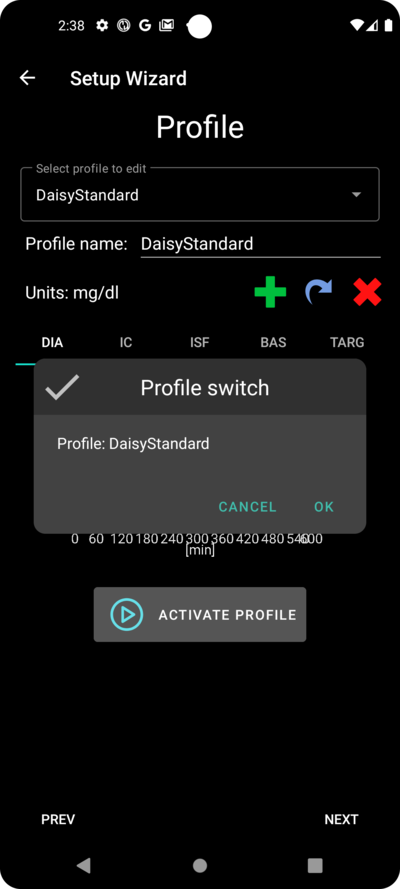

你的設定檔案現在已設置：


### 胰島素幫浦


現在你要選擇你的胰島素幫浦。

你會看到一個重要的警告對話框。 請閱讀並按“確定”。

如果你已經在之前的步驟中設置了設定檔案，並且知道如何連線幫浦，現在可以隨時連線他。

Otherwise, leave the Setup Wizard, using the arrow in the top left corner and let **AAPS** first show you some blood glucose values. 你可以隨時返回或使用直接配置選項（不使用嚮導）。

Please read the documentation for your [insulin pump](../Getting-Started/CompatiblePumps.md).

按“下一步”進入下一個螢幕。


在此例中，我們選擇“虛擬幫浦”。

按“下一步”進入下一個螢幕：


### APS 演算法

選擇OpenAPS SMB演算法作為你的APS演算法。 即使有這個名稱，SMB功能在你熟悉 **AAPS** 並完成第一階段目標之前是停用的。 無論如何，OpenAPS SMB 相較於 OpenAPS AMA 更新且通常效果更好。

在初期，你的設定檔案通常不如經驗豐富後好，所以這個功能在初期被停用。 由於在開始時，你的設定檔案通常不如經驗豐富後那麼好，因此該功能在初期被停用。

```{admonition} Only use the older algorithm **OpenAPS AMA** if you know what you are doing
:class: information
OpenAPS AMA is the most basic algorithm which does not support micro boluses to correct high values. There might be circumstances where it is better to use this algorithm but it is not the recommendation.
```

按齒輪查看詳細資訊：


僅閱讀文本，此處不進行任何更改。

Due to the limitations which are imposed by the **Objectives** you can't use either "closed loop" or "SMB features" at the moment anyway.

返回並按 "下一步" 以進入下一個螢幕：


### APS模式

讓“開放循環”保持選中狀態。

按“下一步”進入下一個螢幕：


### 敏感度偵測

讓“敏感度Oref1”保持為敏感度外掛的標準選項。

按“下一步”進入下一個螢幕：


### 開始目標1

你現在進入目標。 The qualification for access to further **AAPS** features.

我們從目標1開始，即使此刻我們的設置尚未完全準備好成功完成此目標。

但這是開始。

按下綠色的“開始”按鈕以開始目標1：

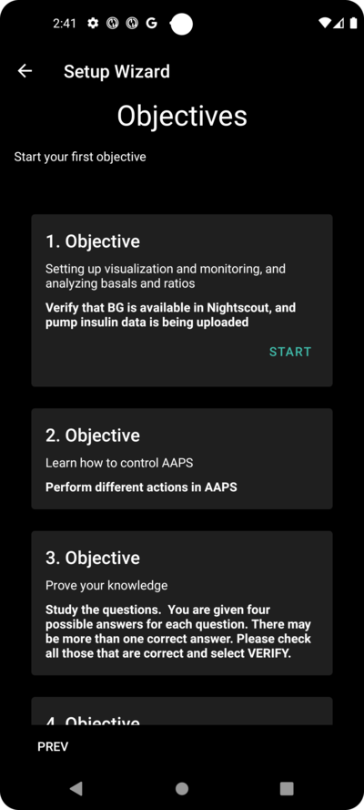

你會看到你已經取得了一些進展，但還有其他區域需要完成。

按“完成”進入下一個螢幕。

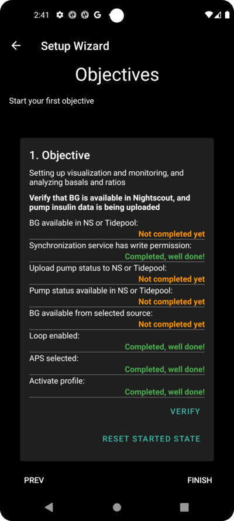

You are coming to the home screen of **AAPS**.

Here you find the information message in **AAPS** that you set your profile.

這是在我們切換到新設定檔案時完成的。

你可以點擊“延後”，他會消失。


If you accidentally leave the Setup Wizard at any point, you can either simply re-start the Wizard, or change the [configuration of the AAPS loop](../SettingUpAaps/ChangeAapsConfiguration.md) manually.

If your **AAPS** loop is now fully setup, please move on to the next section ["Completing the objectives"](../SettingUpAaps/CompletingTheObjectives.md).