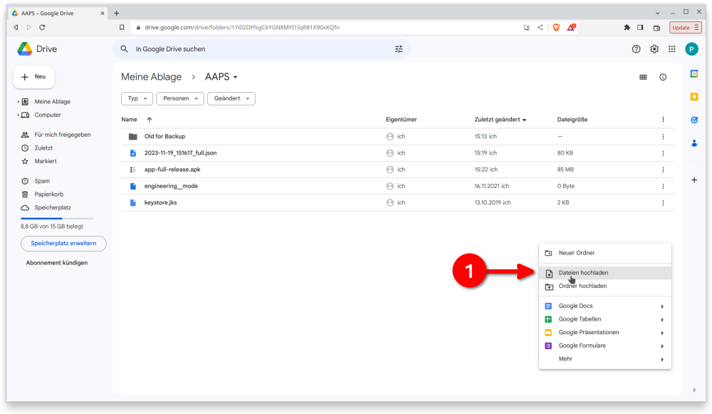

# 將 **AAPS** 傳輸並安裝到你的智慧型手機上

In the previous section, [building **AAPS**](../SettingUpAaps/BuildingAaps.md), you built the **AAPS** app (which is an .apk file) on a computer.

The next steps are to **transfer** the **AAPS** APK file (as well as other apps you may need, like BYODA, Xdrip+ or another CGM reciever app) to your Android smartphone, and then **install** the app(s).

Following installation of **AAPS** on the smartphone, you will then be able to move onto [**configuring the AAPS loop**](../SettingUpAaps/SetupWizard.md).

There are several ways to transfer the **AAPS** APK file from your computer to the smartphone. 在這裡，我們介紹兩種不同的傳輸方式：

* 選項 1 - 使用 Google 雲端硬碟 (Gdrive)
* 選項 2 - 使用 USB 傳輸線

請注意，透過電子郵件進行傳輸可能會導致問題，因此不建議使用此方式。

## 選項 1。 使用 Google 雲端硬碟來傳輸檔案

Open [Google.com](https://www.google.com/) in your web browser and login to your Google Account.

在右上方的 Google 選單中選擇雲端硬碟應用程式。


在 Google 雲端硬碟應用程式中，右鍵單擊檔案和資料夾下方的空白區域，然後選擇“上傳檔案”。



APK 檔案應該已經上傳到 Google 雲端硬碟。


### 使用 Google Drive 應用程式執行 apk 檔案以進行安裝。

切換到你的手機並啟動 Google 雲端硬碟應用程式。 他是預裝的應用程式，你可以在其他 Google 應用程式所在的位置找到他，或透過搜尋應用程式名稱來找到他。


在手機上的 Google 雲端硬碟應用程式中雙擊檔案名以啟動 APK 安裝。


如果你收到安全提示，表示目前不允許從 Google 雲端硬碟安裝應用程式，請臨時允許該操作，並在完成後取消此選項，因為長期啟用會帶來安全風險。


安裝完成後，你已完成這個步驟。

you should see the **AAPS** icon and be able to open the app.

```{warning}
**重要安全提示**
你是否記得取消從 Google 雲端硬碟安裝應用程式的允許權限？
```

Please go on with [configuring the AAPS loop](../SettingUpAaps/SetupWizard.md).

## 選項 2。 使用 USB 傳輸線來傳輸檔案
The second way to transfer the AAPS apk file is with a  [USB cable](https://support.google.com/android/answer/9064445?hl=en).

將檔案從電腦上的位置傳輸到手機的“下載”資料夾。

在手機上，你需要允許安裝來自未知來源的應用程式。 Explanations of how to do this can be found on the internet (_e.g._ [here](https://www.expressvpn.com/de/support/vpn-setup/enable-apk-installs-android/) or [here](https://www.androidcentral.com/unknown-sources)).

將檔案拖入後，在手機上打開“下載”資料夾，按下 **AAPS** APK 檔案並選擇“安裝”。 You can then proceed to the next step, [Setup Wizard](../SettingUpAaps/SetupWizard.md), which will help you setup the **AAPS** app and loop on your smartphone.

Please go on with [configuring the AAPS loop](../SettingUpAaps/SetupWizard.md).