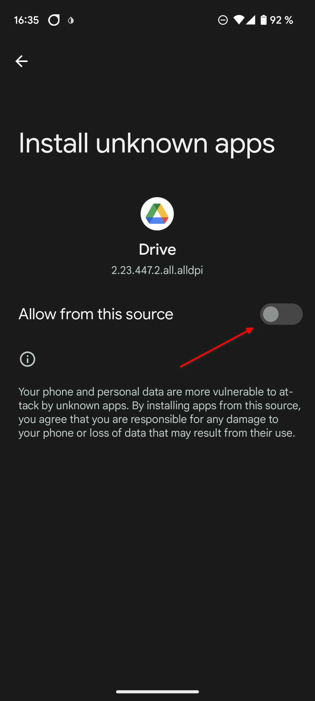

# 將 **AAPS** 傳輸並安裝到你的智慧型手機上

在上一部分[建立**AAPS**](../SettingUpAaps/BuildingAaps.md)中，你在電腦上建立了**AAPS**應用程式（這是一個.apk檔案）。

接下來的步驟是**轉移**這個**AAPS** APK 檔案（以及你可能需要的其他應用程式，如 BYODA、Xdrip+ 或其他 CGM 接收器應用）到你的 Android 智慧型手機，然後**安裝**應用程式。

在智慧型手機上安裝**AAPS**後，你將能夠進行[**AAPS 循環的配置**](../SettingUpAaps/SetupWizard.md)。

有幾種方法可以將**AAPS** APK 檔案從電腦轉移到智慧型手機。 在這裡，我們介紹兩種不同的傳輸方式：

* 選項 1 - 使用 Google 雲端硬碟 (Gdrive)
* 選項 2 - 使用 USB 傳輸線

請注意，透過電子郵件進行傳輸可能會導致問題，因此不建議使用此方式。

## 選項 1。 使用 Google 雲端硬碟來傳輸檔案

在你的網頁瀏覽器中打開[Google.com](https://www.google.com/)並登錄你的 Google 帳戶。

在右上方的 Google 選單中選擇雲端硬碟應用程式。


在 Google 雲端硬碟應用程式中，右鍵單擊檔案和資料夾下方的空白區域，然後選擇“上傳檔案”。


APK 檔案應該已經上傳到 Google 雲端硬碟。


### 使用 Google Drive 應用程式執行 apk 檔案以進行安裝。

切換到你的手機並啟動 Google 雲端硬碟應用程式。 他是預裝的應用程式，你可以在其他 Google 應用程式所在的位置找到他，或透過搜尋應用程式名稱來找到他。


在手機上的 Google 雲端硬碟應用程式中雙擊檔案名以啟動 APK 安裝。


如果你收到安全提示，表示目前不允許從 Google 雲端硬碟安裝應用程式，請臨時允許該操作，並在完成後取消此選項，因為長期啟用會帶來安全風險。




安裝完成後，你已完成這個步驟。

你應該能看到**AAPS**圖示並能夠打開應用程式。

```{warning}
**重要安全提示**
你是否記得取消從 Google 雲端硬碟安裝應用程式的允許權限？
```

請繼續[設定 AAPS 循環](../SettingUpAaps/SetupWizard.md)。

## 選項 2。 使用 USB 傳輸線來傳輸檔案
傳輸 AAPS apk 檔案的第二種方式是使用[USB 線](https://support.google.com/android/answer/9064445?hl=zh-TW)。

將檔案從電腦上的位置傳輸到手機的“下載”資料夾。

在手機上，你需要允許安裝來自未知來源的應用程式。 如何操作的解釋可以在網路上找到（_例如_ [這裡](https://www.expressvpn.com/de/support/vpn-setup/enable-apk-installs-android/)或[這裡](https://www.androidcentral.com/unknown-sources)）。

將檔案拖入後，在手機上打開“下載”資料夾，按下 **AAPS** APK 檔案並選擇“安裝”。 然後你可以進入下一步，[嚮導](../SettingUpAaps/SetupWizard.md)，它將協助你在智慧型手機上設置**AAPS**應用程式和循環。

請繼續[設定 AAPS 循環](../SettingUpAaps/SetupWizard.md)。