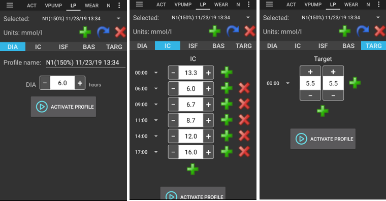

# Your AAPS profile

Your **AAPS Profile** is a set of five key parameters which define how **AAPS** should deliver insulin in response to your sensor glucose levels. These are the main parameters **AAPS** is built upon. As you progress through the **Objectives**, you will unlock additional modifiable parameters (like SMB settings), but the performance of these features rely on your underlying **Profile** being correct. The **Profile** incorporates:
* [胰島素作用持續時間](#duration-of-insulin-action-dia)（DIA）、
* [血糖目標](#glucose-targets)、
* [基礎率](#basal-rates)（BR）、
* [胰島素敏感性因子](#insulin-sensitivity-factor-isf)（ISF）及
* [胰島素與碳水化合物比率](#insulin-to-carb-ratio-icr)（IC 或 ICR）。

As part of **AAPS**’ management, users should continually assess and scrutinise the accuracy of their **Profile** settings. It is recommended to take the settings in the order they are presented here. 在更改另一個設置之前，請確保先調整好一個設置。 逐步進行調整，而不是一次性做出大幅更改。 Don't forget to activate the new profile after each change. Regularly [backup your **Profile**](#YourAapsProfile_Profile-backup) settings by exporting your Preferences.

Your **Profile** settings interact with one another - you can have 'wrong' settings that work well together in certain circumstances but do not in others. For instance, if a too-high basal happens to be at the same time as a too-high **CR**. This means that you need to consider all the settings and check they work harmoniously together in a variety of circumstances.

你可以使用 [Autotune](https://autotuneweb.azurewebsites.net/) 來引導你的思路，但不要盲目遵循：他可能並不適合你或所有情況。

```{admonition} Your diabetes may vary
:class: information
**Profiles** vary significantly from person-to-person.

For basal rates (BR), insulin sensitivity factors (ISF) and insulin-to-carb ratios (IC or ICR), the absolute values and trends in insulin requirements vary significantly from person to person, depending on your biology, gender, age, fitness level etc. as well as shorter term factors like illness and recent exercise. For more guidance on this, the book [“Brights Spots and Landmines”](https://diatribe.org/bright-spots-and-landmines/) by Adam Brown is an excellent book to read.

```

The four last parameters (glucose targets, basal rates, insulin sensitivity factors and insulin-to-carb ratios) can be set to different values, changing hourly if required, over a 24-hour period.


Screenshots from **AAPS** of an _example_ profile are shown in below. Please note, this sample profile below shows a large number of timepoints. 當你開始使用**AAPS**時，你的個人設定可能會簡單許多。

(your-aaps-profile-duration-of-insulin-action)=
## 胰島素作用持續時間（DIA）

### Description

The length of time that insulin takes to decay to zero.

在**AAPS**中，胰島素作用持續時間設定為單一數值，因為你的幫浦會持續輸注相同類型的胰島素。


In combination with the [insulin type](#Config-Builder-insulin), this will result in the [insulin profile](#AapsScreens-insulin-profile), as shown in the image above. The important thing to note is that the decay has a **long tail**. If you have been used to manual pumping, you have probably been used to assuming that insulin decays over about 3.5 hours. However, when you are looping, the long tail matters as the calculations are far more precise and these small amounts add up when they are subjected to the recursive calculations in the **AAPS** algorithm. Therefore, **AAPS** uses minimum 5h as DIA.

Additional reading on the topic of duration of insulin action, and why it matters :
* [Understanding the New IOB Curves Based on Exponential Activity Curves](https://openaps.readthedocs.io/en/latest/docs/While%20You%20Wait%20For%20Gear/understanding-insulin-on-board-calculations.html#understanding-the-new-iob-curves-based-on-exponential-activity-curves) on OpenAPS documentation.
* [Why we are regularly wrong in the duration of insulin action (DIA) times we use, and why it matters…](https://www.diabettech.com/insulin/why-we-are-regularly-wrong-in-the-duration-of-insulin-action-dia-times-we-use-and-why-it-matters/) on Diabettech.
* [Exponential Insulin Curves + Fiasp](https://web.archive.org/web/20220630154425/http://seemycgm.com/2017/10/21/exponential-insulin-curves-fiasp/) on See My CGM (archive).
* [Revised Humalog model in a closed loop](https://bionicwookiee.com/2022/04/13/revised-humalog-model-in-a-closed-loop/) and other articles on Bionic Wookie, recommending a DIA of 9h for Lyumjev, Fiasp, NovoRapid, Humalog.


### 影響

DIA 設置過短可能會導致低血糖。 And vice versa.

If DIA is too short, **AAPS** will calculate too early that your previous bolus is all consumed, and if your **BG** is still high, it will over-deliver in insulin. （實際上，他不會等那麼久，而是預測會發生什麼，並不斷添加胰島素）。 This essentially creates ‘insulin stacking’ that **AAPS** is unaware of. This is especially noticeable at night, if you see negative IOB with no other explanation than the queue of the last bolus.

Example of a too-short DIA is a high BG followed by **AAPS** over-correcting and giving a low BG.

### How to set it

The **figure below** shows an example of how the DIA set in an **AAPS** profile.


這一時間通常設定得太短。 A DIA of 6 or 7 is probably a good place to start. A growing number of people find that a DIA of 8 to 9 hours works good for them. See the additional reading mentioned above.

(profile-glucose-targets)=
## 血糖目標

### Description

你的**血糖目標**是一個核心值，且所有**AAPS**的計算均以此為基礎。 It is different from the target range which you usually aim to keep your blood glucose values in. The target is used in **AAPS** calculations : if **AAPS** predicts that your **BG** will land outside the target range, then it will take action to take you back in said range.

目標可以在這些邊界內定義：

|    | _低_目標                 | _高_目標                 |
| -- | --------------------- | --------------------- |
| 最小 | 4 mmol/l 或 72 mg/dL   | 5 mmol/l 或 90 mg/dL   |
| 最大 | 10 mmol/l 或 180 mg/dL | 15 mmol/l 或 225 mg/dL |

### 影響

If the target in your **Profile** is very wide (say, 3 or more mmol/l [50 mg/dl or more] wide), you will often find little **AAPS** action. This is because **BG** level is predicted to be somewhere in that wide range, and thus temporary basal rate are unlikely to be actioned by **AAPS**.

### How to set it

The **figure below** shows an example of how the target can be set in an **AAPS** profile.


血糖目標根據你的個人偏好設定。 For example, if you are concerned about hypos at night, you may set your target slightly higher at 117 mg/dL (6.5 mmol/L) from 9 pm - 7am. 如果你希望在早餐前有充足的胰島素儲備，你可以將早上 7 點到 8 點的目標設定為較低的 81 mg/dL（4.5 mmol/L）。

When In [Open Loop](#Preferences-pen-loop), especially when progressing through [the first objectives](../SettingUpAaps/CompletingTheObjectives.md), using a wide range target can be a good option while you are learning how **AAPS** behaves and adjusting your **Profile**.<br/> When In [Closed Loop](#preferences-closed-loop) (starting at **[Objective 6](#objectives-objective6)**), it is recommended to reduce the range until you have a single target for each time of the day (_Low_ target = _High_ target), to make sure that **AAPS** reacts promptly to **BG** fluctuations.

## 基礎率

### Description

你的胰島素基礎率（單位/小時）提供背景胰島素，在沒有食物或運動的情況下保持血糖穩定。

胰島素幫浦每幾分鐘會輸送少量速效胰島素，以防止肝臟釋放過多的葡萄糖，並將葡萄糖輸送到體細胞中。 基礎胰島素通常占你每日總劑量（TDD）的 40-50%，取決於你的飲食，並且通常遵循日夜節律，在 24 小時內有一個高峰和一個低谷。 有關更多資訊，Gary Scheiner 所著的[“像胰臟一樣思考”](https://amzn.eu/d/iVU0RGe)第 23 章非常有用。

大多數 1 型糖尿病教育工作者（以及 1 型糖尿病患者！）一致認為，在嘗試優化你的 ISF 和 ICR 之前，應該先著手於正確的基礎率設定。

### 影響

精準的基礎率能讓你在醒來時保持血糖在範圍內，並在一天中可以提前或延後進餐，而不會引起血糖過高或過低。

基礎率過高可能會導致低血糖。 And vice versa.

**AAPS** ‘baselines’ against the default basal rate. 如果基礎率過高，“零臨時基礎率”將計為比實際更大的負 IOB。 This will lead to **AAPS** giving more subsequent corrections than it should to bring IOB ultimately to zero.

So, a basal rate too high will create low **BGs** both with the default rate, but also some hours hence as **AAPS** corrects to target.

Conversely, a basal rate too low can lead to high BGs, and a failure to bring levels down to target.

### How to set it

The **figure below** shows an example of how the basal rates can be set in an **AAPS** profile.


Setting your basal rates right is done by trial and error, and should be done in consultation with your diabetic team.

There are basal testing methods which usually entails observing your basal rates and insulin needs during an intermittent fasting over a 24-hour period. Although you need to test your basal rates for the whole day, it is not recommended to fast during 24h straight. This is because the body triggers mechanisms such as hormones to compensate. A recommended way is to fast 3 times for 8 hours.

The recommended method is to suspend the loop, which will revert to your default background basal rate. Observe how your **BG** changes: if it is dropping, basal rate is too high. And vice versa.<br/> An alternative method (may be more tricky) is to keep the loop running, and seeing how **IOB** changes. If **IOB** is negative, your basal rate is too high. And vice versa. Beware that this method relies on **ISF** to correct **BG**, and thus depends on other variables to be set reasonably well for it to be successful.<br/> Another way of adjusting your basal rates is to watch the loop action during the night, when all COB have decayed. This method is particularly useful for children, when fasting is difficult or insulin needs change often. [Dr Saleh Adi from Tidepool](https://www.youtube.com/watch?v=-fpWnGRhLSo) provides useful ways on how to analyse overnight BG lines in order to optimise your basal rates.

When taking action on the result of your basal testing, changes in the **Profile** should be done 1 hour before the rise/drop. Repeat the test as necessary until you are comfortable with your **basal rates** settings.

## 胰島素敏感度因子（ISF）

### Description

胰島素敏感性係數（有時稱為修正係數）是衡量 1 單位胰島素會降低血糖的程度。

**In mg/dL units:** If you have an **ISF** of 40, each unit of insulin will reduce your blood glucose by approx. 40 mg/dL (for example, your blood glucose will fall from 140 mg/dL to 100 mg/dL).

**In mmol/L units:** If you have an **ISF** of 1.5, each unit of insulin will reduce your blood glucose by approx. 1.5 mmol/L (for example from 8 mmol/L to 6.5 mmol/L).

From these examples you can see that the _smaller_ the **ISF** value, the less sensitive you are to insulin. So if you reduce your ISF from 40 to 35 (mg/dl) or 1.5 to 1.3 (mmol/L), this is often called strengthening your **ISF**. Conversely, increasing the **ISF** value from 40 to 45 (mg/dl) or 1.5 to 1.8 mmol/L) is weakening your **ISF**.

### 影響

A **lower / stronger ISF** (i.e. 40 instead of 50) means insulin drops your **BG** less per unit. This leads to a more aggressive / stronger correction from the loop with **more insulin**. If your **ISF** is too strong (small value), this can lead to low **BG**.

A **higher / weaker ISF** (i.e. 45 instead of 35) means insulin drops your **BG** more per unit. This leads to a less aggressive / weaker correction from the loop with **less insulin**. If your **ISF** is too weak (large value), this can lead to high **BG**.

**範例：**
* **BG** is 190 mg/dL (10,5 mmol/L) and target is 100 mg/dL (5,6 mmol/L).
* So, you want a correction of `190 - 110 = 90 mg/dL` or `10,5 - 5,6 = 4.9 mmol/L`
* If `ISF = 30` -> `90 / 30 = 3` or `ISF = 1.63` -> `4.9 / 1.63 = 3`: 3 units of insulin
* If `ISF = 45` -> `90 / 45 = 2` or `ISF = 2.45` -> `4.9 / 2.45 = 3`: 2 units of insulin

An **ISF** that is too low (and therefore more aggressive, not uncommon) can result in ‘over corrections’, because **AAPS** calculates that the user needs more insulin to correct a high **BG** than actually required. This can lead to ‘roller coaster’ BG levels (esp. when fasting), as shown on the image below. In this circumstance, the **ISF** value should be increased in order to make **AAPS** less aggressive. This will ensure **AAPS** delivers smaller correction doses, and avoid over-correcting a high **BG** resulting in a low **BG**.


Conversely, an **ISF** set too high can result in under-corrections, meaning your **BG** remains above target – particularly noticeable overnight.

### How to set it

See the **figure below** for an example of how ISF values could be set in an **AAPS** profile.


確定你白天 ISF 的基本起點是基於你的每日總劑量（TDD），使用 1,700（94）規則。 更多詳細內容見於 Gary Scheiner 所著的[“像胰臟一樣思考”](https://amzn.eu/d/iVU0RGe)第 7 章。

    1700（若以 mg/dl 為單位）或 94（mmol/L）/ TDD = 大約 ISF。
    
    範例：TDD = 40 U大約 ISF（mg/dl）= 1700/40 = 43大約 ISF（mmol/L）= 94/40 = 2.4

Assuming correct basal, you can test this by suspending the loop, checking IOB is zero, and taking a few glucose tablets to get to a stable ‘high’ level.

然後根據目前的 1/ISF 估算所需的胰島素量來達到目標血糖值。

請小心，這一值通常設置得過低。 過低意味著 1 單位的胰島素會使血糖下降得比預期更快。

## 胰島素與碳水化合物的比例（ICR）

### Description

ICR 是衡量每單位胰島素覆蓋多少克碳水化合物的指標。

Some people also use **I:C** as an abbreviation instead of ICR, or talk about carb ratio : **CR.

例如，1:10 的胰島素與碳水化合物比率表示你每攝入 10 克碳水化合物需要注射 1 單位的胰島素。 一餐包含 25 克碳水化合物需要 2.5 單位的胰島素。

If your ICR is weaker (higher value), perhaps 1:20, you would only need 0.5U of insulin to cover 10 g of carbs. 一餐包含 25 克碳水化合物需要 25/20 = 1.25 單位的胰島素。

由於荷爾蒙數值和體力活動，ICR 在一天中的不同時間可能會有所不同。 Many people find they have their lowest/strongest ICR around breakfast time. So, for example, one adult user's ICR could be 1:8 for breakfast, 1:10 for lunch and 1:10 for dinner, but these patterns are not universal, and some people are more insulin resistant at dinner time, and require a stronger/smaller ICR then.

> **注意：**
> 
> 在一些歐洲國家，曾使用麵包單位來確定需要多少胰島素來代謝食物。 最初 1 麵包單位相當於 12 克碳水化合物，後來一些國家改為 10 克碳水化合物。
> 
> 在這種模式下，碳水化合物量是固定的，胰島素量是可變的。 （“需要多少胰島素來覆蓋一個麵包單位？”）
> 
> 使用 IC 時，胰島素量是固定的，碳水化合物量是可變的。 （“一單位胰島素能覆蓋多少克碳水化合物？”）
> 
> 範例：
> 
> Bread unit factor (BU = 12g carbs): 2,4 U/BU -> You need 2,4 units of insulin when you eat one bread unit.
> 
> Corresponding IC: 12g / 2,4 U = 5,0 g/U -> 5,0g carbs can be covered with one unit of insulin.
> 
> BU factor 2,4 U / 12g   ===>   IC = 12g / 2,4 U = 5,0 g/U
> 
> 線上可找到轉換表，例如[此處](https://www.mylife-diabetescare.com/files/media/03_Documents/11_Software/FAS/SOF_FAS_App_KI-Verha%CC%88ltnis_MSTR-DE-AT-CH.pdf)。

### 影響

A **lower / stronger IC** means less food per unit, i.e. you are getting more insulin for a fixed amount of carbs. 這也叫做「比較積極」。 If your IC is too strong, you are getting too much insulin, this can lead to low **BGs**.

A **higher / weaker IC** = more food per unit, i.e. you are getting less insulin for a fixed amount of carbs. 這也叫做「比較保守」。 If your IC is too weak, you are getting less insulin than you need, this can lead to high **BGs**.

### How to set it

The **figure below** shows an example of a user's ICR and how it can be set in an **AAPS Profile**. When entering these values, we just enter the final part of the ratio, so an insulin-to-carb ratio of 1:3.5 is entered simply as “3.5”.


If after a meal has been digested and the **IOB** has returned to zero, your **BG** remains higher than before food, chances are IC is too high / weak. Conversely, if your **BG** is lower than before food, IC is too small / strong.

Assuming correct basal are used, you can test by checking if **IOB** is zero and that you are in-range, eating exactly known carbs, and take an estimated amount of insulin based on current insulin to carb ratio. Best is to eat food you normally eat at that time of day and count its carbs precisely.

## Common questions related to the Profile

```{contents} Common questions related to the Profile
:depth: 1
:local: true
```

### 關於正確設置你的設定檔的重要性

**我為什麼需要正確設置我的個人設定？ 循環不是可以自動處理這些嗎？**

A hybrid closed loop _can_ attempt to make insulin delivery adjustments to minimise poor glycemic control that results from having incorrect **Profile** values. 它可以這樣做，例如如果你將要低血糖，它會暫停胰島素的輸送。 However, you can achieve much better glycemic control if your **Profile** settings are already as close as possible to what your body needs. 這是**AAPS**使用分階目標從開放式循環推進到混合閉環的原因之一。 此外，還會有需要打開循環的時候（感測器暖機、感測器故障_等_），有時發生在半夜，你希望在這些情況下設定是正確的。

如果你是在使用其他開放式或閉環系統後開始使用**AAPS**，那麼你已經對基礎率（BR）、胰島素敏感性因子（ISF）和胰島素與碳水化合物比率（IC 或 ICR）要使用的值有合理的了解。

如果你是從注射（MDI）轉到**AAPS**，那麼最好先了解如何從 MDI 轉移到幫浦，並在與你的糖尿病團隊諮詢後仔細規劃並進行轉換。 ["胰島素輸注"](https://amzn.eu/d/iaCsFa2)由 John Walsh 和 Ruth Roberts 編寫的書籍，及[“像胰臟一樣思考”](https://amzn.eu/d/iVU0RGe)由 Gary Scheiner 編寫的書籍都是非常有用的參考資料。

### 什麼原因導致循環頻繁將我的血糖降至低血糖數值，且無碳水化合物存在？
首先，檢查你的基礎率，並進行無碳水化合物的基礎率測試。 如果基礎率正確，那麼這種情況通常是由於 ISF 過低引起的。 A too low ISF typically looks like this:


### 什麼原因導致閉環系統中的餐後高峰？
首先，檢查你的基礎率，並進行無碳水化合物的基礎率測試。 If it is correct and your **BG** is falling to your target after carbs are fully absorbed, try to set an 'eating soon' temp target in **AAPS** some time before the meal or think about an appropriate pre-bolus time with your endocrinologist. <br/> If your **BG** is too high after the meal and still too high after carbs are fully absorbed, consider decreasing your **IC** with your endocrinologist. If your **BG** is too high while **COB** and too low after carbs are fully absorbed, think about increasing your IC and an appropriate pre-bolus time with your endocrinologist.

### I'm stuck high and the loop does not bring me down
The possible reasons for **AAPS** not giving enough insulin are:
* **ISF** is not strong enough
* Basal might not be strong enough
* A security setting might kick in, such as **maxIOB**. Or **SMB** is disabled at this time, depending on your settings.
* Automation has been set up and has overridden **AAPS**.

### I have negative IOB, is this an issue ?
Negative **IOB** means the amount of absolute insulin (basal + bolus) in your body is less than the basal. It will cause **AAPS** to send more insulin as soon as the **BG** starts to rise, because it considers that insulin is missing, which can result in low **BG** later.

Here are some reasons why you may have negative IOB, and what action to take:
* a too strong basal: tweak your **Profile**
* too much bolus at the previous meal: tweak your **Profile** or check if you are bolusing at the right time.
* DIA too short, resulting in insulin stacking: tweak your **Profile**
* physical activity: next time, consider using a lower [Profile percentage](../DailyLifeWithAaps/ProfileSwitch-ProfilePercentage.md) during activity to account for increased sensitivity.

## Manage your profiles

```{contents} Operations that you can perform on your **Profiles** in **AAPS**
:depth: 1
:local: true
```
(your-aaps-profile-create-and-edit-profiles)=
### Create and edit Profiles

The **Profile** tab can be found from the top menu or hamburger menu, depending on your [Config Builder settings](../SettingUpAaps/ConfigBuilder.md).



按鈕：

- 綠色加號：新增
- 紅色 X：刪除
- 藍色箭頭：複製

If you make any changes to your **Profile**, make sure you are editing the correct **Profile**. The **Profile** tab may not always show the actual profile being used - e.g. if you made a profile switch by using the profile tab on homescreen, it may differ from the profile actually shown in profile tab as there is no connection between these.

(your-aaps-profile-profile-from-scratch-for-a-kid)=
### Build a Profile from scratch for a kid

The [Profile Helper](#aaps-screens-profile-helper) tab may help you to create a profile for a child (up to 18 years).

**重要說明：**

**設定檔助手主要在幫助你為孩子找到初始設定檔。 儘管該助手基於兩家不同醫院的資料集，但在使用新設定檔前，請務必與你的醫療團隊討論。**

設定檔助手提供來自兩家不同醫院的資料集，幫助你為 18 歲以下的孩子找到初始設定檔。


1. Make sure you are in **Profile 1**.
2. In **Profile type**, make sure you have "Default profile" selected.
3. 根據輸入的孩子年齡及總胰島素劑量（TDD）**或**體重，調整預設設定檔（基於醫院資料集）。
4. Change screen by clicking on **Profile 2** on the right.
5. Press **Profile type** and select "DPV Default profile".
6. 根據輸入的孩子年齡、基礎速率百分比及總胰島素劑量（TDD）**或**體重，調整「DPV 預設設定檔」（基於另一家醫院資料集）。
7. Press the button **Compare profiles** at the bottom of the screen. Comparison of the two adjusted profiles will be displayed (see screenshot below).
8. If you want to start tweaking your profile based on one of these suggestions, use the **Clone** button either from **Profile 1** ou **Profile 2**.


### Switch Profile

See [Profile switch & Profile Percentage](../DailyLifeWithAaps/ProfileSwitch-ProfilePercentage.md).

(your-aaps-profile-clone-profile-switch)=
### Clone a Profile switch to a new Profile


The [Treatments](#aaps-screens-treatments) tab shows all past **Profile Switches**. When going to the **Profile Switch** sub-tab, you can use a past **Profile Switch** as a base to create a new **Profile**. In this case, timeshift and percentage will be applied to the new local profile. Use the **Clone** button shown on line **1**.

You can now go to the [Profile tab](#your-aaps-profile-create-and-edit-profiles) to edit the newly created Profile.

(YourAapsProfile_Profile-backup)=
### 設定檔備份

Being a core setting of your looping system, your **Profiles** are highly sensitive and something you really don't want to lose.

* Your **Profiles** are stored in the **AAPS** database.
* If enabled, **Profiles** are also uploaded to Nightscout. 這些設定可以在[NSClient 偏好設定 > NSClient > 同步 > 上傳資料至 NS](#Preferences-nsclient)找到。


* 它們也是[匯出設定](../Maintenance/ExportImportSettings.md)的一部分。 因此，確保有一個安全的備份。

### 從 Nightscout 編輯個人設定

如果啟用，直接在 Nightscout 進行的個人設定更改可以在**AAPS**中接受。 這些設定可以在[NSClient 偏好設定 > NSClient > 同步 > 接收個人設定儲存](#Preferences-nsclient)找到。

This can be helpful when about to make major changes to a more extensive **Profile**. 透過網頁介面輸入這些設定會更加方便，例如，手動從電子表格複製資料。

To do this, however, it is important to clone the whole **database record** consisting of several profiles in the Nightscout editor (blue arrow on the screenshot below). 新的資料庫記錄將標示當前日期。 After saving, the changed/new **Profile** can be activated in **AAPS** with a regular [Profile switch](../DailyLifeWithAaps/ProfileSwitch-ProfilePercentage.md).


(your-aaps-profile-compare-profiles)=
### Compare two Profiles

You can use the [Profile Helper](#aaps-screens-profile-helper) tab also to compare to different profiles or profile switches (percentage of one of your profiles used in a [profile switch](../DailyLifeWithAaps/ProfileSwitch-ProfilePercentage.md) before).


1. Make sure you are in **Profile 1**.
2. In **Profile type**, select "Available profile" to choose between all stored **Profiles**.
3. Choose the **Profile** you want to compare from.
4. Change screen by clicking on **Profile 2** on the right.
5. In **Profile type**, select "Profile switch" to choose in the history of all your **Profiles Switched**.
6. Choose the **Profile Switch** you want to compare to.
7. Press the button **Compare profiles** at the bottom of the screen. Comparison of the two adjusted profiles will be displayed (see screenshot below).

