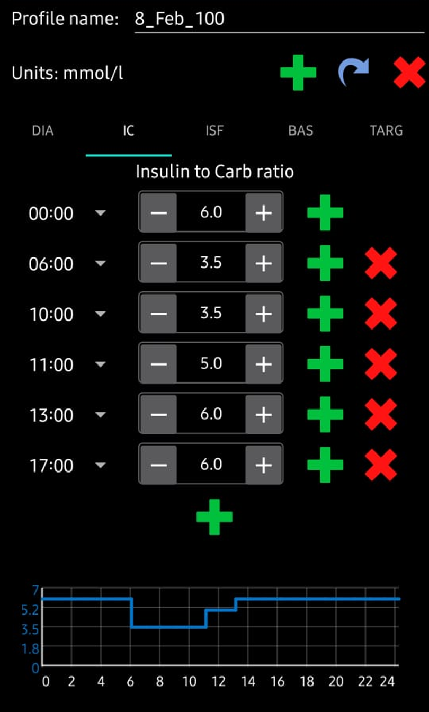

# Your **AAPS** profile

Your **AAPS** profile is a set of five key parameters which define how **AAPS** should deliver insulin in response to your sensor glucose levels. **AAPS** has several _additional_ modifiable parameters (like SMB settings), but using these well relies on your underlying **AAPS** profile being correct. The **AAPS** profile incorporates:
* [duration of insulin action](#duration-of-insulin-action-dia) (DIA),
* [glucose targets](#glucose-targets),
* [basal rates](#basal-rates) (BR),
* [insulin sensitivity factors](#insulin-sensitivity-factor-isf) (ISF) and
* [insulin-to-carb ratios](#insulin-to-carb-ratio-icr) (IC or ICR).

最後四個參數的值可以在 24 小時內按需設置為不同的值，隨時間改變。 請注意，下方範例設定檔顯示了大量的時間點。 When you start out with **AAPS**, your profile is likely to be much simpler.

```{admonition} Your diabetes may vary
:class: information
Profiles vary significantly from person-to-person.

For the final three parameters, basal rates (BR), insulin sensitivity factors (ISF) and insulin-to-carb ratios (IC or ICR), the absolute values and trends in your insulin requirements vary significantly from person to person, depending on your biology, gender, age, fitness level etc. as well as shorter term factors like illness and recent exercise. For more guidance on this, the book [“Brights Spots and Landmines”](https://brightspotsandlandmines.org/Bright_Spots_and_Landmines_by_Adam_Brown.pdf) by Adam Brown is an excellent book to read.

```

Screenshots from **AAPS** of an _example_ profile are shown in below.

## 胰島素作用持續時間（DIA）

The duration of insulin action is set to a single value in **AAPS**, because your pump will continually infuse the same type of insulin.

In combination with the [insulin type](../SettingUpAaps/ConfigBuilder.md#insulin), this will result in the [insulin profile](../DailyLifeWithAaps/AapsScreens.md#insulin-profile). 請在那裡閱讀以幫助您定義適當的 DIA。

## 血糖目標

The **figure below** shows an example of how the DIA and glucose targets could be set in an **AAPS** profile.


Your **BG target** is a core value and all of **AAPS** calculations are based on it. 它不同於您通常希望將您的血糖值保持在的目標範圍：
* A glucose target, particularly if it is only short-term (less than 4 hours in duration), does not need to be the *actual value* you expect or want your glucose level to get to, rather, it is a good way to tell **AAPS** to be more or less aggressive, while still keeping your glucose levels in range.
* If your target is very wide (say, 3 or more mmol/l [50 mg/dl or more] wide), you will often find little **AAPS** action. This is because **BG** level is predicted to be somewhere in that wide range, and thus temporary basal rate changes are rarely suggested.
* When beginning with **AAPS**, especially when progressing through [the first objectives](../SettingUpAaps/CompletingTheObjectives.md), using a wide range target can be a good option while you are learning how **AAPS** behaves and ajusting your **Profile**.
* Later on, you will probably find more appropriate to reduce the range until you have a single target for each time of the day (_Low_ target = _High_ target), to make sure that **AAPS** reacts promptly to **BG** fluctuations.

目標可以在這些邊界內定義：

|    | _Low_ target          | _High_ target         |
| -- | --------------------- | --------------------- |
| 最小 | 4 mmol/l 或 72 mg/dL   | 5 mmol/l 或 90 mg/dL   |
| 最大 | 10 mmol/l 或 180 mg/dL | 15 mmol/l 或 225 mg/dL |

血糖目標根據你的個人偏好設定。 例如，如果你擔心夜間低血糖，你可以將目標設定為稍高的 117 mg/dL（6.5 mmol/L），從晚上 9 點到早上 7 點。 如果你希望在早餐前有充足的胰島素儲備，你可以將早上 7 點到 8 點的目標設定為較低的 81 mg/dL（4.5 mmol/L）。

## 基礎率

你的胰島素基礎率（單位/小時）提供背景胰島素，在沒有食物或運動的情況下保持血糖穩定。

精準的基礎率能讓你在醒來時保持血糖在範圍內，並在一天中可以提前或延後進餐，而不會引起血糖過高或過低。 胰島素幫浦每幾分鐘會輸送少量速效胰島素，以防止肝臟釋放過多的葡萄糖，並將葡萄糖輸送到體細胞中。 基礎胰島素通常占你每日總劑量（TDD）的 40-50%，取決於你的飲食，並且通常遵循日夜節律，在 24 小時內有一個高峰和一個低谷。 For more information, chapter 23 of [“Think like a Pancreas”](https://amzn.eu/d/iVU0RGe) by Gary Scheiner is very useful.

Most type 1 diabetes educators (and people with type 1 diabetes!) agree that you should work on getting your basal rates correct, before attempting to optimise your ISF and ICR.

## 胰島素敏感度因子（ISF）

胰島素敏感性係數（有時稱為修正係數）是衡量 1 單位胰島素會降低血糖的程度。

**In mg/dL units:** If you have an ISF of 40, each unit of insulin will reduce your blood glucose by approx. 40 mg/dL (for example, your blood glucose will fall from 140 mg/dL to 100 mg/dL).

**In mmol/L units:** If you have an ISF of 1.5, each unit of insulin will reduce your blood glucose by approx. 1.5 mmol/L (for example from 8 mmol/L to 6.5 mmol/L).

From these examples you can see that the _smaller_ the ISF value, the less sensitive you are to insulin. 因此，如果你將胰島素敏感度因子（ISF）從 40 降至 35（mg/dl）或從 1.5 降至 1.3（mmol/L），這通常被稱為強化你的胰島素敏感度因子（ISF）。 相反，將 ISF 值從 40 增加到 45（mg/dl）或從 1.5 增加到 1.8（mmol/L）稱為削弱 ISF。

如果你的 ISF 過強（值較小），會導致低血糖；如果 ISF 過弱（值較大），則會導致高血糖。

確定你白天 ISF 的基本起點是基於你的每日總劑量（TDD），使用 1,700（94）規則。 More detail is given in Chapter 7 of [“Think like a Pancreas”](https://amzn.eu/d/iVU0RGe) by Gary Scheiner.

1700（若以 mg/dl 為單位）或 94（mmol/L）/ TDD = 大約 ISF。

範例：TDD = 40 U大約 ISF（mg/dl）= 1700/40 = 43大約 ISF（mmol/L）= 94/40 = 2.4

See the **figure below** for an example of how the basal rates and ISF values could be set in an **AAPS** profile.


## 胰島素與碳水化合物的比例（ICR）

ICR 是衡量每單位胰島素覆蓋多少克碳水化合物的指標。

有些人也使用 I:C 作為 ICR 的縮寫，或稱之為碳水化合物比率（CR）。

例如，1:10 的胰島素與碳水化合物比率表示你每攝入 10 克碳水化合物需要注射 1 單位的胰島素。 一餐包含 25 克碳水化合物需要 2.5 單位的胰島素。

如果你的 ICR 較弱，可能是 1:20，那麼你只需 0.5 單位的胰島素來覆蓋 10 克碳水化合物。 一餐包含 25 克碳水化合物需要 25/20 = 1.25 單位的胰島素。

由於荷爾蒙數值和體力活動，ICR 在一天中的不同時間可能會有所不同。 許多人發現，他們的 ICR 在早餐時間最低。 例如，你的 ICR 可能在早餐時為 1:8，午餐時為 1:10，晚餐時為 1:10，但這些模式並非普遍適用，某些人在晚餐時間對胰島素的抵抗力較高，因此需要更強/較小的 ICR。

As shown in the **figure below**, when entering these values into an **AAPS** profile, we just enter the final part of the ratio, so an insulin-to-carb ratio of 1:3.5 is entered simply as “3.5”.




## 關於正確設置你的設定檔的重要性

**Why should I try to get my profile settings right? Can’t the loop just take care of it?**

A hybrid closed loop _can_ attempt to make insulin delivery adjustments to minimise poor glycemic control that results from having incorrect profile values. 它可以這樣做，例如如果你將要低血糖，它會暫停胰島素的輸送。 然而，若你的設定檔參數已經接近你身體所需的值，你將能夠實現更好的血糖控制。 This is one of the reasons that **AAPS** uses staged objectives to move from open loop pumping towards hybrid closed loop. In addition, there will be times when you need to open the loop (sensor warmups, sensor failure _etc._), sometimes in the middle of the night, and you will want to have your settings right for these situations.

If you are starting with **AAPS** after using a different open or closed-loop pumping system, you will already have a reasonable idea of what values to use for basal rates (BR), insulin sensitivity factors (ISF) and insulin-to-carb ratios (IC or ICR).

If you are moving from injections (MDI) to **AAPS**, then it is a good idea to read up on how to make the transfer from MDI to pump first, and plan and make the move carefully in consultation with your diabetes team. ["Pumping insulin"](https://amzn.eu/d/iaCsFa2) by John Walsh & Ruth Roberts and [“Think like a Pancreas”](https://amzn.eu/d/iVU0RGe) by Gary Scheiner are very useful.

## 設定檔助手

[設定檔助手](../SettingUpAaps/ProfileHelper.md) 可以幫助您：
* 從零開始為小孩建立設定檔
* 比較兩個設定檔
* 複製一份設定檔