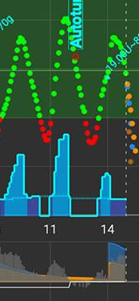
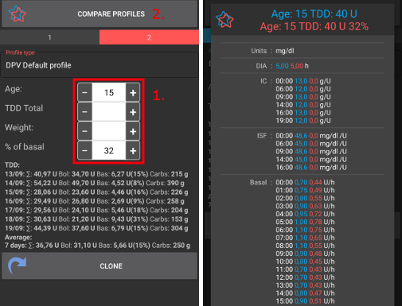
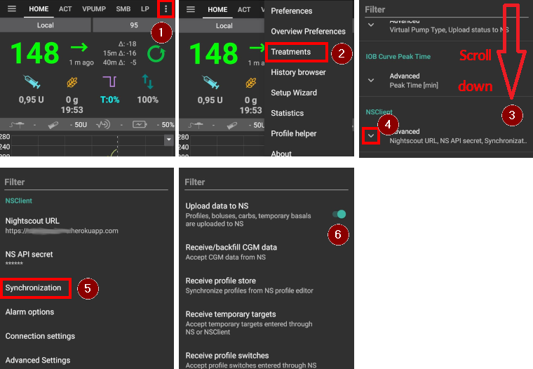
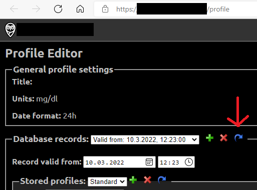

# 你的 AAPS 配置

你的 **AAPS 配置** 是一組五個關鍵參數，定義了 **AAPS** 根據你的傳感器血糖水平如何輸送胰島素。 這些是 **AAPS** 的主要參數。 隨著你逐步完成 **目標**，你將解鎖其他可修改的參數（如 SMB 設置），但這些功能的性能依賴於你的基礎 **配置** 是否正確。 該 **配置** 包含：
* [胰島素作用持續時間](#duration-of-insulin-action-dia)（DIA）、
* [血糖目標](#glucose-targets)、
* [基礎率](#basal-rates)（BR）、
* [胰島素敏感性因子](#insulin-sensitivity-factor-isf)（ISF）及
* [胰島素與碳水化合物比率](#insulin-to-carb-ratio-icr)（IC 或 ICR）。

作為 **AAPS** 管理的一部分，用戶應不斷評估和檢查其 **配置** 設定的準確性。 建議按照此處所提供的順序進行設定。 在更改另一個設置之前，請確保先調整好一個設置。 逐步進行調整，而不是一次性做出大幅更改。 記得在每次更改後啟用新配置。 定期 [備份你的 **配置**](#YourAapsProfile_Profile-backup) 設置，通過匯出你的偏好設定。

你的 **配置** 設置之間相互影響—你可能會有「錯誤」設置在某些情況下運作良好，但在其他情況下卻無法正常運作。 例如，若基礎胰島素過高與太高的**CR**同時發生。 這表示你需要針對各項設定進行個別調整，並確保它們在各種情況下能夠協調運作。

你可以使用 [Autotune](https://autotuneweb.azurewebsites.net/) 來引導你的思路，但不要盲目遵循：他可能並不適合你或所有情況。

```{admonition} Your diabetes may vary
:class: information
**設定檔**因人而異，差異相當顯著。

對於基礎率（BR）、胰島素敏感度因子（ISF）和胰島素與碳水化合物比率（IC或ICR），胰島素需求的絕對值和趨勢因每個人的生理性別、年齡、體能水平等而異，還有一些短期因素如疾病和近期運動。 想要獲得更多指導，亞當·布朗的書籍[“Brights Spots and Landmines”](https://diatribe.org/bright-spots-and-landmines/)是一本非常值得閱讀的好書。

```

最後四個參數（血糖目標、基礎率、胰島素敏感度因子和胰島素與碳水化合物比率）可以設定不同的值，並根據需要在24小時內每小時變更。


來自**AAPS**的設定檔範例截圖如下。 請注意，下面這個範例設定檔顯示了大量的時間點。 當你開始使用**AAPS**時，你的個人設定可能會簡單許多。

(your-aaps-profile-duration-of-insulin-action)=
## 胰島素作用持續時間（DIA）

### 描述

胰島素降至零所需的時間長度。

在**AAPS**中，胰島素作用持續時間設定為單一數值，因為你的幫浦會持續輸注相同類型的胰島素。


結合[胰島素類型](#Config-Builder-insulin)，這將形成上述圖像中所示的[胰島素設定檔](#AapsScreens-insulin-profile)。 需要注意的重要點是衰減具有**長尾巴**。 如果你習慣於手動幫浦，你可能會認為胰島素的效用在更短的時間內衰減，即約 3.5 小時。 然而，在使用循環系統時，這個長尾變得重要，因為 **AAPS** 演算法的計算非常精確，這些微小的剩餘量在遞迴計算下會逐漸累積。 因此，**AAPS** 使用至少 5 小時作為**DIA**。

關於胰島素作用持續時間及其重要性的額外閱讀：
* [了解基於指數活動曲線的新 IOB 曲線](https://openaps.readthedocs.io/en/latest/docs/While%20You%20Wait%20For%20Gear/understanding-insulin-on-board-calculations.html#understanding-the-new-iob-curves-based-on-exponential-activity-curves)，可在 OpenAPS 文件中找到。
* [為什麼我們在使用胰島素作用持續時間（DIA）時經常出錯，以及這為什麼重要…](https://www.diabettech.com/insulin/why-we-are-regularly-wrong-in-the-duration-of-insulin-action-dia-times-we-use-and-why-it-matters/)，可以在 Diabettech 上閱讀。
* [指數胰島素曲線 + Fiasp](https://web.archive.org/web/20220630154425/http://seemycgm.com/2017/10/21/exponential-insulin-curves-fiasp/)，可於 See My CGM 網站（存檔）查看。
* [修訂的 Humalog 模型在閉環中](https://bionicwookiee.com/2022/04/13/revised-humalog-model-in-a-closed-loop/)以及其他文章，均建議 Lyumjev、Fiasp、NovoRapid、Humalog 的 DIA 為 9 小時。


### 影響

過短的**DIA**可能導致低血糖。 反之亦然。

如果**DIA**過短，**AAPS**將過早計算你之前的注射已經完全消耗，如果你的**血糖**仍然很高，則會過量釋放胰島素。 （實際上，他不會等那麼久，而是預測會發生什麼，並不斷添加胰島素）。 這基本上會造成**AAPS** 無法察覺的「胰島素堆疊」。 在夜間尤其明顯，如果你看到負的 IOB，沒有其他解釋，只有之前注射的排隊影響。

過短的**DIA**的例子是高血糖之後，**AAPS**進行了過度修正，導致低血糖。

### 如何設定

下面的**圖示**顯示了在**AAPS**設定檔中設置的**DIA**範例。


新的使用者通常設置的**DIA**過短。 設置**DIA**為 6 或 7 是不錯的起點。 越來越多的人發現，8到9小時的**DIA**對他們來說運作良好。 參閱上述提到的額外閱讀。

(profile-glucose-targets)=
## 血糖目標

### 描述

你的**血糖目標**是一個核心值，且所有**AAPS**的計算均以此為基礎。 這與你通常希望維持血糖數值的目標範圍不同。 目標用於**AAPS**的計算：如果**AAPS**預測你的**血糖**將落在目標範圍之外，則將會採取行動使你回到該範圍內。

目標可以在這些邊界內定義：

|    | _低_目標                 | _高_目標                 |
| -- | --------------------- | --------------------- |
| 最小 | 4 mmol/l 或 72 mg/dL   | 5 mmol/l 或 90 mg/dL   |
| 最大 | 10 mmol/l 或 180 mg/dL | 15 mmol/l 或 225 mg/dL |

### 影響

如果你在 **設定檔**中的目標範圍非常寬廣（例如 3 或更多 mmol/l [50 mg/dl 或更多] 寬），你將經常發現 **AAPS** 的行動較少。 這是因為**血糖** 水平預測會落在那個寬範圍內，因此 **AAPS** 不太可能採取臨時基礎率的行動。

### 如何設定

下面的**圖示**顯示了如何在**AAPS** 口令設置中設定目標範圍的範例。


**血糖**目標根據你的個人偏好和需求進行設置。 例如，如果你擔心夜間低血糖，可以將目標稍微提高到晚上 9 點到早上 7 點的 117 mg/dL (6.5 mmol/L)。 如果你希望在早餐前有充足的胰島素儲備，你可以將早上 7 點到 8 點的目標設定為較低的 81 mg/dL（4.5 mmol/L）。

在[開放循環](#Preferences-pen-loop)中，特別是在進行[第一個目標](../SettingUpAaps/CompletingTheObjectives.md)時，使用寬範圍目標是個好選擇，在你學習 **AAPS** 的行為並調整你的**設定檔**時。<br/> 在[封閉循環](#preferences-closed-loop)中（開始於**[目標 6](#objectives-objective6)**），建議減少範圍，直到你為每個時段確定一個單一目標（_低_ 目標 = _高_ 目標），以確保**AAPS**對**血糖**的波動快速做出反應。

(your-aaps-profile-basal-rates)=

## 基礎率

### 描述

你的胰島素基礎率（單位/小時）提供背景胰島素，在沒有食物或運動的情況下保持血糖穩定。

胰島素幫浦每幾分鐘會輸送少量速效胰島素，以防止肝臟釋放過多的葡萄糖，並將葡萄糖輸送到體細胞中。 基礎胰島素通常占你每日總劑量（TDD）的 40-50%，取決於你的飲食，並且通常遵循日夜節律，在 24 小時內有一個高峰和一個低谷。 For more information, chapter 6 of [“Think like a Pancreas”](https://amzn.eu/d/iVU0RGe) by Gary Scheiner is very useful.

大多數 1 型糖尿病教育工作者（以及 1 型糖尿病患者！）一致認為，在嘗試優化你的 ISF 和 ICR 之前，應該先著手於正確的基礎率設定。

### 影響

精準的基礎率能讓你在醒來時保持血糖在範圍內，並在一天中可以提前或延後進餐，而不會引起血糖過高或過低。

基礎率過高可能會導致低血糖。 反之亦然。

**AAPS** 以預設基礎率作為「基準」。 如果基礎率過高，“零臨時基礎率”將計為比實際更大的負 IOB。 這會導致**AAPS**進行比應有的更多後續修正，以最終將 IOB 變為零。

因此，基礎率過高將導致低**血糖**，不僅是依據預設基礎率，還會在幾個小時後因為**AAPS**修正至目標。

相反地，基礎率過低會導致高血糖，並無法將水平下調至目標。

### 如何設定

下面的**圖示**顯示了如何在**AAPS** 設定檔中設定基礎率的範例。


正確設定你的基礎率需要透過反覆試驗，並且應在與你的糖尿病團隊的諮詢下進行。

有一些基礎測試方法，通常涉及在24小時內觀察你的基礎率和胰島素需求。 雖然你需要測試全天的基礎率，但不建議連續禁食24小時。 因為身體會啟動機制如激素來進行補償。 推薦的方式是禁食3次，每次8小時。

推薦的方法是暫停循環，這樣會恢復到你的預設背景基礎率。 觀察你的**血糖**如何變化：如果它下降，則基礎率過高。 反之亦然。<br/> 另一種替代方法（ might be more tricky）是在循環運行的情況下，查看**IOB**如何變化。 如果**IOB**是負的，則你的基礎率過高。 反之亦然。 請注意，這種方法依賴於**ISF**來修正**血糖**，因此需要其他變數合理設置，這樣才能成功。<br/> 調整基礎率的另一種方法是觀察在夜間的循環行為，當所有 COB 已經降到為止。 這種方法對於兒童特別有用，因為禁食較困難或胰島素需求經常變化。 [Tidepool 的 Saleh Adi 醫生](https://www.youtube.com/watch?v=-fpWnGRhLSo)提供了如何分析夜間 血糖數據線以優化你的基礎率的有用建議。

當你對基礎測試的結果採取行動時，對**設定檔**的變更應在升高/下降前1小時進行。 根據需要重複測試，直到你對**基礎率**設定感到滿意。

(your-aaps-profile-insulin-sensitivity-factor)=

## 胰島素敏感度因子（ISF）

### 描述

胰島素敏感性係數（有時稱為修正係數）是衡量 1 單位胰島素會降低血糖的程度。

**以 mg/dL 單位計算：** 如果你的**ISF**為40，每單位胰島素將使你的血糖降低約40 mg/dL（例如，你的血糖將從140 mg/dL降至100 mg/dL）。

**以 mmol/L 單位計算：** 如果你的**ISF**為1.5，每單位胰島素將使你的血糖降低約1.5 mmol/L（例如，從8 mmol/L降至6.5 mmol/L）。

從這些例子中可以看出，_ISF_值越_小_，你對胰島素的敏感度就越低。 因此，如果你將ISF從40降至35（mg/dL）或1.5降至1.3（mmol/L），這通常被稱為加強你的**ISF**。 相反，將**ISF**值從40提高到45（mg/dL）或1.5提高到1.8（mmol/L），則是在削弱你的**ISF**。

### 影響

較**低/較強的ISF**（即40而不是50）意味著每單位胰島素對你的**血糖**的下降程度較少。 這導致循環更為積極/強效，使用了**更多胰島素**進行修正。 如果你的**ISF**過強（小值），可能導致血糖過低。

較**高/較弱的ISF**（即45而不是35）意味著每單位胰島素對你的血糖的降低程度較多。 這將導致循環進行較不積極/較弱修正，使用**較少胰島素**。 如果你的**ISF**過弱（大值），可能導致血糖過高。

**範例：**
* **血糖**為190 mg/dL（10.5 mmol/L），目標為100 mg/dL（5.6 mmol/L）。
* 因此，你希望進行的修正為`190 - 110 = 90 mg/dL`或`10.5 - 5.6 = 4.9 mmol/L`
* 如果`ISF = 30` -> `90 / 30 = 3`或`ISF = 1.63` -> `4.9 / 1.63 = 3`: 3單位胰島素
* 如果`ISF = 45` -> `90 / 45 = 2`或`ISF = 2.45` -> `4.9 / 2.45 = 2`: 2單位胰島素

一個過低的**ISF**（因此更積極，這不常見）可能導致「過度修正」，因為**AAPS**計算出使用者比實際所需的胰島素還需要更多來修正高的**血糖**。 這可能導致血糖像「雲霄飛車」般的波動（特別是在未進食時），如下圖所示。 在這種情況下，應該提高**ISF**值，以減少**AAPS**的積極程度。 這將確保**AAPS**提供較小的修正劑量，避免對高**血糖**進行過度修正，導致血糖過低。



相反，設置過高的**ISF**可能導致修正不足，意味著你的**血糖**仍然維持在目標之上——這在夜間特別明顯。

### 如何設定

請參見**下圖**，了解如何在**AAPS**設定檔中設置ISF值的示例。


確定你白天 ISF 的基本起點是基於你的每日總劑量（TDD），使用 1,700（94）規則。 更多詳細內容見於 Gary Scheiner 所著的[“像胰臟一樣思考”](https://amzn.eu/d/iVU0RGe)第 7 章。

    1700（若以 mg/dl 為單位）或 94（mmol/L）/ TDD = 大約 ISF。
    
    範例：TDD = 40 U大約 ISF（mg/dl）= 1700/40 = 43大約 ISF（mmol/L）= 94/40 = 2.4

假設你的基礎胰島素水平是正確的，你可以通過暫停循環，檢查**IOB**是否為零，然後服用幾片葡萄糖藥片以達到穩定的“高”水平來進行測試。

然後根據目前的 1/ISF 估算所需的胰島素量來達到目標血糖值。

請小心，這一值通常設置得過低。 過低意味著 1 單位的胰島素會使血糖下降得比預期更快。

(your-aaps-profile-insulin-to-carbs-ratio)=

## 胰島素與碳水化合物的比例（ICR）

### 描述

**ICR**是衡量一單位胰島素可以覆蓋多少克碳水化合物的指標。

有些人也使用**I:C**作為對**ICR**的簡寫，或者談論碳水化合物比例：**CR**。

例如，1:10 的胰島素與碳水化合物比率表示你每攝入 10 克碳水化合物需要注射 1 單位的胰島素。 一餐包含 25 克碳水化合物需要 2.5 單位的胰島素。

如果你的**ICR**較弱（數值較高），例如 1:20，你只需要 0.5U 的胰島素來覆蓋 10 克碳水化合物。 一餐包含 25 克碳水化合物需要 25/20 = 1.25 單位的胰島素。

不同時段的**ICR**差異是很普遍的，這是由於荷爾蒙水平和身體活動。 許多人發現在早餐時間他們的**ICR**最低/最強，因為他們通常對胰島素的抵抗力較高。 例如，一位成年使用者的**ICR**在早餐時可能為 1:8，在午餐和晚餐時為 1:10，但這些模式並不適用於所有人，有些人在晚餐時間對胰島素的抵抗力較高，因此需要更強或更小的**ICR**。

> **注意：**
> 
> 在一些歐洲國家，曾使用麵包單位來確定需要多少胰島素來代謝食物。 最初 1 麵包單位相當於 12 克碳水化合物，後來一些國家改為 10 克碳水化合物。
> 
> 在這種模式下，碳水化合物量是固定的，胰島素量是可變的。 （“需要多少胰島素來覆蓋一個麵包單位？”）
> 
> 使用**ICR**時，胰島素的數量是固定的，而碳水化合物的數量則是可變的。 （“一單位胰島素能覆蓋多少克碳水化合物？”）
> 
> 範例：
> 
> 麵包單位因子（BU = 12克碳水化合物）：2.4 U/BU -> 當你吃一個麵包單位時，你需要2.4單位的胰島素。
> 
> 每單位胰島素的 **ICR** 比例為：12g / 2.4U = 5.0 g/U -> 5.0g 碳水化合物可以用一單位的胰島素來覆蓋。
> 
> BU因子2.4 U / 12g   ===>   IC = 12g / 2.4 U = 5.0 g/U
> 
> 線上可找到轉換表，例如[此處](https://www.mylife-diabetescare.com/files/media/03_Documents/11_Software/FAS/SOF_FAS_App_KI-Verha%CC%88ltnis_MSTR-DE-AT-CH.pdf)。

### 影響

**較低/較強的ICR**意味著每單位能攝取的食物更少，即在固定的碳水化合物量下，你獲得的胰島素較多。 這也叫做「比較積極」。 如果你的IC過強，你會得到過多的胰島素，這可能導致血糖過低。

**較高/較弱的ICR** = 每單位能攝取的食物更多，即在固定的碳水化合物量下，你獲得的胰島素較少。 這也叫做「比較保守」。 如果你的IC過弱，你獲得的胰島素會少於所需，這可能導致血糖過高。

### 如何設定

下面的**圖示**顯示了一名使用者的**ICR**範例，以及如何在**AAPS Profile**中設置。 當輸入這些值時，我們僅輸入比率的最後一部分，因此胰島素與碳水化合物的比率1:3.5僅簡單地輸入為「3.5」。


如果在用餐後消化完成且**IOB**返回為零時，你的**血糖**仍然高於用餐前的水平，那麼你的**ICR**可能過弱（_即數字過高，應該逐漸降低_）。 相反地，如果你的**血糖**低於用餐前的水平，則表示**ICR**過強（_即數字過小，應該逐漸提高_）。

假設你的基礎率是正確的，你可以通過檢查**IOB**是否為零，並且在你的範圍內，吃著精確且已知的碳水化合物，然後根據當前的胰島素與碳水化合物比率攝取估計的胰島素量來進行測試。 最好是在那個時段食用你通常吃的食物，並精確計算其碳水化合物的量。

## 與設定檔相關的常見問題

```{contents} Common questions related to the Profile
:depth: 1
:local: true
```

### 關於正確設置你的設定檔的重要性

**我為什麼需要正確設置我的個人設定？ 循環不是可以自動處理這些嗎？**

混合閉環_可以_嘗試進行胰島素供給的調整，以最小化因擁有不正確的**設定檔**值而導致的控制不佳的情況。 它可以這樣做，例如如果你將要低血糖，它會暫停胰島素的輸送。 然而，如果你的**設定檔**設定已盡可能接近你身體的需求，你可以實現更好的血糖控制。 這是**AAPS**使用分階目標從開放式循環推進到混合閉環的原因之一。 此外，還會有需要打開循環的時候（傳感器暖機、傳感器故障_等_），有時發生在半夜，你希望在這些情況下設定是正確的。

如果你是在使用其他開放或封閉循環幫浦系統後開始使用**AAPS**，你將已經對應該使用的基礎率（**BR**）、胰島素敏感度因子（**ISF**）和胰島素與碳水化合物比率（**ICR**）有相當合理的了解。

如果你是從注射（MDI）轉到**AAPS**，那麼最好先了解如何從 MDI 轉移到幫浦，並在與你的糖尿病團隊諮詢後仔細規劃並進行轉換。 ["胰島素輸注"](https://amzn.eu/d/iaCsFa2)由 John Walsh 和 Ruth Roberts 編寫的書籍，及[“像胰臟一樣思考”](https://amzn.eu/d/iVU0RGe)由 Gary Scheiner 編寫的書籍都是非常有用的參考資料。

### 什麼原因導致閉環系統中的餐後高峰？
首先，檢查你的基礎率，並進行無碳水化合物的基礎率測試。 如果這是正確的，並且你的**血糖**在碳水化合物完全吸收後下降到目標範圍，請嘗試在用餐前某段時間在**AAPS**內設置“即將用餐”的臨時目標，或者與你的內分泌科醫師討論合適的預注射時間。 <br/> 如果你的**血糖**在用餐後過高，並且在碳水化合物完全吸收後仍然過高，考慮與你的內分泌科醫師一起降低你的**ICR**。 如果你的**血糖**在**COB**期間過高，在碳水化合物完全吸收後又過低，請考慮與你的內分泌科醫師一起提高你的**ICR**以及合適的預注射時間。

### 我現在的血糖很高，循環無法幫我降下來。
導致 **AAPS** 無法提供足夠胰島素的可能原因有：
* **ISF** 可能不夠強。
* 基礎胰島素可能不夠強。
* 安全設定可能啟動，例如 **maxIOB**。 或者此時 **SMB** 被停用，這取決於你的設定。
* 自動化已經設置並覆蓋了 **AAPS**。

### 我有負的 IOB，這是個問題嗎？
負的 **IOB** 意味著你體內的絕對胰島素量（基礎 + 注射）少於基礎胰島素量。 這會導致 **AAPS** 一旦血糖開始上升，就會發送更多的胰島素，因為它認為胰島素不足，這可能會導致後來的血糖偏低。

以下是造成負 IOB 的一些原因，以及應採取的行動：
* 基礎胰島素過強：調整你的 **設定檔**。
* 上一次餐點注射過多：調整你的 **設定檔** 或檢查你是否在正確的時間進行注射。
* DIA 太短，導致胰島素堆疊：調整你的 **設定檔**。
* 身體活動：下次考慮在活動期間使用較低的 [設定檔百分比](../DailyLifeWithAaps/ProfileSwitch-ProfilePercentage.md) 來因應敏感度的提高。

## 管理你的設定檔

```{contents} Operations that you can perform on your **Profiles** in **AAPS**
:depth: 1
:local: true
```
(your-aaps-profile-create-and-edit-profiles)=
### 創建和編輯設定檔

**設定檔** 分頁可以從上方選單或漢堡選單找到，具體取決於你的 [組態建置工具設定](../SettingUpAaps/ConfigBuilder.md)。


按鈕：

- 綠色加號：新增
- 紅色 X：刪除
- 藍色箭頭：複製

如果你對 **設定檔** 做了任何更改，請確保你正在編輯正確的 **設定檔**。 **設定檔** 分頁不一定會顯示當前正在使用的實際設定，例如，如果你在主畫面使用設定檔分頁進行設定切換，這可能與設定檔分頁中實際顯示的設定不同，因為兩者之間沒有連線。

(your-aaps-profile-profile-from-scratch-for-a-kid)=
### 為孩子從零開始建立一個設定檔

[設定檔助手](#aaps-screens-profile-helper) 分頁可以幫助你為孩子（最多18歲）創建設定檔。

**重要說明：**

**設定檔助手主要在幫助你為孩子找到初始設定檔。 儘管該助手基於兩家不同醫院的資料集，但在使用新設定檔前，請務必與你的醫療團隊討論。**

設定檔助手提供來自兩家不同醫院的資料集，幫助你為 18 歲以下的孩子找到初始設定檔。


1. 請確保你在 **設定檔 1** 中。
2. 在 **設定檔類型** 中，請確保選擇「預設設定檔」。
3. 根據輸入的孩子年齡及總胰島素劑量（TDD）**或**體重，調整預設設定檔（基於醫院資料集）。
4. 按一下右側的 **設定檔 2** 更改螢幕。
5. 按下 **設定檔類型** 並選擇「DPV 預設設定檔」。
6. 根據輸入的孩子年齡、基礎速率百分比及總胰島素劑量（TDD）**或**體重，調整「DPV 預設設定檔」（基於另一家醫院資料集）。
7. 按下螢幕底部的 **比較設定檔** 按鈕。 將顯示兩個調整後的設定檔的比較（請參見下方截圖）。
8. 如果你想根據這些建議開始調整你的設定檔，請使用 **複製** 按鈕，無論是在 **設定檔 1** 或 **設定檔 2** 中。



### 切換設定檔

請參見 [切換設定檔與設定檔百分比](../DailyLifeWithAaps/ProfileSwitch-ProfilePercentage.md)。

(your-aaps-profile-clone-profile-switch)=
### 將設定檔切換複製到新的設定檔


該 [治療](#aaps-screens-treatments) 分頁顯示所有過去的 **設定檔切換**。 進入 **設定檔切換** 子分頁後，你可以使用過去的 **設定檔切換** 作為創建新 **設定檔** 的基礎。 在這種情況下，時差和百分比將應用於新的本地設定檔。 使用**複製**按鈕，該按鈕顯示在**1**行。

你現在可以轉到[設定檔選項卡](#your-aaps-profile-create-and-edit-profiles)以編輯新創建的設定檔。

(YourAapsProfile_Profile-backup)=
### 設定檔備份

作為你循環系統的核心設定，你的 **設定檔** 非常敏感，這是你不想遺失的東西。

* 你的 **設定檔** 儲存在 **AAPS** 數據庫中。
* 如果啟用，**設定檔** 也會上傳到 Nightscout。 這些設定可以在[NSClient 偏好設定 > NSClient > 同步 > 上傳資料至 NS](#Preferences-nsclient)找到。



* 它們也是[匯出設定](../Maintenance/ExportImportSettings.md)的一部分。 因此，確保有一個安全的備份。

### 從 Nightscout 編輯個人設定

如果啟用，你在 Nightscout 中直接進行的**Profile**變更可以在**AAPS**中接收。 這些設定可以在[NSClient 偏好設定 > NSClient > 同步 > 接收個人設定儲存](#Preferences-nsclient)找到。

這在對更廣泛的 **設定檔** 進行重大更改之前可能會很有幫助。 透過網頁介面輸入這些設定會更加方便，例如，手動從電子表格複製資料。

不過，為此重要的是在 Nightscout 編輯器中複製整個 **數據庫記錄**，其中包含多個設定檔（見下方截圖中的藍色箭頭）。 新的資料庫記錄將標示當前日期。 保存後，更改/新增的 **設定檔** 可以通過常規的 [設定檔切換](../DailyLifeWithAaps/ProfileSwitch-ProfilePercentage.md) 在 **AAPS** 中啟用。



(your-aaps-profile-compare-profiles)=
### 比較兩個設定檔

你也可以使用 [設定檔助手](#aaps-screens-profile-helper) 分頁來比較不同的設定檔或設定檔切換（在以前的 [設定檔切換](../DailyLifeWithAaps/ProfileSwitch-ProfilePercentage.md) 中使用的其中一個設定檔的百分比）。


1. 請確保你在 **設定檔 1** 中。
2. 在 **設定檔類型** 中，選擇「可用設定檔」，以在所有儲存的 **設定檔** 之間進行選擇。
3. 從中選擇你想要比較的 **設定檔**。
4. 按一下右側的 **設定檔 2** 更改螢幕。
5. 在 **設定檔類型** 中，選擇「設定檔切換」，以在所有 **設定檔切換** 的歷史中進行選擇。
6. 選擇你希望比較的 **設定檔切換**。
7. 按下螢幕底部的 **比較設定檔** 按鈕。 將顯示兩個調整後的設定檔的比較（請參見下方截圖）。


