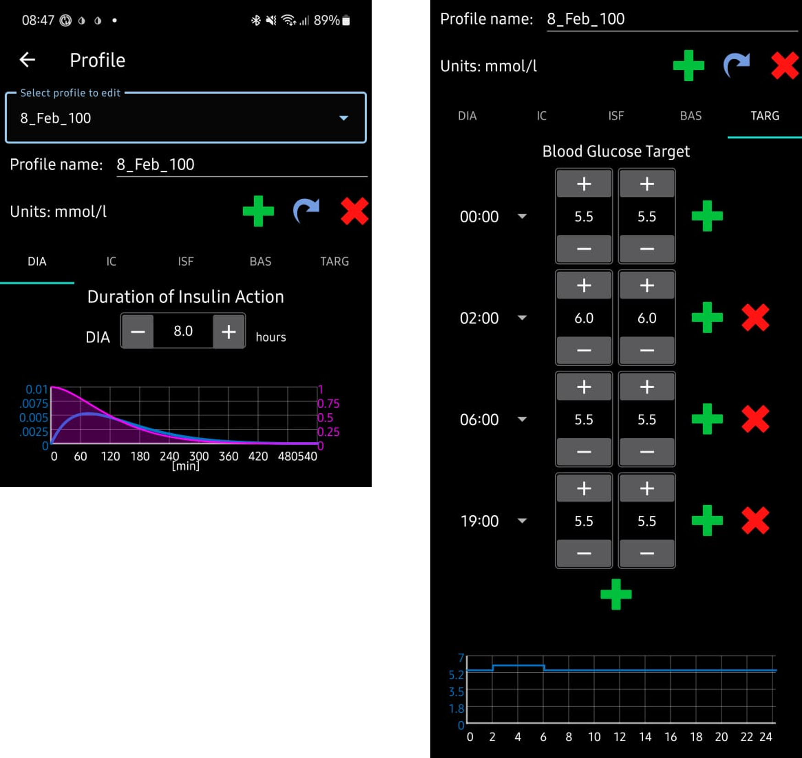
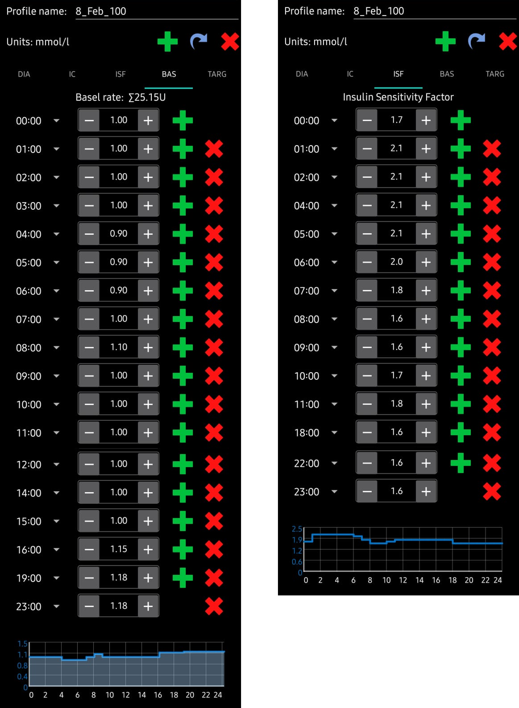

# 你的**AAPS**個人設定

你的**AAPS**個人設定是一組五個關鍵參數，定義了**AAPS**如何根據你的感測器血糖水平給予胰島素。 **AAPS**有數個_額外_可修改參數（例如 SMB 設定），但使用這些參數的效果取決於你的**AAPS**個人設定是否正確。 該**AAPS**個人設定包含：
* [胰島素作用持續時間](#duration-of-insulin-action-dia)（DIA）、
* [血糖目標](#glucose-targets)、
* [基礎率](#basal-rates)（BR）、
* [胰島素敏感性因子](#insulin-sensitivity-factor-isf)（ISF）及
* [胰島素與碳水化合物比率](#insulin-to-carb-ratio-icr)（IC 或 ICR）。

最後四個參數的值可以在 24 小時內按需設置為不同的值，隨時間改變。 請注意，下方範例設定檔顯示了大量的時間點。 當你開始使用**AAPS**時，你的個人設定可能會簡單許多。

```{admonition} Your diabetes may vary
:class: information
個人設定可以因人而異。

對於最後三個參數，即基礎率（BR）、胰島素敏感性因子（ISF）和胰島素與碳水化合物比率（IC 或 ICR），你的胰島素需求的絕對值和趨勢會因人而異，這取決於你的生物特徵、性別、年齡、運動水平等，同時也會受到短期因素如生病和近期運動的影響。 關於這方面的更多指導，可以參考於 Adam Brown 所著的書籍[“亮點與雷區”](https://brightspotsandlandmines.org/Bright_Spots_and_Landmines_by_Adam_Brown.pdf)。

```

下面顯示的**AAPS**截圖為一個_範例_個人設定。

## 胰島素作用持續時間（DIA）

在**AAPS**中，胰島素作用持續時間設定為單一數值，因為你的幫浦會持續輸注相同類型的胰島素。

搭配[胰島素類型](../SettingUpAaps/ConfigBuilder.md#insulin)，這將形成[胰島素配置](../DailyLifeWithAaps/AapsScreens.md#insulin-profile)。 請在那裡閱讀以幫助您定義適當的 DIA。

## 血糖目標

以下**圖示**顯示了在**AAPS**個人設定中，DIA 和血糖目標可以如何設置的範例。



你的**BG 目標**是一個核心值，且所有**AAPS**的計算均以此為基礎。 它不同於您通常希望將您的血糖值保持在的目標範圍：
* 血糖目標，特別是如果它僅是短期（持續時間少於 4 小時），不需要是你期望或想要的實際血糖值，而是一種良好的方式來告訴**AAPS**應該更積極或不那麼積極，同時仍能保持你的血糖數值在範圍內。
* 如果你的目標範圍非常寬（例如，寬達 3 或以上 mmol/l [50 mg/dl 或更高]），你通常會發現**AAPS**的行動比較少。 這是因為**BG**數值預測會落在這個寬範圍內，因此很少建議做臨時基礎率調整。
* 當開始使用**AAPS**時，尤其在完成[第一個目標](../SettingUpAaps/CompletingTheObjectives.md)的過程中，使用一個寬範圍的目標可以是一個不錯的選擇，因為你正在了解**AAPS**的運作方式並調整你的**個人設定**。
* 稍後你可能會發現，將範圍縮小到每天每個時段都有單一目標（_低_目標 = _高_目標）會更加合適，以確保**AAPS**迅速對**BG**波動做出反應。

目標可以在這些邊界內定義：

|    | _低_目標                 | _高_目標                 |
| -- | --------------------- | --------------------- |
| 最小 | 4 mmol/l 或 72 mg/dL   | 5 mmol/l 或 90 mg/dL   |
| 最大 | 10 mmol/l 或 180 mg/dL | 15 mmol/l 或 225 mg/dL |

血糖目標根據你的個人偏好設定。 例如，如果你擔心夜間低血糖，你可以將目標設定為稍高的 117 mg/dL（6.5 mmol/L），從晚上 9 點到早上 7 點。 如果你希望在早餐前有充足的胰島素儲備，你可以將早上 7 點到 8 點的目標設定為較低的 81 mg/dL（4.5 mmol/L）。

## 基礎率

你的胰島素基礎率（單位/小時）提供背景胰島素，在沒有食物或運動的情況下保持血糖穩定。

精準的基礎率能讓你在醒來時保持血糖在範圍內，並在一天中可以提前或延後進餐，而不會引起血糖過高或過低。 胰島素幫浦每幾分鐘會輸送少量速效胰島素，以防止肝臟釋放過多的葡萄糖，並將葡萄糖輸送到體細胞中。 基礎胰島素通常占你每日總劑量（TDD）的 40-50%，取決於你的飲食，並且通常遵循日夜節律，在 24 小時內有一個高峰和一個低谷。 有關更多資訊，Gary Scheiner 所著的[“像胰臟一樣思考”](https://amzn.eu/d/iVU0RGe)第 23 章非常有用。

大多數 1 型糖尿病教育工作者（以及 1 型糖尿病患者！）一致認為，在嘗試優化你的 ISF 和 ICR 之前，應該先著手於正確的基礎率設定。

## 胰島素敏感度因子（ISF）

胰島素敏感性係數（有時稱為修正係數）是衡量 1 單位胰島素會降低血糖的程度。

**以 mg/dL 單位計算：** 如果你的 ISF 為 40，每一單位胰島素將使你的血糖大約降低 40 mg/dL（例如，你的血糖會從 140 mg/dL 下降到 100 mg/dL）。

**以 mmol/L 單位計算：** 如果你的 ISF 為 1.5，每一單位胰島素將使你的血糖大約降低 1.5 mmol/L（例如從 8 mmol/L 下降到 6.5 mmol/L）。

從這些例子中，你可以看到，_ISF_ 值越小，你對胰島素的敏感性越低。 因此，如果你將胰島素敏感度因子（ISF）從 40 降至 35（mg/dl）或從 1.5 降至 1.3（mmol/L），這通常被稱為強化你的胰島素敏感度因子（ISF）。 相反，將 ISF 值從 40 增加到 45（mg/dl）或從 1.5 增加到 1.8（mmol/L）稱為削弱 ISF。

如果你的 ISF 過強（值較小），會導致低血糖；如果 ISF 過弱（值較大），則會導致高血糖。

確定你白天 ISF 的基本起點是基於你的每日總劑量（TDD），使用 1,700（94）規則。 更多詳細內容見於 Gary Scheiner 所著的[“像胰臟一樣思考”](https://amzn.eu/d/iVU0RGe)第 7 章。

1700（若以 mg/dl 為單位）或 94（mmol/L）/ TDD = 大約 ISF。

範例：TDD = 40 U大約 ISF（mg/dl）= 1700/40 = 43大約 ISF（mmol/L）= 94/40 = 2.4

參見**以下圖示**，了解基礎率和 ISF 值如何在**AAPS**個人設定中設置的範例。



## 胰島素與碳水化合物的比例（ICR）

ICR 是衡量每單位胰島素覆蓋多少克碳水化合物的指標。

有些人也使用 I:C 作為 ICR 的縮寫，或稱之為碳水化合物比率（CR）。

例如，1:10 的胰島素與碳水化合物比率表示你每攝入 10 克碳水化合物需要注射 1 單位的胰島素。 一餐包含 25 克碳水化合物需要 2.5 單位的胰島素。

如果你的 ICR 較弱，可能是 1:20，那麼你只需 0.5 單位的胰島素來覆蓋 10 克碳水化合物。 一餐包含 25 克碳水化合物需要 25/20 = 1.25 單位的胰島素。

由於荷爾蒙數值和體力活動，ICR 在一天中的不同時間可能會有所不同。 許多人發現，他們的 ICR 在早餐時間最低。 例如，你的 ICR 可能在早餐時為 1:8，午餐時為 1:10，晚餐時為 1:10，但這些模式並非普遍適用，某些人在晚餐時間對胰島素的抵抗力較高，因此需要更強/較小的 ICR。

如**下方圖示**所示，在將這些值輸入到**AAPS**個人設定時，我們僅輸入比率的最後一部分，因此胰島素與碳水化合物比率 1:3.5 僅需輸入“3.5”。


## 關於正確設置你的設定檔的重要性

**我為什麼需要正確設置我的個人設定？ 循環不是可以自動處理這些嗎？**

混合閉環系統_可以_試圖進行胰島素投放調整，以最小化因個人設定值不正確而導致的血糖控制不佳。 它可以這樣做，例如如果你將要低血糖，它會暫停胰島素的輸送。 然而，若你的設定檔參數已經接近你身體所需的值，你將能夠實現更好的血糖控制。 這是**AAPS**使用分階目標從開放式循環推進到混合閉環的原因之一。 此外，還會有需要打開循環的時候（感測器暖機、感測器故障_等_），有時發生在半夜，你希望在這些情況下設定是正確的。

如果你是在使用其他開放式或閉環系統後開始使用**AAPS**，那麼你已經對基礎率（BR）、胰島素敏感性因子（ISF）和胰島素與碳水化合物比率（IC 或 ICR）要使用的值有合理的了解。

如果你是從注射（MDI）轉到**AAPS**，那麼最好先了解如何從 MDI 轉移到幫浦，並在與你的糖尿病團隊諮詢後仔細規劃並進行轉換。 ["胰島素輸注"](https://amzn.eu/d/iaCsFa2)由 John Walsh 和 Ruth Roberts 編寫的書籍，及[“像胰臟一樣思考”](https://amzn.eu/d/iVU0RGe)由 Gary Scheiner 編寫的書籍都是非常有用的參考資料。

## 設定檔助手

[設定檔助手](../SettingUpAaps/ProfileHelper.md) 可以幫助您：
* 從零開始為小孩建立設定檔
* 比較兩個設定檔
* 複製一份設定檔