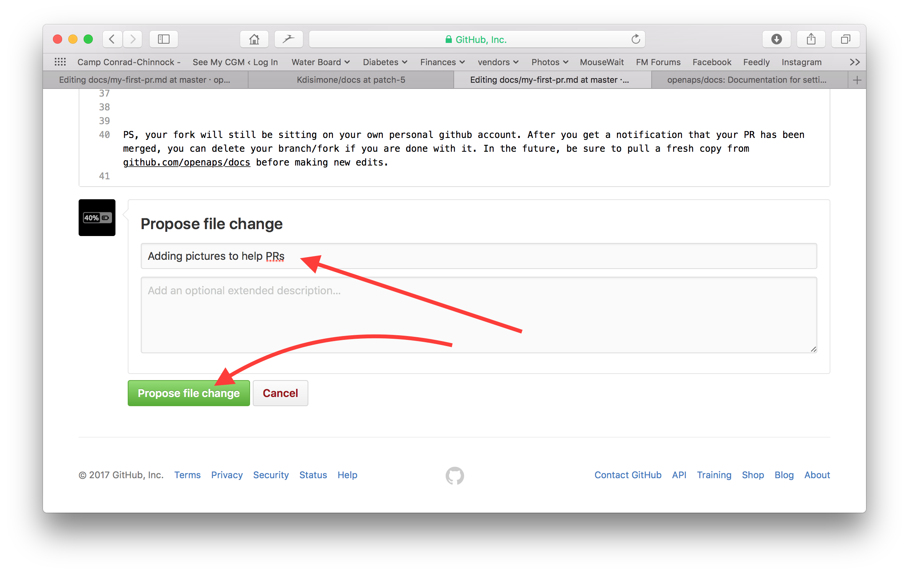
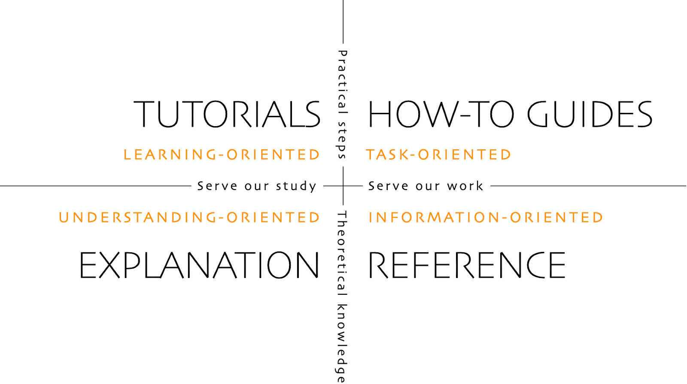

# 如何編輯文件

**此描述僅適用於編輯英文文件。 所有新訊息必須首先以英文添加。 如果你想將文件翻譯成其他語系（感謝你的貢獻），請使用[Crowdin](https://crowdin.com/project/androidapsdocs)。**

有關如何格式化文本（標題、加粗...）以及設置連結的提示，請參閱此頁面的["代碼語法"](#code-syntax)部分。

## 一般問題

如有任何問題、反饋或新想法，你可以透過[Discord](https://discord.gg/4fQUWHZ4Mw)聯繫文件團隊。

某個時間點將建議你發送一個Pull Request (PR)，這是你的文件更改實際上被放到AAPS網頁上的方法，這些網頁儲存在GitHub中。 事實上，做一個PR並不太難，這是貢獻的一種很棒方式。 你現在正在閱讀這篇文件，是因為像你這樣的人提交了PR。 別擔心犯錯誤或不小心編輯錯誤的文件。 在將更改合併到“正式”AAPS文件庫之前，你的更改會被審核。 你無法透過過程中的任何事故損壞原件。 一般過程如下：

- 透過編輯現有內容來對代碼或文件進行修改和改進。
- 仔細檢查你的編輯是否符合你的預期。
- 做一些筆記來說明所做的更改，以便人們暸解這些編輯。
- 建立一個Pull Request，請求管理員使用你的更改。
- 他們將進行審核，並採取以下操作之一：（1）合併你的更改，（2）對你的更改進行反饋，或（3）根據你的更改建立一個新文件。

（附註：如果你是視覺型學習者，這裡有一個顯示PR工作流程的YouTube視頻[這裡](https://youtu.be/4b6tsL0_kzg)。）

我們的範例是對AndroidAPS文件進行編輯。 這可以在任何Windows PC、Mac等設備上完成。 （任何有網際網路查看的電腦）。

1. 前往 <https://github.com/openaps/AndroidAPSdocs>，然後在右上角點擊 Fork 來製作自己的儲存庫副本。


2. 查看任何頁面，導航到你想編輯的頁面。 你可以點擊右上角的「在 GitHub 編輯」連結。 這僅適用於英文頁面。 


或點擊頁面內容上方出現的鉛筆圖示以進行編輯。 你需要已經登錄到你的GitHub帳號才能執行此操作（如果你還沒有帳號，他們的設置非常簡單）。


3. 這兩種選擇中的任何一個都將在你的庫中建立一個新分支，你的編輯將儲存在該分支中。 對文件進行編輯。

我們使用Markdown語法來編寫文件頁面。 文件的後綴為“.md”。目前我們使用myst_parser來處理我們的Markdown文件。 請確保使用正確的語法，如[以下所述](#code-syntax)。


4. 你正在“<>編輯文件”標籤中工作。 選擇“預覽更改”標籤，檢查所有更改是否按預期呈現。 如果你看到需要改進的地方，請返回編輯標籤進行更多改進。 


5. 當你完成編輯後，滾動到頁面底部。 在底部的框中，在“添加可選擴展描述...”的文本字段中提供你的評論。 預設標題為文件名。 嘗試添加一句解釋**更改原因**的語句。 說明原因有助於審核者了解你嘗試透過PR進行的操作。



6. 點擊綠色的“建議文件更改”或“提交更改”按鈕。 在出現的頁面中點擊“建立Pull Request”，然後在下一頁再次點擊“建立Pull Request”。


7. 這樣就完成了Pull Request的提交。 GitHub為PR分配了一個編號，位於標題後面和井號之後。 返回此頁面檢查反饋（或者，如果你已啟用GitHub通知，你將透過電子郵件收到關於PR活動的通知）。 現在，你的編輯將在一個PR列表中，團隊將審核並可能在合併到AAPS主要文件之前提供反饋！ 如果你想查看PR的進展，你可以點擊GitHub帳號右上角的鐘形標誌，查看所有的PR。


附註：你的Fork和分支將仍保留在你個人的GitHub帳號上。 當你收到通知你的PR已合併後，如果你已經完成了他，你可以刪除你的分支（步驟8的通知區域將提供一個連結，用於在分支被關閉或合併後刪除他）。 對於未來的編輯，如果你按照此流程，編輯將始終從AndroidAPSdocs庫的最新版本開始。 如果你選擇使用其他方法來開始PR請求（例如，從你分叉的庫的主分支開始進行編輯），則需要透過“比較”來確保你的庫是最新的，並合併自上次更新以來發生的任何更新。 由於人們往往忘記更新他們的庫，我們建議你按照上述PR流程進行，直到你熟悉執行“比較”。

(編輯文件程式碼語法)=

## 代碼語法

我們使用Markdown來編寫文件頁面。 文件的後綴為“.md”。

Markdown是一種非常簡單的文本格式語系，他將文本內容與文本格式分開。

編寫者只需標記標題為一級標題，Markdown處理器會在處理期間生成必要的HTML代碼，以在HTML中呈現標題。

其背後的理念是：

- 編寫者應該首先考慮文本，而不是格式，
- Markdown文本可以在不同的Markdown工具之間進行交換，而不像Windows等專有工具，
- 你可以從一個Markdown文件生成多種輸出格式。

Markdown並非100％固定標準，我們盡量保持與標準相近，以

- 保持靈活性，以便在Markdown工具和Markdown SaaS服務的進一步創新中根據需要或強制更換Markdown工具，並
- 使我們能夠使用翻譯服務將英文翻譯成目標語系，如法語或德語。 他們可以在Markdown上工作，但無法處理複雜的格式代碼，因為他們無法將內容與佈局分開，這可能會導致致命問題。

### 標題

- 標題1：`# 標題`
- 標題2：`## 標題`
- 標題3：`### 標題`
- 標題4：`#### 標題`

我們嘗試避免更進一步的標題層級。

### 文本格式

- **粗體**: `**文字**`
- *斜體*: `*文字*`
- ***粗體斜體***: `***文字***`

### 有序列表

    1. 第一
    1. 第二
    1. 第三
    

1. 第一
2. 第二
3. 第三

### 無序列表

    - 一個元素
    - 另一個元素
    - 還有另一個元素
    

- 一個元素
- 另一個元素
- 還有一個元素

### 多層級列表

你可以在列表中插入嵌套列表，方法是將下一層級比上一層級多縮進4個空格。

    1. 第一
    1. 第二
    1. 第三
      1. 一個元素
      1. 另一個元素
      1. 還有另一個元素
    1. 四
    1. 五
    1. 六
    

1. 第一
2. 第二
3. 第三 
    1. 一個元素
    2. 另一個元素
    3. 還有一個元素
4. 第四
5. 第五
6. 六

### 圖像

要包含圖像，請使用此Markdown語法。

- 圖像語法：``

圖像類型應為PNG或JPEG。

圖像名稱應遵循以下命名規則之一。 在示例中，我使用png作為後綴。 如果使用JPEG，請使用jpeg作為後綴。

- `filename-image-xx.png` 其中xx是該文件中圖像的唯一雙位數字。
- `filename-image-xx.png` 其中xx是文件作者的有意義名稱。

圖像位於英文語系的圖像文件夾中，並透過Crowdin自動傳播到其他語系。 你無需為此做任何事！

目前我們不翻譯圖片：圖片應包含**最少的文字**以便非英文讀者能夠閱讀。

(make-a-PR-image-size)=請使用合理的圖像尺寸，使其在PC、平板電腦和手機上可讀。

- 來自網頁的截圖圖像寬度應達到**1050像素**。
- 流程圖的寬度應達到**1050像素**。
- 應用程序的截圖寬度應達到**500像素**。 如果沒有必要，請不要將它們並排放置。

### 連結

#### 外部連結

外部連結是指向外部網站的連結。

- 外部連結：`[替代文字](www.url.tld)`

#### 指向.md文件開頭的內部連結

指向頁面的內部連結是指向我們自己服務器上託管的.md文件開頭的連結。

- 內部連結到.md文件：`[替代文字](../folder/file.md)`

#### 指向內聯引用名稱的內部連結

指向內聯引用名稱的內部連結是指向我們自己服務器上託管的任何.md文件中的某個位置，並設置引用以連結到該位置。

在目標.md文件中要跳轉的位置添加命名引用。

`(name-of-my-md-file-this-is-my-fancy-named-reference)=`

命名引用必須在整個AndroidAPSDocs.md文件中唯一，而不僅僅是所在的.md文件！

因此，最好的做法是從文件名開始，然後選擇引用名稱。

僅使用小寫字母並將單詞用連字符連線。

然後，使用以下類型的連結在你編寫的文本中連結此引用。

- 指向內聯引用名稱的內部連結：`[替代文字](name-of-my-md-file-this-is-my-fancy-named-reference)`

### 註釋、警告、折疊註釋

你可以在文件中添加註釋和警告框。

此外，你還可以添加折疊註釋，為不感興趣於詳細訊息的用戶隱藏文本，以便閱讀體驗更輕鬆。 請謹慎使用這些功能，因為文件應儘可能易於閱讀。

#### 註釋

    ```{admonition} 注意標題
    :class: note
    這是一個注意事項。
    ```
    

```{admonition} 注意標題 :class: note 這是一個注意事項。

    <br />#### 警告
    
    ````
    ```{admonition} 警告
    :class: warning
    這是一個警告。
    

    ```{admonition} 警告標題 
    :class: warning
    這是一個警告。
    ```
    
    #### 可折疊的註解
    
    

    {admonition} 供有興趣的讀者進一步詳細閱讀
    :class: dropdown
    
    這個註解已被折疊，
    這意味著你可以在這裡添加較長的內容，
    而不會佔用頁面過多的空間。
    

````

```{admonition} 供有興趣的讀者進一步詳細閱讀 :class: dropdown 這個註解已被折疊， 這意味著你可以在這裡添加較長的內容， 而不會佔用頁面過多的空間。

```

## 表格

避免使用長文本的表格，因為內容難以在 Markdown 中設置，通常無法適應手機螢幕的寬度，翻譯後可能會無法正確顯示。

## 風格指南

### 目錄

1. 英文寫作技巧

2. AAPS特定寫作注意事項

3. 有用的參考資料

###  1\. 英文寫作技巧

#### 使用適合讀者的語系

盡可能使用簡單的英文。 這有助於非母語讀者，也有助於將AAPS文件翻譯成其他語系。 以與用戶交談的方式進行寫作，想像你正坐在讀者的對面。 請記得 - 大多數 AAPS 用戶沒有程式背景。 糖尿病本身也有很多行話和縮寫。 請記住，有些人可能是剛剛被診斷出來的，可能沒有你對糖尿病的經驗，或者他們接受了不同的糖尿病培訓。 如果你使用簡寫或縮寫，請在第一次使用時將其完整寫出，並在括號中給出縮寫，如“超微注射(SMB)”。 此外，請連結到詞彙表。 讀者可能不熟悉的技術術語也可以放在括號中。

例如： *“閉環中餐後血糖高峰的原因是什麼？”*

請使用：*“在閉環中餐後（餐後）的血糖高峰原因是什麼？”*

##### 使用每個人都能暸解的簡單詞語

這裡可以找到一個A-Z的替代詞匯表，以使你的寫作更易於暸解：

<https://www.plainenglish.co.uk/the-a-z-of-alternative-words.html>

#### 隱私/許可證問題：

特別是如果你錄製視頻或截圖，請確保不泄露你的私人訊息（API密鑰、密碼）。 確保 YouTube 內容不是公開列表，需要文件中的鏈接才能查看。 避免引起侵犯版權材料（BYODA等）的注意。

#### 保持句子簡短，直奔主題

- 清晰的寫作應平均句長為15至20個單詞。

- 這並不意味著每個句子都要一樣長。 寫作應簡明有力。 透過將短句（如上面那一句）與較長的句子混合使用來改變你的寫作。

- 保持每個句子只有一個主要想法，並最多添加一個相關點。

- 你可能會發現自己仍然會寫出一兩個長句，特別是在試圖解釋一個複雜的問題時。 但大多數長句可以以某種方式被分解。

- 去除虛弱詞語：“你可以”，“有/是/是的”，“為了”。

- 將關鍵詞放在標題、句子和段落的開頭。

- 要具象化！ 無論何時可能，請提供簡單的圖表、截圖或視頻。

#### 不要害怕給予指示

指令是最快的指示方式，但寫作者有時會害怕發出指令，寫成“你應該這樣做”而不是直接寫“做這件事”。 也許人們擔心指令聽起來太過嚴厲。 你可以透過在前面加上“請”字來解決這個問題。 然而，如果某件事情必須做，不要說“請”，因為這給了讀者拒絕的選擇。

例如：*“你應該把他當作一個完整的聲明。”*

改為：*“把他當作一個完整的聲明。”*

#### 多使用主動動詞，而不是被動動詞

主動動詞的例子：

- *“幫浦（主語）輸送（動詞）胰島素（賓語）。”*

“輸送”在這裡是主動動詞。 這個句子說的是誰在進行輸送，然後才說輸送的是什麼。

被動動詞的例子：

- *“胰島素（主語）由幫浦（賓語）輸送（動詞）。”*

*“輸送”*在這裡是被動動詞。 與主動動詞句子相比，主語和賓語位置調換了。 我們不得不引入“由”和“被”使句子變得更長。 還要考慮以主動動詞開頭。

例如：*“你可以透過AAPS幫浦選單將幫浦與手機連線，並且有多種幫浦可供連線。”*

改為：*“透過AAPS幫浦選單將所需幫浦連線到手機。”*

被動動詞會引發問題：

- 他們容易讓人感到困惑。

- 他們通常讓寫作顯得冗長。

- 他們使寫作不夠生動。

##### 被動語態的良好用法

有時使用被動語態是合適的。

- 使語氣不那麼尖銳——“這張賬單未被支付”（被動語態）比“你沒支付這張賬單”（主動語態）來得溫和。

- 避免責任歸咎——“發生了錯誤”（被動語態）比“你犯了錯誤”（主動語態）來得不具指責性。

- 當你不知道執行者是誰或什麼時——“英格蘭隊已被選定”。

- 如果聽起來更好。

#### 避免名詞化

名詞化是指不是實物的某些過程、技術或情感的名稱。 名詞化是由動詞形成的。

例如：

| 動詞 | 名詞化  |
| -- | ---- |
| 完成 | 完成過程 |
| 介紹 | 介紹過程 |
| 提供 | 提供過程 |
| 失敗 | 失敗過程 |

他們經常**取代**他們來自的動詞，但可能聽起來好像什麼都沒有實際發生。 太多的名詞化會使寫作變得非常沉悶和乏味。

例如：*“該方法的實施是由一個團隊完成的。”*

改為：*“該團隊實施了該方法。”*

#### 適時使用列表

列表非常適合將訊息分解開來。 列表有兩種類型：

- 連續句子，其中在開始、中間或結尾列出幾個重點。

- 以引言形式分開的項目圖示列表。

在上面的項目圖示列表中，每個要點都是完整的句子，因此他們都以大寫字母開頭，並以句號結尾。 使用項目圖示而不是數字或字母，因為他們能引起人們對每個要點的注意，而不會提供過多的額外訊息。

#### 破解神話

- 你可以以**和、但、因為、所以或然而**開始句子。

- 你可以分開不定式。 所以你可以說**“勇敢前行”**。

- 你可以以介詞結尾句子。 事實上，這是我們**應該支援的**。

- 而且**你**可以在一個句子中重複使用相同的**詞**，如果**你**找不到更好的**詞**。

#### 依據目的優化寫作風格

為了保持文件的清晰和簡潔，我們在文件的不同部分使用不同的寫作風格。

“解釋”風格用於介紹、背景和知識發展部分。

“操作指南”風格（最少的解釋）用於建置、配置AAPS和一些問題排除部分。

教程幫助學習者獲得基本的能力。 用戶將**透過操作學習**。



#####  教程（例如教孩子如何打蛋白）

- 敘述者直接與讀者交談：在這個教程中**你**將會學到（在某些罕見情況下，可以使用“我們”來表達“我們在這一起”）

- 未來時態 -> 顯示最終目標

- 指令時態 -> 進行任務 -> 具體步驟 - 避免抽象概念

- 過去時態 -> 顯示已完成的任務 -> 快速且立即可見的結果

- 最少的解釋 -> 嚴格為完成任務所需 -> **做什麼和為什麼**

- 忽略選項/替代方案/…. 無歧義

- 步驟過渡：以一句引導至下一步的邏輯進程來完成一個步驟。 示例：*你現在已經安裝了Let’s Encrypt客戶端，但在獲取證書之前，你需要確保所有必需的端口都是開放的。 要做到這一點，你需要在下一步中更新防火牆設置。*

- **教程**標題（第1級標題）

- 介紹（無標題）

- 先決條件（第2級標題）

- 步驟：

- 步驟1 —— 執行第一件事（第2級標題）

- 步驟2 —— 執行下一件事（第2級標題）

- 步驟n —— 執行最後一件事（第2級標題）

- 結論（第2級標題）
    
    - **教學的語言**
        
        *在本教學中，你將…*
        
        描述學習者將達成的目標（注意 - 不要說：“你將學習…”）。
        
        *首先，進行 x。 現在，進行 y。 現在你已完成 y，請進行 z。*
        
        不容許模糊或懷疑的空間。
        
        *我們必須總是先做 x，然後再做 y，因為…（詳情請見解釋）。*
        
        用最簡單的語言提供對行動的最少解釋。 連結到更詳細的解釋。
        
        *輸出內容應該類似於這樣…*
        
        給學習者明確的預期。
        
        *請注意…請記得…*
        
        給學習者提供足夠的線索，以幫助他們確認自己是否在正確的軌道上並找到方向。
        
        *你已經建立了一個安全的三層形態安定引擎…*
        
        描述（並以輕微的方式讚美）學習者所達成的成就（注意 - 不要說：“你已經學習到…”）

#####  操作指南（例如食譜）

操作指南的目的是幫助已經具備能力的用戶正確執行特定任務。

- 如何操作

- 敘述者直接與讀者交談：在這個指南中**你**將會學到

- 未來時態 -> 顯示最終目標

- 條件指令時態 -> 要達到X做Y -> 具體步驟 - 避免抽象概念

- 最少的解釋 -> 嚴格為完成任務所需 -> **做什麼和為什麼**

- 忽略選項/替代方案/…. 無歧義，但你可以連結到參考項目或解釋項目

- **操作指南**：標題（第1級標題）

- 介紹段落

- 可選先決條件（如果超過1個，則用段落或第2級標題表示）

- 步驟：

- 步驟1 —— 執行第一件事（第2級標題）

- 步驟2 —— 執行下一件事（第2級標題）

- 步驟n —— 執行最後一件事（第2級標題）

- 結論段落
    
    - **如何指導的語言**
        
        *本指南顯示你如何…*
        
        清楚描述指南顯示用戶如何解決的問題或任務。
        
        *如果你想要 x，請做 y。 要達成 w，請做 z。*
        
        使用條件命令。
        
        *參考 x 參考指南以獲取完整的選項列表。*
        
        不要在你的實用操作指南中混合用戶可能對 x 所做的每一個可能的操作。

#####  解釋（例如：為什麼打蛋白會變硬的科學原理）

解釋主要在澄清、加深並擴展讀者對某個主題的暸解。

- 為什麼

- 從**關於**開始

- 提供背景，連結所有相關參考資料

- 討論選項/替代方案

- 不要提供指示或具體參考資料（連結到他們）

- 說明未知/變動中的目標等...

- **關於**標題（第1級標題）

- 介紹（無標題）

- 可選的先決條件（第2級標題）

- 子主題1（第2級標題）

- 結論（第2級標題）
    
    - **解釋的語言**
    
    *x 的原因是歷史上 y…*
    
    解釋。
    
    *w 比 z 更好，因為…*
    
    在適當的地方提供評價甚至意見。
    
    *系統 y 中的 x 類似於系統 z 中的 w。 然而…*
    
    提供幫助讀者理解的背景。
    
    *一些用戶偏好 w（因為 z）。 這可能是一個不錯的方式，但…*
    
    權衡不同的選擇。
    
    *x 與 y 的相互作用如下：…*
    
    揭示機器內部的秘密，以幫助理解某些東西的運作原理。

### 2\. AAPS 特定的寫作/更新筆記

#### 作者與編輯

撰寫/更新 AAPS 文件的過程可以視為兩個階段。 這些步驟可以由同一個人在不同的時間點完成，或者由多個人共同完成。

**作者（例如你！）**以簡潔且對話式的語氣撰寫/編輯文件的一部分，然後交給編輯。

**編輯（例如一位 AAPS 使用者，或是接收到 pull request 的人）**審查是否遵守風格指南，並對該部分進行編輯以確保清晰和易讀性，儘量刪除冗餘的文字（特別是教程/操作指南部分）。 大聲朗讀文本可能會有所幫助。

#### AAPS 常見要點

- 對於血糖值，請在每次出現時同時標明 mg/dl 和 mmol/l（如果可能，也考慮將其應用於截圖）。

- 為了保持一致性，使用 “AAPS” 而不是 “Android APS”。

- 明確說明你撰寫的版本是針對哪一版本的 Android Studio/AAPS，或截圖取自哪個版本。

### 3\. 有用的參考資料

<https://dev.readthedocs.io/en/latest/style-guide.html>

[Diátaxis（diataxis.fr）](https://diataxis.fr/)

[技術寫作風格指南範例 | 技術寫作 HQ](https://technicalwriterhq.com/writing/technical-writing/technical-writer-style-guide/)

[DigitalOcean 的技術寫作指南 | DigitalOcean](https://www.digitalocean.com/community/tutorials/digitalocean-s-technical-writing-guidelines)

[Microsoft 風格與語氣的十大提示 - Microsoft 風格指南 | Microsoft Learn](https://learn.microsoft.com/en-us/style-guide/top-10-tips-style-voice?source=recommendations)

<https://www.plainenglish.co.uk/how-to-write-in-plain-english.html>

<https://developers.google.com/style>

<https://www.mongodb.com/docs/meta/style-guide/screenshots/screenshot-guidelines/>