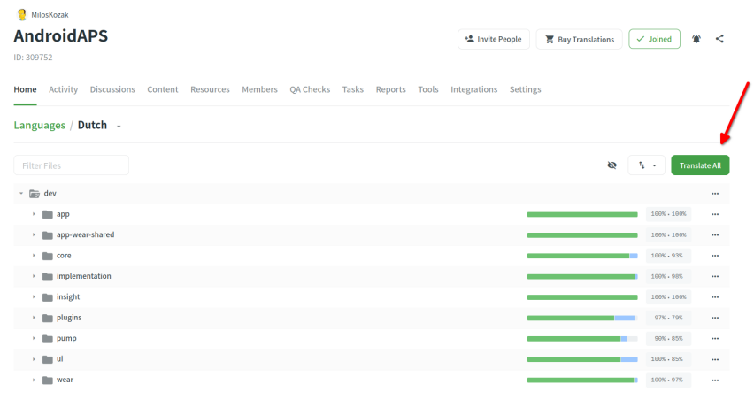
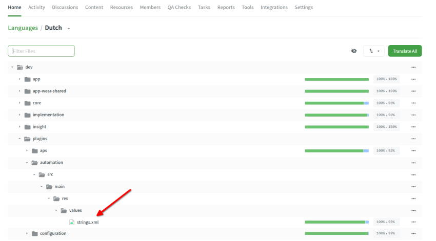
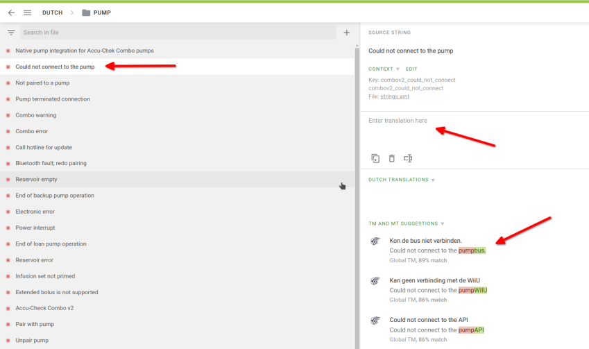
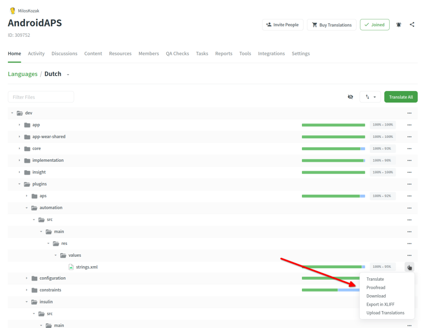
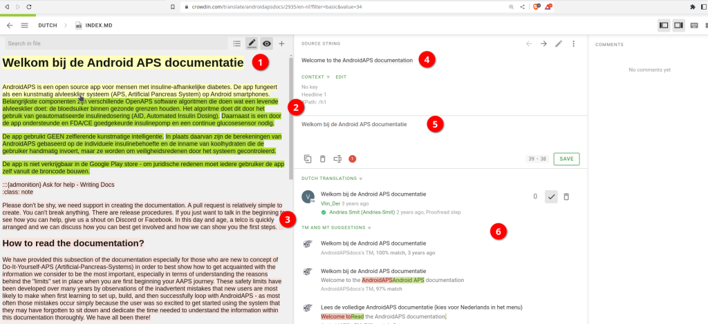
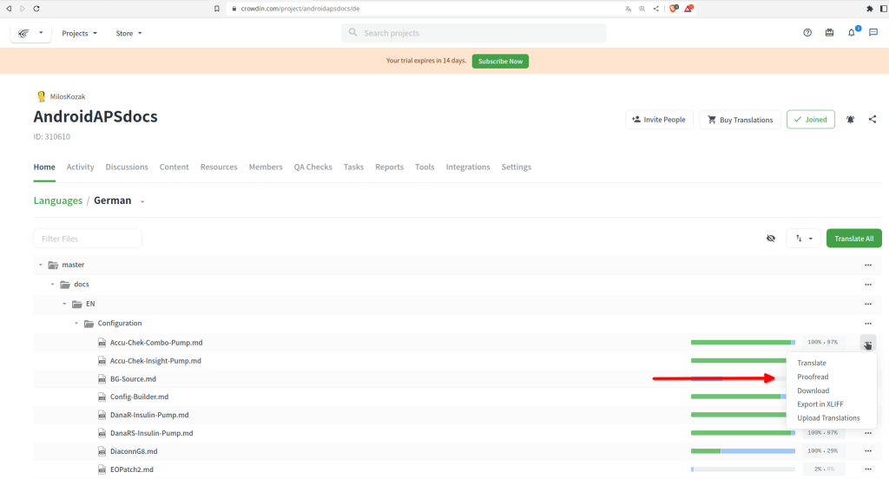

# 如何為 AAPS 應用程式或文件翻譯字串

* 要翻譯應用程式中使用的字串，請前往 <https://crowdin.com/project/androidaps>，並使用你的 GitHub 帳號登入
* 要翻譯文件，請查看 <https://crowdin.com/project/androidapsdocs>，並使用你的 GitHub 帳號登入

* 向文件團隊發送加入請求。 為此，點擊所需語言的國旗，然後在下一頁的右上角點擊“加入”按鈕。 請指定語言，提供一些關於你的資訊以及你的 AAPS 經驗，並說明你想成為翻譯者還是校對者（僅限具有翻譯技能且為進階 AAPS 用戶的人成為校對者）。

```{admonition} 審閱時間 :class: note

審閱是一個手動步驟。 作為非營利組織，我們不提供 SLA，但一般情況下審閱會在 1 天內完成。 如果沒有，請透過 Facebook 或 Discord 聯繫文件團隊。

    <br />* When we approve you, click the flag
       
    
    ## Translation of the app
    
    (translations-translate-strings-for-AAPS-app)=
    ### Translate strings for AAPS app
    
    * If you have no preference for strings you translate just select the "Translate All" button to start. 他會顯示需要翻譯的字串。
    
       
    
    * If you want to translate an individual file please search for the file via search dialog or tree structure and click on the filename to start the translation work on strings in that file.
    
       
    
    * Translate sentences on left side by adding new translated text or use & edit suggestion 
    
       
    
    
    ### Proofread strings for AAPS app
    
    * Proofreaders start by selecting "Proofread" when starting from the language home screen.
    
        
    
    
      and approve translated texts 
    
       
    
    When a proofreader approves a translation it will be added to the next version of AAPS.
    
    (translations-translation-of-the-documentation)=
    ## Translation of the documentation
    
    * Click the name of the docs page you want to translate
    
    
    
    
    * Translate sentences by sentence
    
        1. 黃色文本是你目前正在處理的文本。
    
        1. 綠色文本是已翻譯的文本。 你不需要再次翻譯這些。
    
        1. 紅色文本是仍需翻譯的文本。
    
        1. 這是你目前正在處理的原始文本
    
        1. 這是你正在準備的翻譯。 你可以從上方複製文本或選擇下方的建議之一。
    
        1. 這些是翻譯建議。 特別是，你可以看到 Crowdin 如何評價這一翻譯是否符合要求，或者這是否只是過去的內容經過文本重新排列而沒有內容更改。
        1. 按下“儲存”按鈕以儲存翻譯建議。 然後他會提交給校對者進行最終檢查。
    
    
    
    * A translated page will not be published in docs before 
    
        1. 翻譯已校對
    
        1. Crowdin 和 Github 之間的同步運作已完成（每小時一次），這會為 Github 建立 PR。
    
        1. 該 PR 在 Github 中獲得批准。
    
    一般來說，這需要 1-3 天，但在假日期間可能會花費更長時間。
    
    ### 翻譯鏈接
    
    ```{admonition} 鏈接不再翻譯
    :class: note鏈接不再翻譯。 過去我們在這裡有一個主題，但由於遷移到 Markdown 和 myst_parser，我們在英文文本中顯式建立標籤，並在底層將這些標籤傳播到其他語言。
    
    

你正在翻譯代表鏈接的文本。 請注意，**不要**移除由一對 `<0></0>` 標籤表示的鏈接，或者如果在同一段中有更多數字的鏈接也不要移除。

這是校對者需要特別注意的事項！

### 校對

* 校對者必須切換到校對模式
    
    
    
    並批准翻譯的文本
    
    

* 當校對者批准翻譯後，他將被添加到下一次文件建置中，該建置沒有固定的時間表，按需進行，但通常每週一次，假期期間除外。 為加快過程，你可以通知文件團隊關於新翻譯。