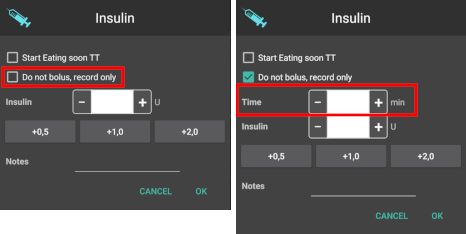

# 照護入口（已停用）

護理入口複製了你在 Nightscout 螢幕上的“+”圖示下找到的功能，該圖示允許你向記錄中添加筆記。 但照護入口沒有對幫浦發出任何指令！ 因此，若透過此畫面新增注射，只會將此紀錄記錄在你的 Nightscout 上，幫浦不會被指示進行注射。 這導致了許多誤解。

最初用來新增離線支援照護入口的程式碼與 AAPS 的開發並不相容，且實際上阻礙了後續的程式開發。 **因此，決定在 AAPS 版本 2.6 中移除照護入口。**

照護入口的大多數功能仍可在「操作」或主畫面中找到。 這些動作可以通過動作選項頁或漢堡選單訪問 - 具體取決於您在[配置建構器](../SettingUpAaps/ConfigBuilder.md)中的設定。

此頁面將展示你可以在哪裡找到先前照護入口的功能。

## 活動與回饋

- 年齡資訊已移至「操作」標籤/選單。
- 血糖偵測已移至「操作」標籤/選單。
- 臨時目標已移至「操作」標籤/選單。
- 運動功能已不再可用，但你可以在執行動作時使用對話框中的備註欄位（如進行注射等，參見[此頁面上的碳水化合物與注射截圖](#carbs--bolus)）。

(CPbefore26-carbs-bolus)=

## 碳水化合物與注射

- 記錄注射——無論是點心、餐食或修正——請使用主畫面的胰島素按鈕**並確認勾選「不進行注射，僅記錄」！**

- 如果忘記記錄用針筒注射的胰島素，僅勾選「不進行注射，僅記錄」的情況下，才可以回溯記錄胰島素。

  

- 進行碳水化合物修正時，請使用主畫面的碳水化合物按鈕。

- 可以透過「操作」標籤/選單的按鈕來啟動和停止臨時基礎率。 請注意，當設定臨時基礎率後，按鈕將從「TEMPBASAL」變為「取消 x%」。

## CGM 與 OpenAPS

- CGM 感測器插入已移至「操作」標籤/選單。
- 此部分的所有其他功能已被移除。 你可以在執行動作時使用對話框中的備註欄位（如進行注射等，參見[此頁面上的碳水化合物與注射截圖](#carbs--bolus)）。

## 幫浦

- 可以透過「操作」標籤/選單中的「排氣/填充」按鈕來更換幫浦位置與胰島素匣。
- 設定檔切換已移至「操作」標籤/選單。
- 幫浦電池更換已移至「操作」標籤/選單。
