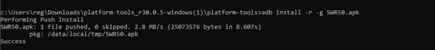

# 手動安裝 Google Play 服務於 Sony Smartwatch 3

Sony Smartwatch 3 是最常與 AAPS 搭配使用的手錶之一。 不幸的是，Google 在2020年秋天終止了對 Wear OS 1.5 設備的支援。 這導致 Sony SW3 在使用 AAPS 2.7 及以上版本時出現問題。

以下的解決方法應該可以延長 Sony Smartwatch 3 的使用時間，但請記住，遲早還是需要更換新手錶。

## 1. 下載最新的 Wear OS 版 GService

- 使用 [apkmirror 網站](https://www.apkmirror.com/apk/google-inc/google-play-services-android-wear/)，你可以找到 "Google Play Services (Wear OS)" 的最新 apk。

  架構：armeabi-v7a，最低版本：Android 6.0+，螢幕 DPI：nodpi

- 你必須確保兩件事：

  - 這是最新版本嗎？
  - 他是否與 Android 6.0+ 相容？（因為他是 Wear Android 版本，7.0+ 及以上版本無法運作）

- 遲早，Google 絕對會終止對 Android 6.0 的支援。 當這發生時，最新版本將不再適用於 Android 6.0+，因此將迎來終結。

## 2. 在你的電腦上下載/安裝 adb 偵錯工具

- 有多種方式可以安裝 adb 偵錯工具。
- 建議使用 [SDK Platform Tools](https://developer.android.com/studio/releases/platform-tools)：只需下載 zip 檔並解壓縮到你選擇的目錄。

## 3. 在你的手錶上啟用 ADB 偵錯選項

- 前往設定 --> 關於 --> 版本號，啟用開發者模式
- 或者可能是設定 --> 系統 --> 關於 --> 版本 --> 版本號

- 點擊7次。
- 然後前往設定 --> 開發者選項 --> ADB 偵錯（啟用）

## 4. 將你的手錶連線到電腦

- 將手錶插入電腦。
- 將最新下載的 Google 服務 APK 重命名為一個簡短的名字（例如 SW3fix.apk）。
- 將此 APK 放入 adb 工具的目錄中（例如：解壓縮的 SDK Platform Tools 目錄）。
- 使用 Windows 開始選單中的「cmd」指令打開 Windows 終端機。
- 在終端機中，進入包含 adb 工具和 Google 服務 APK 的目錄（輸入指令「cd \[你的路徑\]」，例如「cd C:UsersSWR50loopersdktools」）。
- 然後輸入 “adb devices”。
- 稍後，你應該會看到手錶上的偵錯權限提示：接受他。
- 在終端機中，當再次輸入 "adb devices" 時，應該會看到類似 "14452D11F536B52 device" 的訊息。
- 如果你看到 "unauthorized" 或其他，表示你還沒準備好進行下一步，回去再試一次。
- 如果你在這步遇到困難，可能需要為你的手錶安裝特定的驅動程式或其他東西。 在這時，Google 是你最好的朋友。
- 然後等待，安裝可能需要幾分鐘。

## 5. 將應用程式傳送到手錶

- 在終端機中輸入這個指令「adb install -r -g 應用名稱.apk」（所以在我們的例子中是「adb install -r -g SW3fix.apk」）。

  

- 等待約4–5分鐘以完成安裝。

  

- 當完成後，重新啟動手錶，應用程式應該會迅速開始同步。
