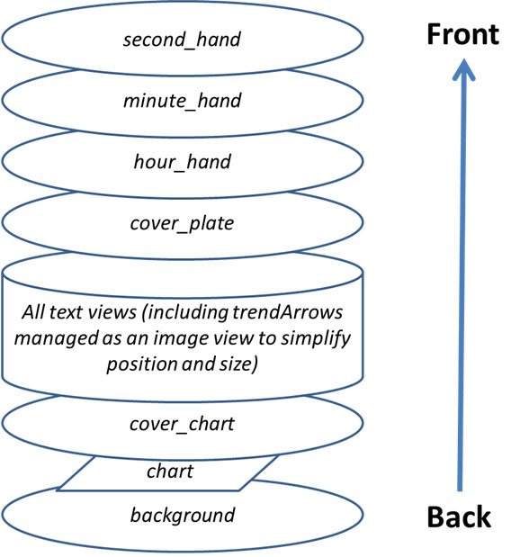
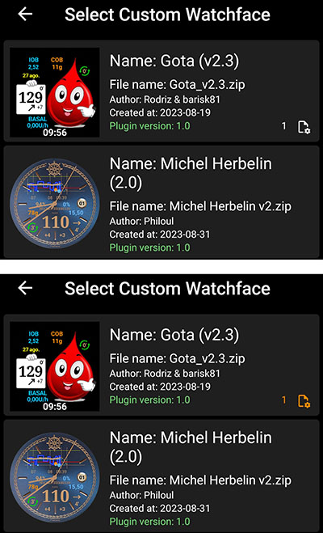
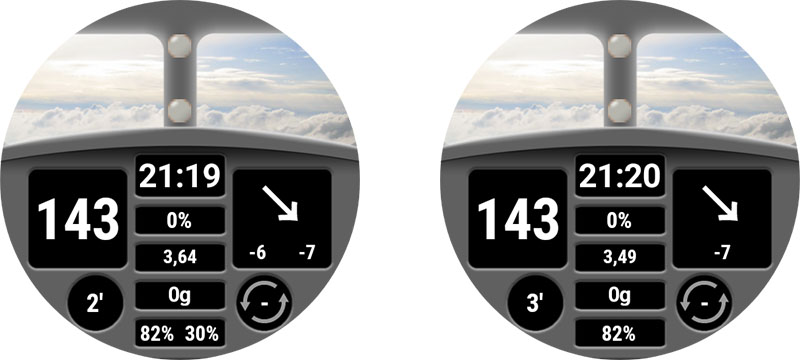
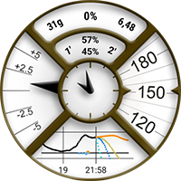
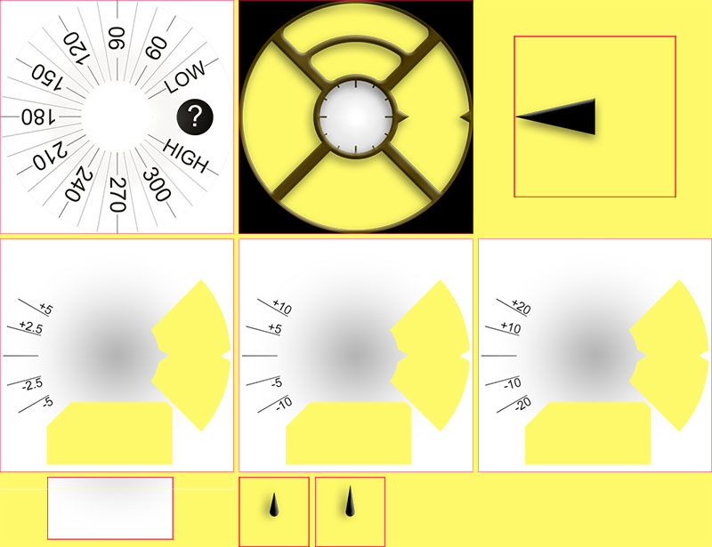

# 自訂錶盤參考文件

此頁面是為設計新錶盤的設計師提供的。 此處將列出所有關鍵字和功能，幫助你建立或動畫化新的錶盤。

- 在自訂錶盤 V2（Wear apk 3.3.0或以上）中，可用的新功能和鍵位[在這裡](#cwf-reference-new-v2-features)可查閱

## 自訂錶盤格式

自訂錶盤是一種為 AAPS 設計的開放格式，與錶上可用的「AAPS（自訂）」錶盤相關聯。

錶盤檔案是一個簡單的 zip 檔案，但要被識別為錶盤檔案，該 zip 檔案必須包含以下檔案：

- 一個名為 CustomWatchface 的圖片檔案（可以是點陣圖檔案 `CustomWatchface.jpg`、`CustomWatchface.png` 或向量檔案 `CustomWatchface.svg`）。 此檔案是用於在你點選「載入錶盤」按鈕時選擇錶盤的圖示，也是在 AAPS Wear 外掛中可見的圖像。
- 一個名為`CustomWatchface.json`的檔案（見下方[JSON 結構](#cwf-reference-json-structure)）。 這個第二個檔案是核心檔案，將包含設計錶盤所需的所有資訊。 這個 json 檔案必須是有效的（當用文字編輯器手動編輯這個檔案時，這可能是最棘手的地方，因為缺少或多出一個逗號就會破壞 json 格式）。 此 JSON 檔案還必須包含一個 `"metadata"` 區塊，內含 `"name"` 鍵，且其值不能為空。 這將是您的自定義手錶錶盤的名稱（見下方[Metadata設定](#cwf-reference-metadata-settings)）
- 此 zip 檔案的大小應盡可能小（不超過約 500KB）。 如果檔案太大，將會被阻擋，無法傳送到手錶。

該 zip 檔案還可以包含一些額外的資源檔案：

- 將在錶盤中使用的圖像硬編碼檔名，包括標準視圖（如`Background`、`CoverChart`... 請參見下面的[硬編碼資源檔案清單](#cwf-reference-list-of-hardcoded-resource-files)）。 這些檔案可以是 `jpg`、`png` 或 `svg` 格式。 但對於大多數情況，你需要使用支援透明度的 `png` 或 `svg`（相較於 png，jpg 檔案較小但不支援透明度）。 請注意，與最小的檔案大小相結合的最佳品質通常是 svg 檔案（向量格式）。
- 具有自由命名的額外資源檔案。 這些額外檔案可以是圖片檔案，也可以是字體檔案（支援的字體格式為 `ttf` 和 `otf`）。 請注意，對於這些額外檔案，`檔名`（不含副檔名）將在 JSON 檔案中用作 keyValue，以指定這些檔案應該在哪裡或何時使用。
  - 圖片檔案通常用作文字視圖的背景或用於動態動畫（如從 0% 到 100% 的電池電量）。
  - 字體檔案允許你在錶盤中使用專用字體。

(cwf-reference-json-structure)=
## JSON 結構

JSON 檔案可以在 Notepad（或 Notepad++）文字編輯器中編輯（建議使用 Notepad++，他可識別 JSON 並使用彩色格式顯示）。

- 他包含文字鍵 `"string_key":` 和鍵值，這些鍵值可以是文字（如 `"key value"`）、整數、布林值（如 `true` 或 `false`）或資料區塊。
- 每個值由逗號 `,` 分隔。
- 資料區塊由 `{` 開始，並以 `}` 結束。
- 整個 json 檔案是一個完整的區塊，因此他從 `{` 開始，並以 `}` 結束，並且檔案內所有嵌入的區塊都與一個 `"key"` 相關聯，該鍵應該在該區塊內是唯一的。
- 為了提高 json 檔案的可讀性，通常會縮排（每個新鍵位於新行，每個新區塊向右縮進 4 個空格字元）。

(cwf-reference-metadata-settings)=
### Metadata 設定

此區塊是 json 檔案中包含的第一個區塊，且是必需的。 他包含與此錶盤相關的所有資訊，如名稱、作者、建立或更新日期、作者版本或外掛版本。

請參閱下方的中繼資料區塊範例：

```json
"metadata": {
    "name": "Default Watchface",
    "author": "myName",
    "created_at": "07\/10\/2023",
    "author_version": "1.0",
    "cwf_version": "1.0",
    "comment": "Default watchface, you can click on EXPORT WATCHFACE button to generate a template"
},
```

請注意，日期中使用的 `/` 是特殊字元，因此在 json 檔案中正確識別時，必須在他前面加上「跳脫」字元 `\`。

你可以在某些 json 檔案中看到一個額外的鍵 `"filename"`，當自訂錶盤載入 AAPS 時，這個鍵將自動建立或更新（他將用來向使用者顯示匯出資料夾中的 zip 檔案名），因此你可以在中繼資料區塊中刪除此鍵。

(cwf-reference-general-parameter-settings)=
### 一般參數設定

在第一個包含 metadata 的區塊之後，你將設置一些一般參數（請參見下面的[一般參數清單](#cwf-reference-list-of-general-parameters)），這使你可以設置圖形顏色（碳水化合物、注射、血糖值...），以及預設的範圍內數值顏色、過高或過低的顏色（血糖值和箭頭的預設顏色）

請參閱下方的一般參數範例：

```json
"highColor": "#FFFF00",
"midColor": "#00FF00",
"lowColor": "#FF0000",
"lowBatColor": "#E53935",
"carbColor": "#FB8C00",
"basalBackgroundColor": "#0000FF",
"basalCenterColor": "#64B5F6",
"gridColor": "#FFFFFF",
"pointSize": 2,
"enableSecond": true,
```
(cwf-reference-imageview-settings)=
### ImageView 設定

自訂圖片可以使用與自訂錶盤佈局中每個 ImageView 相關的正確檔名進行調整，然後 json 區塊僅用來定義位置、大小、視圖是否可見，並可選擇調整顏色：

請參閱下方的秒針圖像區塊範例（在這種情況下，zip 檔案中沒有包含圖像，因此將使用預設的秒針圖像，但會調整為自訂顏色）。

```json
"second_hand": {
    "width": 400,
    "height": 400,
    "topmargin": 0,
    "leftmargin": 0,
    "visibility": "visible",
    "color": "#BC906A"
}
```
要將秒針著色為預設的血糖顏色（範圍低、中或高），只需修改最後一行的鍵值 `bgColor`。

```json
    "color": "bgColor"
```

(cwf-reference-textview-settings)=
### TextView 設定

TexView 比 ImageView 有更多可用參數：你可以調整旋轉（度數的整數值）、字體大小（以像素為單位的整數值）、重力（用來定義文字值是置中（預設值）、靠左對齊還是靠右對齊）、設置字體、字體樣式和字體顏色，還有 TextView 的背景顏色。

```json
"basalRate": {
    "width": 91,
    "height": 32,
    "topmargin": 133,
    "leftmargin": 249,
    "rotation": 0,
    "visibility": "visible",
    "textsize": 23,
    "gravity": "center",
    "font": "default",
    "fontStyle": "bold",
    "fontColor": "#BDBDBD"
},
```
請注意，如果你不想在你的錶盤中管理一個視圖，則將`"visibility"`關鍵字設為`"gone"`，但也要設置大小和位置在可見區域之外，如下所示：

```json
"second": {
    "width": 0,
    "height": 0,
    "topmargin": 0,
    "leftmargin": 0,
    "rotation": 0,
    "visibility": "gone",
    "textsize": 46,
    "gravity": "center",
    "font": "default",
    "fontStyle": "bold",
    "fontColor": "#BDBDBD"
},
```
如果大小和位置在可見區域內，你可能會在錶盤重新整理期間看到隱藏值的「閃爍」。

如果你想自訂文字視圖的背景圖片，可以使用鍵 `"background":`，並將包含在 zip 檔案中的圖片檔案名稱作為值，你也可以只使用鍵 `"color:"` 來更改背景顏色。

```json
"background": "fileName"
```

你還有 4 個特定的 TextView（名為 freetext1 到 freetext4），他們有一個特定的參數 `"textvalue":`，可用來設置標籤之類的東西。

(cwf-reference-chartview-settings)=
### ChartView 設定

圖表視圖是一個非常特定的視圖，可以與 ImageView 或 TextView 共享一些參數……

此視圖的標準設定非常簡單：

```json
"chart": {
    "width": 400,
    "height": 170,
    "topmargin": 230,
    "leftmargin": 0,
    "visibility": "visible"
},
```
此視圖的 2 個額外參數是背景顏色（預設為透明），使用鍵 `"color"`，或使用鍵 `"background"` 來設定背景圖像。

(cwf-reference-how-to-build-watchface)=
## 如何建置/設計你的第一個錶盤

### 所需工具

- 文字編輯器：我建議使用 NotePad++（或同類工具），這是一個簡單的文字編輯器，但他的附加值在於你可以看到彩色代碼的格式化文本，因此更容易偵測錯誤。 任何簡單的文字編輯器都可以完成此工作。 他將用來調整 json 資訊。
- 圖像編輯器（點陣圖和/或向量圖）
  - 如果你使用點陣圖
    - 圖像編輯器應能處理透明度（背景以上的所有圖像都需要透明度），並支援 png 格式（如果你使用點陣圖）。
    - 背景圖像可以是 jpg 格式（比 png 小）。
    - 圖像編輯器應允許你以像素為單位測量圖形對象（可以是簡單的方塊）（上、左、寬、高）。
    - 圖像編輯器應能以十六進制顯示 RRVVBB 顏色代碼。
    - 圖像編輯器應能將圖像調整為 400px x 400px（使用此解析度工作非常重要）。
  - 如果你使用向量圖
    - 向量圖像應以 svg 格式匯出。

### 獲取範本以免從零開始

當你想設計第一個錶盤時，最好的方法是從預設錶盤開始（這會確保你擁有所有正確排序的可用視圖的最新版本）。

- 你可以透過在 Wear 外掛中點選「匯出範本」按鈕來獲取 zip 檔案，並在 AAPS/exports 資料夾中找到 zip 檔案。
- 請注意，你需要將手錶連線到 AAPS 以查看自訂錶盤按鈕（但手錶也需要用來檢查、測試和調整你的自訂錶盤）。

預設錶盤非常簡單，zip 檔案將只包含兩個檔案：

- CustomWatchface.png（用於選擇預設錶盤的圖像）
- CustomWatchface.json

### 在電腦上組織你的檔案

最簡單的工作方式是將手機連線到電腦，並使用兩個特定資料夾工作：

- 一個檔案總管打開到特定資料夾，該資料夾將包含所有檔案（json、點陣圖圖像、向量圖像、字體），以及 CustomWatchface.zip 檔案。
- 另一個檔案總管（或已調整的導覽樹）打開到 Phone/AAPS/exports 資料夾。

這樣工作非常簡單：每次使用文字編輯器調整 json 檔案，使用圖像編輯器（點陣圖或向量圖）編輯圖像後，你只需：

1. 在每個應用程式中儲存你的修改。
2. 將所有檔案拖放到 CustomWatchface.zip 檔案中。
3. 將 CustomWatchface.zip 拖放到手機的 AAPS/exports 資料夾中。
4. 將 CustomWatchface 發送到手錶以檢查結果。

### 初始化錶盤自訂。

第一步，你必須定義錶盤的名稱（以便於測試時輕鬆選取），並開始調整 json 檔案開頭的中繼資料鍵。

接著，你需要定義要顯示哪些資訊，因此需要設定哪些視圖應該顯示或隱藏。

- 你是否需要管理秒針？
- 你想設計一個類比錶盤還是數位錶盤（或兩者兼具...）

現在，你可以開始修改 json 檔案，將每個視圖的 `"visibility"` 鍵設置為 `"visible"` 或 `"gone"`（如果你想保留或不保留該視圖）。

你還可以開始大致調整上、左邊距和寬度、高度值，以便開始組織錶盤（這些值稍後會使用圖像編輯器進行微調）。

注意：所有設計都在 **400px x 400px 的矩形** 內進行。 因此，所有內容都會在此大小範圍內以絕對座標定位。

當你設計第一個錶盤時，必須知道所有視圖（ImageView 或 TextView）從後到前分層排列，因此每個視圖可以隱藏在其後方的元素。





然後在 json 檔案中，所有視圖按從後到前的順序排列（這將幫助你記住哪些元素在後方）。

如果你設計或調整第一個自訂錶盤，請從簡單的事情開始：更改一些視圖的可見性，包含一個專用背景圖像，無需更改 json 檔案。

### 管理顏色

在 json 檔案中，你將有幾個鍵來指定顏色：`"color"`、`"fontColor"` 用於視圖，還有 `"highColor"`、`"midColor"`、`"lowColor"` 等等（請參閱 [一般參數列表](#cwf-reference-list-of-general-parameters)）

顏色透過文本欄位指定，該欄位以 `#` 開頭，後接 RRGGBB（紅、綠、藍）值的十六進制格式：

- `"#FFFFFF"` 是白色，`"#000000"` 是黑色，`"#FF0000"` 是紅色。

你還可以包含兩個附加值來指定透明度層級（AARRGGBB）：

- `"#00000000"` 是完全透明，`"#FF000000"` 是完全不透明（因此 `"#FF000000"` 相當於 `"#000000"`）。

你也可以使用特定的鍵值 `"bgColor"`，根據血糖值自動使用 `"highColor"`、`"midColor"`、`"lowColor"`，這些值已在一般參數中指定：

- `"fontColor": "bgColor",` 將自動根據血糖值設置視圖的字體顏色。
- 請注意，`sgv`（血糖值）和 `direction`（趨勢箭頭）視圖會自動應用血糖色彩（這兩個視圖，如果你想要不同顏色，你將需要使用進階的[dynData](#cwf-reference-dyndata-feature) 功能並使用單步顏色）。

有關 ImageViews 和 `"color":` 鍵的更多資訊，請參閱下方專門章節 [調整圖片顏色](#cwf-reference-tune-image-color)。

### 包含硬編碼圖像

開始調整你的錶盤的最簡單方法是將一些特定名稱的圖像包含在 zip 檔案中（請參閱[硬編碼資源檔案列表](#cwf-reference-list-of-hardcoded-resource-files)）。

- 圖像應為 `.jpg`、`.png` 或 `.svg` 格式。 但要注意，jpg 不支援透明度，因此應僅用於背景圖層。 對於所有中介層（cover_chart、cover_plate、hands），請使用 `.png` 或 `.svg` 圖片

- 如果你有向量圖像編輯器（例如 Illustrator），請優先使用此格式，他會產生帶有 `.svg` 副檔名的小型文本檔案，效果最佳。
- 你必須注意檔名，務必精準拼寫（包括大小寫）。

現在如果你想要專用的背景圖像，你只需在 zip 檔案中包含一個名為 `Background.jpg` 的檔案（無需更改其他內容）。 將 zip 檔案發送到手錶並檢查結果！

如果你想為類比錶自訂時針、分針或秒針，只需包含 `HourHand.png`（或 `HourHand.svg`）、`MinuteHand.png` 和 `SecondHand.png`。

- 這些圖像將自動繞圖像中心旋轉，因此這些圖像應設置為 00:00:00（對於「全畫幅」類比錶盤，請使用 400 x 400 px 的大小，並定位於 top 0 left 0）。

你還可以在[硬編碼資源檔案列表](#cwf-reference-list-of-hardcoded-resource-files)中注意到，對於每個圖像視圖，你有兩個額外的硬編碼檔名 `High` 和 `Low`（例如，你可以在 zip 檔案中包含其他名為 `BackgroundHigh.jpg` 和 `BackgroundLow.jpg` 的圖像）。 然後圖像將根據你的血糖數值自動更改（在範圍內、高血糖或低血糖）。 請參閱 AIMICO 錶盤作為範例。

(cwf-reference-tune-image-color)=
### 調整圖像顏色

`"color"` 鍵可用於調整預設的圖像顏色：

- 應用於背景視圖時，他將設置背景顏色（預設為黑色）。
- 應用於 cover_plate（簡單錶盤）或指針時，他將根據指定的顏色（包括 `"bgColor"`）更改預設圖像（白色）。

當你將 `"color"` 鍵應用於點陣圖圖像（`.jpg` 或 `.png`）時，顏色將對色彩飽和度產生有趣的效果。 因此，你仍然可以識別你的點陣圖圖像。

最後在 `.svg` 圖片檔案中，`"color"` 鍵將不會有任何效果，請將向量文件的顏色視為在圖片中硬編碼。 如果你想更改顏色，則需要包含幾個 `svg` 檔案，並使用進階 [dynData](#cwf-reference-dyndata-feature) 功能來更改它

### 為 TextViews 使用額外字體

Wear apk 中已經有多個預設字體（請參閱[鍵值](#cwf-reference-key-values)章節中的字體鍵）。 但如果你想使用未預設的額外字體，可以在 zip 檔案中包含額外的字體：

- 支援的字體格式為 `.ttf` 和 `.otf`。
- 如果你在 zip 檔案中包含自訂字體，例如名為 `myCustomFont.ttf` 的檔案，則你需要使用檔名在 json 檔案中將其用於 TextView：

```
"font": "myCustomFont",
```

請記住，一些字體檔案可能很大（而你對 zip 檔案的大小有最大限制）。 因此，如果你只使用很少的字元（數字、`.`、`,`），你可以使用免費工具來移除未使用的字元（例如 [這裡](https://products.aspose.app/font/generator/ttf-to-ttf)），然後減小字體大小。

(cwf-reference-advanced-features)=
## 進階功能

(cwf-reference-preference-feature)=
### 偏好設定功能

CustomWatchface 可以自動調整一些手錶的偏好設定，以確保正確顯示錶盤（如果使用者在 Wear 偏好設定中授權）。

但是此功能應謹慎使用。 偏好設定是與其他錶盤共用的。 因此，使用此功能時應遵守下列規則：

- 不要設定隱藏檢視相關的偏好設定
- 盡量最大化可見的檢視
- 可以自由調整某些檢視的寬度：
  - TBR 可以顯示為百分比（寬度較小，但也可以顯示為絕對值，寬度更大）
  - delta 或平均 delta 的詳細資訊可以顯示更寬
  - 同樣地，iob2 的檢視可以顯示總 iob，但如果選擇顯示詳細 iob，文字大小可能會變得很長

如果仍然需要某些非常特殊的設定來正確顯示（如下範例所示，如果沒有足夠的空間顯示詳細 iob，你可以將手錶上的此參數強制設為 `false`，並可在元資料區塊中包含這類設定約束

```json
"metadata": {
    "name": "預設錶盤",
    "author": "myName",
    "created_at": "07\/10\/2023",
    "author_version": "1.0",
    "cwf_version": "1.0",
    "comment": "預設錶盤，你可以點擊匯出錶盤按鈕生成範本",
    "key_show_detailed_iob": false
},
```

如果使用者授權自訂錶盤修改手錶參數（設定於 Wear 外掛內），那麼顯示詳細 iob 會設為 "停用"，並鎖定為停用（直到在 Wear 外掛參數內取消授權或選擇其他錶盤，否則無法修改此參數）。

- 請注意，當使用者選擇錶盤時，他可以在選擇過程中看到「必要參數」的數量。

如下範例所示，Gota 錶盤有一個必要參數。 如果未授權，他會以白色顯示；如果授權，則此參數會設置並鎖定於手錶上（此時數字為橙色）。




(cwf-reference-twinview-feature)=
### 雙視圖功能

雙視圖提供了一種基於可見檢視調整檢視位置的簡便方式。 這不如完全使用 LinearLayout 排版來得強大，但可以處理許多常見情況。

如下範例所示，你可以看到 AAPS（駕駛艙）錶盤中的所有檢視都在設定內可見，而相同錶盤在「隱藏顯示鑽機電池」及「隱藏顯示平均 delta」時的效果。



你可以看到當其中一個雙視圖被隱藏時，另一個會自動居中移動。

在此範例中，你可以看到在 `"uploader_battery"` 區塊中，添加了 `"twinView":` 鍵來定義 `"rig_battery"` 檢視，而在 `"rig_battery"` 區塊中， `"twinView":` 鍵定義了 `"uploader_battery"` 為雙檢視。 隨後，額外的鍵 `"leftOffsetTwinHidden":` 定義了雙視圖被隱藏時的位移像素數量。

要計算這個數字，你可以看到兩個雙視圖的左邊界差為 50 像素，因此位移量為一個方向的一半。

如果雙視圖是垂直排列的，則需要使用鍵 `"topOffsetTwinHidden":`。

```json
"uploader_battery": {
    "width": 49,
    "height": 30,
    "topmargin": 354,
    "leftmargin": 150,
    "rotation": 0,
    "visibility": "visible",
    "textsize": 23,
    "gravity": "center",
    "font": "roboto_condensed_bold",
    "fontStyle": "bold",
    "fontColor": "#FFFFFF",
    "twinView": "rig_battery",
    "leftOffsetTwinHidden": 25
},
"rig_battery": {
    "width": 49,
    "height": 30,
    "topmargin": 354,
    "leftmargin": 200,
    "rotation": 0,
    "visibility": "visible",
    "textsize": 23,
    "gravity": "center",
    "font": "roboto_condensed_bold",
    "fontStyle": "bold",
    "fontColor": "#FFFFFF",
    "twinView": "uploader_battery",
    "leftOffsetTwinHidden": -25
},
```
(cwf-reference-dyndata-feature)=
### DynData 功能

DynData 是你想要根據一些內部資料（如血糖值、血糖數值、delta、電池百分比等，詳見可用資料 [此處](#cwf-reference-dyndata-key-values)）在錶盤中加入動畫時，最強大的功能。

為了說明此功能，我將以 AAPS（蒸汽龐克）錶盤為例：



在此錶盤中，我們需要管理 [血粒值旋轉](#cwf-reference-background-management)（從 30 度到 330 度），[avg_delta 的動態範圍](#cwf-reference-avg-delta-management)（根據值縮放至 5mgdl、10mgdl 或 20mgdl），[指針的旋轉](#cwf-reference-dynamic-rotation-management)應與縮放同步，還有檢視的不同圖層...

要管理此錶盤，請參閱以下包含於 zip 檔案中的所有圖片：

注意：為了顯示透明區域，所有這些圖片都有黃色背景並被紅色方框包圍。



- 在第一排中，Background.jpg 和 CoverPlate.png 會自動映射至相關的檢視（預設檢視檔案名），而 steampunk_pointer.png 將由 dynData 管理。
- 在第二排中，你可以看到動態範圍的 3 個 avg_delta 尺度，這些也將由 dynData 管理。
- 在第三排中，chartBackground.jpg 會手動連結到圖表檢視，HourHand.png 和 MinuteHand.png 檔案將自動映射到相關的檢視。

(cwf-reference-background-management)=
#### **背景管理**

首先，關於血糖值（BG）圖像，這裡無法選擇，他只能位於背景層（否則他將出現在圖表前面，圖表將無法顯示！）。 因此，我們必須將血糖值對應到背景，然後根據血糖值旋轉背景圖像。

在`"background"`區塊內，我們將包括兩個專用的鍵來進行這個旋轉：

```json
"background": {
    "width": 400,
    "height": 400,
    "topmargin": 0,
    "leftmargin": 0,
    "dynData": "rotateSgv",
    "rotationOffset": true,
    "visibility": "visible"
},
```
`"dynData":`鍵將定義應該使用哪個區塊來定義動畫（值、範圍、轉換等），在這裡這個區塊被命名為 "rotateSgv"（使用此功能時選擇一個明確的名稱）。

`"rotationOffset": true,` 將定義根據值期望的動畫應該是旋轉。 （其他可用的鍵還有`"leftOffset"`和`"topOffset"`，如果你想建立滑塊的話）

現在，我們將在文件的末尾，在最後一個視圖之後進行操作：

```json
"second_hand": {
    "width": 120,
    "height": 120,
    "topmargin": 140,
    "leftmargin": 140,
    "visibility": "gone"
},
"dynData": {
    "rotateSgv": {
        "valueKey": "sgv",
        "minData": 30,
        "maxData": 330
    },
```
你可以看到在最新的視圖（`"second_hand"`）之後，我們新增了一個新的`"dynData": { ... }`區塊，這將包含所有的動畫：

在`"background"`視圖內定義的區塊被命名為`"rotateSgv"`，這是你在`"dynData"`內找到的第一個區塊！

這個區塊很簡單：你有一個名為`"valueKey":`的第一個鍵，將用來定義應該使用哪個值。 在這種情況下，`"sgv"`是定義血糖值的 "keyValue"（請注意，在大多數情況下，keyValue與顯示此資訊的視圖名稱相同）。

關於血糖值，預設的最小資料設為 39mgdl，最大資料設為 400mgdl（請參閱 [DynData 參考鍵值](#cwf-reference-dyndata-key-values) 下面的所有可用鍵值及其最小/最大資料值）。

在`"rotateSgv"`區塊內，將使用兩個附加的鍵（`"minData":` 和 `"maxData":`）來調整最小和最大資料至30和330。 有了這些最小和最大值，我們將能夠直接使用資料值（無需任何轉換）來以角度旋轉背景。 在這種情況下，所有超過330 mg/dL的血糖值將被限制在圖像的上限330。

#### **圖表管理**

圖表的預設背景是透明的，因此為了隱藏包含於背景圖像中的血糖刻度，我們需要加入專用的背景圖像（此圖像將包含蒸汽龐克錶盤整體的陰影效果）。 連結到charBackground.jpg文件是透過`"background":`鍵完成的

當然，視圖的尺寸和定位必須精準到像素！

```json
"chart": {
    "width": 216,
    "height": 107,
    "topmargin": 280,
    "leftmargin": 80,
    "visibility": "visible",
    "background": "chartBackground"
},
```
(cwf-reference-avg-delta-management)=
#### **平均變化管理**

為了能夠管理平均變化的動態範圍，我們將使用四個自由文字視圖。 freetext1將用來管理圖像刻度，freetext2至freetext4將根據刻度管理指針的旋轉。

**freetext1**

如前所述，自由文字視圖位於圖表和背景的前面，因此我們加入了透明區域以顯示這些圖像（圖像的右側和底部）。

請注意，這些圖像底部被移除的部分已用作圖表的背景，實現完美的整合。

```json
"freetext1": {
    "width": 400,
    "height": 400,
    "topmargin": 0,
    "leftmargin": 0,
    "rotation": 0,
    "visibility": "visible",
    "dynData": "avgDeltaBackground"
},
```
在這個視圖中，我們將連結到另一個名為`"avgDeltaBackground"`的`"dynData"`區塊。 此區塊將根據平均變化值來管理avgDelta刻度。

```json
"avgDeltaBackground": {
    "valueKey": "avg_delta",
    "minData": -20,
    "maxData": 20,
    "invalidImage": "steampunk_gauge_mgdl_5",
    "image1": "steampunk_gauge_mgdl_20",
    "image2": "steampunk_gauge_mgdl_20",
    "image3": "steampunk_gauge_mgdl_10",
    "image4": "steampunk_gauge_mgdl_5",
    "image5": "steampunk_gauge_mgdl_5",
    "image6": "steampunk_gauge_mgdl_10",
    "image7": "steampunk_gauge_mgdl_20",
    "image8": "steampunk_gauge_mgdl_20"
},
```
- `"valueKey":`將與`"avg_delta"`值進行連結
- 最小和最大資料也會將範圍限制在此錶盤內可用的最大值（從-20 mg/dL到20 mg/dL）。 對於mmol使用者，請記住，所有的內部值在AAPS中始終以mg/dL表示。

接下來我們將看到如何根據值來管理動態背景圖像。

`"invalidImage":`是管理當資料無效（或資料遺失）時顯示圖像的鍵。 這裡我們將連結到包含在zip文件中的5 mg/dL刻度的額外資源圖像

接下來我們將使用一系列圖像，從`"image1":`開始到`"image8":`。 提供的圖像數量將定義最小資料和最大資料之間的步驟數。

- `image1`將定義當avg_delta等於或接近`minData`時顯示的圖像，而編號最高的圖像（此處為`image8`）將用於定義當avg_delta等於或接近`maxData`時應顯示的圖像。
- 在-20 mg/dL和20 mg/dL之間，總範圍是40 mg/dL，分為8個步驟（提供的圖像數量），每步5 mg/dL。
- 現在我們可以根據avg_delta值來映射背景圖像，從最低值開始：在-20和-15之間以及-15和-10之間，我們將使用`steampunk_gauge_mgdl_20`來顯示刻度，然後在-10和-5之間使用`steampunk_gauge_mgdl_10`，依此類推，直到+15和+20，我們再次使用`steampunk_gauge_mgdl_20`背景圖像。

(cwf-reference-dynamic-rotation-management)= **freetext2 到 freetext4**

對於這些視圖，我們將結合之前解釋過的動態圖片和旋轉功能：

```json
"freetext2": {
    "width": 276,
    "height": 276,
    "topmargin": 64,
    "leftmargin": 64,
    "rotation": 0,
    "visibility": "visible",
    "dynData": "avgDelta5",
    "rotationOffset": true
},
"freetext3": {
    "width": 276,
    "height": 276,
    "topmargin": 64,
    "leftmargin": 64,
    "rotation": 0,
    "visibility": "visible",
    "dynData": "avgDelta10",
    "rotationOffset": true
},
"freetext4": {
    "width": 276,
    "height": 276,
    "topmargin": 64,
    "leftmargin": 64,
    "rotation": 0,
    "visibility": "visible",
    "dynData": "avgDelta20",
    "rotationOffset": true
},
```
每個視圖都專用於特定的刻度（因此與專用的動態資料區塊相連），你還可以注意到這三個視圖中啟用了 `"rotationOffset"` 鍵。現在來看看第一個動態資料區塊：

```json
"avgDelta5": {
    "valueKey": "avg_delta",
    "minData": -20,
    "maxData": 20,
    "rotationOffset": {
        "minValue": -120,
        "maxValue": 120
    },
    "invalidImage": "null",
    "image1": "null",
    "image2": "null",
    "image3": "null",
    "image4": "steampunk_pointer",
    "image5": "steampunk_pointer",
    "image6": "null",
    "image7": "null",
    "image8": "null"
},
```
即使動態範圍只在 -5 到 +5 avg_delta 資料之間使用，保持 -20 到 +20mgdl 的整體範圍仍然很重要，這樣才能確保指針在刻度切換期間與背景同步。 這就是為什麼我們保持與 `avgDeltaBackground` 相同的整體範圍和相同的步驟數（8 張圖片）。

你可以注意到 `"invalidImage"` 或幾個 `"圖片xx"` 的鍵值為 `"null"`（這可以是 Zip 文件中不存在的任何文字）。 當找不到文件名時，視圖的背景圖片將變為透明。 因此，設定確保指針僅在步驟 4 和步驟 5（avg delta 在 -5mgdl 和 +5 mgdl 之間）可見，並且不會在此範圍之外顯示。

現在我們可以看到一個新的區塊 `"rotationOffset"`，其中包含兩個鍵 `"minValue"` 和 `"maxValue"`。 這些值用於將內部資料（以 mgdl 為單位）轉換為我們希望的旋轉角度。

- 蒸汽朋克錶盤的設計使指針的最大旋轉角度從 -30 度到 30 度。 因此，根據刻度（此處從 -5mgdl 到 5mgdl），我們希望這些值具有 30 度的旋轉。 由於 `最小資料` 和 `最大資料` 大 4 倍，則相應的最小值和最大值是 4 * 30 度，因此為 -120 度和 +120 度。 但對於所有超過或低於 ±30 度的旋轉，指針將被隱藏（無圖片可見），並且指針僅在 -5 到 +5mgdl 之間顯示... 所以這正是這裡的預期結果。

其他動態資料區塊定義的方式相同，用於調整 `"avgDelt10"` 和 `"avgDelta20"`

#### 循環視圖

在蒸汽朋克錶盤的循環中，綠色和紅色箭頭（用於狀態）被停用，這也透過與循環視圖相關聯的專用動態資料區塊進行管理。

```json
    "loopArrows": {
        "invalidImage": "greyArrows",
        "image1": "greenArrows",
        "image2": "redArrows"
    }
```
由於此區塊僅由循環視圖調用，並且此視圖管理的預設資料是循環資訊，因此 `"數值鍵"` 鍵是可選的。

循環的預設 `最小資料` 和 `最大資料` 定義為 0 分鐘和 28 分鐘，因此使用兩張圖片，所有小於 14 分鐘的資料值將顯示背景 `圖片1`，所有大於 14 分鐘的資料值將顯示 `圖片2`。 14 分鐘正是從綠箭頭切換到紅箭頭的門檻值。

在此範例中，`greyArrows`、`greenArrows` 和 `redArrows` 文件未包含在 ZIP 文件中，因此這些箭頭只是被移除（不可見），但如果你想用自訂的背景圖片調整狀態箭頭，可以「按原樣」使用此區塊。

#### rig_battery 和 uploader_battery 視圖

為了完成對動態資料功能的總覽，我們來看看電池管理。 這裡的想法是根據電池電量（從 0% 到 100%）自訂文字顏色。

```json
"uploader_battery": {
    "width": 60,
    "height": 28,
    "topmargin": 100,
    "leftmargin": 170,
    "rotation": 0,
    "visibility": "visible",
    "textsize": 20,
    "gravity": "center",
    "font": "default",
    "fontStyle": "bold",
    "fontColor": "#00000000",
    "dynData": "batteryIcons",
    "twinView": "rig_battery",
    "topOffsetTwinHidden": -13
},
"rig_battery": {
    "width": 60,
    "height": 28,
    "topmargin": 74,
    "leftmargin": 170,
    "rotation": 0,
    "visibility": "visible",
    "textsize": 20,
    "gravity": "center",
    "font": "default",
    "fontStyle": "bold",
    "fontColor": "#00000000",
    "dynData": "batteryIcons",
    "twinView": "uploader_battery",
    "topOffsetTwinHidden": 13
},
```
你可以在這裡看到，這兩個視圖共用一個名為 `batteryIcons` 的動態資料區塊。 這是可能的，因為預設情況下，附加的資料是視圖的資料（因此不需要在 `batteryIcons` 區塊中指定 `"valueKey"` 鍵，他會根據視圖應用於 `uploader_battery` 資料或 `rig_battery` 資料）。

注意，這兩個視圖也使用了 [這裡](#cwf-reference-twinview-feature)解釋的雙視圖功能。

現在來看看動態資料區塊：

```json
"batteryIcons": {
    "invalidFontColor": "#00000000",
    "fontColor1": "#A00000",
    "fontColor2": "#000000",
    "fontColor3": "#000000",
    "fontColor4": "#000000",
    "fontColor5": "#000000"        
},
```
這裡我們使用與動態背景圖片完全相同的邏輯，但使用專用的鍵（`"invalidFontColor"` 和 `"fontColor1"` 到 `"fontColor5"` 指定每個 20% 步驟）。

- `"fontColor1"`（深紅色）將用於所有低於 20% 的值，而白色將用於所有高於該門檻值的值。
- 如果你想將門檻值降低到「低於 10%」，只需添加 5 個額外的鍵，從 `"fontColor6"` 到 `"fontColor6"`，但你也可以調整每種顏色，如果你想要從綠色到黃色、橙色和紅色的漸變……

(cwf-reference-dynpref-feature)=
### 動態偏好功能

在閱讀本章之前，必須了解[動態資料](#cwf-reference-dyndata-feature)的工作原理，因為動態偏好是動態資料的進階用法：現在你可以根據使用者設定的偏好來調整每個動態資料區塊：

為了說明動態偏好功能，我們將使用兩個範例：

- 蒸汽朋克錶盤（簡單用法，包括在同一錶盤中 mgdl 和 mmol 版本，錶盤將根據 AAPS 中選擇的單位自動切換）。
- AAPS V2 錶盤將結合不同的偏好來管理文字顏色和背景，根據黑暗和匹配分隔符的偏好。

#### Steampunk 錶盤中的 dynPref 簡單使用

在 Steampunk 中，我們必須根據單位設置圖像：`背景` 圖像將具有血糖尺度，並根據血糖值旋轉。 以及 `freeText1`，其中包含根據 avgDelta 值的動態尺度。為了能夠擁有一個自動顯示正確單位的錶盤，我們應根據所選單位選擇圖像。

為了做到這一點，我們將在視圖區塊內將 `dynData` 鍵替換為 `dynPref` 鍵：

```json
 "background": {
    "width": 400,
    "height": 400,
    "topmargin": 0,
    "leftmargin": 0,
    "dynPref": "rotateSgv",
    "rotationOffset": true,
    "visibility": "visible"
},
```
使用 `dynPref` 鍵的方式與前一章解釋的 `dynData` 鍵非常接近

現在我們來看看 json 文件末尾的部分，位於 `dynData` 區塊之後：

```json
"dynData": {
    ...
},
"dynPref": {
    "rotateSgv": {
        "prefKey": "key_units",
        "true": {
            "valueKey": "sgv",
            "minData": 30,
            "maxData": 330,
            "invalidImage": "Background_mgdl",
            "image1": "Background_mgdl"
        },
        "false": {
            "valueKey": "sgv",
            "minData": 30,
            "maxData": 330,
            "invalidImage": "Background_mmol",
            "image1": "Background_mmol"
        }
    },
    ...
}
```
你可以看到在 `background` 視圖區塊中定義的 dynpref 鍵 (`"dynPref": "rotateSgv"`) 存在於 json 文件末尾的 `dynPref` 區塊中：

此區塊應包含一個 `"prefKey"` 鍵，該鍵將定義應使用哪個偏好設定。 在此範例中，鍵 `"key_units"` 與電話中的 AAPS 所選的單位相關聯，如果所選單位是 mg/dL 則值為 `"true"`，如果是 mmol 則為 `"false"`。

然後你會發現兩個使用 "dynData" 格式的 json 區塊，這些區塊將根據所選的偏好設定使用。

請注意，背景圖像的 "HardCoded" 檔名現在已被動態圖像取代，無論血糖值如何，他將是相同的背景圖像（如果 key_units 為 "true"，則為 `Background_mgdl.png` 檔案，如果 key_units 為 false，則為 `Background_mmol.png`），並且我們還包括一個 `"invalidImage"` 鍵，即使沒有從電話接收到資料也能始終顯示背景圖像。

#### 在 dynPref 中結合不同的偏好設定，使用 AAPS V2

大多數時候，當你設置一個偏好設定時，他只是根據你的選擇顯示結果，但在 dynPref 中，他被認為是一種動態功能...

- 當在 `dynData` 中指定一整個參數區塊（包含圖像、字體顏色、顏色等）時，使用 `dynPref`，你將能根據特定偏好設定組合每個參數。
- 在這裡，我們將看到如何將分隔線偏好設定與暗色偏好設定匹配，以便在啟用時（true）顯示黑色背景上的白色文字（在暗色錶盤上，暗色參數為 true），或在淺色錶盤上顯示白色背景上的黑色文字（暗色為 false）...

首先，讓我們看看 json 文件的開頭部分：

```json
"dynPrefColor": "prefColorDark",
"pointSize": 2,
"enableSecond": false,
"background": {
    "width": 400,
    "height": 400,
    "topmargin": 0,
    "leftmargin": 0,
    "visibility": "visible",
    "dynPref": "dark"
},
```
`"dynPrefColor": "prefColorDark"` 將指定所有視圖外預設顏色的 dynPref 區塊。 這些顏色將根據 `"prefColorDark"` 中的暗色參數進行調整：

最後，在 `dynPref` 區塊內，將會有一個專門為預設顏色設置的 dynPref 區塊：

```json
"prefColorDark": {
    "prefKey": "key_dark",
    "true": {
        "highColor": "#FFFF00",
        "midColor": "#00FF00",
        "lowColor": "#FF0000",
        "lowBatColor": "#E53935",
        "carbColor": "#FB8C00",
        "basalBackgroundColor": "#0000FF",
        "basalCenterColor": "#64B5F6",
        "gridColor": "#FFFFFF"
    },
    "false": {
        "highColor": "#A0A000",
        "midColor": "#00A000",
        "lowColor": "#A00000",
        "lowBatColor": "#E53935",
        "carbColor": "#D07C00",
        "basalBackgroundColor": "#0000A0",
        "basalCenterColor": "#64B5F6",
        "gridColor": "#303030"
    }
}
```
此 dynPref 區塊與用於視圖的其他標準 dynPref 區塊之間的區別在於，這裡沒有為 `"key_dark"` 參數的每個值設置 dynData 區塊，而只是列出主要顏色（`highColor`、`midColor` 等）。

現在讓我們看看納入「分隔橫幅」的項目（在下面的例子中 `"basalRate"` 視圖連接到 `"matchDivider"` dynPref 視圖：

```json
"basalRate": {
    "width": 90,
    "height": 32,
    "topmargin": 127,
    "leftmargin": 242,
    "rotation": 0,
    ...
    "leftOffsetTwinHidden": 33,
    "dynPref": "matchDivider"
},
```
然後在 dynPref 區塊中，你可以看到 Match divider 參數（`key_match_divider` 鍵），包括 2 個區塊「true」和「false」，但這兩個區塊僅用於定義視圖將使用「深色」dynBlock（也就是與標籤外的其他視圖擁有相同的背景和文字顏色），或「白色」dynBlock，將為背景和文字設定對立的顏色...

```json
"matchDivider": {
    "prefKey": "key_match_divider",
    "true": {
        "dynPref": "dark"
    },
    "false": {
        "dynPref": "white"
    }
},
"dark": {
    "prefKey": "key_dark",
    "true": {
        "color1": "#000000",
        "fontColor1": "#FFFFFF"
    },
    "false": {
        "color1": "#FFFFFF",
        "fontColor1": "#000000"
    }
},
```
請注意，這裡你位於 "dynData" 區塊中，然後要定義顏色或字體顏色，將使用 dynData（此處未指定），並使用單步驟 (`"color1"` 和 `'fontColor1'` ）。

- 對於除 `image` 以外的所有參數，預設的 "無效值"（如果未由 `"invalidColor"` 鍵或 `"invalidFontColor"` 鍵專門設置）將是 `"color1"` 和 `"fontColor1"`。


接著我們將看到 iob 視圖的第三個範例（`iob1` 和 `iob2`），其中我們將使用較小的文字來顯示詳細的 iob，並使用較大的文字來顯示總 iob：

```json
"iob1": {
    "width": 125,
    "height": 33,
    "topmargin": 168,
    "leftmargin": 275,
    "rotation": 0,
    "visibility": "visible",
    "textsize": 19,
    ...
    "dynPref": "prefIob1"
},
"iob2": {
    "width": 125,
    "height": 33,
    "topmargin": 196,
    "leftmargin": 275,
    "rotation": 0,
    "visibility": "visible",
    "textsize": 24,
    ...
    "leftOffsetTwinHidden": -10,
    "dynPref": "prefIob2"
},
```
在預設的視圖設定中，你會看到文字大小（在 `iob1` 上為 19，在 `iob2` 上為 24）以及兩個不同的 `dynPref` 區塊，這些應調整文字大小（根據詳細的 iob 參數）和顏色（根據深色參數）

```json
"prefIob1": {
    "prefKey": "key_show_detailed_iob",
    "true": {
        "dynPref": "dark",
        "textsize1": 24
    },
    "false": {
        "dynPref": "dark"
    }
},
"prefIob2": {
    "prefKey": "key_show_detailed_iob",
    "true": {
        "dynPref": "dark",
        "textsize1": 19
    },
    "false": {
        "dynPref": "dark"
    }
},
```
你可以看到根據詳細 iob 參數（`"key_show_detailed_iob"` 鍵），當他為 "true" 時，文字大小會被定義為比預設值更大的固定值（24 代替預設的 19）：這是使用文字大小 "step" 功能完成的，並且只使用一個值，因此為單步驟...（請注意，對於除圖像外的所有參數，如果未設置 invalidTextSize，則將使用 textsize1 作為無效資料的文字大小）

然後 "dark" dynPref 區塊將用來設置顏色和字體顏色

在此範例中，如果啟用了詳細 IOB 且啟用了暗色，將為 iob1 視圖使用的 dynData 區塊為：

```
{
    "color1": "#000000",
    "fontColor1": "#FFFFFF",
    "textsize1": 24
},
```

因此，文字將顯示為黑色背景上的白色，並且大小 24 將取代視圖中設置的預設大小 19

如果停用了詳細 IOB 且停用了暗色，則將為相同的 iob1 視圖使用的 dynData 區塊為：

```
{
    "color1": "#FFFFFF",
    "fontColor1": "#000000"
},
```

現在文字將顯示為白色背景上的黑色，並且大小為 19

#### dynPref 使用技巧與訣竅

- 你可以結合任意數量的偏好設定，但要小心，描述的區塊數量可能會急速增加（呈指數增長）：如果你串聯 3 個參數並且想要定義所有情況，你將需要描述 8 個區塊，如果每個參數只有 2 個值...
- 小心不要建立 "無限循環"（例如，如果 dynpref1 區塊應由 dynpref2 區塊補全，而 dynpref2 區塊又應由 dynpref1 區塊補全...）。 在這種情況下，dynpref 區塊將被視為無效...
- 不要忘記在鍵後面包括數字索引（例如當你在視圖中使用 `"textsize"` 鍵時，你將不得不在 dynPref 值區塊中使用 `"textsize1"`，因為這是 "dynData" 格式，因此在這種情況下鏈接到單步驟的值）
- 每個視圖僅應設置一個鍵 `"valueKey"`，因此如果最終 `dynData` 區塊是由幾個 `dynPref` 區塊構建，請不要包含多個 `"valueKey"`（以及相關的 `"minData"`、`"maxData"` 等）。

(cwf-reference-new-v2-features)=
### CustomWatchface V2 的新功能（AAPS V3.3.0 或以上版本）

請注意，使用這些新功能或視圖的錶盤將需要根據 AAPS 3.3.0 版本構建的最新 wear apk。

如果你使用包含 CustomWatchface V1 的 zip "v2"，則你將在錶盤上缺少資訊或內容錯誤。

#### 新的狀態視圖可用

該視圖的鍵是 `"status"`，相應的區塊自動包含在從 wear apk "Custom Watchface V2"（基於 AAPS 3.3.0 版本或以上版本）導出的模板中

此視圖已納入之前的 AAPS（無圖表）、AAPS（大圖表）和 AAPS（大圖表）之前存在的錶盤中，並包含一個字符串值（在 wear apk 中構建）。

這些之前的錶盤已被刪除，並在 AAPS 3.3.0 中由 3 個新的自訂錶盤取代。

- 最少的訊息是 IOB 值（無論錶上的 IOB 參數為何，始終可見）
- 然後你可以看到詳細的 IOB 值（BolusIOB|BasalIOB），如果在偏好設定中啟用
- 以及 BGI 值（同樣如果在偏好設定中啟用）

這個 `"status"` 視圖與 `"key_show_loop_status"` 鍵（在 dynPref 內）相關聯，用於管理可見性。

此視圖在 V1 中可通過 `"iob1"`、`"iob2"` 和 `"bgi"` 現有視圖進行管理，但需要複雜的 dynPref 設定，以根據不同的設定選擇進行每個資訊的間距管理。

(cwf-reference-new-formating-feature)=
#### DynData 或 DynPref 的新格式化功能

你現在可以管理手錶接收的原始值的自訂格式，並包含在 [dyndata 鍵值表](#cwf-reference-dyndata-key-values) 下面。

為了示範此功能如何運作，讓我們以 AAPS（大圖表）錶盤為例，根據“時間前的值”和新的「狀態」視圖的可見性來查看結果：


- 在左側的第一張截圖中，狀態視圖是可見的（有 IOB、詳細 IOB 和 BGI），因此僅有 1/3 的行可用來顯示時間戳（非常緊湊的資訊，顯示為 `1'`，以及上傳者的電池資訊 `U: 55%`）
- 在第二張截圖中，現在 `status` 視圖在錶參數中被隱藏，因此你有很多空間可以顯示完整的時間戳資訊和上傳者電池（`1 minute ago` 和 `Uploader : 55%`）
- 在右側的第三張截圖中，你在錶中擁有完全相同的設置，但現在時間戳已改變，顯示為「1」以上。 現在自訂錶盤能夠顯示更新的標籤，並進行複數管理（`2 minutes ago`）

我將不會解釋下面整個視圖是如何在 zip 檔案內管理的（根據不同的設定定位每個視圖），但我將專注於如何管理 AAPS（大圖表）錶盤中的格式化功能和相關的動態值。


**此功能需要「動態區塊」**（可以是 `dynData` 區塊或 `dynPref` 區塊）

- 對於 AAPS（大圖表）錶盤，我們希望根據參數調整格式（根據 `status` 視圖的可見性使用短或長格式），因此我們使用了 `dynPref` 區塊。

首先讓我們開始看這些視圖：

```json
"uploader_battery": {
    "width": 200,
    "height": 50,
    "topmargin": 175,
    "leftmargin": 0,
    "rotation": 0,
    "visibility": "visible",
    "textsize": 25,
    "gravity": "center",
    "font": "roboto_condensed_light",
    "fontStyle": "normal",
    "dynPref": "uploader",
    "dynValue": false,
    "fontColor": "#BDBDBD"
},

"timestamp": {
    "width": 200,
    "height": 50,
    "topmargin": 175,
    "leftmargin": 0,
    "rotation": 0,
    "visibility": "visible",
    "textsize": 25,
    "gravity": "center",
    "font": "roboto_condensed_light",
    "fontStyle": "normal",
    "dynPref": "timestamp",
    "dynValue": false,
    "fontColor": "#FFFFFF"
},
```
這裡最重要的鍵是 `"dynValue"`：擁有這個鍵的資料將啟用原始值的動態管理。 後面的布林值（true 或 false）將定義值是否應「轉換」或不轉換

- `false`：原始值將如實使用，無需任何限制或轉換
- `true`：原始值將被轉換（使用 dynData 區塊中的 `minData` 和 `maxData` 鍵，並使用 dynData 中定義的 `minValue` 和 `maxValue`）

對於這個錶盤，原始值直接使用而無需任何轉換，因此對於這兩個視圖，`"dynValue"` 鍵被設置為 `false`。


現在我們來看看 `"uploader"` 區塊在 `"dynPref"` 中的定義：

```json
"uploader": {
    "prefKey": "key_show_loop_status",
    "true": {
        "dynPref": "uploader_true_ago",
        "invalidTextvalue": "U: --",
        "textvalue1": "U: %.0f%%"
    },
    "false": {
        "dynPref": "uploader_false_ago",
        "invalidTextvalue": "Uploader: --",
        "textvalue1": "Uploader: %.0f%%"
    }
},
```
預設情況下 `"uploader_battery"` 視圖與 `"uploader_battery"` 連接，因此無需添加明確的行

`"valueKey": "uploader_battery"` （最小值 0，最大值 100，原始值為手機電池的百分比）

格式化字符串包含在 `"textvalue1"` 鍵內（`"textvalue1"`、`"textvalue2"` 等鍵與可包含在 `view` 區塊的 `"textvalue"` 鍵連結）

- `"textvalue"` 鍵可以在視圖區塊中與格式化資訊一起使用（在這種情況下，格式將是靜態的，不論值或設定如何）
- 如果您想根據設定或值修改格式化資訊，則可以應用所有 dynData 功能，專用的鍵有 `"invalidTextValue"` 鍵（不帶 "格式化資訊"，因為值無效）以及 `"textvalue1"`、`"textvalue2"`...（以及您想管理的最小資料與最大資料之間的任何值）
- 額外的 `"dynPref"` 鍵用於根據可見視圖、暗黑和分隔線設定定義其他區塊以改變位置和顏色

關於格式化字串，語法如下：`%[flags][width][.precision]f`

- `%` 是格式化的開始，`f` 是結尾，應用於 Double 值轉換。
  - 請注意，如果您想在字串中使用 `%` 字元，您必須使用 `%%` 來指定它不是格式化字串，而是百分比字元。
- `[flag]` 是可選的，主要可以是 `+`，如果您始終想在數字前添加符號，或者 `(` 如果您想將負值用括號括起來
- `[width]` 是可選的，定義輸出中要寫入的最小字元數
- `[.precision]` 用於定義小數點後的位數。
  - 請注意，值為 Double，因此最好總是設定精度（以避免因 Kotlin 精度導致的小數點後出現過多字元）

因此在上面的例子中，`%.0f` 將顯示 Double 值作為整數


現在讓我們看看時間戳 dynPref 區塊以管理複數：

```json
"timestamp": {
    "prefKey": "key_show_loop_status",
    "true": {
        "dynPref": "timestamp_true_uploader",
        "invalidTextvalue": "U: --",
        "textvalue1": "%.0f'"
    },
    "false": {
        "dynPref": "timestamp_false_uploader",
        "minData": 0,
        "maxData": 3,
        "invalidTextvalue": "-- minute ago",
        "textvalue1": "%.0f minute ago",
        "textvalue2": "%.0f minutes ago"
    }
},
```
- 如果 `status` 視圖是可見的（因此 `"key_show_loop_status"` 鍵為 `true`），則使用單一格式（`"textvalue1"`），`'` 作為 "單位"
- 如果 `status` 視圖是隱藏的，則有 2 種不同的格式，一種用於 0 或 1 的單數，另一種用於大於 2 的複數值
  - `"minData"` 和 `"maxData"` 用於定義範圍，並確保單數與複數之間的切換將在 1 和 2 值之間進行
  - 請注意，`"maxData"`（整數）設定為 3 而不是 2，僅僅因為系統中處理的 Double 資料不是整數，因此略高或略低於 1 的值無論如何都可能有單數或複數格式，即使經過四捨五入成為整數，值等於 1。

- 對於 `timestamp` 視圖，重要的是將 `"dynValue"` 鍵設定為 `false`，否則由於格式化（單數/複數），所有大於 3 的值將被限制為 `3 minutes ago`，並使用 `maxData` 進行轉換...


**有關格式化功能的補充說明**

- 請記住，唯一可用的動態值是這裡列出的[這裡](#cwf-reference-dyndata-key-values)
- 所有`血糖`值均為 mgdl 單位，如果您想使用格式化功能以 mmol 單位顯示值，則必須管理 mgdl 到 mmol 的轉換。 在 `dynData` 或 `dynPref` 區塊中，用於命名將包含 `"minValue"` 和 `"maxValue"` 用於值轉換的區塊的鍵應命名為 `"dynValue": { ...  }`。 (參見 [Dyn Data Keys](#cwf-reference-dyndata-keys))
- 如果在視圖中要使用靜態格式化字串，使用 `"textvalue"` 鍵來定義格式，並使用 `"dynValue"` 鍵來定義動態值的使用，則還必須使用 `"dynData"` 或 `"dynPref"` 區塊（即使是空的），以能夠使用格式化功能。
- `"textvalue1"`、`"textvalue2"` 到 `textvalue<em x-id="3">n</em>` 可以不使用格式化功能來替換 Double 值步驟，並以專用文字標籤取代（例如使用 `"day_name"` 鍵值和七個步驟來定義自訂名稱的星期幾...）

- 完整文件您可以查看[Class Formatter](https://docs.oracle.com/javase/8/docs/api/java/util/Formatter.html)

(cwf-reference-key-and-keyvalue-reference)=
## 鍵與鍵值參考

(cwf-reference-list-of-metadata-keys)=
### 中繼資料鍵清單

(cwf-reference-list-of-standard-metadata-keys)=
#### 標準資訊中繼資料鍵清單

| Key                | 註解                                              |
| ------------------ | ----------------------------------------------- |
| `"name"`           | 自訂錶盤的名稱                                         |
| `"author"`         | 作者的名字或別名                                        |
| `"created_at"`     | 建立（或更新）日期，請注意 `/` 是特殊字元，因此如果你將其用於日期，請在前面加上 `\` |
| `"cwf_version"`    | 錶盤外掛與你的錶盤設計相容                                   |
| `"author_version"` | 作者可以在此指定其錶盤的版本                                  |
| `"comment"`        | 可以用來提供目前錶盤的一些資訊或限制的自由文本                         |

(cwf-reference-preference-keys)=
#### 偏好設定鍵

| Key                           | 註解                                                                                                                                                        |
| ----------------------------- | --------------------------------------------------------------------------------------------------------------------------------------------------------- |
| `"key_show_detailed_iob"`     | 如果為 true，將會在 `iob2` 視圖中鎖定詳細的 IOB 資料，然後 `iob1`（如果可見且未被圖示取代）將顯示 iob 總量。<br />如果為 false，則在 `iob2` 視圖中鎖定 iob 總量。 如果 `iob2` 的寬度太小，無法正確顯示詳細的 iob 資料，則可以使用 |
| `"key_show_detailed_delta"`   | false（僅當設計與 `delta` 和 `avg_delta` 視圖的詳細 delta 寬度不相容時）                                                                                                     |
| `"key_show_bgi"`              | 如果你的設計需要 `bgi` 資訊，則為 true                                                                                                                                 |
| `"key_show_iob"`              | 如果你的設計需要 `iob1` 或 `iob2` 視圖，則為 true                                                                                                                       |
| `"key_show_cob"`              | 如果你的設計需要 `cob1` 或 `cob2` 視圖，則為 true                                                                                                                       |
| `"key_show_delta"`            | 如果你的設計需要 `delta` 資訊，則為 true                                                                                                                               |
| `"key_show_avg_delta"`        | 如果你的設計需要 `avg_delta` 資訊，則為 true                                                                                                                           |
| `"key_show_uploader_battery"` | 如果你的設計需要 `uploader_battery`（電話電池）資訊，則為 true                                                                                                               |
| `"key_show_rig_battery"`      | 如果你的設計需要 `rig_battery` 資訊，則為 true                                                                                                                         |
| `"key_show_temp_basal"`       | 如果你的設計需要 `basalRate` 資訊，則為 true                                                                                                                           |
| `"key_show_direction"`        | 如果你的設計需要 `direction` 資訊（血糖 變化箭頭），則為 true                                                                                                                  |
| `"key_show_ago"`              | 如果你的設計需要 `timestamp` 資訊（上次接收到血糖資料的分鐘數），則為 true                                                                                                            |
| `"key_show_bg"`               | 如果你的設計需要 `sgv` 資訊（血糖 值），則為 true                                                                                                                           |
| `"key_show_loop_status"`      | 如果你的設計需要 `loop` 資訊（循環狀態和時間），則為 true                                                                                                                       |
| `"key_show_week_number"`      | 如果你的設計需要 `week_number` 資訊（循環狀態和時間），則為 true                                                                                                                |
| `"key_show_date"`             | 如果你的設計需要 `日期`、`月份` 或 `星期幾` 資訊，則為 true                                                                                                                     |

#### 內部鍵

| Key                   | 註解                                                 |
| --------------------- | -------------------------------------------------- |
| `"filename"`          | 當錶盤載入時，該鍵將自動建立（或更新），並將包含匯出資料夾中的本地 zip 檔案名稱         |
| `"cwf_authorization"` | 當錶盤載入時該鍵將被建立，並且每次在 Wear 設定中更改授權偏好設定時都會更新，並用於同步手錶授權 |

(cwf-reference-list-of-general-parameters)=
### 常規參數清單

| Key                      | 註解                                                                                |
| ------------------------ | --------------------------------------------------------------------------------- |
| `"highColor"`            | `"#FFFF00"`（預設黃色）：當血糖高於上限（高血糖）時，血糖 值、趨勢箭頭和圖表中的血糖值顏色                               |
| `"midColor"`             | `"#00FF00"`（預設綠色）：當血糖處於範圍內時，血糖 值、趨勢箭頭和圖表中的血糖值顏色                                   |
| `"lowColor"`             | `"#FF0000"`（預設紅色）：當血糖低於下限（低血糖）時，血糖 值、趨勢箭頭和圖表中的血糖值顏色                               |
| `"lowBatColor"`          | `"#E53935"`（預設深紅色）：當 `uploader_battery` 值較低（低於 20%）時的顏色                           |
| `"carbColor"`            | `"#FB8C00"`（預設橙色）：圖表中的碳水化合物點的顏色                                                   |
| `"basalBackgroundColor"` | `"#0000FF"`（預設深藍色）：圖表中的 TBR 曲線顏色                                                  |
| `"basalCenterColor"`     | `"#64B5F6"`（預設淺藍色）：圖表中的注射或 SMB 點的顏色                                               |
| `"gridColor"`            | `"#FFFFFF"`（預設白色）：圖表中的線條和文字刻度的顏色                                                  |
| `"pointSize"`            | 2（預設值）：圖表中點的大小（1 為小點，2 為大點）                                                       |
| `"enableSecond"`         | false（預設值）：指定錶盤是否在 `時間`、`秒` 或 `秒針` 視圖中顯示秒數。 在視圖的可見性和這個總體設定之間保持一致非常重要，這將允許每秒更新時間資訊 |
| `"dayNameFormat"`        | "E"（預設值）：從 "E" 到 "EEEE" 指定日期格式（數字、簡稱、全名）                                          |
| `"monthFormat"`          | "MMM"（預設值）：從 "M" 到 "MMMM" 指定月份格式（數字、簡稱、全名）                                        |

(cwf-reference-list-of-hardcoded-resource-files)=
### 硬編碼資源檔案清單

對於大多數圖像，高和低後綴允許根據血糖數值（在範圍內、高血糖或低血糖）調整圖像

| 檔案名稱                                                            | 註解                                                             |
| --------------------------------------------------------------- | -------------------------------------------------------------- |
| CustomWatchface                                                 | 顯示在錶盤選擇和 Wear 外掛中的圖像                                           |
| Background,<br />BackgroundHigh,<br />BackgroundLow | none（預設黑色）：背景圖像。 背景始終可見，預設顏色為黑色，如果沒有提供圖像。 可以修改顏色以符合錶盤設計        |
| CoverChart,<br />CoverChartHigh,<br />CoverChartLow | none（預設值）：圖表前面的圖像（應具有透明度，以便看到後面的圖表）可用於限制圖表的邊界                  |
| CoverPlate,<br />CoverPlateHigh,<br />CoverPlateLow | 簡單的錶盤（預設值）：所有文字值前面的圖像。 必須透明，才能看到後面的所有值                         |
| HourHand,<br />HourHandHigh,<br />HourHandLow       | hour_hand（預設值）：時針圖像。 提供了一個預設圖像，可以著色以符合類比設計。 請注意，旋轉的軸心將是圖像的中心   |
| MinuteHand,<br />MinuteHandHigh,<br />MinuteHandLow | minute_hand（預設值）：分針圖像。 提供了一個預設圖像，可以著色以符合類比設計。 請注意，旋轉的軸心將是圖像的中心 |
| SecondHand,<br />SecondHandHigh,<br />SecondHandLow | second_hand（預設值）：秒針圖像。 提供了一個預設圖像，可以著色以符合類比設計。 請注意，旋轉的軸心將是圖像的中心 |
| ArrowNone                                                       | ?? （預設值）：當沒有可用的有效箭頭時顯示的圖像。                                     |
| ArrowDoubleUp                                                   | ↑↑（預設值）：向上雙箭頭圖像                                                |
| ArrowSingleUp                                                   | ↑（預設值）：單箭頭向上圖像                                                 |
| Arrow45Up                                                       | ↗（預設值）：四十五度向上箭頭圖像                                              |
| ArrowFlat                                                       | →（預設值）：數值箭頭圖像                                                  |
| Arrow45Down                                                     | ↘（預設值）：四十五度向下箭頭圖像                                              |
| ArrowSingleDown                                                 | ↓（預設值）：單箭頭向下圖像                                                 |
| ArrowDoubleDown                                                 | ↓↓（預設值）：向下雙箭頭圖像                                                |

對於上述的每個檔名，副檔名可以是 `.jpg`、`.png` 或 `.svg`。 但要注意，`.jpg` 不支援透明度（所以大多數檔案應使用 .png 或 .svg，以免遮擋後面的視圖...）

(cwf-reference-list-of-view-keys)=
### 視圖鍵清單

此清單從背景到前景排序，這在你組織錶盤時非常重要，因為某些圖像或文字可能會被其他圖像遮住

| Key                  | 視圖類型   | 相關資料                                               | DynData 鍵               |
| -------------------- | ------ | -------------------------------------------------- | ----------------------- |
| `"background"`       | 圖像視圖   |                                                    |                         |
| `"chart"`            | 專用圖表視圖 | 圖形曲線                                               |                         |
| `"cover_chart"`      | 圖像視圖   |                                                    |                         |
| `"freetext1"`        | 文字視圖   |                                                    |                         |
| `"freetext2"`        | 文字視圖   |                                                    |                         |
| `"freetext3"`        | 文字視圖   |                                                    |                         |
| `"freetext4"`        | 文字視圖   |                                                    |                         |
| `"iob1"`             | 文字視圖   | IOB 標籤或 IOB 總量                                     |                         |
| `"iob2"`             | 文字視圖   | IOB 總量或 IOB 詳細資訊                                   |                         |
| `"cob1"`             | 文字視圖   | 碳水化合物標籤                                            |                         |
| `"cob2"`             | 文字視圖   | COB 值                                              |                         |
| `"delta"`            | 文字視圖   | 短期 delta（5 分鐘）                                     | delta                   |
| `"avg_delta"`        | 文字視圖   | 平均 Delta（15 分鐘）                                    | avg_delta               |
| `"uploader_battery"` | 文字視圖   | 電話電池電量（百分比）                                        | uploader_battery        |
| `"rig_battery"`      | 文字視圖   | rig 電池電量（百分比）                                      | rig_battery             |
| `"basalRate"`        | 文字視圖   | 百分比或絕對值                                            |                         |
| `"BGI"`              | 文字視圖   | mg/dL/(5 分鐘) 或 mmol/(5 分鐘)                         |                         |
| `"status"`*          | 文字視圖   | IOB的合成（根據手錶中的IOB設定），詳細的IOB（根據手錶中的設定和BGI（根據手錶中的設定）） |                         |
| `"time"`             | 文字視圖   | HH:MM 或 HH:MM:SS                                   |                         |
| `"hour"`             | 文字視圖   | HH                                                 |                         |
| `"minute"`           | 文字視圖   | MM                                                 |                         |
| `"second"`           | 文字視圖   | SS                                                 |                         |
| `"timePeriod"`       | 文字視圖   | 上午或下午                                              |                         |
| `""day_name""`       | 文字視圖   | 星期幾名稱（參考 dayNameFormat）                            | 星期名稱                    |
| `"day"`              | 文字視圖   | DD 日期                                              | 日期                      |
| `"week_number"`      | 文字視圖   | （WW）週數                                             | 週數                      |
| `"month"`            | 文字視圖   | 月份名稱（參考 monthFormat）                               |                         |
| `"loop"`             | 文字視圖   | 自上次執行後的分鐘數和狀態（背景中的彩色箭頭），可以使用 DynData 調整彩色箭頭        | 循環                      |
| `"direction"`        | 圖像視圖   | 趨勢箭頭                                               | 趨勢方向                    |
| `""timestamp""`      | 文字視圖   | 整數（自上次接收資料後的分鐘數）                                   | 時間戳                     |
| `"SGV"`              | 文字視圖   | sgv 值（mg/dL 或 mmol）                                | sgv<br />sgvLevel |
| `"cover_plate"`      | 圖像視圖   |                                                    |                         |
| `"hour_hand"`        | 圖像視圖   |                                                    |                         |
| `"minute_hand"`      | 圖像視圖   |                                                    |                         |
| `"second_hand"`      | 圖像視圖   |                                                    |                         |

**自Custom Watchface V2.0或以上版本中新增的視圖（可用於AAPS 3.3.0穿戴apk或以上版本）*

(cwf-reference-list-of-json-keys)=
### Json 鍵清單

(cwf-reference-common-keys)=
#### 通用鍵

 可用於所有視圖類型（文字視圖、圖像視圖、圖表視圖）

| Key                      | 類型  | 註解 / 值                                                                                                                |
| ------------------------ | --- | --------------------------------------------------------------------------------------------------------------------- |
| `"width"`                | 整數  | 視圖寬度（像素）                                                                                                              |
| `"height"`               | 整數  | 視圖高度（像素）                                                                                                              |
| `"topmargin"`            | 整數  | 頂端邊距（像素）                                                                                                              |
| `"leftmargin"`           | 整數  | 左側邊距（像素）                                                                                                              |
| `"rotation"`             | 整數  | 旋轉角度（度數）                                                                                                              |
| `"visibility"`           | 文字  | 請參閱鍵值表                                                                                                                |
| `"dynData"`              | 文字  | 鍵區塊名稱，將指定要連結的動態資料和相關動畫（顏色、圖像、位移、旋轉）<br />`"dynData": "customName",` （見下文）                                       |
| `"leftOffset"`           | 布林值 | 如果希望啟用由 dynData 值引起的數值位移（正值或負值），請包含此鍵並將鍵值設為 true                                                                      |
| `"topOffset"`            | 布林值 | 如果希望啟用由 dynData 值引起的垂直位移（正值或負值），請包含此鍵並將鍵值設為 true                                                                      |
| `"rotationOffset"`       | 布林值 | 如果希望啟用由 dynData 值引起的旋轉（正值或負值），請包含此鍵並將鍵值設為 true                                                                        |
| `"twinView"`             | 文字  | 另一個視圖的鍵（通常另一個視圖也會包含雙視圖參數，並包含此視圖的鍵）                                                                                    |
| `"topOffsetTwinHidden"`  | 整數  | 如果雙視圖被隱藏，則將視圖位置垂直移動的像素數（正值或負值）<br />topOffsetTwinHidden = (topOffset twinView - topOffset thisView)/2           |
| `"leftOffsetTwinHidden"` | 整數  | 如果雙視圖被隱藏，則將視圖位置數值移動的像素數（正值或負值）<br />隱藏雙視圖時的leftOffsetTwinHidden =（leftOffset twinView - leftOffset thisView)）/2 |
| `"dynPref"`              | 文字  | 鍵區塊名稱，將指定要連結的動態偏好設定和相關動畫（顏色、圖像、位移、旋轉）<br />`"dynPref": "customName",` （見下文）                                     |

(cwf-reference-textview-keys)=
#### 文字視圖鍵

| Key            | 類型  | 註解                                                                                                                                                                                                                                                                                                                                                                                               |
| -------------- | --- | ------------------------------------------------------------------------------------------------------------------------------------------------------------------------------------------------------------------------------------------------------------------------------------------------------------------------------------------------------------------------------------------------ |
| `"textsize"`   | 整數  | 字體大小（像素）（請記住字體可能包含頂部和底部邊距，因此實際文字大小通常小於設定的像素數）。 注意，大小應小於視圖高度，以免被截斷                                                                                                                                                                                                                                                                                                                                |
| `"gravity"`    | 文字  | 請參閱鍵值表                                                                                                                                                                                                                                                                                                                                                                                           |
| `"font"`       | 文字  | 請參閱鍵值表以查看可用字體。<br />也可以是 zip 檔案中包含的字體檔名（無副檔名）                                                                                                                                                                                                                                                                                                                                              |
| `"fontStyle"`  | 文字  | 請參閱鍵值表                                                                                                                                                                                                                                                                                                                                                                                           |
| `"fontColor"`  | 文字  | 管理字體顏色<br />`"#RRVVBB"`：RVB 格式的顏色代碼，十六進制值 #FF0000 為紅色<br />`"#AARRVVBB"`：AA 包含 Alpha 資訊（透明度），00 為透明，FF 為不透明<br />`"bgColor"`：鍵值 bgColor 是根據血糖值使用 highColor、midColor 或 lowColor 的簡便方法                                                                                                                                                                                           |
| `"allCaps"`    | 布林值 | 如果希望文字為大寫（主要用於星期名稱或月份名稱），請設為 true                                                                                                                                                                                                                                                                                                                                                                |
| `"background"` | 文字  | `resource_filename` 你可以包含資源圖像作為文字視圖的背景（資源檔案將被調整大小以適應文字視圖的高度和寬度，但保持圖像比例）。 文字將顯示在背景圖像前面。<br />- 請注意，此鍵也可用於 `chart` 視圖中為圖表設置自訂背景，在背景圖像前面顯示                                                                                                                                                                                                                                                    |
| `"color"`      | 文字  | 管理視圖背景顏色或調整圖像顏色（僅限點陣圖）<br />`"#RRVVBB"`：RVB 格式的顏色代碼，十六進制值 #FF0000 為紅色<br />`"#AARRVVBB"`：AA 包含 Alpha 資訊（透明度），00 為透明，FF 為不透明<br />`"bgColor"`：鍵值 bgColor 是根據血糖值使用 highColor、midColor 或 lowColor 的簡便方法<br />- 對於預設嵌入的圖像（指針、錶盤），將直接應用顏色，對於點陣圖圖像（jpg 或 png），這將在圖像上應用飽和度漸變濾鏡<br />- 對於 svg，此參數將無效（無法修改 svg 文件的顏色）<br />- 請注意，此鍵也可用於 `chart` 視圖中為圖表設置自訂背景，在背景圖像前顯示 |
| `"textvalue"`  | 文字  | 此鍵特定於佈局中包含的四個自由文字視圖（從freetext1到freetext4），這允許您設定要包含的文字（可以是標籤，或只是`:`以便在小時視圖和分鐘視圖之間添加分隔符...）  
從Custom Watchface外掛v2（AAPS 3.3）開始，textvalue可用於包括其他文字視圖的格式字串（可與`dynValue`鍵和`dynData`或`dynPref`一起使用）。 例如                                                                                                                                                                                              |
| `"dynValue"`*  | 布林值 | 如果您希望在（double）中包含原始值則為真。 與`textvalue`鍵搭配使用時非常有用，如果您希望有特定的格式顯示值                                                                                                                                                                                                                                                                                                                                   |

**自Custom Watchface V2.0或以上版本中新增的鍵（可用於AAPS 3.3.0穿戴apk或以上版本）*

(cwf-reference-imageview-keys)=
#### 圖像視圖鍵

| Key       | 類型 | 註解                                                                                                                                                                                                                                                                                                                                                                                               |
| --------- | -- | ------------------------------------------------------------------------------------------------------------------------------------------------------------------------------------------------------------------------------------------------------------------------------------------------------------------------------------------------------------------------------------------------ |
| `"color"` | 文字 | 管理視圖背景顏色或調整圖像顏色（僅限點陣圖）<br />`"#RRVVBB"`：RVB 格式的顏色代碼，十六進制值 #FF0000 為紅色<br />`"#AARRVVBB"`：AA 包含 Alpha 資訊（透明度），00 為透明，FF 為不透明<br />`"bgColor"`：鍵值 bgColor 是根據血糖值使用 highColor、midColor 或 lowColor 的簡便方法<br />- 對於預設嵌入的圖像（指針、錶盤），將直接應用顏色，對於點陣圖圖像（jpg 或 png），這將在圖像上應用飽和度漸變濾鏡<br />- 對於 svg，此參數將無效（無法修改 svg 文件的顏色）<br />- 請注意，此鍵也可用於 `chart` 視圖中為圖表設置自訂背景，在背景圖像前顯示 |

(cwf-reference-chartview-keys)=
#### 圖表視圖鍵

| Key            | 類型 | 註解                                                                                                                                                                                                                                                                                                                                                                                               |
| -------------- | -- | ------------------------------------------------------------------------------------------------------------------------------------------------------------------------------------------------------------------------------------------------------------------------------------------------------------------------------------------------------------------------------------------------ |
| `"color"`      | 文字 | 管理視圖背景顏色或調整圖像顏色（僅限點陣圖）<br />`"#RRVVBB"`：RVB 格式的顏色代碼，十六進制值 #FF0000 為紅色<br />`"#AARRVVBB"`：AA 包含 Alpha 資訊（透明度），00 為透明，FF 為不透明<br />`"bgColor"`：鍵值 bgColor 是根據血糖值使用 highColor、midColor 或 lowColor 的簡便方法<br />- 對於預設嵌入的圖像（指針、錶盤），將直接應用顏色，對於點陣圖圖像（jpg 或 png），這將在圖像上應用飽和度漸變濾鏡<br />- 對於 svg，此參數將無效（無法修改 svg 文件的顏色）<br />- 請注意，此鍵也可用於 `chart` 視圖中為圖表設置自訂背景，在背景圖像前顯示 |
| `"background"` | 文字 | `resource_filename` 你可以包含資源圖像作為文字視圖的背景（資源檔案將被調整大小以適應文字視圖的高度和寬度，但保持圖像比例）。 文字將顯示在背景圖像前面。<br />- 請注意，此鍵也可用於 `chart` 視圖中為圖表設置自訂背景，在背景圖像前面顯示                                                                                                                                                                                                                                                    |

(cwf-reference-key-values)=
### 鍵值

| 鍵值                           | 鍵    | 註解                       |
| ---------------------------- | ---- | ------------------------ |
| `"gone"`                     | 可見性  | 視圖隱藏                     |
| `"visible"`                  | 可見性  | 視圖在錶盤上可見（但可在參數中啟用或停用可見性） |
| `"center"`                   | 對齊   | 文字在視圖中垂直和數值置中            |
| `"center"`                   | 對齊   | 文字在視圖中垂直置中但靠左對齊          |
| `"right"`                    | 對齊   | 文字在視圖中垂直置中但靠右對齊          |
| `"sans_serif"`               | 字體   |                          |
| `"default"`                  | 字體   |                          |
| `"default_bold"`             | 字體   |                          |
| `"monospace"`                | 字體   |                          |
| `"serif"`                    | 字體   |                          |
| `"Roboto Condensed Bold"`    | 字體   |                          |
| `"Roboto Condensed Light"`   | 字體   |                          |
| `"Roboto Condensed Regular"` | 字體   |                          |
| `"roboto_slab_light"`        | 字體   |                          |
| `"normal"`                   | 字體樣式 |                          |
| `"bold"`                     | 字體樣式 |                          |
| `"bold_italic"`              | 字體樣式 |                          |
| `"italic"`                   | 字體樣式 |                          |

(cwf-reference-dyndata-keys)=
### DynData 鍵

| Key                                                                                                                                                                                                                                                                                                                  | 類型 | 註解                                                                                                                                                                                                                                                                        |
| -------------------------------------------------------------------------------------------------------------------------------------------------------------------------------------------------------------------------------------------------------------------------------------------------------------------- | -- | ------------------------------------------------------------------------------------------------------------------------------------------------------------------------------------------------------------------------------------------------------------------------- |
| `"dynData"`                                                                                                                                                                                                                                                                                                          | 區塊 | 定義所有動態資料區塊的區塊，將用於視圖。 通常位於最後一個視圖之後。<br />在此區塊中定義的所有鍵將用作視圖區塊中的鍵值：<br />`"dynData": { dynData 區塊 }`<br />每個區塊由自訂名稱和若干內部鍵定義：<br />`"customName": { 一個 dynData 區塊 }`                                                                                   |
| `"valueKey"`                                                                                                                                                                                                                                                                                                         | 文字 | 要使用的動態資料名稱（通常與相關的視圖鍵相同）。<br />如果不存在，則預設值將是使用此區塊的視圖所使用的值。 <br />例如，你可以定義一個區塊來自訂電池電量百分比而不指定 valueKey，然後使用相同的區塊來自訂上傳器電池和 rig 電池。                                                                                                                                 |
| `"minData"`                                                                                                                                                                                                                                                                                                          | 整數 | 指定 AAPS 資料的最小值：例如，如果值是 sgv（內部單位為 mg/dL），如果 minData 設置為 50，則所有低於 50 mg/dL 的血糖值將設置為 50。<br />- 請注意，minData 和 maxData 將用於計算動態值（以像素或度數表示）。                                                                                                                              |
| `"maxData"`                                                                                                                                                                                                                                                                                                          | 整數 | 指定 AAPS 資料的最大值：例如，如果值是 sgv（內部單位為 mg/dL），如果 maxData 設置為 330，則所有高於 330 mg/dL 的血糖值將設置為 330。                                                                                                                                                                                  |
| `"leftOffset"`                                                                                                                                                                                                                                                                                                       | 區塊 | 指定視圖的數值偏移，根據最小值和最大值的像素數量。<br />- 這包括 minValue 鍵、maxValue 鍵和 invalidValue 鍵（可選）<br />- 如果資料低於或等於 minData，則視圖將偏移到 minValue 像素；如果資料高於或等於 maxData，則視圖將偏移到 maxValue 像素<br />注意，要應用此偏移，`leftOffset` 必須設定為 true                                                |
| `"topOffset"`                                                                                                                                                                                                                                                                                                        | 區塊 | 根據最小值和最大值（以像素表示）指定視圖的垂直位移。<br />- 他包括 minValue 鍵、maxValueKey 和 invalidValue 鍵（可選）。<br />- 如果資料小於或等於 minData，則視圖將移動到 minValue 像素，如果資料大於或等於 maxData，則視圖將移動到 maxValue 像素。<br />請注意，要應用此位移，應在視圖中將 topOffset 設置為 true。                                       |
| `"rotationOffset"`                                                                                                                                                                                                                                                                                                   | 區塊 | 指定視圖的旋轉角度，根據最小值和最大值的像素數量。<br />- 這包括 `minValue` 鍵、`maxValue` 鍵和 `invalidValue` 鍵（可選）<br />- 如果資料低於或等於 `minData`，則視圖將旋轉 `minValue` 度；如果資料高於或等於 `maxData`，則視圖將旋轉 `maxValue` 度<br />注意，要應用此旋轉，`rotationOffset` 必須設定為 true                                  |
| `"dynValue"`*                                                                                                                                                                                                                                                                                                        | 區塊 | 指定 dynValue 轉換從最小和最大範圍到最小和最大值的像素數量。<br />- 這包括 `minValue` 鍵、`maxValue` 鍵和 `invalidValue` 鍵（可選）<br />- 如果資料低於或等於 `minData`，則發送的 dynValue 將是 minValue（轉換為雙精度），如果資料高於或等於 `maxData`，則計算的 dynValue 將是 maxValue（轉換為雙精度）<br />注意，要應用此轉換，`dynValue` 鍵必須設定為 true |
| `"minValue"`                                                                                                                                                                                                                                                                                                         | 整數 | 要應用於視圖的結果值（此鍵僅適用於 leftOffset、topOffset 或 rotationOffset 區塊內）                                                                                                                                                                                                              |
| `"maxValue"`                                                                                                                                                                                                                                                                                                         | 整數 | 要應用於視圖的結果值（此鍵僅適用於 leftOffset、topOffset 或 rotationOffset 區塊內）                                                                                                                                                                                                              |
| `"invalidValue"`                                                                                                                                                                                                                                                                                                     | 整數 | 如果資料無效，則要應用於視圖的結果值（此鍵僅適用於 leftOffset、topOffset 或 rotationOffset 區塊內）                                                                                                                                                                                                      |
| `"invalidImage"`                                                                                                                                                                                                                                                                                                     | 文字 | 如果資料無效，則用於 ImageView 或背景 TextView 的 `resource_filename`                                                                                                                                                                                                                   |
| image*1_to_n*                                                                                                                                                                                                                                                                                                      | 文字 | `resource_filename` 圖片用於每個步驟在 minData（或接近 minData）與 `"image1"` 和 maxData（或接近 maxData）之間的影像*n*<br />例如，如果您放了 5 張圖片（從 image1 到 image5），則 minData 和 maxData 之間的範圍將被分為 5 個步驟，根據資料值，將顯示相應的圖片                                                                             |
| `"invalidFontColor"`                                                                                                                                                                                                                                                                                                 | 文字 | 如果資料無效，管理字體顏色的步驟<br />`"#RRVVBB"` 或 `"#AARRVVBB"`：如果接收到無效資料，則使用的顏色（如果 AA=00，則可以透明）                                                                                                                                                                                  |
| fontColor*1_to_n*                                                                                                                                                                                                                                                                                                  | 文字 | 管理字型顏色步驟<br />`"#RRVVBB"` 或 `"#AARRVVBB"`: 用於 minData（或接近 minData）與 `"fontColor1"` 以及 maxData（或接近 maxData）與 fontColor*n* 之間的步驟顏色                                                                                                                                    |
| `"invalidColor"`                                                                                                                                                                                                                                                                                                     | 文字 | 如果資料無效，管理背景顏色或圖像顏色的步驟<br />`"#RRVVBB"` 或 `"#AARRVVBB"`：如果接收到無效資料，則使用的顏色（如果 AA=00，則可以透明）                                                                                                                                                                             |
| color*1_to_n*                                                                                                                                                                                                                                                                                                      | 文字 | 管理背景顏色或圖像顏色步驟<br />`"#RRVVBB"` 或 `"#AARRVVBB"`: 用於 minData（或接近 minData）與 `"color1"` 以及 maxData（或接近 maxData）與 color*n* 之間的步驟顏色                                                                                                                                       |
| `"invalidTextSize"`                                                                                                                                                                                                                                                                                                  | 整數 | 如果資料無效，管理文字大小的步驟                                                                                                                                                                                                                                                          |
| textsize*1_to_n*                                                                                                                                                                                                                                                                                                   | 整數 | 管理文字大小，用於 minData（或接近 minData）與 `"textsize1"` 以及 maxData（或接近 maxData）與 textsize*n* 之間的步驟                                                                                                                                                                                  |
| `"invalidLeftOffset"`                                                                                                                                                                                                                                                                                                | 整數 | 如果資料無效，管理 leftOffset 的步驟                                                                                                                                                                                                                                                  |
| ``"leftOffset*1_to_n*      | int    | 管理 leftOffset 用於 minData（或接近 minData）與"leftOffset1"` 以及 maxData（或接近 maxData）與 leftOffset<em x-id="3">n</em> 之間的步驟<br />注意，可以與 dynPref 一起使用，以在另一個視圖隱藏時偏移視圖……</td>
  <td></td>
  <td></td>
</tr>
<tr>
  <td><code>"invalidTopOffset"`` | 整數 | 如果資料無效，管理 topOffset 的步驟                                                                                                                                                                                                                                                   |
| topOffset*1_to_n*                                                                                                                                                                                                                                                                                                  | 整數 | 管理每個步驟要使用的 topOffset，從 minData（或接近 minData）開始為 topOffset1，maxData（或接近 maxData）為 topOffset*n*<br />請注意，可以與 dynPref 一起使用，當另一個視圖被隱藏時移動視圖...                                                                                                                            |
| `"invalidRotationOffset"`                                                                                                                                                                                                                                                                                            | 整數 | 如果資料無效，管理 rotationOffset 的步驟                                                                                                                                                                                                                                              |
| rotationOffset*1_to_n*                                                                                                                                                                                                                                                                                             | 整數 | 管理每個步驟要使用的 rotationOffset，從 minData（或接近 minData）開始為 rotationOffset1，maxData（或接近 maxData）為 rotationOffset*n*                                                                                                                                                               |
| `"invalidTextvalue"`*                                                                                                                                                                                                                                                                                                | 文字 | 如果資料無效，管理textvalue                                                                                                                                                                                                                                                        |
| textvalue*1_to_n* *                                                                                                                                                                                                                                                                                                | 文字 | 管理textvalue，應用於 minData（或接近 minData）與 textvalue1 以及 maxData（或接近 maxData）與 textvalue*n* 之間的步驟<br />注意，若 `"dynValue"` 在視圖內設定為 true，可以包含格式化字串                                                                                                                          |

**自Custom Watchface V2.0或以上版本中新增的鍵（可用於AAPS 3.3.0穿戴apk或以上版本）*

(cwf-reference-dyndata-key-values)=
### DynData 鍵值

| 鍵值                   | 鍵        | 註解                                                                                                                                                   |
| -------------------- | -------- | ---------------------------------------------------------------------------------------------------------------------------------------------------- |
| `"SGV"`              | valueKey | 預設 minData = 39 mg/dL<br />預設 maxData = 400 mg/dL<br />- 請注意，實際的 maxData 與你的傳感器相關，內部值的單位始終為 mg/dL                                        |
| `"sgvLevel"`         | valueKey | 預設 minData = -1（低血糖）<br />預設 maxData = 1（高血糖）<br />如果血糖在範圍內 = 0                                                                          |
| `"direction"`        | valueKey | 預設 minData = 1（雙箭頭向下）<br />預設 maxValue = 7（雙箭頭向上）<br />數值箭頭資料 = 4<br />錯誤或遺失資料 = 0（??）                                             |
| `"delta"`            | valueKey | 預設 minData = -25 mg/dL<br />預設 maxData = 25 mg/dL<br />- 請注意，實際的 minData 和 maxData 可能會超出上述範圍，內部值的單位始終為 mg/dL                             |
| `"avg_delta"`        | valueKey | 預設 minData = -25 mg/dL<br />預設 maxData = 25 mg/dL<br />- 請注意，實際的 minData 和 maxData 可能會超出上述範圍，內部值的單位始終為 mg/dL                             |
| `"uploader_battery"` | valueKey | 預設 minData = 0%<br />預設 maxData = 100%                                                                                                         |
| `"rig_battery"`      | valueKey | 預設 minData = 0%<br />預設 maxData = 100%                                                                                                         |
| `""timestamp""`      | valueKey | 預設 minData = 0 分鐘<br />預設 maxData = 60 分鐘                                                                                                      |
| `"loop"`             | valueKey | 預設 minData = 0 分鐘<br />預設 maxData = 28 分鐘<br />- 請注意，狀態箭頭在 14 分鐘以下顯示為綠色，14 分鐘以上顯示為紅色，因此如果你放置兩個圖像，可以使用預設的 minData 和 maxData 來替換狀態背景為自訂圖像。 |
| `"day"`              | valueKey | 預設 minData = 1<br />預設 maxData = 31                                                                                                            |
| `""day_name""`       | valueKey | 預設 minData = 1<br />預設 maxData = 7                                                                                                             |
| `"month"`            | valueKey | 預設 minData = 1<br />預設 maxData = 12                                                                                                            |
| `"week_number"`      | valueKey | 預設 minData = 1<br />預設 maxData = 53                                                                                                            |

(cwf-reference-dynpref-keys)=
### DynPref 鍵

| Key            | 類型 | 註解                                                                                                                                                                                                                                                                                           |
| -------------- | -- | -------------------------------------------------------------------------------------------------------------------------------------------------------------------------------------------------------------------------------------------------------------------------------------------- |
| `"dynPref"`    | 區塊 | 定義所有動態偏好設定區塊的區塊，將用於視圖。 通常位於最後一個視圖或 dynData 區塊之後。<br />在此區塊中定義的所有鍵將用作視圖區塊中的鍵值：<br />`"dynPref": { dynPref 區塊 }`<br />每個區塊由自訂名稱和若干內部鍵定義：<br />`"customName": { 一個 dynPref 區塊 }`                                                                                        |
| `"dynPref"`    | 文字 | *在視圖區塊中*<br />要使用的動態 dynPref 區塊名稱（通常與相關的視圖鍵或相關的偏好設定相同）。                                                                                                                                                                                                                                |
| `"dynPref"`    | 文字 | *在 dynPref 區塊中包含的部分 dynData 區塊內*<br />要使用的動態 dynPref 區塊名稱，用於補全 dynData 區塊。 這使你可以根據多個偏好設定調整 dynData 區塊。                                                                                                                                                                                 |
| dynPrefColor` | 文字 | 此鍵專用於包含所有主顏色的主區塊（highColor、midColor、lowColor、圖表顏色...）。 如果你希望根據偏好設定調整主顏色，將使用此鍵。                                                                                                                                                                                                               |
| `"prefKey"`    | 文字 | 指定偏好設定鍵值，用以獲得用戶偏好設定（請參見下方的 [PrefKey 值](#cwf-reference-prefkey-values)）。 此鍵應用於 `dynPref` 區塊內。<br />然後根據偏好鍵，`dynPref` 區塊應包含與 prefKey 值數量相同的鍵。<br />請注意，大多數偏好設定是 "布林值"，因此你應在 dynPref 區塊中找到這兩個 dynData 區塊：<br />`"true": { dynData 區塊 },`<br />`"false": { dynData 區塊 }` |
| `"true"`       | 區塊 | 大多數偏好設定將設置布林值 `"true"` 或 `"false"`。 如果使用者選擇的偏好設定為 true，則指定要使用的 dynData 區塊。<br />請注意，如果該區塊還包含 `"dynPref":` 鍵，則 dynData 區塊將與其他區塊合併。 這允許你根據一個偏好設定調整顏色，並根據另一個偏好設定調整文字大小                                                                                                                    |
| `"false"`      | 區塊 | 大多數偏好設定將設置布林值 `"true"` 或 `"false"`。 如果使用者選擇的偏好設定為 false，則指定要使用的 dynData 區塊。<br />請注意，如果該區塊還包含 `"dynPref":` 鍵，則 dynData 區塊將與其他區塊合併。 這允許你根據一個偏好設定調整顏色，並根據另一個偏好設定調整文字大小                                                                                                                   |

(cwf-reference-prefkey-values)=
### 偏好設定鍵值

所有包含在 [偏好設定鍵](#cwf-reference-preference-keys) 章節中的鍵都可以用來調整視圖參數

你也可以使用以下 AAPS（自訂）特定參數中包含的附加鍵：

| Key                   | 類型  | 註解                                                                                                                                                                            |
| --------------------- | --- | ----------------------------------------------------------------------------------------------------------------------------------------------------------------------------- |
| `"key_units"`         | 布林值 | *true*：如果 AAPS 上選擇的單位為 mg/dL<br />*false*：如果 AAPS 上選擇的單位為 mmol                                                                                                          |
| `"key_dark"`          | 布林值 | *true*：使用深色背景<br />false：使用淺色背景<br />注意：此參數通常用於先前的 AAPS 錶盤（AAPS、AAPS V2...）                                                                                       |
| `"key_match_divider"` | 布林值 | *true*：在 AAPS、AAPS v2 錶盤中包含的分隔線將不可見<br />*false*：在 AAPS、AAPS v2 錶盤中包含的分隔線將可見<br />注意：此設置通常與深色偏好設定結合（在 `dynData` 區塊中使用 `dynPref` 鍵）來設置文字顏色（和背景），使其與深色參數相同或相反的顏色... |
