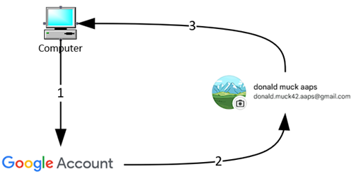

# 為 AAPS 建立專用的 Google 帳戶（可選）

一些**AAPS**使用者也喜歡將他們主要的電子郵件帳號用於**AAPS**。 另外，一些**AAPS**使用者（或他們的照護者）會設置專屬的**AAPS**電子郵件帳號——這是可選的，下面會提供如何設置的示例。

如果你不想設置專用的**AAPS** Gmail帳號，你可以直接跳到下一個部分，[建立AAPS](../SettingUpAaps/BuildingAaps.md)。

```{admonition} Advantages of a dedicated Google account for AAPS
:class: dropdown

- 專用的Google雲端空間意味著你不會冒著填滿個人Google雲端限額的風險，與**匯出偏好設定**有關。
- 每個版本的 **AAPS**（和支持的應用，如 xDrip+、BYODA 等）都將存儲在一個獨立於你計算機硬體的單一位置。 如果你的PC或手機被盜/遺失/損壞，你仍然可以使用。
- 通過統一設置，將簡化具有相似資料夾結構的使用者之間的線上支援。
- 根據設置（見下文），你將有一個獨立身份作為別名在社群中進行溝通，這可以保護你的隱私。 
- 患有1型糖尿病的孩子在使用**AAPS**和其他需要成人帳號的相關功能時可以保留自己的“日常”電子郵件帳號。
- Gmail允許你在同一手機號碼下註冊最多4個帳號。
```

## 如何為AAPS設置專用的Google帳號

(⌛大約10分鐘)



需求：

* 你有一台Windows電腦（Windows 10或更新版）和一部Android手機（Android 9或更新版），將會主機**AAPS**應用程式。 這些設備都已安裝最新的安全更新，具備網際網路連線和管理員權限，因為某些步驟需要下載和安裝程式。
* 安卓手機已設定為你的個人「日常」電子郵件地址，例如 Gmail 帳號。

```{admonition} Things to consider when setting up your new account
:class: dropdown
- 你可以使用與自己不同的名字，該名字與帳號有關聯（例如t1dsuperstar），以保護隱私。 然後可以在**AAPS**公共論壇中使用這個名字，並保護自己的身份隱私。 由於Google要求提供恢復電子郵件和電話號碼，因此它仍然是可追踪的。
- 新的**AAPS**帳號將使用與你的“日常”帳號相同的電話號碼進行驗證。 它將使用“日常”電子郵件地址進行驗證；
- 我們將設置電子郵件轉發，以便發送到新專用AAPS帳號的任何電子郵件都會轉發到主帳號（因此無需檢查兩個不同的郵箱）；
- 為你的日常Gmail帳號和專用的AAPS Gmail帳號使用不同的密碼；
- 如果你對一個Gmail帳號使用谷歌的“雙重驗證”（即多因素）身份驗證，那麼你也應該對兩個Gmail帳號都這樣做。
- 如果你計劃使用谷歌“密碼鑰匙”，請確保你註冊多個設備。 這樣你就不會鎖定自己。 只在任何人無法使用的設備上執行此操作（例如，不能在共用帳號的PC上執行）。
```


```{admonition}  Video Walkthrough! 
:class: Note
點擊[這裡](<https://drive.google.com/file/d/1dMZTIolO-kd2eB0soP7boEVtHeCDEQBF/view?usp=drive_link>)觀看如何設置專用Google帳戶的視頻說明。
```

 影片中概述的步驟如下：

在此示例中： 
- 你現有的“_日常_”Google帳號是<donald.muck42@gmail.com>； 
- 你的新“_AAPS_” Gmail帳號將是：<donald.muck42.aaps@gmail.com>； 


### 進入<https://account.google.com> 

 如果你已經登入Google，這會將你引導到你的“日常”**我的帳戶**頁面。 (1) 點擊頁面右上角的個人檔案圖片（此例為簡單的  (2) 選擇“_添加另一個帳號_”。


### 輸入你的新專用帳號細節： 

- 輸入新帳號： 
- 建立帳號
- 供我個人使用。 


### 輸入你的個人資料：
 - 輸入名字
 - 姓氏
 - 出生日期（需要是成年人年齡）

### 選擇你的新電子郵件地址和密碼

這個示例將“.AAPS”附加到Donald Muck的現有帳號…\
設置一個密碼

### 輸入可以接收SMS驗證的電話號碼

Gmail現在將向你發送一個唯一的驗證碼。

### 輸入恢復電子郵件地址

在此情況下，它將是你現有的“_日常_”電子郵件…

### 完成帳號設置

Gmail將顯示帳號名稱。 系統會要求你接受Gmail的條款和條件並確認你的個人設定。

### 自定義新個人資料顯示

此時，你應在Gmail的MyAccount頁面上，顯示你的新**AAPS**專用電子郵件帳號。 預設情況下，個人資料圖片會設置為你名字的第一個字母。 將其更改為某個獨特的名稱，以免混淆……在這個例子中，Donald.Muck.AAPS取代了  

\


### 在兩個視窗中打開Gmail網站來配置新帳號

這樣你就不需要監控一個單獨的電子郵件帳號，將所有從新的**AAPS**專用帳號發送的電子郵件轉發到你的日常帳號\
這部分可能會有些混淆，因為你需要在兩個帳號之間切換。 為了使操作更簡單，將兩個獨立的瀏覽器視窗堆疊在一起：

1. 將你現有的瀏覽器移到螢幕的上方，並調整大小，使其僅佔據螢幕上方的一半……
2. 右鍵點擊你的瀏覽器圖示在任務欄上
3. 從菜單選擇“新視窗”……並調整，使其僅佔據螢幕的下半部。

在每個瀏覽器窗口中打開<https://gmail.com>。 確保你的個人帳號在最上面，而新的專用**AAPS**帳號在底部，並且通過右上角的頭像容易辨識。 （如果需要，你可以隨時透過點擊個人資料圖片切換帳號並選擇正確的帳號）。


你的 Gmail 主頁應該看起來像這樣：\


 ### 在新的 Gmail 帳號（底部視窗）中，打開 Gmail 設定…

- 點擊頭像左側的齒輪圖示
- 然後選擇「**查看所有設定**」


### 設置轉發…

- 點擊“轉發和POP/IMAP”設置標籤
- 點擊“新增轉發地址”
- 添加你的“日常”電子郵件地址
- Gmail 將會向你的「日常」電子郵件地址發送驗證碼。
- 你需要切換回你的日常帳號，並點擊連結來驗證你接受轉發（或者從Gmail的驗證電子郵件中獲取驗證碼，然後將其粘貼到你的“新AAPS專用”Gmail視窗中）。

這樣雖然需要在兩個視窗之間來回切換，但當你檢查“日常”帳號的郵件時，也會看到從AAPS專用帳號轉發的郵件，例如Gmail警報。


### 驗證轉發的電子郵件地址

- 在「日常」Gmail（頂部視窗）中，你將收到「Gmail 轉寄確認」的電子郵件。
- 打開郵件並“點擊連結確認請求”

### 將轉發的郵件存檔在新專用的Gmail帳號中（底部視窗）

<!---->

1. 重新整理底部視窗
2. 勾選“轉發收到的電子郵件”
3. 並存檔Gmail的副本（以保持你的新專用信箱整潔）
4. 向下滾動到最底部以儲存你的更改\
   


恭喜！ 現在，你已經建立了一個專用於AAPS的Google帳號。 下一步是[建立 AAPS 應用程式](../SettingUpAaps/BuildingAaps.md)。