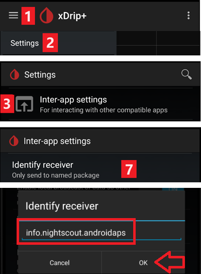

# 循環使用者常見問題解答 (FAQ)

如何將問題添加到 FAQ：按照這些[說明](../SupportingAaps/HowToEditTheDocs.md)進行操作。

## 一般問題

### 我可以直接下載 AAPS 的安裝檔嗎？

不行。 AAPS 沒有可下載的 apk 檔案。 您必須[自己建立](../SettingUpAaps/BuildingAaps.md)它。 原因如下：

AAPS 用來控制你的幫浦並提供胰島素。 根據歐洲現行法規，所有歸類為 IIa 或 IIb 類的系統都是需要法規批准的醫療設備（需要 CE 標誌），這需要各種研究和簽字確認。 分發未經批准的設備是非法的。 在世界其他地區也有類似的法規。

該法規不僅限於銷售（即獲得金錢），還適用於任何形式的分發（即使是免費的）。 自行建置醫療設備是符合這些法規的唯一方式。

這就是為什麼 apk 檔案無法提供下載的原因。

(FAQ-how-to-begin)=

### 如何開始？

首先，你需要**獲取可循環的硬體元件**：

- 一個[支援的胰島素幫浦](../Getting-Started/CompatiblePumps.md)， 
- 一部[Android 智慧型手機](../Getting-Started/Phones.md)（Apple iOS 未被 AAPS 支援 - 您可以查看[iOS Loop](https://loopkit.github.io/loopdocs/)）以及
- 一個[持續監測血糖系統](../Getting-Started/CompatiblesCgms.md)。 

接著，您需要**設置您的軟體組件**：[AAPS](../SettingUpAaps/BuildingAaps.md)、[CGM/FGM 資源](../Getting-Started/CompatiblesCgms.md)和[報告伺服器](../SettingUpAaps/SettingUpTheReportingServer.md)。

第三，您需要學習並**了解 OpenAPS 參考設計，以檢查您的治療因素**。 閉環循環的基本原則是您的[基礎率和碳水化合物比例](../SettingUpAaps/YourAapsProfile.md)是正確的。 所有建議都假設你的基礎需求已得到滿足，任何峰值或谷底的變化是由其他因素引起的，因此需要一些一次性的調整（如運動、壓力等）。 閉環系統為安全所做的調整是有限的（請參閱[OpenAPS 參考設計](https://openaps.org/reference-design/)中的允許最大臨時基礎率），這意味著你不希望浪費這些劑量來修正錯誤的基礎率。 例如，如果你經常在用餐前臨時降低基礎率，那麼很可能需要調整你的基礎率。 您可以使用[自動調整](https://openaps.readthedocs.io/en/latest/docs/Customize-Iterate/autotune.html#phase-c-running-autotune-for-suggested-adjustments-without-an-openaps-rig)來考慮大量資料，以建議基礎率和/或 ISF 是否需要調整，以及碳水化合物比例是否需要改變。 或者您可以以[傳統方式](https://integrateddiabetes.com/basal-testing/)測試並設置您的基礎率。

### 我有哪些實際的循環考量？

#### 密碼保護

如果你不希望輕易更改你的偏好設定，你可以透過選擇偏好選單中的“設定密碼”來對偏好設定選單進行密碼保護，然後輸入你選擇的密碼。 下次進入偏好設定選單時，系統會要求輸入該密碼後才能進行下一步操作。 如果你之後想刪除密碼選項，只需進入“設定密碼”，然後刪除文本即可。

#### Android Wear 智慧型手錶

如果你計劃使用 Android Wear 應用程式進行注射或更改設置，你需要確保不會阻止來自 AAPS 的通知。 操作確認將透過通知來完成。

(FAQ-disconnect-pump)=

#### 中斷幫浦連線

如果你因淋浴、沐浴、游泳、運動或其他活動而取下幫浦，你必須讓 AAPS 知道未輸送胰島素，以保持 IOB 的正確性。

可以使用[AAPS 主屏幕](#AapsScreens-loop-status)上的循環狀態圖示斷開幫浦。

#### 建議不是僅基於單一 CGM 讀取值

為了安全起見，建議是基於平均變化，而非單一 CGM 讀取值。 因此，如果你錯過了一些讀取值，可能需要一段時間在恢復資料後，AAPS 才會重新啟動循環。

#### 進一步的讀取值

有幾個部落格提供了幫助你了解循環實際運作的好建議：

- [微調設置](https://seemycgm.com/2017/10/29/fine-tuning-settings/) See my CGM
- [為什麼 DIA 很重要](https://seemycgm.com/2017/08/09/why-dia-matters/) See my CGM
- [限制餐後血糖飆升](https://diyps.org/2016/07/11/picture-this-how-to-do-eating-soon-mode/) #DIYPS
- [荷爾蒙和自動感測](https://seemycgm.com/2017/06/06/hormones-2/) See my CGM

### 推薦隨身攜帶的應急設備有哪些？

你必須攜帶與其他使用胰島素幫浦療法的 1 型糖尿病患者相同的應急設備。 當使用 AAPS 進行循環時，強烈建議隨身攜帶或將以下額外設備放在身邊：

- 用於為智慧型手機、手錶和（如有需要）BT 閱讀器或 Link 設備充電的行動電源和充電線
- 幫浦電池
- 當前[apk](../SettingUpAaps/BuildingAaps.md)和[偏好設定檔](../Maintenance/ExportImportSettings.md)用於 AAPS 和您使用的任何其他應用程式（例如 xDrip+、BYO Dexcom），包括本地和雲端（Dropbox、Google Drive）。

### 如何安全、牢固地安裝 CGM/FGM？

你可以使用膠布固定。 市面上有多種常見 CGM 系統的預穿孔“防護貼片”（可搜索 Google、eBay 或 Amazon）。 一些循環使用者會使用更便宜的標準運動貼布或 Rocktape。

你可以固定他。 你還可以購買上臂護腕，用於透過帶子固定 CGM/FGM（可搜索 Google、eBay 或 Amazon）。

## APS 演算法

### 為什麼在“OPENAPS AMA”選項卡中顯示 "dia:3"，即使我的設定檔中設定了不同的 DIA？

在 AMA 中，DIA 並不代表“胰島素作用的持續時間”。 這是一個參數，曾經與 DIA 相關。 現在，他的意思是“修正應在多長時間內完成”。 他與 IOB 的計算無關。 在 OpenAPS SMB 中，不再需要這個參數。

## 其他設置

### Nightscout 設置

#### AAPSClient 顯示“未授權”且無法上傳資料。 我該怎麼做？

在 AAPSClient 中檢查“連線設置”。 可能你不在允許的 WLAN 中，或者你啟用了“僅在充電時”且充電線未接上。

### CGM 設置

#### 為什麼 AAPS 顯示“血糖來源不支援進階過濾”？

如果你使用的是 Dexcom G5 或 G6 以外的 CGM/FGM 且在 xDrip 原生模式中運作，你將在 AAPS OpenAPS 選項卡中收到此提示。 請參閱 [平滑血糖資料](../CompatibleCgms/SmoothingBloodGlucoseData.md) 獲得更多細節。

### 幫浦

#### 幫浦應該放在哪裡？

有無數種放置幫浦的方法。 不論你是否在進行循環操作，這都無關緊要。

#### 電池

由於系統透過藍牙進行頻繁互動，循環操作會比正常使用更快耗盡幫浦電池。 最好在電池電量降至 25% 時更換，因為這時通訊變得困難。 你可以使用 Nightscout 網站中的 PUMP_WARN_BATT_P 變數設置幫浦電池的警告提示。 延長電池壽命的小技巧包括：

- 減少 LCD 顯示時間（在幫浦設置選單中）
- 減少背光時間（在幫浦設置選單中）
- 將通知設置為嗶聲而非震動（在幫浦設置選單中）
- 只按下幫浦按鈕重新載入，使用 AAPS 檢視所有歷史紀錄、電池電量和儲液罐容量。
- 在某些手機上，AAPS 應用可能會經常被關閉以節省電力或釋放 RAM。 每次啟動時，AAPS 都會重新建立與幫浦的藍牙連線，並重新讀取目前的基礎率和注射歷史紀錄。 這會消耗電池。 要查看這種情況是否正在發生，請進入偏好設定 > NSClient 並啟用“將應用啟動日誌紀錄到 Nightscout”。 Nightscout 將在每次 AAPS 重新啟動時接收一個事件，這使得問題追蹤變得容易。 為減少這種情況的發生，請在手機的電池設置中將 AAPS 應用加入白名單，防止應用電力監視器將其關閉。
    
    例如，若要在運作 Android Pie 的三星手機上將其加入白名單：
    
    - 進入設置 -> 裝置護理 -> 電池 
    - 滾動直到找到 AAPS 並選中他
    - 取消選中“將應用程式設為休眠狀態”
    - 還可以進入設置 -> 應用程式 ->（螢幕右上角的三個圓形圖示）選擇“特殊存取” -> 優化電池使用率
    - 滾動到 AAPS 並確保它已取消選取。

- 使用酒精擦拭電池端子，確保沒有殘留的製造蠟/油脂。

- 對於[Dana R/RS 幫浦](../CompatiblePumps/DanaRS-Insulin-Pump.md)，啟動過程會消耗較高的電流，目的是有意打破電池上的鈍化膜（防止儲存時能量損失），但他並不總能100%打破鈍化膜。 你可以將電池取出並重新插入 2-3 次，直到螢幕上顯示 100% 為止，或者使用電池鑰匙短暫短路電池，將兩個端子接觸一瞬間。
- 另見[特定類型電池的更多提示](#Accu-Chek-Combo-Tips-for-Basic-usage-battery-type-and-causes-of-short-battery-life)

#### 更換儲液罐和插管

無法透過 AAPS 更換儲液罐，必須像以前一樣直接透過幫浦進行。

- 在 AAPS 的主頁面長按“開環”/“閉環”，然後選擇“暫停循環 1 小時”。
- 現在中斷幫浦，並按照幫浦的說明更換儲液罐。
- 灌注和填充管路及插管也可以直接在幫浦上完成。 在這種情況下，僅使用[PRIME/FILL 按鈕](#screens-action-tab)在操作標籤中紀錄更改。
- 重新連線幫浦後，長按“暫停 (X 分鐘)”來繼續循環。

然而，更換插管時並不使用幫浦的“灌注輸液組”功能，而是使用一個不會顯示在注射歷史紀錄中的注射來填充輸液組或插管。 這意味著他不會中斷目前運作的臨時基礎率。 在操作選項卡上，使用[灌注/填充按鈕](#screens-action-tab)來設置填充輸液組所需的胰島素量並開始灌注。 如果這個量不足，重複填充操作。 你可以在偏好設定 > 其他 > 填充/灌注標準胰島素量中設置預設量按鈕。 請參閱插管盒中的說明手冊，了解根據針頭長度和管路長度應灌注多少單位。

### 桌布

您可以在 [手機頁面](#Phones-phone-wallpaper) 找到適合您手機的 AAPS 桌布。

### 日常使用

#### 衛生

##### 淋浴或洗澡時該怎麼做？

淋浴或洗澡時，你可以取下幫浦。 在這短時間內，你可能不需要幫浦，但你應該告訴 AAPS 你已經中斷了連線，以確保 IOB 計算正確。 請參見[上方描述](#FAQ-disconnect-pump)。

#### 工作

根據你的工作，你可能會選擇在工作日使用不同的治療因素。 作為循環使用者，您應該考慮在您的典型工作日進行[設定檔切換](../DailyLifeWithAaps/ProfileSwitch-ProfilePercentage.md)。 例如，如果你的工作要求較低（例如坐在辦公桌前），你可以切換到高於 100% 的設定檔；如果你一整天都在活動，可以切換到低於 100% 的設定檔。 如果你經常工作時間比正常時間早或晚，或者輪班工作，你也可以考慮設置高或低臨時目標，或進行[設定檔的時間調整](#ProfileSwitch-ProfilePercentage-time-shift-of-the-circadian-percentage-profile)。 你也可以建立第二個設定檔（例如“家庭”和“工作日”），並每天切換到你實際需要的設定檔。

### 休閒活動

(FAQ-sports)=

#### 運動

你需要重新調整循環之前的運動習慣。 如果你像以前一樣攝取運動碳水化合物，閉環系統會識別並相應地進行修正。

這樣，你體內會有更多碳水化合物，但同時循環會應對並釋放胰島素。

進行循環時，你應該嘗試以下步驟：

- 進行一個[設定檔切換](../DailyLifeWithAaps/ProfileSwitch-ProfilePercentage.md) < 100%。
- 設置一個[活動臨時目標](#TempTargets-activity-temp-target)高於您的標準目標。
- 如果您正在使用 SMB，請確保[“啟用高臨時目標的 SMB”](#Open-APS-features-enable-smb-with-high-temp-targets)和[“始終啟用 SMB”](#Open-APS-features-enable-smb-always)已停用。

這些設置的預處理和後處理非常重要。 在運動前及時進行更改，並考慮肌肉補充能量後的影響。

如果你定期在同一時間進行運動（例如在健身房上運動課），你可以考慮使用[自動化](../DailyLifeWithAaps/Automations.md)來進行設定檔切換和臨時目標的設置。 基於位置的自動化也可能是一個不錯的做法，但會讓前置處理變得更複雜。

設定檔切換的百分比、運動臨時目標的值以及最佳的更改時間都是個人化的。 如果你正在尋找適合你的值，請從安全的一面開始（從較低的百分比和較高的臨時目標開始）。

#### 性行為

你可以取下幫浦以獲得“自由”，但你應該告訴 AAPS 這樣 IOB 計算才能正確。 請參見[上方描述](#FAQ-disconnect-pump)。

#### 飲酒

在閉環模式下飲酒是有風險的，因為演算法無法正確預測受酒精影響的血糖。 你需要檢查自己的方法，並使用 AAPS 中的以下功能來進行處理：

- 停用閉環模式，並手動處理糖尿病或
- 設置高臨時目標並停用 UAM 以避免由於未注意到的餐食而增加 IOB 或
- 將設定檔切換到明顯低於 100% 的設定檔 

飲酒時，你必須時刻關注你的 CGM，並手動透過攝取碳水化合物避免低血糖的發生。

#### 睡眠

##### 如何在沒有手機和 WIFI 訊號的情況下循環過夜？

許多使用者在夜間將手機切換到飛航模式。 如果你希望循環在你睡覺時幫助你，請按照以下步驟進行操作（這僅適用於本地血糖來源，如 xDrip+ 或[“建立你自己的 Dexcom 應用程式”](#DexcomG6-if-using-g6-with-build-your-own-dexcom-app)，如果你透過 Nightscout 獲取血糖讀取值，則此方法無效）：

1. 打開手機的飛航模式。
2. 等待飛航模式生效。
3. 打開藍牙。

現在你不會接聽電話，也無法連線網路。 但循環仍在運作。

有些人發現當手機處於飛航模式時，本地廣播會出現問題（AAPS 無法從 xDrip+ 接收血糖值）。 請進入設定 > 應用程式間設定 > 識別接收器，並輸入`info.nightscout.androidaps`。

#### 旅行

##### 如何應對時區變更？

使用 Dana R 和 Dana R Korean 時，你不需要做任何操作。 有關其他幫浦，請參見[時區旅行](../DailyLifeWithAaps/TimezoneTraveling-DaylightSavingTime.md)頁面以獲取更多詳細資訊。

### 醫療話題

#### 住院

如果你想與臨床醫師分享一些有關 AAPS 和 DIY 循環的資訊，你可以列印[給臨床醫師的 AAPS 指南](../UsefulLinks/ClinicianGuideToAaps.md)。

#### 與內分泌科醫生的醫療約診

##### 報告

你可以展示你的 Nightscout 報告 (https://YOUR-NS-SITE.com/report) 或查看[Nightscout Reporter](https://nightscout-reporter.zreptil.de/)。

## Discord 上的常見問題及其解答...

### 我的問題不在這裡列出。

[獲取幫助的訊息。](../GettingHelp/WhereCanIGetHelp.md)

### 我的問題不在這裡列出，但我找到了答案。

[獲取幫助的訊息。](../GettingHelp/WhereCanIGetHelp.md)

**提醒我們將你的解決方案添加到此列表中！**

### AAPS 每天在同一時間停止運作。

停用 Google Play Protect。 檢查是否有“清理”應用程式（如 CCleaner 等），並將其卸載。 AAPS / 3 點選單 / 關於 / 點擊“保持應用程式在背景運作”的連結，停止所有電池優化設定。

### 如何組織我的備份？

經常匯出設定：每次更換儲液罐後、修改設定檔後、完成目標後、更換幫浦時...即使沒有更改，也應每月匯出一次。 保留幾個舊的匯出文件。

將所有安裝應用程式（如 AAPS、xDrip、BYODA、修補版 LibreLink...）的 apk 以及所有應用程式的匯出設定文件複製到網路雲端硬碟（Dropbox、Google 等）。

### 我在建置應用程式時遇到問題和錯誤。

請

- 請檢查[問題排除 Android Studio](../GettingHelp/TroubleshootingAndroidStudio)以獲取典型錯誤和
- 查看有關[逐步指南](https://docs.google.com/document/d/1oc7aG0qrIMvK57unMqPEOoLt-J8UT1mxTKdTAxm8-po)的提示。

### 我在目標上卡住了，需要幫助。

截圖問題和答案。 將其發布到 Discord AAPS 頻道。 別忘了說明你選擇了哪些選項（或未選擇），以及為什麼。 你會得到提示和幫助，但你需要找到答案。

### 如何在 AAPS v2.8.x 中重置密碼？

打開漢堡選單，啟動設定嚮導，並在提示時輸入新密碼。 在完成密碼設置階段後，你可以退出嚮導。

### 如何在 AAPS v3.x 中重置密碼？

您可以在[這裡](#Update3_0-reset-master-password)找到文件。

### 我的 Link/幫浦/Pod 沒有反應（RL/OL/EmaLink...）

某些手機與連線設備（RL/OL/EmaL…）之間會出現藍牙斷線的情況。

有些連線設備無法回應（AAPS 顯示已連線，但連線設備無法到達或指令幫浦）。

讓所有這些部件一起運作的最簡單方法是： 1/ 從 AAPS 中刪除連線設備 2/ 關閉連線設備 3/ AAPS 三點選單，退出 AAPS 4/ 長按 AAPS 圖示，進入 Android 選單，選擇 AAPS 應用程式資訊，強制停止 AAPS，然後刪除快取記憶體（不要刪除主要記憶體！） 4bis/ 少數手機可能需要在這裡重新啟動。 你可以嘗試不重啟。 5/ 打開連線設備6/ 啟動 AAPS7/ 前往 Pod 標籤，三點選單，搜尋並連線連線設備

### 建置錯誤：檔名過長

在嘗試建置時，我收到錯誤訊息，提示檔名過長。 可能的解決方案：將你的源碼移動到靠近磁碟根目錄的目錄（例如 "c:\src\AndroidAPS-EROS"）。

在 Android Studio 中：確保在開啟專案並從 GitHub 拉取後，"Gradle" 已經同步並完成索引。 執行 Build->Clean Project 之前，請先進行 Rebuild Project。 執行 File->Invalidate Caches 並重新啟動 Android Studio。

### 警告：運作開發版本。 閉環模式已停用

AAPS 沒有運作在 "開發者模式"。 AAPS 顯示以下訊息："運作開發版本。 閉環模式已停用"。

請確保 AAPS 運作在 "開發者模式"：在位置 "AAPS/extra" 放置一個名為 "engineering_mode" 的文件。 任何文件都可以，只要命名正確即可。 請確保重新啟動 AAPS 以便找到該文件並進入 "開發者模式"。

提示：複製現有日誌文件並將其重命名為 "engineering_mode"（注意：無文件擴展名！）。

### 在哪裡可以找到設定文件？

設定文件將儲存在你手機的內部存儲中，目錄為 "/AAPS/preferences"。 警告：確保不要遺失密碼，否則你將無法匯入加密的設定文件！

### 如何配置省電設置？

正確配置電源管理對於防止你的手機操作系統在未使用時暫停 AAPS 及相關應用程式和服務非常重要。 結果是 AAPS 無法正常工作，或者傳感器和 Rileylink（RL）的藍牙連線可能會被關閉，導致 "幫浦已中斷連線" 警報和通訊錯誤。 在手機上，進入設定->應用程式，並停用以下應用程式的省電模式： AAPS xDrip 或 BYODA/Dexcom 應用程式 藍牙系統應用程式（你可能需要先選擇查看系統應用程式） 或者，完全停用手機上的所有省電模式。 這樣做的結果是你的電池可能會耗電更快，但這是一種找出是否是省電模式導致問題的好方法。 省電模式的實現方式很大程度上取決於手機的品牌、型號和/或操作系統版本。 因此，幾乎無法提供針對你設備的正確省電設置的指導。 根據你的情況進行實驗，找到最佳設置。 如需更多訊息，請參閱 "Don't kill my app"。

### 一天或夜間多次出現幫浦無法使用警報。

你的手機可能暫停了 AAPS 服務，甚至暫停了藍牙連線，導致他失去與 RL 的連線（請參閱省電設置）考慮將無法使用的警報設定為 120 分鐘，方法是點擊右上方的三點選單，選擇 偏好設定->本地警報->幫浦無法使用的門檻值 [分鐘]。

### 在 AAPS v3 中，在哪裡可以刪除治療？

點擊三點選單，選擇治療，然後再次點擊三點選單，你將看到不同的選項。

### 配置和使用 AAPSClient 遠端應用程式

可以透過 AAPSClient 應用程式遠端監控和控制 AAPS，並且可選地透過運作在 Android Wear 手錶上的 Wear 應用程式。 請注意，AAPSClient（遠端）應用程式與 AAPS 中的 NSClient 設置不同，AAPSClient（遠端）Wear 應用程式也與 AAPS Wear 應用程式不同——為了清楚起見，遠端應用程式將稱為 "AAPSClient 遠端" 和 "AAPS 遠端 Wear" 應用程式。

要啟用 AAPSClient 遠端功能，你必須： 1）安裝 AAPSClient 遠端應用程式（版本應與使用的 AAPS 版本匹配） 2）運作 AAPSClient 遠端應用程式，並按照設置嚮導的指示授予所需的權限並配置對 Nightscout 網站的查看。 3）此時，你可能希望停用一些警報選項，和/或停用啟動 AAPSClient 遠端應用程式時紀錄到你的 Nightscout 網站的進階設置。 完成此操作後，AAPSClient 遠端將從你的 Nightscout 網站下載設定檔資料，"首頁總覽"標籤將顯示 CGM 資料和部分 AAPS 資料，但可能不會顯示圖表資料，並會顯示未設置設定檔的提示。 4）要啟用設定檔：

- 在 AAPS > NSClient > 選項中啟用遠端設定檔同步
- 在 NSClient 遠端中啟用設定檔 > 設定檔啟用後，設定檔將會生效，AAPSClient 遠端應顯示來自 AAPS 的所有資料。 提示：如果圖表仍然缺失，請嘗試更改圖表設置以觸發更新。 5）要啟用 AAPSClient 的遠端控制功能，請選擇啟用 AAPS 中的功能（設定檔更改、臨時目標、碳水化合物等），這樣你就可以透過 AAPS > NSClient > 選項遠端控制 AAPS。 完成這些更改後，你將能夠透過 Nightscout 或 AAPSClient 遠端控制 AAPS。

如果你想透過 AAPSClient 遠端 Wear 應用程式監控/控制 AAPS，則需要同時安裝 AAPSClient 遠端應用程式和相關的 Wear 應用程式。 要編譯 AAPSClient 遠端 Wear 應用程式，請按照安裝/配置 AAPS wear 應用程式的標準說明進行操作，只是在編譯時，選擇 AAPSClient 變體。

### 我有一個紅色三角形 / AAPS 無法啟用閉環 / 閉環保持在 LGS / 我有一個黃色三角形

紅色和黃色三角形是 AAPS v3 中的安全功能。

紅色三角形表示你有重複的血糖資料，AAPS 無法精準計算變化值。 你無法啟動閉環。 你需要刪除每個重複資料中的一個血糖資料，才能清除紅色三角形。 進入 BYODA 或 xDrip 標籤，長按你想刪除的一行，檢查重複的每一行，然後刪除（或者透過三點選單並選擇刪除，具體取決於你使用的 AAPS 版本）。 如果重複的血糖資料過多，你可能需要重置 AAPS 資料庫。 在這種情況下，你將會失去統計資料、IOB、COB 和選定的設定檔。

問題的可能來源：xDrip 和/或 Nightscout 回填血糖資料。

黃色三角形表示每個血糖讀取之間的延遲不穩定。 你沒有定期每 5 分鐘接收到血糖讀取，或者缺少血糖讀取。 這通常是一個 Libre 的問題。 當你更換 G6 發射器時，這種情況也會發生。 如果黃色三角形與 G6 發射器的更換有關，他會在幾個小時（大約 24 小時）後自行消失。 如果是 Libre 的問題，黃色三角形將會一直存在。 閉環可以關閉並正常運作。

### 我可以將一個啟動的 DASH Pod 移動到其他硬體上嗎？

這是可行的。 請注意，由於移動是“未支援的”和“未經測試的”，因此涉及一定的風險。 最佳做法是在 Pod 即將到期時嘗試此過程，以便出現問題時，降低損失。

關鍵是 AAPS 中的幫浦狀態（包括其 MAC 位址）與 DASH 在重新連線時匹配。

### 我通常會這樣操作：

1) 暫停 DASH 幫浦。 這確保當 DASH 失去連線時，沒有正在運作或排隊的指令。 2) 將手機切換到飛行模式以停用藍牙（以及 WiFi 和行動網路）。 這樣可以確保 AAPS 和 DASH 無法通訊。 3) 匯出設定（包括 DASH 狀態） 4) 從手機上複製剛匯出的設定文件（由於手機處於飛行模式且我們不想更改該狀態，最簡單的方法是使用 USB 連線線）。 5) 將設定文件複製到另一個手機上。 6) 在替代手機上的 AAPS 中匯入設定。 7) 檢查 DASH 標籤，確認他是否識別到 Pod。 8) 取消暫停 Pod。 9) 檢查 DASH 標籤頁，確認其與 Pod 正在通訊（使用重新整理按鈕）。

恭喜你：你成功了！

*等等！* 你仍然有主手機認為他可以重新連線到同一個 DASH：

1) 在主手機上選擇“停用”。 這是安全的，因為手機無法與 DASH 實際通訊來停用 Pod（他仍然處於飛行模式） 2) 停用將導致通訊錯誤——這是預期的。 3) 只需點擊“重試”幾次，直到 AAPS 提供“丟棄”Pod 的選項。

當 Pod 丟棄後，請確認 AAPS 報告“無啟動 Pod”。 現在你可以安全地關閉飛行模式了。

### 如何將 AAPS 早期版本的設定匯入到 AAPS v3 中？

你只能匯入使用 AAPS v2.8x 或 v3.x 匯出的設定（在 AAPS v3 中）。如果你使用的是 AAPS v2.8x 之前的版本，或者需要使用 v2.8x 之前的設定匯出文件，則需要先安裝 AAPS v2.8。 將 v2.x 的舊設定匯入到 v2.8。檢查一切正常後，你可以從 v2.8 匯出設定。然後安裝 AAPS v3 並在 v3 中匯入 v2.8 的設定。

如果你使用相同的密鑰來建置 v2.8 和 v3，你甚至不需要匯入設定。 你可以直接在 v2.8 上安裝 v3。

有一些新的目標加入。 你需要驗證他們。