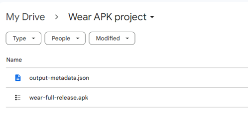
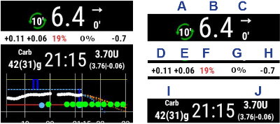

# 在您的 Wear OS 手錶上設置 AAPS

下面的說明適用於您需要建置的**AAPS Wear** apk（如果尚未建置，請參閱[這裡](../WearOS/BuildingAapsWearOS.md)），因為您已經建置了手機的**AAPS** apk。

您還可以使用一些信息用於**AAPSClient**和**PumpControl**的**Wear** apk，這些信息可以直接在[GitHub](https://github.com/nightscout/AndroidAPS/releases/tag/3.2.0.4)中找到。 每個**Wear**應用都將與其匹配的手機應用進行通信。 例如：**AAPSClient Wear**應用可用於顯示**AAPSClient**資料，而不是**AAPS**資料。

(BuildingAapsWearOs-WearOS5)=

```{admonition} Android Wear OS 5
:class: warning
安裝 AAPS 錶面必須在安裝 Wear 應用後使用[Wear Installer 2](https://www.youtube.com/watch?v=yef_qGvcCnk)完成。<br>
意外更改錶面為其他錶面需要重複上面的過程。<br>
無法更改專用錶面參數，如：深色、錶面分隔等。
```

## 如何設置 Samsung Galaxy 4 智慧型手錶與 **AAPS** 搭配使用

本節假設你對智慧型手錶完全陌生，將向你介紹一款流行手錶（**Galaxy Watch 4**）的基本操作，隨後是逐步設置 **AAPS** 在手錶上運作的指南。

_本指南假設你正在設置運作 Wear OS 3 或更低版本的 Samsung Galaxy 手錶。_ 如果你正在設置運作 Wear OS 4/OneUI 5 或更高版本的手錶，你將需要使用新的 ADB 配對過程，這在 Samsung 手機軟體中有解釋，並將在適當時更新到這裡。

這裡有關於 [Galaxy Watch 5](https://www.youtube.com/watch?v=Y5upzOIxwTU) 和 [Galaxy Watch 6](https://www.youtube.com/watch?v=D6bq20KzPW0) 的基本設置指南

## 智慧型手錶的基本熟悉指南

根據上方影片進行手錶的基本設置後，前往手機上的 Play 商店並下載以下應用程式：“Galaxy Wearable”、“Samsung”和“Easy Fire tools”或“Wear Installer 2”。

有許多第三方 YouTube 視頻可幫助你熟悉新手錶，例如：

[https://www.youtube.com/watch?v=tSVkqWNmO2c](https://www.youtube.com/watch?v=tSVkqWNmO2c)

“Galaxy Wearable”應用程式內也有一個使用手冊部分。 在手機上打開 Galaxy Wearable，搜尋手錶，嘗試將手錶與手機配對。 根據你的版本，這可能會提示你從 Play 商店安裝第三個應用程式“Galaxy Watch 4 外掛”（下載需要一些時間）。 在手機上安裝此應用程式，然後再次在 Galaxy Wearable 應用程式中嘗試將手錶與手機配對。 透過一系列選單並勾選各種偏好設定。

## 設置 Samsung 帳號

你需要確保用來設置 Samsung 帳號的電子郵件帳戶的出生日期顯示用戶年齡 13 歲以上，否則 Samsung 的許可權批准將非常困難。 如果你已為 13 歲以下的孩子建立了 Gmail 帳號並使用該電子郵件地址，你無法簡單地將其更改為成人帳戶。 解決此問題的一種方法是將目前的出生日期修改為使目前年齡為 12 歲零 363 天。 第二天，該帳戶將被轉換為成人帳戶，然後你可以繼續設置 Samsung 帳戶。

(remote-control-transferring-the-aaps-wear-app-onto-your-aaps-phone)=

## 將**AAPS** Wear應用傳輸到您的**AAPS**手機

從 Android Studio 將 Wear.apk 載入到你的手機，可以透過以下方式進行：

a) 使用 USB 傳輸線將 **AAPS** wear apk 檔案放入手機，然後將其“側載”到手錶上。 透過 USB 將 Wear.apk 傳輸到手機的下載資料夾；或

b) 從 Android Studio 將 Wear.apk 剪切並粘貼到你的 Gdrive 中。


你可以使用 Wear Installer 2 或 Easy Fire tools 將 AAPS 側載到手錶上。 這裡我們推薦使用 Wear Installer 2，因為視頻中的說明和過程非常清晰且解釋得很好。

## 使用 Wear Installer 2 將 **AAPS** Wear 從手機側載到手錶上

 

Wear Installer 2 由 [Malcolm Bryant](https://www.youtube.com/@Freepoc) 開發，你可以從 Google Play 將其下載到手機上，並用來將 AAPS wear 應用程式側載到手錶上。 該應用程式包含一個便捷的“如何側載”[視頻](https://youtu.be/abgN4jQqHb0?si=5L7WUeYMSd_8IdPV)。

```{tip}
對於 Wear OS 5 智慧手錶，請參閱[此影片](https://www.youtube.com/watch?v=yef_qGvcCnk)。
```

該視頻提供了所有必要的細節（最好在單獨的設備上打開視頻，以便在設置手機時觀看）。

如視頻中所述，完成後，請關閉手錶上的 ADB 調試，以避免消耗智慧型手錶的電池。

或者，你可以：

```{admonition} Use Easy Fire tools to side-load the **AAPS** wear on the watch
:class: dropdown

1)   從 Play 商店下載 _Easy Fire Tools_ 到您的手機 


2)  在手錶上成為開發者 (設置好並連接到手機後)： 

前往設定>關於手錶 (底部選項)>- 軟體資訊> 軟體版本。 

快速點擊“軟體版本”，直到出現通知，告知手錶現在處於“開發者模式”。 返回設置選單頂部，向下滾動，並在“關於手錶”下方看到“開發者選項”。 

在“開發者選項”中，打開“ADB 調試”和“無線調試”。 後者將顯示手錶的 IP 地址，其最後兩位數字每次與新手機配對時都會改變。 他會像是：**167.177.0.20.** 5555（忽略最後4位數）。 請注意，每次將 AAPS 切換到新手機時，這個地址的最後兩位數字（這裡為“20”）將發生變化。  


步驟 3)     在手機上的 Easy Fire Tools 中輸入 IP 位址 _例如_ **167.177.0.20** (進入左側選單，設定並輸入 IP 位址)。 然後點擊右上角的插頭圖示。  





步驟 4) 請按照[這裡](https://wearablestouse.com/blog/2022/01/04/install-apps-apk-samsung-galaxy-watch-4/?utm_content=cmp-true)的指示，使用 Easy Fire 工具將 Wear.apk 透過側載（即傳輸）到手錶上

點擊應用中的側 "外掛" 插孔，以將 Wear OS.apk 上傳到手錶: 


 下一步 > 在手錶上接受授權請求


```


## 設置 **AAPS** 手機與手錶的連線

最後一步是配置手機上的 **AAPS** 與智慧型手錶上的 **AAPS** Wear 互動。 為此，在 組態建置工具 中啟用 Wear 外掛：

* 前往手機上的 **AAPS** 應用程式

* 在左側漢堡按鈕中選擇 > 組態建置工具

* 在一般設定下勾選手錶選項


要更改 **AAPS** 手錶錶盤，請按下手錶的主畫面，他將進入“自訂”模式。 然後向右滑動，直到看到所有 **AAPS** 錶盤。

如果 **AAPS** Wear.apk 已成功側載到智慧型手錶上，他將顯示如下：


### 排除 **AAPS** 手錶與 **AAPS** 手機通訊的問題

1.  如果 EasyFire tools 無法連線，或者你收到“授權失敗”訊息 > 請檢查 IP 地址是否正確輸入。
2.  檢查智慧型手錶是否已連線到網際網路（而不僅僅是透過藍牙與手機連線）。
3.  檢查 **AAPS** 手機和智慧型手錶是否已在 Samsung 應用程式中配對或連線。
4.  也可能需要對手機和智慧型手錶進行硬重啟（即關閉並重新啟動手機）。
5.  假設你已經成功下載 Wear.apk 到手機，但未收到任何血糖資料，_請檢查_ 你是否已將正確的 **AAPS** apk 版本側載到手錶上。 如果您的 AAPS wear.apk 版本列為以下任一項： a) “wear-AAPSClient-release”； b) ‘wear-full-release.aab’; 或 c) 標題中出現“debug”字樣， 則表明您在建置過程中未選擇正確的 Wear OS apk 版本。
6.  檢查路由器是否未將設備相互隔離。

更多問題排除提示請參閱[這裡](https://freepoc.org/wear-installer-help-page/#:~:text=If%20you%20are%20having%20problems,your%20phone%20and%20your%20watch.)

(WearOS_changing-to-AAPS-watchface)=

## 在 WearOS 手錶上切換到 AAPS 手錶外觀

AAPS Wear OS APK 的標準版本中提供了多種手錶外觀。 當你在手錶上安裝 AAPS Wear APK 後，他們將可供使用。 以下是選擇其中一個手錶外觀的步驟：

1. 在手錶上（假設使用 WearOS），長按目前手錶外觀以打開手錶外觀選擇畫面，然後向右捲動直到看到「新增手錶外觀」按鈕並選擇他


2. 向下捲動到列表底部，直到看到「已下載」部分，找到「AAPS（自訂）」並點擊圖像中央將其新增至你目前的手錶外觀清單。 不用擔心目前「AAPS（自訂）」手錶外觀的外觀，我們將在下一步選擇你喜歡的外觀。


3. 現在打開你手機上的 AAPS，進入 Wear 外掛（如果你在頂部的外掛列表中未看到他，請在組態建置工具中啟用他（位於同步選項下）。


4. 點擊「載入手錶外觀」按鈕，並選擇你喜歡的手錶外觀。


5. 查看你的手錶，現在應該顯示你選擇的「AAPS（自訂）」手錶外觀。 等待幾秒鐘讓他重新整理。 您現在可以透過長按錶面，然後在錶面圖像上按“自訂”按鈕來自訂錶面等項目。

## AAPSv2 手錶外觀 - 圖例



A - 從最後一次循環運作以來的時間

B - CGM 資料讀取值

C - 自最後一次 CGM 資料讀取以來的分鐘數

D - 與上次 CGM 讀取值相比的變化（以 mmol 或 mg/dl 為單位）

E - 過去 15 分鐘的 CGM 讀取值平均變化

F - 手機電池

G - 基礎率（標準率顯示為U/h，臨時基礎率（TBR）顯示為百分比）

H - BGI（血糖互動） -> 基於胰島素活動時，血糖“應該”上升或下降的程度。

H - BGI（血糖影響） -> 基於胰島素活性，血糖「應該」上升或下降的程度。

I - 碳水化合物（碳水化合物在體內的數量 | 未來的碳水化合物）