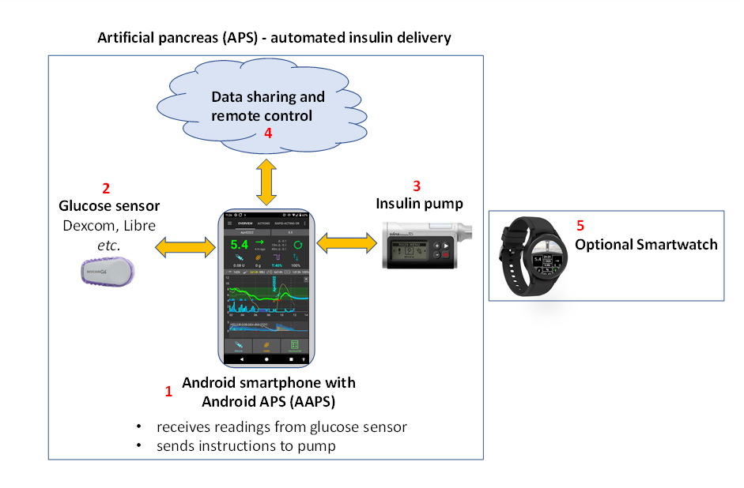

# 歡迎來到 AAPS 文件指南



```{admonition} Latest Release
:class: note

2025/08/14 : 版本 3.3.2.1 已發布。 檢查[發行說明](#latestrelease)以查看新功能並獲取更新說明。

```

Android APS (**AAPS**) 是一款開源應用程式，專為胰島素依賴型的糖尿病患者所設計。 這是一個人工胰臟系統 (APS)，可以在 Android 智慧型手機上運作。 **AAPS**使用OpenAPS軟體算法，旨在執行真正胰臟的功能：通過自動化胰島素劑量控制血糖水平保持在健康範圍內。 要使用**AAPS**，你需要**三個相容設備**：(1)一部Android手機。(2)一個持續血糖監測器（CGM）。(3)一個FDA/CE批准的胰島素幫浦。 (4)以遠端控制AAPS、分享你的資料並將資料存儲在報告伺服器上(你將需要雲端服務)。(5)一支智慧型手錶。 (選項4、5為自由選擇使用)

本文件將詳細說明如何設置和使用**AAPS**。 你可以透過左側的選單（以及“**搜尋文件**”功能）或使用頁面底部的[索引](#index-aaps-documentation-index)瀏覽**AAPS**文件。

## AAPS 文件總覽("簡稱本文件")

第**2)**節入門部分，[介紹](Getting-Started/Introduction.md)解釋了人工胰臟系統（APS）設計的基本概念。 本文件概述了循環系統的背景，為何開發**AAPS** ，並比較了**AAPS** 與其他系統，同時也討論了安全性問題。 他提供了如何與你的醫療團隊討論 **AAPS**的建議，解釋了為什麼你需要自行建置**AAPS** 應用程式，而不是直接下載，並概述了典型的**AAPS** 系統連接性。 他還討論了無障礙設計，並指出誰最有可能從**AAPS** 中受益。

[準備 AAPS](./Getting-Started/PreparingForAaps.md)章節提供了更多有關安全考量的詳細資訊，以及相容**AAPS**的手機、CGM（連續血糖監測儀）和胰島素幫浦的相關訊息。 他描述了你將經歷的過程，並提供了獲得完整**AAPS** 功能的大致時間表。 本節將幫助在技術上作好準備，會以最快、最有效率的方式設置你的**AAPS** 。 [CGM 配置](./Getting-Started/CompatiblesCgms.md)子章節解釋了如何優化CGM設置及最佳的平滑選項。

現在你已經對過程有了深入的了解，可以開始建置你的**AAPS** 循環系統了。

本章節 **三) 設置 AAPS** 包含逐步指導來進行此操作。 它涵蓋了選擇和 [設置報告伺服器](./SettingUpAaps/SettingUpTheReportingServer.md)（Nightscout 或 Tidepool），使你能夠檢視和分享你的資料，準備建立 AAPS 應用程式，建置 AAPS 應用程式並將其傳送到你的手機。 他還涵蓋了使用設置嚮導來設定 **AAPS** 應用程式，與你的 CGM 應用程式連結，並與實體或虛擬胰島素幫浦連結，以及將 **AAPS** 連結到你的報告伺服器。 你將透過一個安全且經過精心設計的逐步流程，慢慢了解**AAPS**所提供的全部功能。此流程主要在確保你或你的孩子能夠充分熟悉，並能操作所有不同的層級和選單配置，然後再進入下一階段，通常稱為下一個「目標」，直到你累積足夠的經驗，再開始使用應用程式內更進階的選項。 這些目標被特別設計為逐步解鎖更多 **AAPS** 的可能性，並從開環轉為閉環。

第**4)**節使用**AAPS**的日常生活涵蓋關鍵的**AAPS**功能，以協助你使用（並自訂）**AAPS**。 包括暸解各個畫面、碳水化合物計算、敏感度、設定檔切換、臨時目標、延展碳水化合物（或 eCarbs）、自動化和 動態ISF。 此外，還涵蓋了如何處理不同類型的餐食、更換套管和傳感器、手機更新、夏令時間更改、[與 AAPS 一起旅行](DailyLifeWithAaps/TimezoneTraveling-DaylightSavingTime.md) 和運動等常見問題與解答。 常見問題和答案位於問題排除部分。

第**5)**節[遠端AAPS功能](./RemoteFeatures/RemoteControl.md)</strong>突顯了**AAPS**的實際優勢。 這對於希望遠端發送指令給予，或者只是追踪來自 **AAPS** 的資料來說非常實用。 這對於希望為未成年人使用 **AAPS** 的照護者，以及患有糖尿病的成人同樣實用。成人可以更方便地監控血糖（以及其他指標），不僅限於手機上（例如手錶、車內等），也可以讓重要他人一同監控資料。 本節還提供了使用 Android Auto 的指導，讓你能夠在車內查看血糖數值。

第**6)**節介紹如何使用Android**Wear OS**智慧型手錶來搭配專用的**AAPS**錶盤或自定義錶盤，可以作為手機的遠端控制器或作為顯示指示器。


第**7)**節**AAPS**的維護說明如何匯出和備份你的設定（在你遺失/損壞手機的情況下非常重要），提供最新版本說明以及如何更新**AAPS**的詳細資訊。 你可以預期每年會有一個新版本和 2-3 次強制更新。 你需要像其他軟體一樣進行這些更新，以解決小錯誤並改進**AAPS** 。 有一個專門的“更新”問題排除部分，解答常見問題。

第**8)**節[尋求幫助](GettingHelp/WhereCanIGetHelp.md)</strong>應該能幫助你找到有關**AAPS**的最佳幫助資源。 這非常重要，讓你能夠快速與其他用戶取得聯繫，澄清問題並解決常見的困難。 很多人已成功使用 **AAPS**，但每個人都有自己無法獨立解決的問題。 由於用戶眾多，問題的回應時間通常非常快，通常僅需幾個小時。 不要擔心尋求幫助，更不用擔心愚蠢的問題！ 我們鼓勵任何新手/老手用戶提出他們認為有必要的所有問題，以幫助他們安全啟動並運作。 本節還包含 **AAPS** 和 **AAPSClient**（追蹤應用程式）的一般問題排除指南，如果你認為 **AAPS** 出現技術問題需要處理，本節也說明了如何將你的 **AAPS** 資料（日誌文件）發送給開發者進行調查，。

第**9)**節涵蓋**進階AAPS選項**，例如如何從使用**AAPS**進行混合閉環（餐前注射等）進展到全閉環（無需注射），並詳細說明開發和工程模式。 大多數使用者只需使用主要或"Master" **AAPS**版本即可正常操作，無須查看這些選項；本節給那些已經控制良好並希望進一步改善其設置的使用者。

在第**10)**節[如何支援AAPS](SupportingAaps/HowToEditTheDocs.md)</strong>我們提供資訊，讓你能夠支持這個項目。 你可以捐錢、設備或專業知識。 你可以建議/自行更改文件，幫助 [翻譯文件](SupportingAaps/Translations)，並透過 Open Humans 項目提供你的資料。

第**11)**節資源，包含已存檔的或附加的文件，包括[對AAPS感興趣的臨床醫生](UsefulLinks/ClinicianGuideToAaps.md)的小節，或對那些希望與其臨床醫生分享此信息的患者，此主題也在介紹中提及。 本節還包含更多糖尿病和閉環的參考資料和資源。 它包括[詞彙表](./UsefulLinks/Glossary.md)，其中列出了在**AAPS**中使用的縮寫詞（或短期名稱）。 這是查找 ISF 或 TT 等術語的地方。


 ### 有興趣開始使用 **AAPS** 嗎？ 在 [介紹](Getting-Started/Introduction.md) 中閱讀更多關於 **AAPS** 的資訊。

```{admonition} SAFETY NOTICE
:class: danger
**AAPS** 的安全性依賴於你硬體（電話、幫浦、CGM）的安全功能。 請只使用經過 FDA/CE 認證的全功能胰島素幫浦和 CGM。 不使用故障、改裝或自行組裝的胰島素幫浦或 CGM 接收器。 僅使用由製造商批准並與幫浦和 CGM 搭配使用的原裝耗材（如注射器、套管和胰島素儲存罐）。 使用未經測試或修改的耗材可能會導致資料不準確和胰島素注射錯誤，從而對使用者造成重大風險。 

如果你正在服用 SGLT-2 抑制劑（gliflozins），請勿使用 **AAPS**，因為這會降低血糖數值。 由於胰島素供應減少，會增加罹患糖尿病酮酸中毒（DKA）的風險，而血糖下降則會提高低血糖的風險。 
```

```{admonition} Disclaimer
:class: note

- 此處描述的所有訊息和代碼僅供參考和教育目的使用。 使用 [Nightscout](https://nightscout.github.io/) 和 **AAPS** 需自行承擔風險，並且不應使用該訊息或代碼來做出醫療決策。 Nightscout目前不符合HIPAA的隱私規定。 
- 從 github.com 使用的代碼不提供任何保證或正式支援。 請檢視此儲存庫的許可證( LICENSE) 以暸解詳細資訊。
- 所有產品和公司名稱、商標、服務標記、註冊商標和註冊服務標記均為其各自持有者的財產。 他們的使用僅供資訊用途，沒有任何關聯或背書。

**AAPS** 與以下組織無任何關聯，也沒有相關支援：[SOOIL](http://www.sooil.com/eng/)、[Dexcom](https://www.dexcom.com/)、[Accu-Chek, Roche Diabetes Care](https://www.accu-chek.com/)、[Insulet](https://www.insulet.com/) 或 [Medtronic](https://www.medtronic.com/).

```

(index-aaps-documentation-index)=

## AAPS文件索引

```{toctree}
:caption: 1）更改語系

更改語系 <./NavigateDoc/ChangeLanguage.md>
更改版本 <./NavigateDoc/ChangeVersion.md>
```
```{toctree}
:caption: 2) 開始使用

AAPS 簡介 <./Getting-Started/Introduction.md>
準備 AAPS <./Getting-Started/PreparingForAaps.md>
組件總覽 <./Getting-Started/ComponentOverview.md>
- 相容的幫浦 <./Getting-Started/CompatiblePumps.md>
- 相容的 CGMs <./Getting-Started/CompatiblesCgms.md>
- 相容的手機 <./Getting-Started/Phones.md>
- 相容的手錶 <./Getting-Started/Watches.md>
```

```{toctree}
:caption: 3) 設置 AAPS

設置報告伺服器 <./SettingUpAaps/SettingUpTheReportingServer.md>
- Nightscout <./SettingUpAaps/Nightscout.md>
- Tidepool <./SettingUpAaps/Tidepool.md>
建立 AAPS <./SettingUpAaps/BuildingAaps.md>
傳輸和安裝 AAPS <./SettingUpAaps/TransferringAndInstallingAaps.md>
設置嚮導 <./SettingUpAaps/SetupWizard.md>
你的 AAPS 配置 <./SettingUpAaps/YourAapsProfile.md>
變更 AAPS 配置 <./SettingUpAaps/ChangeAapsConfiguration.md>
- 配置建置工具 <./SettingUpAaps/ConfigBuilder.md>
- 偏好設定 <./SettingUpAaps/Preferences.md>
完成目標 <./SettingUpAaps/CompletingTheObjectives.md>
```

```{toctree}
:caption: 4) AAPS 的日常生活

AAPS 螢幕 <./DailyLifeWithAaps/AapsScreens.md>
AAPS 重要功能 <./DailyLifeWithAaps/KeyAapsFeatures.md>
碳水化合物計算 <./DailyLifeWithAaps/CobCalculation.md>
敏感度檢測 <./DailyLifeWithAaps/SensitivityDetectionAndCob.md>
設定檔切換與百分比 <./DailyLifeWithAaps/ProfileSwitch-ProfilePercentage.md>
臨時目標 <./DailyLifeWithAaps/TempTargets.md>
擴展碳水化合物 <./DailyLifeWithAaps/ExtendedCarbs.md>
自動化 <./DailyLifeWithAaps/Automations.md>
動態 ISF <./DailyLifeWithAaps/DynamicISF.md>
適合兒童的 AAPS <./DailyLifeWithAaps/AapsForChildren.md>
幫浦和導管 <./DailyLifeWithAaps/PumpsAndCannulas.md>
跨時區旅行與夏令時間 <./DailyLifeWithAaps/TimezoneTraveling-DaylightSavingTime.md>

```

```{toctree}
:caption: 5) 遠端 AAPS 功能

遠端監控 <./RemoteFeatures/RemoteMonitoring.md>
遠端控制 <./RemoteFeatures/RemoteControl.md>
簡訊指令 <./RemoteFeatures/SMSCommands.md>
追蹤 AAPS  <./RemoteFeatures/FollowingOnly.md>
Android Auto <./RemoteFeatures/AndroidAuto.md>

```
```{toctree}
:caption: 6) Wear OS 智慧型手錶

AAPS for Wear OS <./WearOS/BuildingAapsWearOS.md>
使用智慧型手錶 <./WearOS/WearOsSmartwatch.md>
遠端控制 <./RemoteFeatures/RemoteControlWearOS.md>
自訂錶盤參考 <./ExchangeSiteCustomWatchfaces/CustomWatchfaceReference.md>
交換站自訂錶盤 <./ExchangeSiteCustomWatchfaces/index.md>

```

```{toctree}
:caption: 7) AAPS 的維護

匯出/匯入設定 <./Maintenance/ExportImportSettings.md>
檢視你的資料 <./Maintenance/Reviewing.md>
AAPS 發佈說明 <./Maintenance/ReleaseNotes.md>
文件更新 <./Maintenance/DocumentationUpdate.md>
更新至新的 AAPS 版本 <./Maintenance/UpdateToNewVersion.md>

```

```{toctree}
:caption: 8) 獲取幫助

我可以在哪裡獲得 AAPS 的幫助 <./GettingHelp/WhereCanIGetHelp.md>
一般問題排除 <./GettingHelp/GeneralTroubleshooting.md>
問題排除 Android Studio <./GettingHelp/TroubleshootingAndroidStudio.md>
讀取日誌檔案 <./GettingHelp/AccessingLogFiles.md>
```

```{toctree}
:caption: 9) 進階 AAPS 選項

全閉環(FCL) <./AdvancedOptions/FullClosedLoop.md>
dev 分支 <./AdvancedOptions/DevBranch.md>
xDrip 工程模式 <./AdvancedOptions/EnablingEngineeringModeInXdrip.md>
自動調整 <./AdvancedOptions/Autotune.md>

```
```{toctree}
:caption: 10) 如何支援 AAPS

如何幫助 <./SupportingAaps/HowCanIHelp.md>
編輯文件 <./SupportingAaps/HowToEditTheDocs.md>
翻譯應用程式和文件 <./SupportingAaps/Translations.md>
翻譯狀態 <./SupportingAaps/StateOfTranslations.md>
Open Humans 上傳工具 <./SupportingAaps/OpenHumans.md>

```
```{toctree}
:caption: 11) 資源

詞彙表<./UsefulLinks/Glossary.md>
常見問題<./UsefulLinks/FAQ.md>
一般糖尿病和循環資源<./UsefulLinks/BackgroundReading.md>
為 AAPS 建立專用的 Google 帳戶（可選）<./UsefulLinks/DedicatedGoogleAccountForAaps.md>
對臨床醫生（過時）<./UsefulLinks/ClinicianGuideToAaps.md>
```