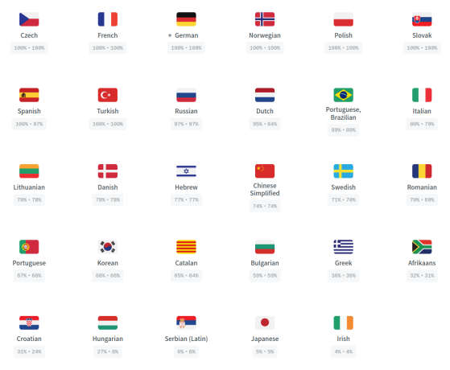
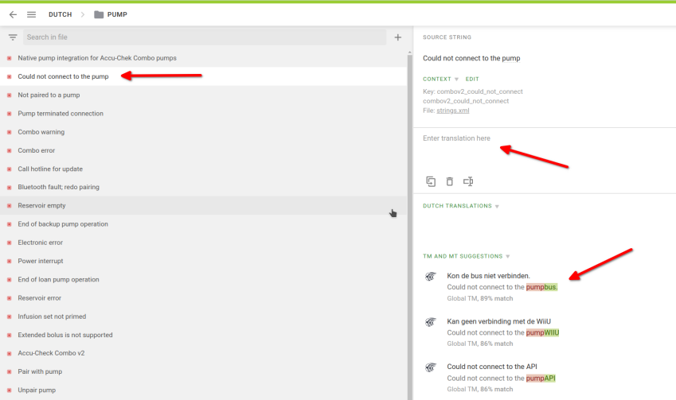

# 如何為 AAPS 應用程式或文件翻譯字串

* 要翻譯應用程式中使用的字串，請前往 <https://crowdin.com/project/androidaps>，並使用你的 GitHub 帳號登入
* 要翻譯文件，請查看 <https://crowdin.com/project/androidapsdocs>，並使用你的 GitHub 帳號登入

* 向文件團隊發送加入請求。 為此，點擊所需語言的國旗，然後在下一頁的右上角點擊“加入”按鈕。 請指定語言，提供一些關於你的資訊以及你的 AAPS 經驗，並說明你想成為翻譯者還是校對者（僅限具有翻譯技能且為進階 AAPS 用戶的人成為校對者）。

```{admonition} 審閱時間 :class: note

審閱是一個手動步驟。 作為非營利組織，我們不提供 SLA，但一般情況下審閱會在 1 天內完成。 如果沒有，請透過 Facebook 或 Discord 聯繫文件團隊。

    <br />*當我們批准你時，點擊國旗
       
    
    ## 應用程式的翻譯
    
    (translations-translate-strings-for-AAPS-app)=
    ### 為 AAPS 應用程式翻譯字串
    
    *如果你對翻譯的字串沒有偏好，只需選擇“翻譯所有”按鈕開始。 他會顯示需要翻譯的字串。
    
       ![點選Translate All]](./images/translations-click-translate-all.png)
    
    * 如果你想翻譯單個文件，請透過搜索對話框或樹狀結構查找文件，並點擊文件名開始翻譯該文件中的字串。
    
       
    
    * 透過在左側添加新翻譯文本或使用和編輯建議來翻譯句子 
    
      
    
    ### 校對 AAPS 應用程式的字串
    
    * 校對者在語言主頁面中選擇“校對”以開始校對。
    
        
    
     並批准翻譯的文本
    
        
    
    當校對者批准翻譯後，他會添加到下一版本的 AAPS 中。
    
    (translations-translation-of-the-documentation)=
    ## Translation of the documentation
    
    * Click the name of the docs page you want to translate
    
    
    
    
    * Translate sentences by sentence
    
        1. 黃色文本是你目前正在處理的文本。
    
        1. 綠色文本是已翻譯的文本。 你不需要再次翻譯這些。
    
        1. 紅色文本是仍需翻譯的文本。
    
        1. 這是你目前正在處理的原始文本
    
        1. 這是你正在準備的翻譯。 你可以從上方複製文本或選擇下方的建議之一。
    
        1. 這些是翻譯建議。 特別是，你可以看到 Crowdin 如何評價這一翻譯是否符合要求，或者這是否只是過去的內容經過文本重新排列而沒有內容更改。
        1. 按下“儲存”按鈕以儲存翻譯建議。 然後他會提交給校對者進行最終檢查。
    
    
    
    * 翻譯的頁面不會在文件中發布，直到
    
        1. 翻譯已校對
    
        1. Crowdin 和 Github 之間的同步運作已完成（每小時一次），這會為 Github 建立 PR。
    
        1. 該 PR 在 Github 中獲得批准。
    
    一般來說，這需要 1-3 天，但在假日期間可能會花費更長時間。
    
    ### 翻譯鏈接
    
    ```{admonition} 鏈接不再翻譯
    :class: note鏈接不再翻譯。 過去我們在這裡有一個主題，但由於遷移到 Markdown 和 myst_parser，我們在英文文本中顯式建立標籤，並在底層將這些標籤傳播到其他語言。
    
    

你正在翻譯代表鏈接的文本。 請注意，**不要**移除由一對 `<0></0>` 標籤表示的鏈接，或者如果在同一段中有更多數字的鏈接也不要移除。

這是校對者需要特別注意的事項！

### 校對

* 校對者必須切換到校對模式
    
    
    
    並批准翻譯的文本
    
    

* 當校對者批准翻譯後，他將被添加到下一次文件建置中，該建置沒有固定的時間表，按需進行，但通常每週一次，假期期間除外。 為加快過程，你可以通知文件團隊關於新翻譯。