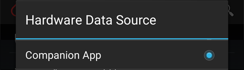
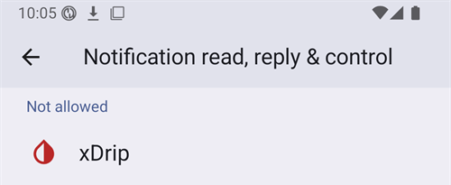
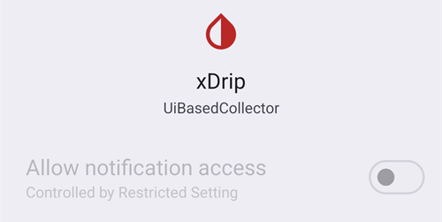
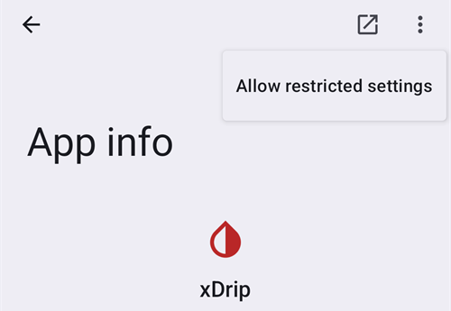
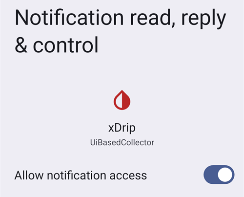
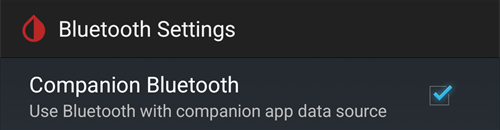

# Dexcom G7, ONE+ and Stelo


##   Fundamental in advance

Noteworthy is the fact that the G7, ONE+ and Stelo systems, compared to the G6, do not smooth the values, neither in the app, nor in the reader. More details about this [here](https://www.dexcom.com/en-us/faqs/why-does-past-cgm-data-look-different-from-past-data-on-receiver-and-follow-app).

```{admonition} Smoothing method 
Read [Smoothing method](../CompatibleCgms/SmoothingBloodGlucoseData.md) suggestions to use for Dexcom G7/ONE+/Stelo
```

## 1. xDrip (direct connection to G7, ONE+ or Stelo)

- xDrip connects to the sensor itself: uninstall the Dexcom app, as only one app can connect to the sensor. To keep the Dexcom app, use [xDrip Companion App](#DexcomG7-xdrip-companion-app) instead.
- Follow the instructions here: [xDrip G7, ONE+ and Stelo](https://navid200.github.io/xDrip/docs/Dexcom/G7.html). A recent xDrip release is required — see the linked page for the minimum version.
- Select  xDrip in [ConfigBuilder, BG Source](#Config-Builder-bg-source).

- Adjust the xDrip settings according to the explanations on the xDrip settings page  [xDrip settings](../CompatibleCgms/xDrip.md)

## 2. Build Your Own Dexcom App (G7 only)

```{admonition} Old app version
:class: warning
Dexcom BYODA is now a very old version of the app and cannot be updated. Not available for ONE+ or Stelo.
```

-   [Build Your Own Dexcom App](https://docs.google.com/forms/d/e/1FAIpQLScD76G0Y-BlL4tZljaFkjlwuqhT83QlFM5v6ZEfO7gCU98iJQ/viewform?fbzx=2196386787609383750) (BYODA) supports local broadcast to AAPS

-   This app lets you use your Dexcom G7 with any Android smartphone.
-   Uninstall the original Dexcom app
-   Install the downloaded apk
-   Enter sensor code in patched app
-   After short time BYODA should pick-up transmitter signal

(DexcomG7-xdrip-companion-app)=

## 3. xDrip Companion App (G7, ONE+ and Stelo)

The official Dexcom app stays connected to the sensor. xDrip reads the glucose values from the notifications of the Dexcom app and sends them to **AAPS**.

```{admonition} Not a trusted data source
:class: note
**AAPS** does not consider xDrip in Companion App mode a [trusted BG data source](#GettingStarted-TrustedBGSource): SMBs are not allowed all the time.
```

### Read the Dexcom app notifications

- Keep the Dexcom app installed and connected to the sensor. Its notifications must stay visible: do not silence or hide them.
- Download and install [xDrip](https://github.com/NightscoutFoundation/xDrip). Use the same glucose units in xDrip as in the Dexcom app.
- In xDrip, go to **Settings** > **Hardware Data Source** and select **Companion App**.

  

- xDrip asks for permission to read notifications. Tap **OK**, then select **xDrip** in the list and turn on **Allow notification access**.

  

- If **Allow notification access** is greyed out (*Controlled by Restricted Setting*), Android blocks it because xDrip was not installed from the Play Store:

  

  Open the xDrip app info (long press the xDrip icon > **App info**), tap the three dots menu at the top right and select **Allow restricted settings**. Then go back to the notification access screen and allow it.

  

  

- Readings appear in xDrip when the Dexcom app shows a new value. If nothing appears, you may need to start a sensor in xDrip: this has no effect on the real sensor. Stelo gives a reading every 15 minutes in this mode.

### Companion Bluetooth (G7)

When the Dexcom app is connected to a G7 sensor, xDrip can also listen to the readings the sensor sends to the Dexcom app over Bluetooth. xDrip does not pair with the sensor and you do not need to enter the sensor code: the Dexcom app stays in control.

With **Companion Bluetooth**, xDrip gets the exact time and trend of each reading from the sensor, instead of the time the notification appeared, and fills gaps when the phone was out of range (backfill).

- In xDrip, go to **Settings** > **Less common settings** > **Bluetooth Settings** and enable **Companion Bluetooth**.

  

- This does not work on all phones and Android versions. Disable it if you see problems.
- If an old Dexcom sensor is still in the phone's Bluetooth list, xDrip might listen to the wrong one: in Android **Settings** > **Connected devices**, forget sensors you no longer use.
- Companion Bluetooth is made for the G7. With ONE+ and Stelo, rely on notifications.

### Configuration in AAPS

- Select xDrip in [ConfigBuilder, BG Source](#Config-Builder-bg-source).
- Adjust the xDrip settings according to the explanations on the xDrip settings page [xDrip settings](../CompatibleCgms/xDrip.md).

## 4. Juggluco (G7 and ONE+)

Version 9.0+ required

- Disable the app previously connected to the sensor: Uninstall the app or use "Force Stop." Disable "Nearby Devices" permission in app settings. Restrict the app's battery usage.
  
- Forget the sensor in Bluetooth settings: In Android settings, find the sensor in bonded devices and select "Forget." Dexcom G7 sensor names start with DXCM.
  
- Avoid interference from other sensors: Keep old Dexcom sensors out of Bluetooth range.

- Connect the G7 sensor to Juggluco: Open Juggluco → Left menu → Photo. Scan the data matrix on the G7 sensor's applicator. Wait up to 5 minutes for Juggluco to find the sensor.

- Pairing requirements: Agree to pair the sensor with Juggluco. Ensure the screen isn’t locked during pairing. If pairing fails, wait 5 minutes before trying again.

- Exception: Wear OS watches can bond without pressing an agree button.
