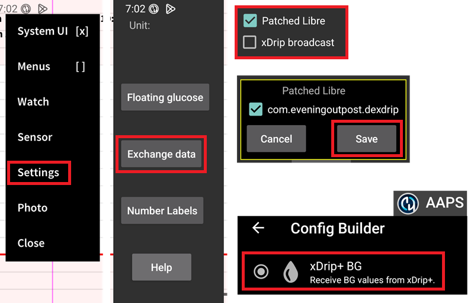

# Juggluco settings

If not already set up, then download [Juggluco](https://www.juggluco.nl/Juggluco/download.html).

Follow the [instructions](https://www.juggluco.nl/Jugglucohelp/introhelp.html) to connect your sensor.

## Basic settings for all CGM systems

### Disable Nightscout uploader

Starting with AAPS 3.2, you shouldn't let any other app upload data (blood glucose and treatments) to Nightscout.

Disable any active uploader to Nightscout in Juggluco.

## Juggluco to AAPS

Juggluco can send blood glucose directly to AAPS, enabling SMBs always if you are using a [trusted sensor](#GettingStarted-TrustedBGSource).

When using a Libre 2/2+/3/3+ sensor, minute-by-minute readings will be sent to AAPS but will not trigger minute-by-minute calculations in AAPS.

Enable xDrip broadcast in Juggluco (do not enable Patched Libre), confirm and save the AAPS package information. Select the xDrip+ BG data source in AAPS.

Apply sufficient [smoothing](./SmoothingBloodGlucoseData.md) in AAPS.

## Juggluco to xDrip+

Juggluco can send blood glucose to xDrip+ which will then send them to AAPS.

Enable Patched Libre in Juggluco (do not enable xDrip broadcast), confirm and save the dexdrip package information. Select the xDrip+ BG data source in AAPS.

Apply sufficient [smoothing](./SmoothingBloodGlucoseData.md) in AAPS if necessary, when using a Libre 2/2+/3/3+ sensor, xDrip+ will average the minute-by-minute to 5 minutes readings and also smoothen them.

